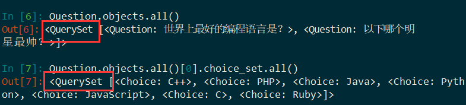
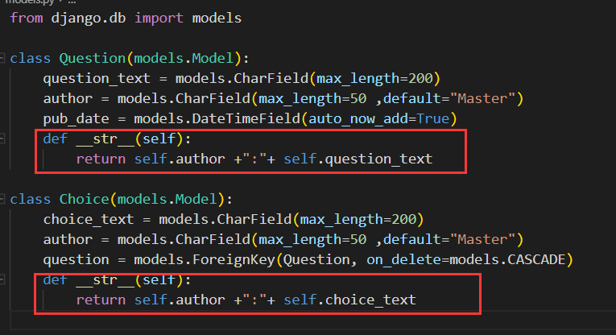
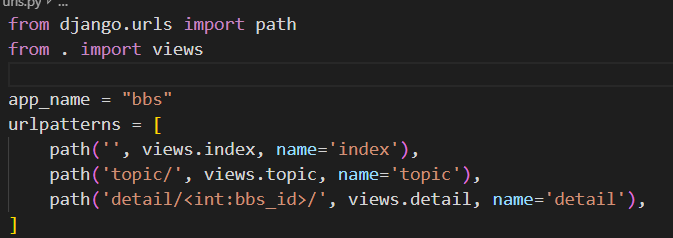
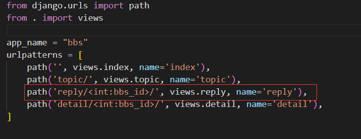
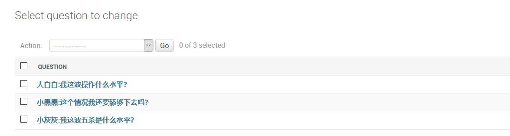
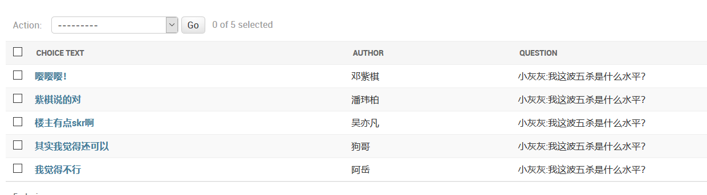

## *我们正处于互联网最好的时代*

本博客的Github地址是：https://github.com/Masterpaopao/Master-Blog

转载请标明原Github出处，觉得不错请点个star支持！

* [一\.环境安装](#%E4%B8%80%E7%8E%AF%E5%A2%83%E5%AE%89%E8%A3%85)
    * [1\.特点](#1%E7%89%B9%E7%82%B9)
    * [2\.版本](#2%E7%89%88%E6%9C%AC)
* [二\.文档学习](#%E4%BA%8C%E6%96%87%E6%A1%A3%E5%AD%A6%E4%B9%A0)
    * [1\.学习链接](#1%E5%AD%A6%E4%B9%A0%E9%93%BE%E6%8E%A5)
    * [2\.创建项目](#2%E5%88%9B%E5%BB%BA%E9%A1%B9%E7%9B%AE)
    * [3\.生成数据库](#3%E7%94%9F%E6%88%90%E6%95%B0%E6%8D%AE%E5%BA%93)
* [三\.投票应用](#%E4%B8%89%E6%8A%95%E7%A5%A8%E5%BA%94%E7%94%A8)
    * [1\.添加应用](#1%E6%B7%BB%E5%8A%A0%E5%BA%94%E7%94%A8)
    * [2\.创建模型](#2%E5%88%9B%E5%BB%BA%E6%A8%A1%E5%9E%8B)
    * [3\.激活模型](#3%E6%BF%80%E6%B4%BB%E6%A8%A1%E5%9E%8B)
    * [4\.命令交互](#4%E5%91%BD%E4%BB%A4%E4%BA%A4%E4%BA%92)
    * [5\.管理页面](#5%E7%AE%A1%E7%90%86%E9%A1%B5%E9%9D%A2)
    * [6\.更多视图](#6%E6%9B%B4%E5%A4%9A%E8%A7%86%E5%9B%BE)
    * [7\.修改URL](#7%E4%BF%AE%E6%94%B9url)
    * [8\.完善表单](#8%E5%AE%8C%E5%96%84%E8%A1%A8%E5%8D%95)
* [四\.BBS应用](#%E5%9B%9Bbbs%E5%BA%94%E7%94%A8)
    * [1\.学习须知](#1%E5%AD%A6%E4%B9%A0%E9%A1%BB%E7%9F%A5)
    * [2\.模型原理](#2%E6%A8%A1%E5%9E%8B%E5%8E%9F%E7%90%86)
    * [3\.模型设计](#3%E6%A8%A1%E5%9E%8B%E8%AE%BE%E8%AE%A1)
    * [4\.settings\.py](#4settingspy)
    * [5\.激活模块](#5%E6%BF%80%E6%B4%BB%E6%A8%A1%E5%9D%97)
    * [6\.认识MTV](#6%E8%AE%A4%E8%AF%86mtv)
    * [7\.API交互](#7api%E4%BA%A4%E4%BA%92)
    * [8\.路由设计](#8%E8%B7%AF%E7%94%B1%E8%AE%BE%E8%AE%A1)
    * [9\.复制轮子](#9%E5%A4%8D%E5%88%B6%E8%BD%AE%E5%AD%90)
    * [10\.从V到T](#10%E4%BB%8Ev%E5%88%B0t)
    * [11\.模板语言](#11%E6%A8%A1%E6%9D%BF%E8%AF%AD%E8%A8%80)
    * [12\.解析投票](#12%E8%A7%A3%E6%9E%90%E6%8A%95%E7%A5%A8)
    * [13\.提交评论](#13%E6%8F%90%E4%BA%A4%E8%AF%84%E8%AE%BA)
    * [14\.管理页面](#14%E7%AE%A1%E7%90%86%E9%A1%B5%E9%9D%A2)
    * [15\.搞定首页](#15%E6%90%9E%E5%AE%9A%E9%A6%96%E9%A1%B5)
    * [16\.最终总结](#16%E6%9C%80%E7%BB%88%E6%80%BB%E7%BB%93)

&nbsp;

## 一.环境安装

#### 1.特点

1）满足快速开发与后台开发人员的严格要求

2）集中精力编写应用程序，无需重复造轮子

3）处理常见的开发任务如用户身份验证和内容管理等

4）重视安全性，防止SQL注入、恶意脚本与请求等

5）丰富的拓展性满足频繁变更要求

6）全能模板特性，能够做各种各样的网站

&nbsp;

#### 2.版本

Python3.7 + Django2.1

我们会在ConEmu+Miniconda上进行配置Django的环境。:

（不懂的同学请移步到我的Relearn-Python博客学习第一篇的搭建环境教程）

在ConEmu中输入这条命令（BBS是项目的架构）：cc up2u-bbs python=3.7 django=2.1


然后安装完毕以后，你就可以coa up2u-bbs进入这个环境，开始你的Django学习之旅。


&nbsp;

## 二.文档学习

#### 1.学习链接

学习的地方必须是官网，官网里面就含有汉化的教程。

https://docs.djangoproject.com/zh-hans/2.1/


我们这篇博客会在这个快速入门的文档上面进行学习，搭建属于我们的Django项目!

&nbsp;

#### 2.创建项目

在创建项目之前我们可以看看当前cmu的路径是C:\Users\hp

难道我们的Django项目就放在这个地方吗，毫无疑问肯定不是，所以我们需要切换路径

```
D:
cd D:\Program Files\PythonCode\django
```


当我们切换好路径以后，我们就可以照着官方文档去创建一个项目了


注意，这个命名的时候千万不要用Django或者Python关键字来命令，那样会引起错误。

输入```django-admin startproject mysite```自动创建一个文件夹与py配置文件。

创建成功以后，输入```cd mysite```，进入这个文件夹：


如果你刚好安装了个vscode，不妨就继续输入```code .```这条命令，打开这个项目工程吧!

（打开vscode的时候，千万别忘记先切换Python环境到up2u-bbs哦！）

打开以后，你会发现左侧栏有一个mysite文件夹与manage.py在项目里。


&nbsp;

这些玩意到底是什么，我们可以回到官方文档继续阅读，它会告诉我们答案：


请你好好仔细阅读文档，或者你懒得打开网站，就读一下这张图片。

这些py文件非常的重要，它们是Django项目的依赖设置。

当你读完以后，你可以回到ConEmu，测试一下你的Django项目是否启动成功：

输入```python manage.py runserver```来启动Django项目，不出意外你会看到这样的玩意


请忽略红色的报错，这只是有关未应用最新数据库迁移的警告，稍后我们处理数据库。

然后打开http://127.0.0.1:8000/


如果你看到这样的网页，这代表你的Django简易项目成功启动了，我们正式进入开发之旅。

&nbsp;

#### 3.生成数据库

我们启动项目以后，可以发现vscode项目里生成了一个文件叫做db.sqlite3

这个db一看就是database的缩写，是数据库的意思，正好可以解决一下上面的报错

我们按ctrl+c退出正在运行的Django报错，按照上面红色报错的指引，

输入```python manage.py migrate```配置数据库：


然后再输入```python manage.py runserver```重新启动Django项目即可。

&nbsp;

事实上我们可以仔细探讨一下这个数据库，在vscode中查找一下py文件

发现在settings.py中找到了相关的配置信息，发现这是一个引擎文件：


这个时候我们自然需要一个可视化管理数据库的工具DB Browser for SQLite。

https://download.sqlitebrowser.org/DB.Browser.for.SQLite-3.11.2-win64.msi

请将这个链接复制到迅雷下载，有会员的话就更nice了。

下载成功以后，启动一下这个软件，点击打开数据库，找到Django项目的db.sqlite3文件启动：


我们的生成数据库与控制数据库的目的就完成了，这些暂时搁浅，后面会用。

&nbsp;

## 三.投票应用

#### 1.添加应用

mysite项目只是我们的入门启动项目，我们可以再复习一遍上面的操作，重新创建一个项目

因为我们是up2u-bbs环境，所以我们真正的项目文件应该命名为up2u_bbs（文件命名不允许横杠）

因此，我们输入```cd ..```回到上一级目录，然后输入```django-admin startproject up2u_bbs```创建新的工程。

再然后输入```cd up2u_bbs```进入我们新创建的Django工程文件，```code .```用vscode启动此项目

&nbsp;

现在，我们根据官方文档的指引，去做一个投票应用网站：


就根据它所描述的，输入```python manage.py startapp polls```，完成以后你应当在vscode看见这样：


这个polls目录就包括了投票应用的全部内容。

然后往下浏览，开始编写我们的第一个Django视图，打开polls/views.py，编写以下的Python代码:

```python
from django.shortcuts import render
from django.http import HttpResponse

# Create your views here.
def index(request):
    return HttpResponse("大家好啊，我们正在学习Django呢！")
```

然后想要看见上面代码显示的视图，需要将一个url映射到这个视图去展示：

所以我们在polls文件夹下面，新建一个urls.py文件，然后编写Python代码如下：

```python
from django.urls import path
from . import views

urlpatterns = [
    path('', views.index, name='index'),
]
```

这个文件是什么意思呢，就是通过urls.py的代码连接到views视图的index函数视图。

然后这个还需要被送往到总urls.py文件，也就是up2u_bbs下的urls.py，将代码补全：

```python
path('polls/', include('polls.urls')),
```


这些准备工作就绪以后，回到ConEmu去启动```python manage.py runserver```

（这个时候还没生成数据库，所以要先弄出db.sqlite3文件）

打开我们的网站，在url后面加进去/polls/，我们就可以看到我们创造了新的网页：


&nbsp;

看明白了吗，我们所做的操作就是添加了一个新的网页站点，那么这个过程到底是怎么样的呢?

```
python manage.py startapp polls（创建一个应用） -->

polls/views.py（在当前应用创建一个视图）--> 

polls/urls.py（将视图映射当前应用的URLS）--> 

up2u_bbs/urls.py（将这个应用的URLS映射到总项目的URLS）-->

python manage.py runserver（启动这个总项目去查看应用的内容）
```

&nbsp;

#### 2.创建模型

先按ctrl+c退出Django项目，输入```python manage.py migrate```生成数据库，然后用SQLite软件控制


在这个简单的投票应用中，需要创建两个模型：问题 Question和选项 Choice。Question 模型包括问题描述和发布时间。Choice 模型有两个字段，选项描述和当前得票数。每个选项属于一个问题。


模型是一切的起源，是一个非常重要的概念，取决了你要做什么。

&nbsp;

模型在python中就是一个类，我们在polls/models.py中拷贝以下代码进去：

```python
from django.db import models


class Question(models.Model):
    question_text = models.CharField(max_length=200)
    pub_date = models.DateTimeField('date published')


class Choice(models.Model):
    question = models.ForeignKey(Question, on_delete=models.CASCADE)
    choice_text = models.CharField(max_length=200)
    votes = models.IntegerField(default=0)
```

我们可以发现这两个模型一共有5个变量，换句话说是字段，这些字段全是Field类的实例。

括号参数里面是告诉了Django每个字段要处理的数据类型。

然而最值得我们注意的是Choice模型下的question变量，使用了ForeignKey定义：


这就是外键的意思，这将告诉 Django，每个Choice对象都关联到一个Question对象。这不就好比一道题目有四个选项嘛，就是这个意思。Django 支持所有常用的数据库关系：多对一、多对多和一对一。

&nbsp;

#### 3.激活模型

创建了模型之后应该干嘛？当然是激活模型啊！

激活模型成功之后，Django就可以根据这个模型去为这个应用创建数据库，这样就可以使用投票应用，但是在此之前，我们需要将polls应用安装到我们的Django项目。

（这句话暗示了Django的应用是可插拔的，可以将一个应用安装到不同的项目之中，类似于Vue的组件开发）

在up2u_bbs/settings.py中将```'polls.apps.PollsConfig'```加入进去：


然后你的Django项目就会包含polls应用，回到ConEmu让配置生效

输入```python manage.py makemigrations polls```，不出意外你会看到这个：


这是成功创建两个模型的意思，但是你发现没，这些被存储在0001_initial.py的py文件里。

我们可以看看这个文件的芳容：


这就是一个活生生的数据库配置文件。

但是这个时候，你会突然发现，这只是polls应用的数据库配置文件，我们还没有将其应用迁移到总项目数据库。

输入```python manage.py migrate```，你可以看到这个：


至于为什么要这样做，我觉得官方文档解释的非常漂亮，直接截图过来吧


这个时候，我们就可以打开SQLite软件，目前我还没研究出来笔记本怎么刷新这个数据库，我选择的是重新打开数据库文件来进行刷新；有机械键盘的直接按F5刷新，我们可以发现新产生了两个表和一个索引


当然，这两个表肯定是空的，还需要我们的后续进一步操作。

&nbsp;

所以我们回顾一下上面的操作，我们是怎么样创建模型并激活的？

```
如果还没有db.sqlite3文件，先输入python manage.py migrate生成数据库 -->
polls/models.py（创建模型，编写Python代码） -->
up2u_bbs/settings.py（将polls应用加入配置文件） -->
python manage.py makemigrations polls（产生polls应用的数据库配置文件） -->
python manage.py migrate（将配置文件进行迁移应用到全局） -->
使用SQLite软件验证是否创表成功
```

&nbsp;

#### 4.命令交互

模型激活之后，我们需要进入交互式Python命令行，尝试一下 Django 为你创建的各种 API。

如果你是我Relearn-Python博客系列的读者，你肯定第一时间会想到ipython，更为优秀的命令行存在。

所以我们直接```pip install ipython```吧！

安装完之后输入```python manage.py shell```进入命令行交互模式，你会看到这样：


然后依次输入以下的交互命令：

```python
from polls.models import Question, Choice
from django.utils import timezone
q = Question(question_text = "最好的编程语言是什么？",pub_date = timezone.now())
q.save()
```


这四条命令到底是什么意思呢，其实你也能直接看得出来，这是创造了一个提问，还引入了时间模块，标注了这个题目被创建的时间点，你在软件中点击查看polls_question表也能看到：


q变量就相当于你所创建的提问题目的变量，你可以去访问它的id与时间点：


你甚至还能修改它的提问题目，但是你别忘记了要save()一下，你还能在软件里查到这个q的改动：


最后，你可以输入```Question.objects.all()```查看当前所有的提问题目对象：


但是官方文档说，这个对象的结果没有什么帮助，我们需要修改下polls/model.py，这样能够帮助我们更为直观地感受到提问的问题是什么：


所以根据它的说法，我们回到vscode将这两段def函数加进去：


保存改动以后，在ipython输入exit()，再重新```python manage.py shell```启动进入，再输入

```python
from polls.models import Question, Choice
Question.objects.all()
```

可以发现，返回的结果更为直观：


这就是一个小小的技巧，使用```__str__```函数来完成，将返回的结果从数量修改成text文本。

当然了，还有另外一个小技巧，也是官方文档提供的，你可以直接更新这些代码进去，然后重启shell：


这个小技巧的目的就是给Question对象创造一个自定义的方法，将在后面中进行使用，从代码的意思看得明白，这是判断是否是被发布时间在一天时间内的自定义方法。

&nbsp;

我们现在可以接触一些简单的筛选问题的方法，目的是为了抓取指定对象：

```python
Question.objects.filter(id=1)
Question.objects.filter(question_text__startswith='世界')
```

值得一提的是第二个筛选方法，它的原型其实是question_text.startswith('世界')，在django中成了双下划线和等于号的形式，这个也是一个需要大家的一个记忆点。


也可以通过timezone模块，来筛选创建时间是今年的问题：

```python
from django.utils import timezone
current_year = timezone.now().year
Question.objects.get(pub_date__year=current_year)
```


注意，我们这个不再是filter()方法，因为你要弄清楚filter()返回的结果是一个列表，还需要索引操作抓取，而get()却能将找到的结果作为返回值，进行使用。

所以，可以再输入一条命令```q = Question.objects.get(pub_date__year=current_year)```获取到这个对象：


当然了，获取到这个对象的方法还可以是```q = Question.objects.get(pk=1)```

这个方法是官方推荐的，等价于Question.objects.get(id=1)，我们还可以验证一下刚才弄的自定义方法：


好了，现在我们已经学会了如何从现有Question对象里面获取到想要的具体变量对象，接下来该配置选项上去了，也就是说，给这个q提问对象配置上几个选择选项。

&nbsp;

输入```q.choice_set.all()```查询此提问对象的选项，肯定是空的，因为我们还没配置：


如何添加选项呢，根据官方文档的描述，应当使用的方法是```q.choice_set.create()```

所以我们可以一口气配置四个选项进去：

```python
q.choice_set.create(choice_text='C++', votes=0)
q.choice_set.create(choice_text='PHP', votes=0)
q.choice_set.create(choice_text='Java', votes=0)
q.choice_set.create(choice_text='Python', votes=0)
```

然后再输入``q.choice_set.all()``查看当前的选项：


（这个votes=0是默认票数的意思，自然是设置为0）

当然了，我们的选项是可以作为对象进行操作的,再创建一个选项，等下会进行删除

输入```c = q.choice_set.create(choice_text='Master', votes=0)```

我们就拿到了c变量，可以进行一系列的操作：


当然了，Master并不是语言，我们可以删掉这个选项，输入```c.delete()```就可以删除


当然了，也可以通过filter()方法去找到选项对象


最后的最后，请灵活使用```q.choice_set.all()```与```q.choice_set.count()```查看选项的情况。


&nbsp;

看明白了吗，我们使用命令交互的方式去创建提问的题目与提问的选项，这个过程可以在SQLite看到


question_id都是1，说明这些选项都属于第一道提问。我们在这儿做一个小节总结：

```
1 - from polls.models import Question, Choice（引入题目与选项的两个模型）
2 - q = Question(question_text = "最好的编程语言是什么？",pub_date = timezone.now())
3 - q.save()（创建好题目以后肯定要保存生效一下）
4 - Question.objects.filter(question_text__startswith='世界')（注意startswith的转化）
5 - q = Question.objects.get(pk=1)（官方推荐的获取对象方式）
6 - q.choice_set.create(choice_text='C++', votes=0)（根据字段创建一个选项）
7 - c.delete()（选项变量可以作为对象，进行自删操作）
8 - c = q.choice_set.filter(choice_text__startswith='Master')[0]（抓取到某个选项作为对象）
9 - q.choice_set.all()（查询这个题目所有选项的信息）
10 - q.choice_set.count()（查询这个题目的选项数量）
```

&nbsp;

#### 5.管理页面

当我们搞定模型，题目与选项之后，我们该来搞一搞页面了

（页面上面同样也能进行后台设置，比命令交互便捷许多，但前者依旧是必学技能）

搞页面必然有后台管理页面，需要配置一个管理员帐号，这个时候我们并不需要关掉ipython

可以选择新增一个cmu窗口，进行配置管理员

输入```python manage.py createsuperuser```进行配置

输入名字，邮箱可以不填直接回车，密码不能太过于简单：


然后你就可以```python manage.py runserver ```，进入这个网址

然后url的后面输入/admin/站点，会来到一个登陆界面，输入账号密码登陆上去是这样的界面


成功了以后，我们能干啥？当然是将投票应用加入进去，也就是告诉管理页面，问题 Question`对象需要被管理。所以我们得编辑一下polls/admin.py：

```python
from django.contrib import admin

from .models import Question

admin.site.register(Question)
```

这段代码的意思就是，向管理员注册问题Question类，保存修改以后，我们回到管理页面，刷新一下


发现Questions类成功被注册，当然了，Choice类也不能忘记

在polls/admin.py补上这两句```from .models import Choice```和```admin.site.register(Choice)```


这个方法要比命令交互快很多，可以直接在网页端上面进行修改题目和选项。当然了，这是windows专属的，如果在真实开发环境，那是linux，肯定只能用命令交互的方式去修改题目与选项。

现在我们进行网页可视化操作，再给我们的题目添加一个选项：

进入Choice类页面，点击右上角的ADD CHOICE


然后选择好题目，输入Ruby语言，Votes当然还设置为0，点击保存完成添加选项的步骤：


这样一来，Ruby选项就成功添加进去了，我们可以回到ipython命令行，输入```q.choice_set.all()```检查下

可以发现，后台确实是同步成功了：


当然了，命令交互依旧是优先使用，能熟练是最好的。

因为在真实的开发环境中，肯定还是linux上面，可没有网页让你便捷操作。

&nbsp;

#### 6.更多视图

视图在应用中是非常重要的组成部分，它能集成网页展示与功能实现于一身。

官方解释视图的重要性就很通俗易懂：


好了，让我们给投票应用编写更多的视图吧！

在polls/views.py中，编写三个视图，实际上就是三个python函数，代码如下：

```python
def detail(request, question_id):
    return HttpResponse("你正在看这个投票：%s"%question_id)

def results(request, question_id):
    response = "你正在看投票的结果：%s"
    return HttpResponse(response%question_id)

def vote(request, question_id):
    return HttpResponse("你正在参与这个投票：%s"%question_id)
```

然后该干什么啊，把这些新试图添加进去polls/urls.py，形成一个映射：

```python
path('<int:question_id>/', views.detail, name='detail'),
path('<int:question_id>/results/', views.results, name='results'),
path('<int:question_id>/vote/', views.vote, name='vote'),
```


这个```<int:question_id>```是什么你不必疑惑，这个相当于一个转换器，可以转换到1，相当于第1个问题


然后你就可以在url输入一下：http://127.0.0.1:8000/polls/1/vote/

能看到有一段你写的文字就说明映射成功！有人可能就问了，我是不是少了一步，映射到总urls.py？

大哥，那是应用的urls映射，我的polls应用早就被加入到总urls.py，无需下一步操作！

&nbsp;

当然了，以上的操作只是配置操作，完成了urls映射的配置，我们接下来编写一个真正有用的视图：

其实就是index()函数的视图，需要修改了，不再是简单的打招呼，将我们的投票问题展示上去

```python
from .models import Question


def index(request):
    latest_question_list = Question.objects.order_by('-pub_date')[:5]
    output = ', '.join([q.question_text for q in latest_question_list])
    return HttpResponse(output)
```

现在的话，新的问题就又来了，我如果这样写，就相当于页面的设计写死在视图函数的代码里的，如果你想修改网页，你得重新编辑修改python代码，这个做事效率无疑是巨慢的。

所以让我们使用 Django 的模板系统，只要创建一个视图，就可以将页面的设计从代码中分离出来。

在polls应用下，创建个templates/polls/index.html，为什么要这样的目录结构，官方给出了解释


这是没办法的，Python就是怕遇到重名的文件夹玩意，所以我们要尽量地去避开：


```html

    <ul>
    
        <li><a href="/polls/{{ question.id }}/">{{ question.question_text }}</a></li>
    
    </ul>

    <p>No polls are available.</p>

```

其实我也看不懂这段代码，反正直接拷贝进去index.html就行了，以后总会慢慢弄懂的！

这个时候，就可以再更新一下polls/views.py文件了

```python
from django.template import loader

def index(request):
    latest_question_list = Question.objects.order_by('-pub_date')[:5]
    template = loader.get_template('polls/index.html')
    context = {
        'latest_question_list': latest_question_list,
    }
    return HttpResponse(template.render(context, request))
```

这个时候，你的views.py文件就会是这个样子的：


这个index()函数代码到底完成了一个怎么样的过程呢？

首先就是获取到Question对象的提问实例，提取出根据时间排序的前5个成为列表，然后加载polls/index.html模板文件，并且向它传递一个上下文(context)，将列表参数传递进去，这个上下文是一个字典，它将模板内的变量映射为 Python 对象。加载之后，再return返回来模板渲染加载后的结果显示在网页。

所以，打开http://127.0.0.1:8000/polls/

你会看到这个模板已经被渲染成功了！


&nbsp;

接下来就轮到详情视图，还记得那个404吗，没错，我们也要给详情页整一个404

当你访问不存在的question_id的时候，自动抛出404的异常页面进行展示，我们可以把这个过程加入到detail视图

```python
from django.http import Http404

def detail(request, question_id):
    try:
        question = Question.objects.get(pk=question_id)
    except Question.DoesNotExist:
        raise Http404("这个问题的id不存在！")
    return render(request, 'polls/detail.html', {'question': question})
```

你肯定也看得懂这段代码，使用了异常处理，存在就正常返回，不存在就抛出Http404异常。

下一步可别忘了，还是要再弄一个polls/templates/polls/detail.html，进行代码分离：

```python
{{ question }}
```

这样一来，我们就可以测试一下这个detail视图了

我们可以输入http://127.0.0.1:8000/polls/2/

不出意外的话，Http404异常应该是正常抛出的，效果如下:


当然了，抛出404异常还有个更加简洁的函数来完成，了解一下或者去尝试一下都可以:


我们虽然搞定了detail()视图的模板渲染与404异常抛出，但是我们的页面设计还需要完善

意思就是说，在进入详情页之后，应当展示出投票的标题与投票的选项，而不是干巴巴的如下:


所以我们需要在detail.html完善代码，编写我们的前端设计：

```html
<h1>{{ question.question_text }}</h1>
<ul>

    <li>{{ choice.choice_text }}</li>

</ul>
```

这段代码是什么意思呢，就是将这个投票的标题以h1标签展示，投票的选项以无序列表的形式展示。

这个时候，我们的详情页就发生了变化：


正是这个地方，我们正式接触到了全栈开发的雏形，我们会在后面一步步完善自身的能力。

&nbsp;

#### 7.修改URL

url的完善也是非常有必要的，我们来看看index.html里的这段代码:


有没有觉得这儿直接写死了url地址？如果我在后面要修改url的时候，是不是修改起来很麻烦？

如果我想改成/polls/questions/1/，是不是得先改下polls/urls.py，然后再来改HTML里面的代码？

这样的写法肯定是不好，我们需要换个写法，让这个地方链接到urls.py里面的设置：

```html
<li><a href="">{{ question.question_text }}</a></li>
```


这样一来，你如果想修改url的时候，只需要在polls/urls.py任意修改即可，非常便捷。

&nbsp;

当然了，上面只考虑到了一个应用的情况，然而Django项目是可以有很多个应用的，那么这些应用如果都有detail视图，Python应该如何分辨重名的url呢？

也就是``````标签，它到底对应哪个应用呢？所以我们还是需要继续操作：


我们回到vscode将```app_name = 'polls'```加入到polls/urls.py中,然后回到index.html文件修改这个地方


这样一来，Python就能准确地区分哪些视图属于哪些应用了。

&nbsp;

#### 8.完善表单

项目设计已经到了尾声，我们应该让这个应用变成真正的投票应用了，也就是设计出表单与按钮，表单肯定是radio单选框属性，然后按钮是submit提交属性。

这个修改过程，肯定还是在detail视图进行，毕竟你在首页点击标题进去之后，就可以开始投票了啊！

我们来看看detail.html的代码应该如何被更新：

```python
<h1>{{ question.question_text }}</h1>

<p><strong>{{ error_message }}</strong></p>

<form action="" method="post">


    <input type="radio" name="choice" id="choice{{ forloop.counter }}" value="{{ choice.id }}">
    <label for="choice{{ forloop.counter }}">{{ choice.choice_text }}</label><br>

<input type="submit" value="Vote">
</form>
```

如果你没有html基础，那真是不好的消息，但事实上这段代码也没那么难看懂。

1）第二行代码就是如果投票报错，会返回error_message，网页显示报错信息

2）表单是用来POST提交数据的，也就是说，POST用来改变服务器端数据的手段，这是常识

3）属于Django的安全特性，防止跨站点请求伪造的手段

4）forloop.counter是for标签循环多少次的当前值，所以选项的id会是choice1、choice2等

5）类似于for循环的边界，如果不用的话，会把下面的代码一并带入循环

如果你看懂了我这5点，这说明你的理解天赋还是到位的，这段代码属于模板语言，我们会在后面进行一个系统地学习，直到我们能玩转模板语言，到那个时候我们就就拥有开发Django项目的能力了。

当你使用这段代码的时候，你会发现你的网页端已经发生了变化:


已经很有意思了，我们继续下一步的操作，就是解决vote投票按钮，以及vote视图显示投票的结果。

我们的views.py中只剩下vote()视图函数没有进行编辑了:

```python
from django.http import HttpResponseRedirect
from django.shortcuts import get_object_or_404
from django.urls import reverse
from .models import Choice

def vote(request, question_id):
    question = get_object_or_404(Question, pk=question_id)
    try:
        selected_choice = question.choice_set.get(pk=request.POST['choice'])
    except (KeyError, Choice.DoesNotExist):
        # Redisplay the question voting form.
        return render(request, 'polls/detail.html', {
            'question': question,
            'error_message': "你还没选择一个选项呢！",
        })
    else:
        selected_choice.votes += 1
        selected_choice.save()
        return HttpResponseRedirect(reverse('polls:results', args=(question.id,)))
```

这段代码又会是什么意思呢，可以发现，我们针对404采用了那个更为便捷的函数get_object_or_404()，函数名字本身就通俗易懂，找到就成对象，找不到就返回404异常，然后我们get()到detail.html那边传来的POST请求，这里面含有选项的具体信息，然后给它的votes参数加上1，最后还要进行保存结果。

except代码块那儿就很好懂了，就是你如果啥都不选直接投票，会抛出个error_message参数表示异常，正好打印在detail.html里面的```<p><strong>{{ error_message }}</strong></p>```这儿，完成首尾呼应。

&nbsp;

vote视图函数搞定了，已经启动了后台的计数功能，现在我们应该修改results视图与results的html页面，让后台计数的结果打印在页面上。先来编辑下polls/views.py里面的results函数:

```python
def results(request, question_id):
    question = get_object_or_404(Question, pk=question_id)
    return render(request, 'polls/results.html', {'question': question})
```

你们可能就有疑问了，这个results该如何接收到参数呢，答案就在vote视图函数的最后一行：


然后我们就编辑polls/templates/polls/results.html，将以下的代码传授进去：

```python
<h1>{{ question.question_text }}</h1>

<ul>

    <li>{{ choice.choice_text }} -- {{ choice.votes }} vote{{ choice.votes|pluralize }}</li>

</ul>

<a href="">还需要继续投票吗？</a>
```

这段代码现在对你来说，已经变得非常通俗易懂了，我就不再过多解释了。

然后你就可以在网页端进行投票了，我投票了三次之后，最后的结果就是这样的：


至此，我们已经根据官方文档，完成了投票应用的项目编写，也没必要深入下去了，后面无非是自动化测试，定义css，完善前端页面，打包应用等等，因为我们的目的是快速入门，快速上手感受一下，所以学到这个地步就可以了。我们接下来就是进入真正的实战，从0开发，锻炼自己的Django基础知识。

&nbsp;

## 四.BBS应用

#### 1.学习须知

在前面，我们按照官方文档过了一遍投票应用的学习，效果还是不错的。

至少我们能够感受到完整的一个Django开发流程，虽然真实开发环境只会更难。

现在，我们读一下投票应用的总结流程，再次过一遍Django的开发流程。

| 序   | 详细操作与命令                                               |
| ---- | ------------------------------------------------------------ |
| 1    | 创建Django环境：cc up2u-bbs python=3.7 django=2.1            |
| 2    | 创建Django项目：django-admin startproject up2u-bbs           |
| 3    | Vscode启动这个项目：code .                                   |
| 4    | 运行这个Django项目：python manage.py runserver               |
| 5    | 配置数据库文件：python manage.py migrate                     |
| 6    | 添加polls应用：python manage.py startapp polls               |
| 7    | 配置polls应用的urls： polls/urls.py --> up2u_bbs/urls.py     |
| 8    | 创建应用的模型：编辑polls/models.py                          |
| 9    | 激活模型的数据库：添加参数进up2u_bbs/settings.py             |
| 10   | 生成应用的数据库迁移文件：python manage.py makemigrations polls |
| 11   | 让应用的数据库迁移文件生效：python manage.py migrate         |
| 12   | 安装更好的Python命令交互shell： pip install ipython          |
| 13   | 进入Django的命令交互API： python manage.py shell             |
| 14   | 注册管理页面账户：python manage.py createsuperuser           |
| 15   | 向管理页面注册模型：编辑polls/admin.py                       |
| 16   | 完善更多视图：编辑polls/views.py                             |
| 17   | 将视图呈现到html：创建polls/templates/polls/xxx.html，避免python遇到重名问题 |
| 18   | 使用更灵活的url格式：          |
| 19   | 多应用时的最终url格式：添加app_name到polls/urls.py，然后改成 |
| 20   | 完善页面逻辑：灵活使用表单，使用GET从服务器端获取数据，使用POST发送数据到服务器端 |

&nbsp;

现在，我们来开发一个BBS网络论坛，这是一个实战的项目，从0开发，锻炼逻辑！

我们设计这个的项目的整个流程肯定还是跟官方文档差不多，无非还是遵循：

模型设计 --> 配置settings.py --> 创建数据库  --> 命令交互数据操作 --> 路由设计 --> 创建视图 --> 加载模板

我建议大家可以背下这条路线，虽然不同的项目有不同的详细路线，但基本都基于这个路线。

OK，话不多说，让我们开始启动新项目的编程！

&nbsp;

#### 2.模型原理

模型设计是个非常重要的部分，是一切的基石，我们先分析一下投票应用的两个模型吧：

首先```from django.db import models```是必须的，引入models模块进行模型设计


我们可以看到，一共四个字段，它们都是怎么命名的，都是models.XXXField()这种形式，对吗？

我们正好也可以学习一下，有哪些字段：

- IntegerField，从-2147483648到2147483648的整数字段
- BigIntegerField，-9223372036854775808到9223372036854775807的整数字段
- FloatField，浮点数字段，含小数点的数字
- CharField，字符串字段，max_length是个很重要的参数，设置为最大长度
- TextField，可以理解为大型的字符串字段，或者说是文本字段，可含大量文本
- DateField，日期字段，原型是Python的datetime.date实例
- DatetimeField，日期和时间字段，原型是Python的datetime.datetime实例
- EmailField,，邮箱字段，检查该值是否为有效的电子邮件地址

事实上，字段是非常多的，我挑了几个比较常用的，都是值得记忆的字段，更多的字段请自行阅读:

https://docs.djangoproject.com/zh-hans/2.1/ref/models/fields/

当然了，Choice类里面的question变量，实际上也是一种字段，这个叫做关系字段。

我们就列出三种关系字段，一共有三种，同样是建议背诵的：

- ForeignKey，多对一的关系字段，需要两个位置参数，第一个参数指定哪个类一对多
- ManyToManyField，多对多的关系字段，需要一个类作为参数就可以多对多
- OneToOneField，一对一的关系字段，类似于主键关系

我觉得吧，模型设计其实就是个编写数据表的过程，反映出几对几的映射关系的过程！

所以拥有SQL基础的同学对于这块肯定上手地非常快！

总之不要害怕这部分的知识吃不透，这只是时间问题，做的项目多了，模型设计自然就会了！

&nbsp;

#### 3.模型设计

然后我们弄明白这个模型设计的原理之后，大概知道了怎么样去编写代码，我们现在就要准备创建应用了，没错，我们还是基于原来的up2u_bbs的项目基础上，再添加一个bbs应用，进行开发就行了！

在cmu输入```python manage.py startapp bbs```，将bbs应用添加进去

然后在vscode中打开bbs/models.py，开始设计bbs所需要用到的模型：

&nbsp;

先反思一下这个BBS是不是跟上面投票应用的模型很像？

BBS的帖子主题等同于投票应用的标题，帖子的评论等同于投票应用的选项？

然后我们需要再设计一个新的字段，就是作者字段，帖子主题的作者与评论的作者。

所以我们直接拷贝前面的models.py代码，然后进行加工一下，模型就成功设计出来了：

```python
from django.db import models

class Question(models.Model):
    question_text = models.CharField(max_length=200)
    author = models.CharField(max_length=50, default="Master")
    pub_date = models.DateTimeField(auto_now_add=True)
    def __str__(self):
        return self.question_text

class Choice(models.Model):
    choice_text = models.CharField(max_length=200)
    author = models.CharField(max_length=50, default="Master")
    question = models.ForeignKey(Question, on_delete=models.CASCADE)
    def __str__(self):
        return self.choice_text

```

我就简单地分析一下现在的代码吧！


模型设计完以后应该干嘛啊？当然是激活模型了，激活模型要到up2u_bbs/settings.py去激活。

&nbsp;

#### 4.settings.py

说到激活模块，在settings.py，在激活之前，我觉得有必要讲解一下这个settings.py到底是什么作用

你要知道，这个settings.py实际上是个配置文件，它只是一个使用模块级变量的一个python模块


你肯定会疑惑，这些配置的选项到底有什么用呢，它们分别是干什么的？

不要着急，我会拆分这个settings.py每一行代码，讲清楚这些配置项有啥用：

- SECRET_KEY： Django的加密key密钥，提供于加密签名，用来项目的启动认证
- DEBUG：默认是True，开启调试模式，显示详细的错误页面，但是请勿在生产环境开启，防止泄密！
- ALLOWED_HOSTS：表示Django站点可以提供的主机域名的字符串列表。
- INSTALLED_APPS：表示Django已安装并能启用的所有应用程序的字符串列表，添加应用时操作的地方。
- MIDDLEWARE：中间件，相当于类，在请求到来和结束后，django会根据规则在合适时机执行相应的方法。
- ROOT_URLCONF：表示根URLconf的完整Python导入路径的字符串。
- TEMPLATES：加载后端模板，包含与Django一起使用的所有模板引擎的设置的列表。
- WSGI_APPLICATION：内置服务器启动WSGI应用程序对象的完整Python路径。
- DATABASES：配置数据库的选项，是一个嵌套字典，将数据库别名映射到包含单个数据库选项的字典。
- AUTH_PASSWORD_VALIDATORS：用于检查用户密码强度的验证器列表。
- STATIC_URL： 引用位于的静态文件时使用的URL。

这些配置选项都是默认自带的选项，在生产环境中我们肯定要主动去添加一些配置进行项目上线。

我们重点关注的配置项有ALLOWED_HOSTS、INSTALLED_APPS和DATABASES等。

这些都是要自己主动学习的，参考文档还是要认准官方文档，主要了解有哪些配置选项：

https://docs.djangoproject.com/zh-hans/2.1/ref/settings/

&nbsp;

#### 5.激活模块

当然了，激活模块的过程不就是生成数据库吗，我们要配置的数据库就是这儿：


但是这个选项使用的是sqlite3数据库，一种轻量级数据库，难道就不能用别的数据库来充当后端角色?

我们上官方文档查询一下数据库引擎，得到了这样的结果：


这说明Django后端还支持MySQL、Oracle和PostgreSQL数据库等，所以我们需要记住这一点，以后做大型Django项目的时候，就需要修改掉这儿的DATABASES配置。

我们这次的BBS项目依旧是小型项目，所以就继续使用sqlite3轻量级数据库了。

&nbsp;

言归正传，我们要激活模块了，自然是要往INSTALLED_APPS添加我们刚创建的BBS应用

添加进去```'bbs.apps.BbsConfig',```在第一行，进行保存，然后回到ConEmu

编写的规律你也看明白了，就是xxx.apps.XxxConfig，xxx就是应用的名字，后面的Xxx第一个字母要大写：


输入```python manage.py makemigrations```生成数据库迁移文件，发现如下：


这就说明创建模型成功，然后再输入```python manage.py migrate```将数据库迁移文件应用到Django服务器

这个时候，就可以打开我们的SQLite软件看看新生成的表：


这个时候，我们的数据库就成功部署起来了。

&nbsp;

#### 6.认识MTV

现在我们已经搞定了BBS项目的模型设计与数据库部署，继续往下就是通过API生成帖子和评论了。

在此之前，我们需要深入了解一下Django底层，搞清楚Django到底是一个怎么样的架构？

```
Django是一个MTV框架：即模型(Model)、模板(Template)和视图(View)三部分。
```

但是请你注意，并不是M到T再到V，而是M到T和V！


这个M是ORM，大家应该没有了解，ORM就是通过使用描述对象和数据库之间映射的元数据，将编程语言创造的对象映射到数据库中的一种机制，在Python中数据库的内容表现为对象关系映射制定数据结构，如果你之前有过Python控制数据库的经历，应该对ORM不陌生。

粗暴的解释，ORM就是通过编程语言去对数据库增删改查的操作。

至于这个T和V，你可以理解为是同时进行的，也可以理解为双向绑定，因为页面的展示与逻辑的编写就是通过函数设计，然后return使用render()方法将得到的对象结果返回到html文件中进行渲染数据，这两者是互为关联的过程，所以整个过程就称为MTV架构。

除了MTV架构以外，我们应当还需要重视路由控制，也就是url的设计，在Django中是一个很重要的开发环节，这样的过程就很类似大名鼎鼎的MVC设计思想，MTV到MVC的过程其实也说得通。

&nbsp;

如果你还是看不懂上面的MTV架构原理的解释，我只好拿投票应用的例子，给你们一步步分析一下数据在Django项目中走通的流程。

1）首先我添加了polls应用，创建了两个模型，实际上就是两张数据库表


2）然后我通过API交互操作，给我的两张数据表添加进去数据，此时已经有一个含有几个选项的投票了


3）编辑views.py，注意，这儿有需要重点理解的地方，为何要引入两个模型进去


4）编写各个视图的函数过后，从模型里面拿到数据返回，return返回的都是render()，这是为什么呢？


render()其实非常好用，用来将数据载入html模板完全没任何问题，你可以看下面的图了解更多知识


5）视图函数返回拿到的数据对象结果之后，传递到html文件进行渲染，将数据在网页展示


6）最后的最后，我们的数据终于走完了所有的流程，完成了MTV架构，来到了网页上面


所以，聪明的读者们，再问你们一遍，你们看懂MTV架构了吗？

&nbsp;

#### 7.API交互

所谓的API交互，实则就是一个往数据库添加数据的过程，项目上线的时候是怎么做的呢？

就是用户通过键盘鼠标，点击提交按钮以后，通过API的方式往数据库添加数据，这个过程很好理解。

这个时候，我们需要深入一下这个过程的原理和背后的数据类型。

这个数据类型就叫做QuerySet！是不是很熟悉？



看到了吗，不管是投票标题的数据，还是投票选项的数据，全都是用QuerySet，类似集合的数据类型去存储的！

那么我们从官方严格查询一下，这个QuerySet是什么：

实际上它是数据库接口，全名是QuerySet API，这是什么意思呢，你从模型里面连接到数据库表去拿出数据，是通过QuerySet API调用的，自然调用出来的数据类型都是QuerySet集合！

那么，根据这个QuerySet，同样应当是分为增删改查的角度去学习数据库的操作：

```
增：
	Model，根据模型名字与字段参数创建对象
	save，保存到数据库
删：
	delete,删除操作
	不需要save
改：
	=，更新字段内容
	save，保存到数据库
查：
	all，取出所有的对象，支持切片索引
	filter，过滤操作，双下划线添加具体方法或条件
	exclude，排除内容，与filter进行链式调用
	order_by，排序操作，减号是逆序
```

&nbsp;

OK，接下来我们就进入QuerySet API的操作环节，输入```python manage.py shell```进入命令行

第一句应该干嘛？当然是引入bbs应用的两个模型了！

输入```from bbs.models import Question, Choice```到shell，完成两个模型的引入。

然后我们应该干嘛啊?当然是创建一个帖子了，怎么创建？看模型名字与字段的变量！

```python
q = Question(question_text = "我这波五杀是什么水平？",author="嘤嘤怪")
q.question_text
q.author
```


然后我们可以看看上面的改，可以直接用等于号=修改字段的值，那我们就修改一波作者的名字：

```python
q.author = "小灰灰"
q
q.author
```


你们可能就会疑问，我这个不是三个字段参数吗？还有个pub_date字段呢？


我这个pub_date字段的参数说的很清楚了，就算你一个个单词翻译也是自动现在添加，说明这个日期字段属于自动添加现在时间的字段，并不需要我们操作。


接下来就到了最关键的部分了，我该怎么创建这个帖子的评论呢？

首先根据我们的ForeiginKey关系字段，得知多个Choice对应一个Question。

那么呼之欲出的就是choice_set，是一个外键集合，在这儿直接创建帖子的评论：

当我确认好Choice的字段参数后，输入```q.choice_set.create(choice_text="我觉得不行",author="阿岳")```


什么？？？为啥报错了？？再翻到上面看看大纲，我扇了自己一巴掌。

我描写的很清楚，数据库的两种操作需要save()，一个是创建的时候，一个是修改的时候，然而我在上面又是创建又是修改的，不过这些操作都可以一次性save()保存。

```
一定要记住，在Django中的QuerySet API操作的时候，增和改都需要save一下。
```

好了，在经过```q.save()```之后，我们继续```q.choice_set.create(choice_text="我觉得不行",author="阿岳")```

多创建几个评论算了：

```python
q.choice_set.create(choice_text="其实我觉得还可以",author="狗哥")
q.choice_set.create(choice_text="阿岳真的好严格",author="狗哥")
q.choice_set.create(choice_text="楼主有点skr啊",author="吴亦凡")
```

这个时候，查询帖子的所有评论的操作是```q.choice_set.all()```


我突然觉得查询得到的结果，非常不直观，所以我们需要修改一下模型里面的```__str__```函数



这样一来，我们查询的时候，能够最直观地感受到这个帖子谁创建的，这个评论是谁发的。

为了让这个设置生效，我们需要重启一下命令行：```exit()```+```python manage.py shell```

这样一来，我肯定丢失了原来的环境，我该怎么找回我原来的变量呢?

```python
from bbs.models import Question, Choice
q = Question.objects.all()[0]
q
q.choice_set.all()
```


这么一看，是不是一切都回来了？这看上去是不是要好多了？

&nbsp;

在这儿停顿一下，我们到现在都干了什么，有增，有改，有查，还接触了修改模型的时候应该怎么办。

现在是不是就差一个删了？删什么?狗哥说第二条评论后悔了，他想删掉，这个时候应该怎么办呢？

```python
c = q.choice_set.all()[2]
c
c.delete()
q.choice_set.all()
```


这样一来，我们不就完成了删除评论的操作吗，而且delete()操作不需要save。

&nbsp;

为了更好地学习filter，exclude以及order_by的过滤方法，我决定多创建两个帖子，进行操作:

```python
q1 = Question(question_text="这个情况我还要舔够下去吗？",author="小黑黑")
q2 = Question(question_text="我这波操作什么水平？",author="大白白")
Question.objects.all()
```


咦？怎么没有两个新帖子，说了多少遍了，创建新的对象要save()！！！！！


现在，我们先打印出三个帖子的时间，使用列表解析式```[q.pub_date for q in Question.objects.all()]```


我们可以看到后面可以根据小时的不同来进行过滤操作，现在先来一个最简单的过滤作者名字的筛选：

```Question.objects.filter(author__startswith="小")```


这个双下划线一定要会用，这是定义过滤规则的专用符号。

你甚至还可以根据创建时间的规则来过滤：```Question.objects.filter(pub_date__hour=16)```


这两个都是在16点被创建的帖子，自然过滤出来了。

至于这个exclude，我在上面也介绍了，是排除内容的操作，也可以跟filter进行链式调用，比如我想过滤出16点发布帖子的并且作者的名字开头不是小的帖子，就可以输入这样的命令进行连环过滤：

```Question.objects.filter(pub_date__hour=16).exclude(author__startswith="小")```


现在，filter和exclude会用了吗？双下划线的过滤规则会写了吗？

&nbsp;

再来看看最后的order_by，目前貌似只有发帖时间可以排序，先试试再说

```Question.objects.order_by('pub_date')```


这个排序也没啥意义，本来就是根据时间顺序创建的，我们来讲一下怎么逆序排序，就是用减号-

```Question.objects.order_by('-pub_date')```


现在，我已经从增删改查的角度讲解了QuerySet API的数据库操作，是不是很简单？这玩意真不难，就靠时间堆起来熟练度，你实在不会的话，你直接管理页面操作算了，但是真实开发环境都是linux，可要心里有数。

&nbsp;

#### 8.路由设计

现在，我们的模型建好了，数据库关联好了，数据也添加上去了，现在该进入URL设计阶段了。

路由设计实际上分两大步：先设计应用的urls.py，再添加到项目工程的总urls.py。

首先分析bbs应用的url情况，首先是论坛首页，这个就是空的，直接默认，为首页index视图

然后每个帖子都有详情页，这个详情页可以用```/detail/<int:bbs_id>/```，设置为帖子详情页detail视图

然后其实还可以弄个话题页进行拓展，用```/topic/```，设置为话题topic视图

好了，我们现在就开始设计路由，首先创建一波bbs/urls.py，将以下代码放进去：

```python
from django.urls import path
from . import views

app_name = "bbs"
urlpatterns = [
    path('', views.index, name='index'),
    path('topic/', views.topic, name='topic'),
    path('detail/<int:bbs_id>/', views.detail, name='detail'),
]
```

你直接复制进去后，肯定是会报错的，因为这个时候还没激活views.py里面的视图函数，缺少一个就会报错。

所以我们为了不报错，先传下面的代码到bbs/views.py，先占好坑：

```python
from django.shortcuts import render
from django.http import HttpResponse

def index(request):
    return HttpResponse("首页")

def detail(request):
    return HttpResponse("详情页")

def topic(request):
    return HttpResponse("话题页")
```

大功告成以后，我们应用的urls.py就弄好了，现在该轮到添加到Django项目工程的urls.py了

直接加进去这一句话```path('bbs/', include('bbs.urls')),```到up2u_bbs/urls.py就完事：


现在你可以自己启动```python manage.py runserve```来验证路由是否正常了！

&nbsp;

#### 9.复制轮子

现在，路由设计完毕，该进一步完善一下视图函数了。

事实上，我们可以反思，投票应用和bbs应用真的是大同小异，我们可以完全拷贝过来，不要重复造轮子。

先全部拷贝过来，再慢慢修改，先让bbs应用出网页就可以了，最后直接前端美化，再进一步修改逻辑。

先将bbs/views.py的代码编辑如下:

```python
from django.shortcuts import render
from django.http import HttpResponse,Http404
from django.template import loader

from .models import Question,Choice

def index(request):
    latest_bbs_list = Question.objects.order_by('-pub_date')[:5]
    template = loader.get_template('bbs/index.html')
    context = {
        'latest_bbs_list': latest_bbs_list,
    }
    return HttpResponse(template.render(context, request))

def detail(request,bbs_id):
    try:
        bbs = Question.objects.get(pk=bbs_id)
    except Question.DoesNotExist:
        raise Http404("这个帖子的id不存在！")
    return render(request, 'bbs/detail.html', {'bbs': bbs})

def topic(request):
    return HttpResponse("话题页")
```

我们的目的很简单，我们先把帖子和帖子的评论先都展现出来，既然前面有模板，为啥不直接用呢？

然后创建bbs/templates/bbs/index.html，放以下代码：

```html

    <ul>
    
        <li><a href="">{{ bbs.question_text }}</a></li>
    
    </ul>

    <p>No bbs are available.</p>

```

再创建bbs/templates/bbs/detail.html，放以下代码：

```html
<h1>{{ bbs.question_text }}</h1>

<p><strong>{{ error_message }}</strong></p>


    <p>{{one.choice_text}}</p>

```

这样一来，我们是不是搞定了帖子首页和帖子评论的详情页两个部分?

刷新下浏览器看看效果吧！先看看bbs应用的首页:


然后再来看看第三个帖子的详情页，因为只有第三个帖子有评论，前面两个没有评论。


实际上，我们点击前两个帖子，就算没有评论，也来点提示啊，所以我们可以优化一下html的代码。

优化detail.html代码如下:

```html
<h1>{{ bbs.question_text }}</h1>

<p><strong>{{ error_message }}</strong></p>


    
        <p>{{one.choice_text}}</p>
    

    <p>这个帖子还没有评论呢，快来抢沙发。</p>

```

这个是怎么优化的呢，你感兴趣吗，我就画一张图给你演示吧！


最后来看看效果图吧！


这样一来，我们通过复制轮子的操作，快速搭建好了两个页面。

&nbsp;

#### 10.从V到T

不要为复制轮子感到羞耻，我们可以当作用了一次示例代码，事实上，我们正好趁着这次已经搭建好的示例来一次真正的剖析教学，弄清楚从url到视图再到模板的过程！

首先看看最初的bbs/urls.py，这儿是一切的起源



这段代码到底有什么作用呢，指定这个应用的所有的urls，name参数是指向于views视图函数。

注意，这儿存在一个使用技巧，就是如果你的页面需要传入参数，也就是说detail详情页:


当你编辑detail的视图函数的时候，你必须将这个设置为函数的参数：


也就是说，当你手动在url输入数字的时候，或者点击链接的时候，会把bbs_id的具体值传入detail函数，激活detail视图，然后就走完这个函数的内容，来到了最后的return环节：


我推荐大家以后统一用render()，等下我们可以优化一下index视图函数。我们先来看看这个是怎么工作的，第一个request我们无需关心，这是每个视图必备的参数，代表请求。然后这个请求将拿到的数据发送给html页面。

render()使用公式为```return render(request, '应用名字/xxx.html', {'需要传递的变量':需要传递的变量})```

然后我们将镜头给到html文件，事实上，html的绝对路径应当是bbs/templates/bbs/xxx.html，这是硬性规定。


只需要看第一行，直接对bbs这个变量进行操作，因为我们的函数视图传递的就是bbs变量。

然后这个模板语言将计算后的结果进行渲染，得出最终的网页效果：


现在，你弄懂从V（视图views）到T（模板templates）的过程了吗？是否清楚地认识到了MTV架构？

&nbsp;

在上面，我说过要优化index视图函数，我们先来看看它的代码：


是不是觉得这个代码太啰嗦？上面不是正好教学了render()吗?直接照着公式写优化即可：

```python
def index(request):
    latest_bbs_list = Question.objects.order_by('-pub_date')[:5]
    return render(request,'bbs/index.html',{'latest_bbs_list':latest_bbs_list})
```

这样看上去，是不是霸气很多？以后都可以统一使用render()将参数递回模板文件。


&nbsp;

#### 11.模板语言

现在，我们该干什么？当然是优化前端页面了，这个时候就要跟模板语言打交道了。

所以我们正式使用模板语言编写前端页面，这个与前端中的html语言最大的区别就是只写boby标签里的内容。

因为Django底层会把这个html文件进行补全渲染到网页上，还有一个就是模板语言文件属于动态网页。

只要你后台的数据库发生了变动，网页就会发生变动进行数据的更新。

&nbsp;

帖子的首页先不着急，我们先安排一下帖子的detail详情页，这个过程我不好直播教学，所以直接放代码。

（希望各位不要介意，前端页面的编写真的没什么好直播的，大家可以跟着敲，熟练一下模板语言的使用）

首先先搞定detail视图，这个时候更新一下views,py的detail视图代码，因为要加入热门话题推荐：


然后更新detail.html代码如下：

```html
<style>
    body {
        margin: 0 auto;
        width: 50%;
        padding-top: 50px;
    }

    .web-title {
        font-size: 40px;
        margin: 20px;
        text-align: center;
    }

    .content {
        border: 1px solid #000000;
        margin-top: 20px;
    }

    .reply ul {
        list-style-type: none;
        margin-left: -20px;
    }

    .reply ul li {
        border-bottom: 1px solid #eeeeee;
        margin-bottom: 20px;
    }
</style>

<div class="web-title">UP2U - BBS</div>

<div class="nav">
    <a href="/bbs">首页</a>|
    热门话题：
    
        <a href="">{{ one.question_text}}</a>
    
</div>

<div class="content">
    <div class="one-title">话题：{{bbs.question_text}}</div>
    <hr>
    <div class="reply">
        
        <ul>
            
            <li>
                <div>{{forloop.counter}}楼</div>
                <div>{{c.author}}:{{c.choice_text}}</div>
            </li>
            
        </ul>
        
            <p>此帖子还没有评论呢~</p>
        
    </div>
</div>
```

最终效果图是这个样子的：


这个html代码一定要好好研究，我在里面使用了if/else语句，for语句。

更需要注意的是一个小巧:```forloop.counter```，可以记录当前for循环的次数，用来打印几楼是非常好的选择。

我建议你跟着敲，多多熟练一下这个模板语言的编写套路：

```
for循环：
    
    
    
if循环：
	
	
	
	
	
变量传值：
	{{aaa}}
	
打印for循环次数技巧：
	{{ forloop.counter }}
```

&nbsp;

#### 12.解析投票

现在我们遇到了一个重要的逻辑难关，就是如何提交评论。

同样的是上面投票应用的投票逻辑，可能大家都看不明白，那么我就好好剖析一下这部分的逻辑。

首先是投票应用的urls.py的设置


我们可以看到，实际上/vote/的网页是打不开的，因为它只是用来传递数据提交结果的，相当于一个中转站。

写这个的目的是要写出vote的视图函数，不然就会报错，要不怎么说是T和V双向互动呢？

而且url里面有```<int:question_id>```，所以vote的参数也要带上这个question_id，但是！这个question_id是从html那儿获取的，和urls.py再无关了。所以这个url不是一个网页，是一个提交数据的中转站！


这段函数是不是一眼看过去，是看不懂的？那我们先从html模板那儿开始分析吧！


我会很仔细地剖解这部分的内容，让你弄明白提交数据的过程到底是怎么诞生的。

首先反思一下第一行和第二行：

```html
<form action="" method="post">

```

第一行是提交数据的关键，使用的方法是POST，为什么是POST而不是GET，我就不在这儿废话了。

重点分析一波这个action的值，我分成三个部分：


这三大步骤，完成之后，会发生什么？当然是被解析到了urls.py，如果当前question_id是1的话，那么这句话执行完之后，根据前面的url参数，被解析成了/polls/1/vote/地址，完成提交数据的过程。

但是这个过程很短暂，因为视图函数执行很快的，所以转眼间就跳回了/polls/1/，眨眼间完成提交数据。

这个提交数据的过程在哪儿？我在上面说了，就在视图函数里面。


然后就是先抓取到当前投票的id，将你选择的那个选项给抓取到。这个选项的抓取是怎么发生的？

```python
cselected_choice = question.choice_set.get(pk=request.POST['choice'])
```

这句代码究竟是怎么完成的，重点是看这个request.POST()：

request.POST()参数里面是哪来的，是表单里面的name值！


以后写表单的时候要注意保持name的唯一性，然后通过这个name值抓到了input之后，返回的结果是什么？

是value！request.POST()抓取的就是表单的value值！


这么看来：这句代码```pk=request.POST['choice']```不就类似于```pk=1```吗？

有必要总结一下:

```
request.POST()：参数是表单的name值，返回的结果是表单的value值
```

然后vote视图函数剩余的代码就更好理解了


首先就是将计票结果加上1，save()一下，这个很好理解，重点是下面一句。

这个HttpResponseRedirect实际上就是一个重定向的行为，我在前面说过了，vote不是网页，总不能提交数据成功以后就停留在这个页面吧，肯定跳转到展示结果那个页面。

然后reverse()类似于刷新的行为，毕竟你更新了网页，然后参数就是指定应用的视图和试图所需要的参数。

这样一来，你在```bbs/1/```上提交你投票的结果时，跳转到了```/bbs/1/vote/```完成数据的提交，完成之后又通过HttpResponseRedire + reverse重定向到```bbs/1/results```网页上，查看最新展示的结果。

&nbsp;

现在，经过我这个啰嗦又详细的解释之后，你是否对这个POST提交数据的过程有了一个清晰的认知？

&nbsp;

#### 13.提交评论

当你看懂上面解析投票逻辑的内容之后，再来思考一下怎么编写提交评论的逻辑，是不是觉得简单很多了？

所以我就懒得花大量笔墨解释了，也不放代码了，只放截图，自己手动敲，你可以先复制vote视图代码过来，再改名成reply视图，然后自己独立思劳怎么样去修改代码，能达到提交评论的效果。

1）先将reply在urls.py占好坑



2）在detail.html中编写提交评论的form表单


3）全心全意攻克reply视图函数代码


4）然后我们回到网页，去发两次评论，验证一下效果吧！


以上的过程并不难，自己好好跟着图片瞧一瞧，自己敲出来的代码才是自己的！

&nbsp;

#### 14.管理页面

现在，我们可以启动后台管理模板界面了，但是可不需要再新添一个管理员帐号了。

因为我们在前面就已经对Django项目注册过一次管理员了，而bbs只是一个应用，我们可以直接登陆上去。

但是想让BBS应用加入后台管理，你们还记得怎么做吗？

编辑bbs/admin.py，将我们BBS的两个模型给加入进去：

```python
from django.contrib import admin

from django.contrib import admin

from .models import Question,Choice

admin.site.register(Question)
admin.site.register(Choice)
```

然后我们来到/admin/的url界面，发现已经成功注册进去


不知道大家有没有当过百度贴吧的吧主，进行管理贴吧和删帖事务，这个过程就是类似的。

在管理界面后台，我们可以进行删帖，也可以删掉帖子里面的一些恶意评论。

但是你们有没有觉得，这个管理界面太过于单调，可提供的信息太少了



光有帖子的名字，啥具体信息都没有，这还怎么维护删帖？

所以我们需要升级我们的bbs/admin.py代码：

1）优化帖子的详细信息


这个到底有什么用呢？

```python
class QuestionAdmin(admin.ModelAdmin):
    list_display = ('question_text','author','pub_date')
    
admin.site.register(QuestionAdmin)
```

这个实际上是建立起一个视图的模型，QuestionAdmin是我们设置的视图模式，关键但还是在于这个list_display

这个```list_display```是什么意思呢，就是不可修改的信息列表，你会看到这样的效果：


你做百度贴吧吧主的时候，你一定会遇到发帖标题不合格的情况，或者说有人发了一个质量帖子，但是标题有错别字，你作为论坛的管理员自然拥有这些权限。

所以这儿再介绍一个参数：```list_editable```，可以修改编辑的信息列表，注意，一定要加个逗号

（你可以自己试着判断(1)这种玩意是不是元组，肯定不是啊，必须地写成(1,)）


再来看看最后的管理界面的效果，居然报错了，来看看报错的原因


看到这个报错，我们就明白了，```question_text```的两个属性冲突了，到底是要display还是editable

这个时候，报错同时也给了具体的解决方案，说是需要用上```list_display_links``的属性


这句代码的作用你可以理解为将display属性的优先级降为0，当有冲突的时候，优先选另外一个属性使用。

再来看看最终的效果，终于，一个像模像样的后台帖子管理系统出来了：


&nbsp;

当然了，帖子的评论也值得弄好管理页面，详细的信息也应该弄出来，不然怎么封号一些恶意发言的用户


但是我们可以思考一下，我们先把这些评论的原帖放出来，发言者也放出来，然后思考一下评论本身的管理。

我们当吧主的时候，是不是只能删掉评论啊，编辑评论肯定是不行的，肯定被管理者故意修改发言抹黑，所以我们评论所有的参数都不可加入编辑列表。

这样一来，我们的评论管理视图模型代码也出来了：


看看最终的评论管理页面：



但是，这还没完，我们的帖子数量只会越来越多，评论数量也会更加的多

我们是不是应该上线一下搜索功能，用来定向对违禁词的评论或者帖子名字进行删帖?

这个搜索功能就有```search_fields```来完成，同样是将你支持搜索的字段添加进去，但是只仅限于文本类字段：


这个时候刷新网页，你会发现多出来了一个搜索栏，可以支持查找过滤了：


&nbsp;

所以，管理页面实际上也是可以配置的，我们查看源码，配置参数是非常非常多的：


我们可以在后面的锻炼实战中，慢慢地去了解这些管理页面模板的使用！

&nbsp;

#### 15.搞定首页

现在，我们的项目已经完成了一大半了，我们只剩下两个部分来完成本次的BBS项目。

就是论坛首页的前端页面的编写，还有发新帖子的逻辑视图函数。

这是一个挑战，挑战我们自主去使用模板语言编写首页，挑战我们自主用Python语言亲自写出发帖子的提交逻辑，如果你看得懂读得懂我这篇笔记，这两个部分的内容对你来说压根就不难。

所以，让我们一起加油吧！我稍后会在后面放出我的代码截图，但是我不会做任何解释。

&nbsp;

代码截图概览：


首页效果图概览：


&nbsp;

#### 16.最终总结

这一路走来，我们Django的快速入门就走到了尾声。

如果你自己亲自写出来了index视图函数与模板代码，那么恭喜你，你也拥有了入门的门槛。

现在我们回顾一下BBS应用设计过程中一些需要记忆的项目过程与函数方法。

&nbsp;

大概的项目设计过程：

```
①创建Django项目叫做myproject：django-admin startproject myproject
②先运行Django项目会产生db.sqlite3文件：python manage.py runserver
③添加一个应用叫做bbs：python manage.py startapp bbs
④在bbs/models.py给应用创造模型，CharFiled、DateTimeField、ForeignKey等
⑤将bbs应用安装到Djano项目：将bbs.apps.BbsConfig加入settings.py文件
⑥根据模型激活应用数据库：python manage.py makemigrations
⑦将应用数据库迁移到Django项目：python manage.py migrate
⑧使用QuerySet API的方式添加数据：python manage.py shell
⑨路由设计的时候别忘了给总urls.py文件添加应用的urls：path('bbs/', include('bbs.urls'))
⑩后台管理模型的一些有用的参数：list_display、list_editable、list_display_links、search_fields
```

&nbsp;

视图函数中需要注意的模块方法：

```
①将变量传递给模板的便捷函数方法：from django.shortcuts import render
return render(request,'bbs/index.html',{'latet_bbs_list':latet_bbs_list})
用法：先request，再要传递到的模板文件，最后是要传递过去的变量参数

②获取一个对象，如果不存在就抛出404异常的便捷函数方法：from django.shortcuts import get_object_or_404
question = get_object_or_404(Question, pk=question_id)
用法：先选定模型，也就是确定好数据表，然后根据pk抓取其中的一条数据，找不到就404

③重定向到一个指定的网页,一般用于提交数据后的刷新网页行为：
from django.http import HttpResponseRedirect, from django.urls import reverse
return HttpResponseRedirect(reverse('bbs:detail', args=(bbs.id,)))
用法：第一个参数填写视图函数，会自动解析成url跳转，如果这个视图有参数，用上args参数填参数

④在前端网页中使用表单用POST提交数据：<form action="" method="POST">
先用url参数，代表一个参数，后面都是它的参数，用视图函数与参数，目的是解析出完整的url地址
用法：使用POST提交表单数据后，在python中使用request.POST获取表单的value值
```

&nbsp;

模板设计中需要注意的语法：

```
for循环：
    
    
    
if循环：
	
	
	
	
	
变量传值：
	{{aaa}}
	
打印for循环次数技巧：
	{{ forloop.counter }}
```

&nbsp;

希望大家将这些语法熟记于心中，这些是学习Django进阶操作的基石！我们在下一篇博客中会针对bbs应用进行一个高级拓展与进阶实战，敬请大家多多关注！

