## *你真正的凯旋来源于你不断毁坏着你的凯旋门*

本博客的Github地址是：https://github.com/Masterpaopao/Master-Blog

在本次博客中，我们会针对上一篇博客中的BBS项目完成进阶的操作。

转载请标明原Github出处，觉得不错请点个star支持！

&nbsp;

## 一.准备工作

#### 1.优化需求

想要进一步优化BBS论坛应用项目，必须要有一个完整的产品需求计划。

现在计划如下：

- 登陆页面
- 注册页面
- 论坛首页
  - 导航，热门显示，搜索，登陆，注册
  - 论坛列表，发表帖子
- 帖子详情页
  - 显示以往帖子评论
  - 发表评论
  - 图片上传
  - 信息更新
- 个人中心
  - 显示个人信息，更新个人信息
  - 图片上传
  - 个人历史帖子列表，个人历史评论列表

这样一看，我的BBS论坛应用是不是非常的完整，在此期间需要用到很多新型技术，我们会一步步地去学习并去应用，来让我们的Django技术快速成长。

&nbsp;

#### 2.素材库

当然了，我们要优化项目，必然要用到css和js，以及image的图片库，这个时候我们应该怎么做？

还记得settings.py的最后一条配置项吗？

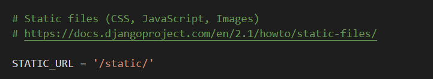

看看注释，以及提供的url地址，它已经清晰的指定了存放素材库的地址，所以我们就在Django项目创建static：


按照我上图所示的那样，依次再创建三个空文件夹，我们的素材库地址就准备好了。

&nbsp;

#### 3.引入Bootstrap

然后本次项目我们肯定要用Bootstrap这样的优秀前端UI框架去做，优化一下整个项目。

所以我们需要将Bootstrap项目引入进来。

https://www.qdskill.com/docs/bootstrap/docs/4.0/getting-started/download/

打开这个官网，进去后点击下载Bootstrap，你会下载一个叫做bootstrap-4.0.0的压缩包。

下载成功以后，我们解压这个压缩包，应该是```bootstrap-4.0.0\dist```这个路径

里面有css和js，把里面的内容全都拷贝过去Django同名目录里面来：

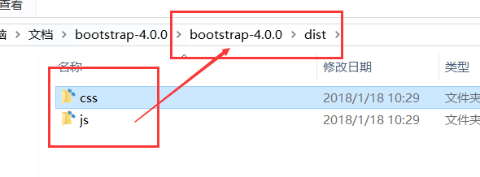

当然了，根据我的经验，我们使用的js是经过编译的，还需要添加两份文件


所以，为了将一切简洁化，我们可以再在static文件夹中创建一个叫做cdn的文件夹。

然后这儿有四个网址，将这四个网址的链接全部另存为文件进行下载，全部下到这个cdn文件：


这样一来，我们的Django的static目录就变成了如下:

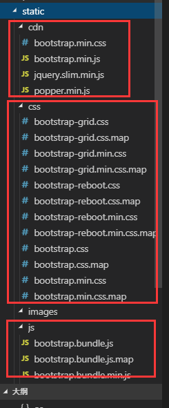

这个cdn文件夹有什么用呢，这是最小轻量级使用Bootstrap框架的方法，缺陷就是不能修改源码。

我们以下的项目可以先尝试使用这个cdn，如果实在不行还是使用传统的方法。

&nbsp;

## 二.美化前端

#### 1.配置Bootstrap

首先，我们先用我们的index视图首页，作为配置Bootstrap的实验品。

给我们的index.html引入一下bootstrap.min.css文件,方法还是一样的，使用类似的形式:

输入```<link rel="stylesheet" href="">```


然后打开一下我们的网页看看情况:


居然报错了，这是为什么呢，很正常，因为Django的默认配置中本来就没有使用static，所以需要手动配置。

所以我们在index.html的开头加入``````进行加载这个包。


这下，应该是没问题了吧，再来看看网页，似乎一切正常，再来看看控制台：


怎么又出这个报错了?

我在前面就说了，static并不是Django的默认配置项，难道一个load就能解决吗？

所以我们肯定要深入settings.py来告诉Django，我们要使用Bootstrap，等等—

事实上，这个说法不严谨，应该是告诉Django我们要激活static模块的使用！

在settings.py最后一行添加这句代码：```STATICFILES_DIRS = [os.path.join(BASE_DIR,'static')]```


保存之后，我们再来看看此时的页面，样式发生了变化，所以static模块成功使用了。


&nbsp;

#### 2.导航栏

因为我们要用Bootstrap框架，所以我们在前面自己定义的style样式可以删掉了。


然后我们先从首页的导航栏开始，先引入Bootstrap的导航栏模板，从官网上面寻找示例

https://www.qdskill.com/docs/bootstrap/docs/4.0/examples/navbars/#

这是一个导航栏示例的网站，你们可以任选一个喜欢的，对这个网页右键源代码


我的建议是复制202行到234行的代码。复制过来，你的网页应该会变成这样：


然后你可以进行微调，并在后面加个登陆和注册的a标签，完善之后应该是这个样子的：


当然了，我们还需要让这个导航栏，彻底固定在顶部，就是往下浏览的时候，这个导航栏依旧粘贴到顶部

我在Bootstrap官方文档查询到的方法就是往nav的class加一个```fixed-top```


&nbsp;

#### 3.模板填充

上面添加好导航栏之后，是不是剩余的html页面都要加上这个导航栏，但是你们想一下：

这样操作，是不是容易导致每个html文件都有重复的代码，容易引起冗余？

这个时候，我们就要学习Django的模板继承的新技术，block填充

&nbsp;

block填充其实就是将一段前端代码变成一个公用的模板，然后加入到所有的html文件进行使用。

现在我们的导航栏，必然是每个网页都有的，所以我们将导航栏设置为公用模板:

首先创建一个base.html，这个html文件将用来变成专门放模板的地方，用来被继承。

然后base.html的开头必然要加一个``````，这是一个好的习惯，全局应用加载static

然后把你的公用模板代码放上去，这代表每个html都要有的前端代码，也就是导航栏

下面的``````和``` ```的一对公式，我们会在具体的html文件里面填充这个：


因为每个页面都必须有导航栏嘛，然后这个引入bootstrap的代码自然也可以加入公有模板。

&nbsp;

接下来就是怎么去使用这个模板的操作了，先回到index.html，第一句代码是引用这个模板

公式是：``

这个公式是什么意思，就是直接让这个index.html去加载base.html的代码，然后在里面填写content的block填充代码，这样，一个网页就是这么出来了。

然后删除掉原来index.html的那段导航栏代码，使用``````和``` ```


最后，我们的网页效果图就这样出来了

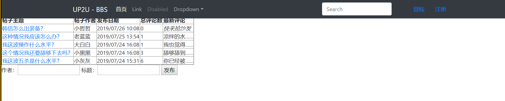

这个是正常的，因为我们在前面的导航栏中加入了```fixed-top```的缘故，等一下会优化。

&nbsp;

现在，我再问一遍，这个模板填充看懂了吗？我再提供一张图看一下：


如果你也看懂了，那我们也把这个detail详情页视图也安排一下吧、

先删掉style代码，然后引入bootstrap，最后引入模板填充格式，最终效果图如下:


出现了这个问题也是正常的，我们先放在后面进行处理。

&nbsp;

#### 4.热门话题

当我们搞定导航栏的时候，我们是不是可以删掉这两段前端代码了？


但是这个热门话题，删掉了还是太可惜了，我们其实可以给热门话题再弄一个二级导航

这儿有个非常好的二级导航示例：https://www.qdskill.com/docs/bootstrap/docs/4.0/examples/offcanvas/


我们还是如法炮制，右键源代码，将这一段二级导航给copy下来，放到……

放到哪儿啊？当然是base.html了，但是我们思考一下，我们所有的网页真的需要这个二级导航吗？

很显然只有浏览帖子的时候，这个二级导航才有作用，在看个人中心的时候，这个就可以去掉了。

所以我们在base.html里面也设置一个block模板代码，等待被填充:


然后回到index.html，再开辟一个block填充空间，将二级导航的源代码复制进去：

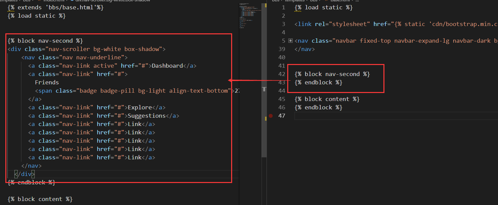

然后你会发现这个二级导航栏还是被挡住了，不过不碍事，我们给这个二级导航加上```mt-5```


最后的结果虽然好了一点，但是还是很怪怪的，因为导航栏的背景没了


再回去看看这个二级导航的源代码，发现它还使用了另外一个css文件


所以我们只好创建一个同名的css，将这里面的代码拷贝进来使用。


再来看看网页此时的样式，似乎这个刚才添加的```mt-5```可以去掉了，因为这个二级导航正是依附上面的导航。

最终的效果就是这个样子的啦：


&nbsp;

虽然上面的步骤非常啰嗦，但是主要呈现于详细的特点，让你最直观的感受到我是怎么去使用bootstrap模板的。

但是我们来看一下这两个导航栏的风格，明显不是很搭，我们需要对齐一下:


这个时候就顺眼多了，我们正式开始编写热门话题的导航栏：


这段代码，如何嫁接到上面，变成热门话题的二级导航，其实也并不难


我们只保留那个带有胶囊的那一句，因为胶囊可以用来存放评论的数量：


所以我们的热门话题的前端代码最终优化如下:


最终的效果图如下，还是不错的啊：

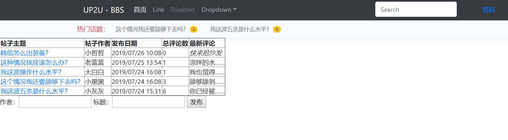

当然了，详情页的那个也可以改改，改成热门评论，最终的效果就是这样：


&nbsp;

#### 5.网站标题

我们可以反思一下，是不是公用模板还能优化地更好一些?

就是亲自补全head与body的代码，这样一来，网站的标题也是处于可控的状态了。

将base.html补全并优化如下:


然后我们就可以操控网站的标题了，将这一块改成block模板填充：


这个时候，我们就可以修改index首页视图的标题和detail详情页的标题。

&nbsp;

首先来搞一搞index首页的标题：


再来好好想一想详情页的标题应该怎么取，也就是取出帖子标题的名字：


来看看网页此时标题的效果：


学会了吗，这就是给每个网页取标题的效果。

&nbsp;

#### 6.优化详情页

优化详情页分两个部分，第一个部分显示帖子的标题，作者，创建时间等

这儿我们可以大胆突出作者的头像，以及帖子的标题。

第二个部分就是下面评论的列表以及回帖的简单部分。

说实话，第一部分的Bootstrap模板我真的是找了很久，然后从两处地方捞出来拼接到一起

```html
<div class="container card flex-md-row mt-3">
    <!-- 左边帖子主题部分 -->
    <div class="card-body d-flex flex-column align-items-start">
        <strong class="d-inline-block mb-2 text-primary">World</strong>
        <h3 class="mb-0">
            <a class="text-dark" href="#">Featured post</a>
        </h3>
        <div class="mb-1 text-muted">Nov 12</div>
        <p class="card-text mb-auto">This is a wider card with supporting text below as a natural lead-in to
            additional content.</p>
        <a href="#">Continue reading</a>
    </div>
    <!-- 右边作者信息 -->
    <div class="card-body little-profile text-center border-left">
        <div class="pro-img"></div>
        <h3 class="m-b-0">Markarn Doe</h3>
        <p>Web Designer &amp; Developer</p>
    </div>
</div>
```

效果还是可以的，就是差图片头像的插入以及文字的更改：


现在，我就干脆把这部分给完善了吧，经过我的努力之后，最终的效果是这个样子的：


有人会关注这个圆形的头像是怎么弄出来的，主要是用到了```border-radio```的css属性


现在等待我们克服难关的是，如何在src里面传入各个用户的头像，单纯使用{{}}行不通，先记下需求。

&nbsp;

现在，让我们来到第二部分，也就是回帖列表的前端优化，这个模板非常好找，找了一会儿就看到一个

http://yanshi.sucaihuo.com/modals/43/4365/demo/horizontal/

拉到下面，这个回帖的模板就非常棒


所以我右键源代码，将这个给弄出来

```html
<div class="card-body box-shadow container">
    <h4 class="card-title">Recent Comments</h4>
    <h6 class="card-subtitle border-bottom border-secondary mb-3">Latest Comments on users from Material</h6>
    <div class="comment-widgets m-b-20">
        <!-- Comment Row -->
        <div class="d-flex flex-row comment-row">
            <div class="p-2"><span class="round"></span>
            </div>
            <div class="comment-text w-100">
                <h5>James Anderson</h5>
                <div class="comment-footer">
                    <span class="date">April 14, 2016</span>
                </div>
                <p class="m-b-5 m-t-10 border-bottom pb-3">Lorem Ipsum is simply dummy text of the printing and type
                    setting industry. Lorem Ipsum has beenorem Ipsum is simply dummy text of the printing and type
                    setting industry.</p>
            </div>
        </div>
    </div>
</div>
```

效果图就是这个样子等一下会使用Django的for循环，将所有回帖给列出来


现在我们使用for循环将我们的回帖列表给展示出来。


同样的是，我们依然剩下一个需求没有解决，就是怎么锁定每个用户的每一个专属头像，这个会放在后面。


然后回帖的表单模块，我们单独从Bootstrap官网以及周边找一个示例过来，也可以与card样式组合：

```html
<div class="container card p-0 mt-3 box-shadow border-white">
    <div class="card-header bg-white">想说点什么……</div>
    <div class="card-body p-2 mt-2 ml-2">
        <blockquote class="blockquote">
            <form action="" method="POST">
                
                <div class="form-group">
                    <label for="reply_name">昵称
                        <input type="text" class="form-control" id="reply_name" name="reply_name"></label>
                </div>
                <div class="form-group">
                    <label for="reply_text">发表评论
                        <textarea class="form-control" id="reply_text" name="reply_text" rows="3"
                            cols="40"></textarea></label>
                </div>
                <input class="btn btn-light btn-lg" type="submit" value="提交">
            </form>
            <footer class="mt-3 blockquote-footer"><cite title="Source Title">感谢你对论坛社区做出的贡献~ </cite></footer>
        </blockquote>
    </div>
</div>

```

我认为效果图还是很扛扛的，至少整个详情页的页面风格优美简洁，看着舒服：


全篇看下来都是白色的简单色调，妥妥的清新风格，淡淡的装逼感油然而生，哈哈！

&nbsp;

#### 7.拷贝应用

虽然我们搞好了帖子详情页的前端优化，但是千万不要忘了一个需求，每个用户对应不同的头像，这个还没有弄。

对了，还有首页的前端优化也没弄，但是这个并不着急，而是放在最后，先把所有的逻辑实现了再说。

在这儿，我们停顿一下学习的步伐（今日总结），总结一下到现在为止都学会了哪些干活技能。

```
1 - 加载static素材库：
2 - 激活static素材库的方法：STATICFILES_DIRS = [os.path.join(BASE_DIR,'static')]
3 - 引入css文件或js文件的url公式：
4 - 使用base.html当作公用模板文件，利用和划分区域
5 - 使用并加载公用模板的方法：
6 - 网站的标题也是可以自定义的，使用公用模板的方法划出
```

&nbsp;

我们接下来要接触到一个新的概念，内置User。

内置User其实是User模型，它实际上比自己设置的author字段要好用很多。

因为它支持判断登录状态，支持保持登录状态下的操作，也就是说，我们的注册与登陆的功能可以准备了。

也就是说，我们的提交评论环节，那个需要输入昵称的表单可以作废了，直接改成登陆网页进行评论。

这个必然会给代码内部一个很大的改动，所以我们需要克隆一个bbs应用命名为bbscopy应用。

然后到bbscopy/urls.py和apps.py修改一下app_name，然后到总urls.py和settings.py登记一下这个新应用

当一切修改成功之后，最后就来看看bbscopy/models.py到底要怎么改:

想要引入内置User，得先输入```from django.contrib.auth.models import User```

引入成功之后，Choice模型就可以被修改了，将author字段修改成user字段

```python
user = models.ForeignKey(User, on_delete=models.CASCADE,default="Master")
```

两处修改地方如下：


跟它有关联的还有bbscopy/admin.py，在这个地方也要进行微改，将多余的author参数都删掉


然后就是根据这个新的models.py模型，生成全新的数据表，也就是newbbs_question和newbbs_choice。

先删掉bbscopy/migrations这个文件夹里面多余的文件，我们亲自调配这个新应用的数据库。


在cmd输入```python manage.py makemigrations```和```python manage.py migrate```


这个报错是怎么回事呢，这说明什么，user字段的默认值必须是数字，所以我们又得重新修改models.py


删除掉bbscopy/migrations已经产生的0001_initial.py文件。

然后再次输入```python manage.py makemigrations```和```python manage.py migrate```，新应用的数据库搞定。

这个时候我们需要运行一下应用，打开管理员界面，直接添加两个帖子，为我们打个样：


再来看看首页的效果：


当然了，你点进去的话就会跳转到bbs应用那边，所以我们的模板代码与views.py都要重写


这是我全局修改后的效果，就这样，我们成功复制了一个应用。

&nbsp;

#### 8.内置User

现在，终于可以好好研究一下这个内置User怎么用了。

在上面，我们新的应用和新的数据库已经准备好了，数据库已经支持内置User模型的user字段。

现在我们的内置User肯定是管理员帐号，也就是我们之前的admin，先拿那个当作示例。

我们给详情页传递一个user变量，显示出管理员账号的昵称:


然后回到detail.html进行打招呼，获取now_user字典里面的user值：

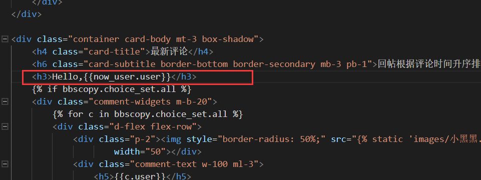

再来看看我们的页面状态，是不是成功获取到了管理员帐号的昵称？


这个就是一个很清晰的思路，这样一来，登陆帐号这一块算是打通了，我们先继续完善一下登陆后的提交评论的表单模块，那儿的昵称就不要求输入了，你既然登陆了就用你登陆的昵称发表评论。

&nbsp;

做网站的都要考虑一个问题，我该怎么保持登陆的状态去做事情呢，也就是cookie相关的网络知识。

User字段自然会有一些内置的函数方法支持，比如验证登录状态，就是去使用```is_authenticated```方法

这个方法可以判断用户是否在登录状态，返回bool类型的结果，所以我们再拿这个参数赋值到is_login变量里


所以我们可以将表单作为登陆过后才能拥有的部分：


登陆过后的效果是这样的，锁定了你的昵称表单：


然后再退出管理页面的帐号，此时我的网页是这个样子的：

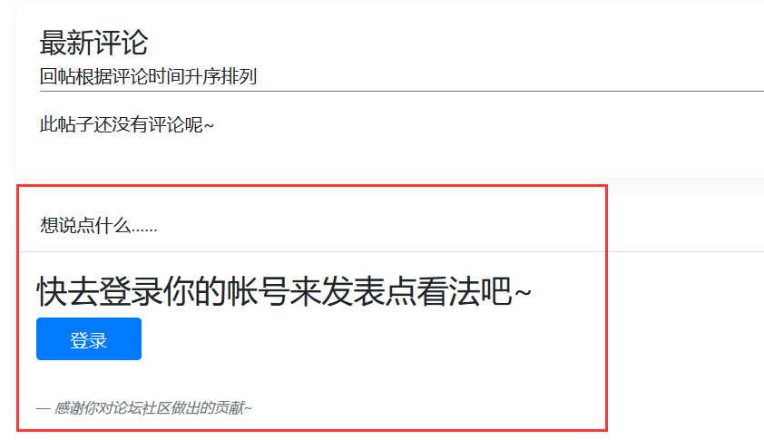

这个时候，我们的表单必须要推倒重写，去使用ModelForm配合User字段使用。

&nbsp;

#### 9.使用ModelForm

表单确实要推倒重写，不信的话我们可以自己提交一个评论，百分百报错。

所以我们不着急从views.py下手，先建立起来ModelForm的模型，有了它，我们才能配合用户的登录状态使用。

新建一个bbscopy/forms.py，开始编写我们的表单代码，建立表单模型：

```python
from django import forms
from .models import Question,Choice

class ChoiceForm(forms.ModelForm):
    class Meta:
        model = Choice
        fields = ['choice_text']
```

这段代码看起来很简单，直接引用Django自带的forms框架，去搭建一个表单模型。

根据这个Meta类，直接向表单模型交代了我要提交的是数据来源于哪个模型的哪个字段。

也就是创建了一个用于提交Choice的choice_text数据的表单模型。

所以，这个时候我们需要让views.py引用这个创建好的表单模型：


然后再从detail.html下手，直接注释掉我们写好的提交表单，改用forms模型自带的代码模板：


再来看看网页此时呈现的效果：


效果还是不错的，在后续我们可以继续优化这个表单，让它变得更加好看。

（还有as_table，as_ul等方法，这取决于你希望用哪个元素去承载表单代码）

&nbsp;

当然了，美化表单的事还不着急，这个时候就可以直接上手表单提交逻辑的代码编写了。

将views.py代码内的reply视图函数里面的try代码块全部删光，重新编写：


然后将以下控制表单模型的提交代码编写下：

```python
try:
    if request.method == 'POST':
        form = ChoiceForm(request.POST)
        # is_valid()判断表单是否成功获取
        if form.is_valid():
            # 先不向数据库commit，后面还需绑定问题模型
            reply = form.save(commit=False)
            # 将reply获取到的回复，与问题模型绑定
            reply.question = bbscopy
            # 保存到数据库
            reply.save()
```

你应该看得懂我的注释，然后我们再从网页中测试一下提交评论：


再来看看此时bbscopy_choice数据库的情况：


这个数据库看得懂吗，第一个id是评论自身的id，第三个的question_id和第四个的user_id都是ForeignKey外键，都是链接第一个帖子和第一个登陆账户的。

也许你好奇为什么你的管理员帐号的数据在哪儿，在auth_user这张表里面。


在后面，我们自然会搞定注册帐号的功能，这张表就会热闹起来。

&nbsp;

接下来的任务就很简单了，就是美化这个表单的样式。

方法比较特殊，总体就是你用fields设置了哪些表单样式，你就单独拉出来设置：


label就是给label标签取个文本，然后widget就是针对表单本身的样式设计，先决定是使用TextInput还是Textarea，然后利用attrs字典给这个表单传递样式参数。


这样一来，是不是就设计的好看多了，这就是表单模型设计的技巧，避免了深入前端模板修改代码的麻烦，直接在python里面设置表单，提高了前端页面的可维护性。

&nbsp;

#### 10.上传图片

本节的内容是重点中的重点，如何上传图片和展示图片，这样一来，我们的每个头像对应每个图片的问题也快要被解决了，但是在此之前，我们缓一缓节奏，讲一下上面的每个帖子的作者到底是怎么来的。

首先分析一下models.py：


可以发现，这个时候的Choice模型可以填的参数只有choice_text评论了。

user字段和question字段全部都是自动获取的，先来分析一下question字段是怎么来的，在原来的bbs应用中，我们采用的方法就是先获取到question，再往里面添加评论：


但是现在的方法就不一样了， 我们抛弃了前端表单，改成后端表单的形式：


这段代码到底有啥意思呢，就是首先激活reply视图之后，确定一下是不是POST交互，然后向我们的ChoiceForm表单发送POST数据，事实上，这个时候的POST数据是不是只有choice_text？然后往下看，需要先经过is_valid()的验证，这个验证过程到底发生了什么呢？就是验证ChoiceForm里面的fields能不能对的上：


验证成功之后，就很简单了，让这个choice_text绑定上它的问题模型，再将这个全部保存到数据库。

这个过程，作者user是不是就自动获取了？自动获取当前登陆状态的帐号昵称。

当然了，你如果觉得不舒服，有强迫症的话，也不是坏事，你可以再加一句代码当作保险：


事实上，我也欢迎你这么写，这样的代码看起来就非常严谨了。再来看看前端页面：


然后评论的作者就是这样被打印出来的。

&nbsp;

好了，让我们进入图片的上传与展示的正事。

我们初步的思路是让用户的评论支持插图，再进一步搞定用户的头像。

这个时候我们需要修改一下models.py了，因为Django正好自带了文件的字段，叫做FileField。

```picture = models.FileField(blank=True,null=True)```

这个图片的属性用null=True就说明了这个是可选的，可以上传，也可以不上传


picture字段搞好了之后，我们就加入到forms.py里面，让前端页面也出现上传图片的表单控件：


下一步，根据我们的经验，如果修改了models.py的代码，就必须再重新加载一次数据库

所以退出正在运行的项目，继续输入```python manage.py makemigrations```和```python manage.py migrate```

然后再次输入启动命令，上网站看看新出来的上传文件控件：


成功了，所以你知道为什么要用表单模型了吗，这避免了深入前端代码维护的麻烦性，非常便捷迅速。

现在，我们应该让图片成功上传到我们的Django项目，所以就要开辟一个空间存储图片。

编辑我们的总settings.py，将下面代码拷贝到最后面：

```python
MEDIA_ROOT = os.path.join(BASE_DIR,'media')
MEDIA_URL = '/media/'
```

当然了，我们新开了个存放图片的url地址，怎么不能跟总urls.py打招呼呢？


当然了，我这个写法卡起来虽然很复杂，实际上是从static里面拿的轮子，提供了文件存储方式：


所以直接看注释抄上去就行了……

这个时候我们要思考一下，图片的上传需要用到哪些前端知识？

当然是给POST那儿添加一个encode，支持图片传输，还需要个novalidate参数，让文件上传取消必选性质：


懂前端的应该好理解，不懂前端的记下笔记就可以了，再来看看我们的views.py也需要变换：

需要知道的是，图片的传输不用request.POST协议，而是request.FILES协议，然后我们也清楚，图片的上传是可选的，不一定强制，所以就要采用or：


加一句打印属于保险行为，现在我们就测试一下上传一张表情包试试看：


结果提交上去之后，cmd的结果显示如下:


看啥过去没有什么问题，我们测试一下不提交图片的评论：


咦？我的7楼呢，怎么不见了，我们再仔细看看cmd的报错，终于发现一个不对劲的地方：


为什么不提交评论，就要把我的input栏打上一个required的属性，不让输入呢？

所以为了解决这个问题，我们再次回到forms.py文件，直接把required属性强行禁止：


然后再测试一下不带图的评论吧，成功提交：


再来看看我们刚才上传图片的media文件夹，图片都被放到了这儿:


&nbsp;

&nbsp;

#### 11.展示图片

好了，现在我们搞定了上传图片，并提供了图片的存储路径，然后还支持两种评论方式。

现在，我们该想办法让图片展示出来，支持论坛带图评论。

其实解决这个问题很简单，不要忘了Choice模型有picture字段，来看看数据库:


所以我们插图片的时候可以先判断图片存不存在，然后再引入图片的路径，这一切在前端中完成：


当然了，我们必须还要思考一个问题，就是如果有人上传了大图怎么办？是不是要规定一下这个图片的大小？

这个时候，我们必须亲自测量一下此时网页的空间区域，亲自衡量：

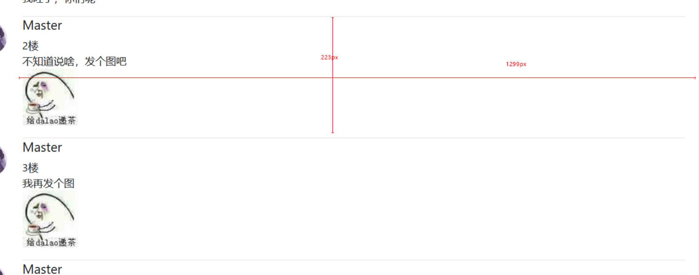

所以我们利用前端的属性，max-width和max-height,分别设置一下:


然后我特意找来一张超级大图，看看效果吧：


怎么样，这个展示图片的效果是不是非常好多了。

&nbsp;

#### 12.搞定首页


这个时候，我们就差个首页还没有进行优化了，但是我不会在这儿描述详细的编写过程，因为这一切正好是与上面差不多的步骤，你吸收的能力如何就看你能不能独立编写出首页了。

1）使用block模板填充完成首页

2）表单使用ModelForm完成

3）表格的样式可以参考https://www.qdskill.com/docs/bootstrap/docs/4.0/content/tables/

4）发表新帖子的用户名也用上模型User，用登录的帐号去发表新帖子

5）搞定发布帖子的代码逻辑

6）进一步升级发帖子逻辑，写帖子标题，写文章内容，并支持插入图片！

这些过程大概花了我一天的时间，所以我希望你们也能独立写出来，这是一个很好的总结知识机会。

&nbsp;

首页的样式：


发了帖子后的详情页样式：


首页发布帖子的表单控件:


&nbsp;

## 三.用户中心

#### 1.赛前总结

现在，我们可以说是完成了Django的大部分进阶操作，我们只差注册账号，个人中心，个人头像，全局搜索还没实现，我们的路还很长，后面会讲一些Django的高级操作。

这个时候，我们还是停顿一下，来总结一下目前学到的进阶操作总结：

| 进阶操作步骤                     | 具体用法                                                     |
| -------------------------------- | ------------------------------------------------------------ |
| 加载static素材库                 |                                             |
| 激活static素材库的方法           | STATICFILES_DIRS = [os.path.join(BASE_DIR,'static')]         |
| 引入css文件或js文件的url公式     |                           |
| 使用base.html当作公用模板文件    | 利用和划分区域                  |
| 使用并加载公用模板的方法         |                                 |
| 网站的标题也是可以自定义的       | 使用公用模板的方法划出                      |
| 使用登陆后台的帐号作为你的用户名 | models.py输入from django.contrib.auth.models import User     |
| 设计你的user字段                 | models.ForeignKey(User, on_delete=models.CASCADE,default=1)  |
| 获取你此时登陆的帐号名           | request.user                                                 |
| 判断你是否登陆帐号               | request.user.is_authenticated，登陆了就返回True              |
| 使用更加灵活的表单提交数据模型   | 新建一个forms.py，from .models import Question,Choice        |
| 搭建一个提交表单模型的关键部分   | Meta元信息类交代模型名字(model值)和提交数据的字段(fields值)  |
| 表单样式的编写                   | 字段当作变量；label是表单描述；widget是表单具体样式，配合attrs |
| 在前端呈现表单代码模板           | {{choiceform.as_p}},{{choiceform.as_table}},{{choiceform.as_ul}} |
| ModelForm提交数据的逻辑编写      | form = ChoiceForm(request.POST)、form.is_valid()             |
| 支持上传图片                     | 增加picture字段，picture = models.FileField(blank=True,null=True) |
| 配置上传图片的路径               | MEDIA_ROOT = os.path.join(BASE_DIR,'media')                  |
| 在总urls.py配置图片上传路径      | from django.conf.urls.static import static，深入static源码抄模板 |
| POST支持传输图片，取消必选性     | enctype="multipart/form-data" novalidate                     |
| 传输图片文件到数据库的协议       | request.FILES                                                |
| 取消表单的必须提交内容的性质     | required=False                                               |
| 在页面中展示图片方式             | src填写{{c.picture.url}}                                     |

&nbsp;

#### 2.登录页面

用户的登陆与注册，其实是一个大工程，所以我们需要这部分功能放在一个新的应用。

输入`python manage.py startapp accounts`完成创建应用。

然后将这个应用注册进总settings.py，方法就不说了。

&nbsp;

在做用户的登陆与注册之前，我们需要为这两个功能创建两个html文件。

创建templates/accounts/login.html和templates/accounts/register.html两个文件。

我们先搞定登录的页面吧，虽然这个应用在accounts，但是它依旧可以使用bbscopy/base.html的公有模板。

我们还是在网上寻找一下登录的Bootstrap模板吧：

https://www.qdskill.com/docs/bootstrap/docs/4.0/examples/sign-in/

```html




UP2U - BBS | 用户登录




<div class="col-4 m-auto">
    <form class="form-signin mt-5">
        <h1 class="h3 mb-3 font-weight-normal">Please sign in</h1>
        <label for="inputEmail" class="sr-only">Email address</label>
        <input type="email" id="inputEmail" class="form-control mt-3 mb-3" placeholder="Email address" required
            autofocus>
        <label for="inputPassword" class="sr-only">Password</label>
        <input type="password" id="inputPassword" class="form-control mt-3 mb-3" placeholder="Password" required>
        <div class="checkbox mb-3">
            <label>
                <input type="checkbox" value="remember-me"> Remember me
            </label>
        </div>
        <button class="btn btn-lg btn-primary btn-block" type="submit">Sign in</button>
        <p class="mt-5 mb-3 text-muted text-center">&copy; 2017-2018</p>
    </form>
</div>

```

登录的样式搞定之后，我们该配置一下accounts/urls.py了：

```python
from django.urls import path
from . import views

app_name = "accounts"
urlpatterns = [
    path('login/', views.login, name="login"),
    path('logout/',views.logout, name='logout'),
]
```

然后跳到总urls.py文件，加入进去```path('accounts/', include('accounts.urls')),```


一切配置好了以后，又该到了views.py的战场了，先写下用户登录详细代码：

```python
from django.shortcuts import render,get_object_or_404
from django.http import HttpResponseRedirect
from django.urls import reverse

def login(request):
    return render(request,'accounts/login.html')

def logout(request):
    pass
```

最后我们登录一下网站，看看整体的页面效果:


然后这儿有个非常重要的部分，就是注册帐号，我们需要加一行，`还没账号？快来注册`，让没有用户的人点击这个超链接跳转到注册账户的页面。


&nbsp;

#### 3.登录帐号

登陆界面已经搭建好了，这个时候该尝试登录帐号了，原本我们就有一个管理员账号。

于是就用这个管理员帐号去试验，登陆成功之后再全力研究注册账号。

首先先从html模板代码下手：


有人可能就问了，为什么我登陆上去的过程还要交给login判断呢？为什么不再开一个视图？

其实再来一个视图还是过于冗余了，你想开的话也不影响，我这儿主要是便捷，通过内嵌if判断是否来了POST


这样是不是就方便了很多吧？

好了，我们正式编写一下登录账号过程，试问一下，我们的帐号在哪张数据表啊？

在db.sqlite3的auth_user表里面，所以是引入```django.contrib.auth```

然后怎么将账号密码与这张表里面来比较验证，是通过authenticate()方法来判断，一个一个地寻找账号。

（这种方法肯定是不利于sql的性能的，但是Django的定位是快速开发小型应用，暂时不用管那么多）

但是我写的过程中，发现了一个问题，这个问题是基于Python底层的模块冲突问题：


发现了吗，我引入了一个login的模块，然后我的函数方法名也取名login，这个时候就会引起冲突报错。

所以我需要从html、views.py、urls.py进行全局修改，将login和logout全部改成login_user和logout_user。

改完之后，我的login_user视图代码如下:

```python
def login_user(request):

    # 发生登录行为的时候，激活这个if代码块
    if request.method == 'POST':
        # 获取POST发送的数据
        username = request.POST['inputName']
        password = request.POST['inputPassword']
        # 判断用户是否在auth_user数据表里
        user = authenticate(username=username,password=password)
        if user:
            # 进行登陆操作
            login(request,user)
            return HttpResponseRedirect(reverse('bbscopy:index'))
        else:
            error_message = '用户名或密码错误！'
            return render(request,'accounts/login.html',{'error_message':error_message})

    return render(request,'accounts/login.html')
```

这个error_message用来提示错误内容的，我们可以在首页的这个地方进行使用：


现在，我们就尝试登录一个错误的帐号，会怎么样：


再登录一个正确的帐号，检查一下有没有成功跳转：


一切正常。

&nbsp;

这个时候，你也注意到了右上角的登录，当我登录成功之后，那个地方应该就变成了用户名，代表你的登录状态：


其实这个并不难，直接if+else+endif的模板语言搞定：


页面效果图：


&nbsp;

#### 4.登出账号

登录页面搞定了，登陆帐号失败提示也搞定了，登陆帐号成功的跳转也搞定了。

现在我们全力解决一个问题，如何登出帐号呢？

我们的登出账号，肯定没有必要特意弄个页面，就重定向到没有登陆账号的页面样子就可以了。

还记得之前我们引入了logout模块吗，直接用它登出即可：


然后在模板代码里面，将登出的url指向于logout_user的视图函数就可以了。


#### 5.注册账号

注册账号必要挖出那个User字段。

所以输入```from django.contrib.auth.models import User```后，查看User的源码:


这个User类原来是继承于AbstractUser的抽象大类的，所以继续查找这个：


所以这个类就是我们要找的注册用户的类，下面都已经定义好了方法：


所以这个时候，我们的注册的表单又要由ModelForm来完成了。

创建accounts/forms.py，编辑代码如下:

```python
from django import forms
from django.contrib.auth.models import User

class RegisterForm(forms.ModelForm):
    username = forms.CharField(
        label='用户名',
        widget = forms.TextInput(
            attrs={
                'minlength':'2',
                'maxlength':'8',
                'class':'form-control',
                'placeholder':'请设置用户名...'
            }
        )
    )
    password1 = forms.CharField(
        label='密码',
        widget = forms.PasswordInput(
            attrs={
                'minlength':'6',
                'maxlength':'18',
                'class':'form-control',
                'placeholder':'请设置密码...'

            }
        )
    )
    password2 = forms.CharField(
        label='再次输入密码',
        widget = forms.PasswordInput(
            attrs={
                'minlength':'6',
                'maxlength':'18',
                'class':'form-control',
                'placeholder':'请确保您的两次输入密码一致...'

            }
        )
    )
    email = forms.CharField(
        label='用户名',
        widget = forms.EmailInput(
            attrs={
                'class':'form-control',
                'placeholder':'请设置你的邮箱...'
            }
        )
    )
    class Meta:
        model = User
        fields = ('username','password1','password2','email')
```

我们这儿有两个密码栏，是为了确保两次密码输入一致，我们会使用js来完成这个过程。

然后我们往urls.py添加上注册的url地址：


然后前往views.py编辑一下register_user视图代码:


然后就是专心编写注册页面的前端，实际上是跟注册的前端差不多的：

```html




UP2U - BBS | 用户注册




<div class="col-4 m-auto">
    <form class="form-signin mt-5" action="" method="POST">
        
        
        <h1 class="h3 mt-5 mb-5 font-weight-normal text-center">{{error_message}}</h1>
        
        <h1 class="h3 mt-5 mb-5 font-weight-normal text-center">新人，欢迎您</h1>
        
        {{ registerform.as_p }}
        <div class="checkbox mb-2">
            <label>
                <input checked type="checkbox" value="agree-me"> 阅读并接受《用户协议》及《隐私权保护声明》
            </label>
        </div>
        <div class="mb-1">
            <a class="float-right" href="#!">已有账号？直接登录</a>
        </div>
        <button class="btn btn-lg btn-primary btn-block mt-5" type="submit">注册</button>
        <p class="mt-5 mb-3 text-muted text-center">&copy; Masterpaopao</p>
    </form>
</div>

```

此时网页的效果是这样的：


这个时候，又遇到了一个大难题，两次密码的判断究竟怎么解决呢?

经过百度的筛查，我终于查到一个概念：全局钩子

首先在models.py输入`from django.core.exceptions import ValidationError`

这个是全局钩子报错所必备的异常类，然后：


我们现在还不知道这个是否有效果，我们先正式编辑views.py，完善提交数据逻辑：

```python
def register_user(request):
    registerform = RegisterForm()

    # 发生注册行为的时候，激活这个if代码块
    if request.method == 'POST':
            form = RegisterForm(request.POST)
            if form.is_valid():
                user = form.save(commit=False)
                 # 加密的方式保存密码
                user.set_password(form.cleaned_data['password1'])
                user.save()

                # 注册成功后，跳转登陆首页
                error_message = '注册成功！请登录'
                return render(request,'accounts/login.html',{'error_message':error_message})

    return render(request,'accounts/register.html',{'registerform':registerform})
```

先不考虑出异常的行为，保证注册一次性通过。

我注册一个叫Paopao的帐号，发现一次性通过：


再来看看数据库此时的状况：


我们可以看到，这个Paopao的is_superuser和is_staff都为0，估计是没有登陆后台的权限的，只能发发帖子，评论评论罢了。

&nbsp;

现在，我们必须考虑注册账号时发生的错误：

1）用户名已存在的问题

2）两次密码不一致的问题

说实话，我自己尝试写，怎么写也写不对，所以我借助了百度的力量：

http://www.liujiangblog.com/course/django/112

根据这个博客的思路，我的代码优化如下:

```python
def register_user(request):

    registerform = RegisterForm()

    # 发生注册行为的时候，激活这个if代码块
    if request.method == 'POST':
            form = RegisterForm(request.POST)
            if form.is_valid():
                user = form.save(commit=False)
                username = form.cleaned_data.get('username')
                password1 = form.cleaned_data.get('password1')
                password2 = form.cleaned_data.get('password2')
                # 判断密码不一致
                if password1 != password2:
                    error_message = '两次输入的密码不同！'
                    return render(request, 'accounts/register.html', 
                    {'error_message':error_message,'registerform':registerform})
                # 判断是否有重名
                else:
                    same_name_user = User.objects.filter(username=username)
                    if same_name_user:
                        error_message = '用户名已经存在！'
                        return render(request, 'accounts/register.html', 
                    {'error_message':error_message,'registerform':registerform})               
                # 加密的方式保存密码
                user.set_password(form.cleaned_data['password1'])
                user.save()

                # 注册成功后，跳转登陆首页
                success_message = '注册成功！请登录'
                return render(request,'accounts/login.html',{'success_message':success_message})

    return render(request,'accounts/register.html',{'registerform':registerform})
```

为了让这段代码生效，需要去掉冲突的代码块:


让密码不一致的问题交给views.py处理，这样一切就都完美了。

然后我为了让注册成功更加显眼，加了success_message这种玩意:

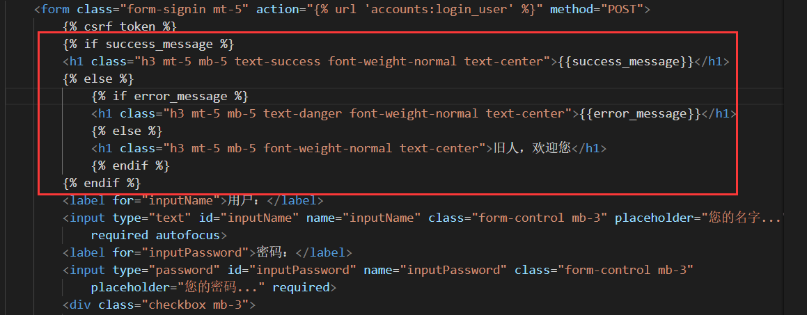

注册成功后的效果是这样：


当然了，出现任何报错，都是红色的大字提醒你。

&nbsp;

这节内容可以说是干货足够多，将我们上面学习到的知识又重新糅合了一遍：

这节内容涉及了设计forms.py，配置urls.py，应用到前端模板，第一次使用全局钩子，正式编写views.py提交代码的逻辑等等。

其中提交数据的时候，数据如何保存到数据库，如何解决重名冲突，如何解决密码不一致，都是重点中的重点。

&nbsp;

#### 6.邮箱验证

这个时候，我们应该让我们的项目变得逼真，也就是说，当你注册帐号的时候，应该发一个邮箱进行注册的确认，同时确定了一个邮箱一个账号的规则。

首先确保我们要启用的邮箱的SMTP服务打开，我这儿以QQ邮箱为例：

进入QQ邮箱，找到设置页面，往下拉，勾选这个:


点击开启之后，会有电话认证，然后冒出一个授权密码，记下来：


大功告成之后，编辑settings.py，将以下代码拷贝进去:

```
EMAIL_BACKEND = 'django.core.mail.backends.smtp.EmailBackend'
EMAIL_HOST = 'smtp.qq.com'
EMAIL_PORT = 25
EMAIL_HOST_USER = 'xxx@qq.com'
EMAIL_HOST_PASSWORD = 'xxxxxxxxxxx'
```


这个时候，我们创建一个临时py文件，验证一下Django内置的邮箱服务可用性:

（一定要取名为send_mail.py，这跟源代码设置的有关系）

```python
import os
from django.core.mail import send_mail

os.environ['DJANGO_SETTINGS_MODULE'] = 'up2u_bbs.settings'

if __name__ == '__main__':   

    send_mail(
        '来自Masterpaopao的Django项目的测试邮件',
        '欢迎访问Masterpaopao的世界，这儿有最全的博客教学，打造全能程序员！',
        'xxx@qq.com',
        ['xxx@qq.com'],
    )
```


配置好了之后，直接右键运行(不是运行DJango项目)，查询一下接收方是否收到这个邮件：


&nbsp;

当你顺利完成上面的测试步骤之后，可以删掉这个临时的send_mail.py文件，我们正式在Django里面配上注册帐号激活邮件的功能。

首先，我们如何要配置上邮箱，就要搭建一个邮箱模型，刚好accounts/forms.py是空的：

```python
from django.db import models
from django.contrib.auth.models import User

class ConfirmString(models.Model):
    user = models.OneToOneField(User,on_delete=models.CASCADE)
    code = models.CharField(max_length=256)
    pub_date = models.DateField(auto_now_add=True)
```

别忘了使用```python manage.py makemigrations```和```python manage.py migrate`将这个模型应用到数据库产生数据表。

为什么要用`OneToOneField`就是要让一个user用户对应一个code注册码。

当邮箱注册模型就绪以后，我们必须思考一下，User模型，让哪个字段来担任验证是否被注册的任务？在我经过官方文档查询之后，看到一个is_superuser：


这个is_superuser，我试着设置为1，发现这个为1的帐号还是登陆不上去后台管理。

目前不知道有什么用，就让它作为邮箱验证的判断字段吧！

这个时候，我们可以再次修改views.py，不让重复邮箱的人通过注册:


这个时候，我们就要全力研究如何给邮箱发邮件的逻辑了。

&nbsp;

我们就继续在views.py编辑邮箱注册的逻辑吧，首先就是注册码的问题，不能太简单

所以采用哈希混淆加盐的方法：

```python
import hashlib
def hash_code(s, salt='Masterpaopao'):
    h = hashlib.sha256()
    s += salt
    h.update(s.encode())
    return h.hexdigest()
```

然后就是确认user的情况下，创造code字段到ConfirmString数据表，表示确定注册码：

```python
from django.utils import timezone
from .models import ConfirmString

def make_confirm_string(user):
    now = timezone.now()
    code = hash_code(user.username, str(now))
    ConfirmString.objects.create(code=code, user=user,)
    return code
```

OK，准备工作做好了，该正式编写发送邮箱的函数了：

```python
from django.conf import settings
from django.core.mail import EmailMultiAlternatives

def send_email(email, code):

    subject = '来自Masterpaopao的Djano项目之BBS论坛'
    
    # 正式消息
    html_content = '''
                    <p>感谢注册<a href="http://{}/accounts/confirm/?code={}" target=blank>www.Masterpaopao.com</a>，\
                    这里是我的全面技术博客，只为打造全能程序员！</p>
                    <p>请点击站点链接完成注册确认！</p>
                    '''.format('127.0.0.1:8000', code,)
    # 备用消息
    text_content = '''感谢注册www.Masterpaopao.com的BBS论坛用户，这里是我的全面技术博客，只为打造全能程序员！\
                    如果你看到这条消息，说明你的邮箱服务器不提供HTML链接功能，请手动复制以下链接访问：
                    http://{}/accounts/confirm/?code={}
                    '''.format('127.0.0.1:8000', code,)

    msg = EmailMultiAlternatives(subject, text_content, settings.EMAIL_HOST_USER, [email])
    msg.attach_alternative(html_content, "text/html")
    msg.send()
```

还记得前面配置的settings.py吗，里面配置了邮箱选项，所以我们需要```from django.conf import settings```来导入settings.py的配置选项进行使用。

为什么要弄正式消息和备用消息，是因为有些邮件不支持html的内容。

然后我们的views.py又可以加两行代码，将上面的函数加入进去，然后将跳转的页面修改成新的邮箱验证页面：


这个时候，又轮到前端出场了：

创建accounts/prompt.html，随便弄个提示去验证的页面：

```html




UP2U - BBS | 邮箱认证



<div class="col-4 m-auto">
    
    <h1 class="h3 mt-5 mb-5 text-success font-weight-normal text-center">{{success_message}}</h1>
    
    <h1 class="h3 mt-5 mb-5 font-weight-normal text-center">您好，来这儿有什么事呢？</h1>
    
    <div class="mb-1">
        <h3>我还未验证邮箱</h3>
        <a class="btn btn-lg btn-primary btn-block mb-5" href="https://mail.qq.com" target="_blank">前往邮箱</a>
    </div>
    <div class="mb-1">
        <h3>我已验证邮箱</h3>
        <a class="btn btn-lg btn-primary btn-block mb-5" href="" target="_blank">登录</a>
    </div>
    <p class="mt-5 mb-3 text-muted text-center">&copy; Masterpaopao</p>
</div>

```

然后不要忘记配置views.py与urls.py，让这个页面能够访问


这个时候，我们会点击前往邮箱，打开邮箱里面的那个地址，那个地址是什么呢？


所以点开这个地址的时候，我们的code会呈现在url上，思路很清晰，当你进入confirm.html的时候，视图函数立马判断url地址里面的code，是否存在数据库当中，如果存在，则验证成功，修改is_superuser=1，然后允许登录。

所以再从urls.py出发，添加confirm页面：


然后编辑confirm视图函数，正式完善验证邮箱登陆的逻辑：

```python
def confirm(request):
    code = request.GET.get('code', None)
    # 先判断url的code是否有效
    try:
        confirm = ConfirmString.objects.get(code=code)
    except:
        error_message = '无效的确认请求!'
        return render(request, 'accounts/confirm.html', {'error_message':error_message})
    
    # confirm一旦被获取到，修改权限，允许登录：
    confirm.user.is_superuser = 1
    confirm.user.save()
    # 用户已经拥有登录权限了,confirm留着没用了
    confirm.delete()
    success_message = '验证邮箱成功！请登录'
    return render(request, 'accounts/confirm.html', {'success_message':success_message})
```

先不考虑注册邮件是否过期，我们现在是小项目，还不需要这个功能。

逻辑写好了，就再冲刺前端，编写accounts/confirm.html页面了：

```html




UP2U - BBS | 邮箱验证



<div class="col-4 m-auto">
    
    <h1 class="h3 mt-5 mb-5 text-success font-weight-normal text-center">{{success_message}}</h1>
    
        
        <h1 class="h3 mt-5 mb-5 text-danger font-weight-normal text-center">{{error_message}}</h1>
        
        <h1 class="h3 mt-5 mb-5 font-weight-normal text-center">您好，来这儿有什么事呢？</h1>
        
    
    <div class="mb-1">
        
        <h3 class="mt-3 mb-3 text-success text-center">等待页面自动跳转中...</h3>
        
        <a class="btn btn-lg btn-primary btn-block mt-5" href="" target="_blank">登录</a>
    </div>
    <p class="mt-5 mb-3 text-muted text-center">&copy; Masterpaopao</p>
</div>


<script>
        window.setTimeout("window.location='/accounts/login/'",2000);
</script>



```

这个时候，应该是差不多了，但是我们还需要去修改一下登录的逻辑:


现在，我们进入排BUG环节，验证一下邮箱验证的整个流程是否有误：

首先注册帐号，点击注册，经过了一会儿之后居然成功了：


然后我前往注册邮箱的帐号，看看邮箱内容：


然后点进去，看看是否成功跳转：


舒服了，一切全都搞定了。邮箱注册的功能完美收官，当然了你可以根据需求搞更多的拓展，比如注册邮件三十分钟后失效，这个涉及到Django项目时区不与我们本地时区一致的问题，操作起来也有点困难。

或者定期清理未在一定时间内获取登录权限的用户，这个可以用Django的celery实现，或者使用Linux的cronb功能。

总之这块部分的内容相当多，我们会在后面再来一轮总结。

&nbsp;

#### 7.个人中心

我们搞定了用户的登陆和注册，搞定了注册后需要进行邮箱验证的步骤，现在我们的账户管理系统非常地完善，所以是时候深入用户管理系统了。

我们会先设计用户的个人中心，再搞定头像的问题，最后就是信息的变更了。

个人中心，我们需要确定好需求，展示头像在左侧，右边是信息列表。

下方是我的发帖列表与评论列表。


首先还是一样的，创建一个UserUpdate模型，外键是User，里面存放姓名，性别等：


upload_to函数肯定要放在上面，因为检查代码是从上往下的顺序。

我们创造了外键User，创造了二选一的sex字段，创造了国家字段，最重要的是头像图片的字段，为什么要弄upload_to，这是自定义上传图片的路径。

别忘了将模型应用到数据库，我们依次到urls.py，views.py，personal.html文件依次解决个人中心的显示。

网上找一找个人中心的模板，对了，还得用ModelForm去编写表单的更新个人信息。

http://yanshi.sucaihuo.com/modals/43/4365/demo/horizontal/pages-profile.html

这个我就很习惯，经过我的删减调整之后，个人中心页面是这个样子的：


这个时候，又走上了漫长的优化之路，首先登陆一下帐号，然后根据帐号来做这个个人中心。最重要的是一定要传两个user对象，分别是User表和UserUpdate表，好让个人中心的数据完整展示。

在此之前，我们注册用户的时候，是不是也应该把UserUpdate的表也同步一下:


这是一个很重要的手段，让我们的UserUpdate也能运作起来，同步到个人中心：


&nbsp;

个人中心的页面，优化如下：


这个展示原帖的操作其实为难了我很久，我先是搞到这位登陆用户的所有评论和所有帖子。

然后再搞一个字典，将评论的id与帖子进行对应，方便筛选：


然后下面一步就卡了我很久，该如何通过字典索引出正确的键对应的值，打印出正确的原帖标题。

我找了很久的高效方法，都没解决，于是用了最笨的方法，使用for与if判断：


这个时候，我们还欠一个表单模型没做，因为这个部分要用来更新内容，属于UserUpdate的部分：


但是经过我的测试以后，我使用的表单模型并不方便传输数据，所以还是采用了原生前端进行设置：


整体的效果如下：


重点是攻克那个性别选择的部分，到底怎么跟UserUpdate里面设置的sex字段对接上去？

事实上，模板语言也是可以在元素的标签内进行编辑的，所以采用最笨的方法这样写：


看到了吗……直接粗暴地判断sex是1还是2，判断出来了直接加个checked的属性。。。就是这么简单。

还有人问了，为什么不是1，而是'1'，我明明填的是1，不要忘了，sex字段属于CharField，是字符串类型。

&nbsp;

现在，我们的个人中心总算是搞定了，只剩下最关键的部分没有搞定。

就是我该如何更新我的个人信息呢？重点是怎么更新我的头像。

在此之前，我们需要优化一下头像栏，没设置头像的人应当统一用同一张图片。


当然了，还有帖子详情页的发帖楼主的头像也应当得到优化，还有评论的人头像也要搞，我会在后面弄。

&nbsp;

#### 8.信息更新

先来关注一下到底怎么更新头像，我目前没头像的时候，就是这个样子：


在编辑提交数据逻辑之前，先弄一下更新和重置两个按钮:


然后我编辑personal.py，尝试弄一下更新的行为：


点击更新以后，看看cmd会传来怎么样的语句：


我们可以发现，这个性别的选择，只是一个on，说明我们性别这一块的代码有问题。

还记得request.POST获取到的数据其实是表单的value值吗，我们忘记补充这个选项的value了：


然后再重新试一下提交，总算是恢复正常了：


然后完善personal视图函数的代码，完成更新：


我随便上传一张图片吧，改改信息，改改性别：


我们的信息更新的这一块就做好了，但是你们一定很关注头像存储到哪儿了，回忆一下upload_to函数：


根据这个url返回值，图片应该是放在了media目录下的users目录，检查一下：

（这样命名url，是彻底杜绝重复名字照片的出现，逻辑非常严密）


现在，图片的上传地址，你应该也会了吧？就通过upload_to的返回值来决定url。

&nbsp;

#### 9.搜索功能

我们的论坛项目，已经到了尾声了，后面还会有一些高级操作可以学习一下。

这个时候，我们需要上一个全局搜索的功能，但在完成这个功能之前，我们需要完成其他的所有页面：

完成发帖历史的页面，当没有发帖历史的时候，加一句提示：


给每个人上传头像，优化详情页四个人同时评论的页面：


我要做的就是每个人都上传自己的头像，然后回帖的时候展现出自己的头像:

（这个地方我存在一个设计的失误，就是我使用了默认的auth_user表去管理用户，然后使用了关联表accounts_userupdate去存储每个用户的性别，国家和头像，导致我想获取用户的头像时非常被动。）

（经过我的思考，这个auth_user的User模型是继承于AbstractUser模型的，下一次做项目管理用户的时候，应该设计一个继承AbstractUser模型的自定义User模型，添加几个重要的选项，这样就没那么被动了。）


也是采用很笨的方法，使用for+if，将评论的作者与评论的图片对应起来：

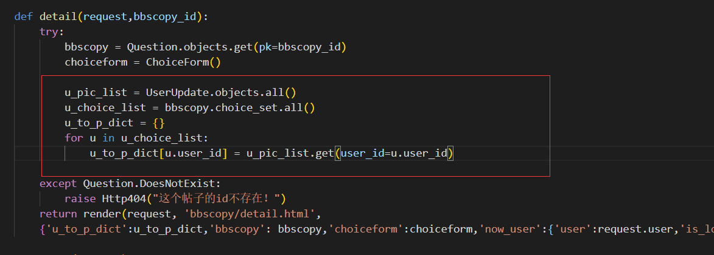

最终效果图：


&nbsp;

好了，我们已经可以全心全意的去做搜索功能了。

我们在上面的学习中，使用了大量的POST操作，而POST的作用是获取数据。

这个时候，做搜索功能的话,Get就要登场了，因为Get是用来获取数据的。

首先搞定搜索栏的表单，改成Get模式:


name是干什么呢，就是你输入数据之后，会在url生成搜索的数据，value获取搜索的值发给后台。

回到我们的index视图函数，回想起前面的邮箱注册码确认的步骤，写下让url展示搜索数据的代码：


这是啥回事，当我在表单输入内容的时候，按下回车，此时GET带着搜索的数据进入到query变量，紧接着就被value给识别到，在url展示搜索的数据。然后搜索的数据就会被发送到后台等待下一步处理。

&nbsp;

这个时候，一个很好玩的东西就要登场了，Q模块，没错，确实是一个字母的Q模块：

在views.py引入```from django.db.models import Q```

然后编写下根据Q模块拓展出来的方法，进行搜索过滤的方法：

```python
query = request.GET.get('query')
if query:
    latest_bbscopy_list = latest_bbscopy_list.filter(
    Q(question_title__icontains=query) | 
    Q(user__username__icontains=query)
    ).distinct()
```

我就详解一下吧：


这样一来，我们的搜索功能就这样做好了，Django内置的搜索Q模块还是很方便的！


&nbsp;

#### 10.进阶总结

终于，我们还是完成了BBS论坛项目的进阶优化，整个过程花费了我的一个星期……

好歹取得的成果还可以，从看Django入门文档一脸懵逼地跟着操作，再到今天熟练地玩转MTV架构打造Django项目，这个过程毫无疑问我是收获了很多的。

所以，我想从头总结一下BBS项目的设计路线，以一种别样的方式来总结，那就是思维导图：


（想看完整版的请到assignment目录去下载，然后细细观赏）

&nbsp;

还记得上面的大坑吗，我使用了auth_user和accounts_userupdate两张表去管理用户，这个实际上是一个设计的失误，在经过我的查阅之后，从今以后正确的操作应该是：

```
第一步：from django.contrib.auth.models import AbstractUser
第二步：class UserProfile(AbstractUser)，添加自己额外需要的字段
第三步：settings.py加入AUTH_USER_MODEL = 'accounts.UserProfile'
第四步：python manage.py makemigrations + python manage.py migrate
```

整个过程最好是还没生成数据库db.sqlite3之前就开始，否则你需要删光数据库的所有表，直到剩下sqlite_sequence的引擎表，然后再进行``python manage.py migrate``，像这样：


一定要记下这个笔记，但是你设计用户表的时候，字段也不能太多，否则也是不利于数据库的性能的。

&nbsp;

## 四.更多操作

#### 1.使用装饰器

我们知道，在项目中，有些网页是不允许未登录的用户给登录的。

事实上，这些其实也可以忽视的，因为我们的views.py里的视图函数逻辑代码用上了```request.user```，未登录的话这个视图就会报错，但是这样做其实并不是严密的逻辑。

你应该正确引导用户，访问那些需要登录的网页的时候，自己替它跳转到登陆网页，而不是404报错。

所以我们还是要养成一个习惯，确定好哪些视图需要用户登录才能看到的，给它的视图函数加一个装饰器。

这个装饰器叫做`login_requeired`

&nbsp;

使用的方法是`from django.contrib.auth.decorators import login_required`

然后给视图套上`@login_requeired`


当你没登陆的时候，输入这些url，会被强行跳转到登录的视图让你登录，而不是404报错


#### 2.理解CBV	

我们回顾一下这一路走来做的Django项目，你们发现我的views.py代码有什么特性?

熟练使用Python的人都知道，面向对象设计是一个很重要的思想，基于类与函数而完成。

但是我们目前的views.py是不是只有函数，没有用到类，这就叫FBV。

FBV： Function-Based View，直译就是基于函数而设计的视图代码。

&nbsp;

这个时候，我们应该需要重构一下我们的代码了，从函数进化成类，没错，从FBC进化成CBV。

CBV： Class-Based View，基于类而设计的视图代码。

优化成CBV模式是历史的必然，全面优化代码，让维护代码更加简单。

&nbsp;

#### 3.简单优化

从def函数优化到Class类，其实可以仅作了解。


下图就是index函数优化到QuestionListView类的过程：

先交代model是Question，父类ListView会自动获取这个模型成为QuerySet类型

将这个获取到的QuerySet通过context_object_name来命名。

最后就是交代模板的名字，template_name，表示渲染的前端文件。


&nbsp;&nbsp;

再来看看包含提交数据功能的视图函数，怎么优化到类吧：


这个优化就很厉害了，但是我没加入该有的东西，我在这儿只做个示例：


具体的优化方法请深入ListView、CreateView和UpdateView类的源码去查看。

百度上就已经有了个非常优秀的教程，感兴趣的就去看。

&nbsp;

#### 4.分页功能

分页功能是论坛必备的功能，当然了，像知乎和虎扑这样的网站，在手机端是不需要分页功能的。

但是我们毕竟是做PC端的论坛应用，所以我们还是需要了解一下分页功能的使用。

在Django中提供分页功能的是一个类：Paginator

学习文献：https://docs.djangoproject.com/en/2.2/topics/pagination/

根据文献的指示，我们可以进入shell模式进行练习分页的使用。

&nbsp;

输入`python manage.py shell`，引入`from django.core.paginator import Paginator`


然后拿出我们的帖子模型，分个页，就分成2页就行了：


我们发现，这个q_objects并不适合直接用来分页，因为它是无序的，自然报错。

所以我们需要换成另外一种获取对象的形式，让获取到的QuerySet成为有序的：


这样看来，是不是就没有报错了？但是依然有个假疵，就是我明明设置的分成2页，它还是分成三页了

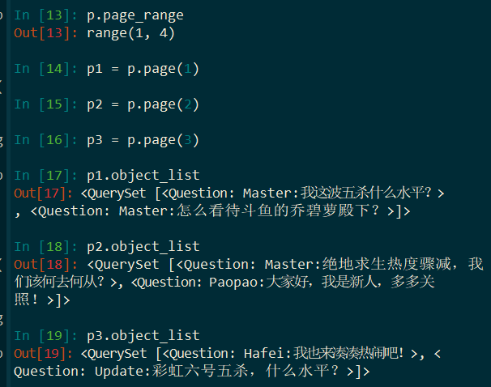


然后我们要深入到代码中使用，还需要以下函数来结合判断，以及求相关页面的值。

这是判断是否有上一页和下一页的玩意，返回布尔值:


这是判断上一页和下一页的页数，如果不存在就抛出异常


&nbsp;

```
引入分页功能	from django.core.paginator import Paginator
创造分页对象	p = Paginator(q_objects,3)
分页对象的总页数	p.num_pages
创建每一页的对象	 p1 = p.page(1)、 p2 = p.page(2)、 p3 = p.page(3)
求出当前页面的对象	p1.object_list
判断是否有前一页和后一页	p1.has_previous()、p1.has_next()
求出前一页和后一页的页码	p1.previous_page_number()、p1.next_page_number()
```

&nbsp;

#### 5.markdown插件

我们可以发现，当我们评论的时候，我们需要换行，但是页面的效果却换行失败：


这一段话直接揉成了不换行的一段话，一点观感效果都没有。

所以我们需要引入markdown语法来优化这个问题：

在up2u-bbs环境下输入`pip install markdown`进行安装。


然后我们来看看怎么将markdown插件引入到项目中吧！

&nbsp;

我们有两个地方需要引入markdown，帖子内容与评论内容，分别对应question_text字段与choice_text字段。

所以我们深入models.py来修改，让这两个字段应用上markdown：

```python
from django.utils.html import mark_safe
from markdown import markdown
```

这两句引用代码很简单，支持html与markdown，一眼就看出来了。

接下来我们就要创造自定义函数，来赋予question_text字段和choice_text字段支持markdown的特点。

所以编写一个函数，直接转换为markdown格式：


然后到前端修改相应的变量：


然后再发个评论，试试一下二级标题，还含有换行，没问题：


再试试一下含有直接换行的发言，失败了！


这个时候，我们该如何进一步优化到支持换行的发言呢？

我们来试试外界的帮助，寻找一个框架，叫simplemde：

直接下载下来，以压缩包的形式：https://simplemde.com/

然后找到里面的dist目录，可以发现js文件和css文件：


然后将这两个文件植入到我们的Django项目中：


然后我们需要手动输入一下js代码，激活这个框架的优化编辑器：


这个时候你就会发现，此时的markdown编辑器已经起飞了!


再来试试直接换行输入的文本吧！


经过我的测试，如果你想要换行的话，必须中间间隔一个空行，才能算换行成功！


这也是markdown本身的特点吧！以后要换行的话，多按一个回车就可以了！

但是！！！你是不是忘了我在前面引入的有关html的插件，我们来试试html的方式换行：


看到了吗，html语法也是可以支持的！


&nbsp;

#### 6.管理页面优化

为什么要优化管理页面，是为了方便我们更好的管理，主要方法是汉化。

对于汉化来说，最重要的一个短语就是```verbose_name```

这个地方需要根据models.py来改，然后上个Meta元信息类:


再来看看此时的管理页面的效果：


这个就是一个最显著的优化，可以在每次创建模型之后就培养修改verbose_name的习惯。

当然了，还有这个地方也是可以汉化的：


同样是采用verbose_name的方法：


总之，管理页面的汉化很简单，当然了，如果你想优化整个管理页面的前端，不妨试试这个网站：

在这个网站寻找模板：https://djangopackages.org

&nbsp;

本章更多操作的内容会被总结到前面进阶总结里面的xmind里面，当然了，我会提供.xmind和pdf两种文件放在附件里面，欢迎下载进行回味复习。

本次BBS论坛应用项目正式圆满完成！

