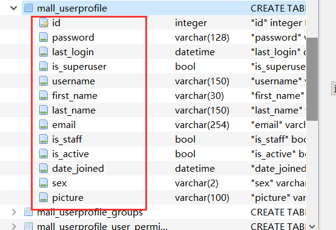

### *再坚持一下，前面就是终点了*

---

本博客的Github地址是：https://github.com/Masterpaopao/Master-Blog

在本次博客中，我们会接触到前后端开发分离技术之一：REST API。

转载请标明原Github出处，觉得不错请点个star支持！

&nbsp;

## 一.技术简介

#### 1.前后端分离

- 前端与后端的解耦
- 工作职责的细化
- 架构演变
- 提升企业级开发的效率
- 适应移动设备飞速发展的时代
- REST API支持多种语言开发

&nbsp;

#### 2.API概念

REST API就是一种万维网软件架构风格，也就是表现层状态转换。

基础于超文本传输协议(HTTP)之上而确定的一组约束和属性。

RESTful匹配或兼容于这种架构风格的网络服务，允许客户端以统一资源标识符(URI)和操作网络资源的请求，以预先定义好的无状态操作集一致化。

说白了：**提供了在互联网络的计算系统之间，彼此资源可交互使用的协作性质。**

&nbsp;

#### 3.API约束

1）CS架构（客户-服务器架构）

通信只能由客户端单方面发起，表现为请求-响应的形式。

2）无状态

通信的会话状态全部由客户端负责维护。

3）缓存

相应内容可以在通信链的某处被缓存，以改善网络效率。

4）统一接口

通信链的组件之间通过统一的接口相互通信，以提高交互的可见性。

5）分层系统

通过限制组件的行为，将架构分解为若干等级的层。

6）按需代码

支持通过下载并执行一些代码，对客户端的功能进行扩展。

&nbsp;

#### 4.API作用

- 便于不同软件在网络中互相传递信息
- 促进了web发展，大量公司广泛应用
- 通过操作资源的表现形式来操作资源。
- 操作对应HTTP协议提供的GET、POST、PUT和DELETE方法。

&nbsp;

#### 5.API优点

- 更高效利用缓存来提高响应速度
- 无状态性可以让不同的服务器处理一系列请求，提高服务器的扩展性
- 浏览器直接作为客户端，简化软件需求
- REST软件依赖HTTP协议的程度比较小
- 不需要额外的资源发现机制
- 兼容性一直保持前列

&nbsp;

#### 6.请求方法

1）请求方法学习

最著名的有四种，分别是GET、POST、PUT、DELETE。

我们可以来看看四张图，进行一个快速的学习：

主要分两种情况，到底是一组资源还是单个资源，这个要分得清。

2）写法参考

GET、DELETE、HEAD……这一系列类似的请求方法，url写法应当如下：

url?a=1&b=2

POST、PUT……等一系列请求方法，默认情况下是json字符，推荐设置请求头的Content-Type为application/json。

在特殊接口中，你会看到multipart/form-data，这种请求实体同样也被当作POST风格的参数进行处理。

&nbsp;

#### 7.状态码

1）状态码

请求成功的状态码有200，201，202和204等等。

200：请求执行成功并返回相应数据，如GET成功。

201：对象创建成功并返回相应资源数据，如POST提交成功，指向新建资源地址。

202：接受请求，但无法立即创建行为，需要花费若干时间完成任务。

204：请求执行成功，不反悔相应资源数据，比如DELETE成功。

当然了，还有一个重定向的状态码，也值得学习记忆：

301：被请求的资源已永久移动到新位置

302：请求的资源现在临时从不同的URI响应请求

然后，客户端错误的状态码也是很重要的学习参考：

400：请求体包含语法错误

401：需要验证身份或者不允许访问资源

403：服务器拒绝执行

404：找不到目标资源

最后就是服务端的错误了，也是一个重要的自查手段：

500：服务器遇到了状况，无法处理，内部出错

501：服务器不支持当前请求所需要的某个功能

502：服务器接收到无效的响应

503：由于服务器维护或者过载，无法处理当前请求，但是过段时间会恢复

2）状态码写法参考

当你遇到403报错的时候，可能是你的权限不够：

当你遇到修改的资源不存在的时候，会遇到404报错：

&nbsp;

#### 8.版本号

如果你的项目有版本号，可以在url添加版本号

- /api/v1/article/1234
- /api/v2/article/1234

也可以在HTTP情趣里面添加

- Accept: application/vnd.api.article+xml; version=1.0
- Accept: application/vnd.api.article+xml; version=2.0

&nbsp;

#### 9.学习参考

HTTP接口设计参考：https://github.com/bolasblack/http-api-guide

英文版官方指南：http://restcookbook.com/

模仿API风格的知名网站：Github，微信，百度等

&nbsp;

## 二.电子商城项目

#### 0.赛前热身

当前目标技术栈：数据库，缓存，消息队列，数据结构与算法

好久没碰Django了，本次设计个电子商城项目当作复习！

笔记不会再那么详细了，主要写思路。

在设计一个项目之前，一定要有一个设计思路：

然后就要准备下虚拟环境了，直接`cc e_mall python=3.7 django=2.2`进行创建电子商城的虚拟环境。

完成之后，选定一个目录，输入`django-admin startproject master_mall`进行创建项目文件。

然后`cd master_mall`，进入此目录，然后直接`python manage.py runserver`来启动项目。

这一步的目的主要是生成一个sqlite数据库文件，方便后面设计模型。

&nbsp;

#### 1.用户模型设计

这是最为关键的一步，重构掉Django内置默认的User模型，给它添加上性别，头像等等。

首先创建一个mall应用，这个应用是商城的主体项目地址：`python manage.py startapp mall`

然后就可以针对mall/models.py开始重构用户模型：

然后我们找到master_mall下的settings.py，安装bbs应用+注册新的User模型进行覆盖:

然后一口气输入两条命令，生成数据库：`python manage.py makemigrations` + `python manage.py migrate`

然后去检查此时的sqlite数据库，看看我们默认的User表是不是变了。

然后我们设置一个管理员，方便从一开始就设计登录模块与不登录模块的区别。

输入`python manage.py createsuperuser`进行设置管理员，再回数据库看看：

大功告成。

&nbsp;

#### 2.数据库设计

首先从网上找到一个Django开发电子商场的通用UML图，来反映出各层之间的关系：

我们可以看到这个UML明确围绕产品-订单这两者的关系去设计，这不就类似于生产者-消费者模式吗？

总体来说，这个UML图明确传达出来的信息是应该先设计好订单模型，然后再去设计产品模型，再进行拓展。

现在我们设计商品分类的模型，这是父模型，决定每个类别下面有多少个此类别的产品：

商品分类设计出来了，那么商品的模型也出来了，我们知道，商品对于商品分类是多对一的关系，所以设计的时候商品分类肯定是这个商品模型的外键，然后还要额外考虑到旧价格，新价格，是否上架，创建时间，更新时间等等。

然后就是价格的设计，需要用到DecimalField这个字段，作为含有小数点的数字，并且小数点最多2位：

然后把这两个模型加入到管理后台页面，进入到mall/admin.py，进行编辑：

然后`python manage.py makemigrations` + `python manage.py migrate`，再运行此项目，进入管理页面，进行登录，看看最终效果：

#### 3.添加数据

在我们加入数据之前，我们必须考虑图片的归宿，所以我们要定义一个素材库，将图片统一摆放。

在master_mall/settings.py中加入这两段：

然后加入素材库的时候，顺便也把mall应用给加进去：

为了让让这段代码不报错，需要编辑mall/urls.py，并加入这些：

然后回到管理页面，手动添加几个商品分类进去吧，不知道怎么上传图片的可以偷淘宝和京东的图：

你可以回到编辑器，验证一下你的素材库是不是真的安排成功了：

然后我们再添加几条商品的数据，每个商品分类下添加几条商品，最后看看结果。但是添加的时候，我收到的是这样的选项：

这个时候，就要修改下模型代码，使用Python的内置`__str__`方法，给对象取别名：

再来看看管理界面，这个时候我们可以尽可能添加更多商品数据，方便下一步的开发。

&nbsp;

#### 4.前端开发

## 三.API开发

#### 1.基本介绍

我在前面说过，API支持多种语言进行开发，所以这次我们学习的就是Django开发API。

这个技术就叫做DRF，全称为Django Rest Framework。

为啥要用DRF？

- 在Web可浏览的API，为你的开发人员带来了巨大的可用性。
- 身份验证策略包括OAuth1a和OAuth2的程序包。
- 支持ORM和非ORM数据源的序列化。
- 可自定义，丰富的文档，良好的社区支持。

&nbsp;

#### 2.示例学习

官方文档：https://www.django-rest-framework.org/

这个虽然是英文的，但是有Django基础的你，阅读起来应该是不费劲的。

点击阅读快速开始的示例学习：https://www.django-rest-framework.org/tutorial/quickstart/

