### *再坚持一下，前面就是终点了*

---

本博客的Github地址是：https://github.com/Masterpaopao/Master-Blog

在本次博客中，我们会接触到前后端开发分离技术之一：REST API。

转载请标明原Github出处，觉得不错请点个star支持！

&nbsp;

## 一.技术简介

#### 1.前后端分离

- 前端与后端的解耦
- 工作职责的细化
- 架构演变
- 提升企业级开发的效率
- 适应移动设备飞速发展的时代
- REST API支持多种语言开发

&nbsp;

#### 2.API概念

REST API就是一种万维网软件架构风格，也就是表现层状态转换。

基础于超文本传输协议(HTTP)之上而确定的一组约束和属性。

RESTful匹配或兼容于这种架构风格的网络服务，允许客户端以统一资源标识符(URI)和操作网络资源的请求，以预先定义好的无状态操作集一致化。

说白了：**提供了在互联网络的计算系统之间，彼此资源可交互使用的协作性质。**

&nbsp;

#### 3.API约束

1）CS架构（客户-服务器架构）

通信只能由客户端单方面发起，表现为请求-响应的形式。

2）无状态

通信的会话状态全部由客户端负责维护。

3）缓存

相应内容可以在通信链的某处被缓存，以改善网络效率。

4）统一接口

通信链的组件之间通过统一的接口相互通信，以提高交互的可见性。

5）分层系统

通过限制组件的行为，将架构分解为若干等级的层。

6）按需代码

支持通过下载并执行一些代码，对客户端的功能进行扩展。

&nbsp;

#### 4.API作用

- 便于不同软件在网络中互相传递信息
- 促进了web发展，大量公司广泛应用
- 通过操作资源的表现形式来操作资源。
- 操作对应HTTP协议提供的GET、POST、PUT和DELETE方法。

&nbsp;

#### 5.API优点

- 更高效利用缓存来提高响应速度
- 无状态性可以让不同的服务器处理一系列请求，提高服务器的扩展性
- 浏览器直接作为客户端，简化软件需求
- REST软件依赖HTTP协议的程度比较小
- 不需要额外的资源发现机制
- 兼容性一直保持前列

&nbsp;

#### 6.请求方法

1）请求方法学习

最著名的有四种，分别是GET、POST、PUT、DELETE。

我们可以来看看四张图，进行一个快速的学习：


主要分两种情况，到底是一组资源还是单个资源，这个要分得清。

2）写法参考

GET、DELETE、HEAD……这一系列类似的请求方法，url写法应当如下：

url?a=1&b=2

POST、PUT……等一系列请求方法，默认情况下是json字符，推荐设置请求头的Content-Type为application/json。

在特殊接口中，你会看到multipart/form-data，这种请求实体同样也被当作POST风格的参数进行处理。

&nbsp;

#### 7.状态码

1）状态码

请求成功的状态码有200，201，202和204等等。

200：请求执行成功并返回相应数据，如GET成功。

201：对象创建成功并返回相应资源数据，如POST提交成功，指向新建资源地址。

202：接受请求，但无法立即创建行为，需要花费若干时间完成任务。

204：请求执行成功，不反悔相应资源数据，比如DELETE成功。

当然了，还有一个重定向的状态码，也值得学习记忆：

301：被请求的资源已永久移动到新位置

302：请求的资源现在临时从不同的URI响应请求

然后，客户端错误的状态码也是很重要的学习参考：

400：请求体包含语法错误

401：需要验证身份或者不允许访问资源

403：服务器拒绝执行

404：找不到目标资源

最后就是服务端的错误了，也是一个重要的自查手段：

500：服务器遇到了状况，无法处理，内部出错

501：服务器不支持当前请求所需要的某个功能

502：服务器接收到无效的响应

503：由于服务器维护或者过载，无法处理当前请求，但是过段时间会恢复

2）状态码写法参考

当你遇到403报错的时候，可能是你的权限不够：


当你遇到修改的资源不存在的时候，会遇到404报错：


&nbsp;

#### 8.版本号

如果你的项目有版本号，可以在url添加版本号

- /api/v1/article/1234
- /api/v2/article/1234

也可以在HTTP情趣里面添加

- Accept: application/vnd.api.article+xml; version=1.0
- Accept: application/vnd.api.article+xml; version=2.0

&nbsp;

#### 9.学习参考

HTTP接口设计参考：https://github.com/bolasblack/http-api-guide

英文版官方指南：http://restcookbook.com/

模仿API风格的知名网站：Github，微信，百度等

&nbsp;

## 二.电子商城项目

#### 0.赛前热身

当前目标技术栈：数据库，缓存，消息队列，数据结构与算法

好久没碰Django了，本次设计个电子商城项目当作复习！

笔记不会再那么详细了，主要写思路。

在设计一个项目之前，一定要有一个设计思路：

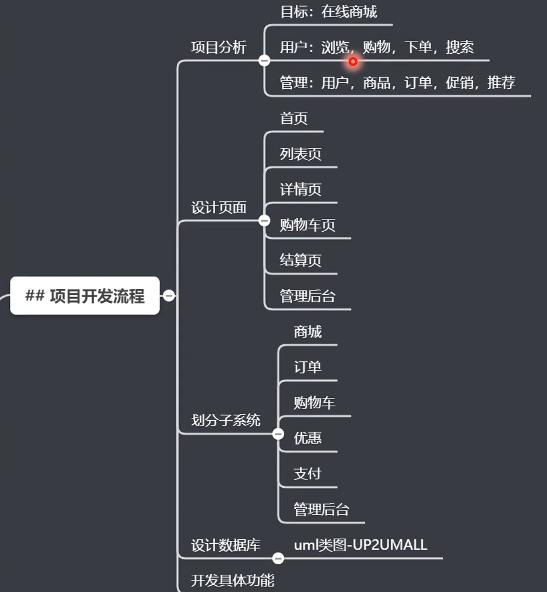

然后就要准备下虚拟环境了，直接`cc e_mall python=3.7 django=2.2`进行创建电子商城的虚拟环境。

完成之后，选定一个目录，输入`django-admin startproject master_mall`进行创建项目文件。

然后`cd master_mall`，进入此目录，然后直接`python manage.py runserver`来启动项目。

这一步的目的主要是生成一个sqlite数据库文件，方便后面设计模型。

&nbsp;

#### 1.用户模型设计

这是最为关键的一步，重构掉Django内置默认的User模型，给它添加上性别，头像等等。

首先创建一个mall应用，这个应用是商城的主体项目地址：`python manage.py startapp mall`

然后就可以针对mall/models.py开始重构用户模型：


然后我们找到master_mall下的settings.py，安装bbs应用+注册新的User模型进行覆盖:


然后一口气输入两条命令，生成数据库：`python manage.py makemigrations` + `python manage.py migrate`

然后去检查此时的sqlite数据库，看看我们默认的User表是不是变了。


然后我们设置一个管理员，方便从一开始就设计登录模块与不登录模块的区别。

输入`python manage.py createsuperuser`进行设置管理员，再回数据库看看：

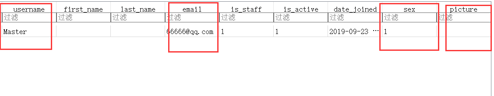

大功告成。

&nbsp;

#### 2.数据库设计

首先从网上找到一个Django开发电子商场的通用UML图，来反映出各层之间的关系：


我们可以看到这个UML明确围绕产品-订单这两者的关系去设计，这不就类似于生产者-消费者模式吗？

总体来说，这个UML图明确传达出来的信息是应该先设计好订单模型，然后再去设计产品模型，再进行拓展。

现在我们设计商品分类的模型，这是父模型，决定每个类别下面有多少个此类别的产品：


商品分类设计出来了，那么商品的模型也出来了，我们知道，商品对于商品分类是多对一的关系，所以设计的时候商品分类肯定是这个商品模型的外键，然后还要额外考虑到旧价格，新价格，是否上架，创建时间，更新时间等等。

然后就是价格的设计，需要用到DecimalField这个字段，作为含有小数点的数字，并且小数点最多2位：

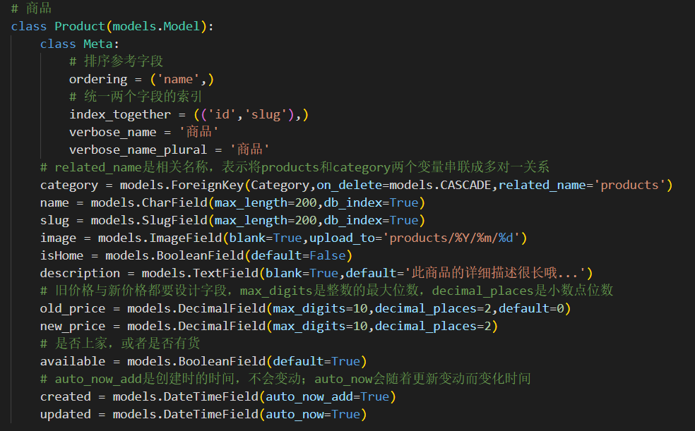

然后把这两个模型加入到管理后台页面，进入到mall/admin.py，进行编辑：


然后`python manage.py makemigrations` + `python manage.py migrate`，再运行此项目，进入管理页面，进行登录，看看最终效果：

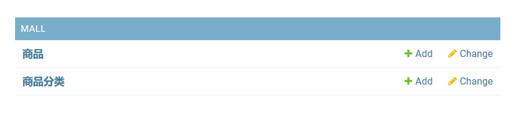

#### 3.添加数据

在我们加入数据之前，我们必须考虑图片的归宿，所以我们要定义一个素材库，将图片统一摆放。

在master_mall/settings.py中加入这两段：

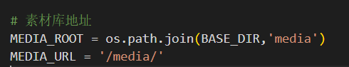

然后加入素材库的时候，顺便也把mall应用给加进去：


为了让让这段代码不报错，需要编辑mall/urls.py，并加入这些：

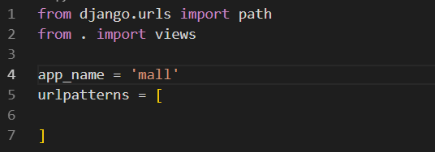

然后回到管理页面，手动添加几个商品分类进去吧，不知道怎么上传图片的可以偷淘宝和京东的图：


你可以回到编辑器，验证一下你的素材库是不是真的安排成功了：

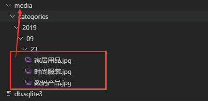

然后我们再添加几条商品的数据，每个商品分类下添加几条商品，最后看看结果。但是添加的时候，我收到的是这样的选项：


这个时候，就要修改下模型代码，使用Python的内置`__str__`方法，给对象取别名：


再来看看管理界面，这个时候我们可以尽可能添加更多商品数据，方便下一步的开发。

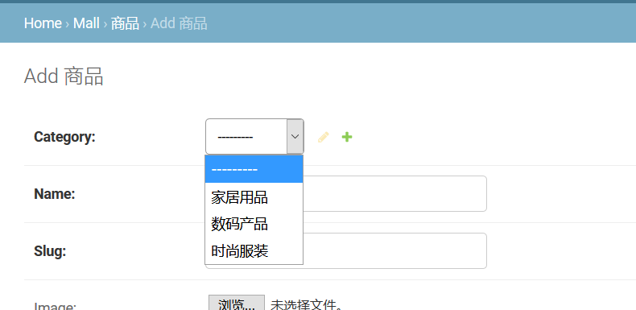

&nbsp;

#### 4.首页开发

终于到了前端开发的环节了，这个过程是枯燥的，不如我们直接套模板。

找到一个模板之后，首先将images、css、js等文件安排一个归宿，也就是static文件夹：

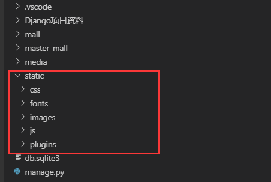

然后跑到settings.py再加一句代码，将这个static资源库进行加载：

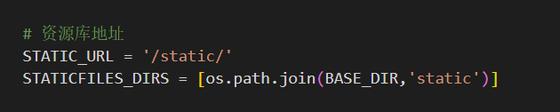

然后我们在mall应用里面创建templates文件夹，将前端模板放进去：

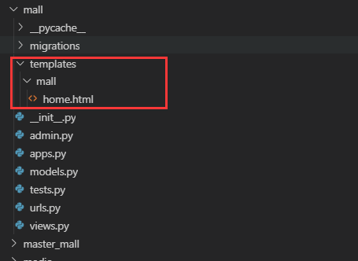

然后回到mall/views.py，进行编辑首页:

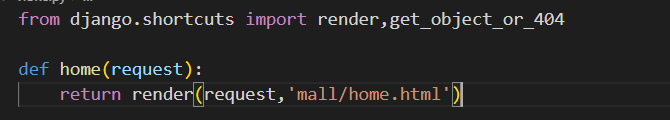

再就是mall/urls.py里面，链接视图添加首页：

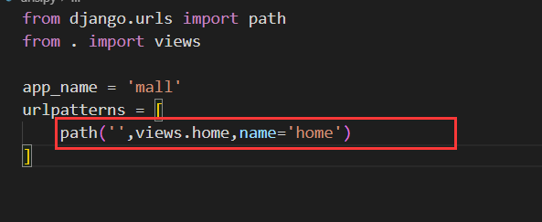

这个时候，我们如果登录到首页，肯定是这样的url：

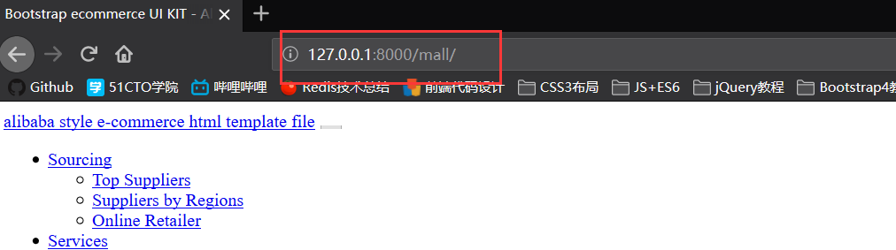

正确的操作其实是首页直接默认来到商城的首页，也就是设置一个应用的首页成为整个项目的首页，这个要到总urls.py进行设置：

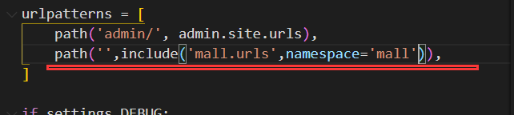

这样就解决了首页就是mall应用的商城首页问题。

&nbsp;

然后就是应用static资源库的问题了，让首页的HTML文件能够连接到css样式文件和图片，这个时候就要自己亲自调整，首先先在文件开头加一句``，然后对每个资源都用括号安排：“

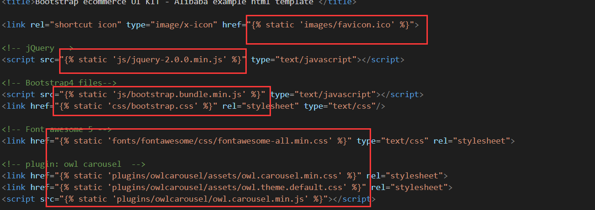

这样以来，我们的商城首页就美滋滋的生成了：

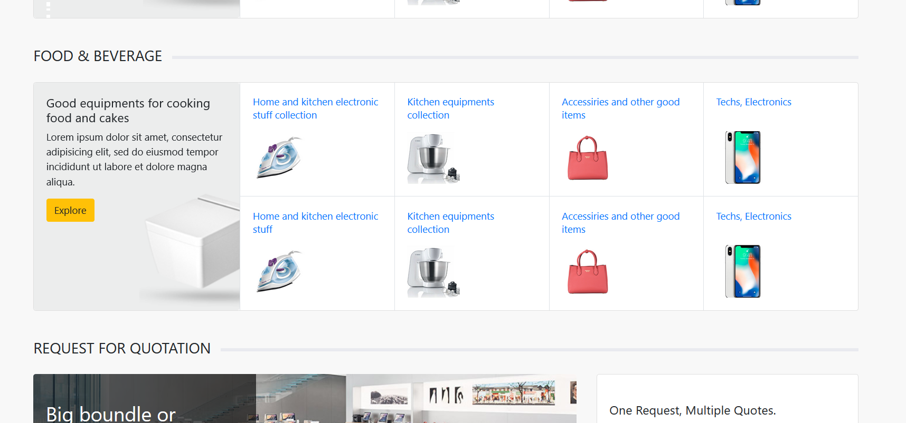

接下来具体开发的过程我就不讲解了,达到复习Django知识的效果即可！

&nbsp;

## 三.API开发

#### 1.基本介绍

我在前面说过，API支持多种语言进行开发，所以这次我们学习的就是Django开发API。

这个技术就叫做DRF，全称为Django Rest Framework。

为啥要用DRF？

- 在Web可浏览的API，为你的开发人员带来了巨大的可用性。
- 身份验证策略包括OAuth1a和OAuth2的程序包。
- 支持ORM和非ORM数据源的序列化。
- 可自定义，丰富的文档，良好的社区支持。

&nbsp;

#### 2.示例学习

官方文档：https://www.django-rest-framework.org/

这个虽然是英文的，但是有Django基础的你，阅读起来应该是不费劲的。

点击阅读快速开始的示例学习：https://www.django-rest-framework.org/tutorial/quickstart/

首先先来看看这段英文，讲诉了为啥要创建一个叫做REST_FRAMEWORK的文件夹，如何应用内置User表的权限或者授予未登录的用户已读的权限：

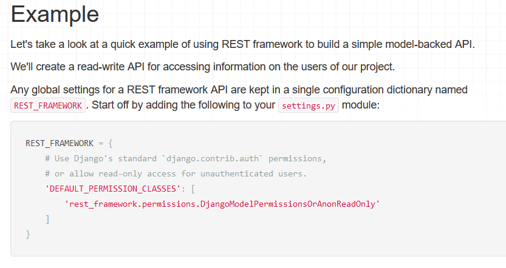

这个是要加进去settings.py的，别忘了还要把这个文件夹加入到以安装应用INSTALLED_APPS里面。

然后就是编辑urls.py，开始开发API，先来看看一段快速的代码：

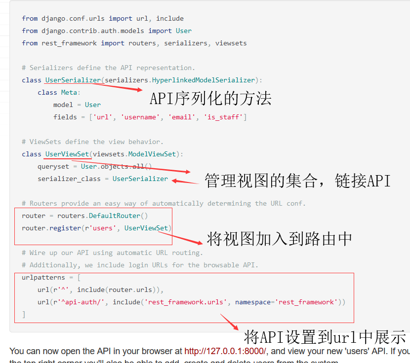

一时看不懂，没关系，这只是快速示例，大概的意思我们其实可以总结出来：

`定义API序列化 ->  API加入到视图中展示  -> 视图加入到路由中 -> 设置路由的地址进行网页访问`

我这样解释是不是就粗暴易懂了些？

&nbsp;

我们可以快速搭建一个Python环境：`cc rest_api python=3.7 django`，创建一个叫做rest_api的虚拟环境。

找到一个合适的文件夹位置，进入虚拟环境并创建项目：`coa rest_api` + `django-admin startproject drf_example `

然后进入此文件夹并启动vscode ：`cd drf_example` + `code .`

一起大功告成，然后根据新手指南所需要安装的东西，一个个搞定：

```
 pip install djangorestframework
 pip install markdown
 pip install django-filter
```


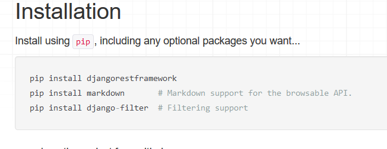

然后将rest_framework加入到settings.py的安装应用中：

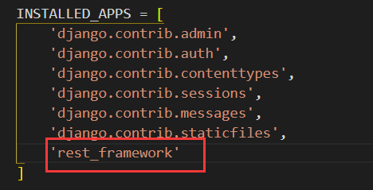

然后拷贝这段代码放入进去（读者亲自去官方文档复制）：

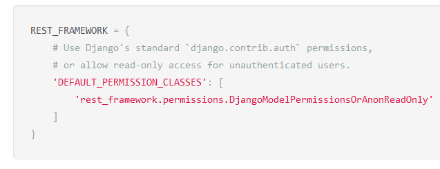

然后再把上面图解的urls.py代码给直接复制替换进去：


但是我们可以思考一下，以前的urlpattern都是用path来完成，这次变成了url，你如果不想改变习惯，那就：

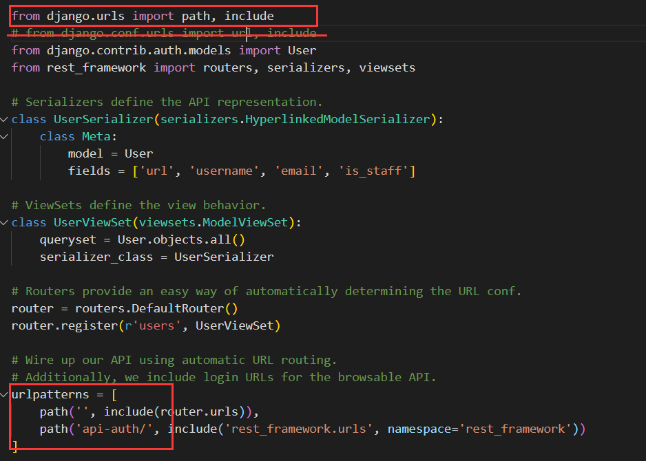

这样也是可以的，始终只用`django.urls`里的path方法来管理路由路径。

然后你就可以尝试运行项目，看看效果了，咦？为什么报错了：

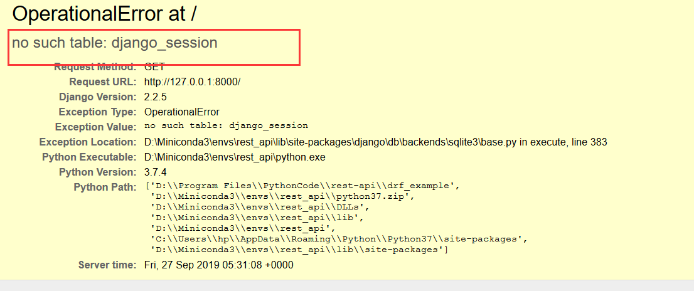

我们只是空有db.sqlite3数据库文件，却还没进行编译，让项目有一个有效的数据库，由于我们并没有编辑models.py模型文件，所以我们可以直接进行编译：`python manage.py migrate`

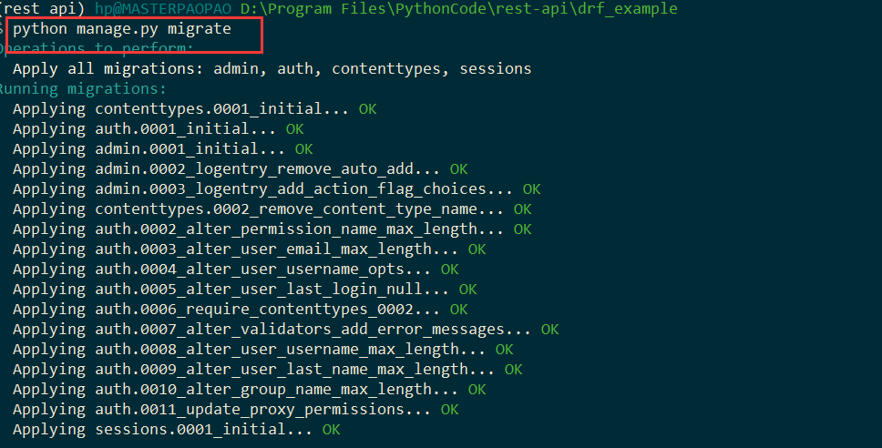

这个时候再去运行，你可以看到了API的真正面目：

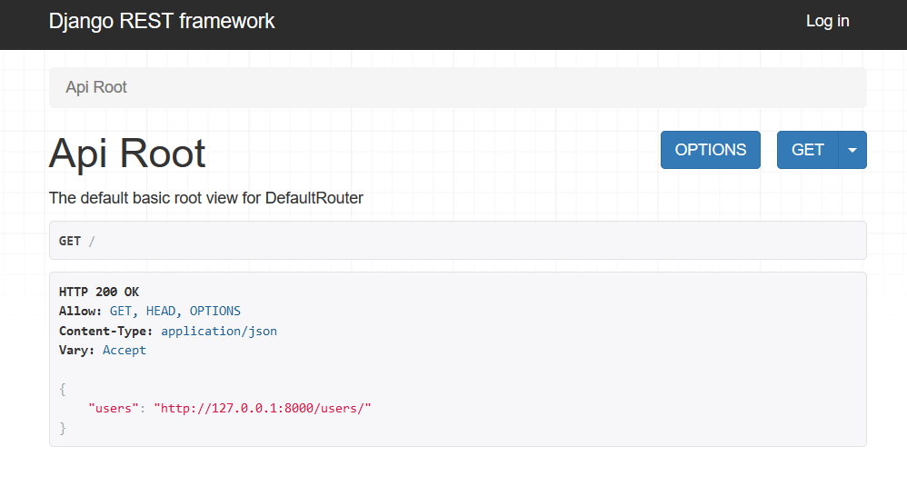

那么这个API到底在说什么呢，我们可以看到，在示例代码中，我们加入的是User对象，所以我们的api是返回users对象，但是我们是初始项目，并没有注册任何用户，点击它你会发现这儿是空的：

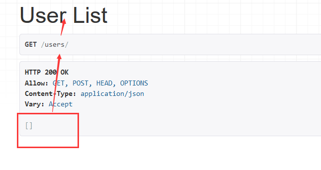

&nbsp;

#### 3.分析urls.py

如果你能听得懂我在说什么，那么这个快速示例的教学效果就达到了，我们所打开的API，是我们针对于User模型进行设置的：

第一步的API序列化是，确定API链接哪个模型，将我们的User一些属性的序列化，方便我们调用：

（确定User模型，将5个信息加入到API中供我们调用）

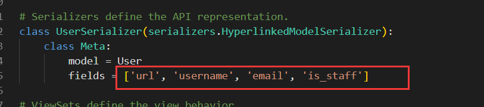

第二步是决定要调用User模型的多少个对象，然后把这个序列化后的结果加入到View视图中：

（确定要使用User模型的所有对象，并将序列化的结果加入到视图）

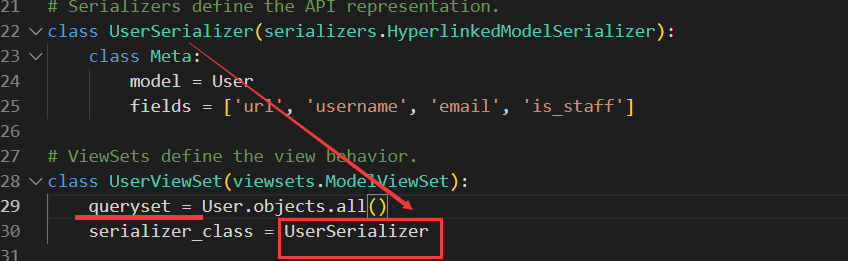

第三步是将视图加入到路由中，并决定urls的名字，这儿的路由所使用的是默认路由：

（使用默认路由，然后将这个User视图注册到路由，url设置为`'http://127.0.0.1:8000/users/xxxx'`）

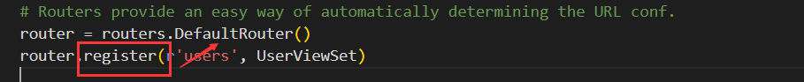

第四步管理url地址，将上面所使用的路由器url加入到整个应用url：

（这儿是将应用url的首页直接设置为上面路由器url的首页，即User模型API首页）

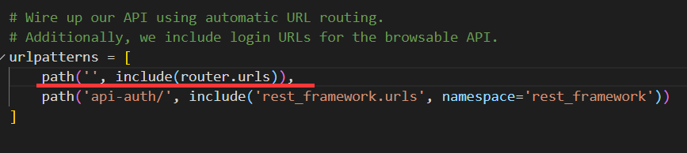

当你明白上面的意思之后，请你选择忘记上面的内容，就像张三丰当场传授给张无忌太极拳的时候，张无忌全忘光了乃是真正的学会。

因为我上面示范的是总urls.py开发API，只是为了展现示例，真正的开发肯定是到应用里面。

&nbsp;

#### 4.快速开始

我们可以正式开始学习REST API了，上面所创建的文件夹可以删掉了，因为API配置要放到应用里面。

所以重新创造一个一模一样的文件夹，不去动settings.py和urls.py，然后在进行下一步操作：

万物的开始是创建一个应用：`python manage.py startapp start`，别忘了注册到settings.py中。

最重要的肯定还是安装rest_framework应用，不然的话就用不了API：

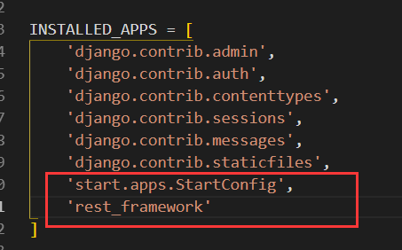

然后先创建一个用户，方便后面设计User的API：`python manage.py createsuperuser`

##### 1）Serializers

关键点来了，根据官方文档的引导，创建start/serializers.py，将要使用的模型给注册进去：

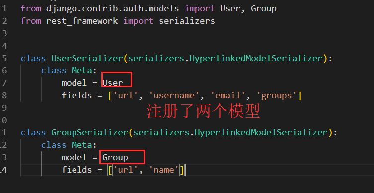

注册模型很简单，就是放到serializers.py文件，然后import导入模型，然后导入serializers模块；每个模型的命名方法是模型+Serializer，使用Meta元类交代模型和需要被序列化的模型属性。

##### 2）Views

接下来就不用我说了，当然是将模型加入到视图之中嘛，在上面的快速示例你就知道。

编辑quickstart/views.py：

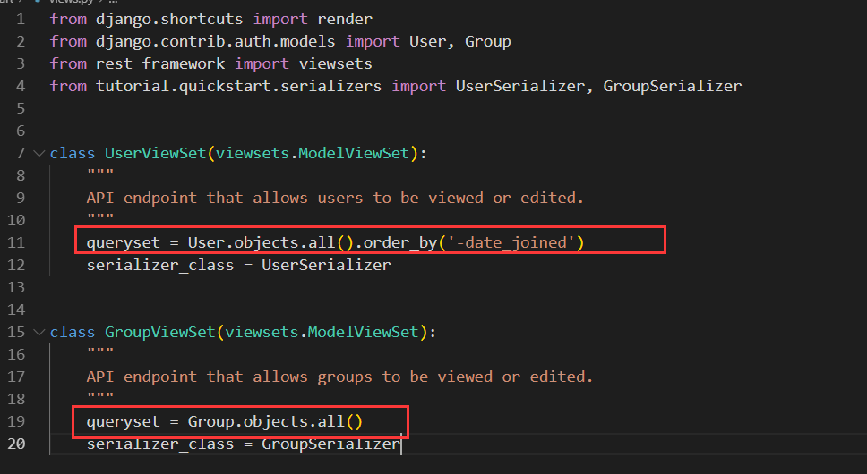

视图模型的命名方法也很简单，就是模型+ViewSet，然后第一行的queryset交代调用此模型的多少个数据对象，第二行就是固定的套路，序列化类serializer_class等于模型+Serializer，也就是上面的序列化模型名字。

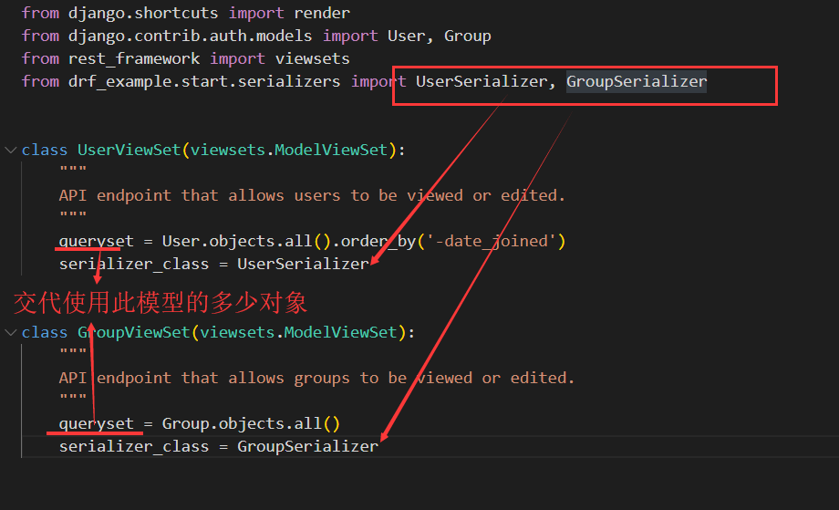

##### 3）Urls

序列化模型和视图模型搞定之后，该将视图模型加入到路由Urls里了，自定义命令API的url地址。

不过，这次的urls.py并不是应用，而是编辑到总urls.py里，这个是需要告诉Django项目的：

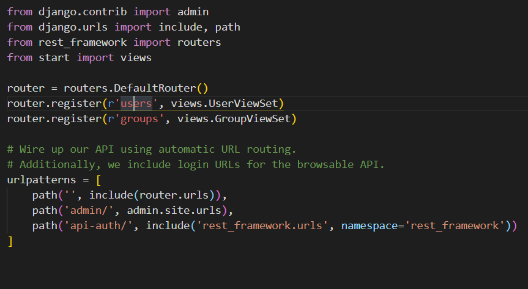

对了，别把admin的路由url给弄掉了啊！

这个时候我们可以看看此时的页面，两个API的页面就出来了：

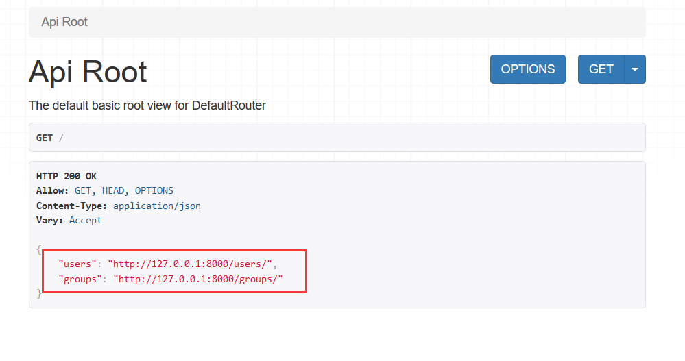

这样一来，就可以通过API添加数据和获取数据了，这就是REST API开发的优越性。

##### 4）Testing

API弄出来了之后，最重要的一步就是测试API的可用性：

直接输入`curl -H 'Accept: application/json; indent=4' -u username:password http://127.0.0.1:8000/users/`

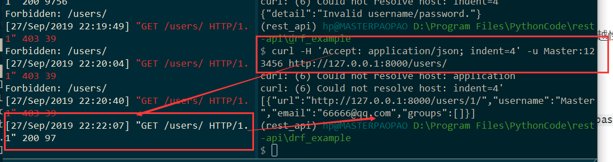

记得先修改命令中的用户名和密码，然后再来看看返回API的调用结果，果然成功返回。

但是这个测试方法，其实我们根本记不住，这个不现实！

所以我们需要安装第三方库：`pip install httpie`

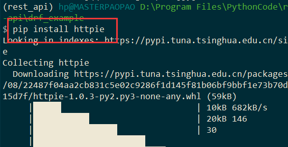

然后直接输入`http -a username:password http://127.0.0.1:8000/users/`

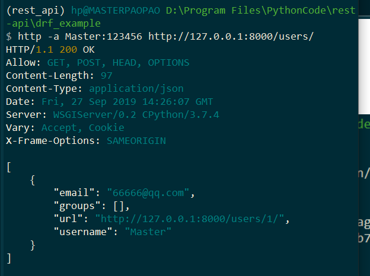

使用httpie第三方库的测试命令，是不是好记了很多？还返回了完整的API请求。

这便是REST API的妙用之处，大大方便了项目的便利性。

##### 5）XMind总结

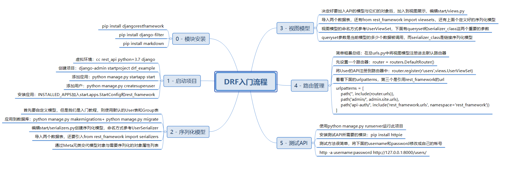

&nbsp;

#### 5.详解API序列化

本小节会详细的去解释如何创建模型以及将模型进行序列化的过程。

先从攻略开始：https://www.django-rest-framework.org/tutorial/1-serialization/

首先安装一个能让代码高亮的第三方库，我也不知道会怎么用，照着做就完事了

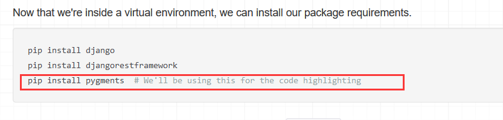

API序列化的讲解部分可以继续交给一个新的应用：`python manage.py startapp snippets`，别忘了往settings.py的INSTALLED_APPS里安装。

##### 1）models.py

接下来就是亲自弄一个模型了，不过这个官方文档，一下子上干货了，我还是一个个拆解吧！

这是一个代码模型，字段有代码块，代码语言，颜色等等。

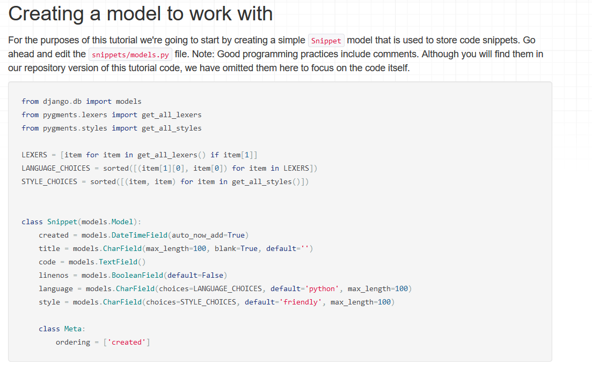

复制完进去之后直接进行`python manage.py makemigrations`+ `python manage.py migrate`应用到数据库。

我们好好看这一段代码，pygments是一个渲染代码的库，这里面必然有很多个代码语言包和各种样式。

这里面的Snippet模型就从pygments中抽出了各种语言和各种颜色，作为选择，这是一个机智的用法：

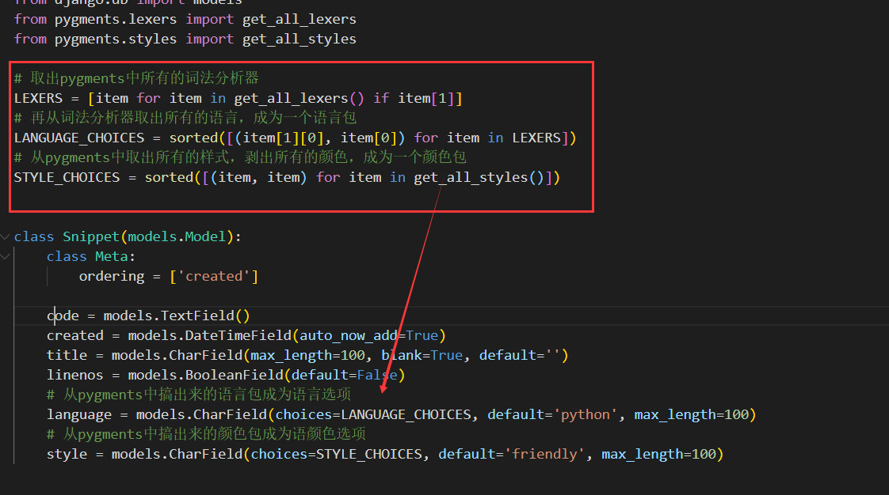

看懂了吗，这是pygments第三方库的妙用，从中挑出语言包和颜色包。一个模型就这样出来了。

##### 2）早期serializers.py

Snippet模型搞定之后，我们就可以把模型进行序列化，自然是创建serializers.py，将官网上的代码加入进去：

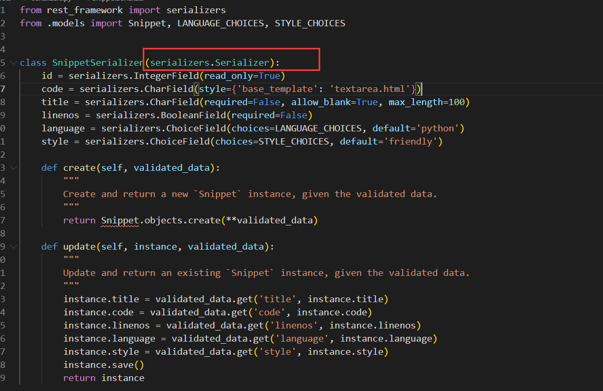

但是你发现没有，这个括号里面的参数并不是`serializers.HyperlinkedModelSerializer`，也就是说并不是我们上面所知道的将模型序列化的方法，说明这儿是早期的代码样子，快速示例是后来封装好的样子。

我们仔细分析下这段序列化的代码，这儿重新写一遍字段，相信不是重写模型，不然没有必要，我们可以根据参数来分析，我们发现，这个参数似乎是和表单有关系。

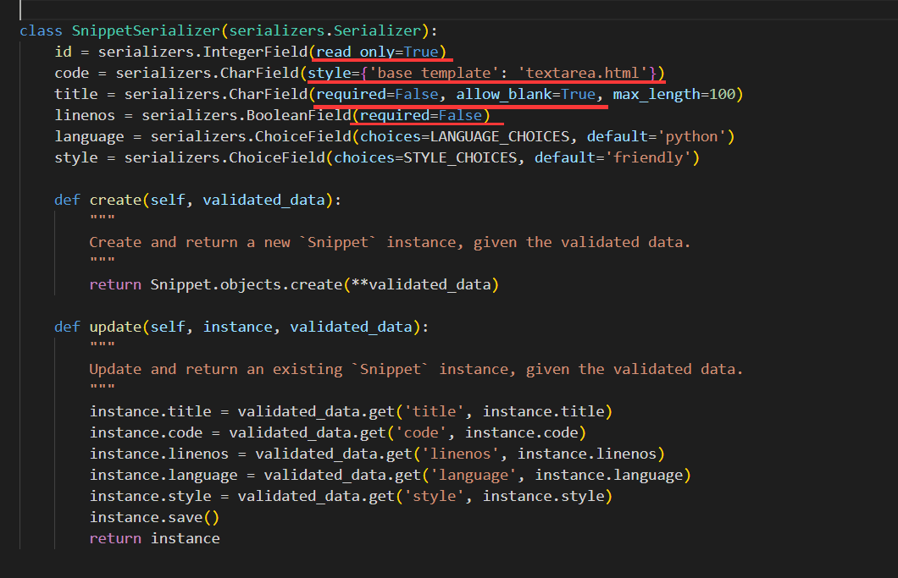

所以我们可以大胆猜测，参数是`serializers.Serializer`的序列化模型，并不是将模型加入API序列化，而是创建一个表单模型，并设置了表单的样式，下面的两个函数则是表单的内置方法，进行上传或者更新。

我们可以接着往下看，发现下面的步骤是通过Shell来添加数据，这个时候我们可以用Ipython内核来命令行交互。

##### 3）shell

直接`pip install ipython` + `python manage.py shell`进入命令行阶段

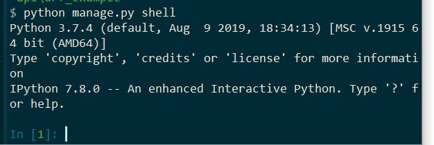

然后根据官方文档的引导，给Snippet模型添加一条代码数据：

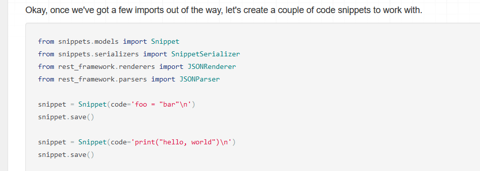


保存成功之后，snippet对象加入到序列化模型，进行渲染查询：

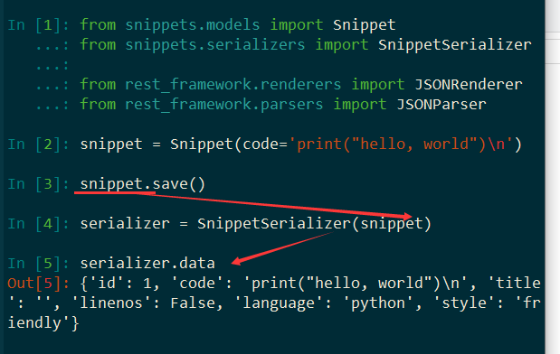

这样就查到了Snippet代码模型的一条数据。

当然了，这个是SnippetSerializer序列化模型渲染后的数据，属于data类型，事实上我们在数据传输的过程中，还要转换为json数据，所以也尝试把这个data用json来渲染下：

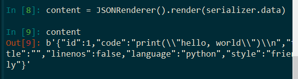

多添加几条代码进去，然后使用序列化模型渲染的方法，查看数据：

` s = SnippetSerializer(Snippet.objects.all(),many=True)` + `s.data`


我们可以到管理页面操作，先注册这个模型到管理页面，编辑admin.py：


糟糕，忘记取别名的`__str__`方法了，由于代码会很长，只取前面几位也罢


代码编辑如下：


##### 4）serializer.py

事实上，官网在下面已经提到了，我们不必使用第一种的复杂方法，那样编写代码成本太高。

最好的方法还是去使用快速入门示例那样的模型方法：


但是这儿跟快速示例不一样的是，入门实例使用的参数是serializers.HyperlinkedModelSerializer

这儿只需要使用最基础的serializers.ModelSerializer模型参数即可：


这样做就行了，为什么要讲诉第一种serializer.py的方法，只是展示出来最原始的代码样子，只不过后面这么长的代码已经被很好的封装了，就成了现在最简洁的样子，还是快速入门实例的model+ fields方法完成序列化。

##### 5）views.py

我们可以从官方文档看出来，views.py代码的编写，居然经过了这么多代的更新优化，可以看得出来Django REST API发展的活力，最终，views.py被优化成了快速示例的那个样子：


看到标出来的英文句子了，已经用了重写的方法将代码优化到最短，但是他们说还有更进一步的空间。这次直接优化到了generics模块，所以我们只需要关注queryset + serializer_class：


##### 6）urls.py

在前面的快速示例中，我们是在总urls.py完成了这个过程，但是这次就要具体到应用urls.py了。

编辑并创建snippets/urls.py，加入以下代码:


是不是回到了Django的应用urls.py的感觉？这个时候再回到总urls.py，改变它的写法，优化如下:


这样一来，是不是回到了当初使用Django的感觉？我们再去运行此项目，发现这个：


这是因为我们的应用urls.py将http://127.0.0.1:8000/snippets设置为首页，所以一进去并不能看到API。

所以我们再从url地址里面输入snippets，就可以跳转到我们的snippets的API页面了：


&nbsp;

#### 6.用户信息序列化

搞定Snippets模型的序列化之后，这个时候用户信息就要派上用场了。但是之前我们并没有注意这方面的问题，导致现在要推翻重来。

我们打算加入下面这两个字段，目的是为了让用户和Snippets模型建立关联：


也就是说，owner会和snippets建立一对多的关系，也就是一个用户写了多份代码。

##### 1）models.py

首先我们需要删除这两样东西，也就是传说中的删库跑路：


然后向snippets/models.py加入以下内容：


当然了，作为优秀的Django开发者，重写Snippets内部的save()方法必不可少：


重写save()方法的目的是为了给code代码添加上highlighted高亮模块的功能。

然后就是应用数据库 + 创建一个管理员用户，方法就不写了。

##### 2）serializers.py

搞定这一切之后，将用户模型序列化也加入进去：


别忘了，在前面的Snippet模型中，新添加了一个owner的User外键，并指定与snippets关联，所以将User模型序列化的时候，把这个snippets交代一下，并加入到fields。

##### 3）views.py

序列化模型搞定之后，下一步当然是视图模型了：


##### 4）应用urls.py

视图模型搞定之后，下一个就是urls.py了！把这个User的url地址安排进去：


最后的最后，我们知道，添加一条代码数据的时候，我们并没有填用户，这个时候就要自动化，将代码的用户自动设置为当前登录的用户，这个应该加到哪儿呢？

##### 5）优化表单

还记得早期serializers.py的方法是针对于表单提交吗，说明serializers.py负责的是表单提交这一类的工作，能够起到添加字段数据的作用。

为了能够让代码模型实例化一个对象的时候，它的user能够被自动填写为当前登陆的user。

所以我们要找到代码的视图模型，找到参数为CreateAPIView的SnippetList的序列化模型，添加这样的一条方法：


这样一来，User的数据表模型，序列化模型和视图模型都已经搞定了。

#### 7.登录验证和对象权限

为了更好的学习有关于权限的内容，我们需要再添加一位用户，进行比对学习。

使用`python manage.py createsuperuser`新添一位朋友：


这两位朋友都还没写过代码，这个没关系，后面慢慢添加。

##### 1）permissions模块

接下来应该干嘛，你们不觉得这个界面很奇怪吗，没有指定哪个用户就可以创建代码，这是不对的的。


我们需要添加个permissions模块，来确保创建一个Snippet示例需要有用户进行登录。


然后我们刷新下网页，访问snippets的API，发现下面没有了添加选项，因为我没登陆：


这就是刚才的permissions模块的作用，现在我们进行登录Master帐号，可以发现添加选项了：


然后我们添加两条代码数据，回到users的API，确认下状态，发现Master用户确实拥有了两条代码的数据：


为了方便测试，再添加两条代码数据给Paopao用户：


##### 2）permissions.py权限

这个时候，有没有发现一个很奇怪的现象，我登陆了Master用户，然后跳转到第三条代码数据的详情页，发现我可以进行编辑或者删除，这是不对的：


官方文档给出了很好的答案：


新建一个permissions.py文件，封装一个IsOwnerOrReadOnly的类方法加入views.py的SnippetDetail视图模型。

这样一来，对象的权限就合理了很多，全靠给SnippetDetail加入一个类进行约束权限。


&nbsp;

#### 8.优化API的URL

还记得入门示例的时候，我们进入首页的时候，可以看到有多少种API，而现在我们进入首页的时候，只能看到这个：


##### 1）优化API首页

所以我们需要设计一个视图，来完成集结所有API的任务。


官网已经给出了一个标准答案，这个视图的名字叫做API，只允许GET的请求方法进行访问，不允许以POST方法访问以免数据遭到修改。


搞定了视图应该干什么，当然是继续到sniipets应用的urls，将这视图添加进去：


然后我们刷新下网页，访问首页，看看是不是跟入门实例一样了：


##### 2）代码高亮

现在还有什么问题没有解决呢？

我们如果要使用API，代码如果过长，我们能在API的链接里面正常看代码吗？

所以我们需要一个新的视图，用来专门来内容较长的代码，格式也正确！


官方文档直接给了个代码高亮的视图模型，以Snippet代码模型为基础，进一步设计。

然后内部封装了个get方法，里面返回了一个url链接，所以我们在urls.py进行链接：


这样一来，我们就可以起到，点击每条代码数据的时候，可以看到格式整齐的样式：


##### 3）优化API详情页

事实上，这个项目还有可以继续优化的空间，上面优化了API首页，下面就可以优化API的详情页了。


有没有觉得这个地方需要优化？我看User的API，不是让你给我一个id就完事，我还要看详细的数据链接才可以。

所以根据官方网站的指示，序列模型的参数要优化成serializers.HyperlinkedModelSerializer：


意思就是说，不再用id数字来表达API，而是改用url超链接的方式，里面包含id的数据，来向你展示。

然后再回到views.py，将详情页的别名对象都安排上：


这个时候，我们再看看API详情页，已经优化了很多，可以直接点击链接进行管理。


有时候，详情页如果数据太多，我们就应该向settings.py安装一个分页的功能，便于浏览：

```python
REST_FRAMEWORK = {
    'DEFAULT_PAGINATION_CLASS': 'rest_framework.pagination.PageNumberPagination',
    'PAGE_SIZE': 3
}
```

效果也出来了，我们在这个地方可以看到：


&nbsp;

#### 9.优化视图模型参数

##### 1）优化views.py

还记得前面写视图模型的时候，我们使用了generic模块作为参数，现在它可能要退居幕后了。

在快速入门示例中，已经揭漏了使用viewsets的方法，视图模型的命名方式也会变成XxxViewSet。

所以，我们的views.py的写法需要推翻重来，统一使用viewsets模块的方法进行改造。


一个UserViewSet就能够集成User列表和User详情页了，将这两个功能封装好，看一下黄色的注释，直接说了提供list和detail的功能，不信邪的可以点进去源码查看：


Snippet视图模型的优化也是一样的道理，还是一个viewsets集成所有功能：


比如说代码高亮封装进来的过程，就借用了一个装饰器来强化highlight函数功能：


##### 2）优化urls.py

views.py我们已经优化好了，自然而然，urls.py的方法也要遭到变动。

由于在前面，我们已经将视图封装成了优越性功能的viewsets，所以路由的压力也小了。


只需要这些代码轻轻的封装，首页和详情页它们自己主动判断即可：


那么有人问题就来了那个新弄出来的api_root视图怎么办啊，是这样的，DefalultRouter模块已经包含了默认的api_root视图，所以我们在views.py写的api_root视图代码可以删除了。

这样一来，我们的项目代码已经做到了最简洁化的程度。

有人问题就来了，上面那么多套路化的代码，我记不住怎么办啊？

这儿就有一个愿意给现成代码公式的网站：www.cdrf.co/

&nbsp;

#### 10.最终总结

##### 1）脑图

assignments附件里面会上传本xmind文件，以及处理出来的PDF文件。


##### 2）文字

当然了，再好的PDF，也抵不过精炼的文字，根据这次的学习，我总结出来了DRF的使用套路，内容如下:

- models.py
  - 设计数据表模型阶很重要，交代清楚一对一、一对多以及多对多的关系
- serializers.py
  - 把数据表模型序列化，使用serializers.HyperlinkedModelSerializer作为参数
  - Meta元类交代model和fields
- views.py
  - viewsets模块自动集成数据列表，创建，修改，删除，更新等功能
  - 命名方式是XxxViewSet，参数是viewsets.ModelViewSet
  - 如果想让你的某个序列模型变为只读，不允许编辑，参数为viewsets.ReadOnlyModelViewSet
  - queryset和serializer_class分别交代数据对象集合和要连接的序列模型
- urls.py
  - DefaultRouter模块与viewsets模块配合，进行高度集成
  - 然后让router.register()注册进去，第一个参数是url名字，第二个参数是views.XxxViewSet
  - 总urls.py需要配置path('api-auth/', include('rest_framework.urls', namespace='rest_framework'))