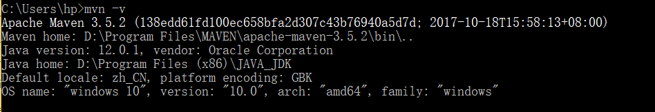

## 一.Linux基础

Author：Masterpaopao

本博客已经上传Github：https://github.com/Masterpaopao/masterblog/tree/master/Hadoop%E5%AE%9E%E4%B9%A0%E7%AC%94%E8%AE%B0

这是我的第一周实习记录，难免内容又杂又乱，废话也有点多，但它能帮助你注意搭建Hadoop集群的那些坑，所以阅读有什么麻烦之处，请多多见谅！

&nbsp;

如果你没有Linux基础，我是推荐你先去自学一遍的，至少要学会如何使用VMware去安装一个虚拟机，学会如何安装图形界面和安装命令行界面，然后就是那些Linux基础命令，学会各种文件夹的操作和安装配置等等就差不多了，与此同时我也提供了一份ppt供参考。

ping：检验是否能连通网络，比如ping baidu.com

service network restart：重加载网络设置（CentOS6命令）

systemctl restart network：重加载网络设置（CentOS7命令）

又是一个寂寞的"环境搭一天"的日子。

&nbsp;

## 二.环境搭建

此次笔记的基础：VMware 15 pro + CentOS 6 + XShell6

（这三个软件怎么完美配置好，不想多说，在下面瞧一眼是个不错的选择

而且，下面要用到的jdk压缩包，hadoop压缩包与maven压缩包都在下面，请提前下载好）

链接：https://pan.baidu.com/s/1m4of_J-Ot9Bj7yL6yMaObA 
提取码：56t1 
复制这段内容后打开百度网盘手机App，操作更方便哦

&nbsp;

#### 1.CentOS 7

我比较喜欢CentOS 7，所以我先讲这个，这个存在特殊性，CentOS 7不支持mysql

所以我们直接上MariaDB进行安装数据库，跟mysql存在镜像关系，是一样的，无需担心有差异性。

安装的过程，以及启动网卡的过程和JDK过程(在下面)我就忽略不计，有事找我

我直接进入MariaDB的过程，因为CentOS 7不支持MySQL了

&nbsp;

后记，经过亲身测试，CentOS 7也能运行老师给的数据库文件，步骤并没有多少差异

以下的内容主要介绍与6操作的不同之处，详细步骤请看下面的CentOS 6小节。

##### 1）防火墙设置

查看当前防火墙的状态：systemctl status firewalld

关闭当前防火墙，临时的：systemctl stop firewalld

永久关闭防火墙，重启也是关的：systemctl disable firewalld

##### 2）网络配置文件

vi  /etc/sysconf ig/network-scripts/ifcfg-eth33

进入编辑修改成静态IP，完事之后应当是systemctl restart network重启网络设置

&nbsp;

#### 2.CentOS 6

##### 1）虚拟机安装

讲述一下安装命令行界面的过程，比较复杂，首先下载好DVD文件

然后双击这个DVD文件，让电脑加载插入DVD驱动，成为光盘驱动器。

在VM中点击创建虚拟机，选择手动安装，它会自动去获取电脑的光盘驱动器。


这儿选第二个，然后在下图中选择skip


只安装命令行


ok，现在就直接配置好网络，启动网络，详情方法请见百度。

参考博客：https://www.jianshu.com/p/d933b592bdb4

接下来来解决JDK，MySQL和Tomcat的安装。

&nbsp;

##### 2）JDK的安装

安装JDK，以下的笔记来自于直播口述教学，以口语的形式展示：

在你的本地，找到那个jdk，建议放到d://download

然后打开SSH的窗口，使用root用户，你回去/~ ，mkdir home

你没有权限，你妈的直接回到root用户，别整这些有的没的

回去你的SFTP那儿

然后你复制你本地的jdk路径，put jdk路径

回去你的SSH，cd home 再ls查看是否成功

如果发现存在，直接yum install lrzsz

你就在home里面，你直接tar -zxvf jdk-7u45-linux-x64.tar.gz

成功之后，需要将jdk加入环境变量

vi /etc/profile 打开编辑，一直按j滑到最后

然后在新的一行加入：

export JAVA_HOME=/root/home/jdk1.7.0_45
export PATH=$PATH:$JAVA_HOME/bin

然后source /etc/profile加载环境变量

然后就在home文件里面touch Hello.java，然后vi Hello.java进去写代码

然后javac Hello.java ，编译成功直接java Hello，成功了就代表JDK装好了

&nbsp;

我当时在教人搭建JDK环境，又不好说话吵到别人，所以我采用了文字直播的教学，如果你们看不懂，没关系，请跳到下面的Hadoop入门里面的搭建前的准备小节，那儿拥有着最全面权威的JDK安装教学。

&nbsp;

##### 3）MySQL的rpm包

现在来进入MySQL的步骤

然后把两个MySQL配置好路径，再回到sftp把这两个文件put进linux的home路径（不懂sftp的可以研究怎么将windows的软件拖进去linux文件夹里面，我使用xshell直接暴力拖进去）

然后安装两条命令：

yum install libaio
yum install perl

然后直接在home环境：rpm -ivh MySQL-server-5.5.48-1.linux2.6.x86_64.rpm

顺便另外一条命令也直接撸了： rpm -ivh MySQL-client-5.5.48-1.linux2.6.x86_64.rpm

注意，这个过程我遇到了报错，经过我的排查，得出两条关键的命令:

**yum remove mysql-libs**

 **yum -y install autoconf**

输入这两条命令之后，再回到home文件夹环境(因为mysql文件在home)，再安装

rpm -ivh MySQL-server-5.5.48-1.linux2.6.x86_64.rpm

rpm -ivh MySQL-client-5.5.48-1.linux2.6.x86_64.rpm

安装好了之后，可以直接service mysql start了


然后是关键的步骤，给数据库设置密码:

/usr/bin/mysqladmin -u root password '123456'

我设置了123456作为密码，之后我直接进入数据库了

mysql -u root -p，然后根据提示输入密码

进入数据库成功之后，输入SHOW DATABASE;

就可以感受数据库的魅力了


BUG反馈，如果有人卡在Strart MySQL ....不动，建议后台杀进程

输入ps -ef | grep mysql查看后台mysql进程，记住它的id

然后kill -9 id杀掉这个进程，尝试重新启动MySQL

&nbsp;

##### 4）虚拟机数据库

然后我们需要找到附件给的压缩包，里面有教程，根据这个教程进行打补丁（Navicat.Premium.11.0.7_ttrar.rar,一种数据库管理软件）

然后打开这个主程序，点击connection链接，会发现使用的端口号是3306

但是我们linux上的3306端口号没有打开，输入以下命令打开:

加入到系统服务：chkconfig --add mysql

开机自动启动：chkconfig mysql on

这是自动启动，也就是说，当你虚拟机开机之后，数据库就启动了，然后我们进入MySQL

输入以下两条MySQL语句打开所有权限并设置123456为密码:

grant all privileges on *.* to 'root' @'%' identified by '123456';

flush privileges;

权限打开了以后就直接打开3306端口：

/sbin/iptables -I INPUT -p tcp --dport 3306 -j ACCEPT

/etc/rc.d/init.d/iptables save

&nbsp;

以上一共需要输入六条命令。

这六条命令意味着你每次启动虚拟机之后，数据库后台也会启动，并且你的数据库允许本机上所有东西链接（用各种SQL软件控制），只要输入对正确的IP与用户名密码。

然后就打开我们的软件，输入参数即可远程控制数据库


&nbsp;

##### 5）tomcat的配置

首先拿到tomcat压缩包，然后通过sftp协议传到linux里面的home文件夹

然后直接tar -zxvf进行解压，出来了这样的一个文件


我们把这个文件夹复制移动到/usr/local/里面，并成一个新的名字，tomcat

输入以下命令完成复制移动：mv apache-tomcat-7.0.68 /usr/local/tomcat

然后启动tomcat，输入：/usr/local/tomcat/bin/startup.sh

先关闭防火墙：service iptables  stop，这个是暂时关闭，并不是永久关闭防火墙

所以每一次重启虚拟机的时候，需要手动关闭一次

永久关闭防火墙的操作是chkconfig iptables off

然后直接./startup.sh启动一波tomcat

然后直接在本地服务器。直接输入http://(虚拟机的ip地址):8080/

比如我启动就是http://192.168.111.128:8080/

启动成功则没问题，有问题则自己解决！

关闭tomcat：/usr/local/tomcat/bin/shutdown.sh

或者是./shutdown.sh进行关闭

进入克隆环节。go go go！

&nbsp;

##### 6）虚拟机的克隆

注意，要使用pro版本的，拥有快照克隆功能

现在我们进行克隆操作，克隆出四个Hadhoop服务器，进行分布式项目

在我们操作之前，我们需要对正在使用的虚拟机进行快照

系统崩溃或系统异常，你可以通过使用恢复到快照来保持磁盘文件系统和系统存储。

所以这相当于还原卡，进入快照就是回到了特定的节点，一切如初。

&nbsp;

现在对现有虚拟机进行克隆，选择完整克隆，然后命名为Hadoop_One

直接进去克隆，等待完毕，进入系统

我们需要修改的有两个方面：静态IP确保ping通，虚拟机的名字

进去之后直奔主题，修改IP部分，设置成静态IP：vi /etc/sysconf ig/network-scripts/ifcfg-eth0

我有个模板，进行参考，具体的IP值应该以虚拟网络编辑器显示的为准


有两行需要直接删掉，UUID  HWADDR，使用dd删除整行

点击保存出来之后，service network restart发现会报错

这时候我们输入命令：rm -rf 　/etc/udev/rules.d/70-persistent-net.rules

然后输入reboot重启

打开之后我们输入ip addr，第二行产生了新的IP地址，直接ping百度，发现成功了

&nbsp;&nbsp;

接下来进入改名阶段，输入hostname 

发现主机名还是母体的名字，肯定要修改嗷

输入vi /etc/sysconf ig/network，直接修改hostname成Hadoop_One

退出来保存以后输入 hostname Hadoop_One让改名立即生效

然后输入vi /etc/hosts，会发现有两行

在第一行的最后面加上Hadoop_One即可


然后直接reboot重启，可以发现主机名确实改掉了，ping也通了

剩下三个克隆机我就不多说了，直接克隆第一个克隆体，然后只需要修改IPADDR和虚拟机名字就行了嗷

别忘了，修改IP的时候，第一行的Type要改，改成eth0，eth1，eth2，交互改，根据自己能不能ping通百度

&nbsp;

提醒小贴士：Xshell 6和真实虚拟环境输入不一样

Xshell 6应该输入sysconfig，而虚拟机内应该输入sysconf ig  有无空格的区别

&nbsp;

##### 7）Hadoop互通

搞定了四个虚拟机之后，确保你四个都能ping通，名字都改掉了

接下来进入互通的环节，确保这四个都能通信

这个时候我们需要同时打开四个虚拟机，都用Xshell6链接

连上了之后，用XShell6的工具，点击发送键输入到所有对话的功能

这样一来，你输入的一个命令都会同时发送到四个Hadoop虚拟机

&nbsp;

输入命令:vi /etc/hosts，统一添加进去这四行


这样一来，我们ping别的Hadoop不用再输入IP地址，而是直接输入代号，防止出现IP混淆的问题

接下来试试输入命令：ping Hadoop_Two

看看你的四个虚拟机是不是都能ping通了

&nbsp;

然后我们需要将Hadoop的网络联通到外网，也就是本地cmd也能ping通

输入yum install samba完成安装之后，输入service nmb start启动服务（重启之后需要再输入，临时性命令非永久）

然后一句iptables  -F直接打开通信外网的功能（重启之后需要再输入，临时性命令非永久）

本地cmd尝试通信


##### 8）配置XShell

因为我们的Hadoop已经能被本地外网访问了，所以我们可以进一步配置会话的别名

在主机这一块并不需要填具体IP地址了，而是直接写虚拟机的名字即可


然后我的唱跳rap篮球的组合总算是弄好了。

&nbsp;

## 三.再次搭建

本次笔记基于CentOS 6，谢谢！

事前补充，经过后面redis集群的使用，一共需要6个克隆虚拟机进行操作

所以请查阅上面的操作进一步配置剩下2个


##### 1）ruby升级

当你来到这一步的时候，确保你的vi /etc/hosts是这个样子的


当你的六个虚拟机都拥有名字并且能互相ping通的时候，我们可以进行下一步了

&nbsp;

首先使用XShell6破解版，因为免费版一个窗口只能使用4个

具体方式自行解决或者来联系我。

同时打开六个虚拟机，并使用XShell6同时控制这6个虚拟机

打开查看，选择撰写-撰写窗格


然后修改设置，发送到所有会话窗口


就可以输入一条命令同时控制六个了

&nbsp;

现在我们输入一个命令都会被发送到六个窗口

现在我们了解一下redis是使用c写的，我们需要c语言编译工具

输入yum install gcc-c++进行安装

&nbsp;

然后提前安装集群的需要工具

yum install ruby

yum install rubygems

&nbsp;

在这停顿~~~redis需要配合ruby进行集群，CentOS6安装好后的rubuy应该是1.8左右

但是ruby的版本建议是2.2以上的，因为这是redis的最低需要，不然出问题

所以我们从这个网站进行下载： https://cache.ruby-lang.org/pub/ruby/2.2/ruby-2.2.7.tar.gz

这个链接不行就这个，用迅雷下更快: https://cache.ruby-lang.org/pub/ruby/2.2/ruby-2.2.7.tar.gz

&nbsp;

下好了之后直接把这个压缩包拖进去XShell6，注意是都拖进六个，再同时操作

然后我们拖进去的地方是/root/home，在这个地方tar -zxvf ruby-2.2.7.tar.gz进行解压

解压完成之后进入 cd ruby-2.2.7，直接两条命令一口气都编译

./configure --prefix=/usr/local/ruby-2.2.7

make && make install

然后我们就静静等待六台电脑都编译完成即可

(如果不成功，直接删掉ruby-2.2.，再解压，再重复上面的步骤)

&nbsp;

都成功之后，为了保险起见，先rm -rf /usr/bin/ruby

然后 ln -s /usr/local/ruby-2.2.7/bin/ruby /usr/bin/ruby 进行覆盖

然后 cd /usr/local/ruby-2.2.7，进去之后直接都覆盖

cp bin/ruby /usr/local/bin

cp bin/gem /usr/local/bin

最后，输入ruby -v，如果六个都出来了ruby2.27的提示，则你的操作成功。

如果操作不成功，请根据下面两篇博客进行调整

ruby 2.2.7

https://www.cnblogs.com/smileyes/p/7489484.html

ruby 2.5.1

https://www.cnblogs.com/ivictor/p/9768010.html

&nbsp;

##### 2）redis前台

拿到我们的redis-3.0.7.tar.gz之后，拖入六个服务器的/root/home

然后进行解压到指定的地方：tar -zxvf redis-3.0.7.tar.gz -C /usr/local/src/

注意，这儿我们解压到了/usr/local/src/那儿

六个服务器解压完成之后，都cd /usr/local/src/redis-3.0.7/，进行redis的编译

make && make install

make MALLOC=libc && make install

一口气输入两条命令就完事

&nbsp;

完成之后，因为这个文件夹位置比较复杂，我们可以便捷一点

make install PREFIX=/usr/local/redis

将这个编译到一个新的文件夹：/usr/local/redis

然后你直接cd /usr/local/redis，你应该看到只有一个bin文件夹


然后你直接cd bin进去，输入 ./redis-server ，如果你看到这个页面

这个是redis的前台，检查六个服务器是否都成功给显示前台，按ctrl+c退出


&nbsp;

##### 3）redis后台

现在，后台肯定是也要放到便捷的地方去启动

cp /usr/local/src/redis-3.0.7/redis.conf /usr/local/redis/bin/

好了之后你的/usr/local/redis/bin/应该就多了个redis.conf


然后修改配置文件，启动后台：vi redis.conf

找到daemonize no，将no改成yes

然后保存更改出来，启动后台：./redis-server redis.conf

然后./redis-cli 直接进入redis数据库，如果有效，则后台成功配置

输入./redis-cli shutdown关闭redis后台，结束进程

确保你的六个服务器都能在上面生效

&nbsp;

##### 4）ssh免密

现在你的六台服务器都能执行redis后台

在前面/etc/hosts，六台机器都能互相ping通的情况下，我们可以进行ssh免密操作

这样一来其中一个服务器就可以随意登陆其他服务器，进行操作

现在，我们就以第一个服务器为主，也就是Hadoop_One

(此过程可以开全部控制，命令都输入到六台服务器)

直接ssh-keygen -t rsa -f ~/.ssh/id_rsa，碰到提示直接回车，这个时候你已经生成了公钥+私钥

然后一口气连输入六条命令，碰到提示直接输入yes和输入正确的密码进行解锁免密

ssh-copy-id root@Hadoop_One

ssh-copy-id root@Hadoop_Two

ssh-copy-id root@Hadoop_Three

ssh-copy-id root@Hadoop_Four

ssh-copy-id root@Hadoop_Five

ssh-copy-id root@Hadoop_Six

这样一来，你的六台机器都记录了六台的公钥，可以进行免密登陆了

现在我们关闭全部控制，随机挑几个样本，使用sss Hadoop_XXX来测试免密

注意，ssh成功的时候会切换账户，测试完毕应该ssh 回到原来的账户

&nbsp;

也就是说，上面的所有命令全部同时发送所有服务器，发送完以后一个个去点击确认，再发送下一条。

##### 5）sh脚本

参考文献:

https://blog.csdn.net/m0_37822234/article/details/82494556

&nbsp;

现在，写sh脚本的目的就是只需要通过第一个服务器(主服务器)

进行控制六个服务器同时启动redis，当然了，还有关闭redis，所以是两个脚本

所以我们找一个合适的地方写两个脚本：cd /usr/local

然后touch startRedisAll.sh和touch closeRedisAll.sh

然后就分别vi编辑

vi startRedisAll.sh


vi closeRedisAll.sh


写完了之后肯定不能立马用

这两个sh脚本需要赋予chmod 777 权限，也就是最高权限，才可以进行控制

chmod 777 startRedisAll.sh

chmod 777 closeRedisAll.sh

写好了之后，单独对Hadoop_One服务器输入以下的命令

启动六台服务器的redis：./startRedisAll.sh

为了验证启动情况，打开XShell6的全部控制，都输入ps -ef | grep redis

如果看到六个都成功启动了redis后台，则是成功

然后再关闭全部控制，再对第一个 服务器输入./closeRedisAll.sh

这样一来，应该都关闭了六台服务器的redis后台，怎么检查就重复上面的步骤。

&nbsp;

##### 6）gem安装

ssh能免密登陆了，就可以着手搭建集群的准备工作了

因为我们的gem不能访问联网的东西，也就是缺少openssl

我目前也得不到有效的解决方案，所以只能进行离线下载

将redis-3.2.2.gem文件拖进/root/home内，六台服务器都要拖进去

然后进行gem install redis-3.2.2.gem进行离线安装

如果安装成功，恭喜你们，可以进入下面的集群配置了

温馨小提醒，需要先关闭防火墙呢，这边建议亲亲直接永久关闭防火墙

输入命令：chkconfig iptables off

&nbsp;

##### 7）集群配置

首先需要进入redis.conf修改配置，使之支持集群

使用XShell 6 控制六台服务器，输入vi redis.conf

找到# cluster-enabled yes，将注释给去掉，变成cluster-enabled yes  ：开启集群

找到appendonly no，改成appendonly yes，开启日志报告信息

值得一提的是，我是六台服务器的真集群，IP地址不一样，所以我不需要修改端口号

如果有人是一台linux，六个文件夹做伪集群，需要修改六个服务器的端口

好了之后，六台服务器都进入cd /usr/local/redis/bin，直接连续删除三样东西

rm -rf appendonly.aof

rm -rf dump.rdb

rm -rf nodes.conf

完事之后，进入cd /usr/local/ 

关闭六台服务器的全部控制，对第一个服务器启动  ./startRedisAll.sh

然后控制六台服务器都输入ps -ef | grep redis，检查一下六个是不是都启动了redis后台

&nbsp;

没有什么问题之后关闭全部控制，使用第一个服务器

进入redis源文件 cd /usr/local/src/redis-3.0.7/src/


因为我是六台服务器IP不一样，端口都一样

所以我输入的配置进集群的命令是：

./redis-trib.rb create --replicas 1 192.168.111.128:6379 192.168.111.129:6379 192.168.111.130:6379 192.168.111.131:6379 192.168.111.132:6379 192.168.111.133:6379

然后遇到提示直接yes，不出意外的话，应该是一路绿灯

如果出问题了，请自行百度，毕竟我搞到了凌晨1点半才配置好

&nbsp;

然后输入redis-cli -c -p 6379进行测试

连续set几个数据进去，如果看到被随机分配的提示，则说明你成功了


&nbsp;

##### 8）集群问题

重启之后如果集群用的有问题了，直接刚

我属于弄着弄着就突然好了，所以我不知道半个小时内哪些命令是关键的

所以我把输入的命令都给写上：

首先按照惯例，cd /usr/local/ ，启动 ./startRedisAll.sh

用ps命令检查一下六个服务器的后台是否成功启动redis服务

然后cd /usr/local/src/redis-3.0.7/src 输入redis-cli -c -p 6379

输入flushall，全部清空，然后exit

redis-cli -c -p 6379 -h 192.168.111.128  flushdb

这条命令重复6遍，分别清空六个服务器的数据

./redis-trib.rb check127.0.0.1:6379  肯定是异常状态

./redis-trib.rb fix127.0.0.1:6379 遇到提示直接输入yes，然后大概率是没解决的

最后再来一波握手

redis-cli -p 6379 cluster meet 192.168.111.128 6379

redis-cli -p 6379 cluster meet 192.168.111.129 6379

redis-cli -p 6379 cluster meet 192.168.111.130 6379

redis-cli -p 6379 cluster meet 192.168.111.131 6379

redis-cli -p 6379 cluster meet 192.168.111.132 6379

redis-cli -p 6379 cluster meet 192.168.111.133 6379

不出意外应该都是OK，然后输入redis-cli -c -p 6379进去

尝试set几条数据看看是否修好了，如果不行，果断卸载重装redis

&nbsp;

还有一种情况就是启动redid后台的时候不同步，那就再启动一下closeRedisAll.sh脚本

然后再启动startRedisAll.sh一起启动，并等待一会儿

然后使用RedisDesktopManager软件检查一下各个redis服务器的链接状态

&nbsp;

##### 9）重装集群

后记：我果然遇到问题了，于是重装了redis，根据上面的笔记一步步走到这儿的时候


我遭遇到了无法创建集群的问题，然后我找到了这篇博客

献上文献：https://blog.csdn.net/xianzhixianzhixian/article/details/82777767

前提是启动所有的redis后台

首先进入第一个服务器：cd /usr/local/src/redis-3.0.7/src

输入redis-cli -c -p 6379 -h 192.168.111.128，进去之后直接flushdb + cluster reset 两条命令伺候

完事按exit退出，然后把剩下的5个redis服务器，都重复一下上面的操作

完成之后，关闭所有的redis后台，开启全部控制，进入cd /usr/local/redis/bin

直接无脑删掉多余的东西

rm -rf appendonly.aof

rm -rf dump.rdb

rm -rf nodes.conf

完事之后全部开启redis后台，第一个服务器进入cd /usr/local/src/redis-3.0.7/src

输入./redis-trib.rb create --replicas 1 192.168.111.128:6379 192.168.111.129:6379 192.168.111.130:6379 192.168.111.131:6379 192.168.111.132:6379 192.168.111.133:6379

就可以看到令人愉悦的集群成功了


&nbsp;

## 四.Maven配置

##### 1）MAVEN配置

首先拿到附件里面的apache-maven-3.5.2-bin.zip与repository.rar

将它们两个解压到你认为合适的地方，在windows本地，我解压到了D:\Program Files\MAVEN\

然后我们进入解压后的apache-maven-3.5.2目录，再进去bin目录

将此时此刻的路径加入到系统环境变量


完事之后，你可以在cmd输入mvn -v验证一下是否成功



（注意，你的windows最好也有JDK环境，MAVEN依附于JAVA的）

然后我们下一步就是修改apache-maven-3.5.2\conf下的settings.xml，将仓库依赖指向于另一个目录，也就是我们一同解压下来的repository目录


接下来我们就可以安装eclipse了，但是我怀疑有人不会安装，我在这儿提示一下，进eclipse官网下载一定要选择国内镜像源的压缩包，然后直接解压使用，不然你绝对几小时下不完。

&nbsp;

打开eclipse后，选择上方栏的Window，选择Preferences，修改MAVEN选项


在Installations这儿，修改maven仓库的指向地址


然后我们就要修改repository仓库的指向了，完事之后直接apply应用


##### 2）MAVEN项目

一切就绪之后，我们可以开始创建一个工程文件了

点击左上角的File，new一个project出来，然后我们要选择Maven Project才对


然后就是一路Next，直到它要求你命名的时候，你就参考我这个图


创建成功之后，你会在左边看到新产生的maven工程文件


我们现在进入pom.xml进一步配置包依赖，将dependencies标签下的内容替换成下面的内容

```
        <dependency>
            <groupId>junit</groupId>
            <artifactId>junit</artifactId>
            <version>4.12</version>
        </dependency>
        <!--redis集群依赖-->
        <dependency>
            <groupId>redis.clients</groupId>
            <artifactId>jedis</artifactId>
            <version>2.7.2</version>
        </dependency>
        <!--josn依赖-->
        <dependency>
            <groupId>net.sf.json-lib</groupId>
            <artifactId>json-lib</artifactId>
            <version>2.4</version>
            <classifier>jdk15</classifier>
        </dependency>
```

不出什么意外，如果出意外，你绝对没严格按照我的操作来，直接按Ctrl+S进行保存依赖配置

然后你应该会在MAVEN的Library下看到新增的这些jar包


现在你可以进入写代码环节，进行控制redis集群的操作，往里面添加数据或者删除数据

##### 2）JAVA控制

我们就在src/test/java下面创建两个Class，分别是RedisCluster.java与Test.java（删掉了AppTest）


RedisCluster.java是来编写与RedisCluster交互的程序，而Test就是选择性功能测试的文件

RedisCluster.java的源码我已经放入了java.txt。请去自取源码使用

当你的redis集群运行没任何问题，set与get没任何问题，甚至用上了RedisDesktopManager

那么我就开始了，首先第一个肯定是连接到你的redis集群


在这儿我就只讲第一个操作函数，后面的函数你们可以自行尝试


这个函数是向集群内添加一个数据，现在拿到Test.java里面测试


当你执行完毕的时候，你可以通过RedisDesktopManager刷新一下，是否添加来了一个新的数据。

然后你可以手动在这个管理软件删掉这个数据，而无需再执行一次函数。

RedisTest.java就是各种添加数据的函数，展现了几种控制redis的方式，可以略作了解。

&nbsp;

##### 3）Shell编程

还记得上面的ssh吗，我们写了两个sh脚本来控制redis集群的开启与关闭

这个过程就是shell编程，虽然我们现在已经来到了Hadoop入门环节

但是在此之前，我们需要沉淀一下，沉下心来，正式学习一下shell编程

这毫无疑问是一门有用的技术，我已经放了一个ppt作为学习参考，最重要的是自己要沉下心来去学习shell语言，并用它实现一些批量控制的操作，那么你就入门了。

&nbsp;

## 五.Hadoop入门

##### 1）无语到哭的限制

这个限制白白浪费了我一下午的光阴，历经千辛万苦终于找到了一个相关的博客

瞬间拨开迷雾，一往无前，如果我要是没发现这个问题，可能Hadoop搞几天都不会好

这个限制是什么？在Hadoop中主机名不让用下划线！也不能用分号，斜杠等

我原来的六个主机名就是Hadoop_One,Hadoop_Two,Hadoop_Three……

所以搭建集群的时候疯狂报这个错误，解析不了我的主机名，跑去解析别的主机，也解析失败

就会报出这样的错误，所有主机都启动一遍nodename和datanode，都不成功


我所以又走上了漫长的改名重建的道路，让我痛哭流涕

于是我就分别对六台服务器进行改名，

先输入vi /etc/sysconf ig/network，将主机名里面的下划线改成横杠

然后都hostname Hadoop-One……，六台都更新好hostname

然后输入 vi /etc/hosts，将里面的主机名也改一下，好了之后，全部输入reboot，重启

&nbsp;

重启之后，六台服务器想必都换上了新的名字，为了保险起见，各自ping一遍改名后的名字

ping Hadoop-One，ping Hadoop-Two，ping Hadoop-Three……

然后因为我们改名了，所以ssh免密失效了，所以需要重新执行一遍ssh免密过程

请照着上面的ssh免密小节重复来一遍

（笔记的注意部分）


好了之后，搞几个ssh交叉测试，确保互相ssh免密登陆，然后六台服务器都cd /usr/local

将我们写的两个redis脚本，startRedisAll.sh和closeRedisAll.sh里面的主机名改一下

改好了之后，Hadoop-One单独启动startRedisAll.sh，检查一下六个服务器是否成功启动后台

然后进入cd /usr/local/src/redis-3.0.7/src，输入redis-cli -c -p 6379

测试一下，redis集群是否可用，如果出问题了，直接翻阅上面的笔记再重刚一波redis集群

&nbsp;

这样一来，你已经更换了你的主机名，并重新配置了ssh免密，创建了可用的redis集群

然后就可以进一步往下看了

&nbsp;

##### 2）没睡醒的意外

睡眠时够不够，自然就这样，早上迷糊糊地打开了六个虚拟机，进行检验集群

然后我为了点两下的方便，打开了输入所有键发送到所有窗口，而非撰写窗格

就在这个时候，发生了意外，第一个服务器照常输入命令

而剩下五个服务器却发生了意外，输入的命令没有删掉，从而删掉了/usr/local

慌忙之中，我寻找解决方案，找到了下面这篇文章

https://www.cnblogs.com/zongfa/p/8391837.html

从这篇文章我们可以找到解决方案

对另外五台服务器（注意，请在虚拟机里面输入，在XShell6输入容易崩溃）输入这样的命令:

scp  -r root@192.168.111.128:/usr/local /usr/

（使用scp命令需要先安装yum -y install openssl-clients）

然后就是漫长的等待过程，让剩余五台服务器恢复/usr/local文件

&nbsp;

我是一个疑心病很重的人，在后面的hadoop配置的时候总是出意外，我就以为是直接复制过去行不通，于是我就克隆了五次第一个健康的服务器，重新来过

现在想来，是我想多了，直接复制过去完全没问题，因为linux系统"一切皆文件"，只要文件补全，功能就恢复，在后来我才意识到我克隆五次的操作没必要

复制好了之后，检查jdk，mysql，redis集群，ssh免密登陆即可

&nbsp;

##### 3）搭建前的准备

为什么把这部分放到最前面来，从一开始直接解决可能会出现的问题，总比后面行不通反复改来改去来得实在，认真跟着我排查一遍后，下面的玩意应该是一次性过

jdk的重置，没错，你没看错，我也不想多言，跟着我一步步走总比啥都不干好

以下的操作六台服务器都一起弄，方法是撰写窗格

我把jdk1.7.0_45.tar.gz的jdk安装包，放在了/root/home下面

让我们cd /root/home，然后直接tar -zxvf jdk1.7.0_45.tar.gz

然后直接rm -rf /usr/bin/java，删掉虚拟机默认安装java的位置

然后输入sudo ln -s /root/home/jdk1.7.0_45/bin/java /usr/bin/java进行覆盖

打开vi /etc/profile，滑到最后一行，改成下面的划线部分


完事之后，直接source /etc/profile，加载环境变量

然后统一输入java -version，看看六台服务器输出的结果是不是都为 jdk1.7.0_45


然后输入jps，如果不报错，有这样的反应，那就OK了


如果不是，请反思上面的操作细节是否漏掉了，当你六台服务器的java -version都是1.7.0_45后

就可以进行往下一步的操作。

&nbsp;

##### 4）令人胸疼的问题

参考文献：

https://blog.csdn.net/qq737050283/article/details/47054899

&nbsp;

我因为这个错误，折腾了我一个晚上，浪费了我的大好光阴，真的心痛

当我打开hadoop页面的时候，一个Live Nodes都没有，也就是说我的namenode起来了

但是我的所有datanode都没起来，这问题让我苦恼了很久

直到我尝试学习查看日志的时候，发现我的namenode并没有以我期望的192.168.111.128去连接其他datanode，这让我大吃一惊，那我的主机namenode以哪个ip去链接的？

然后我打开了vi /etc/hosts，我看到了我愚蠢的设定，狠狠地给自己了一个大巴掌


天知道，我为啥要这么写。。。文件的读取顺序是从上至下的

namenode解析我的Hadoop-One主机名的时候，解析成了127.0.0.1！

解析成的127.0.0.1的ip当然连接不到我的所有datanode，那不符合设置！

然而我的其他五台服务器也是这么设置的。。。所以我六台服务器都删掉了多出来的主机名

确保加载主机名的时候，能够被解析到正确的ip地址

删掉了之后，六台服务器全部重启网络设置，service network restart

好了之后，我们可以开始Hadoop的安装了

&nbsp;

##### 5）Hadoop的安装

在上面，你经历了jdk重新设置，主机名的排查，还确保你的防火墙都关闭，ssh免密登陆通顺

现在我们需要对六台服务器设置时间的同步，因为集群要把ntp指向同一个时间源 

不然时间不同步，分分钟崩溃

打开撰写窗格，输入date -s "2019-6-21 10:25:00"同时发送给六个服务器

双引号里面的时间以你当前时间为准

&nbsp;

以下的步骤都是在撰写窗格中进行，同时对六台服务器进行操作

注意操作的时候，不要太快，要有耐心，一个个检查六个服务器再进行下一步

然后将准备好的Hadoop-2.6.4.tar.gz放入/root/home，然后cd /root/home

tar -zxvf Hadoop-2.6.4.tar.gz -C /usr/local/src/，将这个解压到/usr/local/src/目录

六台服务器全部解压完成之后，打开vi /etc/profile，将最后三行改成我这个样子


请确保一模一样地改完之后，直接source /etc/profile

&nbsp;

然后继续撰写窗格，整个过程依旧是六台服务器同时进行

cd /usr/local/src/hadoop-2.6.4/etc/hadoop，我们正式配置文件

这个过程一定要耐心，每改一次，一定要六个服务器逐个检查，然后保存修改

---

进入vi hadoop-env.sh，只需要修改两个地方，把这两个地方都改成绝对路径


如果你跟我上面笔记的操作一模一样，你可以直接抄，否则就进行微调

---

进入vi  core-site.xml

复制粘贴我给出的代码

```
<configuration>
<property>
<name>fs.defaultFS</name>
<value>hdfs://Hadoop-One:9000</value>
</property>
<property>
<name>hadoop.tmp.dir</name>
<value>/home/hadoop-2.6.4/tmp</value>
</property>
</configuration>
```

只需要改一个地方


---

进入vi hdfs-site.xml

```
<configuration>
<property>
<name>dfs.namenode.name.dir</name>
<value>file:///home/hadoop/data/name1,file:///home/hadoop/data/name2 </value>
</property>
<property>
<name>dfs.datanode.data.dir</name>
<value>/home/hadoop/data/data</value>
</property>

<property>
<name>dfs.replication</name>
<value>5</value>
</property>

<property>
<name>dfs.secondary.http.address</name>
<value>Hadoop-One:50090</value>
</property>
</configuration>
```

需要修改两个地方


---

先mv mapred-site.xml.template mapred-site.xml ，改个名字

然后进入vi mapred-site.xml，直接复制进去

```
<configuration>
<property>
<name>mapreduce.framework.name</name>
<value>yarn</value>
</property>
</configuration>
```

---

进入vi  yarn-site.xml

```
<configuration>
<property>
<name>yarn.resourcemanager.hostname</name>
<value>Hadoop-One</value>
</property>

<property>
<name>yarn.nodemanager.aux-services</name>
<value>mapreduce_shuffle</value>
</property>
</configuration>
```

只需要改一个地方


---

确保你的六台服务器都完美执行了上面的修改之后，

关闭撰写窗格，单独对你设置的老大主机，也就是namenode，输入一条命令

进入vi slaves


---

一切准备就绪，让我们开始初始化，我相信当你严格执行我上面的步骤的时候

你会像我一样一次性过掉

还是一样的，对你的老大主机输入以下命令，开始表演

（注意事项，我下面的命令是基于使用老师给的，如果你是网上下载的hadoop，请翻阅到后面）

hdfs namenode -format，不出意外，直接yes，注意日志信息，应该都是INFO级别

然后直接start-all.sh，就可以启动1台namenode和5台datanode了

完成之后，输入jps，你应该看见了这个


然后打开网页端你的主机地址:50700，完美地打开了，而且live nodes也都启动了，正好是5个节点

我的网页就是：http://192.168.111.128:50070/，暂时还不知道出了问题没

有没有问题就根据首页的Live Nodes的节点数量查看


有问题的话，检查是否出现漏掉我上面的某一个步骤，检查所有服务器的xml配置

如果没有问题，打开Datanodes页面，你将看到这个


 这个页面就是hdfs的管路页面，用来查看HDFS集群状态，关注文件传输的状态

还有yarn的管理页面，端口号8088，http://192.168.111.128:8088/

这个可以通过控制台查看对应节点的资源状态，查看作业的调度信息等等


由此为止，你的Hadoop入门已经完成了，可以继续往下搭建了！

&nbsp;

谢谢你阅读我的笔记，祝福你搭建出成功的Hadoop集群！

本周的实习记录就到这儿，参杂了很多的自学笔记，难免废话过多，但是我在克隆的时候，东山再起，又对着我的笔记重新来了一遍，优化了一下笔记，优化了我的笔记步骤，如果想真心搞成功，请耐心阅读！

&nbsp;

我认为一个程序员最重要的是自学自强能力，查阅资料能力和分析报错能力，最重要的还是心态！

