## 一.HDFS详解

#### 1.再会Hadoop

在上周的实习中，我完成了JDK，MySQL，redis集群和hadoop集群的搭建

遗憾的是，匆匆忙忙赶进度，并未仔细研究hadoop的原理，今日计划于复习相关原理与概念

Hadoop拥有一个庞大的生态圈，最终的目的就是完成大数据

它有一些不可缺少的组件：

①HDFS：分布式文件系统

②MAPREDUCE：分布式运算程序开发框架

③HIVE：基于大数据技术(HDFS+MAPREDUCE)的SQL数据仓库工具

④ZOOKEEPER：分布式协调服务基础组件

以上四个是关键的组件，剩下的组件我就不提了，弄清楚上面四个才是重点


先来看看经典的大数据项目-网站日志分析系统

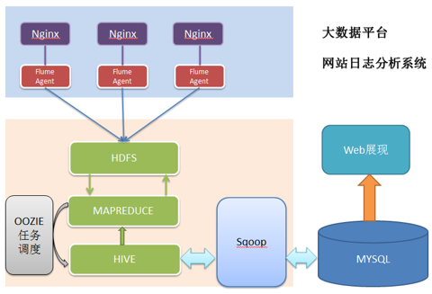

这个就是一个获取数据，收集数据，处理数据，整理数据再到将数据化可视的过程

所以想学好大数据也不是很容易的，需要掉大量的头发


我们在上周，配置好hadoop压缩包与xml文件配置后，我们进行了hdfs namenode -format

进行namenode的格式化，并输入start-all.sh命令连接其他的datanode，成为hadoop集群

最终展示出来HDFS集群的管理页面（端口：50070）与YARN集群的管理页面（端口：8088）

那么这里面的namenode与datanode到底是什么？

而HDFS集群与YARN集群又是什么回事呢？


#### 2.Hadoop集群

Hadoop集群通常来说包含两个集群：HDFS集群和YARN集群，两者逻辑上分离，但物理上一起


①HDFS集群：负责海量数据的存储，集群中的角色有namenode与datanode

namenode只有一个，内部提供元数据服务，为HDFS提供存储块，所有的文件操作在namenode进行，然后将存储在HDFS中的文件分成块，复制到多个datanode中，也就是说

我现在是执行1（NameNode）+2（DataNode）的HDFS策略模式

我想将数据导入进去Hadoop集群分析的时候，经过namenode的操作分成块，复制备份在我的2个datanode服务器上面，完成数据的存储，计算与分析————等等！

数据的计算与分析?这个任务当然是交给MAPREDUCE来完成了。

一个Hadoop项目的核心组成是HDFS与MapReduce：HDFS为海量的数据提供了存储，而MapReduce则为海量的数据提供了计算。


②YARN集群：负责海量数据运算时的资源调度，集群中的角色主要有 ResourceManager /NodeManager

这个并不难理解，就是说，它相当于一种Hadoop的资源管理器，相当于一个庞大的管理后台

页面的端口号是8088，你可以在上面完成集群的利用率管理、资源统一管理和数据共享等功能


在上面我们所了解到了HDFS+MAPREDUCE组成了的HADOOP的核心部分，那么接下来就见识一下HDFS：分布式文件系统

#### 3.初探HDFS

HDFS有三个重点概念：文件切块，副本存放，元数据

也就是说，HDFS系统下有namenode节点与datanode节点，namenode负责将文件进行分块存储，namenode是HDFS集群主节点，负责维护整个hdfs文件系统的目录树，以及每一个路径所对应的block块信息（block的id，及所在的datanode服务器），

然后文件被分成的各个block块，这些块的存储都由datanode承担，datanode是HDFS集群从节点，每一个block都可以在多个datanode上存储多个副本（副本数量也可以通过参数设置dfs.replication）。

确保你读懂了上面的原理概念之后，我们来回顾一下上周执行的HDFS操作

namenode格式化：hdfs namenode -format

启动hadoop集群：start-all.sh(其实是启动hdfs和yarn)

启动成功之后，我们来试试新的hdfs命令，按顺序展示

---

hdfs dfsadmin -report：查看集群的状态，直接检测集群是否成功

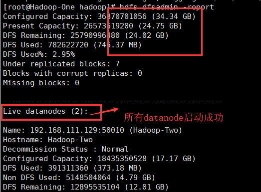

这条命令等同于直接打开web端上面查看集群的状态：打开http://192.168.111.128:50070

---

hdfs dfs -ls / ：查看hdfs文件系统上的根目录下所有文件

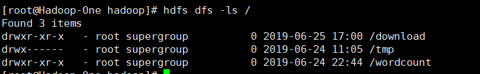

注意：初次启动的时候是没有东西的，所以这条命令不返回结果是正常的

---

hdfs dfs -mkdir -p /wordcount

hdfs dfs -mkdir -p /wordcount/input

在根目录创建一个wordcount文件夹，里面还创建了一个input文件夹

在web网页端查看文件夹是否被创建成功

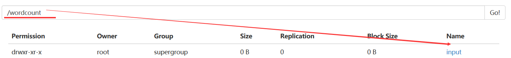

---

vi /root/home/aaa.txt，vi /root/home/bbb.txt，vi /root/home/ccc.txt

编辑三个txt文件，往里面填多个单词，并wq保存退出


---

hdfs dfs -put /root/home/aaa.txt /wordcount/input

hdfs dfs -put /root/home/bbb.txt /wordcount/input

hdfs dfs -put /root/home/ccc.txt /wordcount/input

将刚刚编辑好的三个文件上传到/wordcount/input里面，代表着等待处理的数据文件

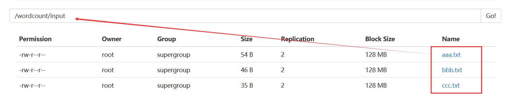

---

cd /usr/local/src/hadoop-2.6.4/share/hadoop/mapreduce

进入HADOOP安装目录，运行一个示例mr程序，提前感受一下mapreduce的雏形

hadoop jar hadoop-mapreduce-examples-2.6.4.jar wordcount /wordcount/input /wordcount/output

直接执行这段命令，hadoop将从/wordcount/input/下的三个数据文件，进行示例程序jar包处理，将处理后的结果输出到/wordcount/output文件夹，注意，output不允许提前创建

---

尴尬的是，我已经运行成功了，再来做笔记，所以我执行这个命令的时候，遭遇到这个报错


我的output文件夹已经存在，所以我们顺便学习一下删除的命令

---

hdfs dfs -rm -r /wordcount/output：删除hdfs文件系统上的文件，属于强制性删除，慎用

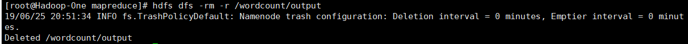

---

一切就绪之后，直接快乐地输入这条命令：

hadoop jar hadoop-mapreduce-examples-2.6.4.jar wordcount /wordcount/input /wordcount/output

如果你没遇到任何意外，你应该会遇到这样的情况:

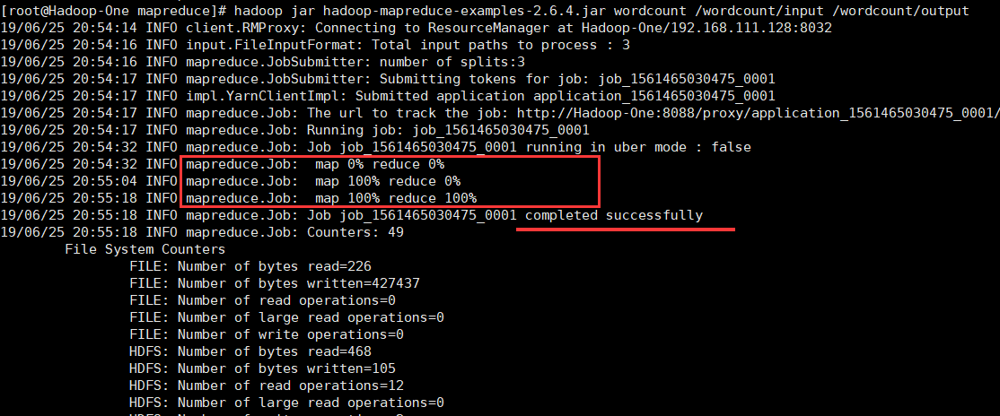

然后我们就要分析示例mapreduce程序数据处理后的结果，这个结果输出在：

/wordcount/output/part-r-00000

我们应该如何去查看这个数据分析结果呢？

----

hdfs dfs -cat /wordcount/output/part-r-00000，查看这个文件的文本内容

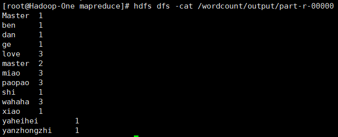

看，这就是经过mapreduce示例程序数据分析的结果，进行了词频统计

---

这一套下来，我们已经体验了一下HDFS+MAPREDUCE的数据处理分析的过程

对于这两个概念应该不会再变得模糊了吧？


#### 4.入门HDFS命令

我们在上面，已经体验了HDFS+MAPREDUCE一套小小的大数据处理流程，现在我们要学习的目标是什么？终极目标就是熟练使用HDFS命令完成各种调度操作，使用JAVA编写出MAPREDUCE的处理数据的代码程序并将它导出成jar包，然后弄来一堆数据，使用HDFS命令将这些数据根据编写好的jar包规则进行数据处理，输出到结果。

当你看懂了我上面的话，了解到了我们正在做什么——知道我们在学什么，在做什么，是一个非常重要的行为，这让我们这些初学者不会陷入茫然失措的境地。

好了，让我们继续深入HDFS命令吧！

官方学习网址：http://hadoop.apache.org/docs/r1.0.4/cn/hdfs_shell.html

（注意，这份教程的命令是hadoop fs开头，新版是hdfs dfs，两者都可以用）


请你一定要读完这个网站，因为所需要学习的命令不多，都是建立在linux基础上的

我们来复习一下上面的大数据小demo中，使用了哪些命令

①查看hdfs系统上的根目录下的所有文件：hdfs dfs -ls /

②在hdfs系统上创建一个文件夹，最好使用绝对路径：hdfs dfs -mkdir -p /wordcount

③从linux本地上传文件到hdfs系统，最好使用绝对路径：hdfs dfs -put /root/home/aaa.txt /wordcount/input

④强制性删除hdfs系统的文件，最好使用绝对路径：hdfs dfs -rm -r /wordcount/output

⑤展示hdfs系统上的某个文件的内容：hdfs dfs -cat /wordcount/output/part-r-00000

---

以上就是我们接触到的5个hdfs命令，下面的命令我认为是需要记忆的，挑出来说一下

⑥hdfs dfs -get /wordcount/input/aaa.txt  /root/home/ddd.txt

将hdfs上的某个文件下载到本地linux上，可以支持改名


⑦hdfs dfs -mv /wordcount/input/aaa.txt   /wordcount/input/ddd.txt

在hdfs系统上将一个文件移动，不允许在不同的文件系统间移动文件。

展示一下结果

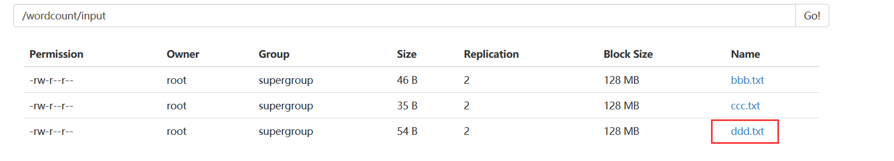

⑧hdfs dfs -cp /wordcount/input/ddd.txt  /wordcount/input/aaa.txt

将hdfs上的某个文件进行复制到制定的路径，可以支持改名

在web网页端查看复制的结果

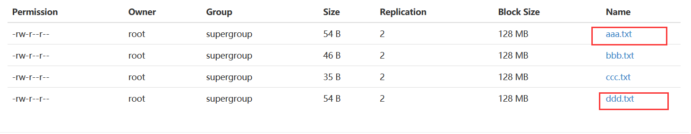

⑨hdfs dfs -du -s /wordcount/input/aaa.txt

查看hdfs系统上的文件或目录的大小

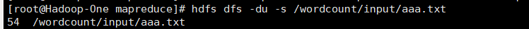

⑩copyFromLocal与copyToLocal

这两条命令与put、get相似，仅作了解即可

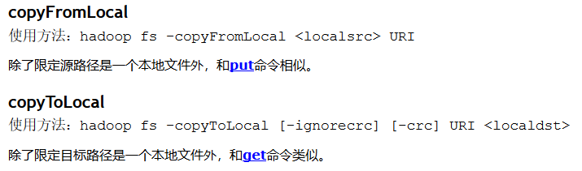


我在上面一共整理了10个命令，循序渐进的教学，合理的顺序安排，想必让你掌握到了HDFS命令的大部分基础，但也要养成阅读官方文档的作用，上面有着最为全面的命令大全。


#### 5.JAVA开发环境

没错，HDFS的操作终究要走向智能化，因为在服务器端手动输入命令太麻烦

还不如写一个程序进行控制，随心所欲地控制HDFS系统，这个时候我们熟练地打开Eclipse

这个时候，就有一个很致命的问题诞生了

到底是在linux上面开发eclipse呢？还是windows上开发？

毫无疑问，在linux上开发eclipse是最好的，问题最少，链接更方便

（在linux上开发请用mars2的eclipse版本，之后的路请自己慢慢走）

但是，这海洋开发成本太高了，因为我们只是个初学者，我们的电脑配置应该不足够支撑

所以以下的笔记还是基于windows本地的Eclipse程序，进行开发java代码


我已经体贴地猜到了启动Eclipse需要接一杯水的时间，如果你不渴，请复习下面概念：

1.HDFS集群分为两大角色：NameNode、DataNode 

2.NameNode负责管理整个文件系统的元数据

3.DataNode 负责管理用户的文件数据块

4.文件会按照固定的大小（blocksize）切成若干块后分布式存储在若干台datanode上

5.每一个文件块可以有多个副本，并存放在不同的datanode上

6.Datanode会定期向Namenode汇报自身所保存的文件block信息，而namenode则会负责保持文件的副本数量

7.HDFS的内部工作机制对客户端保持透明，客户端请求访问HDFS都是通过向namenode申请来进行


启动Eclipse之后，打开左上角的File，点击New，创建一个Java Project

(我现在想起来，我好像没讲怎么配置windows的JDK，配置好之后才能启动eclipse，请自行解决)

输入hdfs_hadoop名字，Finish之后点击Don't create，完成创建，图片中的hdfs名字是教学样本

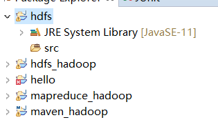

然后搞到hdfs-Jar.rar这个压缩包，进行解压到你觉得合适的目录

然后右键对这个工程文件Bulid Path -> Configure Build Path...

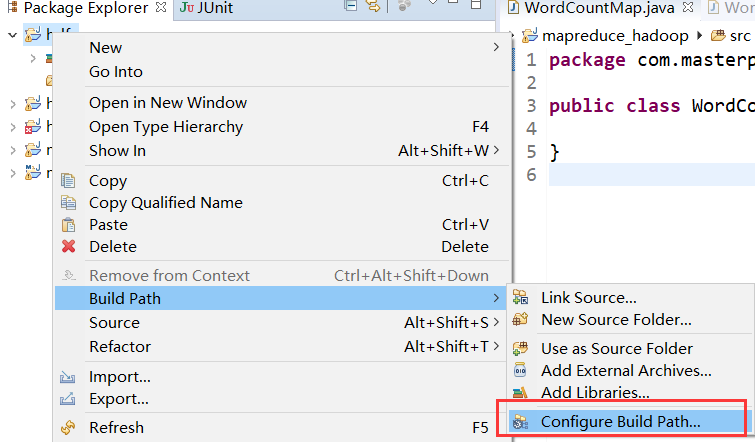

进去之后，选中Classpath，点击右边的Add Library...

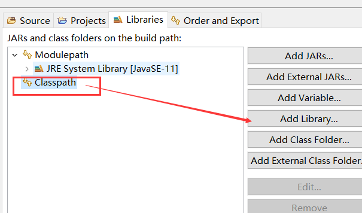

选择Junit，进而选择Junit 4的版本，添加进去

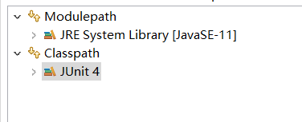

然后我们就要导入我们的HDFS的jar包了，还是一样的，选中Classpath并Add Library

选中User Library，点击右边的User Library...，我们new一个出来，命名为hdfs

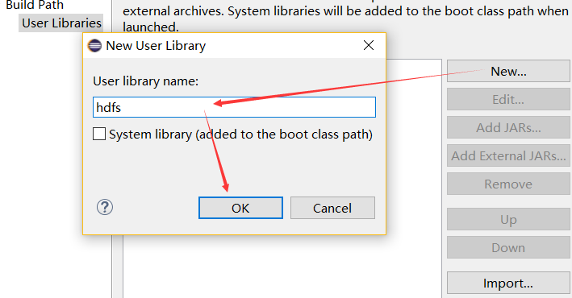

创建之后，我们选定这个hdfs，导入HDFS的jar包

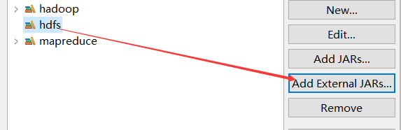

然而我们刚刚已经解压过了这个jar包，现在就是导入里面全部的jar进去

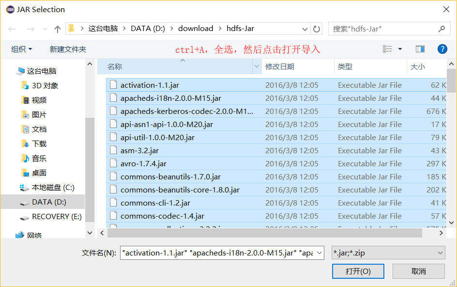

当这些操作完成之后，我们一路yes，apply，最终看到这样的结果

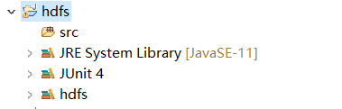

确保你的操作跟我一模一样，然后让我们进入写代码控制hdfs的阶段！

#### 6.控制HDFS

我们即将编写两个JAVA程序，用来控制文件和文件流

所以，两个JAVA程序放在不同的package下，做邻居

然后我就在src文件夹下创建了三个包裹（NEW->package）和三个JAVA文件（NEW->Class）

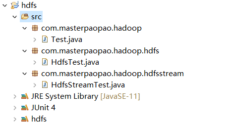

当你同步好我的操作之后，我们开始编写第一个程序：HdfsTest.java

```java
package com.masterpaopao.hadoop.hdfs;

import java.io.FileNotFoundException;
import java.io.IOException;
import java.net.URI;
import java.net.URISyntaxException;
import java.util.Iterator;
import java.util.Set;

import org.apache.hadoop.conf.Configuration;
import org.apache.hadoop.fs.BlockLocation;
import org.apache.hadoop.fs.FileStatus;
import org.apache.hadoop.fs.FileSystem;
import org.apache.hadoop.fs.Path;
import org.apache.hadoop.fs.UnsupportedFileSystemException;
import org.apache.hadoop.security.AccessControlException;
import org.junit.After;
import org.junit.Before;
import org.junit.Test;

import com.google.common.collect.Multiset.Entry;
import com.sun.xml.bind.v2.schemagen.xmlschema.List;

public class HdfsTest {
	
	private FileSystem fs;
	Configuration conf = new Configuration(); 
	
	@Before
	public void testHDFS() throws IOException, InterruptedException, URISyntaxException {
		// 需要先开启nmb服务
		conf.set("fs.defaultFS", "hdfs://Hadoop-One:9000");
		fs = FileSystem.get(new URI("hdfs://Hadoop-One:9000"), conf, "root");
	}
	
	@After
	public void testclose() throws IOException {
		fs.close();
	}
	
	@Test
	public void testUpload() throws IllegalArgumentException, IOException {
		Path src = new Path("D:\\Users\\hdfs-Jar.rar");
		Path dst = new Path("/download");
		fs.copyFromLocalFile(src, dst);
	}
	
	@Test
	public void testDownload() throws IOException {
		Path src = new Path("/download/hdfs-Jar.rar");
		Path dst = new Path("D:\\Users");
		fs.copyToLocalFile(false,src, dst,true);
	}
	
	@Test
	public void testConf() {
		Iterator<java.util.Map.Entry<String, String>> iterator = conf.iterator();
		while(iterator.hasNext()) {
			java.util.Map.Entry<String, String> entry = iterator.next();
			System.out.println(entry.getValue() + "--" + entry.getValue());
		}
		
	}
	
	@Test
	public void testLs() throws AccessControlException, FileNotFoundException, UnsupportedFileSystemException, IllegalArgumentException, IOException {
		//查看具体文件的元数据
		/*FileStatus fss = fs.getFileLinkStatus(new Path("/usr/local"));
		System.out.println(fss);*/
		
		//该数据从NameNode获取,获取指定HDFS路径下的文件信息,类似于linux中的ls命令
		FileStatus[] fsses = fs.listStatus(new Path("/usr/local"));
		
		for (FileStatus fileStatus : fsses) {
			System.out.println(fileStatus);
		}
		
	}
	
	@Test
	public void listTest() throws FileNotFoundException, IllegalArgumentException, IOException {
		FileStatus[] listStatus = fs.listStatus(new Path("/"));
		for (FileStatus fileStatus : listStatus) {
			System.err.println(fileStatus.getPath() + "==========" + fileStatus.toString());
		}
		
	}
	
	@Test
	public void testDelete() throws IllegalArgumentException, IOException {
		//第一个参数表示要删除的目录和文件,第二个参数表示是否迭代删除
		//若目标文件为空文件,则第二参数随意
		//若目标文件不为空文件,则删除失败,抛出异常
		boolean delete = fs.delete(new Path("/download/hdfs-Jar.rar"),true);
		//boolean delete = fs.delete(new Path("/user/"),false);

		System.out.println(delete ? "删除成功":"删除失败");
	}
	
	@Test
	public void testLocation() throws AccessControlException, FileNotFoundException, UnsupportedFileSystemException, IOException {
		Path path=new Path("/download/hdfs-Jar.rar");
		
		FileStatus fss = fs.getFileLinkStatus(path);
		
		//获取文件长度
		long len = fss.getLen();
		//根据文件元数据和文件的起始位置以及文件的长度来获取blk的位置信息
		BlockLocation[] fileBlockLocations = fs.getFileBlockLocations(fss, 0, len);
	/*
	 * 偏移量,blk长度,blk位置列表
	 * 0,24934907,node2,node4
	 */
		for (BlockLocation blockLocation : fileBlockLocations) {
			System.out.println(blockLocation);
		}
	}	
}
```

直接copy进去，虽然这段代码很长，我们只需要关注前四个函数，有一个大概的了解就行了

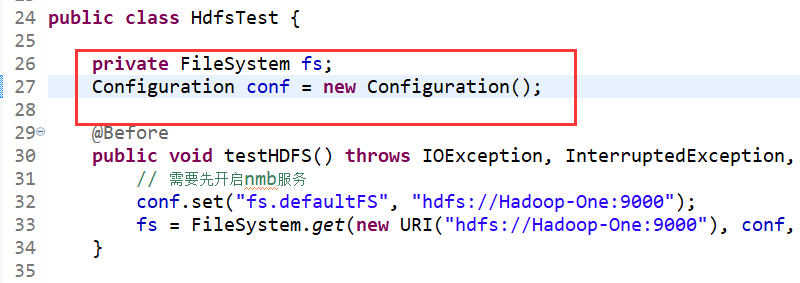

这段代码非常好理解，就是你要控制虚拟机上的HDFS系统的时候，肯定要先创建一个会话窗口用于链接，然后JAVA代码进一步控制，完成整个流程。

那么我们创建后窗口之后，写一个函数用于双方的连接通信，也就是testHDFS函数

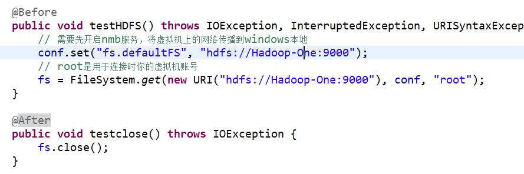

这段函数理解起来非常简单，就是运行之前需要将虚拟机的nmb服务打开，因为我们选择在windows平台上进行开发，所以需要将虚拟机的网络广播到真机上来，当然了，你可以不打开nmb服务，就需要将代码中的Hadoop-One改成你namenode服务器的真实IP地址，也是行得通的

至于下面的testclose函数，就是关闭对话，每运行一次需要养成关闭对话的习惯。

然后来看看重头戏，testUpload函数与testDownload函数

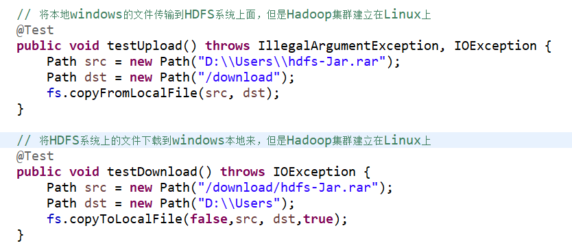

我为什么要那样写注释，就是防止搞混，我们这个windows只是远程托管控制集群的平台，所以你应该发现了为啥在windows上开发并不好，因为我们这段程序只能完成windows与HDFS系统的交互，而不能完成Linux上的namenode服务器与HDFS系统交互，这就是一个很大的弊端。


想必这两个函数也不用我多说，就是HDFS上的copyFromLocal命令与copyToLocal命令

然后我们打开测试程序，Test.java，测试一下这个HDFS程序的可用性

```java
package com.masterpaopao.hadoop;

import java.io.IOException;
import java.net.URISyntaxException;

import com.masterpaopao.hadoop.hdfs.HdfsTest;

public class Test{
	public static void main(String[] args) throws IOException, InterruptedException, URISyntaxException {
		
		// 操作文件
		HdfsTest ht = new HdfsTest();
		ht.testHDFS();
		ht.testUpload();
		ht.testclose();
	}
}
```

在main入口程序中copy进去上面的代码，我们经历了创建Class对象，链接HDFS，将windows本地的文件进行上传到HDFS中去（请自行微调源代码，并自己在HDFS上面的根目录创建download文件夹），上传成功以后，自动关闭会话对象，完成一套控制HDFS的流程

话不多说，直接run这个Test.java，不出意外的话，你将会看到这样的结果

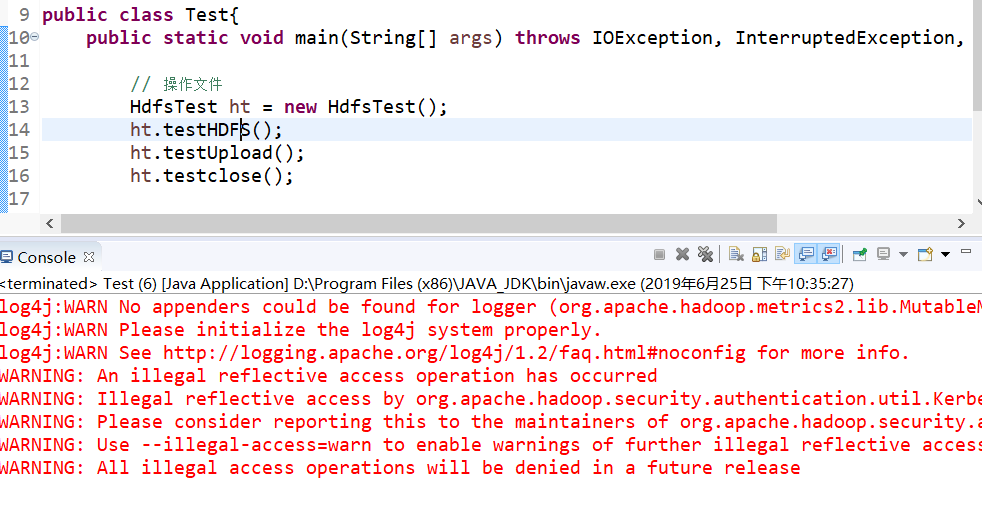

不要介意这个报错，这个是我们并没有配置日志系统，但不影响功能的执行

我们来到web端看看我们的Hdfs-Jar.rar成功上传到/download了没？

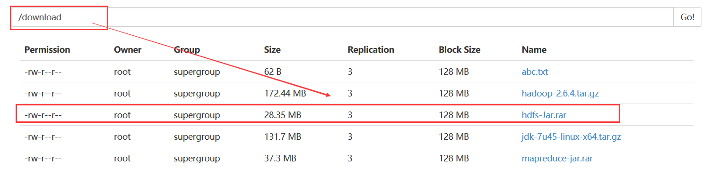

这说明我们的JAVA代码运行成功了，我们完成了一次控制HDFS的过程。


接下来，需要你继续走下去，测试一下testDownload函数的功能，以及下面的一些复杂函数。

然后这儿还有另一份JAVA代码，是操作文件流的代码，就是说上面的代码只是单纯的操作文件移动，而这个代码是用于文件的内容以流的形式进行传输，源代码放下面，可以自行研究

```java
package com.masterpaopao.hadoop.hdfsstream;

import java.io.FileInputStream;
import java.io.FileOutputStream;
import java.io.IOException;
import java.net.URI;
import java.net.URISyntaxException;

import org.apache.commons.io.IOUtils;
import org.apache.hadoop.conf.Configuration;
import org.apache.hadoop.fs.FSDataInputStream;
import org.apache.hadoop.fs.FSDataOutputStream;
import org.apache.hadoop.fs.FileSystem;
import org.apache.hadoop.fs.Path;
import org.junit.After;
import org.junit.Before;
import org.junit.Test;

public class HdfsStreamTest {
	
	private FileSystem fs;
	Configuration conf = new Configuration();
	
	@Before
	public void testHDFS() throws IOException, InterruptedException, URISyntaxException {
		// 先启动nmb服务
		conf.set("fs.defaultFS", "hdfs://Hadoop-One:9000");
		fs = FileSystem.get(new URI("hdfs://Hadoop-One:9000"), conf, "root");
	}
	
	@After
	public void testclose() throws IOException {
		fs.close();
	}
	
	// 从windows的文件流上传到HDFS
	@Test
	public void testStreamUpload() throws IllegalArgumentException, IOException {
		
		FileInputStream fis = new FileInputStream("D:\\Users\\abc.txt");
		FSDataOutputStream ops = fs.create(new Path("/download/abc.txt"));	
		IOUtils.copy(fis, ops);
		
	}
	
	// 从HDFS的文件流下载到windows
	@Test
	public void testStreamDownload() throws IllegalArgumentException, IOException {
		FSDataInputStream ips = fs.open(new Path("/download/abc.txt"));
		FileOutputStream fos = new FileOutputStream("D:\\Users\\def.txt");
		IOUtils.copy(ips, fos);
		
	}
	
	@Test
	public void testRandom() throws IllegalArgumentException, IOException {
		FSDataInputStream ips = fs.open(new Path(""));
		ips.seek(8);
		FileOutputStream fos = new FileOutputStream("");
		IOUtils.copy(ips, fos);
	}
	
	@Test
	public void testCat() throws IllegalArgumentException, IOException {
		FSDataInputStream ips = fs.open(new Path(""));
		IOUtils.copy(ips, System.out);
	}
}
```

到最后你的Test.java测试用例可能是这样

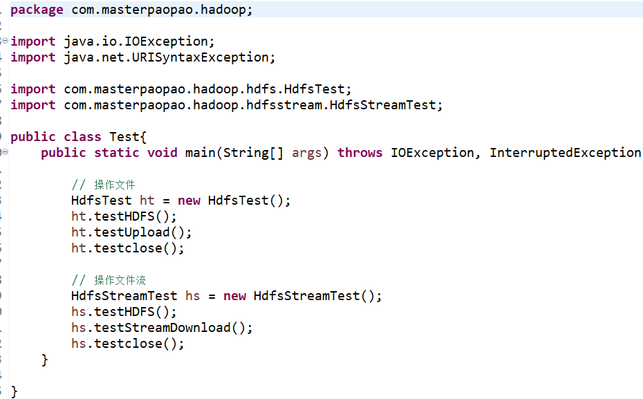

测试的最终结果验证在这儿：

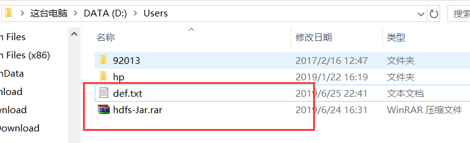


#### 7.HDFS小结

在上面，我们充分认识到了HDFS在Hadoop大数据中担任着怎么样的地位

然后我们了解了HDFS的一些常用的命令，还在windows上开发了Java代码

实现了用JAVA控制HDFS操作的步骤

现在，我们需要进入MapReduce的世界了，没错，我们在上面已经运行了一个MapReduce的小demo之词频统计wordcount，提前用现成的jar包完成了HDFS+MAPREDUCE的功能

在接下来的学习中，我们将学习如何用Java编写一个MapReuce的应用程序，并把这个程序导出成jar包，上传到namenode上尝试处理数据。


## 二.MAPREDUCE你好

#### 1.原理详解

海量数据在单机上处理数据会受到硬件资源限制，无法拥有一个有效的性能

如果引入mapreduce框架，开发人员可以将绝大部分工作集中在业务逻辑的开发上，而降低在分布式计算中的复杂性上消耗的精力。

mapreduce就是这样的一个分布式程序的通用框架，它的结构如下：

1-MRAppMaster：负责整个程序的过程调度以及状态协调

2-MapTask：负责map阶段的整个数据处理流程

3-ReduceTask：负责reduce阶段的整个数据处理流程

这三个结构到底能干啥呢？


#### 2.打扰一下


#### 3.Eclipse配置


#### 4.写个程序


#### 5.使用jar包


## 三.MAPREDUCE进阶

等待更新……


## 四.Hive学习

#### 1.SQL复习


#### 2.Hive了解


#### 3.Hive安装


#### 4.Hive使用

创建普通表，支持直接传入.dat文件


创建分区表


支持解析多种指定位置的.dat文件，加载到自己的分区数据库，并打标签归类

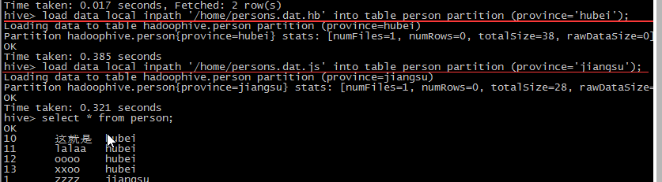

