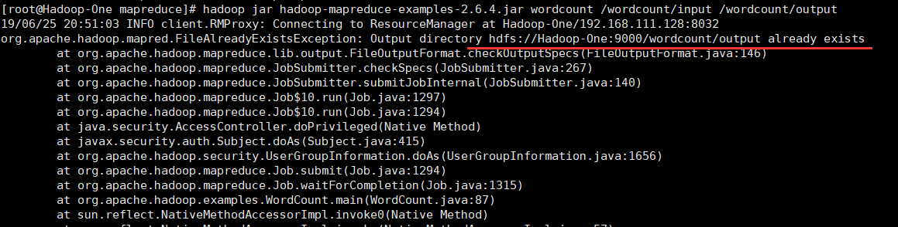
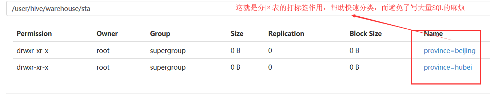
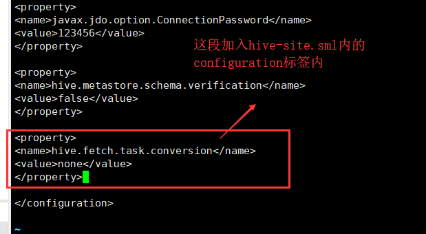

## 目录

* [一\.HDFS详解](#%E4%B8%80hdfs%E8%AF%A6%E8%A7%A3)
    * [1\.再会Hadoop](#1%E5%86%8D%E4%BC%9Ahadoop)
    * [2\.Hadoop集群](#2hadoop%E9%9B%86%E7%BE%A4)
    * [3\.初探HDFS](#3%E5%88%9D%E6%8E%A2hdfs)
    * [4\.入门HDFS命令](#4%E5%85%A5%E9%97%A8hdfs%E5%91%BD%E4%BB%A4)
    * [5\.JAVA开发环境](#5java%E5%BC%80%E5%8F%91%E7%8E%AF%E5%A2%83)
    * [6\.控制HDFS](#6%E6%8E%A7%E5%88%B6hdfs)
    * [7\.HDFS小结](#7hdfs%E5%B0%8F%E7%BB%93)
* [二\.MAPREDUCE你好](#%E4%BA%8Cmapreduce%E4%BD%A0%E5%A5%BD)
    * [1\.原理详解](#1%E5%8E%9F%E7%90%86%E8%AF%A6%E8%A7%A3)
    * [2\.打扰一下](#2%E6%89%93%E6%89%B0%E4%B8%80%E4%B8%8B)
    * [3\.Eclipse配置](#3eclipse%E9%85%8D%E7%BD%AE)
    * [4\.注意JDK](#4%E6%B3%A8%E6%84%8Fjdk)
    * [4\.写个程序](#4%E5%86%99%E4%B8%AA%E7%A8%8B%E5%BA%8F)
    * [5\.导出jar包](#5%E5%AF%BC%E5%87%BAjar%E5%8C%85)
    * [6\.使用jar包](#6%E4%BD%BF%E7%94%A8jar%E5%8C%85)
* [三\.MAPREDUCE进阶](#%E4%B8%89mapreduce%E8%BF%9B%E9%98%B6)
    * [1\.确定需求](#1%E7%A1%AE%E5%AE%9A%E9%9C%80%E6%B1%82)
    * [2\.编写代码](#2%E7%BC%96%E5%86%99%E4%BB%A3%E7%A0%81)
    * [3\.实验结果](#3%E5%AE%9E%E9%AA%8C%E7%BB%93%E6%9E%9C)
* [四\.Hive学习](#%E5%9B%9Bhive%E5%AD%A6%E4%B9%A0)
    * [1\.SQL复习](#1sql%E5%A4%8D%E4%B9%A0)
    * [2\.Hive了解](#2hive%E4%BA%86%E8%A7%A3)
    * [3\.Hive安装](#3hive%E5%AE%89%E8%A3%85)
    * [4\.Hive使用](#4hive%E4%BD%BF%E7%94%A8)
      * [1）普通表](#1%E6%99%AE%E9%80%9A%E8%A1%A8)
      * [2）分区表](#2%E5%88%86%E5%8C%BA%E8%A1%A8)
    * [5\.熟悉流程](#5%E7%86%9F%E6%82%89%E6%B5%81%E7%A8%8B)
    * [6\.本周总结](#6%E6%9C%AC%E5%91%A8%E6%80%BB%E7%BB%93)

## 一.HDFS详解

Author：Masterpaopao

本博客已经上传Github：https://github.com/Masterpaopao/Master-Blog

这是我的第二周实习记录，接触到了Hadoop三个核心部分，还是一样地啰嗦详细，但是内容缺少深度，只能提供入门和方向，请见谅，作者也正在学习变强中！

&nbsp;

#### 1.再会Hadoop

在上周的实习中，我完成了JDK，MySQL，redis集群和hadoop集群的搭建

遗憾的是，匆匆忙忙赶进度，并未仔细研究hadoop的原理，今日计划于复习相关原理与概念

Hadoop拥有一个庞大的生态圈，最终的目的就是完成大数据

它有一些不可缺少的组件：

①HDFS：分布式文件系统

②MAPREDUCE：分布式运算程序开发框架

③HIVE：基于大数据技术(HDFS+MAPREDUCE)的SQL数据仓库工具

④ZOOKEEPER：分布式协调服务基础组件

以上四个是关键的组件，剩下的组件我就不提了，弄清楚上面四个才是重点

&nbsp;

先来看看经典的大数据项目-网站日志分析系统


这个就是一个获取数据，收集数据，处理数据，整理数据再到将数据化可视的过程

所以想学好大数据也不是很容易的，需要掉大量的头发

&nbsp;

我们在上周，配置好hadoop压缩包与xml文件配置后，我们进行了hdfs namenode -format

进行namenode的格式化，并输入start-all.sh命令连接其他的datanode，成为hadoop集群

最终展示出来HDFS集群的管理页面（端口：50070）与YARN集群的管理页面（端口：8088）

那么这里面的namenode与datanode到底是什么？

而HDFS集群与YARN集群又是什么回事呢？

&nbsp;

#### 2.Hadoop集群

Hadoop集群通常来说包含两个集群：HDFS集群和YARN集群，两者逻辑上分离，但物理上一起

&nbsp;

①HDFS集群：负责海量数据的存储，集群中的角色有namenode与datanode

namenode只有一个，内部提供元数据服务，为HDFS提供存储块，所有的文件操作在namenode进行，然后将存储在HDFS中的文件分成块，复制到多个datanode中，也就是说

我现在是执行1（NameNode）+2（DataNode）的HDFS策略模式

我想将数据导入进去Hadoop集群分析的时候，经过namenode的操作分成块，复制备份在我的2个datanode服务器上面，完成数据的存储，计算与分析————等等！

数据的计算与分析?这个任务当然是交给MAPREDUCE来完成了。

一个Hadoop项目的核心组成是HDFS与MapReduce：HDFS为海量的数据提供了存储，而MapReduce则为海量的数据提供了计算。

&nbsp;

②YARN集群：负责海量数据运算时的资源调度，集群中的角色主要有 ResourceManager /NodeManager

这个并不难理解，就是说，它相当于一种Hadoop的资源管理器，相当于一个庞大的管理后台

页面的端口号是8088，你可以在上面完成集群的利用率管理、资源统一管理和数据共享等功能

&nbsp;

在上面我们所了解到了HDFS+MAPREDUCE组成了的HADOOP的核心部分，那么接下来就见识一下HDFS：分布式文件系统

#### 3.初探HDFS

HDFS有三个重点概念：文件切块，副本存放，元数据

也就是说，HDFS系统下有namenode节点与datanode节点，namenode负责将文件进行分块存储，namenode是HDFS集群主节点，负责维护整个hdfs文件系统的目录树，以及每一个路径所对应的block块信息（block的id，及所在的datanode服务器），

然后文件被分成的各个block块，这些块的存储都由datanode承担，datanode是HDFS集群从节点，每一个block都可以在多个datanode上存储多个副本（副本数量也可以通过参数设置dfs.replication）。

确保你读懂了上面的原理概念之后，我们来回顾一下上周执行的HDFS操作

namenode格式化：hdfs namenode -format

启动hadoop集群：start-all.sh(其实是启动hdfs和yarn)

启动成功之后，我们来试试新的hdfs命令，按顺序展示

---

hdfs dfsadmin -report：查看集群的状态，直接检测集群是否成功


这条命令等同于直接打开web端上面查看集群的状态：打开http://192.168.111.128:50070

---

hdfs dfs -ls / ：查看hdfs文件系统上的根目录下所有文件


注意：初次启动的时候是没有东西的，所以这条命令不返回结果是正常的

---

hdfs dfs -mkdir -p /wordcount

hdfs dfs -mkdir -p /wordcount/input

在根目录创建一个wordcount文件夹，里面还创建了一个input文件夹

在web网页端查看文件夹是否被创建成功


---

vi /root/home/aaa.txt，vi /root/home/bbb.txt，vi /root/home/ccc.txt

编辑三个txt文件，往里面填多个单词，并wq保存退出


---

hdfs dfs -put /root/home/aaa.txt /wordcount/input

hdfs dfs -put /root/home/bbb.txt /wordcount/input

hdfs dfs -put /root/home/ccc.txt /wordcount/input

将刚刚编辑好的三个文件上传到/wordcount/input里面，代表着等待处理的数据文件


---

cd /usr/local/src/hadoop-2.6.4/share/hadoop/mapreduce

进入HADOOP安装目录，运行一个示例mr程序，提前感受一下mapreduce应用程序的雏形

hadoop jar hadoop-mapreduce-examples-2.6.4.jar wordcount /wordcount/input /wordcount/output

直接执行这段命令，hadoop将从/wordcount/input/下的三个数据文件，进行示例程序jar包处理，将处理后的结果输出到/wordcount/output文件夹，注意，output不允许提前创建

---

尴尬的是，我已经运行成功了，再来做笔记，所以我执行这个命令的时候，遭遇到这个报错



我的output文件夹已经存在，所以我们顺便学习一下删除的命令

---

hdfs dfs -rm -r /wordcount/output：删除hdfs文件系统上的文件，属于强制性删除，慎用


---

一切就绪之后，直接快乐地输入这条命令：

hadoop jar hadoop-mapreduce-examples-2.6.4.jar wordcount /wordcount/input /wordcount/output

如果你没遇到任何意外，你应该会遇到这样的情况:


然后我们就要分析示例mapreduce程序数据处理后的结果，这个结果输出在：

/wordcount/output/part-r-00000

我们应该如何去查看这个数据分析结果呢？

----

hdfs dfs -cat /wordcount/output/part-r-00000，查看这个文件的文本内容


看，这就是经过mapreduce示例程序数据分析的结果，进行了词频统计

---

这一套下来，我们已经体验了一下HDFS+MAPREDUCE的数据处理分析的过程

后面对于这两个概念应该不会再变得模糊了吧？

&nbsp;

#### 4.入门HDFS命令

我们在上面，已经体验了HDFS+MAPREDUCE一套小小的大数据处理流程，现在我们要学习的目标是什么？终极目标就是熟练使用HDFS命令完成各种调度操作，使用JAVA编写出MAPREDUCE的处理数据的代码程序并将它导出成jar包，然后弄来一堆数据，使用HDFS命令将这些数据根据编写好的jar包规则进行数据处理，输出到结果。

当你看懂了我上面的话，了解到了我们正在做什么——知道我们在学什么，在做什么，是一个非常重要的行为，这让我们这些初学者不会陷入茫然失措的境地。

好了，让我们继续深入HDFS命令吧！

官方学习网址：http://hadoop.apache.org/docs/r1.0.4/cn/hdfs_shell.html

（注意，这份教程的命令是hadoop fs开头，新版是hdfs dfs，两者都可以用）

&nbsp;

请你一定要读完这个网站，因为所需要学习的命令不多，都是建立在linux基础上的

我们来复习一下上面的大数据小demo中，使用了哪些命令

①查看hdfs系统上的根目录下的所有文件：hdfs dfs -ls /

②在hdfs系统上创建一个文件夹，最好使用绝对路径：hdfs dfs -mkdir -p /wordcount

③从linux本地上传文件到hdfs系统，最好使用绝对路径：hdfs dfs -put /root/home/aaa.txt /wordcount/input

④强制性删除hdfs系统的文件，最好使用绝对路径：hdfs dfs -rm -r /wordcount/output

⑤展示hdfs系统上的某个文件的内容：hdfs dfs -cat /wordcount/output/part-r-00000

---

以上就是我们接触到的5个hdfs命令，下面的命令我认为是需要记忆的，挑出来说一下

⑥hdfs dfs -get /wordcount/input/aaa.txt  /root/home/ddd.txt

将hdfs上的某个文件下载到本地linux上，可以支持改名


⑦hdfs dfs -mv /wordcount/input/aaa.txt   /wordcount/input/ddd.txt

在hdfs系统上将一个文件移动，不允许在不同的文件系统间移动文件。

展示一下结果


⑧hdfs dfs -cp /wordcount/input/ddd.txt  /wordcount/input/aaa.txt

将hdfs上的某个文件进行复制到制定的路径，可以支持改名

在web网页端查看复制的结果


⑨hdfs dfs -du -s /wordcount/input/aaa.txt

查看hdfs系统上的文件或目录的大小


⑩copyFromLocal与copyToLocal

这两条命令与put、get相似，仅作了解即可


我在上面一共整理了10个命令，循序渐进的教学，合理的顺序安排，想必让你掌握到了HDFS命令的大部分基础，但也要养成阅读官方文档的作用，上面有着最为全面的命令大全。

&nbsp;

#### 5.JAVA开发环境

没错，HDFS的操作终究要走向智能化，因为在服务器端手动输入命令太麻烦

还不如写一个程序进行控制，随心所欲地控制HDFS系统，这个时候我们熟练地打开Eclipse

这个时候，就有一个很致命的问题诞生了

到底是在linux上面开发eclipse呢？还是windows上开发？

毫无疑问，在linux上开发eclipse是最好的，问题最少，链接更方便

（在linux上开发请用mars2的eclipse版本，之后的路请自己慢慢走）

但是，这海洋开发成本太高了，因为我们只是个初学者，我们的电脑配置应该不足够支撑

所以以下的笔记还是基于windows本地的Eclipse程序，进行开发java代码

&nbsp;

我已经体贴地猜到了启动Eclipse需要接一杯水的时间，如果你不渴，请复习下面概念：

1.HDFS集群分为两大角色：NameNode、DataNode 

2.NameNode负责管理整个文件系统的元数据

3.DataNode 负责管理用户的文件数据块

4.文件会按照固定的大小（blocksize）切成若干块后分布式存储在若干台datanode上

5.每一个文件块可以有多个副本，并存放在不同的datanode上

6.Datanode会定期向Namenode汇报自身所保存的文件block信息，而namenode则会负责保持文件的副本数量

7.HDFS的内部工作机制对客户端保持透明，客户端请求访问HDFS都是通过向namenode申请来进行

&nbsp;

启动Eclipse之后，打开左上角的File，点击New，创建一个Java Project

(我现在想起来，我好像没讲怎么配置windows的JDK，配置好之后才能启动eclipse，请自行解决)

输入hdfs_hadoop名字，Finish之后点击Don't create，完成创建，图片中的hdfs名字是教学样本


然后搞到hdfs-Jar.rar这个压缩包，进行解压到你觉得合适的目录

然后右键对这个工程文件Bulid Path -> Configure Build Path...


进去之后，选中Classpath，点击右边的Add Library...


选择Junit，进而选择Junit 4的版本，添加进去


然后我们就要导入我们的HDFS的jar包了，还是一样的，选中Classpath并Add Library

选中User Library，点击右边的User Library...，我们new一个出来，命名为hdfs


创建之后，我们选定这个hdfs，导入HDFS的jar包


然而我们刚刚已经解压过了这个jar包，现在就是导入里面全部的jar进去


当这些操作完成之后，我们一路yes，apply，最终看到这样的结果


确保你的操作跟我一模一样，然后让我们进入写代码控制hdfs的阶段！

#### 6.控制HDFS

我们即将编写两个JAVA程序，用来控制文件和文件流

所以，两个JAVA程序放在不同的package下，做邻居

然后我就在src文件夹下创建了三个包裹（NEW->package）和三个JAVA文件（NEW->Class）


当你同步好我的操作之后，我们开始编写第一个程序：HdfsTest.java

```java
package com.masterpaopao.hadoop.hdfs;

import java.io.FileNotFoundException;
import java.io.IOException;
import java.net.URI;
import java.net.URISyntaxException;
import java.util.Iterator;
import java.util.Set;

import org.apache.hadoop.conf.Configuration;
import org.apache.hadoop.fs.BlockLocation;
import org.apache.hadoop.fs.FileStatus;
import org.apache.hadoop.fs.FileSystem;
import org.apache.hadoop.fs.Path;
import org.apache.hadoop.fs.UnsupportedFileSystemException;
import org.apache.hadoop.security.AccessControlException;
import org.junit.After;
import org.junit.Before;
import org.junit.Test;

import com.google.common.collect.Multiset.Entry;
import com.sun.xml.bind.v2.schemagen.xmlschema.List;

public class HdfsTest {
	
	private FileSystem fs;
	Configuration conf = new Configuration(); 
	
	@Before
	public void testHDFS() throws IOException, InterruptedException, URISyntaxException {
		// 需要先开启nmb服务
		conf.set("fs.defaultFS", "hdfs://Hadoop-One:9000");
		fs = FileSystem.get(new URI("hdfs://Hadoop-One:9000"), conf, "root");
	}
	
	@After
	public void testclose() throws IOException {
		fs.close();
	}
	
	@Test
	public void testUpload() throws IllegalArgumentException, IOException {
		Path src = new Path("D:\\Users\\hdfs-Jar.rar");
		Path dst = new Path("/download");
		fs.copyFromLocalFile(src, dst);
	}
	
	@Test
	public void testDownload() throws IOException {
		Path src = new Path("/download/hdfs-Jar.rar");
		Path dst = new Path("D:\\Users");
		fs.copyToLocalFile(false,src, dst,true);
	}
	
	@Test
	public void testConf() {
		Iterator<java.util.Map.Entry<String, String>> iterator = conf.iterator();
		while(iterator.hasNext()) {
			java.util.Map.Entry<String, String> entry = iterator.next();
			System.out.println(entry.getValue() + "--" + entry.getValue());
		}
		
	}
	
	@Test
	public void testLs() throws AccessControlException, FileNotFoundException, UnsupportedFileSystemException, IllegalArgumentException, IOException {
		//查看具体文件的元数据
		/*FileStatus fss = fs.getFileLinkStatus(new Path("/usr/local"));
		System.out.println(fss);*/
		
		//该数据从NameNode获取,获取指定HDFS路径下的文件信息,类似于linux中的ls命令
		FileStatus[] fsses = fs.listStatus(new Path("/usr/local"));
		
		for (FileStatus fileStatus : fsses) {
			System.out.println(fileStatus);
		}
		
	}
	
	@Test
	public void listTest() throws FileNotFoundException, IllegalArgumentException, IOException {
		FileStatus[] listStatus = fs.listStatus(new Path("/"));
		for (FileStatus fileStatus : listStatus) {
			System.err.println(fileStatus.getPath() + "==========" + fileStatus.toString());
		}
		
	}
	
	@Test
	public void testDelete() throws IllegalArgumentException, IOException {
		//第一个参数表示要删除的目录和文件,第二个参数表示是否迭代删除
		//若目标文件为空文件,则第二参数随意
		//若目标文件不为空文件,则删除失败,抛出异常
		boolean delete = fs.delete(new Path("/download/hdfs-Jar.rar"),true);
		//boolean delete = fs.delete(new Path("/user/"),false);

		System.out.println(delete ? "删除成功":"删除失败");
	}
	
	@Test
	public void testLocation() throws AccessControlException, FileNotFoundException, UnsupportedFileSystemException, IOException {
		Path path=new Path("/download/hdfs-Jar.rar");
		
		FileStatus fss = fs.getFileLinkStatus(path);
		
		//获取文件长度
		long len = fss.getLen();
		//根据文件元数据和文件的起始位置以及文件的长度来获取blk的位置信息
		BlockLocation[] fileBlockLocations = fs.getFileBlockLocations(fss, 0, len);
	/*
	 * 偏移量,blk长度,blk位置列表
	 * 0,24934907,node2,node4
	 */
		for (BlockLocation blockLocation : fileBlockLocations) {
			System.out.println(blockLocation);
		}
	}	
}
```

直接copy进去，虽然这段代码很长，我们只需要关注前四个函数，有一个大概的了解就行了


这段代码非常好理解，就是你要控制虚拟机上的HDFS系统的时候，肯定要先创建一个会话窗口用于链接，然后JAVA代码进一步控制，完成整个流程。

那么我们创建后窗口之后，写一个函数用于双方的连接通信，也就是testHDFS函数


这段函数理解起来非常简单，就是运行之前需要将虚拟机的nmb服务打开，因为我们选择在windows平台上进行开发，所以需要将虚拟机的网络广播到真机上来，当然了，你可以不打开nmb服务，就需要将代码中的Hadoop-One改成你namenode服务器的真实IP地址，也是行得通的

至于下面的testclose函数，就是关闭对话，每运行一次需要养成关闭对话的习惯。

然后来看看重头戏，testUpload函数与testDownload函数


我为什么要那样写注释，就是防止搞混，我们这个windows只是远程托管控制集群的平台，所以你应该发现了为啥在windows上开发并不好，因为我们这段程序只能完成windows与HDFS系统的交互，而不能完成Linux上的namenode服务器与HDFS系统交互，这就是一个很大的弊端。

（注意：testDownload函数里面的copyTocalFile里面需要这四个参数，前面false，true，这是将linux上的文件转换为windows格式的文件，保存在本地。）

&nbsp;

想必下面两个函数也不用我多说，就是HDFS上的copyFromLocal命令与copyToLocal命令

然后我们打开测试程序，Test.java，测试一下这个HDFS程序的可用性

```java
package com.masterpaopao.hadoop;

import java.io.IOException;
import java.net.URISyntaxException;

import com.masterpaopao.hadoop.hdfs.HdfsTest;

public class Test{
	public static void main(String[] args) throws IOException, InterruptedException, URISyntaxException {
		
		// 操作文件
		HdfsTest ht = new HdfsTest();
		ht.testHDFS();
		ht.testUpload();
		ht.testclose();
	}
}
```

在main入口程序中copy进去上面的代码，我们经历了创建Class对象，链接HDFS，将windows本地的文件进行上传到HDFS中去（请自行微调源代码，并自己在HDFS上面的根目录创建download文件夹），上传成功以后，自动关闭会话对象，完成一套控制HDFS的流程

话不多说，直接run这个Test.java，不出意外的话，你将会看到这样的结果


不要介意这个报错，这个是我们并没有配置日志系统，但不影响功能的执行

我们来到web端看看我们的Hdfs-Jar.rar成功上传到/download了没？


这说明我们的JAVA代码运行成功了，我们完成了一次控制HDFS的过程。

&nbsp;

接下来，需要你继续走下去，测试一下testDownload函数的功能，以及下面的一些复杂函数。

然后这儿还有另一份JAVA代码，是操作文件流的代码，就是说上面的代码只是单纯的操作文件移动，而这个代码是用于文件的内容以流的形式进行传输，源代码放下面，可以自行研究

```java
package com.masterpaopao.hadoop.hdfsstream;

import java.io.FileInputStream;
import java.io.FileOutputStream;
import java.io.IOException;
import java.net.URI;
import java.net.URISyntaxException;

import org.apache.commons.io.IOUtils;
import org.apache.hadoop.conf.Configuration;
import org.apache.hadoop.fs.FSDataInputStream;
import org.apache.hadoop.fs.FSDataOutputStream;
import org.apache.hadoop.fs.FileSystem;
import org.apache.hadoop.fs.Path;
import org.junit.After;
import org.junit.Before;
import org.junit.Test;

public class HdfsStreamTest {
	
	private FileSystem fs;
	Configuration conf = new Configuration();
	
	@Before
	public void testHDFS() throws IOException, InterruptedException, URISyntaxException {
		// 先启动nmb服务
		conf.set("fs.defaultFS", "hdfs://Hadoop-One:9000");
		fs = FileSystem.get(new URI("hdfs://Hadoop-One:9000"), conf, "root");
	}
	
	@After
	public void testclose() throws IOException {
		fs.close();
	}
	
	// 从windows的文件流上传到HDFS
	@Test
	public void testStreamUpload() throws IllegalArgumentException, IOException {
		
		FileInputStream fis = new FileInputStream("D:\\Users\\abc.txt");
		FSDataOutputStream ops = fs.create(new Path("/download/abc.txt"));	
		IOUtils.copy(fis, ops);
		
	}
	
	// 从HDFS的文件流下载到windows
	@Test
	public void testStreamDownload() throws IllegalArgumentException, IOException {
		FSDataInputStream ips = fs.open(new Path("/download/abc.txt"));
		FileOutputStream fos = new FileOutputStream("D:\\Users\\def.txt");
		IOUtils.copy(ips, fos);
		
	}
	
	@Test
	public void testRandom() throws IllegalArgumentException, IOException {
		FSDataInputStream ips = fs.open(new Path(""));
		ips.seek(8);
		FileOutputStream fos = new FileOutputStream("");
		IOUtils.copy(ips, fos);
	}
	
	@Test
	public void testCat() throws IllegalArgumentException, IOException {
		FSDataInputStream ips = fs.open(new Path(""));
		IOUtils.copy(ips, System.out);
	}
}
```

到最后你的Test.java测试用例可能是这样


测试的最终结果验证在这儿：


&nbsp;

#### 7.HDFS小结

在上面，我们充分认识到了HDFS在Hadoop大数据中担任着怎么样的地位

然后我们了解了HDFS的一些常用的命令，还在windows上开发了Java代码

实现了用JAVA控制HDFS操作的步骤

现在，我们需要进入MapReduce的世界了，没错，我们在上面已经运行了一个MapReduce的小demo之词频统计wordcount，提前用现成的jar包完成了HDFS+MAPREDUCE的功能

在接下来的学习中，我们将学习如何用Java编写一个MapReuce的应用程序，并把这个程序导出成jar包，上传到namenode上尝试处理数据。

&nbsp;

## 二.MAPREDUCE你好

#### 1.原理详解

海量数据在单机上处理数据会受到硬件资源限制，无法拥有一个有效的性能

如果引入mapreduce框架，开发人员可以将绝大部分工作集中在业务逻辑的开发上，而降低在分布式计算中的复杂性上消耗的精力。

mapreduce就是这样的一个分布式程序的通用框架，它的结构如下：

1-MrAppMaster：负责整个程序的过程调度以及状态协调

2-MapTask：负责map阶段的整个数据处理流程

3-ReduceTask：负责reduce阶段的整个数据处理流程

这三个结构到底能干啥呢？

&nbsp;

首先，在一个处理大型数据的MapReduce应用程序中，MrAppMaster负责整个程序的调度，用于向空闲的worker分配作业，但我们是小型的MapReduce，所以一般只有一个作业调度。

然后讲讲MapTask和ReduceTask，其实就是Map函数和Reduce函数处理数据：

首先Map函数从输入的数据中抽取出键值对，产生中间键值对，将里面键相同的值传递给Reduce函数进一步处理，然后Reduce函数把它负责的中间键值对都读过来以后，进行排序，使得相同键的键值对聚集在一起，产生一组规模更小的值，产生的结果就会输出到指定的文件。


MapReduce并不局限于Hadoop，但为Hadoop的重要组成部分，它的大数据应用生态是非常广泛的，毕竟是用来计算大型数据的存在，面向大数据并行处理的计算模型、框架和平台。

它还可以结合Hive进行数据库导出数据的模型计算，与传统MySQL的区别就是查找慢，但更适合于海量数据的索引计算，我们在后面也会接触到Hive。

#### 2.打扰一下

在上面编写控制HDFS的JAVA程序的时候，我们需要链接到hdfs://Hadoop-One:9000//

但是，我们是基于Windows本地开发的，不能直接链接主机名，只能链接真实的IP地址

如果想要直连主机名，需要先开启nmb服务，这样windows本地就能识别主机名进而识别真实IP

现在我们来改一改虚拟机的设置，让虚拟机启动的时候就开启了nmb服务

还记得上一篇所学习的开机启动数据库吗？方法是一样的

连续输入chkconfig --add nmb，chkconfig nmb on两条命令，然后输入reboot重启试试效果

&nbsp;

你所有虚拟机都重启成功之后，可以在XShell6直接尝试链接六个填写主机名的会话窗口，验证nmb是否开机启动


当你完成了之后，你可以进入Java开发MapReduce阶段了

&nbsp;

#### 3.Eclipse配置

如果我没记错的话，我写到现在，我已经直播了Eclipse如何配置MAVEN和配置HDFS的工程项目包了

更何况，这次MapReduce的工程项目包的步骤跟HDFS一模一样

同样是先下载好mapreduce-jar.rar的压缩包，将它压缩出来

然后打开Eclipse，驾轻就熟创建一个叫mapreduce_hadoop的项目工程文件

然后add Library一个Juint 4，然后再自定义个Library叫做hadoop，将上面解压出来的所有jar包导入进去

没记错的话，这两个Library应当都处于ClassPath之下，当你完成这些的时候，你应该是这个样子的


#### 4.注意JDK

但是在写程序之前，我们需要思考一个问题，我们在linux上的jdk的版本是jdk1.7.0_45，这个没错吧

但是windows本地的jdk配置，我没写，让你们自行配置，所以一般大家都是下载的最新版，其实我也是


实际上是不行的，与前面的MAVEN与HDFS不同的是，前面两个只是在windows本地进行控制交互的作用

而我们编写的MapRecude是要编写完成以后，导出成jar包，放到linux里面进行数据处理

还记得上面的mapreduce示例jar包吗，上面是试用现成的jar包，现在我们编写一个新的jar包

所以，我们必须要要让即将导出的jar包的jdk版本，符合linux上的jdk版本，好在这个操作不难

我们只需要单独对这个项目工程进行指定JDK版本就行了，而不需要大动干戈地更换windows本地JDK

&nbsp;

右键对mapreduce_hadoop项目工程，选择最下面的properties，或者选中这个工程直接按Alt+Enter


我们可以看到，这儿默认的就是JDK11,现在我们需要去掉前面两个的勾选，选择进行自主配置


进去设置成JDK1.7，然后进行apply保存就行了


&nbsp;

#### 4.写个程序

（福利，JAVA基础不好的，可以直接下载我提供的wordcount.jar包进行使用……）

（好消息，没有JAVA基础的，其实不影响大数据的学习，因为后面会有Hive的存在。）

在上面，我们运行了一个Hadoop本身就有的wordcount的jar包进行体验mapreduce

接下来我们就要亲自写一个wordcount的mapreduce程序，并亲自导出成jar包执行一下mapreduce。

&nbsp;

首先我们需要做好赛前准备，在src下创建好package，再在里面创建三个Class，分别命名


你看到这三个的名字就明白这三个java文件分别有啥用了

&nbsp;

首先先编写MapTask，负责数据的提取，并发送到ReduceTask，也就是WordCountMapper.java

```java
// 先将这儿改成属于你的包裹路径
package com.masterpaopao.mapreduce.wordcount;

import java.io.IOException;

import org.apache.hadoop.io.IntWritable;
import org.apache.hadoop.io.LongWritable;
import org.apache.hadoop.io.Text;
import org.apache.hadoop.mapreduce.Mapper;

/**
 * Map<String, Integer>
 * 排序 - TreeMap<String, Integer>
 */
public class WordCountMapper extends Mapper<LongWritable, Text, Text, IntWritable> {

	/**
	 * 对hdfs - 文件中内容处理
	 */
	@Override
	protected void map(LongWritable key, Text value, Mapper<LongWritable, Text, Text, IntWritable>.Context context)
			throws IOException, InterruptedException {
		//拿到一行数据转换为string
		String line = value.toString();
		String[] words = line.split(" ");
		//遍历数组，输出<单词，1>
		for(String word : words) {
			//输出kv结构
			context.write(new Text(word), new IntWritable(1));
		}
	}

}
```

当等待被处理的数据提取出来以后，变成键值对的数据，进一步交给ReduceTask处理，进行聚集合并到更小的产生一组规模更小的值，产生的结果就会输出到指定的文件。

也就是WordCountReduce.java的源码内容

```java
// 先将这儿改成属于你的路径
package com.masterpaopao.mapreduce.wordcount;

import java.io.IOException;

import org.apache.hadoop.io.IntWritable;
import org.apache.hadoop.io.LongWritable;
import org.apache.hadoop.io.Text;
import org.apache.hadoop.mapreduce.Reducer;

/**
 * Reducer - <k,1>  kv归并、排序
 */
public class WordCountReducer extends Reducer<Text, IntWritable, Text, LongWritable> {

	@Override
	protected void reduce(Text text, Iterable<IntWritable> iterable,
			Reducer<Text, IntWritable, Text, LongWritable>.Context context) throws IOException, InterruptedException {
		int count = 0;
//		iterable.iterator().hasNext()   .next()
		for(IntWritable iw : iterable) {
			count += iw.get();			//获取<k,1>   
		}
		
		context.write(text, new LongWritable(count)); 
	}

}
```

最后的WordCountRunner.java，作用不言而喻，很明显是调度的一个作用，进行输出输入的配置

也就是jar包发挥功能作用的核心部分，引导map和reduce的数据处理工作

```java
// 先将这儿改成属于你的路径
package com.masterpaopao.mapreduce.wordcount;

import java.io.IOException;

import org.apache.hadoop.conf.Configuration;
import org.apache.hadoop.fs.Path;
import org.apache.hadoop.io.IntWritable;
import org.apache.hadoop.io.LongWritable;
import org.apache.hadoop.io.Text;
import org.apache.hadoop.mapreduce.Job;
import org.apache.hadoop.mapreduce.lib.input.FileInputFormat;
import org.apache.hadoop.mapreduce.lib.output.FileOutputFormat;

public class WordCountRunner {

	public static void main(String[] args) throws IOException, ClassNotFoundException, InterruptedException { 
		//描述成一个job对象 - 把业务逻辑相关的信息（哪个是mapper，哪个是reducer，要处理的数据在哪里，输出的结果放哪里……）
		//把这个描述好的job提交给集群去运行
		Configuration conf = new Configuration();
		Job job = Job.getInstance(conf);
		
		//指定这个job所在的jar包  java -jar
		job.setJarByClass(WordCountRunner.class); 
		
		//运行map、reduce对象
		job.setMapperClass(WordCountMapper.class);
		job.setReducerClass(WordCountReducer.class);
		
		//设置我们的逻辑Mapper类的输出key和value的数据类型
		job.setMapOutputKeyClass(Text.class);
		job.setMapOutputValueClass(IntWritable.class);
		
		//设置的业务逻辑Reducer类的输出key和value的数据类型
		job.setOutputKeyClass(Text.class);
		job.setOutputValueClass(LongWritable.class);
		
		//指定要处理的数据所在的位置,确保开启了nmb服务
		//将这儿改成你的NameNode主机名，并且你的/wordcount/input要有等待被处理的数据文件
		FileInputFormat.setInputPaths(job, "hdfs://Hadoop-One:9000/wordcount/input/");
		
		//指定处理完成之后的结果所保存的位置，不要提前创建
        //将这儿改成你的NameNode主机名，并决定好你的输出位置，在Linux上要检测是否符合再执行
		FileOutputFormat.setOutputPath(job, new Path("hdfs://Hadoop-One:9000/wordcount/output/"));
	
		//向yarn集群提交这个job
		boolean complete = job.waitForCompletion(true);
		System.exit(complete?0:1); 
	} 
	
}
```

有条件的话，你对mapreduce应用的编写感兴趣，你可以研究上面的三个java文件进行学习

接下来，让我们开启虚拟机们，打开我们配置的namenode与datanode，并在namenode启动Hadoop

启动成功以后，你的/wordcount/input应该还留着上面学习HDFS时的数据文件，因为运行了示例wordcount

现在我们需要删除：hdfs dfs -rm -r /wordcount/output，为接下来亲自编写的jar包提供一个输出文件的位置

（当然了，这得看你在WordCountRunner.java是怎么指定输出文件的位置，如果你跟我一模一样，就照做）

一切就绪以后，让我们导出jar包并使用它。

&nbsp;

#### 5.导出jar包

注意，不是对mapreduce_hadoop项目工程进行导出jar包，而是对编写wordcount的那个包裹进行导出

因为项目工程下面，我们会开发很多个mapreduce应用，各种不同数据的不同处理方式。

右键点击这个包裹，点击Export导出


毫无疑问是选择jar文件啊


然后导出的位置，可以参考我的建议


完成以后，你应该在你的桌面上看到了热乎乎的wordcount.jar

&nbsp;

#### 6.使用jar包

现在，我们在namenode那台虚拟机上，进入一个路径，jar包都是放在这儿

cd /usr/local/src/hadoop-2.6.4/share/hadoop/mapreduce

然后将桌面上的jar包直接拖入XShell6的会话窗口，我的wordcount.jar包就进来了


然后我们回到Eclipse，因为我说过，WordCountRunner.java是jar包的核心部分

所以需要让linux在用jar包的时候，被引导到WordCountRunner.java部分

所以，我们需要复制WordCountRunner的完整路径名字


我复制出来的结果是com.masterpaopao.mapreduce.wordcount.WordCountRunner

所以我们回到XShell6，准备启动mapreduce应用处理数据

&nbsp;

输入hadoop jar wordcount.jar com.masterpaopao.mapreduce.wordcount.WordCountRunner  /wordcount/input  /wordcount/output 这条长命令

意思就是将/wordcount/input下的数据使用我们的jar包被引导到master进行调度，完成map+reduce的数据处理，输出到/wordcount/output下

等处理完毕之后，我们直接hdfs dfs -cat /wordcount/output/part-r-00000


看到了吗，我们编写的jar包处理数据成功了！

&nbsp;

## 三.MAPREDUCE进阶

虽然我们成功写出了wordcount的jar包，但这儿远远是不够的，上面只是实现了简单的词频统计。

我们还可以继续写一个mapreduce应用程序。

#### 1.确定需求

以下是一个电话流量账单详细表，可以复制到flow.txt保存

```
1363157985066 	13726230503	00-FD-07-A4-72-B8:CMCC	120.196.100.82	i02.c.aliimg.com		24	27	2481	24681	200
1363157995052 	13826544101	5C-0E-8B-C7-F1-E0:CMCC	120.197.40.4			4	0	264	0	200
1363157991076 	13926435656	20-10-7A-28-CC-0A:CMCC	120.196.100.99			2	4	132	1512	200
1363154400022 	13926251106	5C-0E-8B-8B-B1-50:CMCC	120.197.40.4			4	0	240	0	200
1363157993044 	18211575961	94-71-AC-CD-E6-18:CMCC-EASY	120.196.100.99	iface.qiyi.com	视频网站	15	12	1527	2106	200
1363157995074 	84138413	5C-0E-8B-8C-E8-20:7DaysInn	120.197.40.4	122.72.52.12		20	16	4116	1432	200
1363157993055 	13560439658	C4-17-FE-BA-DE-D9:CMCC	120.196.100.99			18	15	1116	954	200
1363157995033 	15920133257	5C-0E-8B-C7-BA-20:CMCC	120.197.40.4	sug.so.360.cn	信息安全	20	20	3156	2936	200
1363157983019 	13719199419	68-A1-B7-03-07-B1:CMCC-EASY	120.196.100.82			4	0	240	0	200
1363157984041 	13660577991	5C-0E-8B-92-5C-20:CMCC-EASY	120.197.40.4	s19.cnzz.com	站点统计	24	9	6960	690	200
1363157973098 	15013685858	5C-0E-8B-C7-F7-90:CMCC	120.197.40.4	rank.ie.sogou.com	搜索引擎	28	27	3659	3538	200
1363157986029 	15989002119	E8-99-C4-4E-93-E0:CMCC-EASY	120.196.100.99	www.umeng.com	站点统计	3	3	1938	180	200
1363157992093 	13560439658	C4-17-FE-BA-DE-D9:CMCC	120.196.100.99			15	9	918	4938	200
1363157986041 	13480253104	5C-0E-8B-C7-FC-80:CMCC-EASY	120.197.40.4			3	3	180	180	200
1363157984040 	13602846565	5C-0E-8B-8B-B6-00:CMCC	120.197.40.4	2052.flash2-http.qq.com	综合门户	15	12	1938	2910	200
1363157995093 	13922314466	00-FD-07-A2-EC-BA:CMCC	120.196.100.82	img.qfc.cn		12	12	3008	3720	200
1363157982040 	13502468823	5C-0A-5B-6A-0B-D4:CMCC-EASY	120.196.100.99	y0.ifengimg.com	综合门户	57	102	7335	110349	200
1363157986072 	18320173382	84-25-DB-4F-10-1A:CMCC-EASY	120.196.100.99	input.shouji.sogou.com	搜索引擎	21	18	9531	2412	200
1363157990043 	13925057413	00-1F-64-E1-E6-9A:CMCC	120.196.100.55	t3.baidu.com	搜索引擎	69	63	11058	48243	200
1363157988072 	13760778710	00-FD-07-A4-7B-08:CMCC	120.196.100.82			2	2	120	120	200
1363157985066 	13726238888	00-FD-07-A4-72-B8:CMCC	120.196.100.82	i02.c.aliimg.com		24	27	2481	24681	200
1363157993055 	13560436666	C4-17-FE-BA-DE-D9:CMCC	120.196.100.99			18	15	1116	954	200
```

我们要做的就是统计出各个手机的上行流量和下行流量，以及访问站点的数量。

&nbsp;

#### 2.编写代码

我们反思一下上面编写wordcount的mapreduce的过程中，所使用的三个java文件还是过于冗余了

所以我们只需要两个文件，就足够了


FlowBean.java提供了一个数据规范化的功能，将得到的数据文件全部转换为规定格式的String对象

```java
// 将这儿改成你的路径
package com.masterpaopao.mapreduce.flowcount;

import org.apache.hadoop.io.WritableComparable;

import java.io.DataInput;
import java.io.DataOutput;
import java.io.IOException;

/**
 * @Author Master
 */
public class FlowBean implements WritableComparable<FlowBean> {

    long upflow;
    long downflow;
    long sumflow;
  
    public FlowBean(){}

    public FlowBean(long upflow, long downflow) {
        super();
        this.upflow = upflow;
        this.downflow = downflow;
        this.sumflow = upflow + downflow;
    }

    public long getSumflow() {
        return sumflow;
    }

    public void setSumflow(long sumflow) {
        this.sumflow = sumflow;
    }

    public long getUpflow() {
        return upflow;
    }
    public void setUpflow(long upflow) {
        this.upflow = upflow;
    }
    public long getDownflow() {
        return downflow;
    }
    public void setDownflow(long downflow) {
        this.downflow = downflow;
    }
    @Override
    public void write(DataOutput out) throws IOException {

        out.writeLong(upflow);
        out.writeLong(downflow);       
        out.writeLong(sumflow);
    }
    @Override
    public void readFields(DataInput in) throws IOException, IOException {
        upflow = in.readLong();
        downflow = in.readLong();
        sumflow = in.readLong();
    }  
    @Override
    public String toString() {
        return upflow + "\t" + downflow + "\t" + sumflow;
    }
    @Override
    public int compareTo(FlowBean o) { 
        return sumflow > o.getSumflow() ? -1:1;
    }
}
```

然后我们的FlowBean.java才是重头戏，里面包含了map函数+reduce函数，最后再在main入口里面进行作业调度

一个java文件就完成了三个流程，极大简化了mapreduce编程，杜绝了冗余性。

```java
// 将这儿改成你的路径
package com.masterpaopao.mapreduce.flowcount;

import org.apache.hadoop.conf.Configuration;
import org.apache.hadoop.fs.Path;
import org.apache.hadoop.io.LongWritable;
import org.apache.hadoop.io.Text;
import org.apache.hadoop.mapreduce.Job;
import org.apache.hadoop.mapreduce.Mapper;
import org.apache.hadoop.mapreduce.Reducer;
import org.apache.hadoop.mapreduce.lib.input.FileInputFormat;
import org.apache.hadoop.mapreduce.lib.output.FileOutputFormat;

import java.io.IOException;

/**
 * @Author Master
 */
public class FlowCount {
    //  key         value   key      value
    static class FlowCountMapper extends Mapper<LongWritable, Text, Text, FlowBean> {
        Text k = new Text();
        FlowBean v = new FlowBean();
        @Override
        protected void map(LongWritable key, Text value, Context context) throws IOException, InterruptedException {

            String line = value.toString();
            String[] fields = line.split("\t");
            try {
                String phonenbr = fields[0];

                long upflow = Long.parseLong(fields[7]);
                long dflow = Long.parseLong(fields[8]);

                k.set(phonenbr);
                v.setUpflow(upflow);
                v.setDownflow(dflow);
                context.write(k,v);
            } catch (Exception e) {

                e.printStackTrace();
            }

        }

    }
    //  key       value   key    value
    static class FlowCountReducer extends Reducer<Text,FlowBean,Text, FlowBean> {
        FlowBean v = new FlowBean();
        @Override
        protected void reduce(Text key, Iterable<FlowBean> values, Context context) throws IOException, InterruptedException {

            long upFlowCount = 0 ;
            long downFlowCount =0;
            long SumflowCount=0;
            for(FlowBean bean :values){
                upFlowCount = bean.getUpflow();
                downFlowCount = bean.getDownflow();
                SumflowCount=bean.getUpflow()+bean.getDownflow();
            }
            v.setDownflow(downFlowCount);
            v.setUpflow(upFlowCount);
            v.setSumflow(SumflowCount);
            context.write(key, v);
        }

    }

    public static void main(String[] args) throws Exception {
        System.setProperty("HADOOP_USER_NAME","root");
        Configuration conf = new Configuration();
        // 改成你自己的namenode主机名
        conf.set("fs.defaultFS","hdfs://Hadoop-One:9000");
        Job job = Job.getInstance(conf);

        job.setJarByClass(FlowCount.class);

        job.setMapperClass(FlowCountMapper.class);
        job.setReducerClass(FlowCountReducer.class);

        job.setMapOutputKeyClass(Text.class);
        job.setMapOutputValueClass(FlowBean.class);

        job.setOutputKeyClass(Text.class);
        job.setOutputValueClass(FlowBean.class);

        // 别忘了将flow.txt使用hdfs放入到这个路径
        FileInputFormat.setInputPaths(job,new Path("/flowcount/input/flow.txt"));
        FileOutputFormat.setOutputPath(job,new Path("/flowcount/output"));

        job.waitForCompletion(true);
    }

}
```

&nbsp;

现在，我们已经编写了好了手机流量统计的mapreduce应用程序，下一步是导出成jar包。

#### 3.实验结果

首先，我们将导出好的flowcount的jar包，直接拖入Xshell 6

（拖入到 /usr/local/src/hadoop-2.6.4/share/hadoop/mapreduce这个目录里面）

然后我们输入vi /root/home/flow.txt，编写一个flow.txt，将上面的数据复制进去

然后我们需要在hdfs系统根目录下，创建一个叫flowcount的文件夹，进去再创建一个input文件夹

这个过程命令我就不发了，弄好了之后直接hdfs dfs -put /root/home/flow.txt /flowcount/input

将flow.txt发送到上面去，然后等待被mapreduce处理（文件的命名和输入输出路径以java代码为准）

&nbsp;

完事之后，可以直接快乐地输入命令进行分析了(下面的具体路径改成你自己FlowCount.java的路径)

hadoop jar flowcount.jar com.masterpaopao.mapreduce.flowcount.FlowCount /flowcount/input /flowcount/output


然后输入hdfs dfs -cat /flowcount/output/part-r-00000查看输出结果


&nbsp;

当当当，一份各个手机代号的分析网站访问次数，上行流量与下行流量的数据就出来了。

这便是我们第二个编写的mapreduce应用程序。

&nbsp;

## 四.Hive学习

#### 1.SQL复习

在我们进行Hive学习之前，我们需要复习一下SQL相关知识，尽管我们对Hive到底是什么存在疑惑，但是肯定是基于SQL上面的一种数据库应用，配合Hadoop与MapReduce使用。

这儿是何为数据库何为与数据表的区别：先进数据库再使用数据表。

大概率就是先show databases;查询已有的数据库，然后use进入其中一个，再show tables;查看这里面有哪些表


如果你有基础，可以大概浏览一下我以前学习的时候写的一个总结。

- SQL是什么
  - 是一个通用的、功能挺强的关系型数据库语言
  - 演化成MySQL,NoSQL等著名数据库

------

- SQL语句的组成元素
  - 关键字：UPDATE，SET，WHERE等
  - Clauses：从句，子句
  - Expressions：表达式
  - predicates：谓语

------

- SQL语句类型
  - 定义语句
    - 定义语言管理表和索引结构
    - CREATE、ALTER、RENAME、DROP
  - 操作数据
    - INSERT、UPDATE、DELETE
  - 数据控制
    - 控制语言授权的用户访问和操作的数据
    - GRANT、REVOKE
  - 查询数据
    - SELECT,WHERE,GROUP BY,ORDER BY……
  - 事务管理
    - COMMIT,ROLLBACK

------

- SQL语句作用
  - 进行数据交互
  - 查询
  - 删除
  - 排查

------

- SQL中的数据类型
  - Text类型
  - Number类型
  - Date类型

---

当然了，你如果没有基础，我也没有那么多笔墨带你零基础入门，我倒是觉得《MySQL必知必会》是个不错的书

我在附件中提供了一个pdf文件，里面有着我学习时候所做的一些笔记。

&nbsp;

#### 2.Hive了解

hive是基于Hadoop的一个数据仓库工具，可以将结构化的数据文件映射为一张数据库表，并提供简单的sql查询功能，可以将sql语句转换为MapReduce任务进行运行。 其优点是学习成本低，可以通过类SQL语句快速实现简单的MapReduce统计，不必开发专门的MapReduce应用，十分适合数据仓库的统计分析。

&nbsp;

什么？你还是看不懂上面的话?

简单来说，Hive就是在Hadoop上架了一层SQL接口，可以将SQL翻译成MapReduce去Hadoop上执行，这样就使得数据开发和分析人员很方便的使用SQL来完成海量数据的统计和分析，而不必使用编程语言开发MapReduce那么麻烦。

&nbsp;

明白了吗，不会JAVA编程语言的童鞋，也是可以跑一跑Hadoop的，使用HDFS+MAPREDUCE+HIVE，侧重点在于HIVE的学习，熟练各种SQL排序、索引、分类等查询数据、筛选数据操作，而无需陷入如何自学JAVA的烦恼！

#### 3.Hive安装

声明：Hive只需要安装在你的namenode节点就可以了。

首先请下载好apache-hive-1.2.1-bin.tar.gz与mysql-connector-java-5.1.38.jar两个放在windows本地

然后将这两个文件使用sftp传入Linux虚拟机，传入到/root/home内


然后下面会有三大步骤排坑，请跟随我的三个步骤一个个步骤，谢谢！

&nbsp;

①检查本地mysql数据库，解压hive

还记得前面，我们配置MySQL的时候吗~我们当时设置了开启默认启动

所以我们现在输入mysql -u root -p，输入正确的密码之后，看看是否启动成功


完事之后，输入exit退出mysql，然后进行下一步的解压hive压缩包

&nbsp;

输入tar -zxvf apache-hive-1.2.1-bin.tar.gz -C /usr/local/src/

解压完成以后，cd /usr/local/src/，输入ls查看是否存在


这个hive文件夹的名字太长了，我决定改个名。输入mv apache-hive-1.2.1-bin/ hive-1.2.1/


然后cd hive-1.2.1，看看里面都有些什么


&nbsp;

②hive链接mysql，解决jline版本不一致

我们的hive是依附于mysql使用的，给hadoop提供一个数据仓库，所以我们需要导入一个jar包

这个jar包就是上面说到的mysql-connector-java-5.1.38.jar，将它移动到正确的位置

mv /root/home/mysql-connector-java-5.1.38.jar  /usr/local/src/hive-1.2.1/lib/mysql-connector-java-5.1.38.jar

这条命令输入以后，最好ls检查一下这个jar包是否进来了


当然了，这还没完，因为我再往下走的时候，发现Hive内jline的jar包版本与Hadoop不一致

总之我的意思就是Hadoop下的jline版本是jline-0.9.94.jar，与Hive里面不一致，无法启动功能

当然了，我们也不需要大动干戈，我们直接原地（/usr/local/src/hive-1.2.1/lib）输入两条命令就可以了。

rm -rf /usr/local/src/hadoop-2.6.4/share/hadoop/yarn/lib/jline-0.9.94.jar

cp jline-2.12.jar /usr/local/src/hadoop-2.6.4/share/hadoop/yarn/lib/jline-2.12.jar

这样就粗暴地解决了jar包不一致的问题。

&nbsp;

③创建并编辑hive-site.xml

踩好了上面的坑以后，我们开始配置hive依赖，这时候我们需要手动创建一个xml

我们需要进入conf文件 cd /usr/local/src/hive-1.2.1/conf

然后vi hive-site.xml，将下面的内容复制粘贴进去（需要自己微调三处地方）

```
<configuration>
<property>
<name>javax.jdo.option.ConnectionURL</name>
<value>jdbc:mysql://192.168.111.128:3306/hive?createDatabaseIfNotExist=true</value>
</property>

<property>
<name>javax.jdo.option.ConnectionDriverName</name>
<value>com.mysql.jdbc.Driver</value>
</property>

<property>
<name>javax.jdo.option.ConnectionUserName</name>
<value>root</value>
</property>

<property>
<name>javax.jdo.option.ConnectionPassword</name>
<value>123456</value>
</property>

<property>
<name>hive.metastore.schema.verification</name>
<value>false</value>
</property>
</configuration>
```


照着我上面的图的提示，配置好hive-site.xml以后，应该就万事大吉了

回到安装hive的根目录（/usr/local/src/hive-1.2.1），输入bin/hive启动hive数据库

（我能直接运行成功，如果你不能，请反思对比上面的每一个步骤）


&nbsp;

#### 4.Hive使用

Hive的使用非常遍历，只需要熟悉SQL基础，就可以对现成的数据文件进行处理筛选排序。

Hive-sql与SQL基本上一样，因为当初的设计目的，就是让会SQL不会编程MapReduce的也能使用Hadoop进行处理数据。因此，大胆使用SQL的命令，如果遇到不对的，再查一下异同之处。

Hive的使用分普通表与分区表，其中分区表的应用很广泛，给数据打标签必备的手段。

&nbsp;

##### 1）普通表

我们可以直接编写一个.data文件，但是你编写的时候请遵循下面的规则

1）单行内几个数据都需要用\t隔开（也就是tab一下）

2）多行之间需要用回车换行

输入vi /root/home/student.data，编写一个学生信息数据文件，每行是学号，性别，名字


（再次罗嗦，数据与数据之间用tab一下的形式隔开，等同于\t）

现在我们bin/hive，进入hive数据库，就使用默认的default数据表


现在创建普通表，命名为stu，可以支持直接读取数据文件进行解析，解析根据'\t'分词

```
> create table if not exists stu(id int,age String,name String)
> row format delimited fields terminated by '\t' stored as textfile;
```


然后我们该想一下如何将写好的student.data导入进入数据库。


我们打开网页端，发现根目录，新产生了一个user的文件夹，想必这应该是hive数据库的存储文件


所以我们先退出一下hive数据库，使用hdfs dfs -put /root/home/student.data  /user/hive/warehouse/stu

然后再进入数据库，直接select * from stu;看看


这就是普通表的使用方式，在后面的使用中，我们可以编写一些高级SQL语句进行筛选数据或者排序数据，比如我们在上面所使用的flow.txt，关于电话流量的统计文件，我认为可以在这儿再尝试一下。

&nbsp;

##### 2）分区表

分区表是使用Hive中最常用的手段，给数据打标签是一个不可缺少的手段，便于更好地整理分类数据，不然海量数据自己一个个分类的话，那工作量是真的会自闭的。

（会怎么样自闭呢？比如你知道这一份数据来自于湖北，另一份数据来自于北京，但是你导入到SQL，还得自己手动添加字段，说明这是湖北的员工信息，如此重复，绝对花大量没有意义的时间）

当然了，给数据打标签的工作肯定是使用Hive之前完成的，需要在命名上区分开

比如我想给员工打个标签，分成湖北员工和北京员工，那么这样一来

我们就要这样编辑staff.data.hb（湖北员工表）和staff.data.bj（北京员工表），采用后缀名来给员工打标签

所以接下来就给这两个文件添加进去数据（姓名，部门，工资），别忘了遵循上面的两条规则


完事之后，我们直接进入数据库（与普通表的区别就是不用将文件放进去，而是自己读取文件产生分区表）

创建支持打标签的sta分区表，编写分区表的标签规则，即为省份，同样也支持解析数据文件，根据'\t'分词

```
> create table if not exists sta(name String,section String,salary int)
> partitioned by (province String)
> row format delimited fields terminated by '\t' stored as textfile;
```


现在的重头戏来了，我该如何将上面的两个不同省份的文件导入到数据库中呢？

&nbsp;

我们需要主动加载被打好标签的文件，并根据建表时的规则给分区命名，以湖北员工表为例

输入load data local inpath '/root/home/staff.data.hb' into table sta partition (province = 'hubei');

这便是导入湖北员工数据到表的过程，并在后面自动打了标签，现在顺便也把北京员工的数据也导入了

输入load data local inpath '/root/home/staff.data.bj' into table sta partition (province = 'beijing');


一切就绪以后，我们可以先看看网页端，是否真的成功打了标签



当然了还可以直接select * from sta;最直观地感受一下打标签的作用


现在，你已经学会了分区表的运用，记住给数据快速打标签方便归类的手段，接下来就是SQL高级运用的阶段，这儿，你需要沉下心来，进一步学习SQL高阶的实战，毕竟你可能没有JAVA基础，编写不出mapreduce应用程序，那就使用SQL语句来完成这个伟大的任务，使用SQL去调用mapreduce程序去处理。

&nbsp;

#### 5.熟悉流程

抱歉，让你失望了，这儿没有SQL高级语句的教学，因为我自己就在苦苦学习SQL，花了钱买了一份SQL教程，这是没有办法的事情，当你在孤单地实习的时候，一切所依靠地只有你自己，付出大量的时间成本抑或是快速高效的速度学习所需要用到的知识，如果你是白嫖党，那么我推荐的是百度搜索廖雪峰，进入SQL教程，比较适合小白学习，因为我之前的Git教程正是基于这个再创作出来的。

话说回来了，我在上面有一句话需要注意：使用SQL去调用mapreduce程序去处理

这其中的流程到底是怎么回事呢，首先我们要对比一下MySQL与Hive的区别，毫无疑问，在处理少量数据的时候，MySQL肯定是最快的，查询也很方便，而Hive这边却会花费一定的时间去启动mapreduce任务，然后再根据SQL语句去筛选数据，将得到的结果输出成一个文件，这其实跟jar包的过程差不多。

但是根据我这段话，你应该能明白，在处理海量数据这个方面，当然是Hive方面更胜一筹，毕竟它背后是MapReduce框架这座用于计算调度的山。

&nbsp;

现在我们来一段，假装是用SQL去筛选海量数据中的一些符合条件的数据。

要知道，我们现在的HIVE是一些简单查询的命令是不走mapreduce启动的，因为开启一个job要消耗系统资源，所以需要使用SQL高级语句来启动mapreduce任务，但是我现在又不会SQL高级语句，应该怎么体验HIVE启动MapReduce处理海量数据的过程呢？

我们可以假设一个场景，我们有一天需要用到select * from sta;来查询所有员工的数据，此时的sta已经是一个拥有海量数据的数据表了，肯定是会启动mapreduce对不对，但是现在我们并没有那么多精力去输入海量数据，所以我们可以改一下设置，让任何查询语句都走mapreduce任务。

输入vi hive-default.xml.template，在命令行模式下按/，输入hive.fetch,按回车会自动跳到那儿


上图中，红框处刚好完美解释了三个参数的作用：

    1. none : 禁用hive优化，所有语句都会启动MapReduce任务
    
    2. minimal ：select * 语句不会启动MapReduce任务， select  col0, col1... 语句会启动MapReduce任务
    
    3. more ：select  col0, col1... 语句也不会启动MapReduce任务
我们当前的参数是more，简单查询肯定不会走mapreduce，所以我们需要修改成none

但是请你注意，不是在这个文件里面改，我们需要复制这一段property标签的内容

将它复制到hive-site.xml进行配置，并修改成none参数，因为hive配置依赖于hive-site.xml



保存退出之后，我们再次进入hive数据库，输入select salary from sta;

就可以看到这条命令启动了mapreduce任务进行计算调度，并返回计算的结果


&nbsp;

注意，你一定要知道我上面在干嘛，我只是在模拟在企业中，对于海量数据中，使用高级SQL语句来查询符合条件数据并返回特定排序结果的场景。我这么做知识让你熟悉一下真正的Hadoop+MapReduce+Hive在海量数据处理中的应用流程，这样也可以为不会JAVA的你提升了愿意学习大数据的自信。

当你体验完成之后，你可以在hive-site.xml里面删掉那段，恢复到正常的设置。

从今以后的路，需要你自己走下去，我只能提供一个清晰的方向，就是死里学SQL，至于怎么搭建Hadoop环境，我觉得我这篇以及上篇博客对于怎么搭建Hadoop描述地非常充分。但是学完之后你应该思考怎么拿到数据及逆行模拟实战，这并不是难事。

我也在思考我下周的路，我准备重启我很久以前做的爬虫项目，我将依托它来完成海量数据的收集，然后弄一个现成的jar包（哈哈哈，混子身份暴露），完成数据的整理和统计，并将这些结果输出到网页进行可视化，可能也会重启我前端知识的复习。

&nbsp;

#### 6.本周总结

本周是一个核心周，但是我实习效果又不是很好，很多都是初探门径，导致我这篇博客写写停停，最后在周日，没有出去玩的情况下总算是把它完成了。

本周毫无疑问接触了Hadoop的核心部分，HDFS+MAPREDUCE+HIVE，同时也知道了两条路。

①java基础扎实的就是着手于编写MAPREDUCE应用程序，导出成最关键的jar包进行海量数据处理。

②没有java基础的人直接走HIVE的道路，将SQL命令往死里学，编写高级SQL数据处理语句进行海量数据处理。

两条路都是康庄大道，毫无疑问第一条路肯定是宽宽的，这样可以上升到全栈大数据开发的那个层次，第二条路也不差，死里学SQL语句但也最好学一门语言，同样也是走的开发道路，熟练设计数据库业务设计很吃香。

&nbsp;

来也匆匆，去也匆匆，恨不能相逢！希望我们能够继续努力，一往无前！