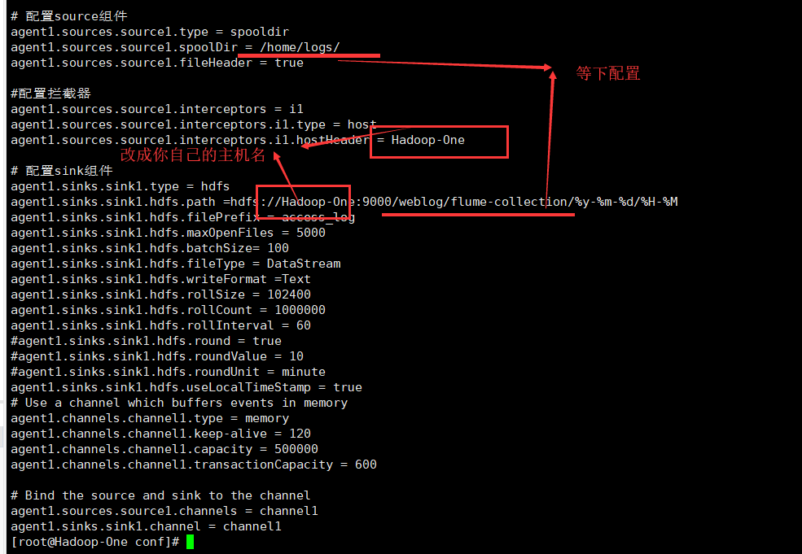
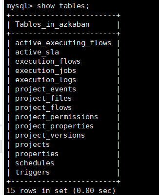
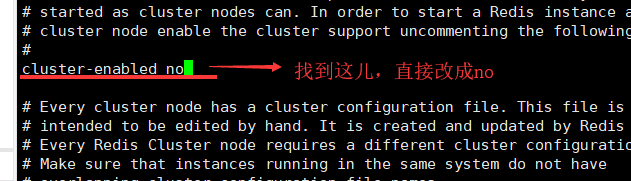

# 目录

* [一\.日志采集](#%E4%B8%80%E6%97%A5%E5%BF%97%E9%87%87%E9%9B%86)
    * [1\.概述了解](#1%E6%A6%82%E8%BF%B0%E4%BA%86%E8%A7%A3)
    * [2\.使用日志](#2%E4%BD%BF%E7%94%A8%E6%97%A5%E5%BF%97)
    * [3\.机制与安装](#3%E6%9C%BA%E5%88%B6%E4%B8%8E%E5%AE%89%E8%A3%85)
    * [4\.快速感受](#4%E5%BF%AB%E9%80%9F%E6%84%9F%E5%8F%97)
    * [5\.采集文件到HDFS](#5%E9%87%87%E9%9B%86%E6%96%87%E4%BB%B6%E5%88%B0hdfs)
    * [6\.采集日志到HDFS](#6%E9%87%87%E9%9B%86%E6%97%A5%E5%BF%97%E5%88%B0hdfs)
    * [7\.认识新BUG](#7%E8%AE%A4%E8%AF%86%E6%96%B0bug)
    * [8\.快乐总结](#8%E5%BF%AB%E4%B9%90%E6%80%BB%E7%BB%93)
* [二\.工作流调度](#%E4%BA%8C%E5%B7%A5%E4%BD%9C%E6%B5%81%E8%B0%83%E5%BA%A6)
    * [1\.介绍一下](#1%E4%BB%8B%E7%BB%8D%E4%B8%80%E4%B8%8B)
    * [2\.安装一下](#2%E5%AE%89%E8%A3%85%E4%B8%80%E4%B8%8B)
    * [3\.配置一下](#3%E9%85%8D%E7%BD%AE%E4%B8%80%E4%B8%8B)
    * [4\.再配置下](#4%E5%86%8D%E9%85%8D%E7%BD%AE%E4%B8%8B)
    * [5\.启动一下](#5%E5%90%AF%E5%8A%A8%E4%B8%80%E4%B8%8B)
    * [6\.登陆一下](#6%E7%99%BB%E9%99%86%E4%B8%80%E4%B8%8B)
    * [7\.使用简单job](#7%E4%BD%BF%E7%94%A8%E7%AE%80%E5%8D%95job)
    * [8\.赛后总结](#8%E8%B5%9B%E5%90%8E%E6%80%BB%E7%BB%93)
* [三\.数据迁移](#%E4%B8%89%E6%95%B0%E6%8D%AE%E8%BF%81%E7%A7%BB)
    * [1\.什么是Sqoop](#1%E4%BB%80%E4%B9%88%E6%98%AFsqoop)
    * [2\.在这停顿](#2%E5%9C%A8%E8%BF%99%E5%81%9C%E9%A1%BF)
    * [3\.安装配置](#3%E5%AE%89%E8%A3%85%E9%85%8D%E7%BD%AE)
    * [4\.如何使用](#4%E5%A6%82%E4%BD%95%E4%BD%BF%E7%94%A8)
* [四\.项目模板](#%E5%9B%9B%E9%A1%B9%E7%9B%AE%E6%A8%A1%E6%9D%BF)
    * [1\.使用须知](#1%E4%BD%BF%E7%94%A8%E9%A1%BB%E7%9F%A5)
    * [2\.导入mysql](#2%E5%AF%BC%E5%85%A5mysql)
    * [3\.单机redis](#3%E5%8D%95%E6%9C%BAredis)
    * [4\.配置eclipse](#4%E9%85%8D%E7%BD%AEeclipse)
    * [5\.修改代码](#5%E4%BF%AE%E6%94%B9%E4%BB%A3%E7%A0%81)
    * [6\.搬到虚拟机](#6%E6%90%AC%E5%88%B0%E8%99%9A%E6%8B%9F%E6%9C%BA)
* [五\.项目制作](#%E4%BA%94%E9%A1%B9%E7%9B%AE%E5%88%B6%E4%BD%9C)
    * [1\.文档要求](#1%E6%96%87%E6%A1%A3%E8%A6%81%E6%B1%82)
    * [2\.项目需求](#2%E9%A1%B9%E7%9B%AE%E9%9C%80%E6%B1%82)
    * [3\.项目过程](#3%E9%A1%B9%E7%9B%AE%E8%BF%87%E7%A8%8B)
    * [4\.前端页面](#4%E5%89%8D%E7%AB%AF%E9%A1%B5%E9%9D%A2)
    * [5\.项目总结](#5%E9%A1%B9%E7%9B%AE%E6%80%BB%E7%BB%93)

## 一.日志采集

Author：Masterpaopao

本博客已经上传Github：https://github.com/Masterpaopao/Master-Blog

这是我的第三周实习记录，接触到了Hadoop生态圈的一些辅助系统，如数据的采集，数据的迁移和工作流调度等等，无奈水平不够不能深层次使用，故简单记录下作入门用。

当然了，最后三天是项目模式，对，只能在三天内完成。

#### 1.概述了解

我们需要用到的日志采集框架正是Flume。

在一个完整的大数据处理系统中，除了HDFS+MapReduce+Hive组成分析系统的核心之外，还需要有数据采集、结果数据导出、任务调度等不可或缺的辅助系统。假如你不会用爬虫来获取数据，或许你得好好了解一下这些辅助系统。


所以Flume到底是什么呢？

&nbsp;

Flume是一个分布式、可靠、和高可用的海量日志采集、聚合和传输的系统。
它可以采集文件，socket数据包等各种形式源数据，又可以将采集到的数据输出到HDFS、HBASE、HIVE、KAFKA等众多外部存储系统中。
一般的采集需求，通过对Flume的简单配置即可实现。

&nbsp;

#### 2.使用日志

为了弄清楚Flume采集的日志到底是怎么样的，我们可以用tomcat来试验。

因为tomcat属于单节点服务器，所以我们暂时先开启一个虚拟机，找到tomcat的安装位置

cd /usr/local/tomcat，进入查看日志被存放在哪儿，果不其然存放在logs


我们进入日志，发现tomcat的日志系统是按日期来记录的


我们就查看2019-06-24的两个日志文件，分别为catalina与localhost_access_log。

cat catalina.2019-06-24.log，发现这个日志记录了各大端口的连接状态，以及各文件夹的运作状态


毫无疑问这些状态良好，我们再cat localhost_access_log.2019-06-24.txt

可以发现这里面都是HTTP请求的连接状态，传输了各种各样的文件，也是一切良好


&nbsp;

所以，经过上面日志的查看，我们应该清楚Flume的采集日志工作原理了，当然了，不只是日志，还应当有更加庞大的海量数据文件，所以Flume完成的核心工作就是采集数据，并导入进相应的位置。

#### 3.机制与安装

在安装Flume之前，我们先了解一下它的运行机制，这样会更好地理解如何安装配置

Flume分布式系统中最核心的角色是agent，flume采集系统就是由一个个agent所连接起来形成，每一个agent相当于一个数据传递员，内部有三个组件：

1）source：采集源，用于跟数据源对接，以获取数据

2）sink：下沉地，采集数据的传送目的地，用于往下一级agent传输数据或者往最终存储系统传递数据

3）channel： agent内部的数据传输通道，用于从source将数据传递到sink

以数据传输到HDFS为例，示例图如下:


当然了，如果是复杂的数据传输，要用到多级agent，示例图又会是这样


好了，废话不多说。拿到我们的apache压缩包：apache-flume-1.6.0-bin.tar.gz

然后一如既往地拖进去/root/home，然后执行tar -zxvf apache-flume-1.6.0-bin.tar.gz -C /usr/local/src

然后就进入/usr/local/src，给这个文件改个名字，像图中这样


完事之后，让我们cd flume-1.6.0/conf，在里面继续添加配置一个conf文件（与HIVE一样）

配置一波netcat-logger.conf，直接vi netcat-logger.conf，将下面的代码拷贝进去

```
# 定义这个agent中各组件的名字
a1.sources = r1
a1.sinks = k1
a1.channels = c1

# 描述和配置source组件：r1
a1.sources.r1.type = netcat
a1.sources.r1.bind = Hadoop-One
a1.sources.r1.port = 44444

# 描述和配置sink组件：k1
a1.sinks.k1.type = logger

# 描述和配置channel组件，此处使用是内存缓存的方式
a1.channels.c1.type = memory
a1.channels.c1.capacity = 1000
a1.channels.c1.transactionCapacity = 100

# 描述和配置source  channel   sink之间的连接关系
a1.sources.r1.channels = c1
a1.sinks.k1.channel = c1
```

复制进去后，你只需要修改一个地方，然后wq保存退出


然后是启动flume（跟hive的启动方式很类似）在安装的主目录里面启动

cd /usr/local/src/flume-1.6.0，进入安装主目录，然后输入下面的命令启动

bin/flume-ng agent -c conf -f conf/netcat-logger.conf -n a1 -Dflume.root.logger=INFO,console


当你看到这个界面就是启动成功。

&nbsp;

#### 4.快速感受

下一步，我们本应该是直接对接到HDFS，将采集到的数据发送至HDFS存储系统，然后后面的套路我们就很熟悉了，进一步交给MapReduce处理计算调度得到最终的结果。

现在我们先来体验一下Flume的使用方式，快速感受下：

先克隆一个一样的会话窗口，这个地方用来发送数据被Flume采集


然后安装一下telnet，这是用来链接节点与端口上的应用，可以用来链接正在运行的Flume

输入yum install telnet


完事之后，连接到正在运行的Flume，输入telnet Hadoop-One 44444


现在随便打两句招呼，让Flume采集到


回到前面的会话看看效果


看到了吗，你的两句招呼数据被捕获到了。

&nbsp;

上面的过程是带你快速感受一下Flume采集数据的过程，这只是自己采集自己发送给自己的过程，实际上我们采集到数据以后，就发送给存储系统（例如HDFS），感受完后按ctrl+c退出。

&nbsp;

#### 5.采集文件到HDFS

现在我们要对接到HDFS，所以让我们先启动Hadoop吧

启动Hadoop完毕之后，可以打开网页端检查一下，完事之后回到Flume安装主目录

我们继续配置一个conf文件，这个conf用来对接HDFS系统，连输入下面两条命令

cd /usr/local/src/flume-1.6.0/conf

vi spooldir-hdfs.conf

将下面的内容拷贝进去，并注意几处需要手动修改的地方

```
#定义三大组件的名称
agent1.sources = source1
agent1.sinks = sink1
agent1.channels = channel1

# 配置source组件
agent1.sources.source1.type = spooldir
agent1.sources.source1.spoolDir = /home/logs/
agent1.sources.source1.fileHeader = true

#配置拦截器
agent1.sources.source1.interceptors = i1
agent1.sources.source1.interceptors.i1.type = host
agent1.sources.source1.interceptors.i1.hostHeader = Hadoop-One

# 配置sink组件
agent1.sinks.sink1.type = hdfs
agent1.sinks.sink1.hdfs.path =hdfs://Hadoop-One:9000/weblog/flume-collection/%y-%m-%d/%H-%M
agent1.sinks.sink1.hdfs.filePrefix = access_log
agent1.sinks.sink1.hdfs.maxOpenFiles = 5000
agent1.sinks.sink1.hdfs.batchSize= 100
agent1.sinks.sink1.hdfs.fileType = DataStream
agent1.sinks.sink1.hdfs.writeFormat =Text
agent1.sinks.sink1.hdfs.rollSize = 102400
agent1.sinks.sink1.hdfs.rollCount = 1000000
agent1.sinks.sink1.hdfs.rollInterval = 60
#agent1.sinks.sink1.hdfs.round = true
#agent1.sinks.sink1.hdfs.roundValue = 10
#agent1.sinks.sink1.hdfs.roundUnit = minute
agent1.sinks.sink1.hdfs.useLocalTimeStamp = true
# Use a channel which buffers events in memory
agent1.channels.channel1.type = memory
agent1.channels.channel1.keep-alive = 120
agent1.channels.channel1.capacity = 500000
agent1.channels.channel1.transactionCapacity = 600

# Bind the source and sink to the channel
agent1.sources.source1.channels = channel1
agent1.sinks.sink1.channel = channel1
```

注意事项看这儿



你们应该看到上图中的两个等下配置了，现在我们同样一口气两条命令解决

mkdir /home/logs（Flume采集日志的地方）

hdfs dfs -mkdir -p  /weblog/flume-collection（HDFS收到采集数据后存储的地方）

&nbsp;

在这停顿！我们需要缓一缓，梳理一下我们上面所配置的spooldir-hdfs.conf到底在干嘛

首先看看采集需求：某服务器的某特定目录下，会不断产生新的文件，每当有新文件出现，就需要把文件采集到HDFS中去。在这个过程中，Flume的三个组件在干嘛？

我们正在监控source采集源的文件，每当里面新产生文件以后，我们就会将这个新文件通过channel通道来复制传输到sink下沉目的地HDFS存储系统那儿。


接下来我们就来试验一下这个采集文件的功能，我们还是需要用到克隆会话窗口

首先在主会话窗口中，回到flume主目录（/usr/local/src/flume-1.6.0），输入以下命令启动采集

bin/flume-ng agent -c ./conf -f ./conf/spooldir-hdfs.conf -n agent1 -Dflume.root.logger=INFO,console

（遇到BUG点，原命令是-n a1，与上面快速感受的命令格式一样，后来发现无法启动，因为上面的命令只是离线采集，而这次的命令是上线采集，与HDFS链接，所以要改成-n agent1）

我们可以看到最后一行命令是空的，因为目标目录并没有文件，所以我们切换到克隆会话窗口


在我们的克隆会话窗口中，cd /home/logs/，在里面vi a.txt，创建一个新的文件并保存退出


可以看到，创建了一个a.txt之后，立马被Flume监控到并采集，被采集的标志是添加了COMPLETED后缀

再来看看主会话窗口这边反馈的采集信息：


我们打开Hadoop网页端看看，是否真的采集成功


&nbsp;

这就是Flume监控目标目录检测新添的变化的过程，如果新添了一个文件，立马被采集发送到HDFS服务器，然后HDFS进一步将这些数据进行MapReduce计算调度，完成了一个大数据流程。

我们可以多添加几个文件，比如b.txt，c.txt，d.txt等，都是一样的（等一段时间，等采集的工作完成）

我们可以发现，a.txt被采集到了12-46这个文件夹，而b.txt，c.txt，d.txt都被采集到了12-51这个文件夹


这是因为我们在上面的xml配置中，采集的数据根据每分钟的单位来划分，现在我再加个e.txt，就是被采集到现在的几点几分的文件夹里，现在我们就可以看到三个时间段的文件夹，里面都存储着在当前时间段被采集的数据文件。


&nbsp;

#### 6.采集日志到HDFS

在上面，我们成功完成了Flume采集文件的功能，检测是否新增文件而进行采集。

现在别忘了还有日志也要采集，用来记录各种信息，出错误的时候可以通过日志来查看，那么我们知道日志一般来说只有一个日志文件，所以Flume要做的就是检测这个日志文件的内容变化，发送到HDFS上成为一个日志文件进行同步，然后日志内容每新添几行内容，flume进行采集新的内容增添进去HDFS上的日志。

所以，采集文件到HDFS是监控文件数量的变化，采集日志到HDFS是监控文件内容的变化。

&nbsp;

所以我们先创造一个日志文件为access.log，放在/home/logs，将下面的内容拷贝进去

```
194.237.142.21 - - [18/Sep/2017:06:49:18 +0000] "GET /wp-content/uploads/2017/07/rstudio-git3.png HTTP/1.1" 304 0 "-" "Mozilla/4.0 (compatible;)"
183.49.46.228 - - [18/Sep/2017:06:49:23 +0000] "-" 400 0 "-" "-"
163.177.71.12 - - [18/Sep/2017:06:49:33 +0000] "HEAD / HTTP/1.1" 200 20 "-" "DNSPod-Monitor/1.0"
```

然后我们也要在HDFS上创建一个文件夹，用来存放唯一的日志位置
hdfs dfs -mkdir -p /weblog/flume-log
然后让我们进入cd /usr/local/src/flume-1.6.0/conf，同样是编辑一个采集日志的配置文件

就取名为spoollog-hdfs.conf，进入编辑，将以下的内容拷贝进去

```
# 给三个组件进行命名
agent1.sources = source1
agent1.sinks = sink1
agent1.channels = channel1

# Describe/configure tail -F source1
agent1.sources.source1.type = exec
agent1.sources.source1.command = tail -F /home/logs/access.log
agent1.sources.source1.channels = channel1

#configure host for source
agent1.sources.source1.interceptors = i1
agent1.sources.source1.interceptors.i1.type = host
agent1.sources.source1.interceptors.i1.hostHeader = Hadoop-One

# Describe sink1
agent1.sinks.sink1.type = hdfs
#a1.sinks.k1.channel = c1
agent1.sinks.sink1.hdfs.path =hdfs://Hadoop-One:9000/weblog/flume-log/%y-%m-%d/%H-%M
agent1.sinks.sink1.hdfs.filePrefix = access_log
agent1.sinks.sink1.hdfs.maxOpenFiles = 5000
agent1.sinks.sink1.hdfs.batchSize= 100
agent1.sinks.sink1.hdfs.fileType = DataStream
agent1.sinks.sink1.hdfs.writeFormat =Text
agent1.sinks.sink1.hdfs.rollSize = 102400
agent1.sinks.sink1.hdfs.rollCount = 1000000
agent1.sinks.sink1.hdfs.rollInterval = 60
agent1.sinks.sink1.hdfs.round = true
agent1.sinks.sink1.hdfs.roundValue = 10
agent1.sinks.sink1.hdfs.roundUnit = minute
agent1.sinks.sink1.hdfs.useLocalTimeStamp = true

# Use a channel which buffers events in memory
agent1.channels.channel1.type = memory
agent1.channels.channel1.keep-alive = 120
agent1.channels.channel1.capacity = 500000
agent1.channels.channel1.transactionCapacity = 600

# Bind the source and sink to the channel
agent1.sources.source1.channels = channel1
agent1.sinks.sink1.channel = channel1
```

注意修改自己的主机名，然后校对文件的位置，我就不放图了。

&nbsp;

完事之后，直接回到主目录，一样的输入以下的命令

bin/flume-ng agent -c ./conf -f ./conf/spoollog-hdfs.conf -n agent1 -Dflume.root.logger=INFO,console

启动以后，不出意外还是成功地界面


接下来的操作就很简单了，还是克隆会话，给access.log新添加一行日志


保存退出以后，你应该可以看到Flume系统发生了采集的动作，我们稍等一会儿，直接在网页端查看


虽然采集日志也成功地完成了，但是时间分类的名字好像出错了，所以我们需要进一步的优化。

&nbsp;

#### 7.认识新BUG

为什么当前时间明明是15点40分，我的文件夹日期名字成了14:00呢

然后我输入date，发现当前虚拟机时间也不大对劲，确实都被改了


我突然想起来，我中午做了一件我从来没有做过的事情。

因为我的虚拟机是离线的，并不同步网络时间，需要自己设置，中午的时候我并没有关闭虚拟机，而是选择了挂起虚拟机就去睡觉了。

我查询了一下挂起虚拟机是什么意思，发现挂起虚拟机是一种保留虚拟机当前状态的行为，属于定格，所以我的非网络时间也被定格了！所以当我再开机的时候，它是以挂起虚拟机时的时间点继续计时的！


没啥好说的，毕竟我是静态时间，没有联网，我直接又对三台虚拟机（1个namenode+2个datanode）同步下

输入date -s "2019-7-1 15:46:00"三台全部同步

(下次开启8.s六台虚拟机的时候 ，再同步一下时间，免得遇到bug)

然后我们继续开始日志内容的添加，看看新产生的文件夹名字是否纠正回来了。

（注意，日志系统没必要采取每分钟为单位采集，那样工作量太大，因为日志随时随地，每分每秒都在生产，所以在这儿采用的单位是每隔10分钟就成一个文件夹）


&nbsp;

现在我们已经成功完成了Flume对日志采集的功能，但是我们所使用的目标日志文件只是一个实验品，正式使用的时候，我们应该修改目标日志接到正确的日志文件。

&nbsp;

#### 8.快乐总结

在上面的学习中，我们了解到了Flume的使用方法，学会了如何采集文件或采集日志内容，并将这些数据发送到HDFS这样的存储系统，这个时候，我们的大数据处理流程又新添了一员大将。

现在我直接画一张快乐的总结图，画一下目前我们掌握的大数据核心组件：


上图中就是我们目前所学习到的大数据生态圈的所有内容，并清晰地指出了两条路，Flume在其中起到了辅助的作用，可以监控Linux本地一个专门的文件夹，一旦有变化立马发送去HDFS文件系统，这让数据的导入节省了不少的麻烦。

&nbsp;

## 二.工作流调度

#### 1.介绍一下

为什么需要用到工作流调度系统呢？

如果不用到工作流调度系统，难道你想每天登陆linux，亲自地敲一堆命令，让大数据走通起来?

那是不可能的，先不说输入命令麻烦，还存在输错命令的可能，所以我们需要一个自动调度系统-azkaban

它能够执行一个完整的大数据处理工作流程，由大量的任务单元组成，各个任务单元之间存在时间先后及前后依赖关系，能够很好地组织起来这样的复杂执行计划，确保每天都能产生数据并导入当天的数据分析结果。


假设一个场景，每天起来以后，我们的大数据开发人员需要完成以下的任务：

1、  通过Hadoop先将原始数据同步到HDFS上；

2、  借助MapReduce计算框架对原始数据进行转换，生成的数据以分区表的形式存储到多张Hive表中；

3、  需要对Hive中多个表的数据进行JOIN处理，得到一个明细数据Hive大表；

4、  将明细数据进行复杂的统计分析，得到结果报表信息；

5、  需要将统计分析得到的结果数据同步到业务系统中，供业务调用使用。

是不是很复杂？但是我们刚好有这样的一款软件azkaban，来完成这个自动调度任务。

&nbsp;

#### 2.安装一下

首先cd /usr/local/src，创建一个文件夹用来放an，mkdir azkaban-2.5.0

然后搞到三个关于azkaban的压缩包，都拖进去这个文件夹


直接原地解压，解压之后删除掉这些压缩包，然后全部改名，最终的效果应当是这样的


然后我们需要将azkaban-sql里面的一个数据表文件，导入到mysql成为一个实例，后面会用到

先进入数据库，创建一个叫azkaban的数据库并进入，然后加载这个数据表文件

```mysql> create database azkaban;
mysql> create database azkaban;
mysql> use  azkaban;
mysql> source /usr/local/src/azkaban-2.5.0/azkaban-sql/create-all-sql-2.5.0.sql;
```


然后我们直接show tables;



这样一来，你的azkaban就已经安装好了，接下来我们进入配置的环节。

&nbsp;

#### 3.配置一下

首先cd /usr/local/src/azkaban-2.5.0，我们将在这儿配置SSL设置

输入keytool -keystore keystore -alias jetty -genkey -keyalg RSA

你会遇到一系列的输入选项，照着我的图填就行，一切从简


完事以后，你会看见你当前的目录多了个keystore，将它移入azkaban-web文件夹并重命名为webserver


&nbsp;

接下来我们配置的就是时区问题，我们的azkaban需要连接一个知名地点的时区

我们直接输入tzselect，我们会发现进入了时区交互阶段，你们自己应该也会


我们选好时区之后，还需要cp /usr/share/zoneinfo/Asia/Shanghai  /etc/localtime 进行时区的覆盖。

这样一来，我们现在的时间就与上海时间同步了（不是真实时间，是azkaban里的上海时间）


（再强调一遍，这个时间同步是要针对于所有跟hadoop有关的虚拟机，比如我是三台，那么我的三台虚拟机都要同步以上操作，同时与上海时间同步）

&nbsp;

#### 4.再配置下

现在，该轮到xml文件登场了，这通常是启动服务前必不可少的步骤，总得配置一大堆xml

一共需要配置两个目录下的conf。

首先我们需要配置的就是azkaban-web里面的配置文件，cd /usr/local/src/azkaban-2.5.0/azkaban-web/conf

然后修改azkaban.properties文件，输入vi azkaban.properties


接下来的修改，大家也应该猜得出来，就是刚刚我们弄SSL与Jetty的时候也设了密码，需要修改五处地方


注意，后面也有需要修改的地方，那是关于邮箱的配置，不填不行


然后我们配置第二个xml文件，也就是azkaban-executor下的conf

输入cd /usr/local/src/azkaban-2.5.0/azkaban-executor/conf，然后vi azkaban.properties


&nbsp;

然后，到这儿还没完，因为我们会启动一个网页，在上面登陆账号和密码，才能进行job任务

所以我们继续回到azkaban-web的目录，cd /usr/local/src/azkaban-2.5.0/azkaban-web/conf

然后vi azkaban-users.xml，增加管理员用户

```
<user username="admin" password="admin" roles="admin,metrics" />
```


&nbsp;

到此为止，我们配置了三个文件，请确保你的修改配置操作无语，让我们进入启动流程。

&nbsp;

#### 5.启动一下

我们的启动流程是有讲究的，需要先后顺序启动两个sh，分别在两个文件夹下启动

首先cd /usr/local/src/azkaban-2.5.0/azkaban-web，然后bin/azkaban-web-start.sh

在这儿，我遇到了第一个BUG，但是这个BUG解决方式很简单


重新回到配置文件，进行修改，去掉多余的空格，即可。

最后请杀掉这个启动失败却产生的进程，应该是bin/azkaban-web-shutdown.sh，不行就重启

然后再次bin/azkaban-web-start.sh的时候，一切顺利，但是我好像看到了这儿不太正常的地方


什么？我的Hadoop-One居然没被解析成正确的IP，而是0.0.0.0？是azkaban太菜了吗？

但是我目前并没有着急修改，因为你可以注意到，这条消息属于INFO级日志，说明一切正常

然后我克隆了一个Hadoop-One会话，这个会话继续挂着azkaban-web进程。

我们来到克隆会话窗口，直接cd /usr/local/src/azkaban-2.5.0/azkaban-executor

然后bin/azkaban-executor-start.sh，发现也是一切正常


&nbsp;

#### 6.登陆一下

当这两个进程都挂在那儿的时候，我们这个时候可以考虑登陆了

打开浏览器，直接输入虚拟机的真实IP地址:8443，我使用的是192.168.111.128:8443

结果我登陆上去的时候，页面是这个样子的


我突然想到，我上面配置的SSL是干啥的？SSL是什么？SSL是哪个协议的？

当我想通SSL是基于HTTPS协议的时候，我给了我自己一巴掌

然后慌忙地将登陆网址改成https://192.168.111.128:8443/

终于上去了，在这个过程中网页会警告你这是危险网站，点击信任并继续访问就可以了


账户和密码我们在vi azkaban-users.xml配置过，账号和密码都是admin，然后点击登陆


你会看到这个页面，然后就是等待被上传一个job任务并执行了。

&nbsp;

#### 7.使用简单job

我们在windows本地打开Notepad++，new一个文件，将下面内容拷贝进去

```
#command.job
type=command                                                    
command=echo 'hello'
```


然后ctrl+s保存，这个文件取名为command.job，并放到桌面上


然后将桌面上的command.job打包成zip文件（右键压缩的时候，别忘了选择zip类型）


然后我们回到网页端，点击首页右上角的Create Project，取个标题，随便写点描述


然后进入这个project，将放在桌面上的zip文件上传，点击右上角的upload


上传成功之后，可以点一波Execute Flow看看效果了


在弹出的窗口中，能够看到这个界面，还提供了可视化的流程图示意，直接右下角的Execute执行job任务


我们可以看到job任务上传成功的提示


我们点击Continue之后，会出现一个页面，来判断你是否执行job任务成功


我这样绿油油地页面，毫无疑问是job任务执行成功

假如你是红色的呢，假如你报错了呢，不要急，我们可以进入Flow Log查看详细的信息，能帮助你解决


&nbsp;

现在你们应该能够想象，使用复杂job是一个怎么样的场景了吧。

&nbsp;

#### 8.赛后总结

现在我们学会了如何使用azkaban来进行工作流调度，是时候写一篇复杂的job了，这个job任务涉及到线上生产数据并处理数据的流程，所以这个job并不好写。我们可以先将大数据流程拆开进行练习：比如先写个Flume采集任务的job，也可以写个控制HDFS操作的job，将数据发送给MapReduce和Hive的脚本任务这些都可以。

然后接下来的核心部分就是复杂job完成MapReduce的任务，需要提前准备好MapReduce的jar包

下面是一个job控制简单MapReduce程序执行的代码模板：

```
# mrwc.job
type=command
command=/usr/lcoal/src/hadoop-2.6.4/bin/hadoop  jar hadoop-mapreduce-examples-2.6.1.jar wordcount /wordcount/input /wordcount/output
```

注意，这个模板是可以直接用的哦，因为里面的jar包是系统本身就有的示例jar包，将路径改成你自己的，然后确保/wordcount/input里面有数据，确保/wordcount/output未被创建，你就可以跑一跑这个job了。

&nbsp;

说白了多个job任务就是多条命令先后顺序地执行的过程，command怎么去写，就是前面先定位好绝对路径，然后隔一个空格后输入你要执行的命令，这便是工作流自动调度，我们只需要在网页端上传好这些job，然后直接flow一下，让这些工作流跑起来。

&nbsp;

## 三.数据迁移

#### 1.什么是Sqoop

Sqoop是apache旗下一款"Hadoop和关系数据库服务器之间传送数据"的工具。

Sqoop与Hive相似的都是使用数据库关联到HDFS，但是不同之处你可就要好好听了：

①Hive完成的工作是从现有的MySQL中拿到数据表直接在原地进行SQL查询过滤，以MapReduce的方式，将结果发送至HDFS（用上MapReduce的话，处理海量数据远远比MySQL直接查询来的有效，还能生成结果）

②而Sqoop却能直接完成数据的导入导出。导入是将MySQL里面的数据表数据直接导入到HDFS等数据存储系统，导出是将HDFS等数据存储系统里面的数据导出到MySQL里面，这些过程的命令都用MapReduce程序来完成。

&nbsp;

说白了，就是关系型数据库（MySQL）与数据存储系统（HDFS）之间的导入导出功能。

Sqoop的出现，使海量数据进入HDFS被MapReduce计算的过程更加容易，甚至还能将计算过滤后的正确数据反向导出到关系数据库形成一张更加权威的数据表。

&nbsp;

#### 2.在这停顿

 也许我们刚刚接触了azkaban与sqoop，一时还消化不来，什么，现在所学习的大数据生态圈又添加两员大将？

所以我们上面的图应该更新了，现在所学习的大数据生态圈图谱应该是这个样子的


如果你能看懂我这个画图，这说明你确实理解你正在学习什么。

&nbsp;

#### 3.安装配置

首先拿到这个sqoop-1.4.6.bin__hadoop-2.0.4-alpha.tar.gz压缩包，放进/root/home

然后tar -zxvf sqoop-1.4.6.bin__hadoop-2.0.4-alpha.tar.gz -C /usr/local/src/进行解压

之后cd /usr/local/src，进行改名，mv sqoop-1.4.6.bin__hadoop-2.0.4-alpha/ sqoop-1.4.6/


改完名字之后，先把这个文件夹加入到系统环境变量，熟练地打开vi /etc/profile


然后就是加载一波，source /etc/profile，当然了还有一个内部环境变量也要设置

&nbsp;

进入这个文件夹里面的conf，我们需要修改配置里面的环境变量设置

先mv sqoop-env-template.sh sqoop-env.sh，再vi sqoop-env.sh


配置上三行环境变量以后，source加载一下设置，source sqoop-env.sh

&nbsp;

这个跟Hive一样，同样是需要与mysql连通，将表数据导入到HDFS，打造新的一环数据推送流程。

所以需要让lib加入与mysql链接的jar包，也就是请搞到mysql-connector-java-5.1.38.jar

直接在Xshell6将mysql-connector-java-5.1.38.jar导入到/usr/local/src/sqoop-1.4.6/lib这个路径来

就可以完成链接mysql的功能。

&nbsp;

在你启动sqoop之前，请先启动hadoop集群，然后回到cd /usr/local/src/sqoop-1.4.6/bin这儿来

直接输入./sqoop-version检测一下是否安装成功


#### 4.如何使用

Sqoop不能说用的很频繁，但是还是有一个重要的途径会一直用到，那就是导出到MySQL数据库

试想以下的需求，当你通过数据的采集抓取到批量数据的时候，你使用脚本将这些输入以'\t'与'\n'的方式分隔开来的时候，你可以导入到Hive，Hive拥有这种智能分词的功能，所以你可以将数据文件直接导入到Hive内，但是之后你又得将Hive的数据导入到MySQL，那才是数据存储的地方，这时候你需要用到Sqoop了。

当你进入到sqoop安装的主目录的时候，你可以直接输入以下的命令:

```
bin/sqoop export --connect jdbc:mysql://192.168.111.128(写下你的数据库所在ip):3306/commnents(写下你要链接数据库的名字) --username root --password 123456 --table com(写下你要导入的表名字) --export-dir '/user/hive/warehouse/comments.db/com'(写下数据在Hive里的绝对路径) --fields-terminated-by '\t'(写下你导入Hive时所用的分隔符);
```

所以，我去掉提示后所使用的命令就是：

```
bin/sqoop export --connect jdbc:mysql://192.168.111.128:3306/commnents --username root --password 123456 --table com --export-dir '/user/hive/warehouse/comments.db/com' --fields-terminated-by '\t';
```

所以你可以看到这样的效果：


&nbsp;

## 四.项目模板

#### 1.使用须知

首先我们需要拿到TOMCAT_WEB和apache-tomcat-7.0.94这两个压缩包。

我们本来在Linux上配置的，但是配置成本高，我们先在windows搞定，所以tomcat需要安装在本地一次

然后拿到这两个地方以后，将它们解压在合适的地方，要求路径清晰。

我们项目的思路就是先在本地成功启动这个web项目，然后mysql数据库与redis数据库连接于虚拟机的，当在本地（使用localhost这个ip地址）成功启动以后，导出成war包直接放入虚拟机使用，这样就完成嫁接。

&nbsp;

#### 2.导入mysql

首先我们打开一台虚拟机，此tomcat只需要单节点模式即可

然后我们解压TOMCAT_WEB之后，会发现里面有个sql文件，这个就需要先导入到虚拟机的数据库

在虚拟机输入mysql -u root -p，然后输入你的密码，登陆进去数据库，这只是代表你的数据库链接顺畅。

然后立马打开我们windows本地远程连接控制数据库的软件（前面用到的Navicat Premium）

连接成功以后，右键对左侧点击new database，创建一个新的数据库，取名为igeekshop

然后注意选择好正确的UTF-8编码，可以参考我如下的操作


然后我们把那个sql文件用Notepad++来打开，全选复制里面的内容，将它全部复制进去这个地方


然后按ctrl+s保存，出来一个查询的名字，输入一个tomcat_store，完事之后，点击这个Run


导入成功以后，刷新一下这个数据库，你会发现表已经成功导入进去了


&nbsp;

#### 3.单机redis

mysql表搞定以后，我们来弄弄单机redis，为什么要叫单机redis呢？

因为如果我们直接启动虚拟机上已经有的redis的话，会启动redis原来的集群模式，也就是cluster


那我们应该怎么办呢，我们又不能直接去修改已经配置好的集群，这个时候我们可以选择克隆

请你回到重定向redis文件夹的目录（非redis源文件夹，是redis重定向文件夹，启动集群的地方）

cd /usr/local/，然后我们输入cp -r redis/ redis_alone/（加个-r参数表示复制文件夹，没有-r只能复制文件）


先在我们进入这个克隆出来的redis，第一时间就是修改里面的redis.conf，关闭集群模式



然后我们就可以保存退出，直接./redis-server redis.conf来启动单机redis后台了


&nbsp;

#### 4.配置eclipse

当我们搞定mysql与eclipse的问题之后，我们进入本地启动tomcat的步骤

首先，我们可能需要更换一波eclipse版本，我们需要用到eclipse-jee的版本，才能进行下一步

http://iso.mirrors.ustc.edu.cn/eclipse/technology/epp/downloads/release/2019-06/R/eclipse-jee-2019-06-R-win32-x86_64.zip

将这个链接复制到迅雷下载（迅雷是程序员必备好吧，专门加速下载东西的），拿到zip之后直接解压就可以启动里面的eclipse.exe了，可以创建一个快捷方式放在桌面。

注意，我们解压了TOMCAT_WEB这个文件夹，里面有个IGeekShop这个文件夹，这个用来直接导入eclipse

 

当我们成功启动eclipse之后，点击左上角的一个选项，选择导入IGeekShop这个文件夹


导入完成之后，你应该看到这样的一个界面


先在我们进入最重要的配置tomcat环节，你照我说的做安装正确的eclipse版本以后，在下方能看到这个


点击这个，准备好解压过后的apache-tomcat-7.0.94，我们来到第一页配置，照我设置的弄

（再强调一遍，为什么要localhost，这样windows能用，直接嫁接到linux上也能用）


在下一页中，你会看到导入哪个文件夹，其实就是刚刚那个apache-tomcat-7.0.94，下面是事后再看的效果图


好了以后，你应该看到这样的效果图


&nbsp;

#### 5.修改代码

首先我要告诉你的是，需要修改的地方只有两处，分别是mysql与redis


首先修改第一个标出来的文件，然后保存


然后再改下面的redis，修改url成你的虚拟机ip，然后保存


因为这个时候，你虚拟机肯定是开着，mysql与redis都准备好了，那就让我们启动项目

启动bug会有一点小小的问题，但是问题不太大，首先打开这个UserServlet.java文件，直接右键启动


然后碰到弹出的窗口，直接默认点Finish即可，然后会遇到一个空白的页面，这是一个小BUG


然后我们就可以看到令人快乐的项目成功启动了嗷


&nbsp;

#### 6.搬到虚拟机

我们在本地启动成功以后，由于我们的localhost特性，嫁接到linux上localhost也能生效

在此之前，我们需要配置好Servers的一个选项，先关闭这个tomcat项目，双击servers


发现这个地方，改不了，为什么要改掉，因为在linux上面的名字叫webapps，而不是wtpwebapps

但是目前改不掉，因为生效了，所以我一气之下删掉了这个servers，重新配置，终于改掉了


然后就是继续快乐地试运行，确保页面能够再次出来。


然后我们右键对这个整体项目进行export，导出成War File放在桌面上


好，现在我们继续回到虚拟机上面来，先启动一波虚拟机的tomcat

cd /usr/local/tomcat/bin，然后输入./startup.sh启动tomcat服务器

然后进入tomcat的webapps文件夹（这就是为啥要在servers改成webapps的原因）

将war包直接导入进去


导入成功以后，你可以直接将localhost改成你虚拟机的IP，直接在虚拟机上面跑web项目了


到此为止，你已经成功完成了linux上跑网页，完成了项目起步的操作，后面开始自由发挥。

&nbsp;

## 五.项目制作

实习报告要全部写完并提交

#### 1.文档要求

编写一个项目综合文档，内含下面几大模块：

需求文档 -> 数据库图表 -> 项目流程图 -> 代码文档 -> 测试文档 -> 使用手册

不要着急，我们可以一个个解决，项目周的工作强度是很大的的，先把实习报告补一下。

我对于实习报告是很排斥的，但是无奈公司制度要求，可能所有地方都一样，都要写类似的，比如日志周志等等，所以开发人员的加班也可能是在编写文档呢。

#### 2.项目需求

编写一个大数据流程，从数据的采集到数据的清晰，从数据的分析到数据的导入，从前端到后台，从图表到页面，这都是一个完整的全栈流程。

主要展现一个大数据的生态链，抓到海量数据之后如何将最终的结果展现到小小的图表中，这中间的流程如何布置，极度考验了开发人员的功底。

我们是项目小组合作，因为我会用Python爬虫和前端页面，于是我负责了数据的采集与前端页面布局的编写。

#### 3.项目过程

我将以前写的爬虫，花了一天的时间，买了IP代理池，进行了全方位地改动与优化，我的爬虫终于准备启动了。

主要的关键点在于这个阀门类，频率的控制，以及下载页面的判断


然后我爬取了商品尽可能多的详细数据，因为大数据第一个特性就是海量数据，将爬取到的这些结果全部存入了csv文件，为什么选择csv是因为方便读写。


最后，在我的爬虫兢兢业业地工作了三小时之后，我拿到了这批海量数据


然后，我写了一个python处理数据程序，将这里面的数据以'\t'分隔符的方式写入到txt，方便同事直接拿到hive去导入，再sqoop导出到MySQL数据库


最终的结果也就整整齐齐地摆放在那儿了


我的任务就完成了，接下来就看我同事的发挥了。


#### 4.前端页面

当所有组的批量数据汇总结束以后，汇总后的效果是这样的

我截图了其中一个item的汇总结果


我又开始了前端任务的编写，我第一反应肯定是要用bootstrap4框架去做，不然自己设计一个网页的时间成本太大，这是一个不恰当的选择，我们的核心思维是重视数据的展现过程。

所以在经过我对bootstrap4的复习之后，一个大致的布局已经出来了


这些只是首页的简单布局，我主要心思还是花在了详细数据页面的编写，使用了手风琴案例


#### 5.项目总结

一个字：累。

两个字：熬夜。

三个字：压力大。

&nbsp;

在有限的时间内要做出这么多东西，体验了一把真实生产环境时候开发程序员的那种紧张和压力的感觉，我才知道程序员真的很不容易，也许人们瞧见了程序员的高薪，却看不到高薪背后的泪水与头发，这让我对计算机行业心生敬畏，同时也测试了自己的心理素质和潜能，发现我在此期间，保持冷静与自律，始终以一种良好的心态去面对，去积极完成任务，对自己的所能承受的压力和待开发的潜能有了一个全新的认知。

&nbsp;

也许这就是实习的最大意义吧，亲身体验到项目的开发与团队的协作，感悟颇多。