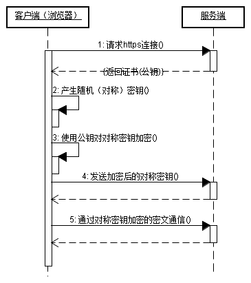

# 从地址栏到网页展现的过程

​															作者：黄宇航

## 一.打开浏览器，输入网址


#### 1.什么是URL

我们就以www.google.com为例吧，毕竟它是程序员最爱的搜索引擎。

在这儿，我们假设一种没有访问过此地址的情况。

哦不，我们是程序员了，我们需要用专业的叫法:

~~地址~~，应当改称呼为**URL**：统一资源定位符（Uniform Resource Locator， 常缩写为URL）， 我们知道现在的互联网其实就是由众多资源所构成的一张巨大的网， 如何定位那些资源就是靠的URL。

也许你可以尝试理解成URL是每个网站的门牌号，实际上的真实位置是一组IP参数(xxx.xxx.xxx.xxx)。

#### 2.解析URL

这个时候，浏览器需要对地址栏输入的内容进行判断：

- 符合标准规范的URL地址

  ```
  我们输入URL的时候，并没有明确告诉浏览器是用哪个协议，到底是http协议还是https协议。
  
  这个时候，浏览器一般默认使用http协议，加在URL前面，正式发出访问的请求。
  
  当然，如果经过特殊设置，比如我的火狐浏览器，从某天开始，访问任何网站都是https协议。
  
  所以，我输入www.google.com后按下回车，浏览器自动补齐为https://www.google.com。
  
  之后，浏览器就正式向谷歌发出访问的请求。
  
  http与https的区别我将在下面讲到。
   
  ```

- 搜索的关键字

  ```
  当协议或者主机名不合法的时候，一些高级浏览器会将地址栏中输入的文字传给默认的搜索引擎。
  
  也就是说，你如果设置百度为默认引擎，那么就是浏览器让那个百度引擎去搜索你输入的内容。
  
  这个是高级浏览器的功能，一些低级的可能不支持，直接报错。
  
  ```
  
---

## 二.缓存查找与解析DNS


#### 1.缓存查找

当然，我们在上面假设是从没访问过www.google.com的情况。在实际中，其实并不然。

正如在与朋友亲人瞎吹比聊天的时候，难免会提到一些地名，你的脑子第一反应肯定是我有没有去过。

其实，系统也是这么想的。

- 浏览器缓存
  - 当你在地址栏输入这个URL之后，浏览器会先查看浏览器缓存中有没有这个地址。
  - 如果有，就会直接读取这个缓存直接将页面识别出来，速度明显大于第一次访问。
  - 如果没有，就转到下一层系统缓存。
- 系统缓存
  - 为什么会来到系统缓存，也许可能像我一样骚？我电脑可是装了三个浏览器的。
  - 反正我的理解可能是对的，我在别的浏览器访问过，这个浏览器第一次访问。
  - 如果获取到系统缓存有这个地址，速度稍微快于第一次打开，如果没有就转到路由器缓存。
- 路由器缓存
  - 这个就很厉害了，我上网百度半天，也没分析个所以然。
  - 这个好像是和IE浏览器有关的。
  - 难不成是两部电脑都连同一个WIFI，这个电脑访问过，另外一台电脑没访问过？

如果，浏览器缓存->系统缓存->路由器缓存都没有找到，那么你确实是第一次访问这个URL。
所以，接下来的任务，这个URL就要移交给DNS服务器处理了。

#### 2.什么是DNS
DNS(Domain Name System):是互联网的一项服务。
它将域名和IP地址相互映射的一个分布式数据库，能够使人更方便地访问互联网。
也可以粗暴的理解为，存储着URL对应IP地址信息的数据库！

**当我们第一次访问某个URL地址，DNS会寻找这个URL的对应真实IP地址，发出访问请求！**

DNS使用TCP/UDP端口。

#### 3.DNS怎么样才能拿到真实IP地址

我们弄明白DNS之后，DNS该干活了：

- 去查询这个URL对应的IP地址是什么，抱歉，没找到，自己只是个本地区域DNS
- 向爸爸DNS发出查询请求，也就是根域名服务器(就是一个点'.'，代表树根，全球一共13台)
- 儿子DNS，这个时候应该称呼为LDNS了，得到详细的寻找路线，向网关出发
- 就像出国一样，你要去寻找真实的IP地址，但是你得带护照啊
- 这时候护照就是网关的MAC地址，这就需要询问，才能出关
- 出了关之后马不停蹄地向目标出发，拿到真实的IP地址

#### 4.DNS漫长的回家之路
拿到真实IP地址之后，肯定是踏上了漫长的回家之路。
但是，与人的懒惰性一样的是，DNS也会懒惰，所以它会做下面的事情：
- 经过路由器时
  - 将自己拿到的IP地址在路由器缓存起来
  - 并继续带着IP地址向系统出发
- 经过操作系统时
   	- 将自己拿到的IP地址在系统缓存起来
    - 并继续带着IP地址向浏览器出发
- 经过浏览器时
  - 将自己拿到的IP地址在浏览器缓存起来
  - 浏览器收到了IP地址
  - 美滋滋地完成工作，休息去
  - 以后再访问这个IP地址的时候，不用再跑腿了

就这样，DNS完成了它的使命，将这个URL的首页成功显示在浏览器上了。

当然，我们不能忽视，浏览器拿到URL真实IP地址的时候是怎么建立连接的？

---
## 三.TCP连接和端口的选择
当浏览器拿到URL真实IP地址的时候，肯定要建立连接啊。
这个连接的过程是个协议，叫做**TCP/IP协议**，里面涉及到端口的选择和著名的**三次握手**。

#### 1.概念

- TCP：传输控制协议
- 面向连接的，可靠的，基于字节流的传输通信协议
- 与HTTP的关系：HTTP的请求响应都建立在TCP协议上

#### 2.端口

也就是说，每一次连接都是需要通过端口的，那么不同类型的连接可以有不同的端口。

- 每一个TCP链接一个端口号

- 区分不同的网络服务
  - http：80/8080
  - https：443
  - ssh：22
  - ftp：21

- 分类
  - 知名端口
  - 注册端口
  - 动态或匿名端口

  #### 3.面试必问的三次握手(建立TCP连接的过程)

  专业版

  

 搞笑版（四次握手）


电话版


这个知识点啊一定要理解，三次握手和四次握手已经成了面试官口中的智力题了。
下面是标准答题法：

```
第一次握手:
Clinet将标志位SYN置为1，随机产生一个值seq=J，并将该数据包发送给Server，Client进入SYN_SENT状态，等待Server确认。

第二次握手:
Server收到数据包后由标志位SYN=1知道Client请求建立链接，Server将标志位SYN和ACK都置为1，ack=J+1，随机产生一个值seq=K，并将该数据包发送给Client以确认连接请求，Server进入SYN_RCVD状态。

第三次握手:
Client收到确认后，检查传来的东西是否正确，若正确，则将标志位ACK置为1，ack=K+1，并将数据包发送给Server，Server检查传来的东西是否正确，若也正确，Client和Server都进入ESTABLISHED状态，完成三次握手，就可以开始相互传输数据了。
```

当然了，如果有真的想理解三次握手的，我就不得不祭出我的两张PS神作：

黄宇航版


---
## 四.HTTP协议与HTTPS协议

一般来说，我们三次握手成功后， 浏览器就可以向服务器发送http请求了， 请求数据包。

这样一来，这个服务器就会返回我们页面的内容，访问谷歌就是返回我们那个简洁的搜索栏，上面是Google的logo图标，可谓界面简洁美观。

 **发送HTTP请求的过程就是构建HTTP请求报文并通过TCP协议中发送到服务器指定端口(HTTP协议80/8080, HTTPS协议443)**。

但是，我们最好要弄清楚HTTP协议访问和HTTPS协议访问这两者到底有什么区别：

#### 1.HTTP与HTTPS的基本概念

　HTTP：是互联网上应用最为广泛的一种网络协议，是一个客户端和服务器端请求和应答的标准（TCP），用于从WWW服务器传输超文本到本地浏览器的传输协议，它可以使浏览器更加高效，使网络传输减少。

  HTTPS：是以安全为目标的HTTP通道，简单讲是HTTP的安全版，即HTTP下加入SSL层，HTTPS的安全基础是SSL，因此加密的详细内容就需要SSL。

#### 2.HTTPS会多做什么

我们在上面了解到，HTTP协议传输的数据基本都是未加密的，也就是明文的。

这个非常不利于我们登陆淘宝或京东，其他网站提交个人敏感信息的时候，数据交互中的安全性。

所以SSL验证就这么出来了，会在HTTP传输的过程中，将数据进行加密，比HTTP协议更加安全。

#### 3.SSL验证过程的图解

#### 

---
## 五.浏览器渲染网页
在通过HTTP协议或HTTPS协议的TCP连接请求之后，服务器开始返回浏览器的文本信息。
我们终于完成了对URL的访问，得到了界面。
那么这个界面的返回也是有讲究的，是一个不简单的渲染过程。

**但是经常浏览的人应该知道，浏览器是一个边解析边渲染的过程。**

1.处理 HTML 标记并构建 DOM 树。
2.处理 CSS 标记并构建 CSSOM 树。
3.将 DOM 与 CSSOM 合并成一个渲染树。
4.根据渲染树来布局， 以计算每个节点的几何信息。
5.将各个节点绘制到屏幕上。
不过这五个步骤在不同内核的浏览器中执行细节是不同的， 想深入了解的可以查阅相关资料。
这里推荐一篇文章：《浏览器渲染页面过程与页面优化》

（https://segmentfault.com/a/1190000010298038）

当然，上面你如果觉得复杂，记不住，不妨就看看下面的暴力总结：
```
当服务器提供了资源之后（HTML，CSS，JS，图片等），浏览器会执行下面的操作：
	解析 —— HTML，CSS，JS
	渲染 —— 构建 DOM 树 -> 渲染 -> 布局 -> 绘制
```
---
## 最后的总结
在你仔细阅读完这篇文章之后，细细理解上面我所概括的五大知识点之后，
相信你已经对从**地址栏上输入网页后发生了什么**，有了一定的理解。
现在，我们来个总结如下:

- 1.浏览器地址栏输入url
- 2.浏览器会先查看浏览器缓存系统缓存路由缓存，如有存在缓存，就直接显示,如果没有，接着第3步
- 3.域名解析（DNS）获取相应的 IP地址
- 4.浏览器向服务器发起tcp连接，与浏览器建立tcp三次握手
- 5.握手成功，浏览器向服务器发送http请求或https请求，请求数据包
- 6.发送https请求的时候，需要先通过SSL证书验证
- 7.服务器请求数据，将数据返回到浏览器
- 8.浏览器接收响应读取页面内容，解析html源码，生成 Dom 树
- 9.解析 css 样式、浏览器渲染，js交互

---
## 参考资料汇总
https://mp.weixin.qq.com/s/gGDlvZAjPTcuOnILe6OFyQ

https://mp.weixin.qq.com/s/kkciykYN-Fait6QdWvse6g

https://github.com/skyline75489/what-happens-when-zh_CN

https://www.cnblogs.com/wqhwe/p/5407468.html


