# HTML5基础学习


## 一.元素概览

a元素：生成超链接

b元素：不带强调地标记一段文字

br元素：表示换行，作为单标签就能发挥作用

em元素：着重强调的一段文字

ruby元素：标拼音的元素

strong元素：表重要内容

sub元素和sup元素：表下标元素和上标元素

li元素：列表元素

p元素：最广泛使用的段落元素

h1-h6元素：表示标题

header元素：首部信息

body元素：主体信息

article元素：一段独立的内容

footer元素：表示尾部

section元素：表示重要的概念和主题

img元素：嵌入图像

audio元素：嵌入音频

video元素：嵌入视频


## 二.元素嵌套

<p>我<strong>最</strong>帅</p>

```
<p>我<strong>最</strong>帅</p>

由上面我们可以知道，元素的嵌套使用一定要遵守规范，成对的标签要在从内向外的顺序成对地出现

错误的示范如下：

<p>我<strong>最帅</p></strong>

错误写法的效果如下:
```
<p>我<strong>最帅</p></strong>


## 三.块级元素和内联元素

块级(block)元素：<h1>、<p>、<ul>、<table>、<div>等等

最传统的块级元素非<div>元素莫属

白话解释块级元素的作用：**其后的内容会被挤到下一行来展现，自动换行**


内联(inline)元素：<a>、<em>、<strong>、、<span>等等

最传统的内联元素非<span>元素莫属

白话解释内联元素的作用：**其后的内容会在同一行显示，不会导致文本换行**


两段代码教你弄懂块级元素和内联元素的区别：

#### 1.第一段示例

```
<p>哈哈哈哈</p><span>六<strong>六六</strong>六</span>
```
效果如下：
<p>哈哈哈哈</p><span>六<strong>六六</strong>六</span>

我们可以发现，这代码明明是处于同一行的，最终输出却是两行

p元素是是块级元素，剩下的都是内联元素，根据这个我们能够看明白块级元素的作用


#### 2.第二段示例

```
<span>当当当<p>我是巴拉拉小魔仙</p>变变变！</span>
```
效果如下：

当当当

我是巴拉拉小魔仙

变变变！

我们吃惊地看到，明明只有一行代码，却获得了三行的输出！

这个例子能够让我们更加充分地理解块级元素的作用：**文本内容独占一个块级空间**


## 四.使用的html代码标准结构

我是用vscode进行编写代码的，图它强大的插件和标准的代码结构

现在我按一下!，然后tab，HTML的结构就这样生成了:

```
<!DOCTYPE html>
<html lang="en">

<head>
    <meta charset="UTF-8">
    <meta name="viewport" content="width=device-width, initial-scale=1.0">
    <meta http-equiv="X-UA-Compatible" content="ie=edge">
    <title>Document</title>
</head>

<body>
    
</body>

</html>
```

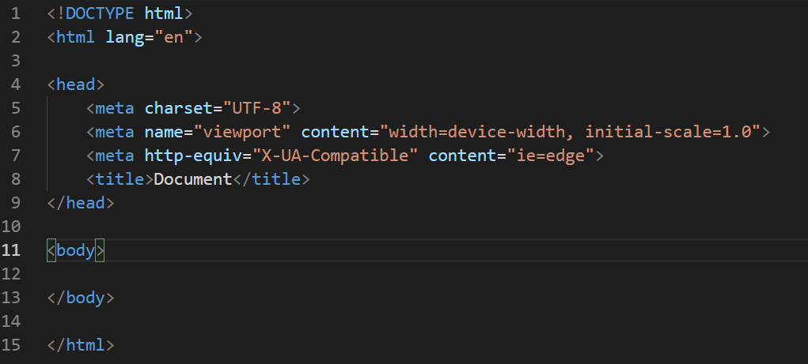


## 五.文本元素


#### 1.a标签

```
<a href="https://www.baidu.com">百度</a>
```
使用href属性来设置跳转的url，然后在成对标签内填上文本内容，作为链接的名字

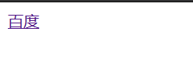

这样一来，我们只需要点击一下百度，我们就跳转成功到百度首页了。

现在我们来复习一下内联元素：

```
    <a href="https://www.baidu.com">百度</a>
    <a href="https://www.sogou.com">搜狗</a>
```


```

```

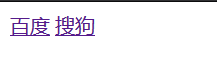

咦？为什么他们是并排显示？噢！a标签是内联元素啊，不换行的。


#### 2.b标签、strong标签、em标签、i标签

```
    <!-- b：关键词 -->
    <b>关键词</b>
    
    <!-- strong：表示非常重要的文本 -->
    <p>你对我<strong>非常重要</strong></p>
    
    <!-- em：强调 -->
    <p>今天<em>特别</em>热</p>
    
    <!-- i：外文词汇或科学相关的术语 -->
    <p>经过专家讨论，猫的英文词为<i>cat</i></p>
```

效果如下：


也许，你可以粗暴地理解如下：

**b元素和strong元素：加粗**

**i元素和em元素：倾斜**


#### 3.sup标签、sub标签

这两个标签是用来设置上标和下标的，当然必须是内联元素啦。

```
    <!-- 上标和下标 -->
    <p>2<sup>2</sup>=4</p>
    <p>H<sub>2</sub>O是水</p>
```
效果如下：
    <p>2<sup>2</sup>=4</p>
    <p>H<sub>2</sub>O是水</p>


#### 4.ruby标签搞定拼音

这个ruby标签只需要了解下就OK，毕竟还挺好玩的，虽然记忆困难

```
    <!-- 添加拼音 -->
    <p>
        <ruby>
            黄<rp>(</rp><rt>Huáng</rt><rp>)</rp>
        </ruby> 
    </p>
```

效果如下：


#### 5.del标签、u标签、mark标签

```
    <!-- del：删除 -->
    <p><del>这句话当我没说过</del></p>
    
    <!-- u：下划线 -->
    <p><u>这句话需要标记一下</u></p>
    
    <!-- mark：黄色标记 -->
    <p><mark>这句话需要重点标记</mark></p>
```

效果如下：

<p><del>这句话当我没说过</del></p>

<p><u>这句话需要标记一下</u></p>

<p><mark>这句话需要重点标记</mark></p>

当然你所需要知道的是：del标签等同于s标签，u标签等同于ins标签

也许，你可以粗暴地理解如下：

**s元素和del元素：划线删除**

**u元素和ins元素：下划线**


#### 6.big标签、small标签

```
    <!-- big：放大,HTML5已经不支持big标签-->
    <p><big>这个大不大！</big></p>
    
    <!-- small：缩小 -->
    <p><small>瞧你跟个针似的！</small></p>
```

效果如下：

<p><big>这个大不大！</big></p>

<p><small>瞧你跟个针似的！</small></p>

注意：在HTML5标准中，big标签已经不支持了。


## 六.分组元素


#### 1.blockquote标签

这个标签是用来引用文本的，非自己原创

我们可以来两段代码进行对比：

```
    <!-- blockquote:引用 -->
    <p>
        这是一段来自别处的引用
    </p>

    <blockquote>
        这是一段来自别处的引用
    </blockquote>
```
区别如下：

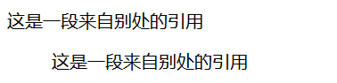

我们可以知道，blockquote下的文本多了一个缩进空格，代表是引用的文本。

但是我们引用文本是不是得标出引用的来处啊？

所以我们需要加入属性cite来象征出处

````
    <!-- blockquote的cite属性不发挥作用，只用来展示引用的地方 -->
    
    <blockquote cite="https://www.baidu.com">
        这是一段来自别处的引用
    </blockquote>
````

输出的结果没什么区别，但是源代码里面却可以查询到引用文本的出处


#### 2.dl标签、dt标签、dd标签用来做说明列表

这个知识适当了解即可

```
    <!-- dl: 术语列表框架-->
    <!-- dt: 编写列表名 -->
    <!-- dd: 术语解释，配合dt使用 -->
    
    <dl>
        <dt>钢铁侠</dt>
        <dd>纳米材料做成的钢铁衣服</dd>

        <dt>闪电侠</dt>
        <dd>被闪电击中变异的幸运儿</dd>
        <dd>还真挺幸运的</dd>
    </dl>
```

所以总结下来可得：dl创造说明列表的框架，dt作为子标题，dd为说明文本

来看看最终结果：

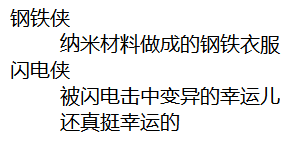

所以，这三个标签的配合使用就是做一个简单的说明列表。


####  3.div标签

div标签是今后中最重要的块级盒子元素，会经常用于做盒子模型

是一个最著名的块级元素，里面可以放任何东西

```
    <!-- div: 最经典的块级盒子元素 -->
    
    <div>
        <p>这里可以放任何东西</p>
        <a href="#">你点不动的超链接</a>
    </div>
```

效果如下：
<div>
<p>这里可以放任何东西</p>
<a href="#">你点不动的超链接</a>
</div>


### 3.hr单标签

与br标签一样，都是单标签就起作用

```

    <!-- hr: 单标签发挥作用，段落分隔线 -->
    <hr>
```

  效果如下：

    <hr>

#### 4.pre标签

适用于一些教学网站，想把源代码显示出来不起作用的那种

这个pre标签是提供代码块的框架，里面有许多标签可用，通用的就是code标签

```
    <!-- pre: 保留代码块的地方 -->
    
    <pre>
        <code>
            def main():
                a = Master()
                a.add_arg("添加数据")
            
            main()
        </code>
    </pre>
```


效果如图下：

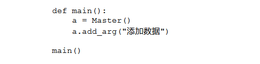

当然了，需要注意的是，支持代码块格式的不是只有code标签，还有var标签、samp标签、kdb标签等等


#### 5.figure标签提供示例框架

figure标签和figcaption标签是用来配合使用展现示例的

figcaption标签用来给示例起个标题

现在我直接一口气展示两个示例，中间用hr分割线

```
    <!-- figure,figcaption: 配合使用展现示例 -->
    
    <figure>
        <figcaption>这是一个图示</figcaption>
        
    </figure>

    <hr>

    <figure>
        <figcaption>这是一个代码块</figcaption>
        <pre>
            <code>
                def main():
                    a = Master()
                    a.add_arg("添加数据")
                
                main()
            </code>
        </pre>
    </figure>
```

我们可以看到这块代码，第一个figure展现了图示的框架，第二个figure展现了代码块的框架

效果图如下：

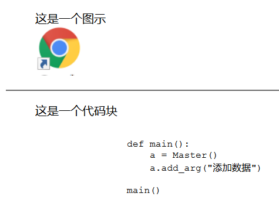

#### 6.li标签、ol标签、ul标签做专业的列表


li标签是列表项元素，是用来给列表选项命名的标签

我们需要弄懂ol和ul的区别：

**ol标签创建有序列表**

**ul标签创建无序列表**


①ul标签创无序列表

```
    <ul>
        <li>张三</li>
        <li>李四</li>
        <li>王五</li>
        <li>马六</li>
    </ul>
```


效果如下:

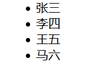


②ol标签创有序列表

```
    <ol>
        <li>杰克</li>
        <li>艾斯</li>
        <li>赛文</li>
        <li>雷欧</li>
        <li>初代</li>
    </ol>
```

效果如下：

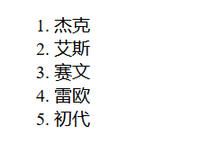


③ul标签和ol标签配合使用创嵌套列表

```
    <ul>
        <li>第一天</li>
            <ol>
                <li>写HTML5笔记</li>
                <li>复习HTTP协议</li>
            </ol>

        <li>第二天</li>
            <ol>
                <li>复习HTML5笔记</li>
                <li>写CSS3笔记</li>
                <li>结合起来做一个网页</li>
            </ol>

        <li>第三天</li>
            <ol>
                <li>实战一个网页</li>
            </ol>
    </ul>
```

效果如下:

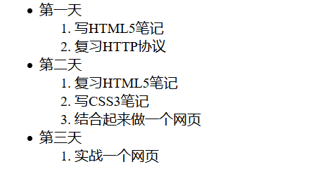

今后，我们会对这三个标签有一个比较高频率的使用。


## 七.划分元素

需要提前声明的是划分元素，并没有任何意义，也不会带来换行

但是对网页的布局规范却有极其重要的意义

#### 1.section

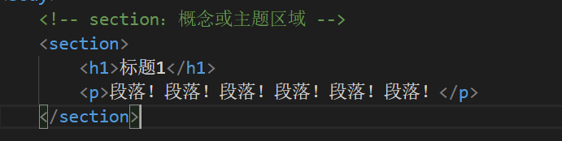

#### 2.header

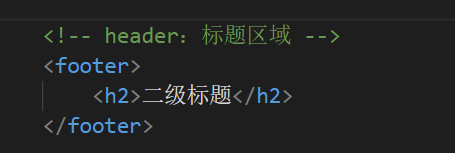

#### 3.footer

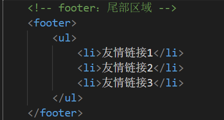

#### 4.hgroup

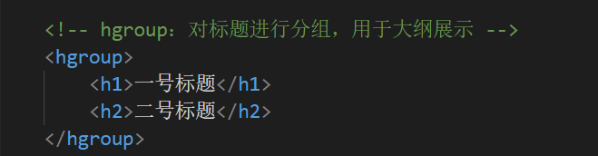


#### 5.nav

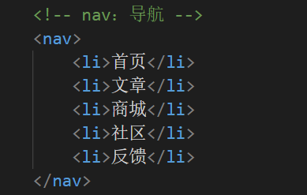


#### 6.article

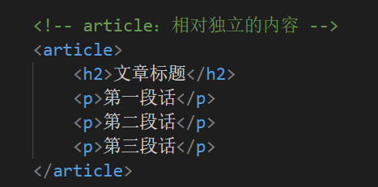

#### 7.aside

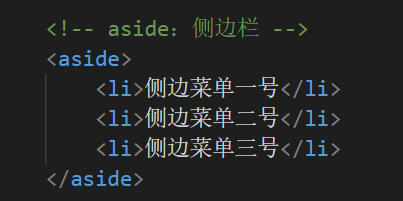

#### 8.address

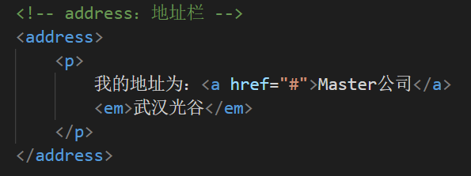


#### 9.details+summary

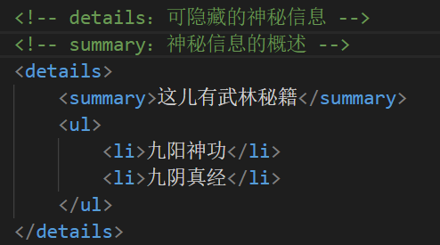

这个是比较有意思的一对元素，可以看看效果图

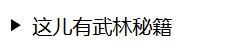

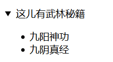


#### 10.今后布局指南

#### 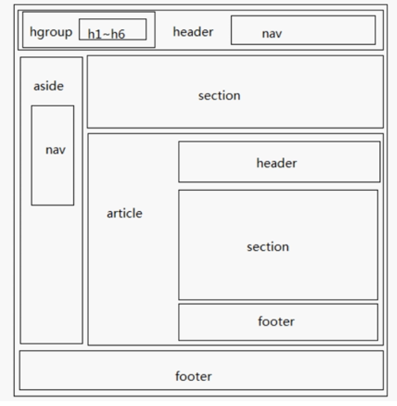

虽然这些元素并没有意义，但是当你看到这张图的时候，我希望你能明白它们的作用。

今后布局网页的时候，应当养成使用这些元素的习惯：

header+nav+aside+section+footer

使用这套组合去布好局你的网站吧！


## 八.多媒体元素

#### 1.img

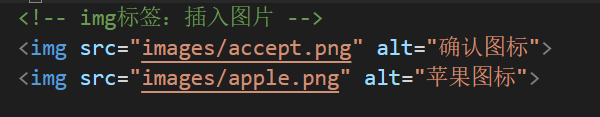

这是一个很简单的插入两张图片


咦？这两张图片怎么实并排显示的？

这充分说明了img是行内元素，没有换行功能。


#### 2.属性alt

你一定看到属性alt有文字描述，但是你还未发现它们的作用

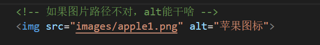

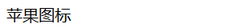

我们可以发现，图片路径不存在的时候网站会显示文字描述


#### 3._blank有啥用

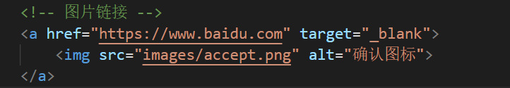

我们给图片设置了个链接，可以看明白，当我们点击图片的时候，我们会跳转到百度网页

但是target="_blank"究竟能带来什么呢？

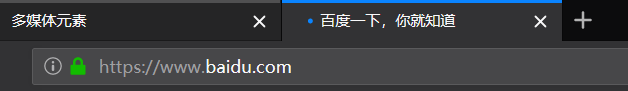

原来，当我点击链接的时候，会跳转到新的标签页去打开。


#### 4.video

HTML5不光支持插入图片，还支持插入视频

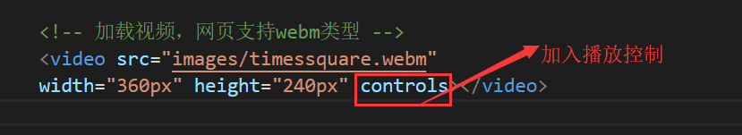

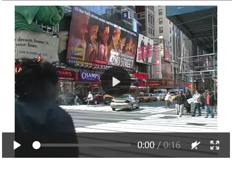

当然，你可以不加入这个controls属性，但是你只会看到这个，无法控制播放


#### 5.自动播放

当然了，你如果有一些小视频，迫不及待让用户直接看到，抓到机会的时候

你可以加入两个属性，能够在用户访问网站的时候，直接自动播放

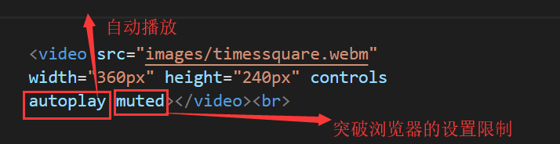

注意，这个muted属性，是为了除掉限制，毕竟有些浏览器的设置里面会有，不允许自动播放视频或音频。


#### 6.贴心预加载

这个已经是各大网页的共识了，

就是在用户进去之时或者暂停的时候，会继续加载后面的视频

照顾一些网络不好的用户

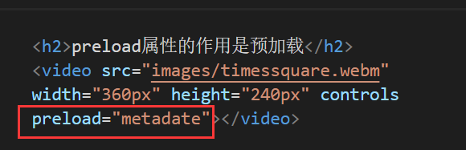


#### 7.视频标题党

我们肯定很熟悉这个现象，就是有太多视频的封面故意放一些诱惑性的图片，

诱导你进去播放，所以我们也要学会做标题党

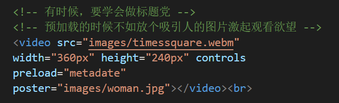


咳咳，看看到底是谁狠，标题党任性。


#### 8.浏览器兼容

这个终究是我们每个开发者需要考虑的实际问题

那就是全世界的用户有不同的浏览器

但是这个浏览器的对视频格式的兼容支持又不一样

比如这个浏览器只能播放webm，那个浏览器只能播放mp4

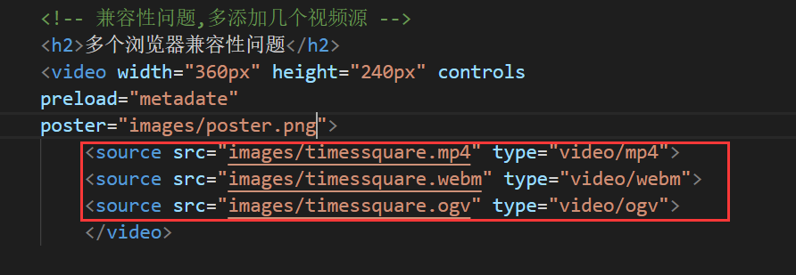

使用source元素进行加载多个资源的链接，确保兼容性


## 九.HTML字符实体

我们常常会遇到这种烦恼，我想打一些字符，却被识别为代码隐藏起来，要么就是打不出来

如果我想要真正地把字符给显示出来，应该接触到字符的实体名称和实体编号

比如我想显示人民币单位啊版权单位啊注册商标啊这些字符等等

以下是字符实体，图片来源于w3c：

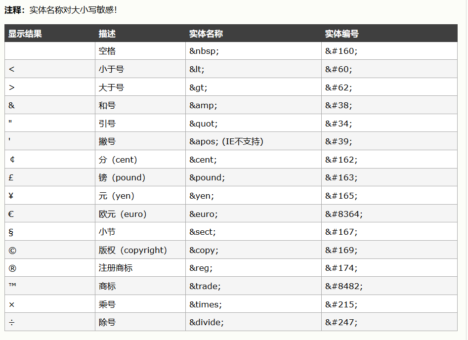

来看看简单的代码吧，加深印象:

```
    <p>人民币：&#165;</p>
    <p>版权：&copy;  </p>
    <p> 5 &lt; 8    </p>
```

输出的效果如下：
    <p>人民币：&#165;</p>
    <p>版权：&copy;  </p>
    <p> 5 &lt; 8    </p>

## 十.元素使用原则


#### 1.元素小写

只有第一行声明html的时候，DOCTYPE需要大写。

其余的所有元素统一小写


#### 2.属性：空格，双引号

属性与属性之间用空格隔开，属性值统一用双引号

正确示例：

```
<p id="master" class="paopao">哈哈</p>
```


#### 3.注释只在最必要的时候才添加

前端代码里的注释与传统语言上的注释是不一样的

为了前端代码的性能，请尽量不要滥加注释，只有在必要的时候注释


#### 4.风格一致

选择section还是div？

一个页面的布局到底应该选择怎么样的风格呢？

如果你想让你的代码看起来更权威，让他人信服

不妨你布置页面的时候采用上面所学习到的划分元素

使用**nav+header+section+……+section+footer**这一套页面布置

等同于**导航栏+首部区域+主题区域+……+主题区域+尾部区域**的页面布置

在不确定内容区域的布置时，可以适当选择div来代替