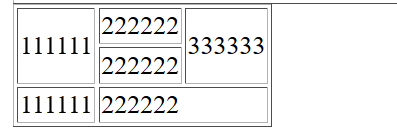
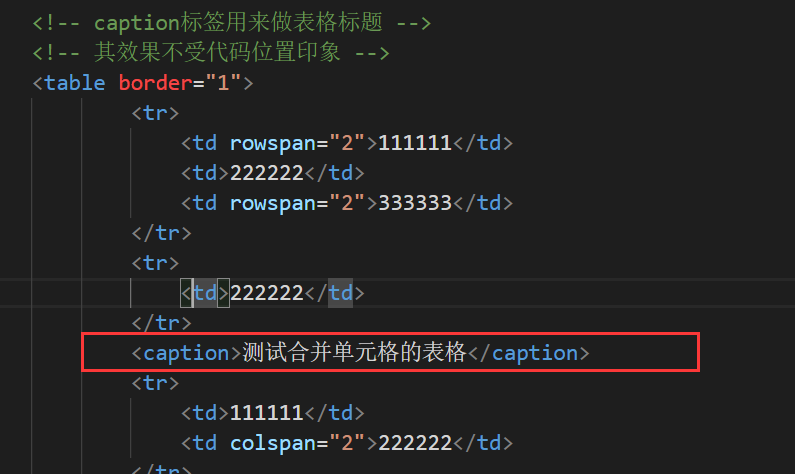
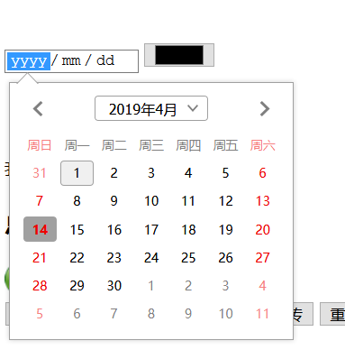
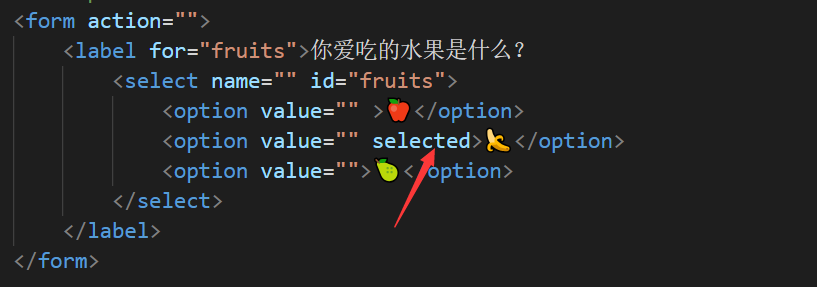

# 进一步学习更多HTML5基础

## 一.表格元素

#### 1.创建表格

熟练使用table、tr、td创造一个表格

实际效果图：

#### 2.表头单元格

实际效果图：

做一个更复杂的表格图：

效果图：

#### 3.表格布局

我们需要三个元素进行强制给表格

不再考虑表格的顺序

我们查看效果，看看是不是真的强制布局了

#### 4.表框

当然，上面这些表格你们都看不顺眼，因为总觉得是不是少了些什么

没错，表框没弄

我们只需要table传一个border属性

效果图：

#### 5.单元格的合并

请注意区别这四个单词的区别！

我们就简单地进行三次合并，并多处删除多余的单元格

效果图：

#### 6.表格的标题

这个标题很特殊，只会在表格上放生成标题

而且长度不超过表格的长度

## 二.表单元素

#### 1.打造一个简单的提交

重点，**form是必须要的**，如果只有一个button或input是不能完成提交的

当然我说过，这是最简单的途径，如果想要完善提交的话，需要补充一些属性

效果图：

#### 2.简单的用户登录

这个密码星型符号应该怎么弄呢？

这就需要了解到type="password"

#### 3.使用label关联文字

我们仔细思考一下上面的用户登录界面

用户和后面的输入栏，是不是两个独立的个体？我们并没有将两个关联起来

所以需要label-id进行关联起来

现在我们可以知道，文字和输入栏真的关联到一起了。

所以在今后编写input的时候，一定要养成label-id的关联，label用起来！！！

#### 4.自动聚焦

传一个属性autofocus就可以，当用户来到页面的时候，光标就会自动聚焦在输入栏上

这样用户可以直接键盘输入文字

#### 5.禁止表单 

也是一个技巧，属性disabled禁止输入

#### 6.强化学到的label知识

最终效果图：

#### 7.美化提交界面

使用fieldset布局一个提交块，然后配合上legend标签

最终效果图如下:

## 三.按钮元素

#### 1.做两个简单的按钮

注意type属性，submit是默认的按钮属性

reset就是重置的作用

最终效果图：

#### 2.强化input知识

强制用户输入，有长度的大小限制，还有贴心的提示

先看看最终的效果图吧

刚才我试了一下，确实只能输入10个字符，限制起了作用

当然，我们还可以输入年龄

年龄也有年龄的限制

注意，不再是minlength，maxlength，这两个是针对字符的

针对数字限制你直接用min和max限制，99岁就是最大年龄限制了

最终效果图：

#### 3.做个简单的滑轮

效果图：

#### 4.简单的表单列表

我们在前面，是不是接触过专门用来做列表的select元素

现在我说一个也挺常见的假列表，效果类似于记忆栏

使用datalist+option做一个假列表

效果如下：

看到了么，类似于历史输入的假列表，也是一个不错的选择。

正经列表肯定是要select+option来配合的

#### 5.禁止与只读

这个还是要好好理解一下啊的

网站中我们常常遇到不同身份需要填的表单不一样，有些不需要填写

所以这个input就会被禁止

这些行为使用js来控制

#### 6.两种按钮的写法

这两种按钮的写法还是要好好了解的，因为后面会涉及到按钮动画

## 四.框框与更多输入

#### 1.简单的复选框

想不到吧，还是input元素

属性改成checkbox就变成复选框了

效果如下：

#### 2.正经的多选题

效果如下：

#### 3.只能单选题

单选框的属性就是radio

其他的与复选框无区别

来看看效果图：

什么？？？为什么不是单选题？

**我们在设置一道单选题的时候，需要把所有选项统一到同一个题目里**

所以，需要优化代码

现在来看看，就是一个美滋滋的真~单选题了

#### 4.更多input属性

input的type还有email、tel、url等等

而且支持规范输入

查看效果：

当然，可不止这些，还有日期输入，颜色输入

效果如下：

#### 5.input也可以上传

直接设置属性为file，可以上传文件

## 五.更多墨迹的知识

#### 1.required必填

我们在设置input输入栏的时候，我们希望强制用户输入这个信息，只需要传递个require属性

我们在效果图中尝试直接提交

设置的必填属性，无法让我们直接提交

这个属性应用非常广泛，你注册的时候是不是都是必须要填的?

#### 2.正则验证

虽然我们搞定了一个提交笔记表单

但是用户输入的对不对，这个是不是也需要考虑？

否则让用户乱输入成为脏数据就不对了

所以就需要正则验证检查用户的规范

比如邮箱的输入必须输入带@qq.com的

我们在效果图中尝试输入：

我们输入错误的格式的时候，是不是不允许提交？

#### 3.强化select+option

很有必要复习一下这个经典的知识

如何做一个正经的列表：

来看看效果图：

当然，值得一提的是selected属性，就是默认的选项。

#### 4.经典的淘宝评论框

啊哈哈哈哈，淘宝的评论框怎么弄出来的？

就是textarea属性，定义好行数和列数

效果图：

