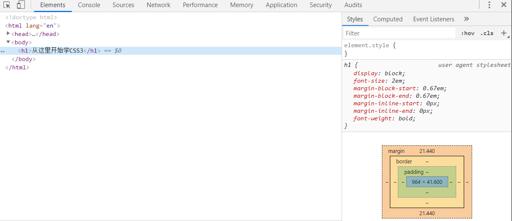
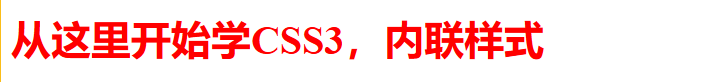
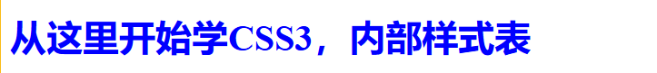
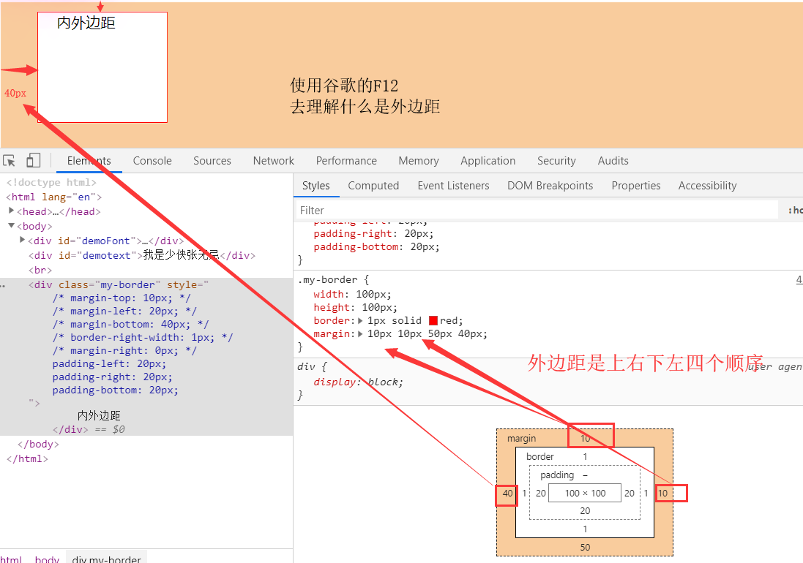
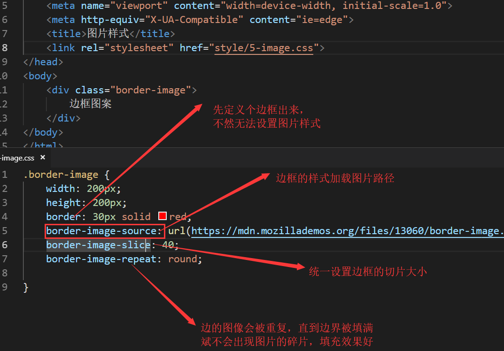
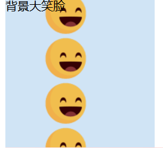

# CSS3是网页的美容师


## 一.CSS的概念与历史


#### 1）.CSS的概念

CSS是一种用于向用户指定文档如何呈现的语言，它们如何被指定样式、布局等。

HTML5用于定义内容的结构和语义，CSS用于设计风格和布局。

#### 层叠样式表

英语：Cascading Style Sheets，简写为CSS，又成串样式列表等，

CSS3现在已被大部分现代浏览器支持，而下一版SCC4仍在开发中。


#### 2）.CSS的历史


#### 1.CSS1（1994-1996）

支持字体的大小、字形、强调、字体颜色、背景颜色等等

还支持边缘、围框和其他关于排版的元素


#### 2.CSS2 （1998）

绝对的、相对的和固定的定比特素、媒体型的概念

双向文件

新的字体


#### 3.CSS3 （1999-如今）

增加了不少功能，也支持动画

部分属性根据浏览器的支持程度的不用，需要加上前缀来区分


#### 4.CSS4 （2011-设计中）

CSS4预计会增加一些更方便的选择器，并简化一些现有选择器的用法


## 二.CSS的原理与应用方式


#### 1.CSS的原理

当浏览器显示文档时，它必须将文档的内容与其样式信息结合。分两个阶段：

①浏览器将HTML和CSS转化为DOM(文档对象模型),DOM在计算机内存中表示文档，将其样式结合

②浏览器显示DOM的内容


#### 2.CSS应用到HTML文档

CSS有三种应用方式：

①外部样式表：<link rel="stylesheet" href="style.css">

②内部样式表：CSS放置在<style>元素

③内联样式：仅影响一个元素的CSS声明，标签内的属性style


## 三.在chrome浏览器上的调试

首先我们现撸出这样的一个代码

```
<!DOCTYPE html>
<html lang="en">
<head>
    <meta charset="UTF-8">
    <meta name="viewport" content="width=device-width, initial-scale=1.0">
    <meta http-equiv="X-UA-Compatible" content="ie=edge">
    <title>CSS3导学</title>
</head>
<body>
    <h1>从这里开始学CSS3</h1>
    
</body>
</html>
```

看到的页面是这样的：


然后我们进入谷歌的F12调试工具-开发者工具

点击这一行h1的代码：



我们可以观察刀右边是不是有样式设计工具？

那么我们通过开发者工具来进行改动，**注意，所有的改动都是临时的**，但是可以拷贝改动后的代码进行应用


就输入最简单的颜色样式吧，color：red，改成红色：


但是，相信我，前端的开发终会有依赖谷歌浏览器的一天，那么如何复制调试后的代码呢，进行应用更改呢？

**右键 --> copy --> copy elements**


通过上面的教学，希望能够了解到chrome浏览器开发者工具的使用方法。


## 四.CSS的三种应用方式详解


#### 1.内联样式

就是在标签里面定义style，改变样式




#### 2.内部样式表

把样式设计放到代码上方的head标签内

因为浏览器是从上到下加载的，所以会先加载样式再显示结构




#### 3.外部样式表

一种最为广泛的引用样式表方式，就是把CSS样式表放在外部文件，用link来引用


## 五.KV编程论：盒模型


**核心布局就是使用盒子模型**

把网页想象成多个模块，每个模块都是一个盒子

盒子 = box ，边框 = border，内边距 = padding，外边距 = margin


最直观的感受如下，一共两张图：


也许我们在前面基础的CSS中，其实我们可以看到，定义的样式是使用了K=V

例子：color: red；  ---->  不就是k = v编程论吗？


## 六.选择器的多种格式

我们在内部样式表和外部样式表的时候，我们已经接触过了选择器

**定位到id属性的标签：使用#选择**

**定位到class属性的标签：使用.选择**


#### 1.简单选择器

最简单的选择器，直接通过元素或属性来

简单选择器：通过元素类型、class或id匹配一个或多个元素。 例如 p {} 选择所有p元素。


---

#### 2.属性选择器

属性选择器：通过属性/属性值匹配一个或多个元素。例如#aaa {} 选择id属性为aa的所有元素。

①属性class选择器


②属性id选择器

**注意：id是具有唯一性的。一个html文件里面任意两个id值都不得相同。除非调用相同的对象。**


③通用选择器 ->* { }

**重要提示**：使用通用选择时小心。因为它适用于所有的元素，在大型网页利用它可能对性能有明显的影响：网页可能显示比预期要慢。大多数情况下，你都不会使用这个选择器。

---

#### 3.伪类和伪元素

伪类：匹配处于确定状态的一个或多个元素，比如被鼠标指针悬停的元素。

伪元素：匹配处于相关的确定位置的一个或多个元素，例如每个段落的第一个字。

---

#### 4.组合选择器

有效方式组合两个或更多的选择器用于非常特定的选择的方法。

---

#### 5.多重选择器

这些也不是单独的选择器。

这个思路是将以逗号分隔开的多个选择器放在一个CSS规则下面，

将一组声明应用于由这些选择器选择的所有元素。

---

#### 6.更多属性选择器

在上面，我们接触的属性只有两个，id和class

但是在实际中，我们会去自定义属性，并不去依赖id或class，

这个时候，我们应该怎么做呢？匹配的符号又是什么？

这个属性选择器就叫**存在和值属性选择器**

使用的选择符号是**中括号[ ]**


在样式表那张图中，第一行选择到了六个列表项，全部染为绿色，中间两个没选择到。

第二行选择到了最后两行，将背景颜色改成了金黄色。

最后一行选择到了Red pepper，改变它的颜色成红色。


这些就是自定义属性的选择器方法，以下是公式：

`[attr]`：该选择器选择包含 attr 属性的所有元素，不论 attr 的值为何。

`[attr=val]`：该选择器仅选择 attr 属性被赋值为 val 的所有元素。

`[attr~=val]`：该选择器仅选择具有 attr 属性的元素，而且要求 `val` 值是 `attr` 值包含的被空格分隔的取值列表里中的一个。

---

#### 7.选择器参考手册

http://www.w3school.com.cn/cssref/css_selectors.asp

下面的选取的一些内容值得注意:


## 七.颜色、边框与背景

设计盒子三个重要的组成部分：

**颜色color+边框border+背景background**


#### 1.颜色color

用途：边框，背景，文字

①十六进制颜色：

使用三个双位数来编写，并以#符号开头

比如：#0000ff显示为蓝色

②RGB颜色：

red，green，blue，运用三个参数而定义颜色的强度

可以是介于0与255之间的整数或者百分比值

例子：RGB(255,0,0)

③RGBA颜色：

是RGB颜色值的扩展，带有一个alpha通道-规定了对象的不透明度

alpha参数是介于0.0与1.0之间的数字

例子：RGBA(255，0，0，0.5)

④HSL颜色：

是指hue(色调)、saturation(饱和度)、lightness(亮度)，表示颜色柱面坐标表示法

例子HSL(120，65%，75%)

⑤HSLA颜色：

与上面RGB和RGBA的关系一样，HSLA是HSL颜色值的拓展

带有一个alpha通道-规定了对象的不透明度


颜色代码网站：https://rgbcolorcode.com/，这个可能访问的不太顺利

那还是来一波w3c的颜色网站吧：http://www.w3school.com.cn/cssref/css_colors.asp


#### 2.边框border

首先分享一个让人看哭的border设计网站：

https://html-css-js.com/css/generator/border-outline/

有了这个网站，那还敲个屁代码，直接先在这个网站设计好，直接复制代码就完事！

首先设计好边框：


然后使用这个use this，生成代码：


接下来就可以将HTML代码和CSS代码拷贝到编辑器里面了


我们来看看最终的输出结果：


咦？为什么和网站展现出来的不一样呢？也许网站展现的时候自动自定义了div样式，所以我们需要手动定义长和宽：


来看看展现效果:


咦？为什么文字这么不舒服！！不应该在正中间吗？？

所以，下一步，我们需要控制到这段文字，必然要将这段文字放入p标签内：


然后使用后代选择器，选择到这个p元素，进行位置的控制：


最终的输出结果总算是勉强能看了！


但是，这个直接提交是不行的，我们需要彻底确定这个团的整体盒子到底是什么，需要标识出来

所以我们需要使用到outline，进行对盒子的包裹

点击此网站的outline，设置到包裹线：


我们来看看最终的结果：


这样，我们就能清晰的看见外部包裹曲线的状况。

---

当然，这个网站除了这个边框设计之外，还有盒子阴影也可以设计，也就是box shadow

https://html-css-js.com/css/generator/box-shadow/


现在我们就做一个简单的阴影案例：


还是一样的，link要会用，拷贝过来的div盒子也需要自定义大小，然后我们看看最终的效果：


怎么样，是不是很炫酷？

等下，我们有没有注意到一个地方：


这个box-shadow为什么会有前缀，-webkit-？有什么作用呢？


#### 3.背景blackground

同样，我们还是需要用到这个神仙网站：

https://html-css-js.com去进行背景的设计

当然，其实也不需要，我们只需要知道有个属性是backgroud就可以

我们就那上面的阴影案例，往css样式表加一句background设置背景颜色


no-repeat是不平铺的意思，该是什么大小就展示什么大小，类似属性还有如下：


这些也好理解，repeat是自动平铺，repeat-x是只往x方向进行平铺

好勒，我们就来看看最终的结果：


所谓的背景其实就是针对于盒子的背景而进行颜色改变的。


## 八.文本样式

#### 1.一些需要记忆的属性

color：文本颜色

direction：文本方向

line-height：设置行高

text-align：文本对齐方式

text-shadow：文本阴影

font-family：设置字体系列

font-size：设置字体大小

font-style：设置字体风格


#### 2.最好用的还是网站

https://html-css-js.com/css/generator/font/


当然了，我们注意到这个网站也有字体阴影的东西，也可以复制代码上去查看效果：


#### 3.内边距和外边距

内边距：padding

外边距：margin

根据传值的个数而设置的顺序有所不同：

两个值：上下，左右

三个值：上，左右，下

**四个值：上、右、下、左**


①使用谷歌浏览器理解**什么是外边距**



---

②使用谷歌去理解**什么是内边距**

注意，内边距是针对到哪儿的距离？请看图思考


但是我们发现一个奇妙的现象，就是我们div的盒子不是100px*100px;吗，为什么这个图好像变得更高了

其实呀，我们的div一直都没变……一直处于中间呢！


一直改变的是border的线框盒子，我们定义内边距的距离的时候，是可以影响到border线框的布局的。

**当内边距为0的时候，div盒子大小就等于border线框盒子的大小**

**当内边距不为0的时候，线框border的宽高必然增大，将div盒子包裹在里面**

当然，不能考虑进去线框本身的粗度。


## 九.背景样式


#### 1.一些需要记忆的属性

background-attachment： 背景图像是否固定或者随着页面的其余部分滚动。 
background-color：           设置元素的背景颜色。                         
background-image：         把图像设置为背景。                           
background-position：      设置背景图像的起始位置。                     
background-repeat：        设置背景图像是否及如何重复。                 


#### 2.边框样式的设计

就是给边框改成图片样式，这次我们使用网络图片进行讲解

border-image-repaet：round，边的图象会被重复，直到边界被填满，不会出现碎片

border-image--slice：设置所需大小的切片



最终效果如下：


#### 3.背景大笑脸

我们通过这个案例来**加深理解repeat平铺的作用**

还是老套路，先定义个盒子


然后用上repeat-x这个水平平铺的属性，也就是说，在整个盒子的空间，图片水平平铺填满

看看最终效果如下：


如果改成repeat-y呢，那就是垂直平铺整个盒子：



如果是repeat属性呢？那就是整个盒子空间都用这个图片铺满：


所以，根据这小节的内容，我们对repeat、no-repeat、repeat-x、repeat-y四个属性的作用有所了解。


#### 4.背景大图

一个不错的随机生成背景大图网站：

https://source.unsplash.com/random

现在随机到了一张不错的大图，继续老套路，定义一个div盒子


当然了，如果我定义的div盒子大小超过了网络图片的大小，比如把height改大一点，改成800px；然后引入背景颜色属性


咦？？？不对啊？？下面的部分不应该显示绿色了吗？为啥又来一遍平铺

通过这个问题，我们可以知道：**背景图片引用的平铺属性默认是repeat，需要手动输入no-repeat关掉平铺**


这样一来，也许我们能更加理解平铺了。


#### 5.网页固定背景

我们常常接触到那些炫酷的网站，不管我们怎么滚动图片，背景始终没变

这个时候，用到的属性自然是**background-attachment: fixed;**

但是我们应该怎么设计网页固定背景呢？抓取的什么属性？

整个网页的背景都是固定的，那岂不是要抓取body标签么？


来看看最终展现效果，随便滑轮：

