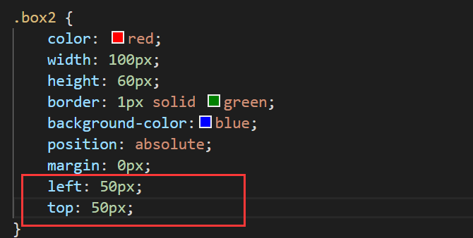
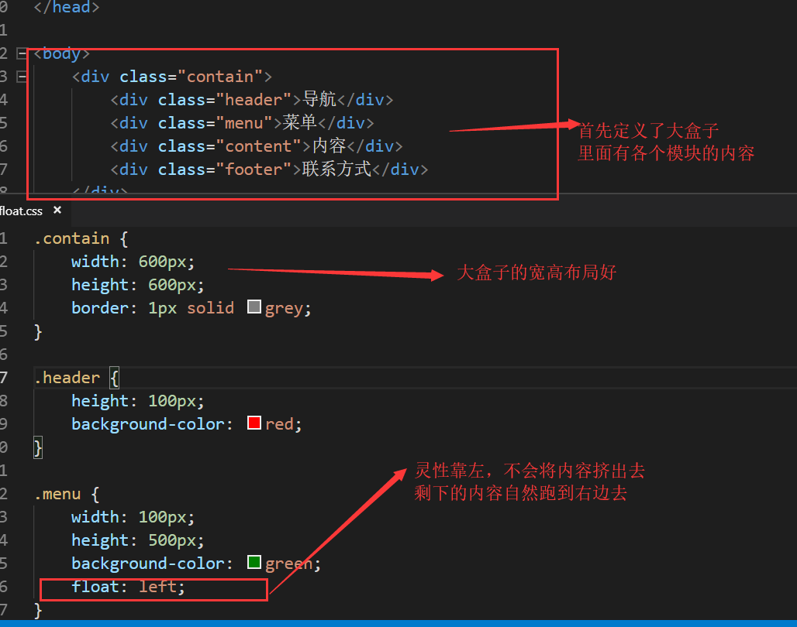
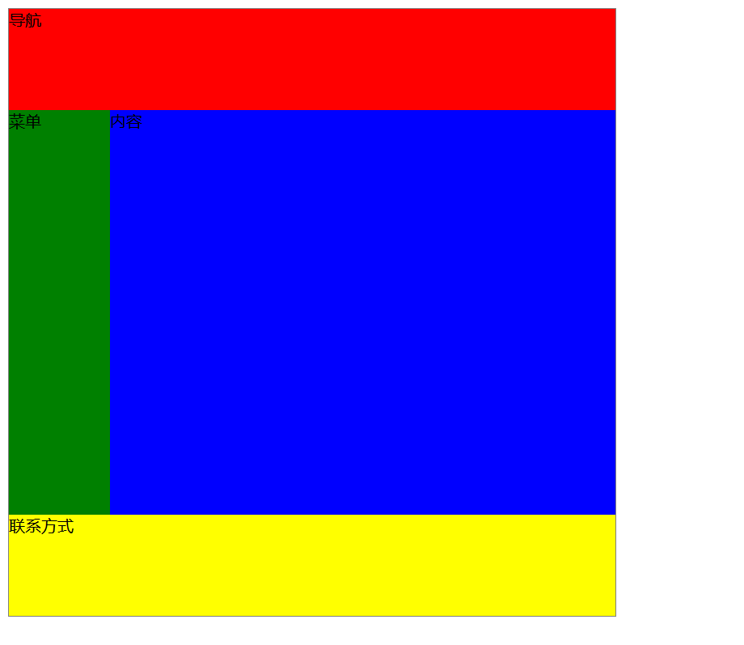
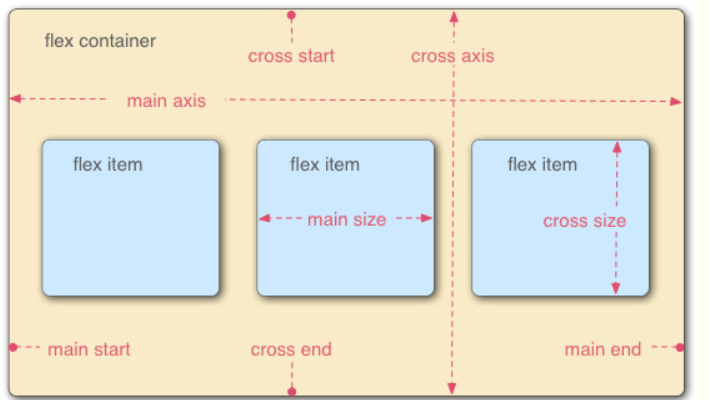
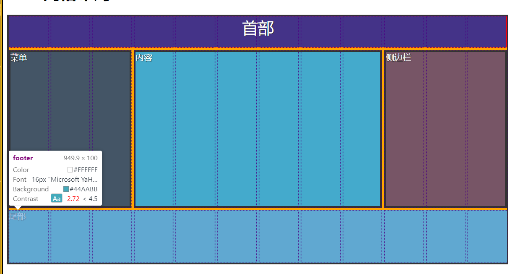
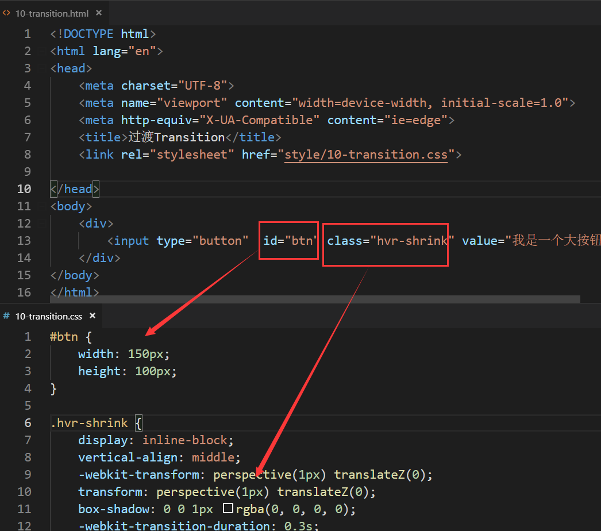

# 自定义网页布局


## 一.position定位

首先，我们需要定义三块区域，来更好地理解position定位


我们可以看到第二段话的p元素，被包含在了div标签内，这是用来帮助学习下面的参照物。

来看看最终的结果：


这三个盒子没什么区别，应该很好理解了，就再放一张图，进一步理解p真正的盒子是什么


注意，p真正的盒子大小是图中选中的那样，这是因为我们使用了内边距，外边的border自然会变大

*所以，我在这儿留下一个思考题，我在上面图中红框圈出来的整个盒子*

*真实的宽度是多少？真实的高度又是多少？*

*如果你正在看我的笔记，请你在评论区进行作答*


#### 1.relative

现在，我们来到relative，这个是相对定位的意思

我们就拿第一个p盒子来举例子，赋予它一个class属性为box1


top是向下移动50px；left是向右移动50px；采用relative相对定位，看看发生了什么


看，位置1的盒子果然发生了变化，这是一个怎么样的变化，我们可以分析到：

**relative的变化是针对于原来的位置进行变动，这就叫基于文档流的相对定位**

这句话不难理解吧？就是说，是相对于原来HTML5布置的位置进行相对移动的


#### 2.absolute

接下来，absolute就更好理解了，这是绝对定位，直接针对于网页

不妨我先放出概念：

**position的变化是针对于网页来进行变动，这叫脱离文档流的绝对定位**

废话不多说，就针对位置3盒子进行操作吧


来看看最终的结果，你们就懂了


懂了吗？

**relative是基于文档流的相对定位**

**position是基于网页脱离文档流的绝对定位**


#### 3.子绝父相

其实上面我所说的都不是正确的应用，position真正的应用还是在于子绝父相

子绝父相是什么意思呢？父元素采用相对定位，子元素采用绝对定位

有人就会问了，子元素采用绝对定位?那岂不是乱套了？

注意！！！请注意我说的**父元素与子元素**

有没有想过：

子元素的绝对定位是不是只能在父元素的空间里面来绝对定位？

父元素的相对定位是响应于网页的布局?

这就是子绝父相的由来。

就拿淘宝来说：


我红框标出来的是不是相当于几个区域？

这些区域能不能理解成一个大盒子？采用相对定位来响应网页的布局？

那么大盒子的里面的元素该怎么任意布置呢，采用绝对定位在里面更好的布局？

我这么解释一来，希望能够更好地帮助你理解子绝父相。

首先我们就用代码来好好理解以下，为了更好的理解

我已经将margin，padding全部变为0：


这是一个纯粹的初始位置，在设置外边距为0的情况下。

现在我们就来验证子元素的绝对定位是不是针对于这个父元素的盒子里：



来看看最终结果：


这样一来，我是不是通俗清晰地解释了子绝父相的作用？

好好理解这一点，今后将频繁使用这一知识点。


## 二.float布局

#### 1.简单的布局

float布局能够让我们在一个盒子里面控制各个组件布局的灵活性



来查看一下最终的效果吧:


现在我们就把程序给完善一下，完成整个页面的布局


查看效果如下：



#### 2.复杂的布局

但是，这样布局还是太简单了，我们需要弄难一点，加入两段话加深对float的理解

所以把蓝色的区域重新划分下


现在，我们需要做的就是将这两段话进行float布局，一个分到左边，一个分到右边

不过你们可能注意到了，为什么要把这两段话分别放到两个div盒子呢？

而且每一段话的文字也并非都处于同一个标签

这就是接下来我们要接触的复杂选择器：


看到了吗?我们使用了类似后代选择器的东西，

然后选择到了两个div盒子，将里面的内容统一进行流动布局。

.content div:nth-of-type(1){}  : 是选择第一个div盒子。


## 三.flexbox布局

flexbox布局旨在解决对齐方式，排列方向，排列顺序。



#### 1.属性

display:flex：启动弹性布局

flex是Flexible Box的缩写，意为"弹性布局"，用来为盒状模型提供最大的灵活性。

---

flex-direction：改变主轴方向

属性可选值的范围为:

row(默认)沿水平主轴由左向右排列、row-reverse沿水平主轴由右向左排列，

column沿垂直主轴由上到下、column-reverse沿垂直主轴由下到上。

---

**justify-content：控制flex项（flex item）在主轴（main axis）的对齐方式**

- flex-start：在主轴由左或者上开始排列

- flex-end：在主轴由右或者下开始排列

- center：在主轴居中排列

- space-between：在主轴左右两端或者上下两端开始排列

- space-around：每个项目两侧的间隔相等。所以，项目之间的间隔比项目与边框的间隔大一倍。

---

**align-items：控制flex项（flex item）在交叉轴（cross axis）的对齐方式**

这个直接上图，更好理解

- flex-start


- flex-end


- center


- stretch


- baseline


#### 2.优点

容器自己决定如何均匀分配它的子元素-包括元素的大小和相互之间的间隔

自动调整子元素的高和宽，来很好的填充任何不同屏幕大小的显示设备

适用于应用组件和小比例布局

弹性页面沿着主轴从左到右排列


align-self允许单独设置每个flex item(flex项的对齐方式)

flex-grow：初始值都是1，每个item的相对宽度


#### 3.网站游戏辅助练习

https://flexboxfroggy.com/#zh-cn

完成这个游戏吧！快速了解到弹性布局！

第一关，简单！


使用justify-content：flex-end; 

将青蛙这个flex项移动到最右边去，完成闯关

第四关：


将三个青蛙最大程度的并排间隔开来，当然，x轴的改变依旧是使用justify-content

我们需要用上justify-content : space-between; 让三个青蛙最大限度的x轴排列开来了

完成闯关


#### 4.网站博客辅助学习

https://www.w3cplus.com/blog/tags/157.html

都是一些高阶布局，好好看！好好学！

https://hufan-akari.github.io/solved-by-flexbox/

这是神仙网站！！学习flexbox必备！！！


#### 5.接下来，写代码！

首先我们快速定义好几个盒子，作为弹性布局的准备


然后就准备起飞吧，正式应用flexbox布局！

这儿是CSS3样式表代码：

```
header,footer {
    height: 60px;
    background: #438;
    color: blue;
    text-align: center;
    border: 1px solid red;
}

footer {
    background: #4ab;
}

section div {
    border: 3px solid #333;

}

section {
    height: 300px;
    background: rgb(167, 228, 25);
    display: flex;
}

div {
    background: orange;
    margin: 10px;
    text-shadow: 2px 2px 0 #bcbcbc, 4px 4px 0 #9c9c9c, 15px 13px 2px rgba(28, 110, 164, 0);
    color: #000000;
}
```


首先定义好大概的布局，现在是轮到flexbox弹性布局表演上场的时间了

先将存放三个div的地方，应用上flex，变成flexbox弹性布局的区域


依旧选择了类似于后代选择器的语法，将第一个盒子和最后一个盒子定义为简单的1，第二个div就定义为3


这就是最终的效果，记住，这儿的1和3只是相对数字，这也是flexbox的优点，如果我把第二个盒子flex值改成8？


看看变化效果：


相对宽度是不是变了？这就是flexbox的优势，能够灵活弹性布局。


## 四.grid网格系统


#### 1.基本概念

两个核心的组成部分是wrapper（父元素）和items（子元素）

实际上，应该用白话解释:

wrapper是实际的grid（网格)，items是grid里的内容，正好也对应父元素于子元素

grid网格系统是二维的网格容器，我们需要定义行和列：

①grid-template-columns：100px 100px 100px;

②grid-template-rows：50px 50px;

这两个出来的效果会是怎么样的呢：两行三列，行和列网格大小不同

至于items子元素的大小，自然就用grid-column和grid-row属性

①grid-colunn：1/4;

②grid-row：2/5;


#### 2.网站游戏辅助练习

https://cssgridgarden.com/#zh-cn

第一关：


我们在grid属性的元素下创建子标签：


#### 3.敲代码，敲代码

首先定义好布局


先给五个区域命名好grid-area


定义好了这五个区域名称之后，就可以给大盒子进行应用grid布局了


不着急，最后网格的布局就要登场了，那就是关键的属性grid-template-areas

来完成区域的配置布局


这么一看，网格的布局是不是很简单？

来看看最终的效果吧


其实，你这样还是看不出来布局的原理的，这时候我们就打开F12调试工具看个究竟



看明白了吗？其实就是网格的叠加而产生的布局，这便就是grid布局的作用。

## 五.各种尺寸单位


#### 1.%、pt、px

%是百分比，根据原长度或页面来决定的分割

pt磅：1pt等于1/72英寸

px像素：计算机屏幕上的一个点单位


#### 2.em

1em等于当前的字体尺寸

2em等于当前字体尺寸的两倍

所以em具有相对性

例子：如果某元素以12pt显示，如果去设置成2em，那就是24pt显示

缺点：多层嵌套，计算麻烦，所以需要上rem

因为一个网页很多地方字大小不一样就会头疼


#### 3.rem

1rem等于根元素的字体大小

找到共同的祖先，计算方面

也就是说，根据整个网页的字体大小来走规范流程

来达到控制整个页面的字体大小规范


#### 4.vh

是视口有关系的百分比尺寸

1vh等于1/100的视口高度，这是自动调整

比如一个浏览器高度为900px；那么1vh就是9px;


#### 5.参考文章

https://github.com/simaQ/cssfun/issues/1


## 六.网页动画


#### 1.CSS3转换

核心语法是transform:[transform-function]*;

变形可以是一个，也可以是多个，用逗号间隔开

①2D


五种重要的2D转换方法：

- translate()
  - 通过 translate() 方法，元素从其当前位置**移动**，根据给定的 left（x 坐标） 和 top（y 坐标）。
  -  translate(50px,100px) 把元素从左侧移动 50 像素，从顶端移动 100 像素。
- rotate()
  - 通过 rotate() 方法，元素顺时针**旋转**给定的角度。允许负值，元素将逆时针旋转。
  - rotate(30deg) 把元素顺时针旋转 30 度。
- scale()
  - 通过 scale() 方法，元素的**尺寸**会增加或减少，根据给定的宽度（X 轴）和高度（Y 轴）。
  - 值 scale(2,4) 把宽度转换为原始尺寸的 2 倍，把高度转换为原始高度的 4 倍。
- skew()
  - 通过 skew() 方法，元素**翻转**给定的角度，根据给定的水平线（X 轴）和垂直线（Y 轴）。
  - skew(30deg,20deg) 围绕 X 轴把元素翻转 30 度，围绕 Y 轴翻转 20 度。
- matrix()
  - matrix() 方法把所有 2D 转换方法组合在一起。
  - matrix() 方法需要六个参数，包含数学函数，允许您：旋转、缩放、移动以及倾斜元素。

---

②3D

- rotateX()
  - 通过 rotateX() 方法，元素围绕其 X 轴以给定的度数进行旋转。
- rotateY()
  - 通过 rotateY() 方法，元素围绕其 Y 轴以给定的度数进行旋转。

3D的转换属性：


---

当然了，这样记可能是不太牢固的，同样有一个快速暴力的方法

那就是经典的网站html-css-js.com来练习，快速获取代码:

快速练习网站：

https://html-css-js.com/css/generator/transform/


#### 2.CSS3过渡

通过 CSS3，我们可以在不使用 Flash 动画或 JavaScript 的情况下，当元素从一种样式变换为另一种样式时为元素添加效果。

也就是说，我把鼠标放在上面，这个元素就会发生动画


现在我将鼠标放上去，发生了什么


这便是过渡动画的作用。

那么它如何工作？

CSS3 过渡是元素从一种样式逐渐改变为另一种的效果。

要实现这一点，必须规定两项内容：

- 规定您希望把效果添加到哪个 CSS 属性上
- 规定效果的时长

过渡属性一般来说一个就足够，其实还有四个更为详细的子属性：


说到这儿，我还是要放一个很硬核的网站，里面拥有超级全面的鼠标触发样式，克可供下载：

https://ianlunn.github.io/Hover/


这是一个非常牛B的网站，鼠标放上去之后有各种各样的过渡样式。

所以，要学会做大自然的搬运工，直接下载整套源码，并给作者一个star！


随便选择一个样式吧，比如 .hvr-icon-buzz-out

然后我们做一个大大的按钮

class要填上上面所需要的设计样式噢！


问题就来了，我已经引用了一个css外部文件样式表，我们该怎么定义按钮的样式呢？

难道要使用内部样式表？NONONO

再创键一个外部样式表，再来一个link就好啦！，

然后把那那个动画的CSS3源码放进去，然后再额外设置个id进行改变按钮样式



我们来看看最终的效果：


我把鼠标放上去之后，这个按钮变小了。这就过渡是动画样式的应用。

虽然说我们成功设计出了样式吗，但还是很有必要的去了解触发机制

伪类触发：

: hover --> 当鼠标悬浮在元素上方时,向元素添加样式。

: active --> 向被激活的元素添加样式。

: focus --> 向拥有键盘输入焦点的元素添加样式。

还有一对非常经典的伪类出发，就是点击连接之前，连接的样式是明蓝色

如果访问过链接之后呢，颜色是不是会变成暗紫色?


示例图：


完整伪类触发机制属性总结图：


#### 3.CSS3动画

动画的核心属性就是animation属性。

上面网站中有些复杂的过滤样式，其实也偷偷应用了动画

就挑一个复杂的过滤样式来截图


如需在 CSS3 中创建动画，您需要学习 @keyframes 规则。

@keyframes 规则用于创建动画。

在 @keyframes 中规定某项 CSS 样式，就能创建由当前样式逐渐改为新样式的动画效果。

详细的属性图：


我们所需要指导的一个核心的知识点，以前剪辑视频的时候，是不是要接触到关键帧？

同样，动画设计也是需要用到关键帧的。

这就是一个经典的关键帧代码布局


现在我们就做一个简单的动画


闪烁的动画就这么完成了。

这个时候，我们还是需要借助牛B的网站，去做动画

https://daneden.github.io/animate.css/

其实也不需要下载源码，因为幸运的是，这个网站被做成谷歌插件了

谷歌商城搜索animate playerbox进行下载


我只能说，谷歌浏览器是真的舒服。


如果要把动画应用到代码里面的话，其实用法非常简单

拷贝进去动画样式之后，再定义下class样式里面的正确公式是：

**animation : 动画的名字，动画的播放间隔， 后面就自定义属性。**

比如infinite就是无限的属性，无限播放动画

像这样:


补充：

我在使用这个时候，直接拷贝源码过来使用动画样式，发现不能直接拷贝

解决方案已经找到了

就是这源码有毒，直接拷贝过来是不能用的，需要自己加播放时间


多加这一句就可以了，让动画效果启动播放。

