# 来做一些有意思的CSS3案例吧！

## 一.旅行青蛙

#### 1.继承与非继承

①当元素的一个继承属性没有指定值时，则取父元素的同属性的计算值

②当元素的一个非继承属性没有指定值时，则取属性的初始值

#### 2.选择器优先级

永远都要记住：

内联样式是最高的，其次才是ID选择器

这样添加的内联样式

(
 )

( #master { color:green} )

请问，最后到底是红色还是绿色?

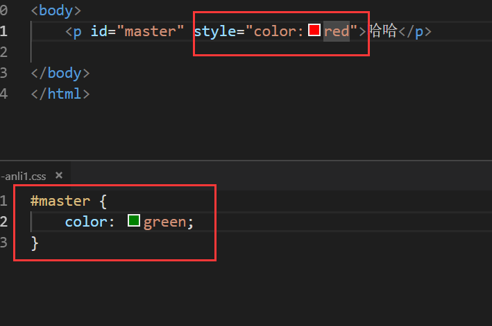

来看看最终效果：

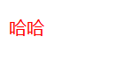

所以：

**内联样式总会覆盖任何外部样式表的任何样式，因此可看作是具有最高的优先级**

其次：

**在继承选择器类别来说，ID选择器优先级又是最高的，高于其他一切class选择器等等**

所以：

**内联样式 > id选择器 > 其他任何选择器**

如果想让一个元素固定样式为目标元素直接添加样式，永远比继承样式的优先级高

#### 3.编写规则

给某个元素编写CSS样式表的时候，需要按以下的顺序来布置，

顺序不对虽然不影响最终结果，但这起码是行内公认编写规范。

**位置属性、宽高大小、文字系列、背景设计、边框设计、其他**

尽量使用一个属性概括，比如padding、margin、animation等等

尽量不滥用id选择器，因为id名称唯一

为选择器加前缀，与适配浏览器和具体组件来定

#### 4.开发流程

大公司流程：需求-设计-审核-开发-测试

这些都是一个循环。

或者是小公司的是设计-标注-开发。

腾讯网站的页面前端标注工具：dorado

https://cdc.tencent.com/2010/12/01/%e4%b8%80%e7%a0%82%e4%b8%80%e4%b8%96%e7%95%8c%ef%bc%8c%e4%b8%80%e8%8a%b1%e4%b8%80%e5%a4%a9%e5%a0%82%ef%bc%9a%e5%be%ae%e5%9e%8b%e8%ae%be%e8%ae%a1%e4%b8%93%e7%94%a8%e5%b7%a5%e5%85%b7dorado/

在此网站进行下载。

用法：

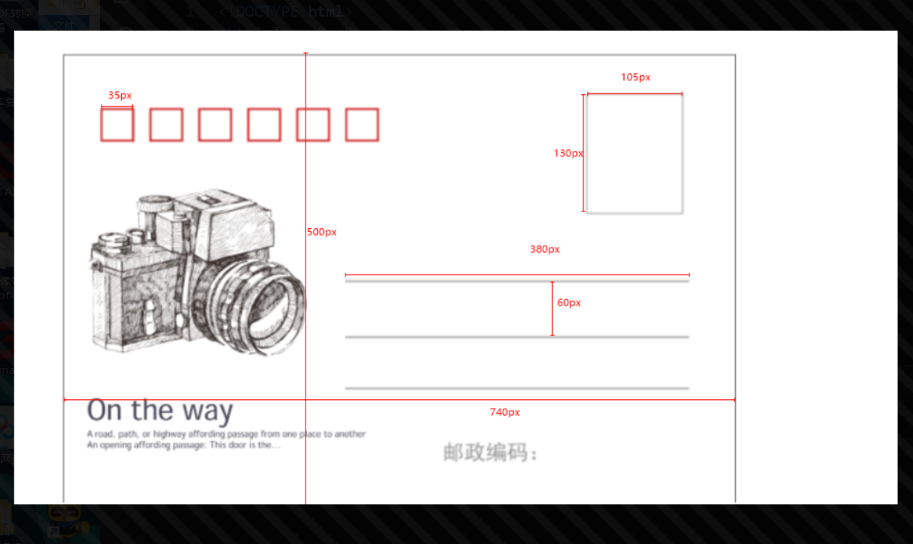

这样不就很清晰地把明信片的标注给标出来了。

#### 5.明信片设计

首先最重要的还是设计好正反面，然后将正反面的大小给对齐

最终效果图如下

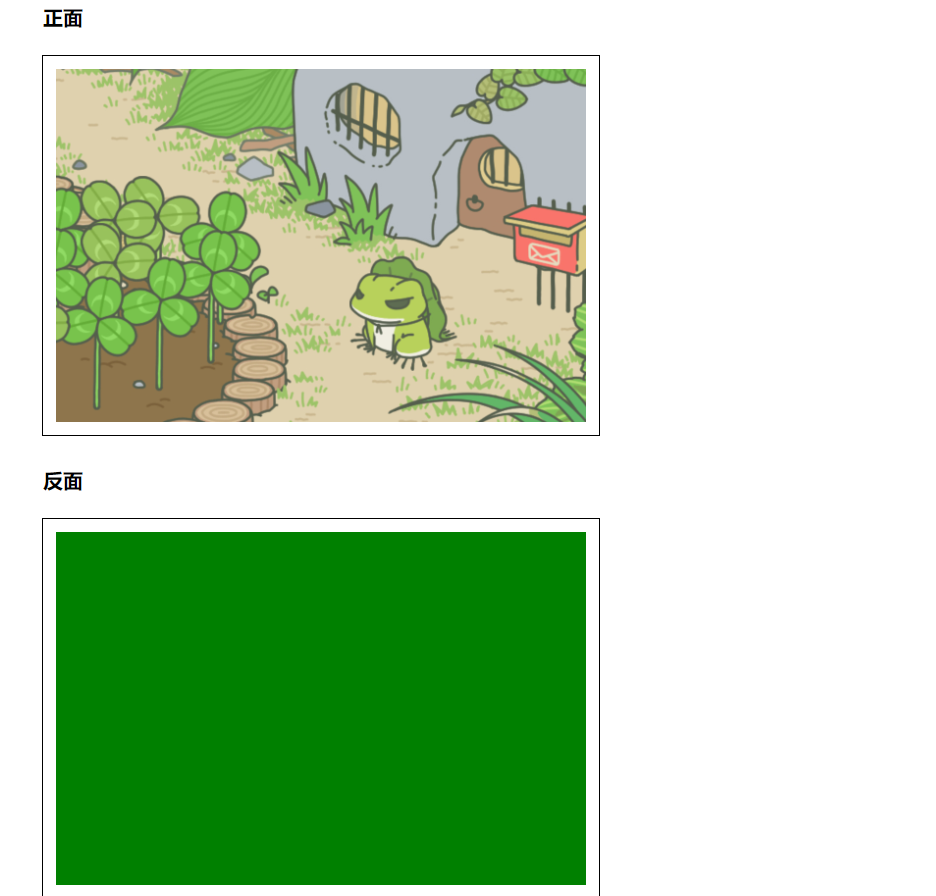

然后我们进一步放进去盒子，把明信片所有的元素放进去

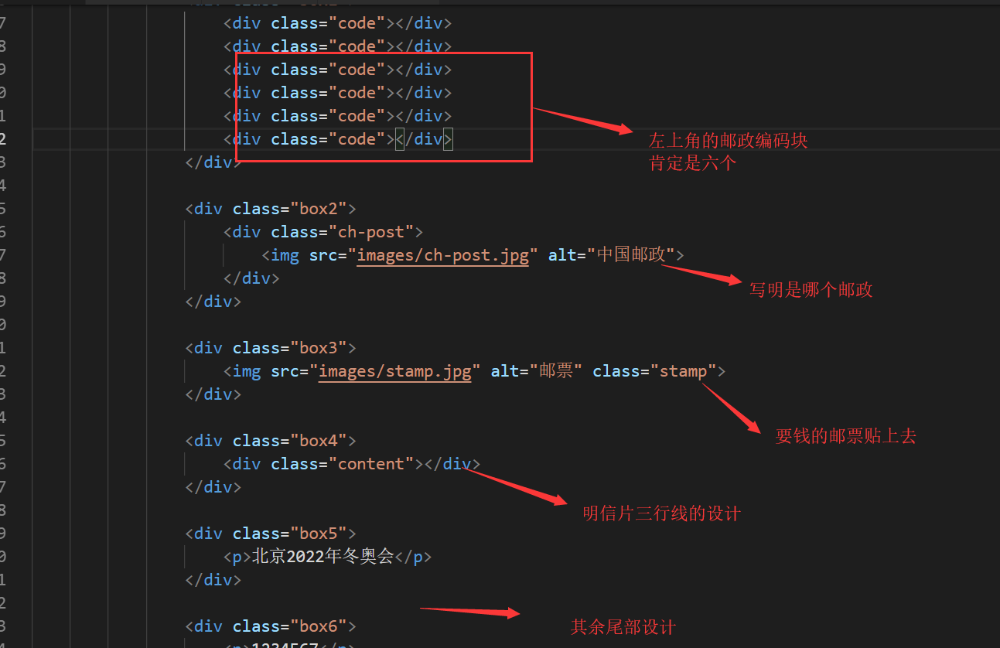

最终肯定是乱的，就需要慢慢设计了

我们这次就采用网格系统进行布局。

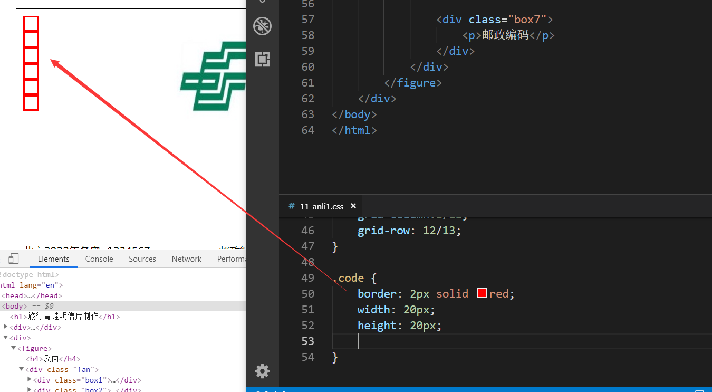

我们知道，HTML5是默认把块级元素从上到下排列的

这时候我们需要接触一个非常广泛使用的属性

**行内块元素 display:inline-block;**

就是说，你可以理解为，换行发生在同一行，所以会产生小间隔，强行排列在一行

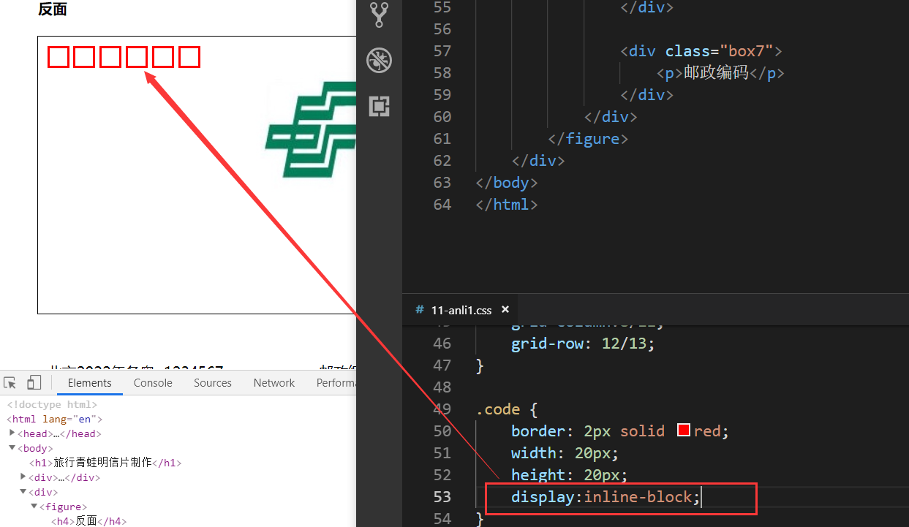

最终效果图：

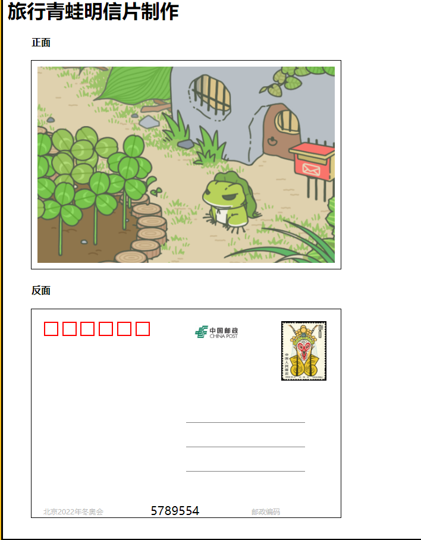

## 二.会动的小动物

使用relative与absolute来布置好一张动物的脸。

熟练使用相对定位和绝对定位，利用好父相子绝的特性。

图片有毒，不能使用相对定位

最后还是使用flex布局，并狠狠复习了一遍CSS3动画

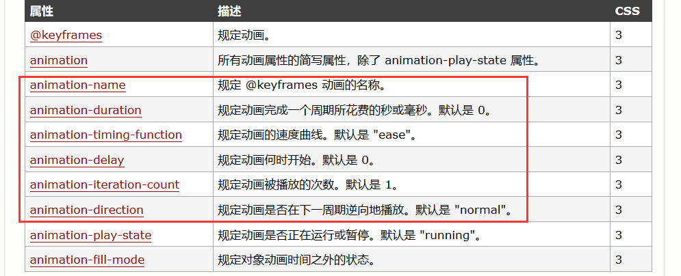

最终的效果图就很无聊了

做了一个舔狗长草颜动画

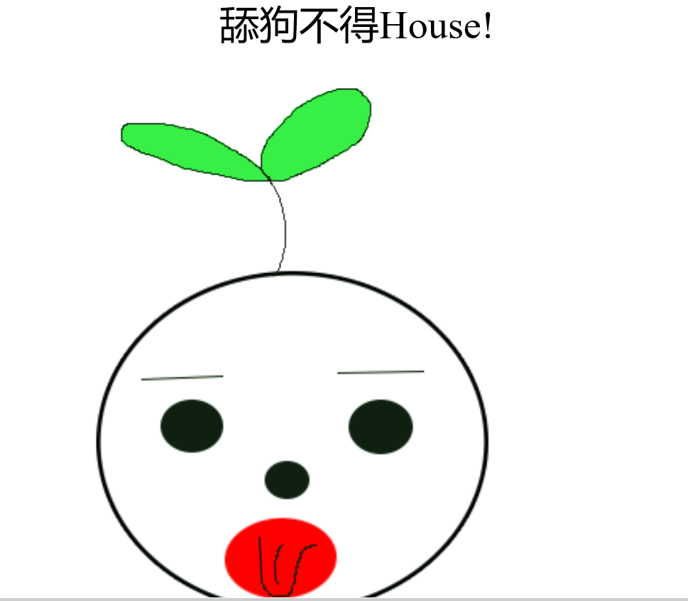

这个是动画的运动轨迹

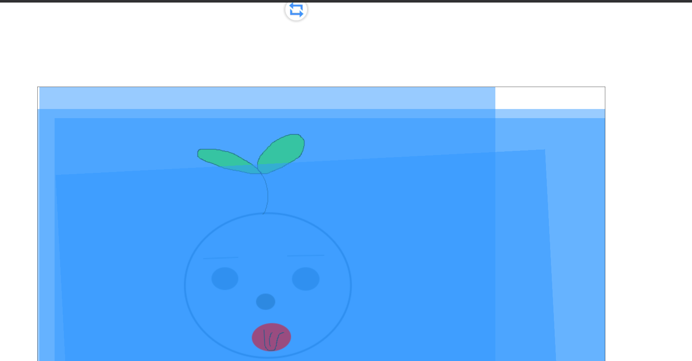

## 三.备忘录页面设计

这次我们使用flexbox布局去做备忘录设计

要提到的是，flexbox布局的确非常重要。

首先先设置到布局

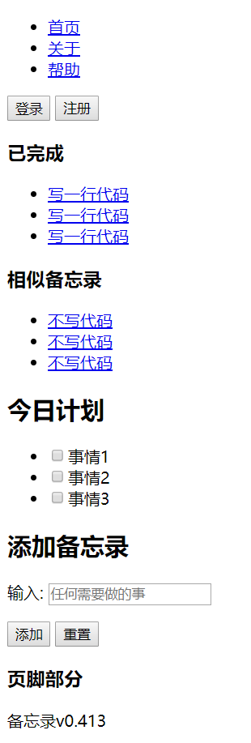

然后我们为了确保能够完美的布局，需要清除掉所有的内外边距，这时候通配符就登场了。

然后我们需要对所有元素进行固定边框设置

我们想一下，之前我们在应用边框的时候，是不是毫无限制？像多大边框就多大边框

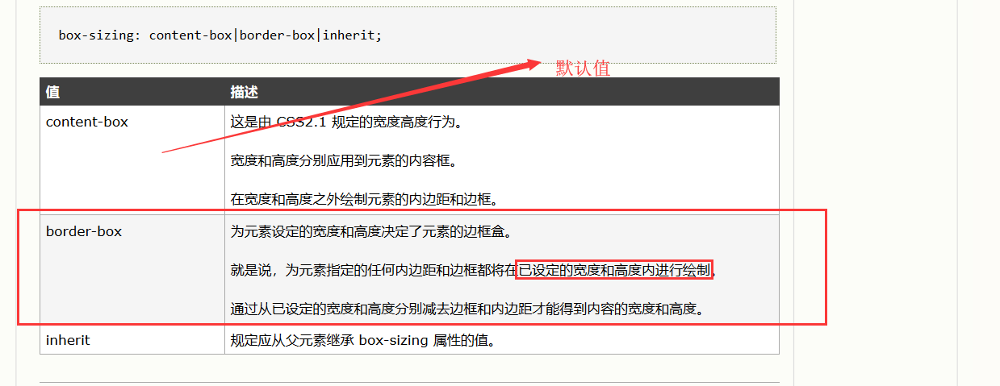

box-sizing 属性允许您以特定的方式定义匹配某个区域的特定元素。

例如，假如您需要并排放置两个带边框的框，可通过将 box-sizing 设置为 "border-box"。这可令浏览器呈现出带有指定宽度和高度的框，并把边框和内边距放入框中。

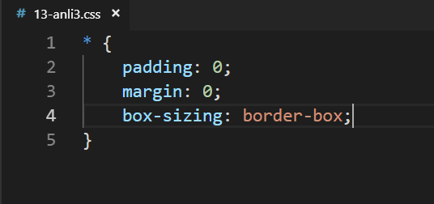

最终效果图变成这样：

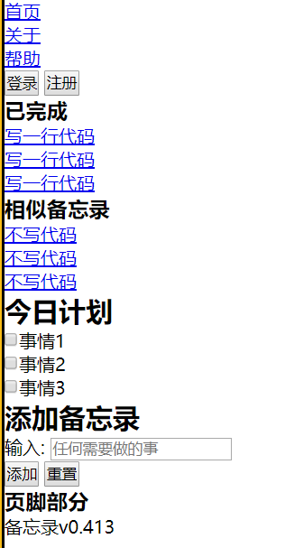

然后，对于超链接这一块去做清除样式，但是要保留它超链接的特性

后期我还会给各个超链接添加上动画过滤样式

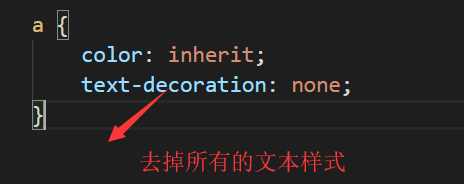

注意，color:inherit;是一个默认值，inherit规定应该从父元素继承颜色。

这是为了方便统一。

最终效果:

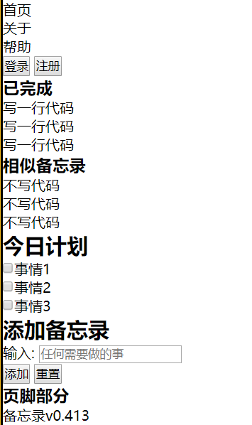

好了，接下来就正式编写CSS3代码，改造成漂亮的备忘录页面吧！

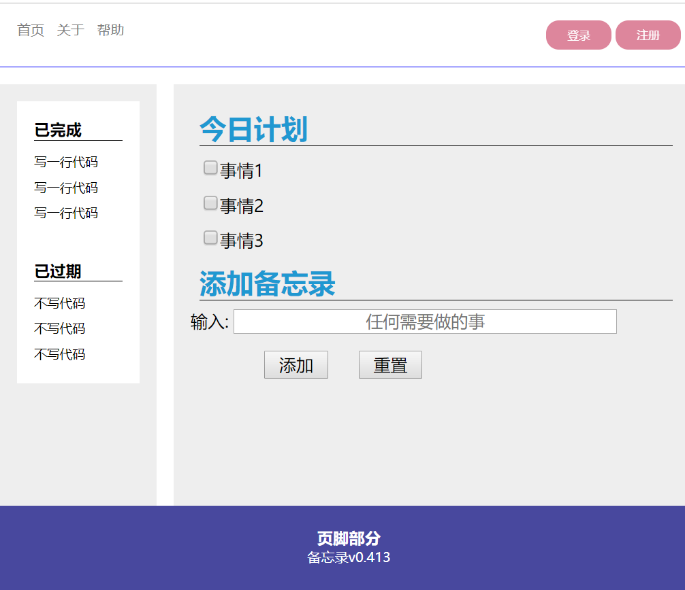

## 四.博客页面设计

已完成

## 五.落地页面设计

已完成

​	