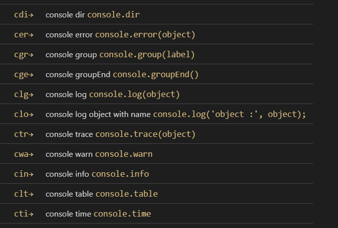
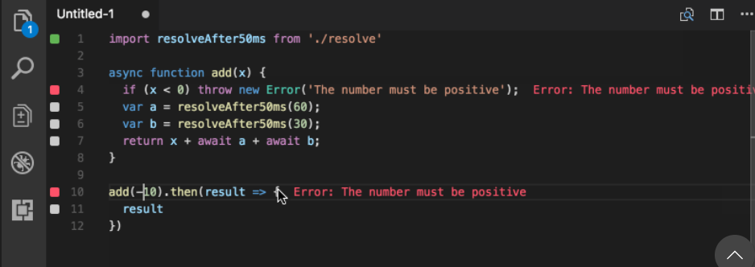
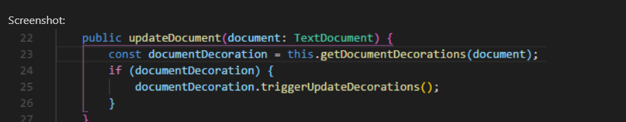
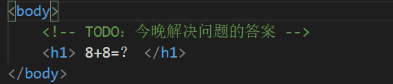
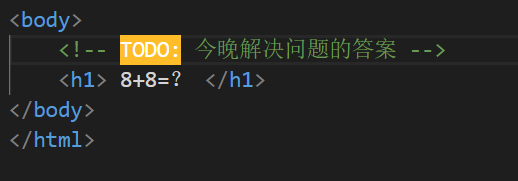
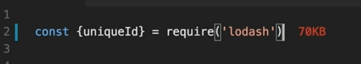
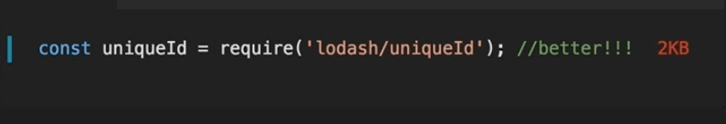
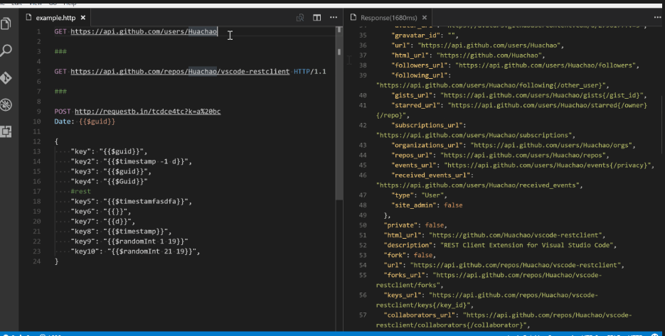
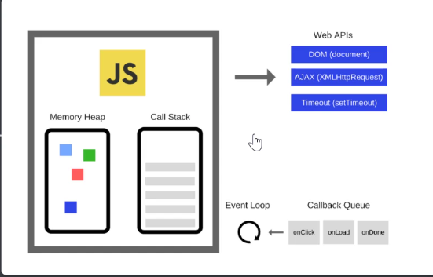

# 入门Javascript之前的准备

## 一.插件的准备

vscode中必备安装的javascript插件:

①javascript(ES6) code snippets：必备的代码补全插件

②quokka.js ：提前看见js代码中的输出问题

③Bracket Pair Colorizer：给代码填写色彩，颜色明显

④TODO Highlight：注释的TODO高亮

使用后的效果图会变成：

逼格瞬间起飞了。

⑤Import Cost：在写前端代码的时候，永远把大小成本考虑到最小

这个代码大小不行，需要优化

这便是这个插件的作用。

⑥REST Client：服务器接口测试工具，检验API的可用性

## 二.前端三元素

 HTML：通过各种元素搭建页面结构

CSS：负责页面样式：形状，大小，颜色，动画等

JavaScript：控制页面行为：部分动画效果、页面与用户的交互、页面的功能

## 三.Javascript是什么

#### 1.概念

互联网最流行的轻量级脚本语言

广泛应用于服务端、pc端、移动端

嵌入更大型的应用程序环境，去调用宿主环境提供的底层API，比如结合浏览器使用

#### 2.与宿主环境的关系

各种宿主环境提供额外的API，以便JavaScript调用

以浏览器为例，它提供额外API可以分成三大类

①浏览器控制类：操作浏览器

②DOM类：操作网页的各种元素

③Web类：实现互联网的通信功能

如果宿主环境是服务器，则会提供各种操作系统的API，比如Node环境

#### 3.工作原理

一文档，一视频

#### 4.三种使用方式

1.行内添加事件

<input type="button" onclick="alert('ha！master！');">

2.script标签直接写js代码

3.外部引入js文件

当然，我们肯定保持跟写css一样的习惯，统一使用js外部文件。

#### 5.debug方法

定点调试排查错误的时候有四种方法

alert：弹窗

console.log：控制台打印

document.title：直接显示结果

vscode：插件显示

## 四.ES6开启新时代

#### 1.什么是ES6

ES6：ECMAScript6.0的简称，是Javascript语言的下一代标准，已经正式发布

它的目标是使得Javascript语言可以用来编写复杂的大型应用程序，成为企业级开发语言。

#### 2.ES6与JS的关系

ES6script和Javascript的关系是：

前者是后者的标准，后者是前者的一种实现。

#### 3.ES6的圣经网站

<https://tc39.github.io/ecma262/>

