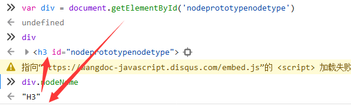
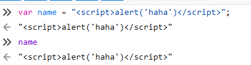
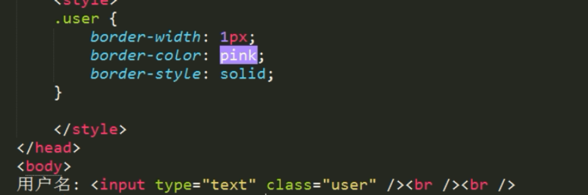
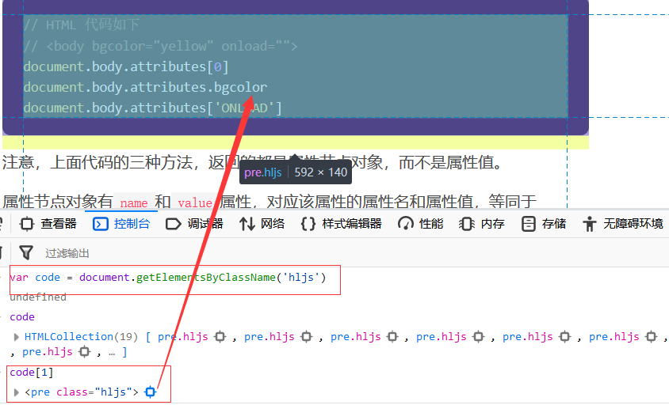
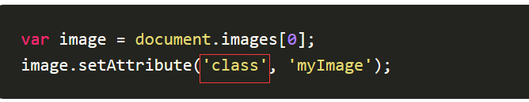
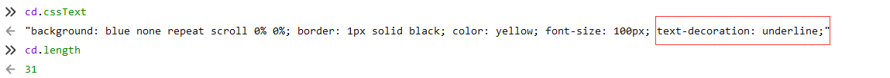
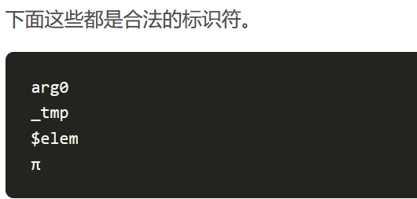
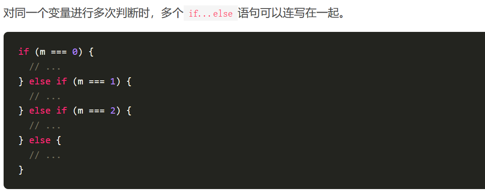
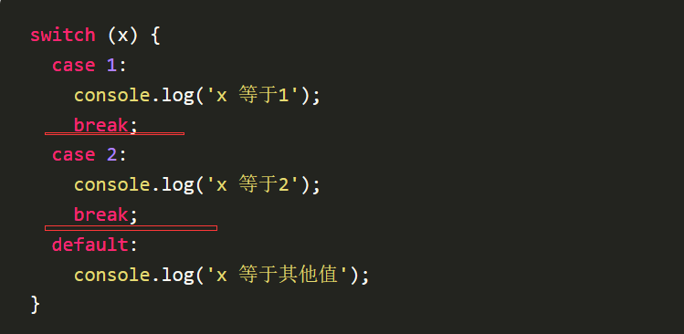
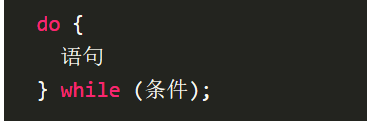

# 进入Javascript的的世界吧！

声明：今后的笔记都是采用ES6的标准之上进行编写

但是基本语法还是Javascript。


请慎重食用我的笔记

有人说，不知道参考哪个js文档进行学习

我就随便贴三个网址吧，一般推荐第一个，w3school最官方。

我的学习文档是第二个，下面的所有笔记都基于这个文档。

http://www.w3school.com.cn/js/index.asp

https://wangdoc.com/javascript/index.html

https://www.liaoxuefeng.com/wiki/001434446689867b27157e896e74d51a89c25cc8b43bdb3000


推荐一本毁天灭地的ES6script在线文档进行学习，而且这个已经编成书了，也是可以买买买的。

http://es6.ruanyifeng.com/

当然了，这本书需要学习完javascript再去浏览或者购买。


## 一.学习DOM找到对象


#### 1.什么是DOM

英文全称：Document Object Model

DOM是Javascript操作网页的接口，全称为文档对象模型

通俗理解，DOM就是整个网页文档代码。

它的作用是将网页转为一个Javascript对象，从而进行脚本操作


#### 2.DOM怎么工作

浏览器会根据DOM模型，将结构化文档解析成一系列的节点

再由这些节点组成一个树状结构(DOM TREE)

所有的节点和最终的树状结构都有规范的对外接口。


#### 3.DOM学习文档

1.Document节点：https://wangdoc.com/javascript/dom/document.html

2.Node接口：https://wangdoc.com/javascript/dom/node.html

3.Element节点：https://wangdoc.com/javascript/dom/element.html

4.属性操作：https://wangdoc.com/javascript/dom/attributes.html

5.CSS操作：https://wangdoc.com/javascript/dom/css.html


别想偷懒，五个文档全部都要读完。


## 二.Document节点

`document`节点对象代表整个文档，每张网页都有自己的`document`对象。

`window.document`属性就指向这个对象。

只要浏览器开始载入 HTML 文档，该对象就存在了，可以直接使用。

https://wangdoc.com/javascript/dom/document.html

打开这个网页，把它当作一个Document对象，进行学习如何抓取Document对象

再打开F12,进入控制台，然后跟着文档进行学习


#### 1.document.links

`document.links`属性返回当前文档所有设定了`href`属性的`<a>`及`<area>`节点。


#### 2.**document.images**

`document.images`属性返回页面所有``图片节点。


#### 3.**document.location**

`Location`对象是浏览器提供的原生对象，提供 URL 相关的信息和操作方法。

通过`window.location`和`document.location`属性，可以拿到这个对象。


#### 4.document.URL

返回浏览器的url地址


#### 5.document.title

`document.title`属性返回当前文档的标题。

默认情况下，返回`<title>`节点的值。但是该属性是可写的，一旦被修改，就返回修改后的值。


#### 6.document.querySelector()

document.querySelector方法接受一个 CSS 选择器作为参数，返回匹配该选择器的元素节点。

如果有多个节点满足匹配条件，则返回第一个匹配的节点。如果没有发现匹配的节点，则返回`null`。


同样，我们需要知道的是，抓取到的document对象是可以赋值再使用的


只需要知道，这个函数用来使用CSS选择器来进行查找目标元素，不失为不错的一个选择。


#### 7.document.getElementsByTagName()

`document.getElementsByTagName`方法搜索 HTML 标签名，返回符合条件的元素。

注意，返回的结果是一个类似于列表的集合，因为是Element**s**，是复数形式！

如果没有任何匹配的元素，就返回一个空集。

*用css3的说法就是抓取标签名*


#### 8.document.getElementsByClassName()

`document.getElementsByClassName`方法返回一个类似数组的对象（`HTMLCollection`实例），

包括了所有`class`名字符合指定条件的元素，元素的变化实时反映在返回结果中。

*用css3的说法就是抓取class属性*


咦？发生了什么？？为什么会没抓取到对象呢？？？这个文档明明有hljs的class属性啊？？？？

这说明了什么，我们犯了个思维误区。

**js里面的抓取元素与css3抓取元素的方法不一样，js里这函数里面不需要.匹配符**


看到了吗，我们成功抓取到了一堆hljs的class属性元素


#### 9.document.getElementsByName()

`document.getElementsByName`方法用于选择拥有`name`属性的 HTML 元素（比如`<form>`、`<radio>`、``、`<frame>`、`<embed>`和`<object>`等），

返回一个类似数组的的对象（`NodeList`实例），因为`name`属性相同的元素可能不止一个。

*用css3的说法就是抓取name属性*

图片我就不放上去了，原理其实与class相似


#### 10.document.getElementById()

`document.getElementById`方法返回匹配指定`id`属性的元素节点。

如果没有发现匹配的节点，则返回`null`。

*用css3的说法就是抓取id的属性*

**等一等！为什么这个代码里面是Element而不是Elements？**

bingo！id属性在一个html文件里面是具有唯一性的，不允许出现两个相同的id属性值的不同种对象。


很明显，想都不用想，就是只返回一个找到的结果，id具有唯一性。

上面代码中，两个方法都能选中`id`为`myElement`的元素，

但是`document.getElementById()`比`document.querySelector()`效率高得多。

但是，不能忘记的是，document.querySelector()需要传入#来匹配id属性，而document.getElementById()只需要传入id的值，不需要#符号匹配。

## 三.Node接口

所有 DOM 节点对象都继承了 Node 接口，拥有一些共同的属性和方法。这是 DOM 操作的基础。


你可能一时无法理解这个Node接口，你可以看看下面的概念：

DOM对象模型接口规范中，有四个基本的接口：Document，Node，NodeList以及NamedNodeMap。

其中，Node接口由DOM中的所有节点类型实现，换句话说，你可以理解为：

**Node接口专门用来做节点的工作。**


#### 1.Node.prototype.nodeName

`nodeName`属性返回节点的名称。

请不要看标题这么长，这是官方的写法，在实际应用中只需要看第三个单词即可

首先我们随便抓取一个id元素，并成功赋值再获取


成功抓取之后，我们就开始使用Node接口的方法

`nodeName`属性返回节点的名称。



我们成功抓取到了节点的名称，就是这个元素所在的标签名。


#### 2.Node.prototype.nodeValue

`nodeValue`属性返回一个字符串，表示当前节点本身的文本值，该属性可读写。

**只有文本节点（text）、注释节点（comment）和属性节点（attr）有文本值**


我们就针对刚刚的div进行操作，发现没有获取到值

这是正常的，我在前面提到过，**nodeValue是获取当前节点本身的文本值**。

我们可以继续往下看看


#### 3.Node.prototype.textContent

`textContent`属性返回当前节点和它的所有后代节点的文本内容。

这个就很靠谱多了，可以返回当前节点和后代节点的所有文本内容


这样就能获取到文本了，所以我们根据这两个例子，

能够弄明白nodeValue和textContent的区别。

但是，我们在nodeValue那边获取到一个可读写的属性，想必这个属性也是可以可读写的

所以我们可以尝试以下修改:


真的能修改，这个例子充分论证了以下观点：

**DOM就是整个网页文档代码，**

**它的作用是将网页转为一个Javascript对象，从而让js进行操作。**


#### 4.Node.prototype.nextSibling

`Node.nextSibling`属性返回紧跟在当前节点后面的第一个同级节点。

如果当前节点后面没有同级节点，则返回`null`。

这个概念其实贼好理解吧？我放一张图就知道了


比如第一个div，使用nextSibling去判断，肯定能返回啊，因为后面确实有第二个div作为同级节点

我们回到正题，继续拿div进行判断同级节点


可以发现最终的结果返回了下一行，这个时候看可能需要进一步验证，来看看到底是不是同级的


经过调试工具查看，我们确实能够验证这一点，它们确实是同级节点的关系。

当然了，这个函数支持复读机功能，可以反复使用


#### 5.Node.prototype.previousSibling

`previousSibling`属性返回当前节点前面的、距离最近的一个同级节点。

如果当前节点前面没有同级节点，则返回`null`。

当然了，上面讲到的函数是找到下一个同级节点，这个函数就便是找到上一个同级节点了


可以发现，又选择回去了。


#### 6.Node.prototype.parentNode

`parentNode`属性返回当前节点的父节点。

对于一个节点来说，它的父节点只可能是三种类型：元素节点（element）、文档节点（document）和文档片段节点（documentfragment）。

很简单粗暴嘛，就是抓取父节点

要不还是以div为目标


这个时候，读取到的就是文章的大盒子节点了。


#### 7.Node.prototype.childNodes

`childNodes`属性返回一个类似数组的对象（`NodeList`集合），成员包括当前节点的所有子节点。

简单来说，就是返回当前节点的所有后代节点


我们直接拿div父级的文章大盒子进行寻找后代，可以找到了这么多儿子


#### 8.Node.prototype.appendChild() 

`appendChild()`方法接受一个节点对象作为参数，将其作为最后一个子节点，插入当前节点。

该方法的返回值就是插入文档的子节点。

这个虽然不好理解，但是你如果以HTML5的思维去想，其实很简单

就是在当前的一个标签嘛，插入一个子标签


都是一样的原理，那么我们就找一个地方插入一个小标题吧


抓取到了之后，使用这个函数插入子节点，做一个小标题

首先肯定不要忘记创建一个节点


我们就成功定义了一个p，createElement可以理解为创建了一个标签

然后插入进入，变成子节点


#### 9.Node.prototype.removeChild()

`removeChild`方法接受一个子节点作为参数，用于从当前节点移除该子节点。返回值是移除的子节点。

很简单，就是移除一个子节点嘛

我们在上面不是正好创造了一个子节点加进去吗

现在我们来试试删除掉，不，其实是删不掉的，因为我刚才上面的所作所为是属于调试

并没有影响源码，所以删除不了不存在的东西

但不影响我们的继续学习，我们可以直接删掉某一个元素

不如我们直接拿div开刀，先找到div的爸爸，再使用removeChild干掉儿子自己


现在我们来试试自杀


通过这个自杀案例，我们能够理解了removeChild的作用。


#### 10.Node.prototype.replaceChild() 

`replaceChild`方法用于将一个新的节点，替换当前节点的某一个子节点。

这个呢，也不难理解，就是掉包替换，但是要注意，要在当前节点去操作子节点的替换

不如我们就把这个标题进行替换，把这个标题撸成新的div


然后自己运用createElement、textContent和变量赋值创造新的标题


然后就拿这两个变量，使用这个函数进行替换


跟前面的自杀案例很像，找到自己的爸爸，然后替换儿子自己

但是括号内的参数顺序却颠覆了常识，一般来说不是默认左边替换成右边

但是这个replaceChild函数括号的参数却是把替换后的内容放在前面，被替换的放在后面。

做个很有必要的总结：removeChild()和replaceChild()都是在父节点里面对子节点进行操作


## 四.Element节点

`Element`节点对象对应网页的 HTML 元素。

每一个 HTML 元素，在 DOM 树上都会转化成一个`Element`节点对象（以下简称元素节点）。

别忘了，Element是DOM重要的节点，这是用来直接干元素的。

所以我们可以知道：Node做节点的工作，Element做元素的工作。


#### 1.**Element.id**

`Element.id`属性返回指定元素的`id`属性，该属性可读写。

这个是最简单的示例。


还是针对学习的文档进行练习吧


总之就是一个很简单的返回id属性值


#### 2.**Element.tagName**

`Element.tagName`属性返回指定元素的大写标签名，与`nodeName`属性的值相等。

这个意思就是说，你抓到哪个元素了，直接返回这个元素的大写标签名


#### 3.Element.attributes

`Element.attributes`属性返回一个类似数组的对象，成员是当前元素节点的所有属性节点

它这个的意思就是说直接返回当前元素的所有属性？

所以我们需要重新抓取一个有属性的区域，来帮助我们更好学习


然后使用我们的代码：


果真返回了class属性。


#### 4.Element.className，Element.classList

`className`属性用来读写当前元素节点的`class`属性。它的值是一个字符串，每个`class`之间用空格分割。

`classList`属性返回一个类似数组的对象，当前元素节点的每个`class`就是这个对象的一个成员。

这个不是很难理解，就上面的code变量继续操作：


我们有必要了解一下classList的方法

后面会经常用到


#### 5.Element.innerHTML

`Element.innerHTML`属性返回一个字符串，等同于该元素包含的所有 HTML 代码。

该属性可读写，常用来设置某个节点的内容。它能改写所有元素节点的内容，包括`<HTML>`和`<body>`元素。

意思就是说，你只能返回这个元素里面的所有HTML5代码，不包含元素本身代码

我们就随便抓一段话来查看下：


也许这样用innerHTML能够看到无比真实的源码。

不过，我们需要知道的是innerHTML是支持读写的，也就是说可以修改

于是我们随便定义一段HTML代码



然后就可以修改一下code的innerHTML源码


#### 6.Element.outerHTML

`Element.outerHTML`属性返回一个字符串，表示当前元素节点的所有 HTML 代码，包括该元素本身和所有子元素。

其实这个outherHTML无非就是在innerHTML的基础上多打印出来本身的元素代码

一张图你就能秒懂了


#### 7.Element.style

每个元素节点都有`style`用来读写该元素的行内样式信息。

这个就很好理解了吧？

找到本元素的行内样式信息。

比如<p style="color:red”>哈哈</p>

这个返回的肯定就是style="color:red”啊

我们再用刚才的code看看：


#### 8.Element.querySelector()

同样的是，不只是document对象可以查找，Element也可以querySelector()

`Element.querySelector`方法接受 CSS 选择器作为参数，返回父元素的第一个匹配的子元素。如果没有找到匹配的子元素，就返回`null`。

总结一下就是，首先不是要抓到一个元素嘛，然后使用querySelector()去找下子元素符合要求的代码呗~！

继续用刚才的code理解一下:


#### 9.Element.getElementsByClassName()和Element.getElementsByTagName()

①Element.getElementsByClassName()：

`Element.getElementsByClassName`方法返回一个`HTMLCollection`实例，

成员是当前元素节点的所有具有指定 class 的子元素节点。

该方法与`document.getElementsByClassName`方法的用法类似，

只是搜索范围不是整个文档，而是当前元素节点。


②Element.getElementsByTagName()：

`Element.getElementsByTagName`方法返回一个`HTMLCollection`实例，

成员是当前节点的所有匹配指定标签名的子元素节点。

该方法与`document.getElementsByClassName`方法的用法类似，

只是搜索范围不是整个文档，而是当前元素节点。


其实这两个方法在document接口那儿就讲过了，没什么区别，硬要说区别的话：

document是在整个文档网页去寻找

element则是在当前的元素内去寻找


#### 10.Element.matches()

`Element.matches`方法返回一个布尔值，表示当前元素是否匹配给定的 CSS 选择器。

这个很简单，就是针对当前元素，判断有没有CSS选择器


注意，matches是要使用.或者#匹配符号，与querySelector()一样的。


## 五.CSS3的回笼复习


#### 1.怎么让a标签变成块级元素

给a标签传递一个display: block;就可以变成块级元素

但是我们会看到一个这样的现象，多个a标签直接竖直排列了


所以我们需要改变一下display的值：inline-block；

将a标签变成行内块元素


至于这个文字呢怎么水平居中和垂直居中呢？

水平居中：text-align: center;

垂直居中：设定文字行高等于盒子的高度，即可居中，line-height: 50px;

最后显示效果如下：


#### 2.复习CSS三大特性

1）CSS层叠性

所谓层叠性是指多种CSS样式的叠加。

俗话说就是"长江推后浪"


如果样式冲突，遵循的原则是就近原则。

哪个样式离结构近，就执行哪个样式。

但不意味着样式表会整个覆盖过去，不同的样式还是能够生效的。

2）CSS继承性

所谓继承性就是书写VSS样式表时，子标签会继承父标签的某些样式

也就是说子承父业。

适当使用继承性，可以降低代码复用率。

3）CSS优先级

这个就是比拼选择器的优先级了


不再有就近原则，以选择器的优先级进行排列，

官方解释就是权重，比拼谁的权重大，就继承谁的样式表。

以下是权重排行榜，从大到小排列


| 选择器         | 权重       |      |      |      |      |
| :------------- | ---------- | ---- | ---- | ---- | ---- |
| !important     | 无穷大     |      |      |      |      |
| 行内样式       | 1，0，0，0 |      |      |      |      |
| id选择器       | 0，1，0，0 |      |      |      |      |
| 类或伪类选择器 | 0，0，1，0 |      |      |      |      |
| 标签选择器     | 0，0，0，1 |      |      |      |      |
| 继承           | 无         |      |      |      |      |

---

1.! important  不建议使用

---

2.行内样式

这已经是最高的权重了，一般来说，有了行内样式

无论下面的选择器再怎么叠加，最红还是以行内样式显示为准。

---

3.id选择器


---

4.类选择器或伪类选择器


---

5.标签选择器


通过这个，我们成功理解了标签选择器的权重。

---

6.继承，权重为0


通过这个案例，我们能够加强继承的权重为0的概念理解。


#### 3.复习提高盒子模型

1）盒子边框

盒子边框就是border

border-width：边框宽度

border-style：边框样式

border-color：边框颜色

这三个组成了一个综合的border属性，下面是例子:

border: 1px solid red;

这便是创造了一个边框宽度为1的红色实线框。

对了，input标签是自带默认border属性的，支持修改



所以以后创建更复杂的input输入栏的时候，可直接设置border属性就行。


得出的效果如下：


当然了，我们的世界盒子不只直角，还有圆角。

设置圆角的属性是border-radius。


当然了，最大的圆角不能超过或等于宽高的一半，不然就变成圆形。

由这个我们能得出一个重要的结论，画出圆形的方法:

**设置border-radius: 50%; --> 变成圆形**

再超出去就还是圆形，无变化。

①你如果给border-radius传递四个单位时，

改变的顺序依次为左上角，右上角，右下角，左下角。

也就是说从左上角开始的顺时针顺序改变。

②传递三个单位呢？

那就是左上角 -- 右上角和左下角，右下角依次改变。

③如果是两个单位呢？

那就是两个对角线了，依次为左上角右下角，右上角左下角。

---


2）美化表格

我们有没有想起来曾经学习表格的时候，表框是使用border="1"来定义的。


这是一般来说设置的表格，但是这个不太美观，可以直接追求更加简洁的方式：


设置好这个属性之后，就是设置单元格的间隔统统清楚为0

效果图下：


---

3）内边距padding

内边距就是内容与边框的距离。

①传递一个单位的时候，上下左右都是这个内边距距离，会把border盒子给撑大。固定居中。

②传递两个单位的时候，依次为上下，左右

③传递三个单位的时候，依次为上，左右，下

④传递四个单位的时候，依次为上，右，下，左。也就是以上开始的顺时针旋转顺序。

---

4）外边距margin

外边距就是整个边框盒子离外界的距离。不会影响border盒子的大小，只会改变盒子的位置。

传递几个单位的逻辑与上面padding一致。

当你想固定水平居中的时候就margin: 0 auto;

逻辑确实与padding一致，依次为上下、左右实现。

---

5）box-sizing

我们知道，盒子模型有个关键的属性


第一行的box-sizing: content-box是默认值，便是我们上面复习的过程中，padding的变化会带来border盒子的变化。

当我们把第二行的box-sizing设置为border-box的时候，盒子大小就固定成为了width。

最好使用这个box-sizing: border-box，这样一来，我们布局的盒子都不会被padding随意撑大，方便了布局统一性。

#### 4.复习提高浮动布局

图片插在文字中，怎么自动靠右，可以使用float浮动属性。

比如这张图片就是用float: right;完成了图片的靠右


float只有三个属性，便是left，right，none。

float一个不错的应用，就是将三个div盒子改成一行输出的话，

使用display: inline-block;会带来空隙


所以我们改用float: left；赋予这些div盒子向左浮动的属性：


最终效果：


## 六.attribute属性

HTML 元素包括标签名和若干个键值对，这个键值对就称为“属性”（attribute）。

其实就是元素里面的所有属性啦。比如id啊class啊href啊什么乱七八糟的


像这样，属性就有两个，id和href。

属性本身是一个对象（`Attr`对象），但是实际上，这个对象极少使用。

一般都是通过元素节点对象（`HTMlElement`对象）来操作属性。本章介绍如何操作这些属性。

但是作为基础的学习，我们还是很有必要去接触一下的。


#### 1.Element.attributes

元素对象有一个`attributes`属性，返回一个类似数组的动态对象，

成员是该元素标签的所有属性节点对象，属性的实时变化都会反映在这个节点对象上。

其他类型的节点对象，虽然也有`attributes`属性，但返回的都是`null`，因此可以把这个属性视为元素对象独有的。

来看看下面经典的抓取属性方法吧


这样我们可以看出来有两种方法，一个是.抓取，一个是[ ]抓取。 


我们就针对这个文档，进行抓取这个刚才学习过的代码块



然后我们拿到之后可以看看它的属性了


通过attributes能够看到抓取元素的所有属性

那么如果抓到的元素有许多个属性，是可以支持索引查询的


#### 2.从HTML到Javascript

我们在上面学习到了这么多，想必对关键词已经有了个清晰的认识，

尤其是当多个单词组合的时候，比如 get elements by class name

到Javascript里面组合起来就成了getElementsByClassName

只有第一个单词的首字母不需要小写，以这种方式组合。

那么我们来看看官方解释

HTML 元素的属性名是大小写不敏感的，但是 JavaScript 对象的属性名是大小写敏感的。

**转换规则是，转为 JavaScript 属性名时，一律采用小写。**

**如果属性名包括多个单词，则采用骆驼拼写法，即从第二个单词开始，每个单词的首字母采用大写，比如`onClick`。**

所以转换到Javascript属性名的时候，是需要采用骆驼拼写法的。

有些 HTML 属性名是 JavaScript 的保留字，转为 JavaScript 属性时，必须改名。主要是以下两个。

- `for`属性改为`htmlFor`
- `class`属性改为`className`

这个肯定要额外注意，id没有变，但是class到js里面就变成了className了。

另外，HTML 属性值一般都是字符串，但是 JavaScript 属性会自动转换类型。

比如，将字符串`true`转为布尔值，将`onClick`的值转为一个函数，将`style`属性的值转为一个`CSSStyleDeclaration`对象。

因此，可以对这些属性赋予各种类型的值。


#### 3.操作attribute


这六个方法都需要学习理解，有几点需要注意的是：

（1）适用性

这六个方法对所有属性（包括用户自定义的属性）都适用。

（2）返回值

`getAttribute()`只返回字符串，不会返回其他类型的值。

（3）属性名

这些方法只接受属性的标准名称，**不用改写保留字**，比如`for`和`class`都可以直接使用。

另外，**这些方法对于属性名是大小写不敏感的**。

为什么不明白上面的意思呢，就是我们在上面进行抓取的时候，是不是需要className呢？

但是在这些方法的参数中，是可以直接传递的



`setAttribute`方法直接使用`class`作为属性名，不用写成`className`。

其实不难理解，要操作的东西呀就是className，被操作的东西啊就按原名字处理。

今后不要搞混className和class的应用位置。

我们就挑其中几个讲吧，比如Element.getAttribute()，很简单，找属性用的，找不到属性就返回null

`Element.getAttribute`方法返回当前元素节点的指定属性。如果指定属性不存在，则返回`null`。


这个例子说的就简单吧？

再讲一个Element.setAttribute()吧，这个是用来换属性的

`Element.setAttribute`方法用于为当前元素节点新增属性。

如果同名属性已存在，则相当于编辑已存在的属性。该方法没有返回值。

这个还是拿刚才的code做例子


这不就成功新增了个属性吗？


如果是已经存在的属性，那就会变成修改。很简单的。

至于Element.hasAttributes() ，可以做做了解：

`Element.hasAttributes`方法返回一个布尔值，表示当前元素是否有属性，

如果没有任何属性，就返回`false`，否则返回`true`。

总之，最好去对官方文档全面学习，永远是最好的选择，基础扎实必备。


## 七.CSS属性


CSS 与 JavaScript 是两个有着明确分工的领域，前者负责页面的视觉效果，后者负责与用户的行为互动。

但是，它们毕竟同属网页开发的前端，因此不可避免有着交叉和互相配合。

本文档介绍如何通过 JavaScript 操作 CSS。

这个就无需解释，这是必须学习到的，比如我们常常通过按钮来改变背景色，这个就是要用js来完成


#### 1.setAttribute()

操作 CSS 样式最简单的方法，

就是使用网页元素节点的`getAttribute`方法、`setAttribute`方法和`removeAttribute`方法，

直接读写或删除网页元素的`style`属性。

还记得上面讲到的setAttribute()方法吗，我将会展现一个最简单的修改样式方法


通过这个方法，传入style的属性值，就成功修改了样式

我们直接拿文档进行练习吧


现在就应用上去最简单的修改样式方法


通过这个例子，你也许能对setAttribute()方法有了更好更充足的理解。

直接查看样式的方法就很简单了

直接输入code.style即可


#### 2.style


直接放出图片，这更好理解了。

直接抓取对象的style，然后找哪个属性改哪个


注意看我的红框，有必要再啰嗦一下骆驼拼写法

这个HTML中是不是font-size？到了Javascript肯定要变成fontSize啊，转换的规则就是如此。

有人可能就问了，background的g不是大写，我真想敲死他

难道HTML5中的写法是back-ground吗？？？


#### 3.CSSStyleDeclaration接口

CSSStyleDeclaration接口用来操作元素的样式。三个地方部署了这个接口。

- 元素节点的`style`属性（`Element.style`）
- `CSSStyle`实例的`style`属性
- `window.getComputedStyle()`的返回值

CSSStyleDeclaration 接口可以直接读写 CSS 的样式属性。

**所以如果要获取到CSSStyleDeclaration对象，方法是元素.style**

不过，连词号需要变成骆驼拼写法。


我们能够拿到一个cd对象，存储着这个元素的所有样式

也可以进行直接查询


#### 4.**CSSStyleDeclaration.cssText**

啰嗦一下，CSSStyleDeclaration是什么呢？

就是抓取到对象的style-->code.style

然后再用后面的方法

`cssText`属性用来读写当前规则的所有样式声明文本。

返回所有的css属性文本


可以看到，一共有四个css属性

可以再了解一个属性CSSStyleDeclaration.length：

`CSSStyleDeclaration.length`属性返回一个整数值，表示当前规则包含多少条样式声明。


所以我们的cd包含了28条样式声明。


#### 5.**CSSStyleDeclaration.item()**

`CSSStyleDeclaration.item`方法接受一个整数值作为参数，返回该位置的 CSS 属性名。

幸运的是，我们上面就接触过了这样的知识点


但是我们在上面的学习中，CSSStyleDeclaration.length返回了28，所以我们试试看


通过CSSStyleDeclaration.item()的判断确实证明了cd的CSS样式声明确实只有28条。


#### 6.**CSSStyleDeclaration.setProperty()**

`CSSStyleDeclaration.setProperty`方法用来设置新的 CSS 属性。该方法没有返回值。

我们在上面的图中看到：


所以我们需要再加一对属性来验证


可以看到，我加了个下划线属性，确实生效了

我们再来看看CSSStyleDeclaration.cssText的返回效果吧：



确实在文本中成功添加了。


## 八.深入理解Javascript


#### 1.JavaScript 与 Java 的关系

这已经是老梗了

JavaScript 的基本语法和对象体系，是模仿 Java 而设计的。但是，JavaScript 没有采用 Java  的静态类型。正是因为 JavaScript 与 Java 有很大的相似性，所以这门语言才从一开始的 LiveScript 改名为  JavaScript。基本上，JavaScript 这个名字的原意是“很像Java的脚本语言”。

JavaScript 语言的函数是一种独立的数据类型，以及采用基于原型对象（prototype）的继承链。这是它与 Java 语法最大的两点区别。JavaScript 语法要比 Java 自由得多。

另外，Java 语言需要编译，而 JavaScript 语言则是运行时由解释器直接执行。

总之，JavaScript 的原始设计目标是一种小型的、简单的动态语言，与 Java 有足够的相似性，使得使用者（尤其是 Java 程序员）可以快速上手。

为啥里面会有个Java，其实就要说起网景与Sun公司的合作，Java（由 Sun 发明）是更复杂的编程语言，为表友好，于是将Java加进去成为今天的Javascript。


#### 2.JavaScript 实现

尽管我们知道ES6script是javascript的新一代标准，ES6script的全名就是ECMAScript6.0。

但是ECMAScript真的只是一个整体吗？

尽管 ECMAScript 是一个重要的标准，但它并不是 JavaScript 唯一的部分，当然，也不是唯一被标准化的部分。实际上，一个完整的 JavaScript 实现是由以下 3 个不同部分组成的：

- 核心（ECMAScript）
- 文档对象模型（DOM）
- 浏览器对象模型（BOM）

所以：**JavaScript = ECMAScript + DOM + BOM**


**ECMAScript：**

ECMAScript 并不与任何具体浏览器相绑定，实际上，它也没有提到用于任何用户输入输出的方法（这点与 C 这类语言不同，它需要依赖外部的库来完成这类任务）。

ECMAScript 可以为不同种类的宿主环境提供核心的脚本编程能力，因此核心的脚本语言是与任何特定的宿主环境分开进行规定的... ...


**DOM：**

我们上面所学的就是DOM知识，DOM的一些重要节点和重要接口

DOM是很重要的文档对象模型，能够让js完成对HTML5+CSS3代码修改与控制

DOM（文档对象模型）是 HTML 和 XML 的应用程序接口（API）。

DOM 将把整个页面规划成由节点层级构成的文档。HTML 或 XML 页面的每个部分都是一个节点的衍生物。


明白了吗？DOM就是把代码分成节点树，是让js更好地去控制。


**BOM：**

IE 3.0 和 Netscape Navigator 3.0 提供了一种特性 - BOM（浏览器对象模型），可以对浏览器窗口进行访问和操作。

使用 BOM，开发者可以移动窗口、改变状态栏中的文本以及执行其他与页面内容不直接相关的动作。

使 BOM 独树一帜且又常常令人怀疑的地方在于，它只是 JavaScript 的一个部分，没有任何相关的标准。


简洁来说BOM起到了控制浏览器的作用。

没错，js同样可以控制浏览器。


## 九.JavaScript工作原理


#### 1.Javascrpt定义

千言万语，不如汇成一个列表来得实在

 - 单线程
 - 异步IO
 - 并发
 - 基于原型的面向对象
 - 脚本语言


#### 2.JavaScript的执行任务

**一个主线程+一个任务队列**

至于任务的执行分为同步任务和异步任务：

**同步任务就是放在主线程上执行的任务，异步任务就是放在任务队列的任务。**


结合这张图，请往下啃我放的知识点：

---

所有的同步任务都在主线程执行，这构成了一个执行栈，

异步任务有了运行结果会在任务队列中放置一个事件，

比如定时2秒，到2秒后才能放进任务队列（callback放进任务队列，而不是setTimeout函数放进队列）。

脚本运行时，先依次运行执行栈，然后从队列中提取事件来运行任务队列中的任务，这个过程是不断重复的。

---

**也就是说，这张图的运作过程构成了事件循环。**


#### 3.Javascript的引擎机制

js引擎线程就是js内核，负责解析与执行js代码，也称为主线程。浏览器同时只能有一个js引擎线程在运行js程序，所以js是单线程运行的。

由上面的知识点，我们可以得出一个结论：

**javascript引擎的运行机制是单线程**

什么是单线程呢？也就是说，同一个时间只能做一件事

为什么不能有多个线程呢？提高运行的效率啊？原因如下：

---

JavaScript的单线程，与它的用途有关。

作为浏览器脚本语言，JavaScript的主要用途是与用户互动，以及操作DOM。

这决定了它只能是单线程，否则会带来很复杂的同步问题。

比如，假定JavaScript同时有两个线程，一个线程在某个DOM节点上添加内容，另一个线程删除了这个节点，这时浏览器应该以哪个线程为准？

---


#### 4.Event Loop是什么

知道了javascript是单线程之后，新的问题就来了，js到底是怎么实现异步操作的

这时候，Event Loop就应运而生了，实现事件循环，

用上了执行栈与任务队列。

那么，在一整套事件循环中，到底发生了什么，能够完成异步运行？

---

同步任务放在主线程上执行，形成一个执行栈，表示正在做的事情。

然后这时候用户启动了操作，放入异步任务，只要有了结果，就立马放入任务队列等待排队。

一旦执行栈的任务执行完毕，系统读取任务队列，放入执行栈来执行，执行完了再去读取任务队列。

这就是一个循环的过程，像不像排队机制，本质上其实还是单线程，

只不过异步的操作结果放在了任务队列，排队等待进入执行栈。

---

这是别人写的理解，跟我总结的应该差不多：

同步操作运行在js引擎线程（主线程）上，会形成一个执行栈，而异步操作则在他们对应的异步线程上处理（比如：定时操作在定时器线程上；http请求则在异步请求线程上处理）。

而事件循环线程则监视着这些异步线程们，等异步线程们里面的操作有了结果（比如：定时器计时完成，或者http请求获取到响应），便把他们的毁掉函数添加到事件队列尾部，整个过程中执行栈、事件队列就构成Event Loop。


#### 5.JavaScript工作原理总结

- 执行一个同步任务（执行栈中没有就从任务队列中获取）
- 执行过程中如果遇到异步任务，就将它添加到异步任务的任务队列中
- 同步任务执行完毕后，立即执行当前异步任务队列中的所有任务（依次执行）
- 当前全部任务执行完毕，开始检查渲染，然后GUI线程接管渲染
- 渲染完毕后，JS线程继续接管，开始下一个任务（从任务队列中获取）


## 十.JavaScript基本语法


#### 1.分号

```
var a = 1 + 3; --> 1 + 3叫做表达式（expression），指一个为了得到返回值的计算式。

```

语句以分号结尾，一个分号就表示一个语句结束。多个语句可以写在一行内。

分号前面可以没有任何内容，JavaScript 引擎将其视为空语句。


表达式不需要分号结尾。一旦在表达式后面添加分号，则 JavaScript 引擎就将表达式视为语句，这样会产生一些没有任何意义的语句。


#### 2.变量

GJYBZ2

变量是对“值”的具名引用。变量就是为“值”起名，然后引用这个名字，就等同于引用这个值。变量的名字就是变量名。

```
var a = 1;
```

上面的代码先声明变量`a`，然后在变量`a`与数值1之间建立引用关系，称为将数值1“赋值”给变量`a`。

以后，引用变量名`a`就会得到数值1。最前面的`var`，是变量声明命令。它表示通知解释引擎，要创建一个变量`a`。

**注意，Javascript对大小写敏感**

a和A是两个不同的变量。

```
var a, b; --> 可以在同一条var命令中声明多个变量。
```

JavaScript 是一种动态类型语言，也就是说，变量的类型没有限制，变量可以随时更改类型。

当然，也可以反复赋值变量，进行修改：


但是，**变量的赋值必须要有命名规范**

- 第一个字符，可以是任意 Unicode 字母（包括英文字母和其他语言的字母），以及美元符号（`$`）和下划线（`_`）。

- 第二个字符及后面的字符，除了 Unicode 字母、美元符号和下划线，还可以用数字`0-9`




#### 3.区块

JavaScript 使用大括号，将多个相关的语句组合在一起，称为“区块”（block）。

一般来说，区块是单独的作用域，独立发挥作用。

但是**对于`var`命令来说，JavaScript 的区块不构成单独的作用域（scope）。**

像这样的例子：


可以看到var命名的变量，不受区块的限制影响，依旧是全局变量。

在 JavaScript 语言中，单独使用区块并不常见，区块往往用来构成其他更复杂的语法结构，比如`for`、`if`、`while`、`function`等。

也就是说，区块一般装着是功能执行。


#### 4.条件

1）if结构

`if`结构先判断一个表达式的布尔值，然后根据布尔值的真伪，执行不同的语句。

所谓布尔值，指的是 JavaScript 的两个特殊值，`true`表示真，`false`表示`伪`。


为什么要使用 === 来进行判断，而不是我们认知中的 == 呢？

JavaScript 提供两种相等运算符：`==`和`===`。

**== 是相等运算符**

**=== 是严格相等运算符**

它们的区别是：**相等运算符（`==`）比较两个值是否相等，严格相等运算符（`===`）比较它们是否为“同一个值”。**

如果两个值不是同一类型，严格相等运算符（`===`）直接返回`false`，

而相等运算符（`==`）会将它们转换成同一个类型，再用严格相等运算符进行比较。

明白了吗？

**就是说严格相等运算符（===）是检查值和类型是否一致，相等运算符（==）是只检查值是否相等。**

---

2) if_else结构

`if`代码块后面，还可以跟一个`else`代码块，表示不满足条件时，所要执行的代码。


当然了，如果碰到三个以上的代码块，也是可以支持的



---

3) switch结构

当然上一张图的代码是可以优化成switch结构的

多个`if...else`连在一起使用的时候，可以转为使用更方便的`switch`结构。


但是，事实真的如我们想象的那样吗？

上面代码中，**`case`代码块之中没有`break`语句，导致不会跳出`switch`结构 **，而会一直执行下去。正确的写法是像下面这样。

必然获取不到我们期望的结果，所以正确的输出结果应该是下面的



至于这个default的作用，就很好理解，就是当前面的所有条件都不满足时，就输出default的内容。


#### 5.三元

JavaScript 还有一个三元运算符（即该运算符需要三个运算子）`?:`，也可以用于逻辑判断。

经典公式如下：


先细细分析一下，就是说**如果括号内的条件如果是对的，就返回表达式1，如果是错的，就返回表达式2。**

下面有个简单的案例，判断n是偶数还是奇数


这样，当n为2的时候，满足条件，返回偶数

就会输出数字2是偶数。


#### 6.while

`While`语句包括一个循环条件和一段代码块，只要条件为真，就不断循环执行代码块。

我们有过编程基础的，已经是对while循环非常熟悉了。

标准公式如下：


来看看一个无限循环的例子，加深对循环的理解


条件便是true，语句是打印hello world，因为是循环语句，条件一直为真，所以就一直循环打印Hello，world。


再来看看这个，每次循环都会把i加上1，然后循环了100次当i=100时，循环条件不满足，便停下了循环。

但是需要关注的是，while还有另一种形式：do……while

`do...while`循环与`while`循环类似，**唯一的区别就是先运行一次循环体，然后判断循环条件。**




#### 7.for

`for`语句是循环命令的另一种形式，可以指定循环的起点、终点和终止条件。它的格式如下。

这个比较难理解，需要反复啃下


这是一个不错的完整体系，自给自足，需要重点理解

`for`语句后面的括号里面，有三个表达式。

- 初始化表达式（initialize）：确定循环变量的初始值，只在循环开始时执行一次。
- 条件表达式（test）：每轮循环开始时，都要执行这个条件表达式，只有值为真，才继续进行循环。
- 递增表达式（increment）：每轮循环的最后一个操作，通常用来递增循环变量


这个不难理解吧？设置x=3，然后初始化一个i=0，然后满足条件，就打印一次i，后面的i++就是加上1

官方解释：

上面代码中，初始化表达式是`var i = 0`，即初始化一个变量`i`；

测试表达式是`i < x`，即只要`i`小于`x`，就会执行循环；递增表达式是`i++`，即每次循环结束后，`i`增大1。


#### 8.链接

中文：https://wangdoc.com/javascript/basic/grammar.html

英语：http://2ality.com/2011/10/javascript-overview.html

