# 深入Javscript理解数据类型和对象

## 一.number

#### 1.表示方式

Number是与数字值对应的引用类型

JavaScript 对整数提供四种进制的表示方法：十进制、十六进制、八进制、二进制。

- 十进制：没有前导0的数值。
- 八进制：有前缀`0o`或`0O`的数值，或者有前导0、且只用到0-7的八个阿拉伯数字的数值。
- 十六进制：有前缀`0x`或`0X`的数值。
- 二进制：有前缀`0b`或`0B`的数值。

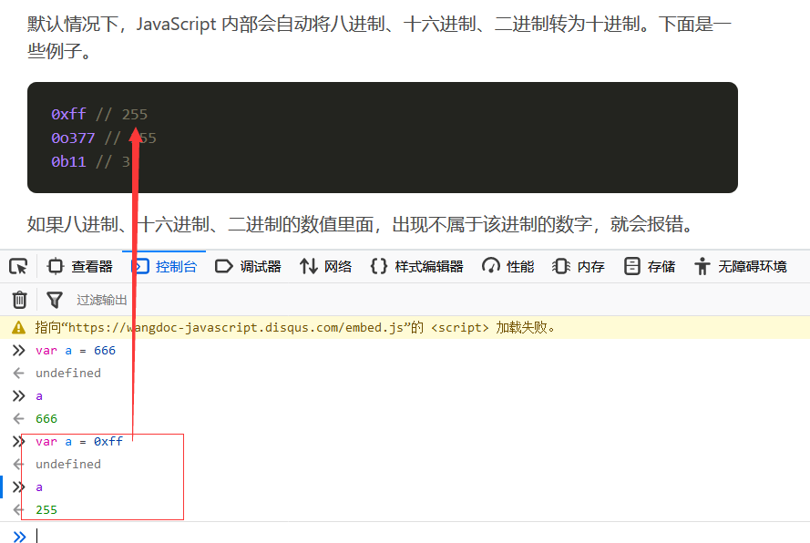

也就是说，我们可以再控制台输入这四种进制的数字

最终控制台输出最终会转化为十进制的数字。

#### 2.特殊值

我们需要了解到的是，在javascript中有五种特殊数字值。

①Number.MAX_VALUE：最大数值

②Number.MIN_VALUE：最小数值

③Number.NaN：特殊的非数字值

④Number.NEGATIVE_INFINITY：负无穷大

⑤Number.POSITIVE_INFINITY：正无穷大

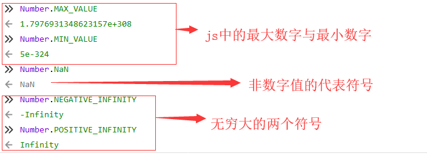

#### 3.类型转化

1）parseInt()

`parseInt`方法用于将字符串转为整数。

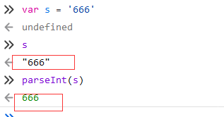

如果字符串头部有空格，空格会被自动去除。

当然了，我们需要了解的是，parseInt()方法也具有强制性

如果`parseInt`的参数不是字符串，则会先转为字符串再转换。

根据这个理论，这就牵出来了parerInt的一个强大的作用，就是只返回数字：

字符串转为整数的时候，是一个个字符依次转换，如果遇到不能转为数字的字符，就不再进行下去，返回已经转好的部分。

详细解释：

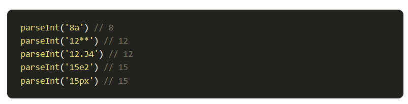

看见了吗，不管你传入了什么参数，只有数字才能出来。这个parseInt的特性我们需要记住。

与此同时，parseInt还支持进制转换，需要传递第二个参数

我们在上面接触到的

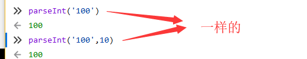

实际上是一样的，第二个默认参数为10，就是默认以10进制的方式去解析

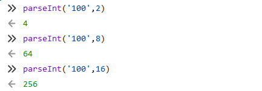

当我们把字符串100分别用二进制，八进制，十六进制去解析的时候，都返回了不同的十进制结果。

注意，我们需要了解到的是错误机制，如果解析的是无法转换的数字，或者是错误的进制，会返回什么？

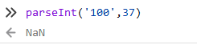

这便是parseInt()方法的解析作用。

---

2）parseFloat() 

`parseFloat`方法用于将一个字符串转为浮点数。

这个，感觉无需多言，如果处理的数字是小树的时候，就把parseInt换成parseFloat

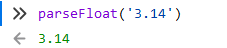

对于parseFloat()方法值得关注的是，支持科学记数法的转化

如果字符串符合科学计数法，则会进行相应的转换。

当然了，parseFloat()与parseInt()一样的是，都能暴力提取出来

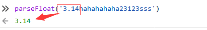

#### 4.格式化操作

需要介绍以下六个方法

1)toExponential

采用指数计数法格式化数字

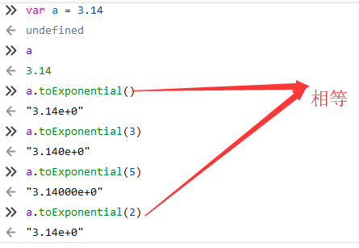

看到了吗，toExponential()实际上就等于toExponential(2)

此方法统一转化为指数计数法，默认为小数点后2位，括号内是多少就格式化成多少位

---

2)toFixed

采用定点计数法格式化数字

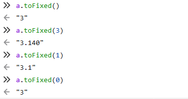

说法粗糙点，就是指定小数点后有几位数字，toFixed()默认是toFixed(0),只返回整数部分。

---

3)toLocaleString

把数字转换为指定格式的字符串

注意，**这个toLocaleString()属于高端操作**

https://devdocs.io/javascript/global_objects/number/tolocalestring

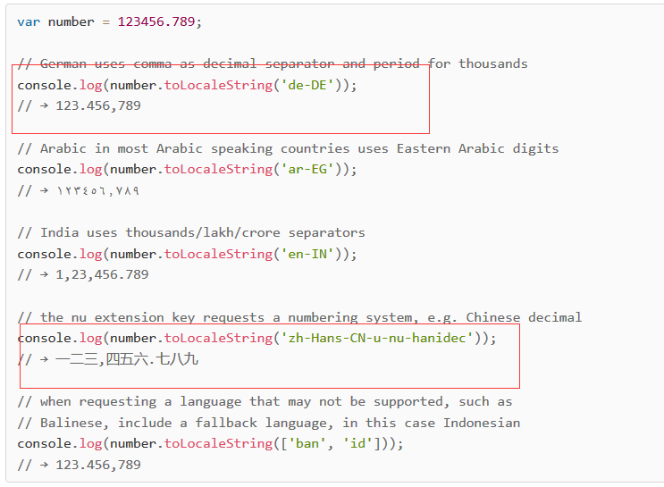

我们只需要做了解即可，我们就拿那个中文翻译来撸

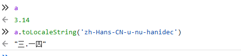

---

4)toPrecision

格式化数字的有效位

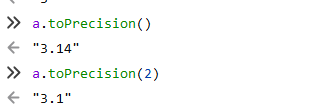

这个就比较简单了，推荐采用这个方法，toPrecision()默认的就是变量本身值

需要规范的时候，传入多少数字，就只有几位数

唯一需要注意的是，会把整数计算进去。

所以，**toPrecision推荐指数为4星**

---

5)toString

转换为字符串

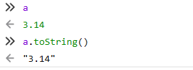

这个就不必多言。

---

6)valueOf

返回原始数值

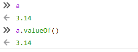

#### 5.判断类型

1）isNaN()

这个是最经典的，需要加深记忆理解

`isNaN`方法可以用来判断一个值是否为`NaN`。

什么意思呢？

**NaN的概念是什么？Not a Number，非数值**

当你传入的东西不属于数值的时候，你可以得到true

但是，我们需要知道的是，isNaN跟上面的parseInt()一样具有强制性

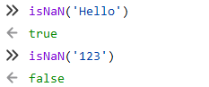

**它是具有强制性的，会尝试转换到数值类型，如果能依旧返回false**

所以任意类型的东西都有可能返回false，只要里面是数字，只要能被转换为数值。

`isNaN`只对数值有效，如果传入其他值，会被先转成数值。

比如，传入字符串的时候，字符串会被先转成`NaN`，所以最后返回`true`，这一点要特别引起注意。

也就是说，`isNaN`为`true`的值，有可能不是`NaN`，而是一个字符串。

---

2）isFinite()

`isFinite`方法返回一个布尔值，表示某个值是否为正常的数值。

我们在上面不是学到了特殊的数值吗，他们并不是正常的数值

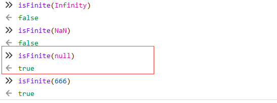

可以看到前面两个都返回false，因为是特殊数值，而非正常数值

引起注意的是null为什么能返回true呢？我们再来看看与null组成一对的undefined

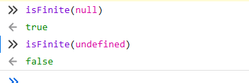

前者返回true，后者返回false。我们会在下面来学习一下这两者的区别进行深究。

## 二.boolean

布尔值两个代表且只有两个代表，真和假

真->用关键字true来表示，假->用关键字false来表示。

#### 1.运算符返回布尔值

前置逻辑运算符：！(作用就是非，Not)

判断运算符：=== , !== , ==, !=

比较运算符：>, >=, <, <=

这些运算符都会返回布尔值的结果。

#### 2.创建Boolean对象

Boolean()能够支持传入条件语句进行判断真与假

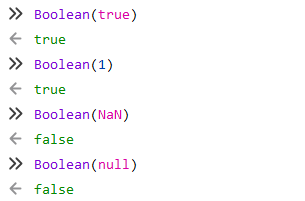

同样的是，Boolean()也能被用来嵌入进一步判断

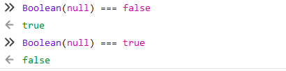

#### 3.特殊情况

我在这儿直接放出一个列表

- undefined
- null
- false
- 0
- NaN
- 空字符串

就这些东西，记住，直接返回false

但是有**两个特殊情况，请不要陷入Python学习的思维误区**

在python中，[ ]，{ }在布尔表达式里面会返回false，因为里面是空的，是根据元素来判断

但是在javascript并不是，他是根据对象来判断

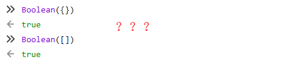

**javascript认为[ ] 和{ }是有效的数组对象，所以会返回true。**

## 三.string

#### 1.表示方式

当然是喜闻乐见的双引号或者单引号了

如果有多行字符串，使用\n换行符进行连接

需要注意的是，ES6标准：用反引号，+连接。

下面有ES6标准的对比例子可以参考：

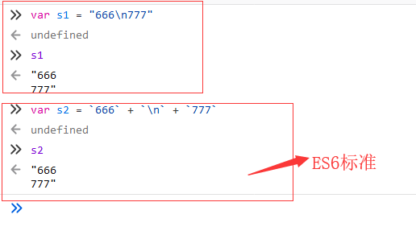

要了解到，ES6中还可以这么写，知道有这个标准就足以了。

但是，这个标准有个很强大的功能，支持键盘换行，采用反引号。

#### 2.引入拼接

还记得在python中我们可以引入拼接字符串吗？

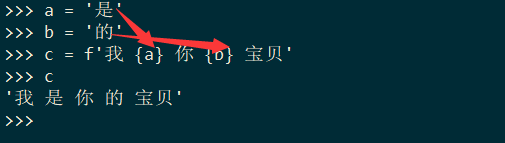

就这样，引入拼接成了字符串。

在javascript中同样也支持这个引入拼接的方式，但是需要$这个符号来引入

咦，居然行不通，然后我去百度了一下，这是E36的标准，需要使用反引号才能引入拼接

于是就把单引号修改成反引号

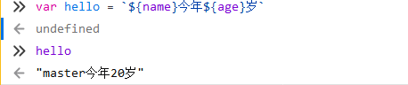

这样一来，我们也完成了字符串的引入拼接，正是ES6的标准提供功能。

#### 3.常用属性

最经典的属性还是legnth，返回字符串的长度

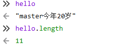

接下来你看到的都是String对象的知识，操作属性

学习的文档链接地址：https://wangdoc.com/javascript/stdlib/string.html

`String`对象是 JavaScript 原生提供的三个包装对象之一，用来生成字符串对象。

在学习之前，我们可以了解以下String对象的静态方法，就是输入代码数字返回相应的字符

##### String.fromCharCode() 

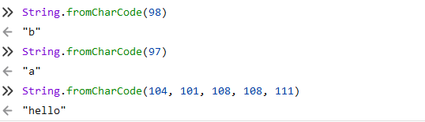

从97开始，就是a后面的26英文字母了，为什么是这样的编号呢，请参考ASCII编码。

---

##### charAt()

`charAt`方法返回指定位置的字符，参数是从`0`开始编号的位置。

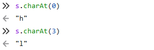

在其他编程语言中，这叫索引，肯定是从0开始的。

---

##### charCodeAt()

`charCodeAt`方法返回字符串指定位置的 Unicode 码点（十进制表示），

相当于`String.fromCharCode()`的逆操作。

我们在上面正好介绍了fromCharCode()方法，无非是反过来而已

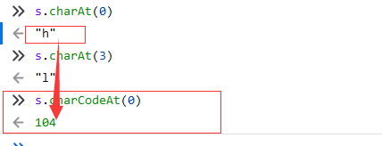

h在ASCII编码中就对应着104。

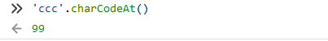

这个也需要理解，当charCodeAt()没有传递参数的时候，就默认为第一个字符。

---

##### concat()

`concat`方法用于连接两个字符串，返回一个新字符串，不改变原字符串。

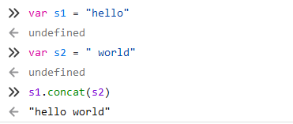

后面追加字符串的操作吧，连接在一起

当然，还可以多个参数添加

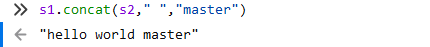

需要注意的是，concat()方法同样也有强制性：

**如果参数不是字符串，`concat`方法会将其先转为字符串，然后再连接。**

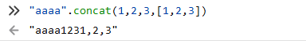

可以看到不但可以拼接数字，还能拼接列表，都是能转化为字符串的对象。

这时候，我突发奇想，这个转化究竟是暴力的还是欺软怕硬的？

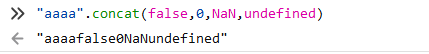

**行吧，concat是暴力转换，无视任何类型**

---

##### slice()

`slice`方法用于从原字符串取出子字符串并返回，不改变原字符串。

它的第一个参数是子字符串的开始位置，第二个参数是子字符串的结束位置（不含该位置）。

这是一个不错的提取方法，图解理解更好

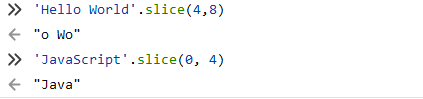

就是不要弄错索引是从0开始的，就OK了。

当然，也可以只传一个数字，那就是从那个数字的索引往后遍历

幸运的是，与python中的切片一样，支持负数倒过来遍历

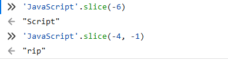

当然了，无效的参数，比如第一个参数大于第二个参数的话，统统返回空字符串，代表失败

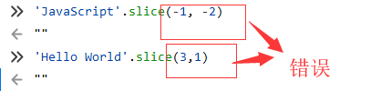

可能我们会遇到substring()这样的方法，与slice()功能很类似

但是由于某些规则违反直觉，因此不建议使用`substring`方法，应该优先使用`slice`。

所以不再对substring()进行介绍。

---

##### substr()

`substr`方法用于从原字符串取出子字符串并返回，不改变原字符串，跟`slice`和`substring`方法的作用相同。

`substr`方法的第一个参数是子字符串的开始位置（从0开始计算），第二个参数是子字符串的长度。

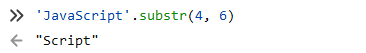

所以我们一路学下来，可以得到三个提取字符串的方法：

slice()，substring()，substr()，都是不改变原字符串的提取，我们需要知道的是，

尽量使用slice()或substr()，不使用substring()。

---

##### indexOf()，lastIndexOf() 

`indexOf`方法用于确定一个字符串在另一个字符串中第一次出现的位置，返回结果是匹配开始的位置。

如果返回`-1`，就表示不匹配。

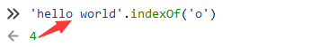

返回了索引4，代表着第一次出现的o的索引位置

如果找不存在的会返回-1

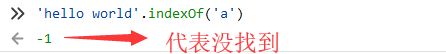

当然，可以传递第二个参数，代表搜索的起点：

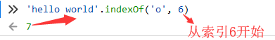

需要强调的是，**虽然indexOf()从索引6开始寻找o，但是找到的o返回的值是基于原字符串的索引值**

`lastIndexOf`方法的用法跟`indexOf`方法一致，主要的区别是`lastIndexOf`从尾部开始匹配，`indexOf`则是从头部开始匹配。

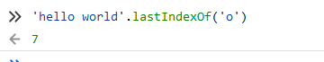

很好理解啊，就是从尾部开始往前寻找，但是印证了上面加粗的话是:

**返回的结果仍然是基于原字符串的索引值**

另外，`lastIndexOf`的第二个参数表示从该位置起向前匹配。

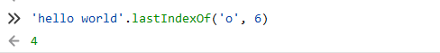

从倒数第六个索引值开始往前搜寻。

---

##### trim()

`trim`方法用于去除字符串两端的空格，返回一个新字符串，不改变原字符串。

这个方法，是否想起来了python中的string？也是不影响原字符串

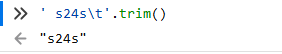

由这个例子我们可以得出来的是：

该方法去除的不仅是空格，还包括制表符（`\t`、`\v`）、换行符（`\n`）和回车符（`\r`）。

---

##### toLowerCase()，toUpperCase() 

`toLowerCase`方法用于将一个字符串全部转为小写，`toUpperCase`则是全部转为大写。它们都返回一个新字符串，不改变原字符串。

​	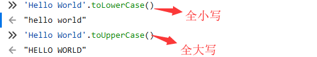

---

##### match()

`match`方法用于确定原字符串是否匹配某个子字符串，返回一个数组，成员为匹配的第一个字符串。如果没有找到匹配，则返回`null`。

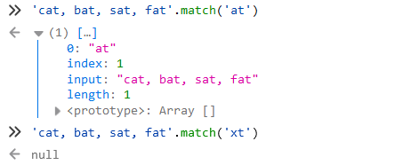

就是说，会返回一个找到东西的列表。

---

##### search()

`search`方法的用法基本等同于`match`，但是返回值为匹配的第一个位置。如果没有找到匹配，则返回`-1`。

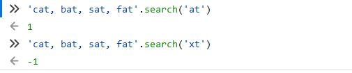

看明白了吗，search只负责有没有，找到一个就返回，返回的是什么呢？

**search返回的是找到目标的索引值的位置**

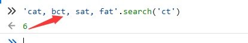

这样结合图片来看，是不是更好的理解了search返回的是什么东西了？

---

##### replace()

`replace`方法用于替换匹配的子字符串，一般情况下只替换第一个匹配（除非使用带有`g`修饰符的正则表达式）

放图片才是最好的理解方式

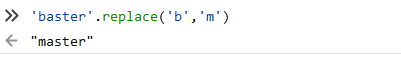

但是呢，只能使用一次替换，下面的图片中，hehe没能换成haha

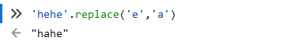

---

##### split()

`split`方法按照给定规则分割字符串，返回一个由分割出来的子字符串组成的数组。

咳咳，有过python基础的还是非常好理解的……

根据split()传入的'|',进行分割，得出来a，b，c

如果我不传参数呢？

如果分割规则为空字符串，则返回数组的成员是原字符串的每一个字符。

不传参数就默认成拆分所有的字符

再放一个经典的案例吧：

以点拆分成三个结果。

---

##### localeCompare()

`localeCompare`方法用于比较两个字符串。它返回一个整数。

如果小于0，表示第一个字符串小于第二个字符串；

如果等于0，表示两者相等；

如果大于0，表示第一个字符串大于第二个字符串。

对图做一个了解，比较字符串大小的功能。

---

##### includes()

includes()方法返回布尔值，表示是否找到了参数字符串

就是检查里面是否有相应目标的功能，比较常用。

---

##### startsWith()、endsWith()

这两个方法都返回布尔值，就是用来判断开头或者结尾是不是相对应的。

---

##### repeat()

repeat()方法返回一个新字符串，表示将原字符串重复n次

说到重复，我们能够想到python中的重复字符串方法

javascript竟然不支持这个方法，那好吧，还是使用repeat()方法看看咯

这便是javascript的一个通用重复字符串的方法。

## 四.null与undefined

在上面，我是不是布置了一道很有意思的题

为什么一个返回的是true，另一个返回的是false？

`null`与`undefined`都可以表示“没有”，含义非常相似。将一个变量赋值为`undefined`或`null`，

老实说，语法效果几乎没区别。

但是细微的区别到底出在了哪儿呢？

#### 1.null

`null`表示空值，即该处的值现在为空。

调用函数时，某个参数未设置任何值，这时就可以传入`null`，表示该参数为空。

比如，某个函数接受引擎抛出的错误作为参数，如果运行过程中未出错，那么这个参数就会传入`null`，表示未发生错误。

**值为空，不是一个全局的标识符**

#### 2.undefined

`undefined`表示“未定义”。

1995年 JavaScript 诞生时，最初像 Java 一样，只设置了`null`表示"无"。

根据 C 语言的传统，`null`可以自动转为`0`。

但是，JavaScript 的设计者 Brendan Eich，觉得这样做还不够。

首先，第一版的 JavaScript 里面，`null`就像在 Java 里一样，被当成一个对象，Brendan Eich 觉得表示“无”的值最好不是对象。

其次，那时的 JavaScript 不包括错误处理机制，Brendan Eich 觉得，如果`null`自动转为0，很不容易发现错误。

因此，他又设计了一个`undefined`。

区别是这样的：

**null`是一个表示“空”的对象，转为数值时为`0`；`undefined`是一个表示"此处无定义"的原始值，转为数值时为`NaN。**

所以，undefined的出现，大大完善了错误机制。

**全局标识符，表示初始值未定义**

#### 3.两者的异同

在上面我们就已经获取到了这道题的答案

产生这样现象的根本原因是：

null`是一个表示“空”的对象，转为数值时为`0`；`

undefined`是一个表示"此处无定义"的原始值，转为数值时为`NaN。

不如我们再强化一下这两句话的概念：

当然，这两者也有一点相同的：

如果不用严格相等运算符的话，这两者其实是算相等的，因为两个都是”没有“的意思。

## 五.数据结构Map

Map是javascript的一个数据结构，是一组键值对大的结构，具有非常快的查询速度

就是K=V编程论

#### 1.基础概念

Key值支持多种类型

按插入顺序排列

通过这个方式，我创建了一个map的对象

还能查看map对象的大小

我们现在创建几个K=V的对象进去，使用set方法

我添加了三对键值进去，值有字符串，数字，列表等，这是一个典型的K=V数据结构

#### 2.实战理解

在我们添加了多个键值对的时候，我们总有自己的查询手段

有直接查询所有键，直接查询所有值。

最后就是get方法获取键的值。我们再用一下m.size看看空间大小

这儿我要介绍一个很有意思的遍历方法，forEach：

咦？怎么反了，所以我们尝试一下把前面的k和v换个位置

但是呢，我花了那么长时间在写前面的String对象操作方法，能不能活学活用呢，比如用ES6的反引号标准

我又成功的复习了一遍ES6标准的字符串引入拼接。

这儿，我们需要认识到const是什么

const定义的变量不可以修改，而且必须初始化。

换句话说，const定义的东西是常量，必须初始化赋值。

我们可以发现，只有const报错了，这便是常量的定义，必须初始化赋值。

所以养成个习惯，用const来创建map对象是个不错的选择：

当然了，一直使用set来麻烦了，不如就在开头一次性创建好，用的就是列表方式

当然了，有创造必有毁灭，毁灭的方法是clear()

直接清除掉了map对象的所有的键值对。

## 六.数据结构Set

#### 1.基础概念

注意，此Set并非上面讲到的set！

上面的set是Map.set()，添加键值对的方法！

这儿的Set是javascript的一个数据结构，是一组key的集合，存储唯一值。

创建一个set对象也易如反掌

添加的方法，map的是set，而set的是add

注意，存储唯一的值，如果反复添加也不会出现重复的元素的

支持添加任意类型的元素，数字，字符串，列表等等

#### 2.实战理解

delete()：删除某个元素

has()：查询里面是否有这个元素

size：set对象的空间大小

clear()：清除掉所有的值

## 七.symbol对象

#### 1.什么是symbol

很显然，这是ES6的标准带来的产物

是一种新的类型，得到一个唯一的值。

参考文献:http://es6.ruanyifeng.com/#docs/symbol

产生的原因：

于是：

ES6 引入了一种新的原始数据类型`Symbol`，表示独一无二的值。

它是 JavaScript 语言的第七种数据类型，

前六种是：`undefined`、`null`、布尔值（Boolean）、字符串（String）、数值（Number）、对象（Object）。

生成的方法：

尝试效果：

为了验证它的唯一性，我再创建一个一样的s1，并进行判断

通过这个，我们能够很好的理解symbol对象的独一无二的特性。

#### 2.symbol可以发挥的作用

我们先创建一个字典

这样就能得出来了一个关于学生信息的字典。

但是我们要反思一下，接下来的身份证和学号，应该怎么创建呢？

身份证和学号是不是独一无二的？

所以我们需要使用symbol()对象来创建

通过这个简单的创建，我们是不是创造了一个非常严格的学生字典？

里面的身份证和学号都套上了Symbol()对象，确保了唯一性，也方便了数据库的检索。

## 八.object对象

#### 1.概念

obj对象是一种无序的集合数据类型，由若干个键值对组成。

对象是属性的容器，每个属性都有名字和值，用k=v对应关系表示，逗号隔开

对象是无类型的，可以自定义。

对象可以嵌套，既对象包含对象，但不建议超过太多层。

所有的属性都是字符串，属性可以动态添加。

#### 2.创建

可以var或者const直接创建

我们稍微注意一下k的有无引号之分

我们可以看到，无论以哪种方式创建，k遍历出来都是无字符串形式的

所以我在这儿写个建议，以后创建K=V统一使用.去创建

当什么情况会需要考虑到使用[ ]去创建呢?

看到了吗，当你碰到这个情况的时候，你再去使用[ ]去完成创建。

但是我们获取值的时候，也不会这么顺利

所以，读取V值的时候，只能用列表方式去创建的，当然也只能用列表方式读取。

当然，修改V值很简单，直接再次复制修改即可

#### 3.原型

原型对象prototype，是个标配对象

委托：属性通过原型链网上查找，Object.prototype没有的属性，会产生undefined。

这个就很像python中的defaultlist，查询没有的K，产生的V值有个默认值

想知道这个原型对象藏在哪儿吗？

都是Object的底层对象。

当然，有个判断K值对象是否存在的方法，是hasOwnProperty()，不检查原型链

删除K值就是delete，也不涉及原型链的对象

需要啰嗦的是，**只能列表方式创建的K=V，读取也只能列表方式，最后删除也是只能列表方式。**

#### 4.全局变量

在javascript中，全局变量是一个非常重要的概念

就是说，对象里面嵌套对象，创造了一个命名空间

这个命名空间，唯一可用，灵活可读

## 九.array对象

`Array`是 JavaScript 的原生对象，同时也是一个构造函数，可以用它生成新的数组。

#### 1.声明

你所需要知道的两种创建数组对象的方法

有编程基础的应该知道，怎么添加数组元素

数组名[索引]  = 元素

#### 2.特性

1）可以存储不同的数据类型的元素。

我们可以看下创造数组的typeof结果：

由此我们可以突发奇想，既然是object对象，那可不可以插入K=V数据类型

确实可以，所以我们能够得出来

array对象具有非常的灵活性，可以插入数字，字符串，列表，甚至K=V数据类型等等。

---

2）数组的长度可变。

咦，我明明在上面插入了个K=V，为什么长度没变？

原来，上面的K=V只是变成了array的属性，而非元素，所以K=V并不是数据类型元素。

需要纠正下上面的笔记错误。

当然了，这个小节的名字是数组的长度可变，不妨我们试试看

当我设置为3的时候，果然删掉了后面多余的东西，只留下前面的三个

顺便看一下K=V是不是真的成了属性

果然还在。

但是如果我强行把长度改回去呢？会发生什么

javascript会给出空槽来占座位，满足length的长度。

---

3）数组的索引可以是数字，也可以是字符串。

这个想都不用想，索引的字符串肯定是指K=V的创建啊

可以支持属性的增删。

---

4）可以是多层嵌套。

length长度值自然就是3。

#### 3.方法

##### concat()

concat()连接数组

concat()在前面就已经遇见过很多次了，拼接作用。

---

##### join()

join()将数组元素连接起来以构建一个字符串

在python中我们是接触过join()函数的，思维非常类似

来看看默认的join():

现在我们使用-符号来连接数组的各个元素

---

##### pop()

pop()删除并返回数组的最后一个元素，对比delete

pop()默认弹出最后一个元素，能改变原数组

---

##### push()

push()给数组添加元素，同数组名[索引]  = 元素

在后面追加元素。

但是如果数组里面如果数不过来索引，该怎么添加到后面？

**一个小技巧，使用array.length的方法，自动等于新添加元素的索引**

---

##### reverse()

reverse()颠倒数组中元素的顺序

与concat()不同的是，reverse(),pop()都能改变原数组。

---

##### shift()

shift()将元素移除出数组

shift()与上面的pop()是一对，两者都返回弹出去的值

前者默认弹出第一个，后者默认弹出最后一个，

都改变了原数组。

---

##### unshift()

unshift()在数组头部插入一个元素

这个与shift()是欢喜冤家，前者是头部插入，后者是头部弹出

但是我们需要关心的是，unshift返回的是什么？

我们可以看得出来，unshift()返回结果是插入后的数组length长度。

---

##### slice()

slice()返回数组的一部分

在上面的字符串中我们就接触过slice()了

原理与String.slice()差不多，都是切片行为

---

##### sort()

sort()对数组元素进行排序

创建一组字母数组：

可以知道的是，sort()完成了排序，也改变了原数组。

---

##### splice()

splice()插入、删除或替换数组的元素

这个方法很不好理解，耐心看

这是删除的方法：

这是修改的方法：

当然了，可以把指定的位置，修改成多个元素：

---

## 十.逻辑判断语句

#### 1.运算符

1）算数运算符

+、-、*、/、++、--

---

2）赋值运算符

=、+=、-=、*=、/=、%=

---

3）比较运算符

== 相等运算符，只要求内容相同

=== 严格相等运算符，要求类型和内容均相同

---

！= 不等于

！==  只有内容不相等或类型不相等

< = 、> =、>、< 

---

4）逻辑运算符

或 |

非 ！

&

|

---

5）条件运算符

if……else

(a === b)?x:y

#### 2.循环语句

1）记得学会刹车

break语句：跳出当前循环

continue语句：停止当前条件回到循环开头

---

2）do……while语句

一直重复，直到条件为假

至少执行一次

---

3）while语句

条件为真，就一直执行

可能一次不执行

---

4）switch语句

while循环的另一种表现形式。

---

5）for语句

这是一个最典型的例子，for()括号内需要两个分号，完成整个for循环的逻辑

现在定义一个数组加强理解

---

6）for……in语句

当然了，我们可以采取一种不错的方式直接采取数组元素的遍历

但是呢，这未免也太麻烦了，为什么不能直接取出来遍历呢

这就要往下看了。

---

7）for……of语句

将列数组元素取出来遍历

在可迭代对象上创造了一个循环。

为什么for in 是读取数组元素索引，而for of是直接拿出取值呢？

这还是要知道数组的K=V属性

我们可以理解成，for in  读取数组的K，for of 读取数组的V。

在今后数组的遍历中，我们便常常使用for……of来遍历输出。

---

8）object对象的遍历方法

首先定义个object对象

一个是for……in来遍历输出

另一个是for……of来遍历输出

一定要弄清楚for……in与for……of在遍历object对象的时候操作的异同。

