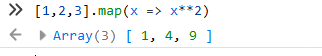
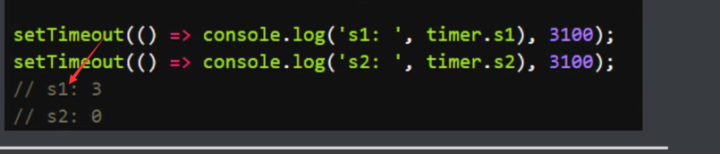
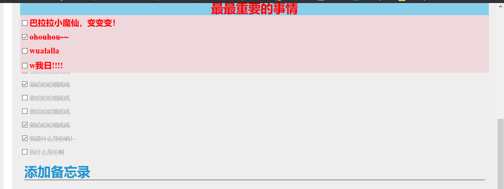

# 和JavaScript的函数与方法一决死战

## 一.函数与方法

#### 1.声明与调用

##### ①定义一般函数

一定要记住，如果你想采用引入拼接字符串的功能，请勿忘记这是ES6的功能，采用反引号！

根据上面可得，我们总结出来一般函数的定义方式：

##### ②定义匿名函数

所谓匿名，就是没有函数名字

就是()()这样的结构，一次性调用，这是给某些只运行一次的函数功能准备的，如果要使用，应该是这样

就是这样，免去了定义函数的麻烦，给一次性的功能提供了个很好的存放空间。

##### ③函数赋值到变量

这个定义方法我们已经是非常熟悉的了，也是现在所最为广泛的定义函数方法

这个肯定秒懂啊，就是给函数起个名字，存储到一个全局变量去任意调用，使用var声明：

这样就完成了两次调用。

##### ④函数赋值给对象

这是一个比较少见的复制方法，用来处理对象本身

首先我们需要定义一个对象出来

通过这个方法，我们可以对对象进行二次处理，输出全大写的结果

当然，也可以自己修改一下

##### ⑤函数作为参数

这个就不好理解了，我会使用到map方法，来对函数进行处理

相当于map()原生函数里面套一个自定义函数的方法：

map方法就是对数组的所有元素进行遍历函数化处理，就是说将一个个元素放到函数去运行。

同样，我们在上面就接触到，函数能赋予变量，我们就把结果传到了newList变量，得到了一个新的数组结果。

不过，既然讲到了map()，就怎么能少得了reduce()方法？完成多个数组进行累加得到最后一个结果

就是将所有数组的元素，一个个累加起来处理，这便是reduce的作用，从最初的多处理到最后的一。

##### ⑥函数作为返回值

有过编程基础的都知道，这个是常规的操作，一个函数处理完后return到下一个函数继续处理

所以这个不难理解

我定义了两个函数，第一个函数进行打印信息，然后返回到下一个函数进行求面积。

最后我调用第一个函数，将结果送到控制台去打印。

这个不难理解吧！！！

#### 2.各种参数

##### ①默认参数与形式参数

要知道，默认参数就是在函数定义中已经赋值好的变量名

这样在调用函数的时候，可以不赋值进去默认参数。

非默认参数就等于形式参数。

注意:默认参数必须放到最后，形式必须放在默认参数的前面，这是考虑到函数调用参数的顺序。

如果我直接调用函数呢？

输出就会报错，但是默认参数依旧显示，这说明形式参数必须传值进去。

怎么样解决这个现象呢？那就是都设置成默认参数

这样一来，就能正常显示了，修改参数更方便

但是，赋值参数的顺序可千万不能搞错。

##### ②剩余参数

但是有时候，我们无法设置那么多形式参数或默认参数，如果参数过多，应该怎么办呢？

我们先来看看下面的形式：

arguments自动接收参数，建立起索引，从0开始存储到Iterator对象，是一个不错的方法。

但是如果想从根源上解决无穷个参数怎么办？

那就是all登场了：

看到了吗？这就是无限参数的设置，给函数传递一个...all参数即可。

既然我们看到了all参数是个列表，不如我们趁热打铁，一口气设计出一个简单的算法题

就是无论多少个参数传递进去，计算它们的总和？

这个简单的算法题，不难吧？

#### 3.属性方法

当然了，函数是可以再次赋值的：

但是呢，再怎么赋值，原生对象是不会变的，用name查看原生函数 叫什么名字：

当然，还有显示函数内容长什么样子的方法：使用toString方法：

这个方法可以看到函数内容是什么。

当然，还有统计函数里面有多少个参数的方法：

但是我们发现learnJS函数是0参数，这说明什么，默认参数不统计进去

所以函数的这个length方法只能统计有多少个形式参数。

## 二.变量解构赋值

#### 1.解构赋值

从数组和对象中提取值，对变量进行赋值。这被称为解构。

这个就是最基础的解构了，能明白吧，就是变量放入数组或对象，

然后我们只需要输入变量名就能获取到它们的值，这就是一个最简单的解构过程。

不可采取变量丢失，如果不需要的话，应当多写一个逗号来完成占位对齐，完成解构。

这个解构呢，是不是很像上面所接触到的形式参数和默认参数。

不只是中括号可以解构，大括号也可以完成解构，解构的是对象类型。

	

现在有一个比较广泛的变量解构，比较有意思

还能对变量长度进行解构：

#### 2.综合解构

这个变量结构可以与函数进行结合使用，返回数组：

当然了，最重要的还是返回对象：

当然了，要时刻注意的是，数组使用中括号，对象使用大括号，所以要时刻弄明白这两者的异同。

## 三.作用域

#### 1.全局变量

全局变量：在函数之外定义的变量，函数内部可以访问。

这是一个简单的全局变量设置，现在我们拿到函数里面直接使用，验证全局性

#### 2.局部变量

局部变量：在函数内部定义的变量，只能在函数内部访问，外部无法访问。

这个就是一个简单的局部变量定义，但是我们拿到外面来呢？

其实想要分清楚全局变量和局部变量也很简单，一般来说：

在函数内定义的变量都是局部变量，无法拿到函数外面来使用。

#### 3.全局作用域

1）最外层函数在最外层函数外面定义的变量具有全局作用域

2）所有未定义直接赋值的变量自动声明为拥有全局作用域

意思就是说没有通过var声明的变量，自动转为全局变量

效果图下：

所以这告诫我们，变量的声明与赋值一定要遵守规范。

3）所有window对象的属性拥有全局作用域

#### 4.局部作用域

其实，局部作用域有另外一个名字，就叫做函数作用域

**定义一个函数的同时，就创建了一个函数作用域**

有三个小规则如下：

1）内部定义的变量不能在函数外部访问

这个就是上面讲到的局部变量。

2）嵌套的作用域变量从当前作用域往上寻找声明，找不到则报错

虽然再怎么嵌套，但是寻找声明的时候是嵌套函数所在的作用域

而不是嵌套函数定义出来的作用域

这样解释就明白了吗？

**嵌套函数虽然创建了个小作用域，但是寻找声明是基于所在的作用域的。**

3）函数执行时所在的作用域，是定义时的作用域，而不是调用时所在的作用域

这句话表面很高深奥妙，结合几张图就能明白了：

先定义一个函数，未调用的，因为我们要拿到下面去调用，来理解这句话

现在调用f()函数，最终的输出结果，是不是2？调用x()之前我把aa修改成2了？

其实，最终的输出是1。

为什么呢？因为x()函数调用的时候，作用域就切换到了x()函数本身的作用域了，所以不会受到上面var aa = 2;的影响。

关于作用域的这三个规则，你值得牢记和拥有。

#### 5.两者之间的关系

1）在函数内部，局部变量的优先级高于同名的全局变量。

2）定义在全局域中的函数可以访问所有定义的全局域中的变量

#### 6.块级作用域

##### 1.let

1）let声明的变量只在代码块有效

我们先来复习一下var声明在代码块的特点

这样能够帮助我们区分作用域和代码块的区别。

代码块一般是用{ }来组成，所以我下面在写个let例子

拿到外面来使用的话就会报错：

2）let声明的变量不存在变量提升

我们先拿var来做例子，因为var可以支持变量提升

这样以来，这个n就从函数里面的局部变量提升到了全局变量。

现在我们再来看看let的变量提升

使用let去尝试变量提升的时候，代码直接报错了，这说明let不支持变量提升。

那么问题就来了，到底什么是变量提升呢？我们来看看百度给出的结果：

    定义：函数声明和变量声明总是被JavaScript解释器隐式地提升(hoist)到包含他们的作用域的最顶端。
    
        通过定义我们可以知道，只有变量的声明和函数的声明存在变量提升这一说，那么在ES6出现之前，JavaScript声明变量的方式是通过关键字var实现的，声明函数自然通过function啦，ES6中我们用let，const来声明变量和常量。
也就是说，javascript解释器存在隐式提升的功能，把变量声明提升到作用域的最顶端？

但是返回的结果却是undefined，也许我们只能这样理解：

**隐式提升，只声明不赋值，完善代码的错误机制**

3）不能重复声明

直接拿来上面的图：

var声明的是可以重复的，但是let声明的并不允许重复：

##### 2.const

const关键字我们在前面就已经接触过了

就是强制赋值，赋值完毕后，const的变量就变成常量，不再允许修改。

但它本身可以作为块级作用域，可以在新的作用域中去使用。

##### 3.变量提升

我们们首先可以来一个例子，加深对var变量提升的理解

我们可以看到，即使是没声明tmp变量，还是不影响代码的运行。

我们得出一个结论：

**var支持变量提升，无论在哪里，先提升上去声明一下，再具体看看赋不赋值。**

但是我们来看看for循环中，变量提升带来的问题：

所以变量提升也不是好事情，能带来全局变量污染。所以for循环最好使用let

毕竟let没有变量提升，单纯的只在代码块里面生效：

#### 7.this关键字

我们在今后的js编程中，会以很高的频率接触到thsi关键字。

1）直接被调用的函数，this为全局对象

2）被某个对象调用的函数，this为当前对象

这两句话非常好理解吧，就是在函数里面的this，指的就是函数本身对象

如果遇到一般函数，未赋值对象的，就是全局对象

​	

#### 8.闭包

闭包，你粗暴理解为：函数里面有函数。

由于在javascript语言中，只有函数内部的子函数才能读取局部变量，

因此可以把闭包简单理解成定义在一个函数内部的函数

闭包的用途:

1.可以读取函数内部的变量

2.让这些变量的值始终保存在内存中

注意，外层函数每次运行，都会生成一个新的闭包，而这个闭包又会保留外层函数的内部变量

所以内存消耗很大，因此不能滥用闭包，否则会造成王爷的性能问题

现在我们来看看一个最简单的闭包：

函数嵌套的过程，让打印的工作交给函数里面，然后在外层函数里面调用内层函数。

可以把闭包理解成爸爸函数做事偷懒，让儿子函数去做事情交给爸爸。

再来一个简单的累加闭包函数

在函数里面嵌套个function，作为二次调用。在二次调用的时候，值会加上1。这个过程非常像pyton里面的装饰器。

## 四.正则表达式

参考文档：

http://www.w3school.com.cn/jsref/jsref_obj_regexp.asp

#### 1.定义

RegExp 是正则表达式的缩写。

当您检索某个文本时，可以使用一种模式来描述要检索的内容。RegExp 就是这种模式。

简单的模式可以是一个单独的字符。

更复杂的模式包括了更多的字符，并可用于解析、格式检查、替换等等。

您可以规定字符串中的检索位置，以及要检索的字符类型，等等。

---

直接量语法：/pattern/attributes

创建regexp对象的语法：new RegExp(pattern,attributes);

1）参数pattern是一个字符串，指定了正则表达式的模式或其他正则表达式。

2）参数attributes是一个可选的字符串，包含属性'g','i'和'm'，

分别用于指定全局匹配、区分大小写的匹配和多行匹配。

---

正则表达式的用途：

1）验证表单：登陆注册验证

2）字符串操作：过滤，查找

#### 2.方法

1）修饰符

2）中括号

3）元字符

4）量词

5）RegExp对象属性

6）RegExp对象方法

7）支持正则表达式的String对象方法

#### 3.轮子

其实我们有现成的轮子可以拿，为什么不站在巨人的肩膀上呢？

这玩意，晚上一搜，哦吼，出来了

http://www.cnblogs.com/my-effort/p/6306706.html

直接拿现成的js代码

我们把这个js文件作为外部文件，在index.html文件中打开

引入的方式最好放在body的前面，因为代码毕竟是从上往下加载的

所以先让css外部样式表加载完，再加载js文件即可。

还是不错的选择，对于正则表达式，怎么说呢，基本的概念要懂

但是深入一点的表单验证不如就到网上拿，一大堆公式摆在上面。

## 五.原型与原型链

#### 1.瞎扯淡

我们终究是无法逃过原型链的学习，还记得这个东西吗？

其实你所创造的每一个对象都有一个原型链在里面，具体会起到怎么样的作用呢

那就往下看吧！

点开列表看看原型链的详细：

妈也，这部分的内容是不是太过于硬核了，我丢了几个我看的博客再说：

https://www.cnblogs.com/libin-1/p/5820550.html

https://www.cnblogs.com/chengzp/p/prototype.html

https://www.jianshu.com/p/dee9f8b14771

哪天再去研究一波，好在我还是个天才，都能看得懂开头

得出一个恐怖的结论：

prototype**是函数才有的属性；**

**__**proto__**是每个对象都有的属性；**

---

#### 2.prototype

我们创建的每个函数都有一个prototype原型属性。

使用原型的好处是可以让所有对象实例共享它所包含的属性和方法

换句话说，不必在构造函数中定义对象实例的信息，而是可以将这些信息添加到原型之中

这个不难理解吧？**没发现我们创建实例的时候都是直接调用创建的吗？没经过var声明。**

原型具有动态性，由于在圆形中查找值的过程是一次搜索，因此我们对原型对象的任何修改都能够立即从实例上反映出来。

但是需要注意的是，实例中的指针仅指向原型，而不是指向构造函数。

---

#### 3.\__proto__

当调用构造函数创建一个新实例后，该实例的内部将包含一个指针\__proto__,指向构造函数的原型

简单来说，当我们访问一个对象的属性时，如果这个属性不存在，那么就回去\__proto__里找，这个\__proto\__又会有自己的\__proto__,于是就这样就一直找下去，找到顶层为止。

---

#### 4.原型链

Javascript中描述了原型链的概念，并将原型链作为实现继承的主要方法

其基本思想是利用原型让一个引用类型继承另一个引用类型的属性和方法

每个构造函数都有一个原型对象，原型对象都包含一个指向构造函数的指针，而实例都包含在一个指向原型对象的内部指针

假如我们让原型对象等于另一个类型的实例，此时的原型对象将包含一个指向另一个原型的指针，相应地，另一个原型中也包含着一个指向另一个构造函数的指针

假如另一个原型又是另一个类型的实例，层层递进，就构成了实例与圆形的链条。

这就是所谓原型链的基本概念。

---

#### 5.实战

以上两张图直接读取我创建好的函数的prototype原型

接下来是根据函数的属性String()做一个原型函数：

当然了，我这个toString只是针对函数的实例，函数本身还是原来的样子

然后我们创建一个实例，让这个实例确实能使用上这个函数：

这样一来，这个函数的实例，能够使用上我自定义的toString方法，而不再是原生的toString方法。

呜呜呜，还有定义类的方法，新建对象调用的方法，太过于硬核，就不放在笔记了。

我只想说，根据我的粗暴理解，原型是可以自定义底层的方法的，比如toString()原生函数的显示方法就可以修改。

所以说，这些东西都是给实例准备的自定义功能的一个方式。

## 六.箭头函数

#### 1.定义

箭头函数使用类似于 => 这样的语法定义函数

支持表达式模式和语句模式

这是ES6的标准语法

我们先来看看一个普通的函数：

你想象不到的是，这个函数居然可以用箭头函数优化如下:

当然了，如果函数不需要参数，那就用括号代替：

我们再来一个案例，或许能够对箭头函数的应用更为理解清晰：

现在该怎么用箭头函数去简洁化呢？

验证箭头函数的可用性：

现在，能看懂箭头函数的方法了吗？就是变量-->函数参数-->返回值，进行优化而成的箭头函数。

当然，我们得考虑实际需求，如果后面是多行代码呢，那就用大括号括起来:

所以说，箭头函数确实是个好东西，是基于ES6标准的玩意。

我这儿可以举例两个简单的箭头函数应用，判断偶数和求平方：

const isEven = n => n%2 == 0;

const square = n => n*n;

#### 2.数组的箭头函数

我们在这儿会接触到六个有意思的结合数组箭头函数方法，都是可以了解学习的

1）forEach方法

forEach是一个输出元素的所有索引值方法，很奇怪的是，为什么不是0，1，2呢

原来我在数组中多加了一个逗号占坑，但是空值也不是有效的索引，所以虽然索引算数，但不会打印出索引值。

---

2）filter方法

总所周知，filter这个单词的意思是过滤，过滤条件是什么呢，是true

结合上面的例子来看，这个是不是相当于过滤掉了那些占坑的空元素?

---

3）every方法

话说在前，every方法是把每个元素都拿出来试试，相当于全部都要满足

来看看第一个红框，明显的是false啊，我们主要关注在第二个和第三个

第二个有空元素和a，经过every遍历之后返回true，这说明了空元素无效，不会送入true

第三个就是为了验证这个特性做对照物。

---

4）some方法

这个呢，就是与上面是一对，every是全部都要满足，而some是其中一个满足就行

---

5）reduce方法

我们在上面讲过reduce的方法，就是一个累项处理

---

6）map方法

map在上面也将过了，就是把数组每一个元素拿出来进行函数处理

为了确保箭头函数的便利性，我们拿一般的方法来对比一下代码量

所以还是箭头函数略胜一筹，不过我们要知道的是一般的方法永不过时

毕竟箭头函数是ES6标准的产物。

#### 3.作用域

箭头函数：作用域最大特点在于和父作用域一样的this，绑定定义时所在的作用域

普通函数：this实际上在函数被调用时发生的绑定，它指向什么完全取决于函数在哪里被调用

我在下面会放一个代码对比，验证箭头函数的优势性

首先需要打两个预防针：

serInterval()方法可按照指定的周期以毫秒计算来调用函数或计表达式，总结就是每过多少毫秒就调用一次，循环的过程。

setTimeout()方法用于在指定的毫秒数后调用函数或计算表达式，总结就是多少毫秒后调用函数，定时的过程。

接下俩就来看看作用域对比

来看看最终的结果：

只有箭头函数生效了。

所以箭头函数最大的优势就是this的作用域与父作用域一样的，跳出了普通函数作用域的局限性。

## 七.Ajax

#### 1.瞎扯淡

不得不说，Ajax稳妥妥地属于老黄历了

这个玩意还是直接看github文档吧，上面的老哥说话真的很好听

http://louiszhai.github.io/2016/11/02/ajax/

不得不说，这个老哥真的不错

坚持原著，坚持搬砖，写下了这些原创总结博客，真的太强了。

还有菜鸟教程的也很棒：

http://www.runoob.com/ajax/ajax-tutorial.html

哎，w3c能差到哪儿去……总统山级别的前端学习网站，走你！

http://www.w3school.com.cn/ajax/index.asp

既然后面两个是公认的官方文档，我就以第一位老哥总结的为准吧！

毕竟总结的才是最精辟的!

---

#### 2.浏览器为ajax做了什么

根据这位老哥所说的，我们就直接在浏览器试试：

就这样成功创建了ajax请求的对象，我们可以看到列表里面都是关键的东西

什么responseURL，responseText这些不都是浏览器请求准备的吗？

---

#### 3.js单线程机制

当然了，我们正在学习JavaScript，所以还是要回到正题，重点关注js引擎与ajax的配合

所以这个老哥得抛出了一个问题：ajax有没有破坏js单线程机制？

通常, 它们的线程间交互以事件的方式发生, 通过事件回调的方式予以通知. 而事件回调, 又是以先进先出的方式添加到`任务队列` 的末尾 , 等到js引擎空闲时, `任务队列` 中排队的任务将会依次被执行. 这些事件回调包括 setTimeout, setInterval, click, ajax异步请求等回调.

**浏览器中, js引擎线程会循环从 任务队列 中读取事件并且执行, 这种运行机制称作 Event Loop (事件循环).**

对于一个ajax请求, js引擎首先生成 `XMLHttpRequest` 实例对象,  open过后再调用send方法. 至此, 所有的语句都是同步执行. 但从send方法内部开始,  浏览器为将要发生的网络请求创建了新的http请求线程, 这个线程独立于js引擎线程, 于是网络请求异步被发送出去了. 另一方面,  js引擎并不会等待 ajax 发起的http请求收到结果, 而是直接顺序往下执行.

当ajax请求被服务器响应并且收到response后, 浏览器事件触发线程捕获到了ajax的回调事件 `onreadystatechange` (当然也可能触发onload, 或者 onerror等等) . 该回调事件并没有被立即执行, 而是被添加到 `任务队列` 的末尾. 直到js引擎空闲了, `任务队列` 的任务才被捞出来, 按照添加顺序, 挨个执行, 当然也包括刚刚append到队列末尾的 `onreadystatechange` 事件.

在 `onreadystatechange` 事件内部, 有可能对dom进行操作. 此时浏览器便会挂起js引擎线程,  转而执行GUI渲染线程, 进行UI重绘(repaint)或者回流(reflow). 当js引擎重新执行时, GUI渲染线程又会被挂起,  GUI更新将被保存起来, 等到js引擎空闲时立即被执行.

以上整个ajax请求过程中, 有涉及到浏览器的4种线程. 其中除了 `GUI渲染线程` 和 `js引擎线程` 是互斥的. 其他线程相互之间, 都是可以并行执行的. 通过这样的一种方式, ajax并没有破坏js的单线程机制.

看到上面的这段话，我们终究还是明白，ajax终究是遵循js的工作机制的，遵循事件循环，被加入任务队列等待被主线程提取执行。

通过这个课外阅读，我们能够进一步加深对js引擎工作机制的学习。

#### 4.拓展学习

这个文档肯定是要看完的，因为有太多请求很重要。

我就随便列举一些:

①statusText：

只读属性, statusText表示服务器的响应状态信息, 它是一个 UTF-16 的字符串, 请求成功且status==20X时, 返回大写的 `OK` . 请求失败时返回空字符串. 其他情况下返回相应的状态描述. 比如: 301的 `Moved Permanently` , 302的 `Found` , 303的 `See Other` , 307 的 `Temporary Redirect` , 400的 `Bad Request` , 401的 `Unauthorized` 等等.

②onloadstart：

onloadstart事件回调方法在ajax请求发送之前触发, 触发时机在 `readyState==1` 状态之后, `readyState==2` 状态之前.

③onload：

onload事件回调方法在ajax请求成功后触发, 触发时机在 `readyState==4` 状态之后.

④timeout：

timeout属性用于指定ajax的超时时长. 通过它可以灵活地控制ajax请求时间的上限. timeout的值满足如下规则:

- 通常设置为0时不生效.
- 设置为字符串时, 如果字符串中全部为数字, 它会自动将字符串转化为数字, 反之该设置不生效.
- 设置为对象时, 如果该对象能够转化为数字, 那么将设置为转化后的数字

⑤upload

upload属性默认返回一个 `XMLHttpRequestUpload` 对象, 用于上传资源. 该对象具有如下方法:

- onloadstart
- onprogress
- onabort
- onerror
- onload
- ontimeout
- onloadend

太多太多，这都是建立服务器交互和发送请求的必备知识。等有条件的时候，必将研究一番。

不要误会，我现在肯定是有学习Ajax的能力的，且看菜鸟教程的解释:

再来看看Ajax能够做什么？

## 八.异步操作

#### 1.promise

1）含义

Promise是异步编程的一种解决方案，比传统的解决方案-->回调函数和事件-->更合理和更强大

它由社区最早提出和实现，ES6将其写进了语言标准，统一了用法。

**原生提供了Promise对象。**

所谓Promise，简单说就是一个容器，里面保存着某个未来才会结束的事件的结果，

从语法上说，Promise是一个对象，从它可以获取到异步操作的消息。

Promise提供了统一的API，各种异步操作都可以用同样的方法进行处理。

**Promise的出现为异步编程提供了一种新的方式，把未来将用到的值当作对象。**

---

2）特点

对象的状态不受外界影响。

Promise对象代表一个异步操作，有三种状态：

**pending(进行中)、fulfilled(已成功)、rejected(已失败)**

只有异步操作的结果，可以决定成为上面某一种状态，任何其他操作无法改变。

状态具有不可逆转性，Promise对象的状态改变只有两种：

从pending变成fulfilled或者从pending变成rejected

注意，当这两种改变发生之后，状态就会凝固，不会再变，会一直保持这个结果。

这个保持结果的状态九成为resolved(已定型)。

---

3）作用

对延时和异步操作流程进行控制。

但是，Promise终究是个存储异步结果的容器对象，异步的操作交给谁呢？

就要介绍下面的async方法了

#### 2.async

1）定义

①Async函数声明：

async function foo() {}

②Async函数表达式：

const foo = async function() {}

③Async定义对象的方法：

let obj = {  async foo() {}  }

④Async箭头函数：

const foo = async() => {}

④

2）返回

操作结果返回poromises有两种情况：

①正常then-->fulfilled

②报错catch-->rejected

3）方法

使用await异步得到结果和错误

#### 3.代码

这儿有个不错的代码可以值得参考

https://baijiahao.baidu.com/s?id=1596005633332556077&wfr=spider&for=pc

简单定义一个Promise的异步函数

为了验证它们的异步执行性，我运行上面代码，却发现两条输出结果都是同时出来的

还有一个ES2017带来的async……await代码的编写方式，也能完成它的异步性

#### 4.module体系

1）概念：

模块体系，将一个大程序拆分成互相依赖的小文件，再用简单的方法拼装起来

ES6模块的设计思想是尽量静态化，使得编译时就能确定模块的依赖关系。以及输入和输出的变量

ES6模块不是对象，而是**通过export命令显式指定输出的代码，再通过import命令输入。**

一个模块就是一个独立的文件，export配合import进行使用

其实粗暴的理解就是一个js文件引入另外一个js文件的功能或变量。

首先我们定义个export文件，放入代码块

对比一般的js文件就是，代码块被引用的话前面加个export，然后在引入js文件的时候，开头声明import

接下来代码运行就好理解了吧？

## 九.双十一购物车

本次项目的目标是完成购物车的清空，当全选商品的时候，自动计算所有商品的总和

选中几个的时候，计算几个商品的总价格。

最后清空的时候，点击清空，所有商品信息被删除，购物车页面发生变化。

#### 1.知识要点

首先肯定要HTML5+CSS3完成购物车界面的设计

然后至于抓取商品价格或者选择抓取商品本身所有信息

需要接触到DOM知识，使用id或class抓取，或者元素名tag也可以

然后就是js函数的综合应用了，进行计算总价，商品清空。

#### 2.开发步骤

明确需求：计算商品价格总和，js控制清空

页面设计：HTML5搭建好结构，CSS3编写样式

JS控制：完成计算功能，清空商品的需求

#### 3.调试方法

F12谷歌控制台，一点一点的调试

#### 4.编写技巧

可以采纳flex布局，排列方式从上往下

或者grid布局，定义为严谨的网格系统，有利于删除

不过为了清空时方便删除，于是还是纯div。

#### 5.布局概览

包裹在section是为了方便嫁接到网页里面去。

#### 6.制作过程

html整体代码截图：

css代码部分截图：

最终页面设计搭建完成：

#### 7.控制阶段

我们现在对页面中某个商品的价格进行捕捉

捕捉到这个之后，该怎么样输入代码，得出最后的number形式的价格？

捕捉到价格之后，我们需要有一个统一数字形式的方式，以免后面某些商品会有小数点

所以这儿的parseInt应该改成parseFloat，然后使用格式化的方法

这样一来，我们就知道该如何抓取整数，以及计算后再格式化回去的操作了。

#### 8.逻辑控制

最后页面的效果就如下：

取消的时候就变成：

#### 9.完善功能

多个商品修改数量获得突破，使用数据结构的方法存储数组

然后就是细微操作的判断，是增还是减

最后再完善一下清除商品的功能，无非就是删盒子

#### 10.项目总结

从页面展示来说，当然也不能追求那么那么漂亮

主要是锻炼js逻辑的培养，如何写出富有逻辑的代码，才是正事

html的代码规范和css的样式是重点，许多人不重视布局的规范编写

结果呢？js逻辑控制的时候，一片混乱，无法做到统一性。

别说一个简单的全选，删除都无法实现，这就是html代码布局严谨的重要性。

htm5代码写好了，css样式才能写的舒服，像我这样

整整齐齐，只用这几句样式，就定义好了所有商品的摆放位置，所以基础的重视永远没有错，

基础越好，效率越高，控制越舒服，这就是html+css+js的整体性。

不过呢，我在js的开头写了这句话

也不知道浏览器哪来的毛病，我刷新一下还是要记忆我的复选框，所以我就加上了，

这个可能是我唯一的遗憾了，但我也就只能用这个数组的方法，去完成多个商品改变数量时的同步

利用数组去记忆旧value的值，然后弹出来

再对比是增数量还是减数量，最后得到正确的价格变化

在做全选按钮的时候，bug是真的多啊

一口气 遇到了三个bug吧，说明全选按钮也不是那么好驾驭的。

整体来说，收获还挺满意，更大的收获还是基础，干干净净的布局，干干净净的class赋值，事半功倍

最后还是小小优化了下，使它更像一个京东购物车了

## 十.备忘录制作

#### 1.关键在于cookie

首先，我们需要接触到cookie存储知识，这是一定的，不然你这个备忘录有卵用?

关闭浏览器之后就全部被清空了，那还做个毛的备忘录，

所以我们需要cookie，记录我们写下的备忘信息，再次打开浏览器的时候能够存储着上次操作。

所以cookie就登场了~~

https://jerryzou.com/posts/cookie-and-web-storage/

当然了。这是HTML5的技术，由js完成

所以我们使用的正是这个localStroage，来保存cookie本地信息，使重新打开网页的时候能自动记录上次操作。

当然了，存储的方式当然是K=V，也就是KV编程论 

取值的方法就很简单：

我们的需求可不是这样，我们是要存储对象这个玩意的

咦？怎么会出来这个破玩意~~

所以我们应该把存储的对象给json序列化，这样读取的时候就是一组json固定格式

这样还没完，对不对，因为我们只能获取json格式的数据，该怎么解析呢？

我们就通过这样的方法完成了存储和解析。

控制台查看效果：

重新关闭，再打开浏览器的时候

有点尴尬，我以为我的代码失败了，是因为控制台的持续性日志没有打开，哭哭！！！

好勒，cookie在这部分可以说是彻底搞定，所以我就专心接下来的完善过程啦~

#### 2.完善剩下的功能

在编写的过程中，我遇到一个问题，就是一个div盒子里面有input按钮表单元素

但是我设置它的hidden = true；无法让它隐藏起来

于是我就去js文档逛了一圈，点进去DOM的Node接口，发现了新天地

就是儿子div通过爸爸div的removeChild来删除掉自己，完成了自杀

于是我去实验，发现有效，觉得有意思，遂记下这次笔记

但是这个还不够，因为在后面添加备忘录的时候还是会遇到这个代码，然后就报错，所以我们需要套上if判断

完美解决一个bug。

还有一个值得关注的bug是怎么样给新加进去的代码添加函数，其实写入就行了

但是我在js定义的时候就疯狂报错:

但是我如果改成如下，就能正常显示：

这到底是为什么呢？定义函数的时候参数是this，在js写函数的时候，参数就不让用this了。

根据我的分析，可能是在js文件中，this是个关键字，不能用来参数名，被指向于本js文件了，无法继承定义函数时的this，

所以需要定义个非关键字的参数名字来继承定义时候的this。

不过对于这个本地cookie存储，还是会存在疑问，它究竟是怎么存储到本地浏览器的？

控制台提供了这样的一个功能：

火狐浏览器

谷歌浏览器：

所以数据确实能真真切切地存储到本地的cookie，标准叫法应该是Local Storage，

我们要怎么样清空所有存储呢，直接使用localStorage.clear();

全没了，我在第一张图就介绍过了，这个是永久存储，大小为5MB，不要小瞧这个5MB

这个5MB已经可以存储千万级别的数据了。

div盒子有一个小小的css技巧，是可以将div盒子保持在最顶端

也就是说，当我们一直向下滚动浏览的时候，div盒子会牢牢地定格在上方，这是有些购物网站很常用的套路了

给div盒子的css样式传下面的两句代码即可：

​    position: sticky;

​    top: -1px;

还有一个很有意思的回到顶部导航，如何让它一直稳定在右侧，这样随时随地都能回到上面？

将div盒子定义成如下:

​    position: fixed;

​    right: 10px;

​    bottom: 10%;

最后再给他起个上浮动画就好啦，回到顶部就这么完成了！

最后还需要完善整体页面逻辑设计，重置按钮的优化

最终效果如如下:

我这个备忘录最重要的就是强调紧急事件，当我往下滚动的时候

最重要的事情的div大盒子始终显示在上方，做醒目提示效果！

。