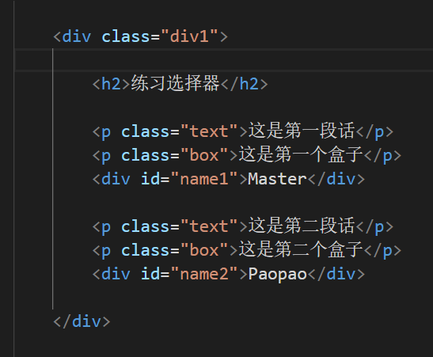
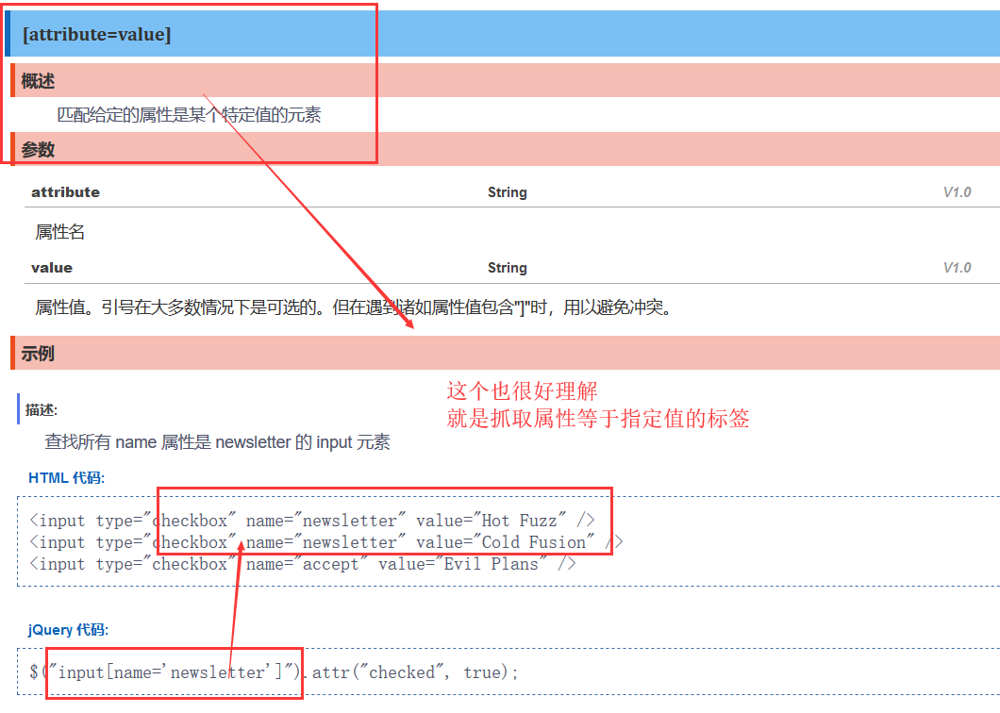
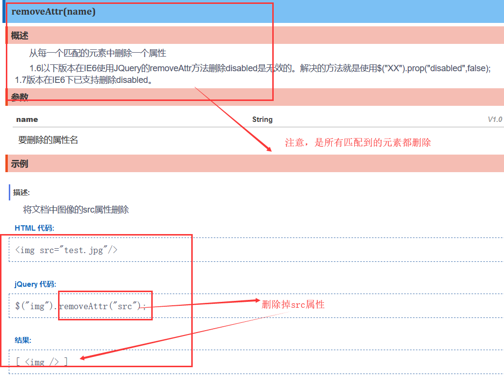
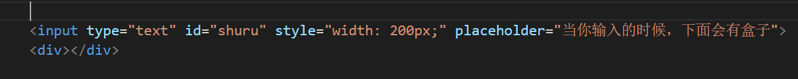
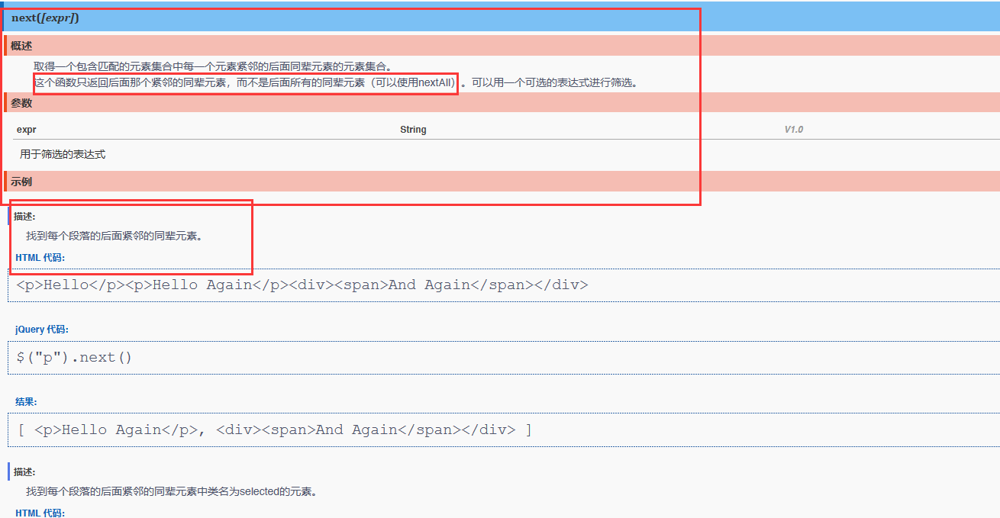

# jQuery不是你想学，想学就能学~

## 一.jQuery的语法

#### 1.官方口号

jQuery 是一个 JavaScript 库。

jQuery 极大地简化了 JavaScript 编程。

有兴趣的可以了解一下jQuery官方口号: write less，do more

https://jquery.com/

**写得少，干得多**，真牛皮啊！

#### 2.概述

jQuery是JavaScript的代码库之一，当作快捷键用，易学易用，但是

我反复强调的是，原生js才是最需要好好学的东西，正如我所说的：

**把百分之80的时间都留给原生基础学习，把百分之20的时间留给框架**

用法我一句话能概括，$等于jQuery的真身，看源码里的var rootjQuery

先找对象，再进行操作

#### 3.基本语法

基本语法是**$(selector).action()**

美元符号定义jQuery，来，跟我一起念，dollar~~

然后selector就是选择符，查找HTML元素

action()最后就是用来执行对元素的操作，当然了这个直接对应jQuery提供的各种函数API

#### 4.核心语法

下面你会接触一下jQuery的核心语法，你如果实在记不住，就只记上面的基本语法

一个$(selector).action()打天下。

###### jQuery([selector,[context]])

接受一个包含css选择器的字符串，然后用这个字符串去匹配一组元素

###### jQuery(html,[ownerDocument])

根据提供的HTML标记字符串，动态创建由jQuery对象包装的DOM元素。

与此同时，就能设置一系列的属性、事件等。

###### jQuery(callback)

其实这个函数就是$(document).ready()的简写

先来看看这个函数的用法：

这个函数叫做文档就绪函数，也就是说，只有文档完全运行完之后才运行jQuery代码。

优点很明显，如果文档没有完全加载之前就运行函数，操作可能就失败，比如会获取到没有加载完的图片

当然了，这个函数还能进一步简写，就是：

$(function(){···// 文档就绪});

###### jQuery对象访问

each(callback)：以每一个匹配的元素作为上下文来执行一个函数

size()：取大小

length：取长度

selector：选择器

context：内容

get([index])：获取索引指定值

index([selector|element])：值进一步筛选

###### 数据缓存

data([key],[value])：K=V编程论的存储方式

removeData(name[list])：删除数据的方式

## 二.jQuery的选择器

https://api.jquery.com/

英文文档，能看懂吗……下个谷歌翻译插件吧~~

我们如果想要使用jQuery这个框架，肯定要先下载啊

https://jquery.com/download/

下载之后保存在文件里面，直接引用

然后就可以开始选择器的学习了！

我配置如下：

英文文档还是看的费劲啊，来个jQuery的中文文档连接吧！

http://jquery.cuishifeng.cn/

#### 1.基本

抓取id用#，抓取class用.，这是我们一直熟悉的

element元素，*通配符，selector选择器

首先我们先用html+css去定义个样本网站练习

然后我们不是已经引入了jQuery框架了吗，所以我们可以直接可以开始编写js了.

###### 抓取单个标签

这是jQuery最基础的语法了，就在上面讲过的$(function() {……})，

然后我们抓取元素class属性，也直接暴力，还是这个$符号，直接$('.box');

再来看看控制台的结果：

当然了，选取id一样简单

现在，你们是否明白了jQuery框架的强大之处？

jQuery 极大地简化了 JavaScript 编程。

现在我们继续看看如何抓取元素标签

直接写标签名字就行了

###### 抓取多个标签

想要抓取多个混合对象，标签名，class属性，id属性，统统都用逗号隔开就完事了

看，这些直接都抓取到了，所以你是不是意识到了jQuery框架的强大之处？

这一句代码其实不就等于js的三句代码吗？document.getElement……等等，我就不详细写了~

好了，现在就正式进入jQuery的学习吧！

#### 2.层级

ancestor descendant

parent > child

prev + next

prev ~ siblings

为了方便讲，我干脆一次性写完代码

注意！！！那个$是不能掉的，也就是说，你如果不使用$，你无法启动jQuery的功能！！！

现在来看看控制台：

我们可以得出两个恐怖的结论

行吧，其实我是在官方文档弄懂的，还是不装逼了。

###### 空格符号 和 >符号

这两句作用是相同的：

ancestor descendant：在给定的祖先元素下匹配所有的后代元素

parent > child：在给定的父元素下匹配所有的子元素

得到的结果肯定是抓到了两个text

###### +符号 和 ~符号

再来看看下面两句

prev + next：一个有效选择器并且紧接着第一个选择器

prev ~ siblings：一个选择器，并且它作为第一个选择器的同辈

也就是说，我们是使用一个兄弟去找他的兄弟，但是这两个不是兄弟啊，分明是父子

所以我们在控制台得到的结果就是没有抓取到

现在我要重新写，找.text的真兄弟的过来，看看能不能找到.text的兄弟：

查看控制台输出：

第一句代码，找到了两个box兄弟，第二句找到了name1兄弟，很简单，就是在js中就是寻找同级标签的方法，在jQuery中同样大大简化了。

###### 错误补充

在我后面继续翻阅API文档的时候，我发现我理解错了这两个知识：

prev + next：匹配所有紧接在 prev 元素后的 next 元素

prev ~ siblings：匹配 prev 元素之后的所有 siblings 元素

我以为这两个的作用是一样的，实际上是不一样的

第一个**prev + next是返回后面的第一个同级元素**

第二个**prev ~ siblings是返回后面的所有同级元素**

#### 3.基本筛选器

http://jquery.cuishifeng.cn/

一个一个的看吧

###### :first

就拿上面的html代码来讲，这个代码肯定返回了第一个p元素的内容

这个就是一个学习官方文档的过程，下面我将简洁表述，遇到重点就重点讲

###### :not(selector)

:not(selector)，也是一个很常用的浏览器，过滤的一个方法

###### :even

:even，容易搞混概念的选择器

###### :odd

:odd，有:even必有:odd，这两个是一对的，需要联合起来记忆

###### :eq(index)

那么有了上面这两个选择器的学习，我们必然主动联想到，该怎么主动抓取某一个具体位置的元素？

:eq(index)应运而生，index是索引，从0开始

###### :last

还有一个需要了解到的是查找索引方式，就是查找最后一个元素，这个就是与上面的:first是一对啊

:last，获取最后个元素

我只挑了一些重点来讲，剩下的需要自己下去官方文档进行学习~~~

#### 4.内容筛选器

###### :contains(text)

:contains(text)，经常使用的内容寻找筛选器，

###### :empty

:empty，这个作适当的了解即可

###### :parent

我说了，有:empty必有它的另一对

:parent，对这个选择器千万不要有误会，不是选爸爸的，这个选择器的意思是能当爸爸的元素：

###### :has(selector)

:has(selector)，注意了啊，这也是很常用的方法，就是寻找这个爸爸标签有没有指定的儿子标签

###### :hidden

:hidden，这个就适当了解一下即可：

当然了，这个也有传统的type=hidden匹配

###### :visible

有:hidden必有他的另一对，就是选择到能看得见的元素

:visible，匹配所有的可见元素，只做了解即可~

#### 5.属性选择器

###### [attribute]

我们光上面，只能详细到完成对标签的抓取，这个才是选择器的抓取内容核心，就是根据标签的属性进行抓取

[attribute]：匹配包含给定属性的元素。

###### [attribute=value]

[attribute=value]：匹配给定的属性是某个特定值的元素。

###### [attribute!=value]

有上面的指定值必有下面的非指定值

[attribute!=value]：匹配所有不含有指定的属性，或者属性不等于特定值的元素

###### [attribute^=value]

[attribute^=value]：匹配给定的属性是以某些值开始的元素

###### [attribute$=value]

[attribute$=value]：匹配给定的属性是以某些值结尾的元素

###### [attribute*=value]

[attribute*=value]：匹配给定的属性是以包含某些值的元素

###### [selector1] [selector2] [selectorN]

接下来这个才是我们重点掌握，经常使用到的方法

复合选择器

#### 6.子元素选择器

我在上面介绍了一些简单的子元素选择，但是这儿才是专业的寻找子元素，我会挑一些重点来讲，请务必掌握

###### :first-child

:first-child匹配所给选择器( :之前的选择器)的第一个子元素

类似的:first匹配第一个元素，但是:first-child选择器可以匹配多个：即为每个父级元素匹配第一个子元素。这相当于:nth-child(1)

###### :last-child

有:first-child必有它的另一对:last-child

:last-child匹配最后一个子元素

:last只匹配最后一个元素，而此选择符将为每个父元素匹配最后一个子元素

###### :nth-child

既然上面两个介绍了找第一个元素和找第二个元素的方法，怎么能少了找具体位置元素的方法？

:nth-child匹配其父元素下的第N个子或奇偶元素

:eq(index)匹配选择器指定序列的元素，而这个:nth-child将为每一个父元素匹配子元素。

###### :only-child

:only-child如果某个元素是父元素中唯一的子元素，那将会被匹配

如果父元素中含有其他元素，那将不会被匹配。

（注：这里的其他元素并不包含文本节点，如：
图片
，用$('p img:only-child')是可以匹配，感谢：nwujiajie 指正）

#### 7.表单选择器

这个系列是非常简单的，我就放个截图，讲一下吧

就讲前面的input吧

###### 返回所有表单对象

:input匹配所有 input, textarea, select 和 button 元素

这个要额外注意，为什么textarea, select 和 button也会被返回，因为这三个的本质上其实也是input的一种

###### 返回表单对象的type

###### 表单对象的属性

表单对象的属性一共有四个，我们最熟悉的就是checked，已勾选的会被返回

#### 8.复杂选择器

###### $.escapeSelector(selector)

这个方法通常被用在类选择器或者ID选择器中包含一些CSS特殊字符的时候，这个方法基本上与CSS中CSS.escape()方法类似，唯一的区别是jquery中的这个方法支持所有浏览器。

你可以把这个理解成一个很无聊的方法，就是有些class属性命名前面会带个点

所以这个复杂选择器的作用就出来了

## 三.jQuery操作DOM

#### 1.CSS类

我们会通过CSS类来进行一个操作DOM的快速入门

###### addClass(class|fn)

为每个匹配的元素添加指定的类名。

###### removeClass([class|fn])

从所有匹配的元素中删除全部或者指定的类。

###### toggleClass(class|fn[,sw])

如果存在（不存在）就删除（添加）一个类。

这个方法需要仔细记忆，是一个非常棒的方法，可以配合开关来使用，下面会有一个小小实战来记忆

像下面这张图，很好理解，无非就是如果有selected就删除，没有selected就添加上去

###### 小实战之前的准备

现在我们知道了addClass(class|fn)，removeClass([class|fn])，toggleClass(class|fn[,sw])，但是也许理解的还不够深刻

下面我会进行一个小小的实战，来帮助理解，但是在此之前我们需要了解一下事件on(events,[selector],[data],fn)

只有弄懂了这个才能开始下一步，与此同时，我们需要再定义html+css的页面准备

###### on(events,[selector],[data],fn)

这个没那么复杂，就是一个绑定事件处理的函数

on(events,[selector],[data],fn)在选择元素上绑定一个或多个事件的事件处理函数。

on()方法绑定事件处理程序到当前选定的jQuery对象中的元素。

然后来讲一下里面的参数

**events**:一个或多个用空格分隔的事件类型和可选的命名空间，如"click"或"keydown.myPlugin" 。

其实events就在下面，有一堆的玩意

最常用的肯定是click啊

selector:一个选择器字符串用于过滤器的触发事件的选择器元素的后代。如果选择的< null或省略，当它到达选定的元素，事件总是触发。

data:当一个事件被触发时要传递event.data给事件处理函数。

**fn**:其实就等于function()，该事件被触发时执行的函数。 false 值也可以做一个函数的简写，返回false。

现在我们知道了addClass(class|fn)，removeClass([class|fn])，toggleClass(class|fn[,sw])，还知道了on(events,[selector],[data],fn)，知道里面的events是事件

那么就开始一个小实站，快速理解jQuery的DOM操作吧！

###### dom操作小实战

首先要抓取到点击按钮

然后编写js程序，绑定上点击事件，events参数是使用字符串

现在抓取到p元素的文本，使用上addClass方法

这样一来，我如果点击，p的属性就会增加class="red"，刚好我在样式表里面写了这个

所以来看看点击的效果吧

现在，再来看看removeClass，但是在此之前，我们需要对p元素提前撸一个class="red"

函数编写修改很简单

但是这些都不是我们需要重点掌握的，重点掌握的是**toggleClass(class|fn[,sw])**

这个函数才是最好用的，直接用来当开关

现在来看看实战效果

现在，你通过这个实战，已经完成了dom操作初步入门。

在此期间，你接触到了事件的click点击事件，事件处理的on(events,[selector],[data],fn)，属性与方法的CSS类的toggleClass(class|fn[,sw])函数，完成了点击小项目，现在就往下学习，进一步深入。

#### 2.事件

###### on(events,[selector],[data],fn)

在选择元素上绑定一个或多个事件的事件处理函数。

这个在上面的小实战中已经介绍过了，就不多言

###### off(events,[selector],[fn])

在选择元素上移除一个或多个事件的事件处理函数。

off() 方法移除用.on()绑定的事件处理程序。

这个方法和on()是一对，on()是用来给元素添加上事件，比如添加点击事件

off()就是移除掉已经有的事件，比如这个按钮本来有点击事件切换颜色，off()的出现就是移除掉

###### hover([over,]out)

不知道大家有没有想起CSS3中接触过的hover鼠标过滤事件

一个模仿悬停事件（鼠标移动到一个对象上面及移出这个对象）的方法。这是一个自定义的方法，它为频繁使用的任务提供了一种“保持在其中”的状态。

当鼠标移动到一个匹配的元素上面时，会触发指定的第一个函数。当鼠标移出这个元素时，会触发指定的第二个函数。

###### focus([[data],fn])

当元素获得焦点时，触发 focus 事件。

可以通过鼠标点击或者键盘上的TAB导航触发。这将触发所有绑定的focus函数，注意，某些对象不支持focus方法。

###### blur([[data],fn])

这个与上面的focus([[data],fn])是一对，获取焦点时和失去焦点时。

当元素失去焦点时触发 blur 事件。

这个函数会调用执行绑定到blur事件的所有函数，包括浏览器的默认行为。可以通过返回false来防止触发浏览器的默认行为。blur事件会在元素失去焦点的时候触发，既可以是鼠标行为，也可以是按tab键离开的。

###### click([[data],fn])

触发每一个匹配元素的click事件。

这个函数会调用执行绑定到click事件的所有函数。

这个已经是我们非常熟悉的一个点击事件了，我们需要了解的就在下面，双击事件

###### dblclick([[data],fn])

当双击元素时，会发生 dblclick 事件。

###### keydown([[data],fn])

当键盘或按钮被按下时，发生 keydown 事件。

注释：如果在文档元素上进行设置，则无论元素是否获得焦点，该事件都会发生。

###### resize([[data],fn])

当调整浏览器窗口的大小时，发生 resize 事件。

#### 3.文档处理

###### append(content|fn)

append(content|fn)：向每个匹配的元素内部追加内容。

这个操作与对指定的元素执行appendChild方法，将它们添加到文档中的情况类似。

###### prepend(content)

prepend(content)：向每个匹配的元素内部前置内容。

这是向所有匹配元素内部的开始处插入内容的最佳方式。

###### appendTo(content)

把所有匹配的元素追加到另一个指定的元素元素集合中。

实际上，使用这个方法是颠倒了常规的$(A).append(B)的操作，即不是把B追加到A中，而是把A追加到B中。

###### prependTo(content)

把所有匹配的元素前置到另一个、指定的元素元素集合中。

实际上，使用这个方法是颠倒了常规的$(A).prepend(B)的操作，即不是把B前置到A中，而是把A前置到B中。

###### before(content|fn)

在每个匹配的元素之前插入内容。

###### after(content|fn)

在每个匹配的元素之后插入内容。	

###### wrap(html|element|fn)

###### remove(*[expr]*)

从DOM中删除所有匹配的元素。

#### 4.属性和样式

###### attr(name|properties|key,value|fn)

设置或返回被选元素的属性值。

注意，这个有两种功能

①返回元素的属性值

②修改元素的属性值

###### removeAttr(name)

从每一个匹配的元素中删除一个属性

###### 讲过的三个属性

addClass(class|fn)

为每个匹配的元素添加指定的类名。

removeClass([class|fn])

从所有匹配的元素中删除全部或者指定的类。

toggleClass(class|fn[,sw])

如果存在（不存在）就删除（添加）一个类。

在上面的小实战中我们就已经接触了。

###### text([val|fn])

取得所有匹配元素的内容或者修改所有匹配元素的文本内容

###### val([val|fn|arr])

获得匹配元素的当前value值或者修改当前元素的value值

#### 5.效果

###### 滑落动画

首先我们需要了解三个函数

slideDown([speed],[easing],[fn])

slideUp([speed,[easing],[fn]])

为什么不仔细解释上面的两个函数，因为这两个函数都被整合到一个开关函数去了

所以我们只需要了解这个slideToggle([speed],[easing],[fn])

现在我们需要准备一段html代码来展示这个效果

现在开始编写jQuery代码，将滑落动画展示出来

现在来看看展示效果

###### 乾坤大挪移

说到乾坤大挪移，就是把一堆元素放入到一个地方来

我们是否想到了上面学习的文档处理？

那么就使用appendTo来完成本次乾坤大挪移

效果如下：

现在编写jQuery代码，点击按钮的时候，将上面的列表放入到盒子之中

现在点击一下按钮，会变成什么？

###### 鼠标hover

看到这个标题，我们是否想起了css中的鼠标hover样式？

jQuery的出现，毫无疑问简化了这样的过程

我们要使用的方法，当然是前面学习到的hover()

这样编写，就象征着鼠标接触上去和离开之后的两个事件

我们可以直接通过css的方法修改背景色

来看看效果图

当我把鼠标放在第二行的时候，发生了变色，当我移开时，颜色又变回原样子

但是，有些人不喜欢这个写法，习惯于使用on()方法，当然，没问题，这是取决于编程风格

当你使用on()方法时，应当了解到的是这两个方法

mouseover([[data],fn])：当鼠标指针位于元素上方时，会发生 mouseover 事件。

mouseout([[data],fn])：当鼠标指针从元素上移开时，发生 mouseout 事件。

这两个方法，一般配套来使用，那么on()怎么样编写两个事件呢？

这样写就可以了，现在补充一下

效果是一模一样的。

###### 遍历改变

我们需要了解jQuery的遍历方法，这是肯定的，才能方便我们下面的编程

使用each进行遍历，i只是抓取到元素的索引名字

我们现在弄明白了这个each()遍历的作用，就可以开始批量改名了

我使用了text()方法修改文本，当然了其实我还可以再补充的，直接修改input按钮本身的名字，用的是val()

来看看最终效果图，点击之后发生了什么

###### 聚焦和失焦

这个案例我们就要用到focus和bluer这一对了

现在该怎么编写聚焦和失焦呢，跟前面连续两次on()一样

然后完善一下函数

通过这个案例，我知道了div:last只能返回最有一个有内容的div，所以改成div:empty之后顺利地匹配到空的div标签

来看看效果：

点击一下输入栏

点击一下别的

#### 6.筛选函数

注意，这个筛选函数与上面的还是有区别的，这个筛选是直接调用函数来筛选

###### eq(index|-index)

获取当前链式操作中第N个jQuery对象，返回jQuery对象，当参数大于等于0时为正向选取，比如0代表第一个，1代表第二个。当参数为负数时为反向选取，比如-1为倒数第一个，具体可以看以下示例。

###### first()

获取第一个元素

###### last()

获取最后一个元素

###### hasClass(class)

检查当前的元素是否含有某个特定的类，如果有，则返回true。

这其实就是 is("." + class)。

###### filter(expr|obj|ele|fn)

筛选出与指定表达式匹配的元素集合。

这个方法用于缩小匹配的范围。用逗号分隔多个表达式

还记得箭头函数吗？items.filter(item => item.id>5)，差不多就是这个作用

###### has(expr|ele)

保留包含特定后代的元素，去掉那些不含有指定后代的元素。

###### children(*[expr]*)

取得一个包含匹配的元素集合中每一个元素的所有子元素的元素集合。

###### find(expr|obj|ele)

搜索所有与指定表达式匹配的元素。这个函数是找出正在处理的元素的后代元素的好方法

###### prev(*[expr]*)

取得一个包含匹配的元素集合中每一个元素紧邻的前一个同辈元素的元素集合。

换句话说，就是返回前面一个同级元素~

###### next(*[expr]*)

取得一个包含匹配的元素集合中每一个元素紧邻的后面同辈元素的元素集合。

这个函数只返回后面那个紧邻的同辈元素

与前面的prev()是一对，一个返回前面的同级元素，一个返回后面的同级元素

###### siblings(*[expr]*)

用于筛选同辈元素的表达式

与上面的prev()和next()不同的是，这个是返回所有的同级元素，不论上下

## 四.案例实战

还是改写一下前面写的js代码吧，把里面的语法全部换成jQuery就可以了~

###### 改写购物车清空项目

###### 改写备忘录项目