# Bootstrap是最受欢迎的响应式前端框架

## 一.Bootstrap框架结构

#### 1.框架简介

官方网站：https://getbootstrap.com/

所以我们目前要学习的便是Bootstrap4前端框架。

使用这个Bootstrap4前端框架开发的时候我们需要知道如下：

网页模板：由HTML+CSS+JS组成一些列特定布局和样式的页面

一套工具：动态响应，移动优先，多种组件任意搭配

优点：重点放在网页设计和业务开发，容易使用，方便维护，持续更新，稳定安全

缺点：默认样式容易重复，需要自定义，常常包含多余功能，样式过多难以掌握

#### 2.框架内容

我们从官网去了解一下Bootstrap，发现框架组成结构如下：

主要肯定是css和js的便利设计

这是Bootstrap最基本的形式：预编译文件，几乎可以在任何Web项目中快速使用。

我们提供编译的CSS和JS（`bootstrap.*`），以及编译和缩小的CSS和JS（`bootstrap.min.*`）

最简单的使用方法是直接加载框架的CDN

先来了解一下CSS组件的使用：

这个是百度百科词条的解释：

Bootstrap的出现无疑是非常受欢迎的，如今已经发展到了Bootstrap4，我们来看看如今的特点吧：

一套严谨的流程：布局+内容+组件

布局系统优化：高进的网格系统（默认情况下位Flexbox），响应式设计

CSS的选择：现在使用Sass，取代了Less

浏览器兼容：不支持IE8、IE9和IOS6

插件的优化：重写了JavaScript插件长度

单位的选择：使用rem取代了px

#### 3.框架下载

框架的下载非常简单，跟jQuery如出一撤，直接下载源码，然后直接引用

下载解压缩之后就会看到这两个文件夹

无非就是css组件库和js组件库。

为了突出他们是框架文件，改个名字也无妨……

#### 4.参考文献

学习的道路上，根本离不开各种文档和各种帮助设计的网站

想成为Bootstrap的强者，必定是无数个看API文档学习的日日夜夜换来的!

官方文档：https://getbootstrap.com/docs/4.3/getting-started/introduction/，我承认我没有实力啃下外国文档。

中文版官方文档：https://v4.bootcss.com/，一个权威的中文网站，但是里面貌似有问题

框架的github地址：https://github.com/twbs/bootstrap，13万的star，给力的很~~

前端技能网亲自翻译的文档：https://www.qdskill.com/docs/bootstrap/，翻译水平跟上面的还没对比过，先学着吧

bootstrap样式参考网址：https://bootswatch.com/，看到自己喜欢的样式就下载，不清楚好不好用。

浏览器插件推荐：wappalyzer，可以看当前网站的架构方式。

#### 5.框架使用

当我学习完bootstrap4的时候，我彻底弄懂了CDN的作用，所以其实框架也不需要下载

只需要四句CDN链接就能完成引入CSS组件和JS组件

只需要这四句就够了，就完成了引入Bootstrap4框架的光荣使命。

CSS组件

<link rel="stylesheet" href="https://cdn.bootcss.com/bootstrap/4.0.0/css/bootstrap.min.css" crossorigin="anonymous">

JS组件

## 二.理解网格系统与布局

#### 1.概念介绍

我们在上面就介绍了个Bootstrap4带来的新特性：*高进的网格系统（默认情况下位Flexbox），响应式设计*

Bootstrap包含了一个强大的移动优先的网格系统，

它是基于一个12列的布局、有5种响应尺寸(对应不同的屏幕)，支持Sass mixins自由调用，

并结合自己预定义的CSS、Js类，用来创建各种形状和尺寸的布局。

#### 2.栅格系统

总体来说，就是栅格系统的理解：

上面的图就很好揭开了Bootstrap4框架布局的机制原理

就是我们学过的flexbox流式布局。

当然了，如果读不太懂文档，就直接记住五个栅格系统的等级

总共有五个栅格等级，每个响应式分界点隔出一个等级：特小`.col`、小`.col-sm-*`、中`.col-md-*`、大`.col-lg-*`、特大（大、特大也可以称为宽、超宽）`.col-xl-*`。

- 特小：class="col"
- 小：class="col-sm-占用列数量"
- 中：class="col-md-占用列数量"
- 大：class="col-lg-占用列数量"
- 特大：class="col-xl-占用列数量"

注意，上面的占用列数量最大为12，详情请看图下:

当然了，我们光这些肯定是了解不到每个栅格系统到底占多大的空间，我们继续往下浏览官方文档：

#### 3.简单实战

说那么多不如就来试试敲代码，直接copy官方实例代码：

完成正确引入框架的使用：

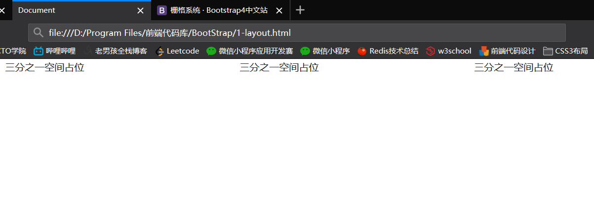

看到了吗，这三段话以非常标准的排列呈现在页面上

我们还需要添加个样式展现一下:

然而这只是一个简单的案例，我们既然在上面接触到了5个栅格等级们就应该深入理解一下

我们可以直接看出来，这个布局中间的盒子大小不一样，自己定义，然后左右的盒子就自己平分剩余的空间

这种效果是怎么展现出来的呢

我们放入代码之中，并套上背景颜色和边框，查看效果：

我们可以尝试修改下源码，把中间的盒子改掉占用列数量

更多官方示例实战:

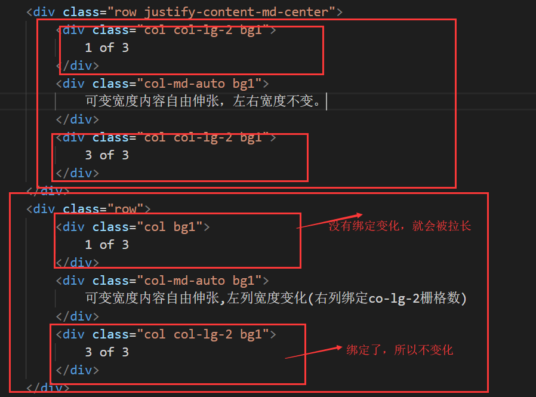

现在，也许你还没意识到bootstrap4的强大，我们现在开始把浏览器缩小

再缩小呢？

再再再缩小呢？

这便是栅格系统的强大之处。

## 三.CSS组件

这注定是个漫长的学习过程，我们可以提前看看在官方文档要学习的有哪些

#### 1.警告提示框

警告框组件通过提供一些灵活的预定义消息，为常见的用户动作提供常见的上下反馈消息和提示。

###### 基本示例

警告里面有链接无疑是最为广泛的，这可以相当于正确位置的引导

把源码copy到代码里实验一下吧！

效果是真的不错，这些也不需要强行记忆，把官方文档当作词典，需要的时候就用一下就行了

当然了， 到了这个时候，还没完呢，我们需要修改这个东西，复习一下上面的栅格等级

我们把提示框弄小一点不可以吗?

所以我们确实完成了警告提示框的修改。

当然了，还有另外一种警示框，我个人认为觉得不错

---

###### 文本提示框

现在拷贝一下源码，并修改，来试试效果，修改完之后改变一下大小：

我们不能忘记 ，我们所使用的bootstrap4是栅格系统，是row和col布局组成的

所以我们把上面的警示框放在上面的row，这个警示框放在新的row

效果：

看到了吗，bootstrap的css组件提示框确实非常的好用呢！

至于关闭警告事件，这个章节就先不讲，统一放到后面的js组件去讲解

下面的关闭提示的源码就先看看

#### 2.徽章

badge徽章样式的使用、数字提示扩展样式以及小规格徽章的示例和使用文档。

###### 记住badge等于徽章

直接来看看源代码，看看这个的效果是怎么弄出来的

这说明了，徽章是通过class类badge来完成的效果。

但是页面中却不是想象中的这样

还记得我前面讲的栅格系统布局吗，是row+col完成的，所以请务必牢牢记住

这儿有两种值得注意的徽章按钮样式

大家可以注意一下第二个按钮徽章，下面多了个unread messages，这到底是什么作用呢？

这个是为残障人士准备的，比如弱势或盲人是不可能知道这些视觉识别元素是什么的。他们上网使用的是屏幕阅读器，也就是 screen reader（sr），屏幕阅读器需要找到能辨识的文本说明然后“读”出来给用户听。问题是图形元素怎么可能“读出来”呢？因此我们还要写上这些元素的文本说明，但是又不需要展示给普通用户看到，于是加上sr-only 的意义就在于能保证屏幕阅读器正确读取且不会影响 UI 的视觉呈现。所以就是一个隐藏但能够发挥作用的元素。

---

###### badge-pill摇身一变椭圆

徽章的重点来了，下面才是我们需要了解掌握的八种有趣的徽章：

但是这些先不着急，因为我们的徽章往往是发挥作用的导航栏，下面才是我们需要关注的代码：

我们现在就来试试这段代码，并修改一下啊

这些徽章都是带导航链接的，心动吗？

有人就会说，这么小有个卵用？大哥。我们可以自定义样式覆盖掉默认设置啊

---

###### bootstrap3的徽章是什么

但是我们作为开发者，我们需要关注徽章在bootstrap3和bootstrap4发生了什么

在bootstrap3的时候，徽章的代码是这样的

所以看到了也不要奇怪，时刻关注版本的变化，了解到是最好的。

#### 3.面包屑导航

首先我们需要接触最简单粗暴的导航：面包屑导航

面包屑导航(Breadcrumb)：

在通过BootStrap的内置CSS样式，自动添加分隔符、并呈现导航层次和网页结构结构，从而指示当前页面的位置为访客创造优秀用户体验。

说实话，喜欢简约风格的人都喜欢采用面包屑导航，非常简单粗暴

###### 全世界最好的面包屑导航

效果就是这个样子，在当前页面的时候，颜色变黑，其他路径是蓝色

来看看源代码，我们果然猜到了class类的名字就是breadcrumd，毕竟class类就是根据是什么东西而进行有意义命名的

所以bootstrap4也没那么难学，我们背下来几个关键玩意的class类名字，然后直接引用，就可以啦！！

我们拿到代码里面，直接写到最前面看看效果如何：

还是很不错的，毕竟面包屑导航确实是非常流行的导航栏形式~~~~

#### 4.导航门

这个才是我们最需要关注的地方，在这个小节中，我会重点介绍有哪些导航门样式值得我们学习

先放一波地址，感受一下：

https://www.qdskill.com/docs/bootstrap/docs/4.0/components/navs/

Bootstrap中提供的导航可共享通用标记和样式，从基础`.nav`样式类到活动与禁用状态。交换class选择符以在每种样式之间切换。

基础`.nav`组件采用Flexbox弹性布局构建，并为构建所有类型的导航组件提供了坚实的基础，包括一些风格覆盖（以及列表）、一些更大pading连接间隙和基本的禁用样式。

###### 基本导航样式

关键class方法：无

当然了，我们还可以用最简单的方式直接写出来导航门，但是这不利于js交互，动态方面可能会欠缺

---

###### 水平居中与垂直排列

水平居中就不需要我多言，传一个属性就能解决

关键class方法：`justify-content-center`

但是我们也经常遇到一些特色网站使用了右对齐

关键class方法：`justify-content-end`

现在主要是来讲讲怎么做垂直排列的导航门

也许正在看官方文档的可以注意到，目录就是垂直排列的导航门

但是垂直排列怎么实现呢?也是一句话的事情

关键class方法：`.flex-column`

为什么插入个flex-column就能用了，因为bootstrap4自己封装了flex布局的功能，让我们的使用更方便。

---

###### Tabs标签

这是国内非常流行的一个导航栏样式，就是标签卡样式

关键class方法： `nav-tabs`

我们现在就来试一下这个吧！只需要加个class属性nav-tabs就可以，毕竟框架已经封装好了

效果图：

怎么样，这个标签卡导航门是不是很酷~

---

###### 胶囊式标签页

同样是国内流行的一种导航门样式

主要是提醒的程度非常大，受到一定程度的欢迎

关键class方法：`nav-pills`

这是最基本的胶囊式标签，我在下面要介绍的是胶囊式的拓展方法

①非等宽

关键class方法：`.nav-fill`

 使用`.nav-fill`会将`.nav-item`按照比例分配空间。注意：这会占用所有的水平空间，但不是每个导航项目的宽度相同。

我们直接拿到代码里面来

效果图。可以发现每个导航的项目长度确实会不一样

②等宽

关键class方法：`.nav-justified`

这个非常适用强迫症

对于等宽元素，请使用`.nav-justified`。所有水平空间将被导航链接占用，但与上述`.nav-fill`不同，每个导航项目将具有相同的宽度。

代码里面修改如下：

查看效果如下：

现在是不是就强行变成了等宽的导航项目？

这个方法比较推荐，记住class方法是nav-pills nav-justified这一套，就完成了强迫症的胶囊式导航门的设计~~

---

###### 下拉菜单

在设计导航门的时候，下拉菜单是每个开发者都会关注的问题 

我们只需要关注实现它的class方法

关键class方法：`dropdown`

我们现在就来尝试实现以下：

打扰了，那个博客点不动，是因为我没有绑定上点击事件，无法直接生成菜单。。。

总之，我们要记住，实现下拉菜单就是dropdown的类方法。

#### 5.导航栏

最经典的要来了，导航栏现在已经是每个网页的必备组件了

导航栏是一个将商标、导航以及别的元素简单放置到一个简洁导航页头的容器代码组合，它很容易扩展，而且在折叠板插件的帮助下，它可以轻松与其它内容整合。

导航栏的翻译是什么？是navbar，这就意味着与它有关的类方法实现的名字都少不了navbar

注意导航门和导航栏的区别，导航门是nav，导航栏是navbar

先来看看它的运行原理吧

导航栏作为重点学习的对象，与导航门nav一样的是，它也会有一些子组件进行帮助工作

这儿就先放出来一些navbar的子组件，看看到底能完成哪些功能？

---

###### container-fluid

我们先来看看经典的导航栏例子：

拷贝到代码之中看看效果

这个导航栏非常业余，并没有左右填充，这是出自什么原因呢，是这个

让我们回到梦开始的地方

在使用bootstrap4的栅格系统之前，必须定义container和container-fluid的最大的盒子，这是一个必须的前提条件。

那么container-fluid到底发挥什么作用呢？

所以我们需要修改成container-fluid，再来看看页面的效果：

现在就是一个完美的导航栏了。

---

###### 品牌展示

在一个网页的导航栏中，必定有网页的logo存在

就像上面的例子一样

关键class方法：`navbar-brand` 

品牌有两种作用方式，一个被用来做首页链接，一个是单纯的用来看：

但是，都9012年了，谁还用纯文字去做品牌展示啊？？

必然是logo+文字妥妥的！

---

###### 导航栏

当然了，导航栏的导航是可以继承上面导航门的样式的

关键class方法：`navbar-nav`

接下来的导航栏是另一种写法，追求简洁，但是我们必须知道要加上什么来进行统一

还可以加个下拉列表，但是这儿并没有navbar的方法去实现

以上就是说下拉列表用nav来实现，加入到代码里面就可以了

---

###### 表单输入

表单输入永远都是网页不可缺少的组件，用来快速搜索某些业务而准备

关键class方法：`form-inline`，注意，这个class是加到form元素的

我们甚至还能个性化表单输入，使用子组件input-group来完成：

我们就拿这个源码来试一试吧

---

###### 文本处理

一个处理文本单词间距的方法，一个class类就能解决啦~

关键class方法：`navbar-text`

---

###### 导航栏颜色

基于主题类class和`background-color`通用样式class定义，导航栏的配色方案和主题选择从未如此简单！

你可以选择`.navbar-light` 来定义导航颜色反转（强黑白对比），

也可以使用`.navbar-dark`用于深色背景定义，然后再引用`.bg-*`类通用定义来进行大小处理。

先来看看效果图：

实现的方法也不难，也是一个class方法加入到nav元素就可以啦！

关键class方法：`navbar-light`，(黑白，颜色强反转)   `navbar-dark`（定义深背景）

来看看示例代码怎么说

对于这个bg-*，大家都没忘记吧，前面有八个颜色控件呢！

分别是primary，secondary，success，danger，warning，info，light，dark

我们就直接改代码里面的颜色看看效果吧！

弄成bg-warning之后，预计肯定是黄色，然后看看

当然了，这个nav-light/nav-dark，bg-*定义背景色的方法只能提供颜色标准，如果要调整颜色，请通过style途径~

干脆直接把下面的组件加入到上面去，然后背景颜色代码改一样的！

最后的效果就是如下：

所以，组件用起来非常爽，请善用bootstrap4的CSS组件！

---

###### 移动端实际需求

请好好想一下，我这样弄就完事了吗？

那就请打开F12开发者工具，将模式切换到手机模式，我们看到了这个效果：

这肯定是不行的，根本没有做到兼容移动端，所以我们需要了解一个class方法

关键class方法：`navbar-expand-lg`，通过这个方法，强制呈现居中效果

---

###### 区域定位

这个可是移动端最爱玩的东西了，赶紧往下看吧！

使用系统提供的position位置间距定位通用样式可以使导航栏呈现出随浏览器滚动的效果（非固定位置），可选的流动可以包括固定在顶部、固定在底部、或粘到顶部（与页面滚动，直到顶部并停留到那里）。固定导航栏可以使用`position: fixed`属性，这意味着它们从DOM的正常流动和拉动可能需要自定义的CSS(如在`<body>`上定义`padding-top`)，以防止其重叠覆盖了其它元素。

注意：**在.sticky-top使用 position: sticky, 目前不支持所有常用浏览器**.

根据这张图，我们可以总结成：

区域固定在顶部关键class方法：fixed-top

区域固定在底部关键class方法：fixed-bottom

我们要试验的肯定是底部了，移动端最爱用的套路，底部不都是固定在手机下方吗？

电脑端效果:

移动端效果：

至于区域的粘性，只需要了解到是什么方法就可以

通过导航门和导航栏的学习，我们已经能通过bootstrap4创建一个导航栏了

为什么要花这么多笔墨去介绍导航门和导航栏，要知道，第一印象非常重要，用户的导航体验更加重要

如果你做一个丑丑的导航，别人找需求都找不到，会大大影响别人继续浏览的欲望的~~

#### 6.按钮

使用Bootstrap的自定义按钮样式，并广泛用于表单、对话框等场景中的操作，并支持多种大小、状态等一系列变量定义。

在上面我们接触了8个颜色的徽章，同样的是，这儿也有8个颜色的按钮可以了解一下

---

###### 基本示例

关键class方法：`btn`

我们只需要在buttontype="button"]下传递class="btn btn-颜色"，就可以完成了按钮的自定义

当然了，input标签和a标签怎么办呢？同样也是btn的class方法

当然了，bootstrap4还不至于这么菜，上面的按钮样式未免也太丑了

所以btn类依旧有子组件，来进行样式的设计

---

###### 按钮大小

按钮的大小也是可以设计的，方法是`.btn-lg `、`.btn-sm`

现在我们就来写两个综合按钮来强化一下记忆啦啦啦~

来看看效果：

知道了按钮的基本设计方法之后，我们还是需要接触到按钮组的玩意，就是一组按钮的时候该怎么设计

使用按钮组合，可以把一系列按钮编组在一行里，并通过可选的JavaScript插件(方法)赋予按钮单选、复选等强化行为

---

###### 按钮组件

关键class方法：`btn-group`

按钮组的规格也非常简单，正如上面单个按钮的btn-lg和btn-sm一样，按钮组的规格正是btn-group-lg和btn-group-sm。

按钮可以横着放也能竖着放，那么竖着放的方法就快速介绍一下

关键class方法：btn-group-vertical

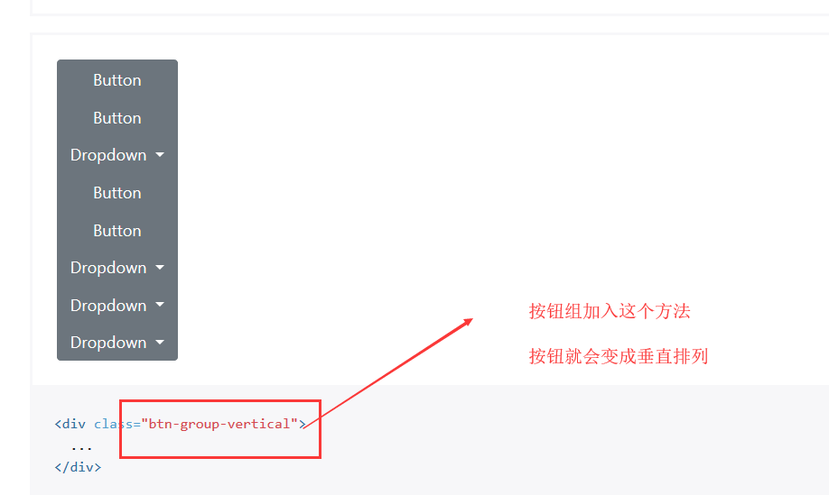

#### 7.卡片

`.card`卡片组件是BootStrap 4新增的一组重要样式，它是一一个灵活的、可扩展的内容器，包含了可选的卡片头和卡片脚、一个大范围的内容、上下文背景色以及强大的显示选项。

卡片的概念就是bootstrap4提出来的，它的出现使网页区域更加简单明了，能够理解为多个卡片组成一个重要的区域，比如商品展示

这个就是一个优秀的卡片实例~~

---

###### 基本示例

关键class方法：`card`

核心作用：卡片支持多种多样的内容，包括图片、文本、列组、链接等，混合并匹配多种内容类型以创建你想要的卡片。

我们现在就创建一个简单的卡片进行实战：

改变如下：

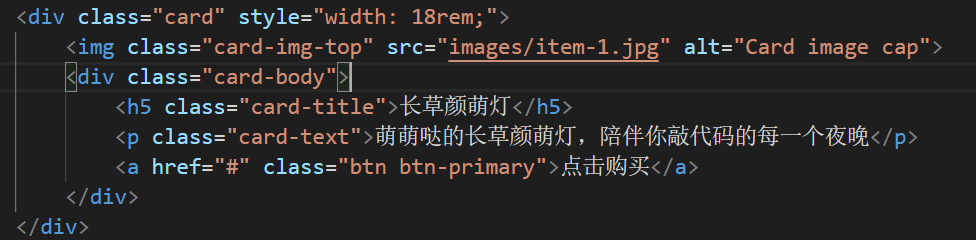

查看效果图：

---

###### 卡片列表

再来看看一个很广泛的卡片，就是列表组

ul的class方法是list-group,li的方法是list-group-item

修改如下：

效果展示：

---

###### 卡头

当然了，我们要学会举一反三，表格都有表头，卡片为啥不能有卡头？哈哈哈

现在更新一下：

这儿有一个非常优秀的卡片模型参考：

代码拿过来，设计一个小卡片出来：

---

###### 卡片导航栏

看到这儿，就能灵机一动的想起了导航栏，这个卡片是可以做导航栏的

也就是说导航栏嵌套到卡片里面

这儿就是tabs标签导航的卡片方法，举一反三，如果是胶囊式导航栏，应该怎么改呢？所以我直接在这儿拿过去代码进行修改，看看能不能成功

tabs改成pills就行了，毕竟tabs标签页对应tabs，胶囊式标签页是对应pills，记住就好~~

---

###### 卡片样式

卡片样式根据颜色来颜色来划分的话，其实也是8钟，快速了解一下即可~

当然了有这种样式也有边框样式

这个关键class怎么改呢，只需要把上面的bg-颜色改成border-颜色就好啦！

---

###### 高端卡片阵列

来看看高端卡片阵列吧，我感觉以后总有一天用的上

直接copy源代码玩耍一下

以后如果遇到需要这样的布局，直接上官方文档拿源码进行设计~~

---

###### 值得学习的核心卡片样式

接下来我要说的是卡片设计的超级重点，也是我们以后肯定要用到的核心

就是带背景图的卡片，文本放在上面~

关键class方法：`card-img-overlay`

心动了吗？废话不多说，直接拿下源码，自己进行尝试设计~

我这卡片，设计的牛皮吗~

#### 8.轮播图

这是一个循环滚动的幻灯片组件，可以使用文本、图象水平不间断滚动，如同旋转木马一般。

所以轮播图的class名字就是旋转木马的翻译：Carousel

关键class方法：`carousel`

轮播效果是一个幻灯片效果，使用CSS 3D变形转换和一些JAvaScript构建一内容循环播放，它适用于一系列图像、文本或自定义标记，还包括对上一个/下一个图的浏览控制和指令支持。

在支持 Page Visibility API页面可见性的浏览器中，当网页对用户不可见时（如浏览器选项卡处于非活动状态、窗口最小化时），轮播效果控件会停止运动，从而节省性能。

**轮播组件不支持互相嵌套-本身轮播大多不符合无障碍浏览的标准。**

这说明无法使用……了解一下算了，服了

（后来更新：事实证明，这个需要加入js的CD链接代码就能使用了）

现在我会依次讲四种轮播图方法：经典幻灯片效果，带控制器的效果，包含姿态指示器，包含字幕的轮播

---

###### 经典幻灯片效果

这是一个经典的幻灯片示例，请注意轮播上的图像引用了 `.d-block` 、 `.img-fluid`两个样式，以修正浏览器预设的图像对齐带来的影响。

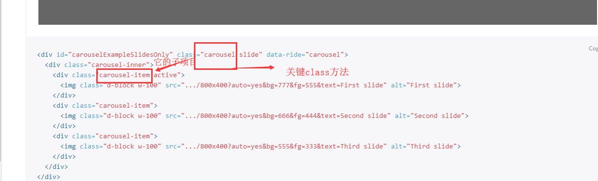

现在拿过来源码该改改~

草！不管用！不生效！以下就单纯讲一下算了，这垃圾bootsrap4，草！

---

###### 带控制器的效果

加上了上一个/下一个控制器

---

###### 包含姿态指示器

也可以将当前所在幻灯片状态指示器添加到轮播效果控件中

---

###### 包含字幕的轮播

在 `.carousel-item` 中使用 `.carousel-caption` 添加字幕到您的轮播控件中，如果是输小的浏览器viewport上，会自动隐藏（隐藏文字呈现主图片轮播），

如下图显示，可选display，引用的是`.d-none`定义，一旦到了中型md浏览设备或屏幕则调用`.d-md-block`样式使之呈现。

#### 9.表单	

账号密码输入的表单肯定是网页必备啊，注册不就是表单

表单的翻译是啥，是form，所以想都不用想，表单的关键class方法即使form

Bootstrap提供了一些表单控件样式、布局选项，以及用来创建广泛多样化的的表单的自定义组件

---

###### 示例分析

以下是示例和使用指南。

现在详细分析一下源码：

所以我得出一个结论，在bootstrap4中

**输入栏类的就是form-group的div盒子，input本身是form-control**

**选择框类的就是form-group form-check的div盒子，imput本身是form-check-input**

知道这两点就是完美了，剩下一些表单还是去官方文档浏览：

https://www.qdskill.com/docs/bootstrap/docs/4.0/components/forms/

我在下面重点挑一些很棒的样式来讲：

---

###### 样式重点

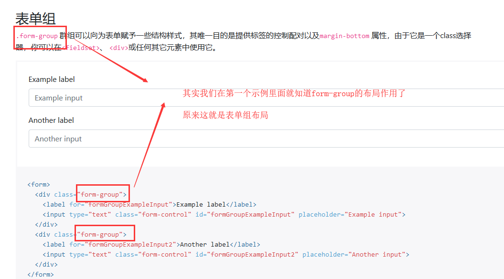

---

###### 重点学习栅格式表单

重点来了，下面是我们需要了解到的表单布局，这也是最为广泛的布局

就按这个源码就行修改：

是不是看起来贼很棒呢~~~

---

###### 复习栅格式

再看一个示例复习一下栅格式布局吧！

---

###### 表单提示

其实，表单的提示也是非常流行的，主要是服务用户的提交表体验

关键class方法到底是什么呢？

讲了这么多表单元素，那么有人就会问，纯输入框怎么办呢？

那就把form-group改成input-group啊，原理肯定是差不了多少的

#### 10.大屏

这个就很有意思了，简直广告必备，哈哈

---

###### 基本示例

这是一个非常灵活的一个组件了，用来展示广告实在最好不过了！

我们现在就copy源码实施效果：

哟吼，居然还有点好看，bootstrap4总算有不错的组件可以使用了，哟吼吼

---

###### 占满屏幕的广告

如果我想让广告占满全屏幕呢？

我的天，这个才是更好用的，都是牛皮的玩意！！！

这玩意用起来，一个页面不就诞生了吗，牛批牛批。

#### 11.模态框

使用Bootstrap的JavaScript模态框插件可以为您的网站添加醒目的提示和交互，用于通知用户、访客交互、消息警示或自定义的内容交互。

模态框的使用是非常有必要的，与用户交互你必然要弹出框提示用户，才能完成更完美的交互体验

先来看看静态的模态框是什么样子的

我倒是觉得长的还是挺好看的

下面介绍一些很常用弹出的设计，但是不能实战，因为缺少需要的js文件

---

###### 从网页顶端显示

效果图：

---

###### 居中显示

最最最最常见的弹出方法是：

必须是居中显示

区别于第一个基本的弹窗来说，就是弹窗盒子加个class属性的modal-dialog-centered，这样弹窗就出现在网页正中间

这是最常用的弹窗方法。

---

###### 弹出表单

这个也是非常常用的样式设计

效果如下，随便点击一个：

#### 12.分页

用于指导定义分页以及显示样式定义的一些示例和文档。

分页的翻译是什么？是Pagination

---

###### 基本示例

所以关键class方法是：`pagination`

我们使用大规格block块的A链接进行分页样式呈现，使链接难以忽略、易于扩展，且提供更大的点击区域使用户易于上手。分页是使用list列表元素构建的，因此屏幕阅读器可以读出链接的数量，使用`<nav>`元素将其识别为屏幕阅读器和其它辅助技术的导航组件并提供辅助支持。

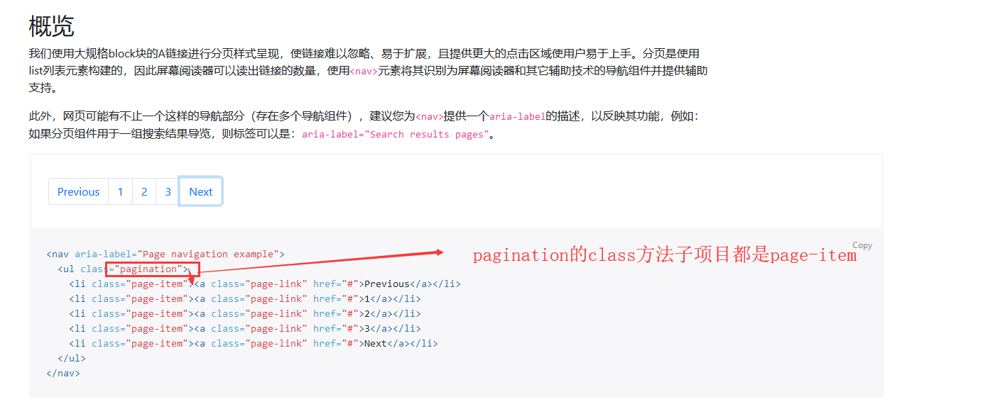

当然了，这样的分页栏太笨了，一般来说使用图标才是最好的，像这样

---

###### 分页栏居中对齐

分页栏如果想要居中，我们不需要往下看就知道该怎么搞了，就是flex的一个方法呗

#### 13.进度条

进度条就是一个非常有意思的组件了，动态展现进度

使用Bootstrap自定义进度条的文档和示例，支持平行条状堆叠、动画背景和文本标签。

---

###### 基本示例

进度条的翻译就是progress，所以关键class方法正是progress了

首先div容器想都不用想就是class="progress"，这是我们在上面学习bootstrap的过程中已经能摸索出来的规律了

---

###### 进度条颜色

进度条的颜色改变，当我说这句话的时候你是否能秒想起class属性bg-颜色?如果能，恭喜你，bootstrap强者即将诞生

---

###### 进度条条纹

觉得条纹太简单怎么办？加个属性产生条纹

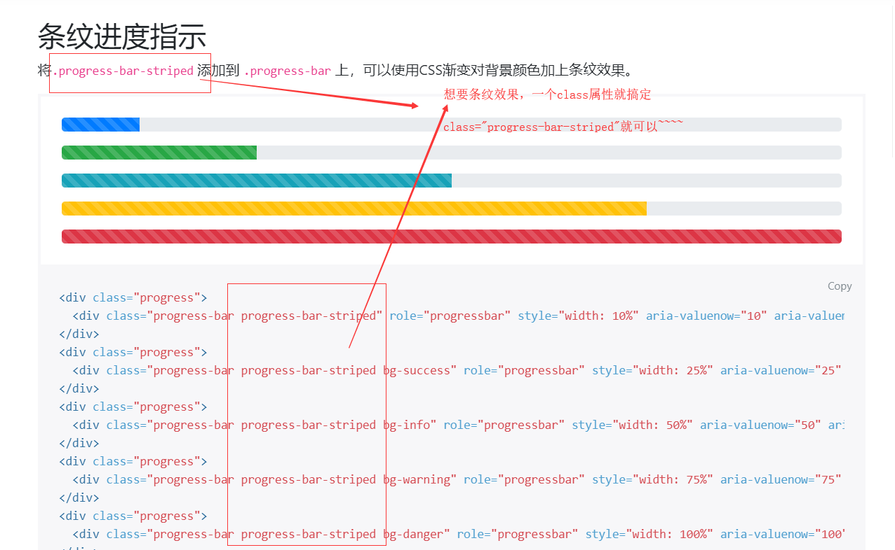

---

###### 会动的条纹

当然了，如果光有条纹，但是条纹不会动，那你的进度条也没意义，同样也是一句class属性搞定

#### 14.滚动监听

滚动监听插件会根据滚动的位置，自动更新导航条的目标，以指示当前窗口中处于活动的状态（滚动在导航条下面的区域，查看active类的改变。弹出菜单的子项也同样会被高亮）

本来是不想写关于这个笔记的，但是我心想，在我编写md笔记的时候，这个滚动监听就是存在的

比如我往上浏览到分页，左边的大纲也会变化加粗

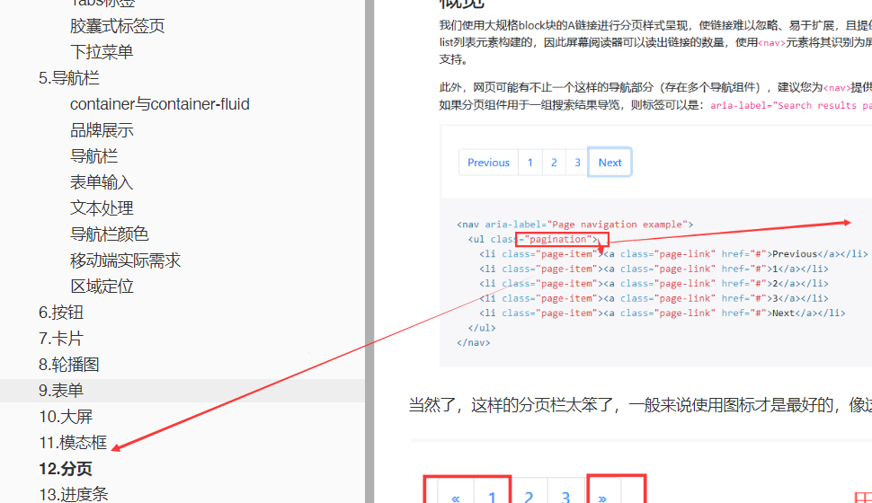

所以花点笔墨来讲一波滚动监听，也是一个美滋滋的选择了

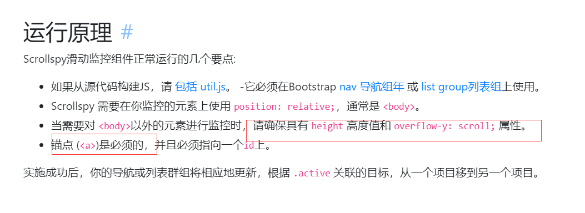

其实根据他说的运行原理，我就已经知道是锚点判断的方法了，锚点大家都知道了吧？

挑一个列表样式来讲一讲代码吧

注意！！！你如果要拿源代码使用的话，第一时间是没有效果的

因为上面就讲了原因：

你的css里面可是没有设置这些的，所以拿源代码试验去了效果很正常！

## 四.JS组件

#### 1.滚动监听

如何使用js插件在官方文档有着详细的解释

所以我们在代码中直接加入这三句话，注意，应当把integrity属性全部删掉

然后我们去copy事件滚动监听的源码

但是请注意拷贝对源码噢，而且还需要观看怎么启动scrolly的说明

最后来运行看看效果：

如果要应用这个组件，修改其中的文本样式就可以了，就这样能够做出来一个滚动监听组件。

#### 2.轮播图

我们在上面讲过轮播图，却发现轮播图的源码是不能用的，现在我们加入js插件修复一下

看看到底能不能成功做出一个轮播图

就把上面的三句js代码给加进去

令人尴尬的是，轮播图效果居然好了，但是页面太庞大了，需要对图片套上宽度限制

这样一来，像样的轮播图总算是出来了

真的尴尬，原来只有这句js引入代码根本不管用

现在的话，剩下三种轮播图就好说了，直接一口气全放在代码里面，展现出四种轮播图的效果

这样一来，四种轮播图总算是做出来了

但是我们终究要关注一下逃不掉的一个现实问题

怎么样改变轮播图的播放速度大小？我们继续往下浏览文档

知道了这个方法之后，我们在下面创造个script标签将代码传进去

咦？为什么不管用呢？我们是不是搞错了主次之分?

最终来看看效果图，卧槽，真的好快，一直在疯狂地轮播

对了，bootstrap4的轮播图组件必然是考虑了鼠标悬停事件的，当鼠标放上去之后，这个轮播图就停止轮播，所以我们不需要考虑这个

#### 3.下拉菜单

我们在学习下拉菜单的时候，那个下拉功能同样也用不了

但是我们现在接触到了三句js代码之后，我们再回去看看

成功出来了吧？

既然讲到了下拉菜单，那我就花点笔墨好好讲一下

我们知道，a标签和button标签都可以做下拉菜单

有时候，我们并不是只有下拉菜单，如果需要做上拉菜单的时候呢？

应该怎么实现？可以想一下下拉是dropdown，那么上拉不就是dropup吗？

当然了，菜单里面的分割线也不要太常见，也是需要注意的

​	

#### 4.模态框

模态框基本没有什么问题，我也花了一定的笔墨去介绍

加入三句js代码之后，模态框的那个确定按钮能够生效了

我们深入分析一下代码：

如果你不想要淡入淡出的动画，想要直接显示出模态框的话，只需要class方法里面去掉fade即可~

#### 5.博客页面

用bootstrap4写博客页面，自然是拿模板，然后修改，然后加工

最后变成了自己的博客页面的过程

首先进入官网：https://getbootstrap.com/

然后找示例

寻找博客模板

既然找到了博客模板，那就启动下载吧：

下载好了之后就开始修改进行该改改

#### 6.电子商城页面

如法炮制，先找模板，最后出来了这样的玩意：

我的构思就是灵活运用到卡片系统，把卡片给加进去，用来展示商品。

然后在最下面使用表单提交，填写购物信息

我的个人商城页面就这样弄出来了

#### 7.备忘录页面

备忘录的话，就没有模板可言了，需要自己寻找CSS组件，慢慢拼凑出来，最后拼凑出属于自己的备忘录页面

无非就是在bootstrap4官方文档找这个组件，找那个组件，最后组成了属于自己的备忘录页面

那么，let's go to design！

## 五.学习总结

通过对于bootstrap4两天的学习，我得出一个结论：

bootstrap4的作用就是快速搭建一个页面，无脑复制官网的组件，然后多个组件就能快速搭建出一个网站了。

所以能够看完CSS组件，然后并会熟练复制所需要的CSS组件源码放到自己的页面来，最终页面如果搭建好了->

那就说明我们已经算是掌握了bootstrap4页面设计框架。

后记：

但是这玩意无脑copy未免太过于枯燥，还是得找一些网站辅助学习bootstrap4，快速搭建出来我们的网站

#### 1.官方文档的公共样式

公共样式：https://www.qdskill.com/docs/bootstrap/docs/4.0/utilities/borders/

推荐熟读，内容很多，但毕竟是公共样式，直接加入class属性就能用

#### 2.快速寻找样式代码

https://hackerthemes.com/bootstrap-cheatsheet/

在这儿，你可以当成字典，再也不用麻烦地在官网浏览了！

好吧，这个网站就是抄袭官网，官网的一种更方便展现形式！！

#### 3.快速搭建主题风格

https://hackerthemes.com/new-bootstrap-themes/

在这儿，你可以找到你喜欢的主题，进行copy抄抄抄！

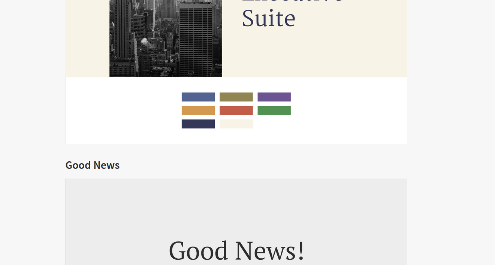

