# 让你的前端项目更加规范化吧


## 一.为什么要工程化


#### 1.由来

前端也是一种软件工程，随着网站制作越来越复杂，各种js，css文件越来越多

需要提高整个系统生产效率，提高编码、测试、维护阶段的生产效率。


#### 2.详情

工程化即系统化、模块化、规范化的一个过程

我们知道，前端框架肯定是可以模块化组织代码的

JS模块化：AMD、CommonJS等等

CSS模块化：sass、less等等

这些模块能够解决代码分割、增强维护性、提高代码重用。作用域也能隔离开来

同样也能解决模块间的依赖管理，发布的自动化打包与处理等多个方面


#### 3.组件化

处理UI层我们可以用react、vue、angular，后面会重点学习vue

数据层分离的话就是redux，或者vue组件vuex


#### 4.好处

代码规范：目录结构与编码规范

开发流程规范：敏捷开发，源代码管理，code review


#### 5.工具使用

使用前端构建工具：gulp、grunt、Broccoli

javascript编译工具：Babel、Browserify、Webpack

开发辅助工具：数据mock、livereload

使用CI集成工具：Jenkins，Travis CI

使用脚手架工具：yeoman、create-app


#### 6.参考文献

https://yq.aliyun.com/articles/574270


# 二.SASS是什么


#### 1.简介与安装

https://www.sass.hk/

来一张图感受一下就可以


具体的强大之处看看这儿就可以


废话不多说，直接进去安装

`sass`基于`Ruby`语言开发而成，因此安装`sass`前需要安装Ruby（注:mac下自带Ruby无需在安装Ruby!）


然后点击勾选上去UTF-8

​	

安装好了之后打开命令符窗口

检验一下是否安装成功


再回来看看官方文档，说需要更换源


我们直接进行尝试操作


发现不成功，我们上官网看看咋回事


进去之后，才发现是这样的回事


然后我们下拉找到正确的命令


找到了之后尝试source加载一波


我们就这样成功更换了ruby的有效源

我们继续往下浏览官方文档，终于轮到了安装sass的步骤


安装好sass和compass之后，我们需要输入两个命令验证一下安装


安装好之后，我们简单看下sass帮助使用


一般来说，第一行肯定是最重要的


#### 2.变量和编译


我们的话，就学习三部分，就绰绰有余了


我们需要先做好样本，进行练习


我们一定要弄懂sass变量是什么意思


然后我们就写个简单的sass文件


然后我们尝试使用sass编译一下，查看官方文档，我发现了我存在一个误区


这说明了什么，我们在使用sass的技术，但是文件后缀的scss，所以我们需要修改下


接下来赋值这个scss文件的绝对路径，尝试编译


来看看这个新产生的css文件啦


看见了吗，把变量的值传进去了，使之成为了实实在在的css文件。

然后我们就把编译后的css文件引入到html文件发挥效果，这便是sass的作用。

如果想一边使用sass，一遍写html，应该怎么操作呢


先提前引入进去，这是必然的

然后我们在终端准备好监控状态，这是一个关键的技能


终端输入命令


现在进入编写sass代码模式


来看看终端发生了什么变化


自动完成了变动，现在我们看看html的变化


通过这个简单的案例，也许你彻底理解了sass的作用到底是什么

使用步骤总结：

1 - 先在HTML中提前写好css文件的引入

2 - 终端输入 sass --watch index.scss:index.css这样的命令，进入监控修改模式

3 - 在sass中善用变量赋值，提高代码的重构率，降低代码的重复率

4 - 按一下ctrl+s保存，sass自动编译掉这个后缀为scss的文件，转化为css代码

5 - 编译后产生的css文件应用于html中，这便是sass的作用。


#### 3.中划线与下划线

在sass中，我们需要注意两个符号


这两个符号在sass编译中发挥的作用都是相同的

比如link-color和link_color的作用肯定是相同的


#### 4.嵌套

嵌套CSS规则无疑是我们需要注意的sass的重要功能

我们先来找个拼命嵌套的例子


这么一看，是不是超级麻烦，一直在那儿嵌套

但在sass中，提供了解决这个烦恼的方法，免去你一直嵌套的痛苦


我们现在就写个类似的例子，进行验证嵌套方式


正常的css写法必然是这样的


最终效果图是这样的


现在来探讨一下sass怎么写，如何去嵌套


然后看看终端输出和效果图


值得关注的是，在sass中该怎么样写伪类，比如hover


这个时候我们使用的是&，这个符号类似于this，指代当前处于的对象


来看看代码


就这样，完成了hover伪类的编写


#### 5.导入sass文件

官方文档的示例非常直接

就是一个@import的事情


所以说，引入同文件目录的sass文件(后缀名是sass)，使用@import完成导入

注意，原生css文件也可以完成引入


根据他的说法，其实css与scss互相兼容

实在不行，真要引入的话，把后缀css修改成scss就可以了！


#### 6.总结

对于sass这门技术，我们要辩证看待，去如何使用

主要就是两个核心技术，变量和嵌套

这两个能够极大简化css编写，降低代码的重复率

所以适当地练习一下也是可以的，毕竟都有css基础，sass写起来不在话下

换句话说：

**sass：预处理器，是对原生css的拓展，语法没差多少，就变量与嵌套**

至于编译成sass文件，我们应该不需要要过多记忆，一个命令 sass [input] [output]

因为在下面的学习中:

我们会接触到gulp和webpack，都能直接将sass文件进行编译成css文件。


## 三.gulp的作用


#### 1.简介与安装

官方文档：https://gulpjs.com/

中文文档：https://www.gulpjs.com.cn/


前端工程化必备阶段：构建与优化

作用：构建、压缩、校验、合并

但是我们如果要用gulp，必然要先用node.js

因为这个gulp是基于node..js流威力的

这个是官网：https://nodejs.org/en/ 

这个官网也有汉化版：https://nodejs.org/zh-cn/


但是一般来说，我们电脑都安装了node.js。

在命令符验证一下


这便是我的当前版本号

如果你也是这个现象，那就开始gulp的安装吧！

输入npm install -g gulp


完成安装之后看看官网怎么说！

官网提示我们需要还安装一个gulp的命令行附件，这样能够在命令行中使用gulp命令！

那就再输入npm install -g gulp-cli


这个时候需要插播一下知识点，就是这个npm到底是干嘛的

我们知道，在python中，包管理工具是pip，那么对于前端模块化的包管理器，便是这个npm

npm能够使构建node.js更加快而容易

这两条命令安装就绪之后，还记得安装sass时所遇到的源吗？

实际上npm也需要更换源，就换成淘宝源

http://npm.taobao.org/


更换成功后是这样的


经过这一系列的安装，我们完成了了解什么是npm，更换npm源，安装gulp的三个步骤。


#### 2.工程安装

首先我们先创建一个gulp文件夹

然后在cmd中切换到此文件夹

然后输入npm init


接下来就是一堆配置信息，你如果不懂的话，可以直接按回车到结束

然后你看到了这个


再去看看新产生的json文件，我可以修改


接下来就开始安装一个gulp工程项目包

输入npm install gulp --save-dev


并没有安装成功，直接报错了，这是为什么呢？看看图中的报错分析


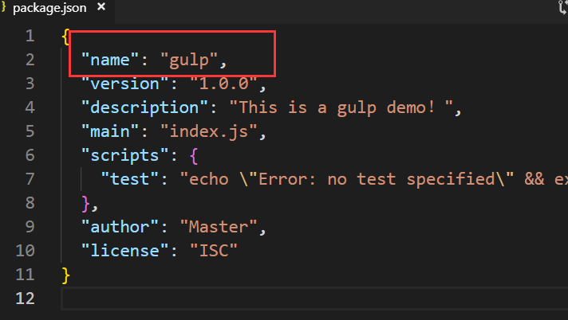

我这个name与gulp重名了，这也许是一个不允许的行为，于是我修改成gulp-demo

再来看看安装效果：


再来看看生产环境发生了什么变化


有三处地方发生变化，我们来看看新添加的node_modules文件夹里面有啥


我们可以看到，我们完成了一个node项目包的安装。


到这儿，我们复习一下上面的四大步骤：

1-切换npm源是个很有必要的行为，切换成淘宝源

npm install -g cnpm --registry=https://registry.npm.taobao.org

2-首先确保你已经正确安装了node.js环境，然后以全局方式安装gulp，还有gulp-cli命令行

npm install -g gulp 

npm install -g gulp-cli 

3-安装一个简单的gulp初始json文件，产生package.json，这一步需要先切换到工作目录

npm init

4-正式安装一个gulp项目包，依赖于上一步创造的package.json文件

npm install  gulp --save-dev


在往下学习之前，必须放一些优秀的博客！

https://www.cnblogs.com/2050/p/4198792.html

#### 3.简单使用

现在我们写一个非常简单的案例，进行初步使用

首先我们需要创建一个gulpfile.js文件，这个文件所在目录结构最好是这样的


现在，定义一个最简单的gulp任务吧，但是在任务之前，需要声明个gulp常量进行下面的使用

为什么是用const而不是var，这也是处于安全考虑，毕竟const后面不能被修改


现在我们来认识一下一个函数

**gulp.task()**


所以我们定义一个最简单的招呼任务


现在回到我们的终端，进行任务调用，调用的方法自然是gulp+任务名字


任务被完美的调用了，但根据我们的框框提示，需要额外注意gulpfile.js的存放位置噢！


#### 4.html文件迁移

现在我们已经知道了最简单的用法，我们需要进入稍微实际一点的案例

在做项目中，我们常常需要进行html文件的迁移，这都是非常正常的事情，代码部署在服务器上的时候这种事情不要太常见

所以我先创造一个文件夹，里面含有两个html文件


然后我们来了解两个函数

①gulp.src()：用来获取流的，但要注意这个流里的内容不是原始的文件流，而是一个虚拟文件对象流Vinyl files，这个虚拟文件对象中存储着原始文件的路径、文件名、内容等信息，这个我们暂时不用去深入理解，你只需简单的理解可以用这个方法来读取你需要操作的文件就行了。其语法为


```
gulp.src(globs[, options])
```


②gulp.dest()方法是用来写文件的，其语法为


顾名思义，src就是获取到文件路径，dest就是写入文件

最后就是管道写入方法，管道就是pipe，具体我就不再详细介绍

然后就开始编写一个迁移html文件任务


注：*这个符号是匹配符号，表示匹配所有的html文件

在cmd中输入gulp html


再来看看文件中的变化


至于图片中的报错，我还没研究出来是为什么，但是并不会影响最终结果，于是我就没有管太多


通过这个案例，你已经初步理解了gulp的作用，它是一个很优秀的前端工程管理工具，不是吗？


#### 5.css文件迁移

首先先定义好一对html+css之间的关联


然后我们编写一个css迁移文件任务


然后我们重新做html任务，更新html代码，再做css任务，cmd上完成迁移


但是我们反思一下，我们迁移过去的css文件，能在迁移过去的html文件里使用吗？


能是能，但是我们是不是引用错了css文件？图里面引用的css依旧是css-01，而不是css-02

这个问题是不是就需要一个很好的解决方案？

所以我们现在好的解决方案是将css文件内置于html文件里面


修改任务：


然后我们再运行一遍gulp html 和gulp css，就可以了

但是这样太麻烦了，连着输入两条命令，太慢了，我们将会在下面接触到default方法，将任务默认执行


#### 5.sass插件安装

https://gulpjs.com/plugins/


然后我们就拿这个插件进行试验，下载安装一波


安装好sass插件之后，我们来看看插件的源码


然后我们修改上面的css文件迁移，这个看起来要更加专业些


注意，这一句是要补上去的，因为我们刚安装了gulp-sass，这一句就是完成引入。

然后我们先把html-02的css文件删掉，并修改一下插件源码

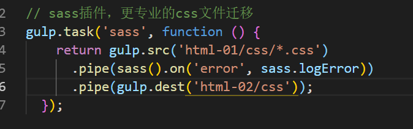

来看看cmd的运行效果：


我们惊喜的发现，上面的error似乎得到了解决方面，用了更专业的插件之后不再报错

而且文件同样也能诞生


通过这个sass插件安装案例，我们是不是弄懂了插件的作用，是不是要比我们亲自写要专业的很多？

要注意的是，这个插件还有一个非常实际的功能，就是能够将sass文件压缩编译处理，生成最终css文件。

在后面的项目中，我们可以注意一下这一点。


#### 6.default初始化操作

我在上面抛下过一个疑问，连续输入gulp html 和gulp css 难道不麻烦呢？

有没有一种方法，直接初始化这个gulpfile.js文件执行操作呢？

这时候我们需要了解到的便是default方法了

还是一样的，我们先全部删掉html-02整个文件夹，来测试一下效果

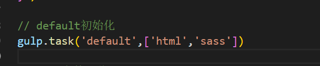

既然有了初始化操作，cmd终端直接输入gulp即可


咦？直接报错了

我突然意识到我学习的是gulp4，而我教程的方法是基于gulp3的，这其中一定有变化

于是我上网百度


验证了我的猜想，于是我寻找解决方案，发现如下的对比

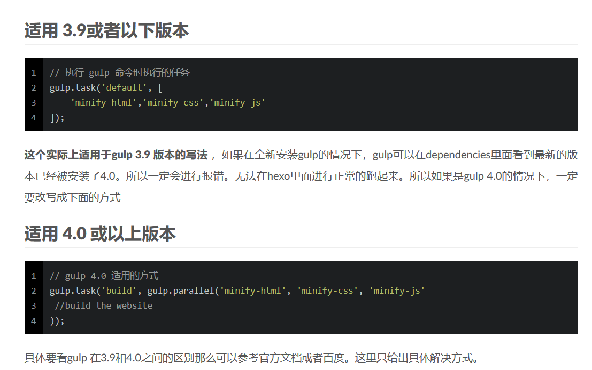

于是我修改源码，看看效果


也就是说，针对于glup3的列表方法，在glup4中需要改成gulp.parallel这样的方法


我这个方法应该不是最优解，报了个小错误，虽然不影响最终结果

但目前也没找到不会报错的方法，遂继续往下学习

效果非常的可观，直接默认初始化加载，实现一步到位


####  7.concat插件使用

发现了吗，我们在上面讲的都是html+css

难道js文件就不需要操作了吗？

实际上我们可以写一个js任务，无非是src+dest

但是我们有现成的插件可以用啊……

首先我们先接触一下这个gulp-concat

我们都知道这个单词是链接的意思

所以我们大胆猜测这是把所有的js文件拼接到同一个js文件里面


所以还是老套路，先安装这个gulp插件


然后在代码中应用


来看看运行的最终结果，果然不出我所料，最终产生了我命名的all.js文件


#### 8.uglify插件压缩js文件

但是在实际的js文件拼接中，拼接后的js的大小容易不符合我们的期望

所以我们需要进行一个压缩步骤，让整个项目的大小一直保持最小

所以我们需要用到gulp-uglify插件


所以我们先安装好这个插件然后把代码应用进去


最后在cmd运行一下，与上面的all文件大小对比


我们可以看到all-new的大小更小，注意我的试验文件本身就很小

当我一群试验文件大小大一些的时候，这个对比效果就会很显著

所以gulp-uglify插件是很有必要的，将合并后的文件进行压缩，节省更多的空间。

来看看压缩后的效果是怎么样的


#### 9.watch方法监控运行

我们学习了这么多，我们肯定要面对一个非常实际的问题

就是我想要一边开发一边备份到别处的时候呢？

我们是否想起了在上面，学习sass的过程中，也有一个watch来监控？

 sass --watch index.scss:index.css

所以我们的gulp中肯定也会有这样的方法辣


知道了函数的用法，其实就是对应的文件和对应的任务作为两个参数，这个非常好理解

所以我们需要一次性加入三个watch，分别是html文件、css文件和js文件压缩


为了验证他的监控运行效果，我先打开html-02里面的html，然后进行操作，看看是否成功同步上去


很遗憾，又报错了！但是根据上面的default报错，我第一反应是gulp4的写法应该变化了

所以我又熟练的百度，发现这个老哥是真的牛皮啊，又是他写的，所以我直接关注了他


来关注一下gulp4的新写法是什么


我晕，就是把后面的列表改成了回调函数，使用async()=>写法


我改成了这个写法，应该是可行的

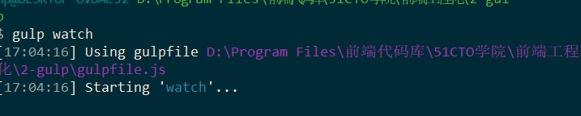

成功了！那就开始对html-01的html文件改动吧！看看html-02的文件是否成功同步修改


不行啊，改成列表吧


日啊，改成下面的方法还是不行


再去看一波博客


我透你娘啊，这个地方也要改


现在总算是有效果了，产生了同步的效果

现在我们回去，优化一下这个函数，看看起效果了没

优化失败，watch在gulp4貌似只能这样写了。


#### 10.总结

今天是学习前端工程化的第二天，所以从头复习一下sass和gulp吧！

复习之前我们数一下安装了多少个gulp插件，在package.json中是能反馈出来的


所以，我们所做的gulp项目是依赖于package.json进行创建的，这是一个gulp项目

多个gulp项目有多个package.json，只需要弄懂这一句话就可以了。

①sass复习

sass是一门css的扩展技能，它所使用的文件后缀的scss

主要是变量编译，我们可以把css的值进行变量编译，然后应用于下面的css布局

编译的时候，先在cmd中切换到当前目录，输入以下命令：

sass --watch index.scss:index.css

还有一个值得提的是，嵌套，这个嵌套非常好用，建议使用。

②gulp复习

gulp是一个非常优秀的前端工程化管理工具，能够实现文件迁移，文件压缩等功能

在经过一系列的npm更换源，npm安装gulp之后，我们正式开始配置gulp项目

1-新建一个gulp项目名字，cmd切换到此环境，输入npm init

2-配置好package.json后输入命令安装依赖此json文件的项目，npm install  gulp --save-dev

3-安装一些很有必要的gulp插件，比如sass，uglify等等

4-做项目的过程中，一定要注意gulp3和gulp4的变化。


## 四.node.js活学活用

#### 1.简介

Node.js® 是一个基于 Chrome V8 引擎 的 JavaScript 运行时。

我们经过上面的sass和gulp学习的时候，对node.js有了一定程度的了解

而且我们也安装好了node.js.

node.js到底是什么呢？

node.js是基于c++编写的一个流技术，它可以实现i/o操作，如电脑读写文件和web服务器

你可以粗暴理解成node.js是一个最简单的服务器！

#### 2.web服务器

官方有个粗暴的指南，我们点进去看

https://nodejs.org/zh-cn/docs/guides/getting-started-guide/


我们就尝试一下这段代码，按照它说的命名对文件，cmd切换对正确的环境

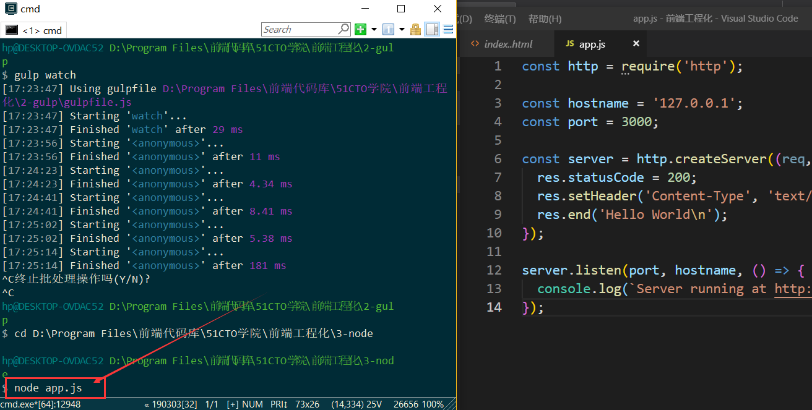

运行结果非常简单


#### 3.拆分js文件

node的一个强大功能便是能够拼接js文件，就好比上面gulp的concat插件一样

我们先做三个js文件，验证一下拼接效果


然后设置一个main文件进行拼接

所使用的方法是require，注意，这个方法不需要填写.js的后缀名


在cmd中运行一下这个main.js文件，看看最终效果


这便是node中拼接js文件的方法！


## 五.webpack对工程项目的作用


#### 1.简介与安装

**分而治之**是软件工程中重要思想

复杂的web系统：多功能、对页面、多状态、多系统

这段话很好理解，我们的网站项目肯定要兼容各种系统，各种终端啊，比如苹果手机和安卓手机。

所以，模块化是目前前端最流行哦的分治手段


再来一个最直观的图片，感受一下分而治之


所以，webpack的出现正是解决这个问题

官方网站是https://webpack.js.org/


看看官方的海报图，是不是瞬间有逼格和专业很多？

webpack的作用就是

- 打包js，css，image，其他文件等等
- 优化和压缩代码
- 用户获取网站资源更快，体验更好

当然了，这些功能是不是跟上面的gulp很像？

这两者都是前端工程化管理工具，gulp更像是流水线，配置不同的task完成不同的任务

而webpack更侧重于模块打包，把开发中的所有资源都可以看作模块,通过loader和plugins对资源处理

安装的时候我们需要参考官方文档，当然以下的官方文档，全是英文，肯定是看不懂的

https://webpack.js.org/concepts

这是中文文档，这就舒服多了

https://www.webpackjs.com/concepts/

通过对中文文档的浏览，我得出一个结论，和gulp的安装方式一样


都是通过npm进行安装，所以我们对照以下这个文档安装一波

但是千万不要忘记，在使用npm install --save-dev webpack这个命令之前

我们先用npm init，产生一个package.json配置文件，进行指向依赖


然后再输入安装webpack这个命令


对了，值得一提的是。安装完之后，再安装一下webpack-cli，也就是输入npm install --save-dev webpack-cli

把webpack的命令行附件给安装上去，这样能够在命令行中使用webpack了


#### 2.起步指南

https://www.webpackjs.com/guides/getting-started/

根据官方文档的起步指南，我们先创造好html文件和js文件


运行以下看看效果


并没有效果，这是为什么呢，这个注释给出了答案，需要一个叫lodash的玩意，继续往下看吧

往下看到了package.json需要修改，行，那就改成私有的！


再往下看，我们找到了lodash


在cmd中完成安装，安装好了之后看看怎么用


那行呗，加入这一句再说吧啊！

怎么还是没有效果啊，继续往下看算了


原来是全部打包到main.js文件啊，试试吧！

再来看看下面怎么说！


终端输入npx webpack就可以运行了？真的假的？


我透，必须按照他的标准啊，命名正确的目录去，完了，我估计index.html也需要放到dist文件夹里面

最终要按照这个标准来


弄好之后，输入npx webpack试试看吧！


看样子是成功了，打开index.html看看效果！


结果出来了？？？？所以我经过了刚才花里胡哨的操作，必须严格按照文档所说的，

最终完成了输出的步骤？webpack真惹不起啊！

不过为什么我刚才直接引入这段js程序，就是不起效果，必须要打包成main.js才可以，我也不清楚咋原因，先学着吧！


好了，继续往下看吧！下面的标题是使用配置文件


经过刚才的教训，我肯定不敢自己擅自命名了，只能乖乖跟着它写的来，呜呜呜！


不过通过这段代码，我居然看出了一些窍门


这好像是上面的打包成main.js的另外一种方法？

试试这条构建命令


看看cmd怎么说？？


我拿这段黄颜色的话上谷歌翻译看看


我可能看明白了，我们需要加一个mode选项?


再来看看最终cmd的输出吧！


哦吼，舒服，再也没有任何的报错辣！

不过，我至今还没弄明白bundle.js是干嘛的，到底怎么配置……看这个文件的样子，似乎很牛逼

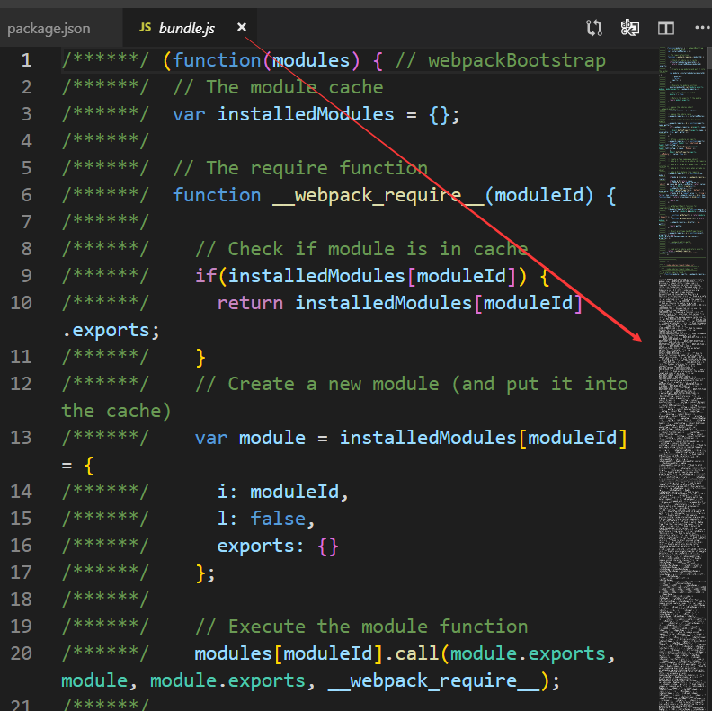

不过把index.html的main.js改成bundle.js，是可以，这说明把index.js的功能也打包进去了


不管了，继续往下看吧，下面应该能讲到这个玩意的。

我们只需要得出一个恐怖的结论：

**npx webpack打包成的main.js 和 配置文件打包成的bundle.js都能够运行**


现在推荐使用npm run build(把build对应好)进行配置文件打包，这个方法怎么弄呢？


再来看看下面的NPM脚本吧！


行吧！加一句这个，再看看怎么运行这个命令


看看cmd的最终效果


我明白了！！这个分明是简化命令的玩意。当我输入npm run build的时候，这个命令指向了我设置的webpack命令

那我回去修改一下命令，将build改成配置文件命令


再来看看cmd输出效果


看见了吗，原来npm run build就是个简化命令，终于有我看得懂的部分了。

好了，下面好像没有了，是个结论部分


额，额，这就完了？

我看完起步指南，我还是一脸懵B的，都不知道webpack到底想表达什么？？？

还是往下看吧，日!


#### 3.管理资源


不明觉厉，它好像是说webpack的打包比gulp的打包还要牛逼，也行！

webpack是通过loader来引入其他类型文件的。


？？？？ 他想表达什么??这个标题后面难道能拯救世界吗？？


webpack想要加载css文件，需要下载一波

不过，我们还了解到，webpack是支持sass的，在上面我还了解到一句话

webpack是通过loader来引入其他类型文件的。

所以我们可能还需要输入npm install --save-dev sass sass-loader


所以这波，我们安装四个就足够！

再往下看，他说package.json发生了改变，我们来看看，确实是这样的


好了，接下来的笔记是针对于css文件的，因为最后面还会讲个针对于sass的，正好复习一波

①css文件

先构建一个css样式


然后在js文件中写入class


现在，我们在cmd中加载一下，看看是不是成功出来了


噢？没有任何效果。我们可能少了一步

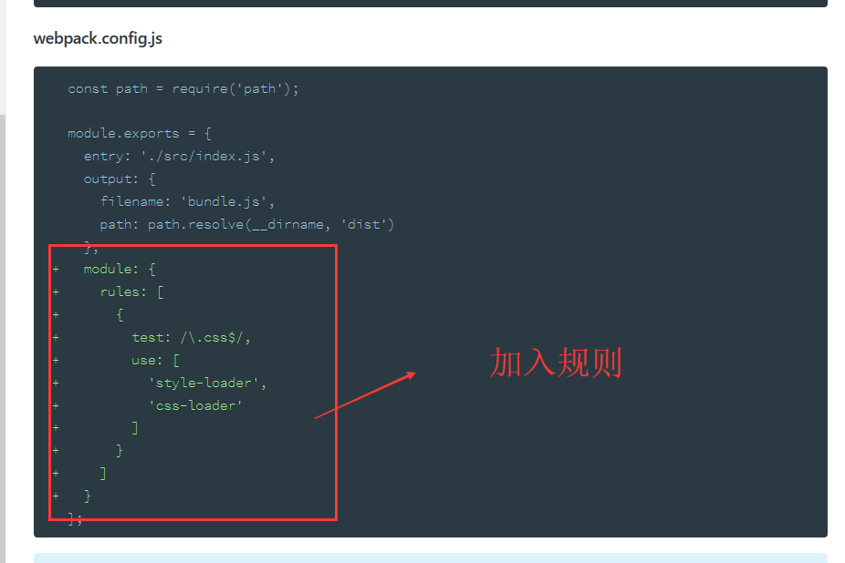

补充上去之后，再在cmd中进行应用

成功了！


再在bundle.js文件中看看究竟


这说明了什么，说明配置文件会自动识别src下的所有css文件和js文件，最终压缩打包到bundle.js去发挥作用，所以在我们的主index.html文件中，只加了这一句


通过这个案例，也许我们能够更加理解了webpack处理css文件和js文件时所使用的打包手段，并能够压缩到bundle.js文件发挥作用。

由此我们可以推导出来：**webpack对于前端项目的打包方式最终打包到一个bundle.js文件**


②sass文件

讲完了css的使用方法，我们终于要把重点放在sass的使用上

首先我们先锻炼复习下sass吧，先写个html+sass


配置好之后，我们需要修改一波module规则

在此之前，我们必须接触一种插件，我们知道，在上面写css的过程中，css代码和js代码是混淆打包的

这个现象其实是不好的，这样容易引起代码错乱的现象，所以我们需要安装以下的插件：

extract-text-webpack-plugin该插件的主要是为了抽离css样式,防止将样式打包在js中引起页面样式加载错乱的现象;

安装方法(踩bug后的终极正确版本)：npm install extract-text-webpack-plugin@next --save-dev

安装好这个插件之后，肯定是引入插件啊


然后就完善一波module


这个非常好理解吧？


就是说，我们编写了sass文件，然后交给配置文件去处理，其中使用了extract-text-webpack-plugin这个插件

是在编译所有css文件和js文件过程中抽离出来css文件，避免打包进去bundle.js的时候代码混淆了，引起错乱

然后针对于sass文件，在module中有两部分：

一个是rules规则，里面用了use和fallback，先use进行编译成正常css文件后fallback加载style-loader完成全部的编译

一个是plugins插件使用，将css代码抽离出来产生新的style.css文件，避免与js文件一起打包进入bundle.js

说了这么多，继续往下配置，我们既然产生了新的style.css，所以html代码需要提前写好


直接开始尝试配置文件加载吧，查看cmd


还是报错了，说明我们对于sass这部分缺少了node的支持

进一步cmd安装，输入npm install node-sass --save-dev


最后再跑一次配置文件看看效果

（注意两个小坑：index.js需要修改成import './index.scss'，use的列表里面必须先css-loader再sass-loader）


这里面虽然报错，但是最终的效果还是非常可观的


总结下来这就是sass文件编译的写法，需要注意的是提前写好link:style.css

因为extract-text-webpack-plugin插件能够抽离出来css文件，然后就是一些小坑，都要注意一下

当然了，如果你在做小项目，可以不需要这个插件

问题是你如果没有这个插件，把css混淆进去你的bundle.js文件，这其实是个很不规范的行为

这样你的工程项目并没有css文件了，看起来会不专业

不过我们还是可以了解一下的


use的列表一定要按顺序，不按顺序就会报错


直接混淆进去，不需要考虑这个link:style.css了


最终的结果还是一样的


但是到了大的项目，这样肯定就不行了，所以我们需要使用这个插件，进行抽离css，更加规范严格化

此时此刻， 我们的webpack目录应该是这样的


#### 4.多个资源

在上面，我们讲了如何打包单个js文件，单个css文件以及单个sass文件，但是实际上的项目并不会是单个的

我们需要实际掌握打包多个资源的办法

在此之前，我们需要将index改成index-1，这样方便编写多个资源


然后开始编写个index-2.html文件，同时，也安排上去index-2.scss和index-2.js


我在这儿已经写好了

接下来我们要研究的就是webpack.config.js配置文件应该怎么打包多个资源？

首先我们需要判断出来的是，要改的地方肯定有三个


这三个地方，第一个地方改成批量处理，后面两个地方改成自动命名

我们该怎么去修改呢

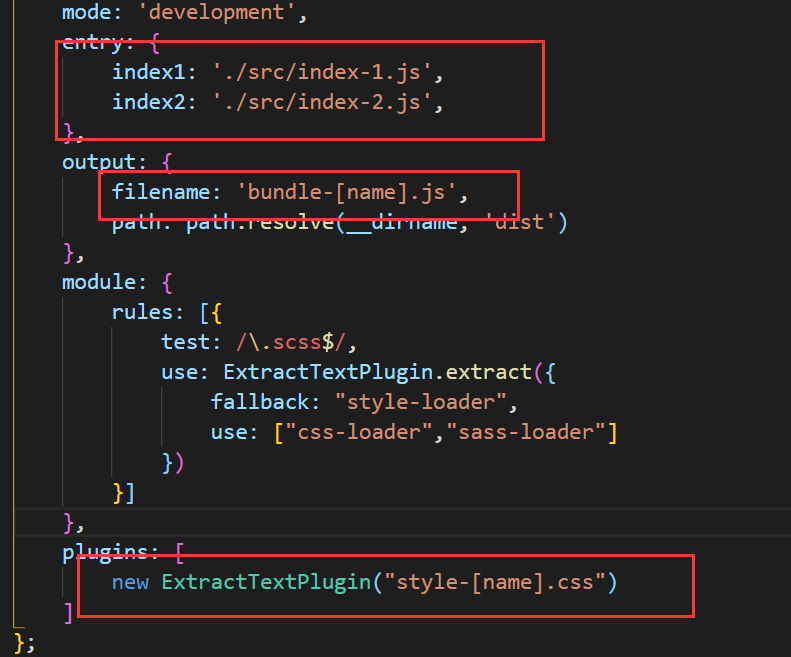

改用字典存储之后，根据这么命名方式，产生的新文件必然是bundle-index1.js和style-index.css这样的文件

所以我们需要在两个index.html中修改一下引用

然后在cmd跑一下代码


看到了吗，效果非常的好，采用了这种智能命名的方式。

再来看看运行的效果：


非常完美，多个资源成功被打包，都能显示出来正确的样式。


#### 5.监控修改

还是要回到最实际的开发问题，我如果想一边开发一边模块打包呢？

我们在sass和gulp都接触到了watch方法监控运行修改

在webpack中同样的是，也有watch方法监控修改

输入命令：npx webpack --watch


然后我去index-2稍微修改一下html和scss


再来看看页面展示情况，发现成功修改了


所以，这便是watch方法，一边写代码一边打包。

得出一个恐怖的结论：

**sass、gulp、webpack都能实现watch方法一边修改一边同步。**


#### 6.安装服务器

代码肯定是在服务器上面跑的啊，这还用说吗？

所以我们先安装个服务器

输入命令：npm install webpack-dev-server --save-dev


然后在配置文件配置上去服务器


然后就在cmd中输入命令搭建本地服务器

输入命令：npx webpack-dev-server --config webpack.config.js


现在就可以开始打开本地http://localhost:8888/了


看到了吗，这是一个小型的本地服务器，里面有各种文件


这个服务器支持在线修改，我就随便修改一下文本的颜色吧！


发现了吗。当我修改文件代码的时候，服务器自己同步了修改。

这个本地服务器是真的方便，不需要刷新就能同步修改。

通过这个知识点，我们已经窥探到了服务器实际开发的雏形

在今后公司开发前端的时候，无疑是在服务器上面进行开发的

能够进行自动同步，自动备份，自动打包这样的功能。


#### 7.终极命令

所以我们学会了本地服务器，能够实现自动加载自动打包

那为什么不优化这部分的命令，加入到便捷命令呢？

今后的编写项目就基础于这个web服务器啊


这是优化的参数，我们可以加在后面


再来看看实际cmd


这样是不是就专业很很多？

我在上面说过，要把这部分命令加入便捷命令，成为终极命令

是否想起了上面学习的npm run build？


这样一来 ，是不是下面的go就比上面的build好好很多啊

因为go里面也包含了更新配置文件

所以在今后编写项目的过程中，直接使用npm run go就可以了

既能更新配置文件又能上本地服务器实现实时刷新实时打包


#### 8.总结

 webpack无疑是最好用的模块打包机，相对于gulp，不再是简单的复制备份

而是将所有的文件压缩到指定的文件里进行发挥作用，使整个工程项目大小最小化

在经过一系列webpack的安装之后我们需要新建几个文件夹

src文件夹装所有的css、scss、js等文件

dist文件夹装所有的html文件，以及打包出来的文件也会存储在里面

所以此时你的目录结构应该是这样的


 打包方式一共有两种，一个是npx webpack命令打包成main.js文件发挥作用

但是这个方式只是最简单的打包，专业性不如接下来的另一种：

新建个配置文件webpack.config.js,打包方式都写入这个js文件

然后输入npx webpack --config webpack.config.js进行打包

打包的结果自然是产生个bundle.js，将所有的css和js打包进去发挥作用

但是这个命令是不是太长了，我们需要简化一下，

所以我们在package.json中将这个命令简化成npm run build，

所以npm run build便是我们采用的最好的打包方式。


但是试想一下，如果把css，scss，js都打包进去bundle.js，是不是容易引起代码错乱

所以我们需要一个插件将css代码剥离出来，产生新的css文件放入dist文件夹

这个插件便是extract-text-webpack-plugin：为了抽离css样式,防止将样式打包在js中引起页面样式加载错乱的现象

安装的方式是：npm install extract-text-webpack-plugin@next --save-dev

然后在module中配置好rules和plugins


 我们肯定要应用sass文件，对于css和scss的打包解析我们需要使用loader

所以这条命令一口气全部安装到位

npm install --save-dev style-loader css-loader sass sass-loader

安装好了之后，还要获取node对sass的支持：npm install node-sass --save-dev

注意，loader的顺序是有讲究的：style-loader，css-loader，sass-loader

不然就无法解析打包scss文件。

多个资源处理打包的话entry面对的形式是对象，存储多个js文件。

与sass、gulp一样的是，sass也有watch，可以进行边修改边打包

npx webpack --watch

但这个毕竟是个低级的方式，真正牛的方法是使用本地服务器

那样才是真正的一边修改一边同步一边打包一边备份

安装服务器命令：npm install webpack-dev-server --save-dev

然后配置文件配置


然后就跑代码服务器，我们需要加几个有用的参数

--colors：输出颜色化，--progress：显示打包进度，--hot：热加载，自动刷新

然后就是这样的长命令:

npx webpack-dev-server --config webpack.config.js --colors --progress --hot

但是这个命令太长了，我们可以使用package.json简化命令

将这个命令简化成npm run go


此时此刻，我们就得出了npm run go这样的终极命令

可以开始自动打包，在此期间能够修改，一个工程项目就可以正式地编写了


## 六.sass、gulp和webpack实战

#### 1.sass和gulp

做一个简单的商城页面，购物车页面以及结账页面

前两个页面使用html+css完成，结账页面使用bootstrap4完成，当作复习

现在的需求是前两个页面使用html+scss完成，然后放入gulp项目

然后让gulp项目进行编译和打包，生成最终的css文件

---

OK，让我们开始gulp项目，首先开始创建一个gulp文件夹，cmd切换到这儿

1 - 输入npm init配置package.json


2 - 输入npm install  gulp --save-dev，安装个gulp项目包

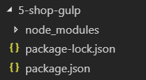

3 - 创建一个gulpfile.js在主目录下


4- 安装gulp-sass、gulp-clean-css、gulp-htmlmin插件

①gulp-sass


②gulp-clean-css


③gulp-htmlmin


5- gulpfile.js中配置上这三个插件


6 - 编写商城项目，写好html+scss


7 - 编写完所有的scss文件，使用变量编译与嵌套规则


8- 编写代码，引入三个gulp插件


9-我们需要寻找如何打包图片的方法，给打包备份过去


10 - 使用图片打包压缩插件，即gulp-imagemin插件，然后完成收尾工作


进入终极阶段：


总算完美地完成了项目，途中我尝试自己寻找gulp插件解决问题

在此期间，我知道了什么是自己动手丰衣足食，独立思考的重要性

还好一切非常顺利，这让我认识到了gulp插件的强大。


#### 2.sass和webpack

经过了上面的sass和gulp项目实战，我觉得我的动手能力得到了一个非常大的提升。

这告诉我们，官方文档才是最好的，学会自己搜索无疑是养成良好的自学习惯。

那么接下来的webpack就小菜一碟了

就新建个webpack项目，把js写的备忘录项目给弄进去吧

把css文件也改写成sass，最后生成html、css和bundle.js，在dist里面生成。

主要是再次熟悉一下webpack模块打包的方法，虽然上面写了好多总结，但是实战一次加强记忆肯定没错

---

OK，let‘s go，首先新建一个新的文件夹是家常便饭

1 - 还是老规矩，输入npm init产生package.json文件


2 - 安装个webpack项目，npm install --save-dev webpack


3 - 修改自己的package.json，改成私有


4- 安装lodash插件编译打包压缩js文件，输入npm install lodash --save-dev


5 - 配置上src文件夹，里面有备忘录的scss文件和js文件


6- 配置上dist文件夹，里面有备忘录的index文件


7- 将src里面的css文件改编成sass类型的文件


8 - 创建配置文件webpack.config.js，别忘了补充mode选项


9 - 在src的js文件中import进去lodash插件，还要引入scss文件


10 - 输入npm install --save-dev style-loader css-loader sass sass-loader编译sass


11 - 输入npm install node-sass --save-dev获取node对sass的支持


12 - 输入npm install extract-text-webpack-plugin@next --save-dev安装剥离css文件插件


13 - 完善webpack.config.js的代码，配置好打包步骤


14 - 简化打包命令npx webpack --config webpack.config.js为npm run build


最终效果：

注意，我们忘记安装了命令行功能cli，还好这儿可以补上


效果非常可观


直接打开dist里面的html文件


我们发现，新bug产生了，js文件失效了，初步排查原因是这个样子


解决方案是将这两句独立出来，设置成index.js用来专门引用scss文件


然后完善一下配置文件代码


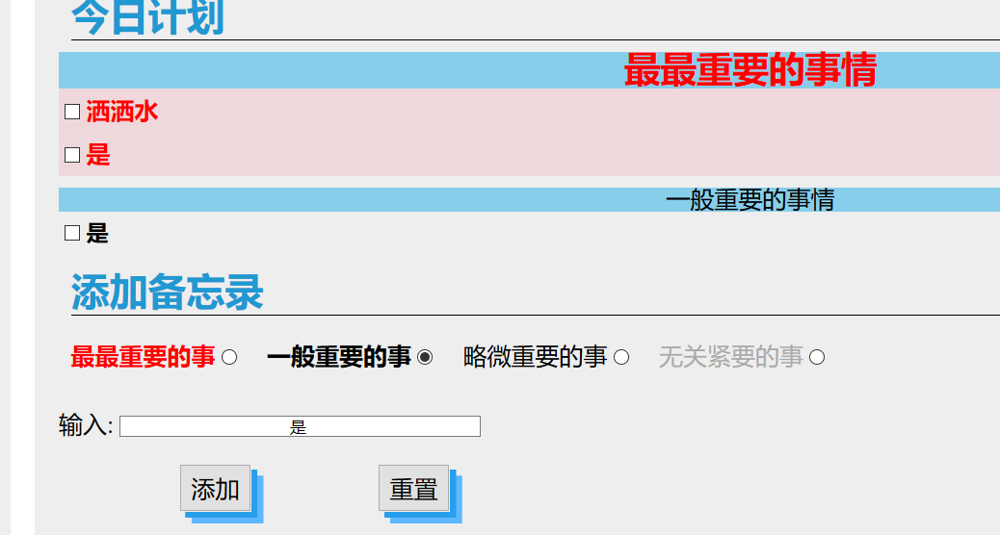


