# 进入Vue玩转前端开发的时代


## 一.Vue的快速上手


#### 1.特点

- 渐进式Javascript框架

- 创作者是中国人尤雨溪

- 文档齐全，中文支持超级友好
- 周边系统强大
- vue框架易于上手
- 便于与其他代码库整合
- 核心文件体积小
- 组件化开发
- 虚拟文档模型：Virtual DOM，性能优秀
- 渐进式框架，处于是框架又不是框架的状态
- 支持混合预处理器比如sass到css


#### 2.文档

这是官方文档链接，但是网络访问可能会慢

https://cn.vuejs.org/v2/guide/

这是国内域名的网站，方便访问

http://doc.vue-js.com/v2/guide/


#### 3.分而治之


这就是分而治之最为直观的效果，形成一个虚拟文档模型Virtual DOM，进行树状结构统治


#### 4.查看示例

往下翻官方文档，看看最经典的示例


点进去之后，发现是别的网站……不过例子还算非常经典


哟吼？好像很简单，这个是引用网络vue框架源，然后在js中new个vue对象，进行对html代码的响应

最后我的页面就产生了hello world的招呼句子


#### 5.网络源演练

我们就本地创建个简单的示例，html+js


然后看看官方怎么说的


然后尝试编写html+js完成最简单的示例


代码编写解释如下


最终效果图

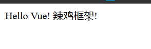

#### 6.本地源下载

CDN网络源虽好，最大的问题就是断网之后就不能使用了

所以我们还是要亲自下载一波Vue源码进行引用


然后放入本地文件进行script引用就行了

速度也会得到最大的提升，因为你是用网络源，就会多一个网络连接访问的时间喔~

#### 7.完成剩下的起步


把这两段代码加进去看看效果


这样我们就明白了大概，我先不看下面，分析一下


再来看看下面的官方文档怎么会解释的


意思就是说这个span发起了指令，让message的内容与title特性保持一致？


控制台支持vue的操作，我们就试一下


我们现在可以总结，vue的方法估计都是v-开头的，我们往下浏览寻找一个好的例子


这是一个很有有意思的例子诶，vue的for循环方法是v-for实现的

问题就来了，v-for方法的值是todo in todos这种形式的？然后下面就是Vue特有的两个大括号括起来的变量传递，我盲猜这是一个生成列表的方法


我们可以发现，以往的{{message}}的话，这儿应该是message

但是这个却成了数组里的对象排列，呼应了v-for方法的todo in todos


这个肯定是vue对象实例，所以我们应该可以通过控制台进行添加列表项


在控制台尝试操作一下：


经过这个起步，我们应该初步弄懂了Vue框架的作用，不，完整的叫法应该是Vue.js

我们可能初步认识到了Vue.js的框架方便，通过vue.js文件快速搭建出来一个项目，方便维护和修改HTML5的内容，一切都可以在控制台完成，免去了亲自修改HTML5代码的麻烦。


## 二.Vue怎么生成HTML


#### 1.插值

我们在上面已经接触了插值，最经典的便是{{message}}

公式是文本 {{变量}}

我们可以对官方那个简单示例进一步拓展


在vue中，new一个Vue对象之后，里面的el方法是用来抓取指定元素的

抓取之后就可以对里面的内容进行操作，所以我又插了几个值，看看效果如何


没有换行，因为我们只是个插值，肯定没有涉及到换行，可以通过套块级元素的方式达到换行的目的

值得一提的是，在插值的方法中，有两种字符串插值的方式


效果也出来了：


插值能做的事可不止这些，还能进行布尔表达式判断

公式是{{条件语句?结果1:结果2}}

来看看下面的示例吧!


网页的结果也是出乎意料之中


这就是插值结合布尔表达式的一个简单应用，会有函数控制变化true和false来达到切换目的。

现在要来搞一个比较重要的部分，就是该怎么引入代码


来看看效果：


代码没有生效，这个时候应该怎么做呢？

我们会往下接触到指令，解决这个操作。


#### 2.指令

我们在上面同样也接触到了指令，就是那个v-for

就是带有v-前缀的特殊特性Vue方法。

那么使用这个vue方法该怎么解决插入HTML代码呢？我们来找一找官方文档


官方文档给出了一个很好的答案，通过v-html指令来让网页加载html代码

v-html指令的值就是html对象的变量名，用字符串形式

所以我修改如下:


查看网页效果：


这便是v-html指令的作用，具体的用法通过上面的图能看出来

就是往v-html指令所在的元素，往里面加载HTML代码，发挥作用，类似于生成子元素进去

---

指令这些操作的过程便就是页面渲染与绑定，通过vue.js的代码生成了最终的HTML页面，这便是Vue框架的作用。


## 三.Vue从零单排

首先我们学习一下Vue底层的基础，上面只是一个快速的入门，现在我们需要从零单排开始看基础，彻底强化理解，所以官方文档走起！！！


#### 1.Vue实例

我们在上面已经知道怎么创建一个Vue应用了


以new Vue({})的形式，原生的js语法创造而成，所以这是Vue.js


这张图就像是再说，所有的Vue行为组件都是通过Vue实例去完成的

那么数据的更新到底是怎么完成呢，我们也在上面接触了data方法


Vue里面是有ViewModel进行试图控制的，这类似于一个设计模式MVC，使用的是model-view-control，也就是模型视图控制，正是因为这个的存在，Vue的数据都是响应式，但注意，且是data中的属性，换句话说，Vue实例里面的变动都是响应式的。


实例生命周期钩子实则就是一些直接运行的函数，但是我们必须关注的是


只有methods方法的事件函数才能使用箭头函数，其他地方统统禁止使用，这样会影响作用域触发异常。

官方文档给出了个有意思的交互图，这也很好地解释了响应式，以及Virtual Dom的方式


这个地方就非常清晰了，Vue底层是ViewModel与Virtual DOM合作，形成一个链子，最终创造出了响应式。

注意这部分，面试官最爱问这些玩意。

#### 2.模板语法

最直接的就是插值


但是我们可以了解到插值的另外一种方式

就是不让这处内容被修改，第一次插值之后就锁定

方法就是v-once指令


然后我在控制台尝试打印，发现确实是改不动


## 四.Vue整理再出发

#### 1.条件渲染

- v-if
- v-else
- v-else-if
- v-show

这四个都是用来填写真假表达式的指令

v-if和v-else的结合应用非常简单，前提是他们都要在同一个Vue对象里面


上面是一个非常简单的示例，条件判断生效的前提是两个指令都在同一个Vue对象里面

网页输出效果如下


当然了，我上面讲的是两个条件，如果碰到多个条件该怎么编写呢

其实也是一样的，是v-if/v-else-if/v-else的顺序来编写即可


查看效果：


咦？怎么发生错误了？？

原来是data里面搞错了，data是字典形态


最终来看看效果，我们完成了多个条件判断语句


至于最后的那个v-show，非常好理解，但它并非是严格意义的条件判断

它是一个显示函数，需要和布尔表达式结合，当结果为true时，内容会展示


这样，在网页肯定是展示不出来的，因为1>2是false

于是我们改成1<2，看看效果如何


以上四个指令就是我们需要了解的条件渲染

先总结一下：

多个条件判断直接上v-if/v-else-if/v-else即可，它们都要在同一个Vue对象

如果你想要控制某个东西可不可见，使用v-show指令结合布尔表达式

---

#### 2.列表渲染

最关键的列表渲染指令，肯定是v-for

下面是v-for指令所能够做到的事情


| 作用     | 指令示意                      |
| -------- | ----------------------------- |
| 打印数组 | v-for="item in items"         |
| 获取索引 | v-for="(item,index) in items" |
| 对象取值 | v-for="value in object"       |
| 对象索引 | v-for="(key,index) in object" |

打印数组我们已经在上面的起步中见识过了

我们现在就再复习一波


这其实是数组形式，只不过数组里面都是对象

所以上面的调用是直接调用对象的kv属性打印出来，效果如下:


这是最好的形式，当然了，也可以直接打印每个元素的全部内容，也就是{{todo}}


这上面我介绍的是数组形式的打印，其实，对象形式也可以直接打印

方法里面就可以直接进行对象属性调用

这儿，我们会看到一个大坑，也是Vue的特殊性


我这样写，没有任何疑问吧，就是正常地取值KV出来，但是我们看看结果，却是相反的


这便是Vue的一个坑，坑来自于这儿


这儿的(key,value)竟然是先抓取属性值再抓取属性名，顺序颠倒了！


最后效果就变得正常多了


当然了，列表和对象都有index索引的玩意，我们可以直接加上去


效果如下：


以上这四个方法就是我们需要了解到的列表渲染指令，下面也有一些拓展

先总结一下:

对于列表打印，就是v-for指向类似{{todo in todoList}}形式，

对于对象打印，就是v-for指向类似{{(value,key in objectName)}}，其中是value先放在前面，一个坑

---

#### 3.数组更新

数组更新有两种方法，一个是变异方法，一个是非变异方法

变异方法非常好理解，就是函数方法能够改变数组自身的方法

我们在上面的起步中就接触到了push方法，添加元素项


然后有push，就必有pop()方法了，这是肯定的

pop()的作用必然是默认弹出删除最后一个元素


除了这两个之外还有shift()，unshift()，splice()，sort()，reverse()等等

这些函数方法其实就是基于javascript的，所以我就不过多介绍

---

我们来看看非变异方法，这是采用替换旧数组方法

这很好理解，都说了非变异方法是不改变原数组的，所以需要赋值替换

就来说说filter()过滤函数吧


使用了ES6的箭头函数的过滤函数，过滤掉日期小于5.4的事件，效果如下：


对于非变异方法，想要使用，加个赋值就可以改变了。

---

#### 4.样式绑定

在上面，我们都是对HTML代码进行操作了，然而前端并不止HTML，还有CSS样式呢

所以接下来学习的便是class属性绑定和style属性绑定

首先来讲讲绑定class属性，指令是v-bind:class

最经典的指令是v-bind:class = "{red:isRed}"

为了方便验证class属性的绑定，先写好如下:


然后开始尝试编写Vue了


查看效果：


改成false自然是失效了

所以v-bind:class的意思自然是class属性名:真假表达式，如果为真，就绑定上去

当然了，还有另外一种更好的方式，一般来说这个比较更好，就是直接绑定对象

公式是:v-bind:class="classObject"


这个绑定方式是最好的，把所有class属性都归纳到一个对象里面，方便结合布尔表达式进行控制class属性

我把red和green都改成true


所以我们就学会了对象绑定class属性的方式，其实下面也有个列表绑定class的方式，可以适当了解下

其实列表绑定class的方式也一样可以切换，比较适合于双向绑定开关


这种列表绑定class的方式就很适合一对class属性的控制，切换的时候就修改值就可以了~

当然了，列表里面的元素可以是一个对象,进行布尔表达式的控制

```句
<div v-bind:class="[{ active: isActive }, errorClass]"></div>
```

具体的用法我就不再讲述了，我们接触到了四种绑定class属性的方式，其中比较推荐使用对象绑定方式。

讲完了v-bind:class指令，v-bind:style自然也会用了吧?都是差不多的用法，但为了加强记忆，讲一下

我说过，v-bind:class指令与v-bind:style指令的用法是极其类似的，但我推荐对象绑定方式，所以就讲一下这个


展示效果如下:


所以，总结如下：

样式绑定分别是v-bind:class与v-bind:style这两个，最好都使用对象绑定的方式使用。

---

#### 5.表单绑定

Vue框架在制造表单方面提供了很高的便利性，使用的指令是v-model

这是一个动态的双向数据绑定过程，它会根据控件类型自动选取正确的方法来更新元素

一定要注意，HTML5的代码中的属性是不会生效的，因为v-model的特性如下：


input的原始初始值应该通过Vue.js来设置

一般来说，input最经典的四种分别是text，textarea，checkbox，radio

- text 和 textarea 元素使用 `value` 属性和 `input` 事件；
- checkbox 和 radio 使用 `checked` 属性和 `change` 事件

我们就先来看看最普通的文本处理事件吧

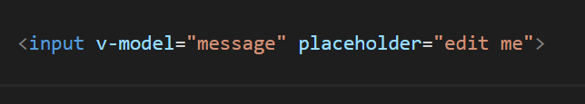

一句话就能制造表单，这说明了Vue框架的方便性

为了验证双向输出的特性，我们加入一句并编写Vue代码，设置默认值为空


然后我们输入东西的同时，下面也会跟着同步


这个就是Vue操作表单的基本步骤，当然了，如果要操作textarea的话，把上面的input标签换成textarea即可~

现在我们要接触到的是三个修饰符，用来修饰v-model指令，来优化输入的玩意

②.lazy


加了这个修饰符会怎么样呢？

我们知道，v-model默认操作的时候，输入东西，下面就会同步显示

现在加了.lazy修饰符之后，事件就会转换到change事件，比如按回车，点击鼠标的时候，下面的数据才会同步修改~


②.number

这是一个很贴心的方法，能够将用户的输入自动转换为数值类型，类似于parseFloat()方法


我们就在控制台验证一下


看到了吗，加入number修饰符之后，自动转换为数值类型，非数字都会被过滤。

③.trim

这个修饰方法就非常的常见了，就是去掉用户输入左右两端的收尾空白字符

这是处理用户输入的常规手段


以上讲的这些修饰符都属于input或textarea的特性，接下来我们要讲的就是选择框

---

checkbox 和 radio 使用 `checked` 属性和 `change` 事件

我们需要记住这个

所以我们的复选框的属性就出来了，也是直接v-model="checked"


看看页面效果就知道了


如果想要知道多个复选框呢？一样简单

v-model方法改成checkedNames，然后把下面的插值变量设置这个名字，并成列表形态

当然了，每个input都要有value代表选中的值


查看效果如下：


讲完了checkbox的复选框，那么单选按钮也很简单了吧？

只需要把type属性改成radio，然后单选框的v-model方法是picked，设置成字符串形式就可以啦~


效果如下：


所以我们学会了两种选择框的输入方法，也学会了上面input表单输入的方法，你以为这就完事了吗?

千万不要忘记了还有一种input也很重要，就是下拉选择

当然了，这个也很简单，我们只需要知道v-model的方法是selected


效果如下：


所以，经过我对表单绑定的学习，我总结如下：

input表单输入，v-model指向自定义名字，最常用的是message，能使用三个修饰符

checkbox复选框选择，v-model指向checkedNames

radio单选框选择，v-model指向picked

select下拉选择，v-model指向selected

---

#### 6.事件处理

事件处理在Vue的最主要的重要是监听DOM，运行js代码进行控制

最经典的便是点击事件，实现方法是v-on:click = "js代码"

当然了。js代码需要封装，这样才有专业性，封装后函数放入methods对象，实现复杂逻辑

封装后的点击事件应该是这样的：v-on:click  = "函数名(参数)"

除了点击事件之外，还有键盘触发，这时候我们需要的就是案件修饰符

- Enter回车键触发方法：v-on:keyup.enter = "submit"
- 更简写的写法，上面这样写太麻烦了
- 简洁的写法：@keyup.enter = "submit"
- 浏览小说时，翻页键：@keyup.page-down = "onPageDown"

以上就是简单的键盘按下事件，做一个很简单的介绍

在进入事件处理的正式学习之前，我们需要关注为什么要使用v-on去做事件触发？


我们知道，我们在HTML中加入代码是有点违背前后端分离的，但是我们不需要要担心，因为这些事件都是绑定在当前视图ViewModel上的，维护起来根本不麻烦，只需要对ViewModel动手即可~

现在，让我们做一个最简单的点击事件~


在代码中，我使用了简写，反正v-on:就等于@，然后我在里面写了小小的js代码，也就是number自增1

效果如下:


但是我们必须考虑实际，js代码全写在里面是不现实的，我们需要封装js函数

我在上面提过，封装后的函数加入到methods方法即可 ~


点击按钮之后出现弹窗


所以，这个方式便是我们今后编写js的DOM操作代码方式，@click指定的函数名字加入到methods进行封装即可

当然了，我这儿只是介绍的是无参数的方法，如果你有指定的参数传入，完全可以这样


最终效果如下：


如果你是单纯地设置个参数，而参数又想交给data处理，也行，在HTML不需要加括号

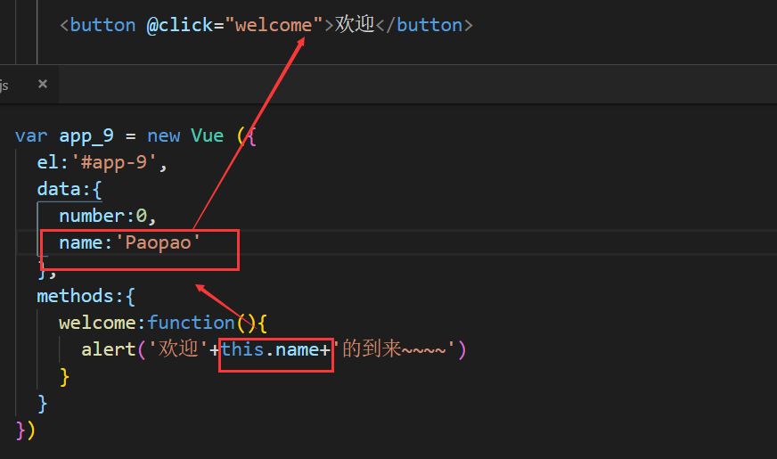

通过这些例子，想必你已经对绑定点击事件的函数应用和参数应用方法有所了解。

值得一提的是，我们在上面接触过input绑定的v-model是双向绑定，所以我可以相结合起来


输出结果如下：


我输入什么，按钮就显示什么，然后弹窗也跟着显示什么


以上就是我们所学习到的点击事件，对于参数的多重写法，那么对于点击事件我们需要注意的是什么？

①如何防止冒泡传播？

冒泡传播是什么？是一个很奇怪的现象，就是父元素如果也有点击事件的话，点击子元素的事件，就也会触发父元素的事件

让我们来一个简单的例子，说明一下冒泡传播


当我点击这个按钮的时候


那么到底应该怎么阻止冒泡传播呢？很简单，上面的表单绑定有个修饰符

我们的点击事件也有修饰符，阻止冒泡传播的修饰符正是stop


接下来我们要接触一个非常关键的修饰符

我们知道，button属性有个submit，是提交的按钮，每次点击它的时候 ，它是不是都要重更新刷新页面？

那么到底怎么阻止这个刷新页面呢，让它以不刷新页面的方式去提交数据


给这个submit提交按钮上一个prevent修饰符，就可以阻止它刷新页面了

当然了，我们有些用户喜欢键盘提交，这时候所用到的自然是键盘输入事件

在上面我就介绍了Enter事件是@keyup.enter


千万不要忘了，如果你想要获取输入的内容，v-model指令是不可少的！

最后来看看效果


这便是键盘回车事件，也是一个非常常用的一个事件。

其他键呢？就没有事件呢？有的，都是以修饰符的形式存在


但这些已经停止更新了，但依旧能用于旧浏览器，也可以适当了解一下。


总结一下：

就是事件的指令选择v-on，这是Vue特有的绑定到viewmodel指令，以此为基础，一般有点击事件和键盘事件

点击事件就写@click，这是简写，修饰符有stop阻止冒泡传播，prevent阻止页面重载，这两个比较常用，还有once，是只触发一次事件，也可以了解下

键盘事件一般以回车最常用，就写@keyup.enter，还有小说翻页符也可以写成@keyup.page-down，一般来说，常用的键都可直接做修饰符


## 五.Vue组件化开发


#### 1.组件的作用

组件在Vue毫无疑问是非常重要的组成部分

我们在前面已经知道，Vue将一个页面解析成Virtual Dom的树状结构，进行分而治之的布局

我们先来了解一下组件到底是什么

- 组件是可复用的Vue实例，封装好的名字
- 因为是封装好的，所以可以复用，制造多个
- data在里面必须是一个函数，需要return返回，这样就是单独作用组件
- 需要先注册后使用，因为这是Vue实例

我们了解到了这些，组件到底是干嘛呢？来看看下面这张图


看到了吗，组件树的形式构造出页面！例如，你可能会有页头、侧边栏、内容区等组件，每个组件又包含了其它的像导航链接、博文之类的组件。

所以，各个组件形成一个页面结构，一个组件负责一个区域，用来完成Vue交互~

#### 2.组件的重要属性

- data:在子组件必须是一个函数，需要return
- template:HTML页面模板
- props:一个自定义特性列表，接收传值，作为属性
- methods:包含多个自定义函数的对象
- watch:侦听属性，响应数据变动
- computed:计算属性，响应数据变动，优先采用
- created:创建组件时，初始化数据

#### 3.做一个简单的组件

我们在上面说过，需要先注册组件才能使用

然后template是生成HTML页面模板的

所以我们定义如下：


看见了吗，定义好组件的方法之后，直接用组件的名字当作标签，

这样一来,vue.js在生成页面的时候，会将这些标签渲染化


我又在上面提过，组件是可以复用的，

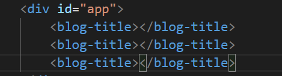

渲染到页面中是这个样子


但是！！！这个标题，我希望它是可以维护修改的，所以要定义一个titile变量里面，加入data属性

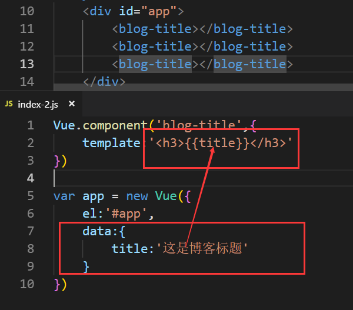

可是在页面中并没有任何的反应，所以我们需要给标签传入属性，并且给组件化上一个props

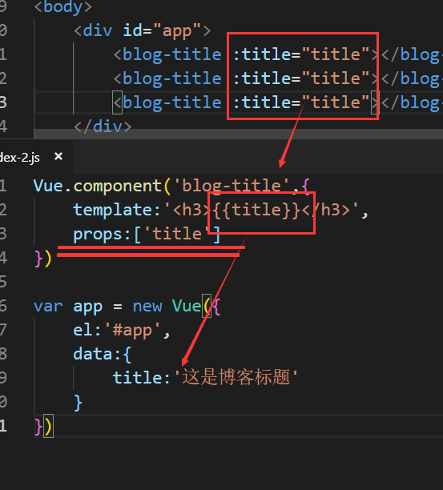

这样一来，我们也可以控制标题的修改了，总结一下吧

一个组件中如果想要引入变量，进行响应式修改，需要把这个变量加入props属性

然后在HTML里面应用这个组件的时候需要引入变量属性。

但是这上面只是一个基础，实际上肯定不是这样写，我们要批量生成HTML模型肯定要用v-for

然后我们需要涉及到一个初始化的属性，就是created


我们在created中定义了一个初始化的方法，指向了data里面的数据，便于更新内容进去

我要提一下:key，这是一种指向id绑定的方法，你可以理解为根据id排序的方法，这样就能按顺序打印

最终效果图如下


网页可不是只有标题，内容怎么办呢，也是通过templatete去生成


很简单，就在组件里面添加个content就可以了，props里面也加进去，HTML模板也加进去这个属性，就这样生成


这个就是组件初始化HTML模板的方法，通过created初始化

我们还需要了解到的一个重要属性是computed:计算属性，响应数据变动，优先采用

这个可以处理传递过来的值，进行渲染

只需要改这两个部分


这是一个怎么样的思路呢，首先我们在HTML中获取data里面content，交给组件处理渲染，然后组件启动了computed方法进一步渲染，最后完成了页面渲染

以上我们学习到了四个属性：

template：渲染HTML模板，里面插值等待传值

props：存储等待插值的变量的数组

computed：处理传递过来的插值函数

created：在Vue实例下定义，初始化传值

这四个属性便是组件一些关键的属性，所以回到开头，我们是否能理解了组件的作用是什么呢？组件为什么能够组成一个页面？

说到组件组成一个页面，我们就来尝试一下多个组件


#### 4.多个组件形成页面

我们已经创造好了一个组件，内涵小标题和小内容

所以我们可以定义两个组件，分别是首部和尾部


然后分别给这两个安排上文本内容和style绑定对象


然后在HTML模板中进行完善


查看运行结果


这就是多个组件组成一个页面内容的重要思想

其实我的代码是有问题的，不知道你们发现了，就是我忽视了created初始化的方法

这不利于后期的响应式修改，所以正确写法如下：


效果也很明显了，完美符合了响应式设计网页的概念


#### 5.脚手架Vue-cli

使用的工具叫做Vue Cli，是基于Vue.js进行快速开发的完整系统，提供：

- 通过@vue/cli搭建交互式的项目脚手架
- 通过@vue/cli + @vue/cli-service-global快速开始零配置原型开发
- 一个丰富的官方插件集合，集成了前端生态中最好的工具
- 一套完全图形化的创建和管理Vue.js项目的用户界面

这便是Vue Cli脚手架的作用，那么它运行的时候到底依赖什么呢

- 一个运行时@vue/cli-servece，该依赖
  - 可升级
  - 基于webpack构建，并带有合理的默认配置
  - 可以通过项目内的配置文件进行配置
  - 可以通过插件进行拓展

我们可以对脚手架做什么呢，类似于webpack一样，跑在本地服务器进行自定义修改，更加全面的插件支持

能够帮助我们设计出更好的Vue应用

所以安装这个，肯定是通过npm

输入npm install -g @vue/cli命令进行安装脚手架，是全局安装噢


这是一个极其漫长的安装过程，耐心等待吧！

然后脚手架安装好了之后，就安装一个Vue应用

输入个vue create vue-blog吧！然后选择默认的就可以了


这是脚手架Vue Cli正在创建一个Vue应用，安装好之后可以看到下面专业的


然后我们可以看说明md文件


这两个对我们来说是不是非常的熟悉？那我们就试验一下跑本地服务器

首先切换到vue-blog的工作目录，输入命令


没什么问题，最后看看启动方式


打开这个网页看看，里面有初始模板


这就是脚手架的作用，放置在本地服务器，开启Vue应用的编写~

这个该怎么学会使用呢，一切的关键在于src文件夹


前面的框是组件文件夹，里面的内容全是组件代码，一个组件单独成为一个vue文件

后面的App.vue才是我们要编写HTML模板+Vue.js的地方

那么问题就来了，这是可以做到HTML+VUE.JS两种内容共存？

所以还是一样的，还是令人熟悉的HTML+VUE.JS的编写方式，这个就交给了我们的App.Vue文件

首先我们讲一下组件vue文件，以下是组件原来的命名方式


现在到了工程文件，组件的创建方式就得改成如下


另外两个组件也是这种方式去创造


总结一下就是vue文件创建组件的时候，是使用template+script两个标签

然后script标签用export default命名代码，用name命名组件

最后就是主页面，与组件一样的是，也是以template+script的方式去创建主页面

但在template中，是等待被渲染的组件标签


script中是引入组件和初始化页面的方法


#### 6.自定义指令的方式

我们在上面接触了需多vue指令，什么v-for，v-if，v-model等等

现在该轮到我们自定义一个指令了

通过钩子函数的方式去自定义

Vue.directive('名字',{钩子函数})

我们现在就自定义简单的变色函数

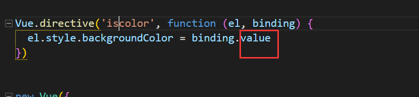

注意千万不要漏掉后面的value

使用的时候很简单，在前面加个v-就能变成指令了，这个函数放在main.js里面全局使用。


效果图也有了


## 六.Vue状态管理

#### 1.路由器的安装

Vue Router是Vue.js官方的路由管理器，它和Vue.js的核心深度集成，让构建单页面应用变得易如反掌

包含的功能如下：

- 嵌套的路由(视图)表
- 模块化的、基于组件的路由配置
- 路由参数、查询、通配符
- 基于Vue.js过渡系统的视图过滤效果
- 细粒度的导航控制
- 带有自动激活的CSS class链接
- HTML5历史模式或者hash模式，在IE9自动降级
- 自定义滚动条行为

说白了，路由器就是管理多个页面的存在，配置到每个页面的路径和名字。

那么如何安装路由器呢？

输入命令npm install vue-router

如果你想在一个vue应用中使用它，首先得输入vue add router这个命令


或者另外一个方式是加入这几个命令，必须明确地引用


当你完成第一条命令操作的时候，你会看到main.js文件的改变如下：


而且还会多出来一个文件夹，尤其是路由器js文件


这里面的代码示例就是最简单的Hello word

配置好路由器之后，我们就可以进行代码的修改了。

#### 2.路由器下的操作

我们在上面配置脚手架的时候，主要页面是APP.vue

但在经过安装路由器之后，项目的结构就会悄然发生改变

首先APP依旧是主页面，但只完成导航，多个页面都是交给views里面来完成的

我们来看看App.vue变成导航页后，究竟发挥了什么作用


所以我们设计页面都交给了views文件夹，可以存储多个页面

那么现在我们就开始设计Home.vue作为主页面

首先引入好我在前面设置的三个组件

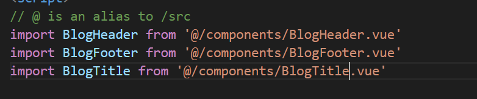

然后在上面的template代码中引入组件标签模板


然后在下面的export default中完善初始化页面的js代码，并引入三个组件

不要忘了，data在这儿是要改成钩子函数模式的，就是function(){return{}},

这个道理非常好理解，我们是设计多个页面了，所以data属性要封装到自己的页面data里面去


然后我们可以关心一下第二页，About.vue，随便修改一下验证效果


最后就可以在cli中输入npm run serve了


看到了吗，上面生成了一个导航链接，连接到views里面的多个html文件

首页自然就是


#### 3.多个页面设置

目前来说，肯定还是不够像个个人博客的，

我们必须要有一些文章填充在里面，所以要创造一个文章内容的组件


然后我们需要加入两个方法，一个是mounted，与created类似的初始化，这个方法是加载组件后发挥作用

然后就是methods，在里面加入获取文章id的函数方法，编写mounted要使用的函数


我们就简单定义一下函数，然后把我们的id配置参数弄上去


然后我们回到路由器router.js，设置每个博客的导航


然后首页上的博客需要设置链接，点击时跳转相应的id页面


这样一来，首页中的博客标题，便指向了对应的链接，进行访问

比如当我点击id为3的文章标题的时候，自动跳转到/blog-3这个博客链接，这就是router-link标签的作用

最后在首页设置如下：


最终的效果图也出来了


点击第二个链接的时候，跳转出：


一个个人博客网站雏形就这样诞生了！


## 七.Vue的UI设计库


#### 1.组件库

其实就在官方文档里面可以寻找到


进去之后就会看见这些玩意


这些都是不错的轮子，需要的话可以直接拿轮子。

#### 2.UI库

UI库需要从这儿来寻找


进去之后选择UI框架，也就是英文UI Frameworks


然后我们就可以看见大名鼎鼎的UI框架，就是element UI，饿了么前端框架

这是element UI的前端框架网址，https://element.eleme.cn/#/zh-CN

这是element UI框架的快速使用指南


然后就像当初学习Bootstrap4框架一样，拿现成的代码进行测试


值得一提的是，element ui框架的这个布局容器比较值得关注


#### 3.个人博客页面

既然讲到了要用element ui框架，那我们就用这个框架去美化这个页面吧！

根据官方文档的指引，输入npm install element-ui -S进行安装


重点来了，我该如何在我的vue应用中引入这个UI框架？


完善这个代码进去


然后我们就随便找个组件吧，比如按钮组件


将代码直接copy进去看看效果


最终效果：


OK，框架会用了，让我们开始优化页面吧！

主页面优化如下：


博客页面新增一个打分组件

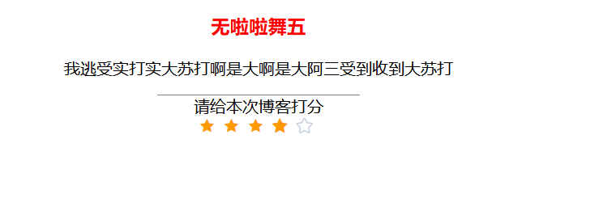

现在我的博客首页就是这个效果


## 八.mock数据接口使用


#### 1.简介

一句话概括mock数据的作用

mock.js，生成随机数据，拦截Ajax请求

http://mockjs.com/

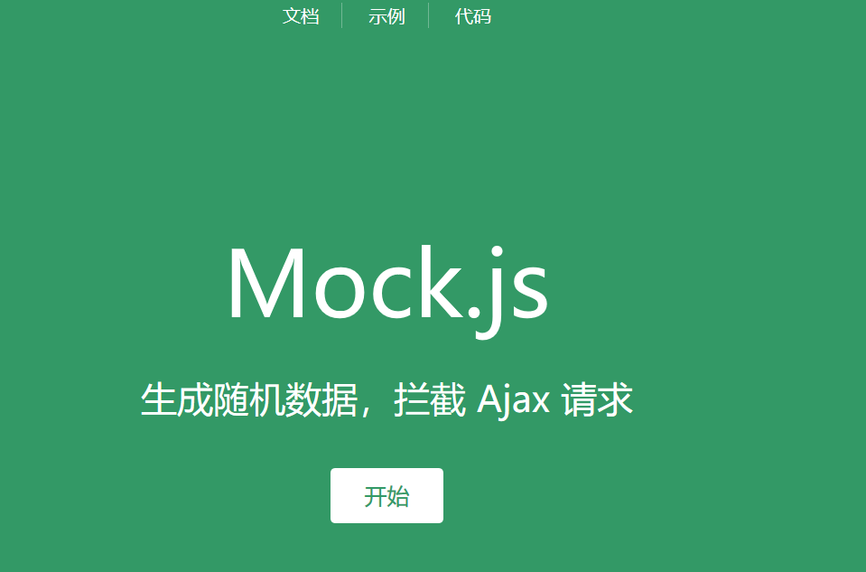


#### 2.示例

这就是一个数据接口，可以理解成模拟真实情况，进行数据交互练习

随便截图一张，应该就明白这个道理了吧？


或者生成一个假地址，也是绰绰有余


做个人博客的时候，是不是正愁怎么填一堆信息和一堆文字进去？

#### 3.安装

打开官网的文档，点击进去查如何安装


但是我们做一个应用，最好还是以开发者模式去安装


#### 4.使用

安装好了害怕不知道怎么用吗？

上面我们在webpack也是类似的安装命令，引入的时候是require

所以我们需要创建一个mock.js文件完成引用


然后我们就可以创造一堆假接口了，假文章，假作者，假标题等等


然后我们就把上面获取到的blogs封装成API，供前面的vue文件使用


我们还需要一个工具，用来获取请求，输入命令npm install axios vue-axios


好了之后我们在main.js里面完成引入

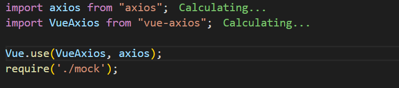

这样就能利用http请求访问API，抓取到数据了

既然这样，我们就要重构掉原来的代码，新增加一个函数用来获取到数据


然后把这个函数放入在初始化算了


但是这个过程却报错了，因为我们没有弄懂created的优先性

created方法的优先性肯定是最高的，所以下面的getPost()显示内容无法生效

所以需要修改如下：


取消mounted方法，把显示的步骤放入到这个函数来

搞定了这些博客链接，我们还需要安排一下首页的连接导航，把同样的数据也传到首页


最后的效果就很好看了


导航栏太丑了，我优化一下


