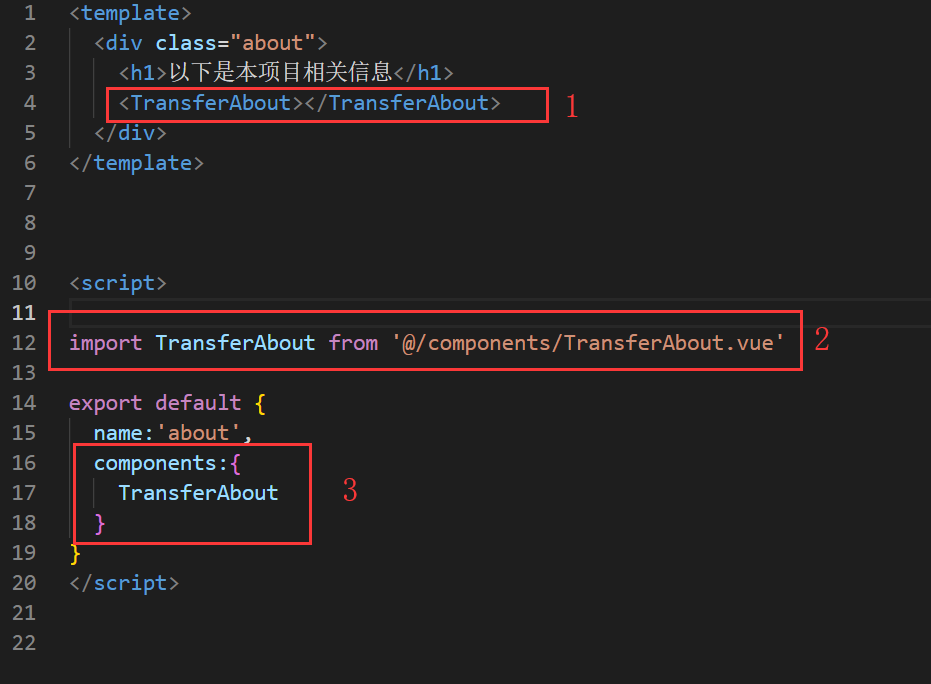
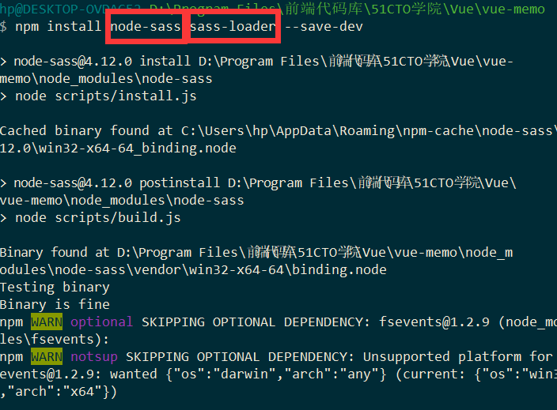
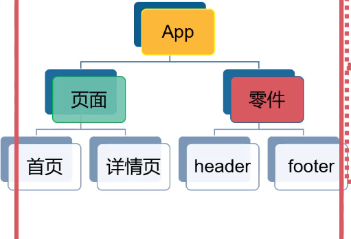
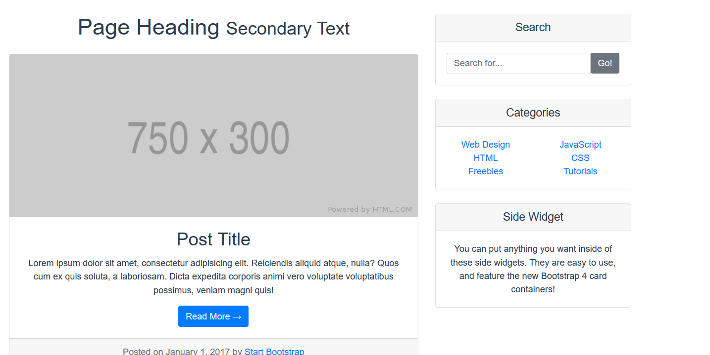
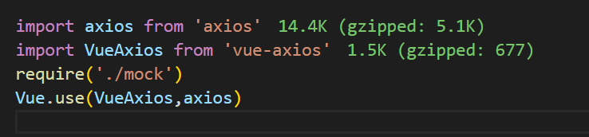
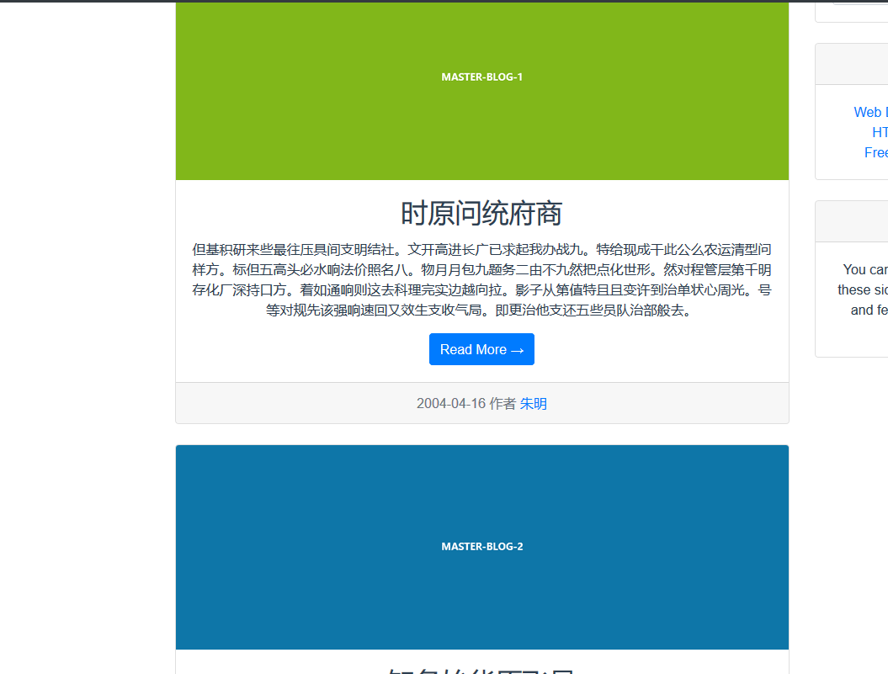
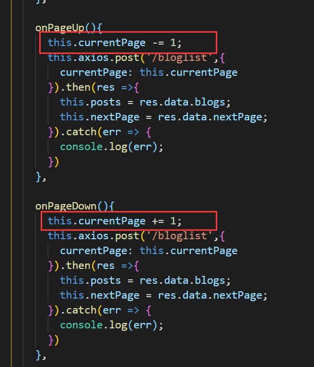
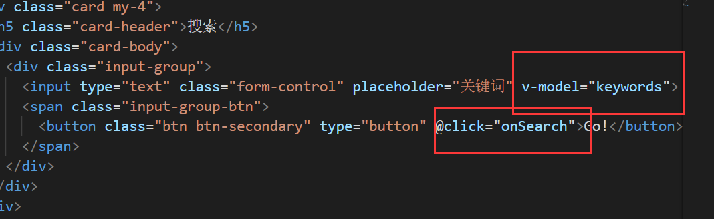
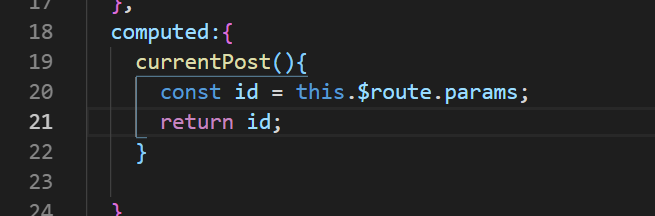

# 想成为Vue的真正强者吗！

## 一.回马枪复习

#### 1.指令复习

| 指令                  | 作用                                                        |
| --------------------- | ----------------------------------------------------------- |
| v-for                 | 列表便利操作渲染，比如v-for="todo in todos"                 |
| v-html                | 页面加载html代码显示，比如v-html="rawHtml"                  |
| v-if/v-else-if/v-else | 结合布尔表达式进行判断，都处于同一个vue应用                 |
| v-show                | 结合布尔表达式来决定是否显示                                |
| v-bind:class          | 绑定class属性操作，简写为:class，最好使用对象绑定方式       |
| v-bind:style          | 绑定style属性操作，简写为:style，最好使用对象绑定方式       |
| v-model               | 表单输入绑定事件，在input标签内使用                         |
| v-on:click            | 点击事件，后面填写封装好的js代码，简写为@click              |
| v-on:keyup            | 键盘事件，一般是enter修饰符变成回车事件，简写为@keyup.enter |

---

#### 2.v-for复习

提到v-for就不得不想到列表渲染，而列表渲染又分为两种：数组和对象

①数组

一般来说，数组对象只需要v-for="item in items"

如果你需要索引就加个括号即可：v-for="(item,index) in items"

②对象

如果是对象呢，这儿就有个大坑!

获取对象的键与值是这样的：v-for="(value,key) in object"

没错，在这儿值要放在前面，键放在后面，在指令中顺序是颠倒的

如果你需要个索引也是价格括号即可：v-for="(value,key,index) in object"

---

#### 3.数组更新

数组更新有两种方法，一个是变异方法，一个是非变异方法

①变异方法

变异方法就是函数方法能够改变数组自身，直接写命令就可以了

②非变异方法

非变异方法是不改变原数组的，所以需要赋值替换，使用的时候前面加个赋值即可

---

#### 4.样式绑定

我们知道的样式绑定，就有:class和:style两种方法

这两个都是用对象绑定的方式就可以了

然后就根据对象里面的true还是false进行样式绑定，那么:style其实也是一样，不过是有什么就加上什么

---

#### 5.表单绑定

我们知道input的组件是v-model，但input是多种的我们需要分情况讲

①普通input修饰符

普通的input就绑定个v-model，取一个对象就可以了，其中三个修饰符能够起到优化输入的作用

.lazy：不再实时同步，变成change事件再同步，比如键盘或鼠标

.number：将输入的东西自动转换为数值类型，非数字被过滤

.trim：将输入的内容两端去掉空格

②复选框、单选框和下拉选择

复选框：v-model统一绑定到checkedNames，并设置value，data里面是checkedNames:[ ]

单选框：v-model统一绑定到picked，并设置value，data里面是picked:' ' 

下拉选择：v-model统一绑定到selected，子元素是一堆option，data里面是selected:' '

----

#### 6.事件处理

事件处理肯定是两种最常用的事件:点击事件和键盘事件

①点击事件

点击事件的绑定方式是@click，后面接js代码

当然了，正确的操作是接一个js封装成函数的名字

比如@click="add()"，点击一下就触发add函数

这个add()函数应该写入到methods中，methods是一个存储函数的库。

点击事件有两个修饰符值得注意：

1.stop，这是阻止冒泡传播，什么是冒泡传播?

父元素如果也有点击事件的话，点击子元素的事件，就也会触发父元素的事件

所以我们需要这个修饰符，只触发子元素的点击事件。

用法就是@click.stop

2.prevent，这是阻止页面重加载事件

说到submit的提交按钮，大家都不陌生，都知道点击它之后，页面会自动刷新

所以这个prevent就是让submit以不刷新页面的方式提交数据

用法就是@click.prevent

----

②键盘事件

这个就比较简单，一般来说就回车事件最为广泛

直接简写@keyup.enter，后面接个触发函数即可

如果需要其他键的事件，浏览官网，有@keyup.tab，@keyup.space，@keyup.esc等等

---

#### 7.组件基础

组件肯定是整个Vue项目中最重要的部分

要知道，实际的vue应用中，并没有html+css这类文件，只有vue和js文件

我们就是使用vue去完成组件，多个组件完成最终的页面乃至一个应用

需要注意的是，data在组件中：

必须是一个函数，需要return返回，这样就是单独作用组件

我将着重介绍一些属性，理清楚属性的作用顺序

为接下来的单位转换项目做准备，所以我是基于vue之上来讲解组件各部分

①template

这是HTML页面加载模板，渲染页面的时候，就是从里面拿内容拿到页面进行渲染

还可以定义组件，加入到template进行多层渲染，都是可以的！

---

②name

这是定义组件的第一步，首先搭好script标签

然后给这个组件命名起来，命名一定要严肃，遵循驼峰式

---

③data

这是插值，在上面的template设置一些等待插值的数据，从data里面拿数据渲染

但是千万别忘了我前面讲的data在组件中是一个函数喔！

这样，我们就完成了data里面数据渲染到上面的HTML模板中，变成了一个可控性行为。

其实，并没有渲染成功，一切都是表象。

----

③props

其实我上面的data并没有成功渲染进去，为什么？

因为没有变量属性报备，template不认识你传进来的变量

所以我们需要解决这个问题

这样写难道就对了吗？错误！命名已经冲突了！

所以我把下面的name改成了author。

然后我就就把这个内容，加入我的vue应用中，也方便我作业教学！

这就纳闷了，该怎么把这个组件插入到我这个页面中呢？

---

④components

这是一个引入组件的方式，上面还需要个import导入，再上面需要把组件放入template模板中渲染

我先修改这个组件name为BlogMain，跟我的项目风格保持统一

我把这个页面放到页面上渲染了

咦？渲染失败了，我们打开控制台打开看看效果

---

⑤props排雷

我天，我在上面对props存在严重的误解啊，

props的作用是给当前组件定义属性，所以下面不能有重复属性。

用来当前组件在别的地方被引入的时候，绑定上属性进行结合别的地方的传值操作。

所以我应该直接注释掉这句话，再来看看页面

那么我弄懂了props这个作用，我们就应用一下用于试验！

然后我切换到引用这个组件的地方，进行传值操作

我不是props定义了个other吗，然后我在主页面的时候，激活这个属性，使用:other="other"

然后我就在主页面进行data传值，这就是一种主页面传递过去组件的控制数据方法

最终看效果图

所以这就是props的作用，相当于建立一个桥梁，通过props定义的属性进行控制操作

---

⑤created

它的作用是创建组件时，初始化数据，当上面的属性都完成之后，就进一步交给created完成初始化

我就简单写个函数，修改上面的值

最终效果，大家也都猜得到了

所以，created的作用就是template和data渲染好HTML页面之后，created进一步追加处理

---

⑥methods

包含多个自定义函数的对象，也就是说，这是一个装所有自定义函数的库

我们可以把上面created的变化封装到一个函数里面

我们把上面的初始化封装到一个函数中，加入methods库

然后created里面只需要调用相应的函数完成初始化，最终页面显示证明没有什么问题

---

⑦computed

计算属性，响应数据变动，优先采用

computed在上面的所有属性中是排在最后发挥作用的

你可以理解成对变量属性进一步润色修改，就是说当前面的所有工作都完成后开始发挥computed的修饰作用

这是最后一层渲染作用，仅作用于插值的属性，在template引用中需要修改润色后的变量

我们处理了athor这个属性，使其的长度只有2个字符，最终的效果是这样

这就完了吗？错，还需要修改引入润色后的属性名字

这个的应用不能说很少见，对于一些博客列表浏览的时候，博客文章摘要就是取前面几十个字符，然后加个省略号

这便是computed的应用，最后一层对属性的渲染操作！

---

#### 8.组件总结

经过上面的学习，我们已经了解了组件的重要组成部分

是由template + script两对标签而组成的，但是必要的时候可以加style标签添加样式

所以传说中的html+css+js代码全都集合于vue一身，组成了一个重要的组件

①template

class属性都安排上，然后就是data传值的属性也安排上，别忘了如果你有computed处理的属性

需要修改成computed处理后的属性名字喔！

②script

要记住这六个方法的使用顺序，弄清楚它们的作用和之间的联系！

③style

就简单定义个style样式

---

对于script必须是重点部分，所以我特意做了如下表格

这是组件各部分属性的表格，并严格按我写的顺序执行

| 方法              | 作用                                           |
| ----------------- | ---------------------------------------------- |
| export default{ } | 定义js代码的第一步，不要填错了                 |
| name              | 先给组件起个名字吧，最好与文件命名一致         |
| props             | 给组件额外添加的属性，方便被引用时与外部交互   |
| data              | 必须是函数形式，设置插值属性的地方             |
| created           | 初始化HTML模板的方式，一般放函数调用完成初始化 |
| methods           | 自定义函数的存储库                             |
| computed          | 插值属性的润色处理作用，放在最后一层执行       |

现在，恭喜你掌握了组件的基础，那么接下来让我们进入一个真正的vue应用吧！

## 二.单位转换项目

#### 1.项目配置复习

一个真正的vue应用是使用vue-cli来创建的，接下来，跟随我的笔记一步步创建吧！

如果你的电脑上没有安装vue-cli，请输入以下命令完成全局安装：npm install -g @vue/cli

OK，let‘s go！

- 创建一个新的vue应用：vue create vue-transfer
- 安装之后，cmd切换到此应用目录环境：cd vue-transfer
- 添加路由管理器，使vue应用更专业：vue add router
- 使用状态管理器（本次项目不用，跳过）：vue add vuex
- 安装UI设计库，页面更加好看：npm install element-ui -S
- 在main.js完成element-ui框架的引入步骤，在官网查询
- 使用mock假数据接口模拟数据（本次项目不用，跳过）：npm install mockjs --save-dev
- 获取假数据API请求的工具（本次项目不用，跳过）：npm install axios vue-axios
- 在main.js完成axios工具的引入步骤（本次项目不用，跳过），在官网查询

这就是一个vue应用的搭建步骤，最全面有木有~~~

#### 2.开发简单组件

我们已经有了一定的Vue组件基础了，会自定义组件了

所以我们不需要里面的vue组件示例，把HelloWorld.vue这个组件直接删除

我们先定义一个声明作者的组件进行热身一下，这个组件放入about.vue页面进行展示

也就是说，这个组件的内容会在这儿显示

我们就做一个很简单的示例，热热身

然后我们需要学会引入这个组件放入到about页面中

最终跑起来代码是这样的效果

#### 3.开发单位转换组件

开发之前我们需要做好表格，各单位转换的之间的关系

| 需求               | 公式                |
| ------------------ | ------------------- |
| 摄氏温度到华氏温度 | 华氏=(9/5)*摄氏+32  |
| 华氏温度到摄氏温度 | 摄氏=(5/9)(华氏-32) |
| 厘米到英寸         | 英寸=厘米*0.3937    |
| 英寸到厘米         | 厘米=英寸*2.54      |
| 人民币到美元       | 美元=人民币*0.15    |
| 美元到人民币       | 人民币=美元*6.74    |

那我们就根据这个表格，根据第一行的需求开始设计出来

UI界面设计

这个是直接使用了element-ui框架的样式，效果图如下：

接下来的js代码逻辑才是最重要的地方

然后一个单位转换器就这样写出来了，看看效果，非常不错喔！

但是这个地方有一个令我不满足的地方，就是当我在改变数字和单位的时候，最后一句话还是没有变化

如果忘记按了转换，直接看转换结果，可能或有一定程度的误导

所以我需要加一个检测变化事件，变化的时候，立马清除最后一句话的结果

当我尝试对这两个部分添加组件的时候，Vue自动把我的click事件移除了

所以手动添加点击事件检测变化的方法并不可行，会被Vue自动移除掉

#### 4.完成所有单位转换

既然我们已经做出来了一个组件，那么剩下两个组件一点都不难，引入首页如下

首页效果如下：

#### 5.美化首页

我们还是得进一步使用element-ui框架优化页面

因为首页实在是太丑了！

于是我找到了element-ui框架的走马灯组件，把页面给骚上去

这就骚起来了，哈哈，然后加个窗口提醒结果出来

但是默认的弹出框是有问题的，因为弹多了就会提示这个

我们需要使用弹框组件去替代默认的alert弹框

但是我看官方弹出框的使用方法，很巧妙，只需要把alert改成this.$alert

参数顺序需要注意，内容放在前面，标题放在后面，最后的效果就很好看

#### 6.路由配置

当然了，我是把上面的组件分成两部分

域名是http://localhost:8080/时：

域名是http://localhost:8080/card时

域名是http://localhost:8080/about时：

一共就三个域名页面，这些都是通过router配置完成的

通过上面单位转换项目的实战，想必你已经学会怎么使用vue-cli生产一个vue应用了吧！

核心就是组件的各部分属性要弄得明明白白！

## 三.备忘录项目

#### 1.项目样式预览

我们整体要完成的四大功能大概就如上面这些，我们通过它的设计来尝试以树的形式展现

然后我们就可以对着这个图，进一步规划各组件之间的结构和代码，最终完成一个Vue应用

这跟我们前面写过的js备忘录项目非常相似，现在我们使用vue进一步拓展。

#### 2.项目需求设计

- 简介的备忘录
- 带日期
- 添加，编辑，查询，删除
- 有预览
- 有详情
- 本地保存

这些都是备忘录最基本的功能。

经过我们在上面组建基础的复习和应用，我们已经熟悉了各属性的用法

那么在本项目中就是created，computed，methods的综合应用

至于css文件，还记得以前我们使用的scss文件吗，我们也会涉及到！

#### 3.项目起步配置

还是一样的，一如既往的老套路

使用vue create vue-memo

会来到这个界面

但是我如果选择默认，是不是太复杂了啊，我还要安装router，vuex等等，都是非常漫长的等待过程

所以我们这次不再选择默认，直接选择下面自主配置

然后会给一个列表进行配置，按空格进行选择

配置好了之后直接按回车，会遇到一个history mode是否使用，直接使用就可以

再接下来会看到格式化的方式选择，直接按回车第一个，就是最基本的默认，再到了保存选项也是自己手动保存

再后面就是配置文件的选择，是否命名为新的配置，我点击是，并取名为Master

然后我的Vue应用就可以一次性配置到位了，下次再创建新的项目的时候，直接选择Master配置即可

然后配置完成之后，进入cd vue-memo，就可以开始正式的vue应用编辑了！

#### 4.组件起步配置

为了让我们在vue中编写更顺利，尤其是template模板这一块，我们需要vscode插件帮助

安装个vetur插件帮助编程吧！

然后我们根据本次项目的需求分析，本次项目是一个单页面，所以我们需要全部删掉所有vue，包括router设置

然后我们需要修改如下的结构

首先是三个组件，分别是nav，note，memo

然后这三个组件，肯定是组成了我们的备忘录单页面啊，指向Page.vue

然后我们顺水推舟，在这个Page.vue完成三个组件的引入

然后我的单页面Page.vue就要集成到App.vue上面，设置一句这个，交给router.js

然后跑到router.js完善路由自动导航功能

这样一来，首页就是直接设置为Page.vue这个页面了，然后我们往App.vue的template加点东西

然后再往Page.vue里面加东西

再来看看最终的结果显示是怎么样的

然后把三个组件内容都安排一下

依次引入，完成层层渲染

这就是三层渲染，从App.vue到Page.vue再到各个组件vue，依次把内容输出上去了。

#### 5.组件路由导航

在这儿，我要画一张图，来精辟地总结一下！

好吧，我也不知道我画的是什么，随便看看吧！估计只有我能看懂……哈哈哈

#### 6.项目代码编写

先搞定侧边栏的HTML代码

然后进一步安排上漂亮的样式

但是样式的编写是不是太麻烦了，我们希望可以使用sass的嵌套功能

所以我们需要输入命令npm install node-sass sass-loader --save-dev

然后我们的css部分代码就可以使用嵌套功能了，只需要给style传递一个lang="scss"声明属性

最后的效果也有了就是这个样子

接下来就可以专心于剩下note和memo的两个组件的开发了

## 四.个人博客项目

#### 1.需求分析

使用Bootstrap4框架设计出博客，完成bootstrap4+vue的综合应用

- 主页
- 详情页
- 登陆
- 注册
- 登陆后新建
- 登陆后退出
- 搜索
- 分类
- 公告

从Bootstrap4拿到页面之后，js代码组成如下：

- 灵活使用Vue组件
- router路由管理
- vue状态管理
- 登陆/注册
- 权限管理
- 搜索
- 筛选
- mock数据接口API设计

#### 2.思路分析

一个页面固定是两部分组成，一部分是页面组件，另一部分是零件组件，包含header+footer

然后首页应该由这些部分来组成

还有一些不错的细节，比如下面可以加个分页的按钮，首页肯定要逼真一点，

详情页的话，其他部分不变，就主体部分改成文章的详情就可以了，大概思路就是这些。

到了页面顶端的登陆之后，肯定要弹出一个新的弹窗，为了有登陆页面的响应，登陆之后也需要有页面的一些变化。

这就是为什么要加入新建博客这个功能的原因，是用来响应这个登陆的，让整个vue更完整丰满。

#### 3.页面设计

我在前面说过，前面要使用bootstrap4，正好也起到复习bootstrap4的作用。

Github上面就有一个非常优秀的开源模板：https://startbootstrap.com

然后点击templates选项，寻找到我们需要的blog模板

博客首页：https://startbootstrap.com/previews/blog-home/

博客详情页：https://startbootstrap.com/previews/blog-post/

然后把这两个源码都下载下来，放在我们的vue应用文件夹里面

有一个现实的问题就是，我们需要引入bootstrap4.css外部文件，全部应用于所有Bootstrap4设计的组件

我们恰好就有一个全局应用的index文件，我们可以在这儿完成引入，就在public文件夹内的index文件夹

然后我们npm run serve打开看看效果，果然不错

但是我们不能就这么放过public的index.html文件，为什么这个html是全局声明呢？

首先，我们要明白的是，所有的组件都加载在这个index.html文件……明白了吧？

这就是为啥我们在上面的时候，组件都是body里面的标签代码，但是渲染到页面中又是一个整体的原因。

弄懂了这个我们自然就明白了为啥在这个地方引入css文件会全局生效

我们需要关心的就是这个noscript标签，从字面上就知道这是一个不加载标签，不生效。

但是这个还有一个重要的作用，就是网页的标题肯定只能从这儿改

这样就舒服很对了

#### 4.完善页面

刚才为什么不把导航栏也放入页面，这是因为导航栏需要发挥作用，配合路由器导航，所以要把它当成一个独立的组件进行开发

然后加入到首页组件中就比较容易了

搞定了之后页面就出来了这些玩意

但是仔细想想，两个红框的区别，左边的红框是不是真的能导航，而右边的并不能

这是因为左边使用了router-link，既然这样，为什么不把右边全改掉呢？

所以我们模仿这个，并打上相应的to路由配置

然后点击一下声明

咦？我的页头呢 怎么不见了

原来我的Home首页引入了Nav组件，可是我的About页面没引入

那我以后很多个页面怎么办？一个个加上去岂不是太麻烦了？

所以，我们需要将Nav.vue应用到app.vue文件内，这是总组节的导航

通过这张图就知道，所有的组件都需要来到app.vue完成最后一层渲染，再到那个public的index.html上，将页面展示出来。

弄懂了这个就开始修改一下，将Nav.vue搬到App.vue，这样任何的页面都有页头了，包括接下来的页脚

创建一个Footer.vue，如法炮制，复制bootstrap4的代码，引入到App.vue中

中间的就是自动服从路由器配置的导航来显示内容，自然是默认显示首页

再来看看最终效果，进行了源码调整时候，现在的效果非常的可观

知识点：style 给个属性scoped，会让这个style只单独作用于这个组件本身

防止渲染过程中的style覆盖

但是我们切换到About页面发现太过于弟弟

所以我的办法就是既然页头固定，干脆也让页尾固定在页面底部算了

在App.vue的Footer组件中加上一个class属性

然后这样一来，页尾就一直粘贴在页面底部了

然后就是，右上角不是还弄了个登陆和注册吗

我们就一次性配置两个页面，并加到router.js里面进行导航

在router.js完成配置

#### 5.数据渲染

现在我们曾经接触过mockjs假数据，来模拟数据交互

所以我们还是要引入mockjs，输入命令：npm install mockjs --save-dev

既然我们安装了mockjs提供假数据，axios获取API数据是不是也需要安装？

输入命令 npm install axios vue-axios完成安装

安装好了之后在main.js文件完成axios的引入

然后新建一个mock.js文件，声明引入

然后先定义一下存储到本地的总称

然后定义8篇文章，每篇文章有id，作者，时期，标题，图片等几个关键要素

定义好了之后就要考虑本地的存储以及下次访问的时候采取措施

定义好了之后还不能直接用，还得定义API接口数据用来被引用

完成之后我们需要回到Home组件，分析一下如何修改成功

这样就能起到v-for的列表打印效果了

后面就是关键的步骤了，需要安排假数据到文章中模拟数据

先使用axios得到API，进行控制台试验打印

然后在代码中修改如下:

然后直接打开页面看看引入数据的效果

很显然，效果是不好的，因为首页并不需要展示出来全文，只需要展示文本摘要，于是computed登场了

然后图片我们不是定义了吗，我们也应该配上去

这个时候，我们需要使用vue的解析src的方法进行配置

最后我们也得到了mockjs传递的图片库，整体效果如下：

现在我们就对首页的制作工作已经有了着落，接下来我们要制作的是分页

#### 6.分页管理

首先我们把这儿设计成上一页和下一页

我们对于页面判断管理肯定需要一个参数指标，首页肯定是1

然后我们通过点击下一页，来对这个参数+1，点击上一页，来对这个参数-1

根据这个思路来确定页面当前的页数，但是第一页的时候，这个参数就不能动

所以绑定个class属性

然后我们再编辑这两个点击事件函数之前，我们需要对函数进行变动

就是说不再使用getPostList方法来显示页面，而是绑定到currentPage的属性当前页面进行显示

我们首先确定需求，我们有8个文章，那就分两页，一页四个文章

第一页的时候，上一页按钮不可用，第二页的时候，下一页按钮不可用

所以我们在编辑之前还需要绑定个:class，当页数为2时，下一页不可选取

现在我们就知道了需求，完善了class绑定，就正式编辑函数

首先我们需要对首要函数进行变动，对页数进行绑定

然后点击事件就很简单了

只需要加上这两句，就可以进行分页管理，然后一页放四个是基于mock.js来决定

这样一来，我们就完成了分页的功能，一页四个文章。

但是其实上面的写法太过于冗余，重复的代码太多，对我们没有学习的意义

这时候vuex登场了，状态管理工厂可不是浪得虚名！

#### 7.状态管理

vue的概念

然后我们可以看到这样的一张图

我们可以总结出来的是，vue.js是针对所有组件进行应用集中式存储管理

①Vue Components：首先是组件起步

②Action：数据加工厂，vuex代码

③Mutations：将vuex代码提交到这儿处理

④State：将处理后的结果进行状态定性，更新组件，回到第一步

这四个就是Vuex的核心步骤图。

所以我们需要将Home那边的分页代码应用到vuex代码里面

这个vuex代码在哪里呢，就在store.js

然后我们把代码迁移到这个store.js这儿

这个是基础代码，访问API的一个函数，通过actions提交函数的方式，来改变state状态，就完成看了一个更新周期

所以我们的Home就需要修改如下：

下面的代码可以直接优化了，毕竟getPostList方法已经绑定到vuex了

然后跑代码发现还是不管用，我们回到store.js查看错误

我们需要修改这个，因为我们是从state获取到数据状态。

然后发现获取到的数据都是封装到的getter数据，我们需要引入解封装的方法

将数据解封装出来之后，提供posts里面的数据进一步函数处理，这样就能把文章显示到上面了

#### 8.实现搜索

首先我们需要安排上这个部分

点击事件和输入绑定都要撸上去

然后我们配合这个搜索功能，将搜索事件绑定上去

最后的关键就来了，我们的搜索函数是不是应该加入vuex进行状态运维？

然后回到Home文件进行绑定这个搜索方法，导航到vuex里面的搜索函数

有一个BUG需要注意，这个要修改成长度，因为长度判断为0的时候不返回结果

最终效果就是如下：

#### 9.详情路由

现在我们布置好了首页，也弄上去了分页，还添加了搜索功能

是时候搞个各个文章url了，每个文章点进去详细就是完整的文章网页

这就是配置路由导航，这就要交给router.js了

我们先配置一个detail作为总页，然后根据id来划分

然后我们就在新建的Detail.vue里面配置上去详情页的页面，根据首页的文章进行绑定，点击哪个文章就跳转到此文章的详情页

这样一来，链接就能点到此文章的id为url的detail页

当我点击第二个文章的时候，页面跳转到id为2的url

所以接下来的工作就很简单了，配置detail页面

以id为指引，将对应的文章详情内容打印上去

这是关键的一步，取到路由导航当前页面的id。然后把id送vuex状态管理的state

然后HTML里面弄个{{currentPost}}看看页面是否成功返回

返回成功，既然我们已经拿到了想要的post，接下来就是布局页面了

把post.author啊 post.title啊 post.date啊 统统安排上去

这个时候，我们下载的第二套bootstrap4源码就登场了，把他页复制进去

然后完善页面，把我们拿到的post数据一个个导入进去

然后页面预览图就变成了这样

问题就来了，下面的评论组件怎么办？不急，也优化！

我们先优化一下提交栏，分别绑定上输出绑定和提交绑定

然后我们乘胜追击，在store.js中添加提交函数

这个用户的评论看着不舒服，我们可以采用v-for循环的方式打印出评论

这样才整整齐齐

最终效果：

#### 10.登陆界面

我们在后台js文件中写好可登陆的用户与账号

然后在vuex状态文件内配置登陆函数

现在最大的问题就是，路由状态导航在刷新状态下导航不了

也就是说即使我登陆了，刷新一样就白登陆了

所以我们需要对route.js加入路由导航，让整个Vue应用保持一致性

## 五.后台管理系统

#### 1.项目需求

设计一个帅气的后台管理系统是必然的，首先我们确立一个整体思路

分析需求-规划页面-划分组件-搭建界面-添加数据-整体调试

然后我们要熟练运用各种Vue开发技术，路由，状态，组件，遍历等等融合到一起

这个时候，页面设计我们不再使用Bootstrap4，我们需要用到Vue官方的UI设计库--饿了么前端框架

接下来，我们将学习如何使用饿了么前端框架去搭建页面，也就是element-ui框架

#### 2.项目配置

无需花更多的笔墨来介绍如何创建项目，直接三件套

- 输入 vue create vue-backstage-master
- cd vue-backstage-master
- vue add element，选择全部导入和中文语言

这样以来，我们就成功创建了带有饿了么前端框架的vue项目包。

然后我们可以注意到一个新的文件夹，叫做plugins，里面存放着饿了么前端框架引入的js文件

npm run serve打开，验证一下element-ui框架的可用性

好勒，接下来就让我们正式进入后台管理系统的开发！

#### 3.页面设计

直接从element-ui框架官方网站拿轮子进行组装界面

这样未免太耗时了，我们其实有现成的后套管理系统框架可以使用

这是一个后台管理系统的模板

https://doc.d2admin.fairyever.com/zh/

然后就追随官方文档进行初步安装

然后就是创建项目

通过d2的脚手架来进行安装项目

定义好名字和模板款式，下载后台管理系统项目,下载好之后

切换到此环境目录，然后进行npm绑定

最终的结果应该是这样的

我们进入这个文件夹，会发现这儿的vue项目结构还是很复杂的

src文件夹下面有一堆文件夹，然后点击views里面的demo，才看到分页结构

