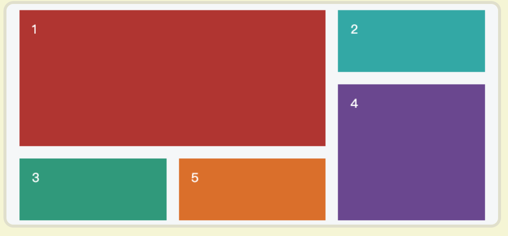
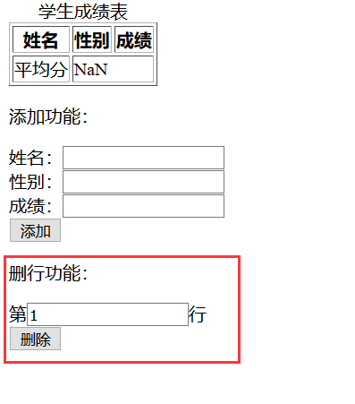

#### 诗人最好的坟墓，

#### 是他词语的天空。

#### 玫瑰的语言是它的芬芳。


#### 你不会成为油灯，

#### 除非你把夜晚扛在肩上。

---

我现在已经停止往下学习，走向了回首掏的复习道路，将这段时间以来所学习到的前端知识进行反复消化。

一来是停止我的996学习状态，给自己大脑放个假，好让我准备五一假期的放松事宜。

二来是防止出现学了就忘的这种情况，自己能够长期记住才是最好的学习方式。

---

## 一.巩固HTML5知识


#### 1.布局篇

header+nav+aside+section+footer

这五个以开头区域+导航区域+侧边区域+主体区域+尾部区域的组合的文档元素

已经成为了当今前端标签布局的主流，这也正是HTML5的规范。

当然了，也可以是适当穿插一些div


#### 2.表单篇

form+input+button三剑客，打下了表单的天下

示例：


这是最简单的表单组成，效果图如下：


label+input将文字和输入栏紧密联系起来

这是新型输入栏编写方式，推荐大家都统一采用这种方法:


#### 3.链接篇

做一个网页永远都逃不过链接的设计，以下是我整理的几个重要连接。

超链接：a元素，万能公式，可以在里面嵌套图片，做成图片超链接。

图片：img元素，显示图片最好的元素。

视频：audio元素，显示视频的元素，配上属性controls，让视频播放有可控性。

音频：video元素，嵌入音频的元素。

CSS样式表：link+href的方式完成引入CSS外部样式表，熟悉的不能再熟悉了。

JS文件：script+src的方式完成引入JS文件进行网页控制，也是老熟人了。


#### 4.块级元素

块级元素，英文使用方式是display: block;

最传统的块级元素非div元素莫属。

白话解释块级元素的作用：**其后的内容会被挤到下一行来展现，自动换行**
```
<h1>、<p>、<ul>、<table>、<div>这些都是块级元素
```


当然了，我们必须密切关注一种块级元素，就是内联-块级元素：

英文使用方式是：display: inline-block;

这是什么呢？我们知道块级元素放在一起，都是竖直展示的，我将来个例子展示:


现在我将这四个div的display改成inline-block，会发生什么效果？


通过这个示例，你应该弄明白了块级元素与内敛-块级元素的呈现效果，我就不再多言。


#### 5.内联元素

内联元素，英文使用方式是display: inline；

可以改变块级元素成一个不换行的元素。

最传统的内联元素非<span>元素莫属，还有<a>、<em>、<strong>、、<span>等，都是不会换行的。


白话解释内联元素的作用：**其后的内容会在同一行显示，不会导致文本换行**

一个例子，帮助你快速理解块级元素与内联元素：

```
<span><span>当当当<p>我是巴拉拉小魔仙</p>变变变！</span></span>
```

最后效果：


这个例子充分地告诉我们，这行的输出结果是三行，且第一行的span紧紧跟随着上面的div

得出两个恐怖的结论：

**块级元素的文本内容独占一个块级空间，上下都换行**

**内联元素不进行任何换行，依附在前面元素的内容之后，后面元素也不会被换行**


#### 6.列表篇

在HTML5中，有两种列表，一个是说明列表，一个便是专业列表。

先来讲诉一下说明列表，这个只需要适当了解：

dl: 术语列表框架

dt: 编写列表名

dd: 术语解释，配合dt使用


来看看效果：


总结下来可得：dl创造说明列表的框架，dt作为子标题，dd为说明文本。

至于专业列表就要花点笔墨好好讲了

①ul+li创造无序列表


效果如下:


---

②ol+li创造有序列表


效果如下：


---

③ul和ol配合li使用创嵌套列表


效果如下：


#### 7.表格篇

表格经典组成是：table+tr(th)+td

table元素创造一个表格框架

tr元素创造一行单元格，th元素能够让单元格变成表头

td给每个单元格赋值


你需要知道的是th元素，修改tr成td，能够把单元格改成表头，颜色也会加粗变化


最终效果图：


表格有个重要的知识点，是单元格合并

row：行

col：列

rowspan：属性规定单元格可横跨的行数

colspan：属性规定单元格可横跨的列数

一定要理解这四个单词的意思，结合起来背


#### 8.框框篇

选择框有两种，一个是复选框，一个是单选框，这两者我们都要掌握

选择框当然还是使用form+label+input实现的

①复选框，type=checkbox


---

②单选框，type=radio


我们在设置一道单选题的时候，需要把所有选项统一到同一个题目里，使用的属性正是name


## 二.巩固CSS3知识


#### 1.应用方式

CSS有三种应用方式：

①外部样式表：<link rel="stylesheet" href="style.css">

一种最为广泛的引用样式表方式，就是把CSS样式表放在外部文件，用link来引用


---

②内部样式表：CSS放置在上面的成对<style>标签内

把样式设计放到代码上方的head标签内

因为浏览器是从上到下加载的，所以会先加载样式再显示结构


---

③内联样式：仅影响一个元素的CSS声明，标签内的属性style

注意，内联样式的等级是最高的，覆盖掉其余样式表


#### 2.盒模型

核心布局就是使用盒子模型

把网页想象成多个模块，每个模块都是一个盒子

盒子 = box ，边框 = border，内边距 = padding，外边距 = margin


**但是一个盒子的组成是由box+border+padding组成的，margin只能改变盒子的位置。**


但是我们需要注意的是，这个盒子的真实高度到底是多少？

我在下面定义一个盒子，布置一道题目


根据上面的图，你能知道这个盒子的真实高度是多少呢？真实宽度是多少呢？

答案将在下面的内外边距小节中公布。


#### 3.选择器

选择器，我认为，是不能花太多笔墨去描述的，否则就会头昏，因为在实际应用中，选择器是非常简单的

但是中国人的特点就是，喜欢把简单的东西给复杂化，所以浏览相关文档就觉得云里雾里。

这儿只需要看一张图就好了


你只需要记住我标出来的几个红色区域，如果你能理解了，完全没任何问题

也不需要任何顾虑，继续往下学习吧！


#### 4.边框

我讲述边框的时候，也不能太复杂，否则你们就没有耐心看，自然学不到什么东西

我连图都懒得放了，就两句话暴力总结，管你们看不看得懂

**使用公式：border: 1px solid red;**

**公式分析：边框设置：(边框宽度)1px (边框样式)实线 （边框颜色)红色**

即使是没学过前端的小白，学边框你看这两句就够了，国内文档净整一些复杂的语言描述。


在这儿，我有一个很有意义的小实战项目：

首先我们需要了解到一个小知识，input表单是自带border属性的


这个输入栏，就是一个默认的border，但是我们QQ登陆不是这个样式


QQ登陆界面只有下边框样式，这个表单样式到底是怎么弄出来的？

这时候我们就需要对input的默认border进行动刀子：


直接暴力清除边框，然后只设置下边框样式：


效果图直接出来了：


通过我这顿对border的暴力教学，我敢吹牛你绝对学会了。

然后你可以通过这个网站进行设计更加美丽的边框。

https://html-css-js.com/css/generator/border-outline/


#### 5.内外边距

外边距margin还好，大家都知道margin是用来改变盒子的位置的

但是根据我在几个前端群的潜伏，感觉很多小白对内边距padding的理解不够透彻

我这次就结合一波谷歌的F12调试工具讲解


内边距：padding

外边距：margin

根据传值的个数而设置的顺序有所不同：

两个值：上下，左右

三个值：上，左右，下

**四个值：上、右、下、左**

---

①使用谷歌浏览器理解什么是外边距


---

②使用谷歌去理解什么是内边距

注意，内边距是针对到哪儿的距离？请看图思考


但是我们发现一个奇妙的现象，就是我们div的盒子不是100px*100px;吗，为什么这个图好像变得更高了

其实呀，我们的div一直都没变……一直处于中间呢！


这说明了什么。是不是清除了你对内边距padding的误区？

一直改变的是border的线框盒子，我们定义内边距的距离的时候，是可以影响到border线框的布局的。

**当内边距为0的时候，div盒子大小就等于border线框盒子的大小**

**当内边距不为0的时候，线框border的宽高必然增大，将div盒子包裹在里面**

当然，不能考虑进去线框本身的粗度。

再回来说说，我在上面布置了一道计算盒子高度宽度题


现在的你，应该能独挡一面了，我就直接上答案了

真实宽度：1px + 10px + 200px + 10px + 1px

真实高度：1px + 10px + 50px + 10px + 1px

#### 6.position定位

position定位，也不能讲的太复杂，否则小白就没耐心看

实际上就是relative和absolute两个知识点

我也不会拆开来讲，因为这两者一直都是成对出现的


relative的变化是针对于原来的位置进行变动，这就叫基于文档流的相对定位

position的变化是针对于网页来进行变动，这叫脱离文档流的绝对定位


看不懂这两句话不碍事，下面我将讲一波**子绝父相**

子绝父相是什么意思呢？父元素采用相对定位，子元素采用绝对定位

有人就会问了，子元素采用绝对定位?那岂不是乱套了？

注意！！！请注意我说的**父元素与子元素**

有没有想过：

子元素的绝对定位是不是只能在父元素的空间里面来绝对定位？

父元素的相对定位是响应于网页的布局?

这就是子绝父相的由来。


看看这个淘宝，把网页大盒子设想为父盒子，我标出来的区域是子盒子

那么这些就是子绝父相，子盒子采用在父盒子里面的绝对定位，完成了网页的布局。

---

首先我们就用代码来好好理解一下，为了更好的理解

我已经将margin，padding全部变为0：


现在，不设置任何的位置参数，来看看现在的情况是怎么样的


这是一个纯粹的初始位置，在设置外边距为0的情况下。

现在，我们需要对子元素的绝对定位进行验证了


我就设置了个相对左边移动50px，相对顶部移动50px，最终发生了什么


这样一来，我是不是通俗清晰地解释了子绝父相的作用？

通过我这个例子的解释，你应该能弄懂了怎么使用position定位了，子绝父相正是position的核心。


#### 7.float布局

对于float布局，我真的没有讲述的天分，也不敢打脸充胖子对其侃侃而谈

因为我确实也很少去用它

http://www.w3school.com.cn/css/css_positioning_floating.asp

https://www.runoob.com/css/css-float.html

不过我最起码得出一个结论

就是你如果要对一个div应用float，这个div是不能有其他布局属性的，比如position等等

也就是说，在一个大div中，里面的小div要使用float，最好没有其他布局属性。

float: left; 自动靠最左

float: right; 自动靠最右

float: none; 清除浮动


#### 8.flex布局

前端中最重要的页面布局之一，在本次笔记中，我将采取三种形式进行复习flex布局

**文档 + 游戏 + 实战**

---

①文档部分

http://www.ruanyifeng.com/blog/2015/07/flex-grammar.html

布局的传统解决方案，基于盒状模型，依赖 display`属性 +position属性 + float属性。

它对于那些特殊布局非常不方便，比如，垂直居中就不容易实现

容器应用的方法：


记住，我曾经在前面说过，应用float布局最好不要并存其他的布局，flex布局也是一样的

flex布局一旦应用成功，子元素的属性统统失效：子元素的`float`、`clear`和`vertical-align`属性将失效。

来看看flex布局的图片详解


通过这个图，我得出两个恐怖的结论：

**容器存在两根轴，水平主轴(main axis)和垂直交叉轴(cross axis)**

**容器里面是多个项目盒子，叫做flex item，项目盒子的宽度为main size，高度为cross size**


说完这个，我们就要重点讨论容器本身很重要的六个属性


不过我们这儿只挑几个重要的来讨论

**第一重要的是：flex-direction**，决定项目的排列方向


至于reverse，加上去就是倒序排列，很好理解

**第二重要的就是flex-wrap**，会把项目排在一条线，但是如果容器水平排不下，会换行


我们只需要了解这个warp属性值


**至于剩下的justify-content和align-items**，了解一下就好

它们分别对应着项目在主轴和交叉轴的排列方式

一般来说，我们会设置justify-content: space-around,因为这是最好看的水平排列方式


align-items的一种属性我们就要额外注意了

align-items: baseline;


这无疑是最好的一种水平排列方式，左导航栏的时候，简直不要太方便，文本自动对齐


好了，讲完容器的属性设置方法之后，接下来来讲讲容器内的各项目属性设置方法

说实话，我比较喜欢从简，所以我在这儿只讲一句属性：


什么意思呢，各个项目里面都只设置一句flex: 1;就完事了。

这代表这些项目在容器内所分配到的空间大小是一样的。

如果你希望某个项目大一些，那就flex: 2;，flex: 3;这样就把这个项目空间搞大了


在这儿，我对flex的讲解就结束了。

---

②游戏部分

https://flexboxfroggy.com/#zh-cn

justify-content的属性概览：


align-items的属性概览：


我们时刻需要注意的是，我们上面所学习到的知识

是基于项目横向排列的时候。

如果项目是纵向排列的时候呢？

注意当flex以列为方向时，`justify-content`控制纵向对齐，`align-items`控制横向对齐。


flex-wrap属性：


flex-flow属性：


当当当，已经全部通关

但是我想说，最后一关是真的难啊！


---

③实战部分

简单的体育页面


这便是最基本的简单布局。

最后的效果图也出来了，实际上写的也非常快


#### 9.grid布局

前端新兴起的页面布局之一，在本次笔记中，我将采取三种形式进行复习grid布局

**文档 + 游戏 + 实战**

---

①文档部分

http://www.ruanyifeng.com/blog/2019/03/grid-layout-tutorial.html

网格布局（Grid）是最强大的 CSS 布局方案。

最起码是与flex布局能够抗衡的水平。

感受一下grid能做到的布局，就知道它为什么这么强大了



Flex 布局是轴线布局，只能指定"项目"针对轴线的位置，可以看作是**一维布局**。

Grid 布局则是将容器划分成"行"和"列"，产生单元格，然后指定"项目所在"的单元格，可以看作是**二维布局**。Grid 布局远比 Flex 布局强大。

学习grid布局现需要了解一下概念:


容器里面的水平区域称为"行"（row），垂直区域称为"列"（column）

这是grid布局重要的组成部分：


我往下看了下文档，发现讲的很复杂，但是本次笔记的原则是简单粗暴易懂，所以我就大大简化笔记

只做两部分的笔记。

①容器的操作

我们需要知道怎么定义一个grid网格

首先第一句就是display: grid;是肯定的，然后就是定义上面的行和列

`grid-template-columns`：属性定义每一列的列宽

`grid-template-rows`：属性定义每一行的行高。

我们先来看看一个简单粗暴的例子，一下子就明白了


当然了，这样定义未免太不专业，如果一个网格布局每个项目使用百分比，会不会更严谨些？


我写了个例子，应该好理解吧?

但是如果我想划分更多的行和列，上面的写法无疑是不适合的，那样代码太长了

所以需要用到repeat()函数


现在我们知道了网格怎么定义之外，我们还需要掌握一个重要的布局方法：

`grid-row-gap`属性设置行与行的间隔（行间距），`grid-column-gap`属性设置列与列的间隔（列间距）

具体看图就知道了


至于剩下的justify-content，align-content，这种排列布局的方式就不多讲了

直接进入下面里面项目的操作。


②项目的操作

这儿只需要讲两个属性，如同flex布局的时候我只讲flex:1;一样

`grid-column`：`grid-column-start`和`grid-column-end`的合并简写形式，

`grid-row`：`grid-row-start`属性和`grid-row-end`的合并简写形式。


这是什么意思呢？就说第一行的grid-column: 1/3吧

其实就是项目`item-1`占据的区域是第一列 + 第二列。


其实对于grid布局，对子项目无脑grid-column + grid-row布置位置就行了。

无非就是把这个子项目放在这个grid的这个地方，那个子项目放在grid的这个地方。

---

②游戏部分

https://cssgridgarden.com/#zh-cn

没通关完，告辞

---

③实战部分

QQ登陆界面


首先使用标注工具标出来这个盒子的宽高

最后定义个10x10网格,方便我们精准投放子项目的位置


然后先搞定主体功能：


这么一分析，就是先搞定上面的背景色，然后再搞定这个圆框头像


那么我们先搞定左上角的QQ图标


看了这个布置位置，是不是很简单了？

通过我讲诉的案例，希望你对grid有个快速粗暴的理解。


我的源码也非常的干净，最后效果图如下:

 


#### 10.过渡动画

我觉得吧！这块的知识好像没有深入的重要性，反正我直到现在全忘光了

PS：前端大佬勿喷

我就放一些网站，毕竟这玩意，造轮子还不如拿轮子，专心攻克前端方向的当我没说

3D盒子设计：https://html-css-js.com/css/generator/transform/

hover动画设计：https://ianlunn.github.io/Hover/

animate动画设计：https://daneden.github.io/animate.css/，需要添加一句属性启动播放。

更多设计请认准主站：https://html-css-js.com/


## 三.巩固JavaScript知识

#### 1.先来一波HTML5的复习

---

第一题：


解答如下：


---

第二题：


解答如下：


---

第三题：


解答如下：


---

第四题：


解答如下：


#### 2.再来一波CSS3的复习

第一题：


解答如下：


---

第二题：


解答如下：


---

第三题：


解答如下：


---

第四题：


解答如下：


#### 3.进入javascript的DOM复习

先放复习的文档连接：https://wangdoc.com/javascript/dom


这五个便是我们学习的重点，先复习一波Document节点吧

---

①Document节点

只要浏览器开始载入 HTML 文档，该对象就存在了，可以直接使用。


| 代码           | 作用 |
| -------------- | ---- |
|  ||
| document.images | 返回文档所有的img标签代码 |
| document.URL | 返回浏览器的url地址 |
| document.title | 返回当前文档的标题 |
| ------ | ------ |
| document.getElementsByTagName() | 返回所有搜索到的符合标签名代码数组 |
| document.getElementsByClassName() | 返回所有搜索到的符合class属性的代码数组 |
| document.getElemenetsByName() | 返回所有搜索到的符合name属性的代码数组 |
| document.getElementById() | 返回搜索到的符合id属性的代码 |
| document.querySelector() | 返回符合搜索条件的第一句代码 |
| document.querySelectorAll() | 返回符合搜索条件的代码数组 |
| ------ | ------ |
| document.createElement() | 这个方法用来创造个元素节点(一对标签) |
| document.createTextNode() | 这个方法用来创造个文本节点(一段话) |
| document.createAttribute() | 这个方法用来创造个属性名(配合value赋值) |

---

②Node接口

Node接口由DOM中的所有节点类型实现，换句话说

Node接口专门用来做节点的工作

在下面，我将使用abc变量，当作一个节点操作对象


| 代码               | 作用                                                   |
| ------------------ | ------------------------------------------------------ |
| abc.nodeName       | 返回此操作对象的标签名字，以全大写的形式               |
| abc.nodeValue      | 返回此操作对象的value值                                |
| abc.textContent    | 返回此操作对象的文本值                                 |
| abc.nextSibling    | 返回此操作对象的下一个同级节点                         |
| abc.previousSibing | 返回此操作对象的上一个同级节点                         |
| abc.parentNode     | 返回此操作对象的父节点，最高可以是整个文档节点         |
| abc.childNodes     | 返回此操作对象的所有子节点，数组形式                   |
| ------             | ------                                                 |
| abc.appendChild()  | 把这个操作对象当作父节点，往里面插入子节点             |
| abc.removeChild()  | 删掉这个操作对象的子节点，跟parentNode配合能够删掉自己 |
| abc.replaceChild() | 替换这个操作对象的子节点，跟parentNode配合能够替换自己 |

---

③Element节点

上面的Node接口是做节点的工作的

那么这个Element节点便是做元素的工作的

在下面，我将使用aaa变量，当作一个元素操作对象

| 代码                         | 作用                                               |
| ---------------------------- | -------------------------------------------------- |
| aaa.id                       | 返回这个操作对象的id值                             |
| aaa.tagName                  | 返回这个操作对象的标签名，全大写                   |
| aaa.className                | 返回这个操作对象的class值                          |
| aaa.classList                | 返回这个操作对象的所有class值，数组形式            |
| aaa.attributes               | 返回这个操作对象的所有属性值，数组形式             |
| aaa.innerHTML                | 返回这个操作对象的所有子节点代码，字符串形式       |
| aaa.outerHTML                | 返回这个操作对象的本身所有的代码，字符串形式       |
| aaa.style                    | 返回这个操作对象的style属性，在后面被用来做css修改 |
| ------                       | ------                                             |
| aaa.matches()                | 判断此对象是否有这个属性，返回布尔值               |
| aaa.querySelector()          | 元素支持寻找内部元素的功能                         |
| aaa.getElementsByClassName() | 元素支持寻找内部符合class属性的元素，数组形式      |
| aaa.getElementsByTagName()   | y元素支持寻找内部符合标签名的元素，数组形式        |

---

④attribute属性

我们上面可以操作了那么多对象，其实属性也是可以操作的

在下面，将使用bbb变量作为元素操作对象


| 代码                  | 作用                                               |
| --------------------- | -------------------------------------------------- |
| bbb.attributes        | 返回这个操作对象的所有属性，数组形式，支持索引访问 |
| ------                | ------                                             |
| bbb.getAttribute()    | 返回此操作对象指定属性的值                         |
| bbb.setAttribute()    | 给这个操作对象添加或更新一对属性值                 |
| bbb.hasAttribute()    | 判断是否有这个属性，返回布尔值                     |
| bbb.removeAttribute() | 删除掉这个属性                                     |

----

⑤css属性

终于到了操作CSS样式的环节，这个可是我们的常客

我们在上面学习了属性的操作方法，里面就可以完成改变样式。setAttribute()

setAttribute('style','color:red;font-size:30px;')

那么接下来我们要使用的操作对象是元素的style

var ccc = 元素.style

可以直接ccc.fontSize = "50px";改变字体的大小

知道了这些，我们来看看CSSStyleDeclaration接口,我们需要关注一个方法

如何添加新的CSS属性？ccc.setProperty()

例子：ccc.setProperty('text-decoration','underline');可以完成下划线样式的添加。


#### 4.复习一波javascript运行机制

我将用短短几句话粗暴复习

**javascript引擎的运行机制是单线程**

**事件循环池(执行栈+任务队列)**

运行的流程：

同步任务放在主线程上执行，形成一个执行栈，表示正在做的事情。

然后这时候用户启动了操作，放入异步任务，只要有了结果，就立马放入任务队列等待排队。

一旦执行栈的任务执行完毕，系统读取任务队列，放入执行栈来执行，执行完了再去读取任务队列。

这就是一个循环的过程，像不像排队机制，本质上其实还是单线程，

只不过异步的操作结果放在了任务队列，排队等待进入执行栈。

致命总结：


---

#### 5.挑战一波DOM操作练习题

OK，let’s go！

第一题：


解答如下：


总结一下小BUG，就是script不能放在上面，因为代码是从上往下加载的，放在上面是抓不到body元素的

还有就是我以为innerHTML是函数……耽误我不少时间。

---

第二题：


解答如下：


---

第三题：


解答如下：


---

第四题：


解答如下：


---

第五题：


解答如下:


不要着急，这些只是简单的DOM操作练习题，下面还有更猛的DOM操作练习题

#### 6.挑战一波事件操作练习题

第一题：


解答如下:


---

第二题：


解答如下：


---

第三题：


解答如下：


---

第四题：


解答如下：


看到我这个笔记的，请给出最好的优化方案，我感觉我这个还不是最优解。

---

第五题：


解答如下：

页面出来的时候，输入栏的是黑色的字

当我点击输入栏的时候，文字消失

不输入东西，点击别处，出来黑色的字

输入东西又删除的时候，点击别处，出来了蓝色的字

---

#### 7.冲击DOM高级操作练习题

第一题：


解答如下：


----

第二题：


解答如下：


这是一道非常有意思的强化js基础题目，非常推荐大家自己亲自动手敲一敲代码，实现这个功能

---

第三题：


这个就很简单了，写个删除tr的函数即可

解答如下：


这一行，是非常关键的，不让删除表头和平均分这一栏，最后就会这样删不动



---

第四题：


这题目不用说了，太简单了有木有

解答如下：


还是一样噢，一定要锁定表头和平均分这两行。

---

第五题：


看来这个的难点就是如何制造个变色开关

解答如下：


----

第六题：


这个我就在上面实现了个差不多的，我就懒得设计那么花里胡哨了

解答如下：


---

#### 8.复习String对象与Array对象

①String对象


| 函数          | 作用                                                         |
| ------------- | ------------------------------------------------------------ |
| concat()      | 用于连接两个字符串，返回一个新字符串，不改变原字符串。       |
| slice()       | 用于从原字符串取出子字符串并返回，不改变原字符串。           |
| indexOf()     | 用于确定一个字符串在另一个字符串中第一次出现的位置，从开头匹配。 |
| lastIndexOf() | 用于确定一个字符串在另一个字符串中第一次出现的位置，从结尾匹配。 |
| trim()        | 用于去除字符串两端的空格，返回一个新字符串，不改变原字符串。 |
| toLowerCase() | 用于把字符串全转为小写，返回新的字符串                       |
| toUpperCase() | 用于把字符串全转为大写，返回新的字符串                       |
| split()       | 按照给定规则分割字符串，返回一个由分割出来的子字符串组成的数组 |
| startsWith()  | 判断字符串开头符不符合参数，返回布尔值；结尾是endsWith()     |
| repeat()      | 返回一个新字符串，表示将原字符串重复n次                      |
| match()       | 返回找到的第一个对象，数组形式                               |
| search()      | 返回找到对象的索引值，找不到就返回-1                         |
| replace()     | 用于替换匹配的子字符串，一般情况下只替换第一个匹配           |

---

②Array对象


| 函数      | 作用                                                  |
| --------- | ----------------------------------------------------- |
| concat()  | 连接多个数组                                          |
| join()    | 将数组元素以指定的规则连接起来成一个字符串            |
| pop()     | 删除并返回数组的最后一个元素，能改变原数组            |
| shift()   | 删除并返回数组的第一个元素，能改变原数组，与pop是一对 |
| push()    | 给数组添加元素，方法和数组名[索引]  = 元素一样        |
| reverse() | 颠倒数组中元素的顺序，能改变原数组                    |
| unshift() | 在数组头部插入一个元素，与shift()作用相反             |
| splice()  | 插入、删除或替换数组的元素，需要刻意理解              |

---

#### 9.String与Array练习题走一波

第一题：


解答如下：


---

第二题：


解答如下：


我感觉我这个方法超极笨，有没有一步到位的方法，请评论给我

---

第三题：


解答如下:


----

第四题：


解答如下：


---

第五题：


解答如下：


第六题:


解答如下:


---

第七题：


解答如下：


这个题目比较绕算法，得慢慢突破理解。

---

#### 10.函数与对象的终极决战

对象的复习网址

https://wangdoc.com/javascript/types/object.html

对象（object）是 JavaScript 语言的核心概念，也是最重要的数据类型。

什么是对象？简单说，对象就是一组“键值对”（key-value）的集合，是一种无序的复合数据集合。


有Python基础的可以理解成字典的k-v结构，以键:值的形式去存储

在JavaScript中有个很鲜明的特点，实际上所有键的形式都是字符串

但是却允许你直接写非字符串类型的玩意，因为javascript编译对象会自动转化


但是这些都是符合变量命名规范，才能直接转换

如果是不符合命名规范的话，还是需要添加上引号，像这样


还可以命名两个对象，如果指向同一个，改动就会一样


对象的属性比较好理解，一般来说，直接进行赋值就可以改变或创建

这是对已有的属性读取操作


至于创造新的属性就简单了


我在这儿说一下第二种方法，一般肯定是要第一种，第二种方法是特殊情况才使用

当什么情况会需要考虑到使用[ ]去创建呢?

就是特殊属性键名的时候，比如first-name、123ab等等

这些就只能通过[ ] 去创建，不然会报错


这样就创建失败了，所以需要用 [ ] 来


函数的学习也很简单

1.声明与调用

①定义一般函数


一定要记住，如果你想采用引入拼接字符串的功能，请勿忘记这是ES6的功能，采用反引号！

根据上面可得，我们总结出来一般函数的定义方式：


②定义匿名函数

所谓匿名，就是没有函数名字


就是()()这样的结构，一次性调用，这是给某些只运行一次的函数功能准备的，如果要使用，应该是这样


就是这样，免去了定义函数的麻烦，给一次性的功能提供了个很好的存放空间。

③函数赋值到变量

这个定义方法我们已经是非常熟悉的了，也是现在所最为广泛的定义函数方法


这个肯定秒懂啊，就是给函数起个名字，存储到一个全局变量去任意调用，使用var声明：


这样就完成了两次调用。

④函数赋值给对象

这是一个比较少见的复制方法，用来处理对象本身


首先我们需要定义一个对象出来


通过这个方法，我们可以对对象进行二次处理，输出全大写的结果

当然，也可以自己修改一下


⑤函数作为参数

这个就不好理解了，我会使用到map方法，来对函数进行处理

相当于map()原生函数里面套一个自定义函数的方法：


map方法就是对数组的所有元素进行遍历函数化处理，就是说将一个个元素放到函数去运行。

同样，我们在上面就接触到，函数能赋予变量，我们就把结果传到了newList变量，得到了一个新的数组结果。

不过，既然讲到了map()，就怎么能少得了reduce()方法？完成多个数组进行累加得到最后一个结果


就是将所有数组的元素，一个个累加起来处理，这便是reduce的作用，从最初的多处理到最后的一。


⑥函数作为返回值

有过编程基础的都知道，这个是常规的操作，一个函数处理完后return到下一个函数继续处理

所以这个不难理解


我定义了两个函数，第一个函数进行打印信息，然后返回到下一个函数进行求面积。

最后我调用第一个函数，将结果送到控制台去打印。

这个不难理解吧！！！


2.各种参数

①默认参数与形式参数


要知道，默认参数就是在函数定义中已经赋值好的变量名

这样在调用函数的时候，可以不赋值进去默认参数。

非默认参数就等于形式参数。

注意:默认参数必须放到最后，形式必须放在默认参数的前面，这是考虑到函数调用参数的顺序。

如果我直接调用函数呢？


输出就会报错，但是默认参数依旧显示，这说明形式参数必须传值进去。

怎么样解决这个现象呢？那就是都设置成默认参数


这样一来，就能正常显示了，修改参数更方便


但是，赋值参数的顺序可千万不能搞错。

②剩余参数

但是有时候，我们无法设置那么多形式参数或默认参数，如果参数过多，应该怎么办呢？

我们先来看看下面的形式：


arguments自动接收参数，建立起索引，从0开始存储到Iterator对象，是一个不错的方法。

但是如果想从根源上解决无穷个参数怎么办？

那就是all登场了：


看到了吗？这就是无限参数的设置，给函数传递一个...all参数即可。

既然我们看到了all参数是个列表，不如我们趁热打铁，一口气设计出一个简单的算法题

就是无论多少个参数传递进去，计算它们的总和？


这个简单的算法题，不难吧？

3.属性方法

当然了，函数是可以再次赋值的：


但是呢，再怎么赋值，原生对象是不会变的，用name查看原生函数 叫什么名字：


当然，还有显示函数内容长什么样子的方法：使用toString方法：


这个方法可以看到函数内容是什么。

当然，还有统计函数里面有多少个参数的方法：


但是我们发现learnJS函数是0参数，这说明什么，默认参数不统计进去

所以函数的这个length方法只能统计有多少个形式参数。


