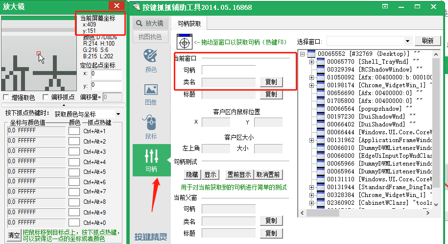

# 微信自动选择群组发送程序
## 基本介绍
	本程序用于将微信群组自动发送。可将文本内容发送至指定编号的微信群。同时支持将表格文件转换为dataframe格式后转换为图片发送。由于微信PC端隐藏了各个控件的句柄和ID，所以微信自动化向来较为棘手。本程序通过虚拟键盘和虚拟鼠标的操作，一定程度上解决了微信群消息自动化发送问题。同时，通过界面恢复设置，大大地提高了虚拟鼠标、虚拟键盘运行的稳定性。一方面只需要微信为登录已开启状态，无需其余任何设置，程序就可以正常运行。另一方面也保证了在意外事件发生后能够恢复正常。故本程序是在控件操作程序缺位的现状下，一个较好的替代品。
## 运行准备
### 1 - 环境配置
#### Python版本

python3.6，如何版本隔离自查Anaconda3是什么

#### 第三方库

```python
# 请直接使用以下命令安装第三方库
pip install pywin32 pypiwin32 pandas pillow dataframe_image redis excel2img openpyxl
```

### 2 - Tools
#### 按键精灵
利用按键精灵14，可以抓取窗口句柄、窗口类名。同时可以找到鼠标所标识位置对应的屏幕坐标。

双击打开qm2014chs.exe安装包，安装之后进入主界面，点击这个


然后我们就可以利用框起来的两个地方，确认坐标和句柄类名



## 实现逻辑与思路
### 1 - 自动发送
	主要利用虚拟键盘和虚拟鼠标的控制来进行自动化操作，主要有以下操作：
	利用微信的窗口类名和窗口名找到其句柄。
	利用句柄打开微信窗口并最大化，利用虚拟鼠标操作点击选中初始群组。
	点击发送消息按钮进入聊天界面后，按‘contrl’+‘v’进行粘贴。
	然后根据接受群组列表，再次点击通讯里列表，通过计算间隔位置点击到第二个群，如此反复操作
### 2 - 表格转图片发送
	利用dataframe_image库的export函数可直接转换，但有行数限制，为至多100行，故此方法保留
	还可以利用excel2img模块，没有数据量限制，直接生图，这是项目里目前用的方法，需要安装Excel
	再将保存好的图片转换成byte形式后，再以DIB格式存入剪切板。
	接下来就可以定位群组并发送。

## 程序运行
### 1 - 程序文件
##### constant_data.py
常量数据存放文件

##### constant_keyboard.py

键盘映射码数据存放文件

##### main.py
程序主要函数文件，微信群组定位程序
##### public_methods.py
公共方法存放文件

##### redis_methods.py

redis函数方法存放文件

### 2 -注意事项

在新的设备上首次运行时，需要根据实际情况更改代码：

	找到constant_data.py文件，按要求一一校对数据
其他注意事项

	1.群组代码仅支持正整数编号 
	2.谷歌浏览器需要安装并设置为默认浏览器，tools安装包有
	3.对于部分库如pyautogui。如果需要同时使用，会改变程序对于屏幕位置的判断，则需要对实际情况下的坐标进行更新。
	4.若将time.sleep(t)中的时间参数t调的过小，可能会出现系统来不及反应的情况。
	5.在程序运行期间，对键盘、鼠标的操作或其他突发事件很有可能会干扰程序的焦点，导致错误的输入/点击。
	6.根据第5点，最稳妥的方法就是放在一台无人干扰的虚拟机上运行

