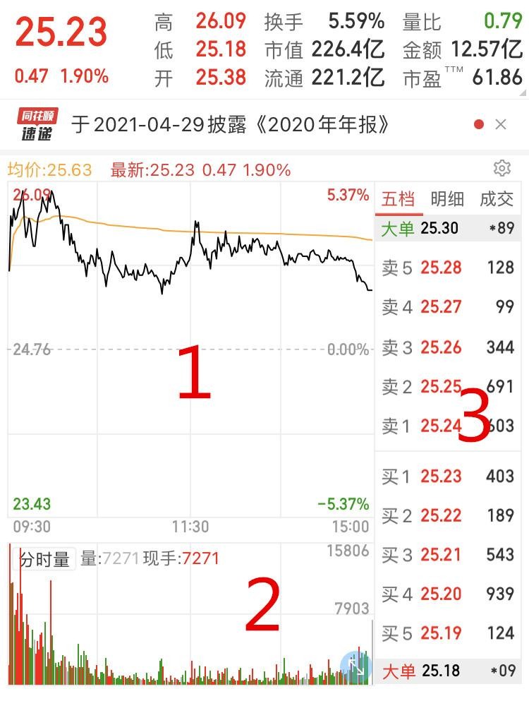

## 一.股票入门篇

#### 什么是A股，B股，H股

- A股：注册地大陆境内，泸深交易所，人民币买卖
- B股：注册地大陆境内，泸深交易所，美港币交易
- H股：注册地大陆境内，香港交易所，港币交易

#### 什么是一级市场、二级市场

- 一级市场：投资者与上市公司发生交易的地方，投资者需申购新股
- 二级市场：投资者与投资者发生交易的地方，也叫流通市场，投资者对着手机买卖的地方

#### 什么是股票指数

- 包含上证指数、深证成指、创业板指等等
- 指数是由证券交易所或金融服务机构编制的，表明股市行情变动的一种供参考的数字
- 上证指数就是所有在上海交易所上市的公司会全部纳入指数计算，股票价格加权平均后的点位

#### 认识炒股软件界面



第一个窗口的黑色走线是股价实时变化的趋势，而一条黄线是当天股价的平均走势。

第二个窗口写着分时量，分时量就是以一分钟为单位记录一刻的成交量，每刻的买卖情况会以柱状图记录下来。

第三个窗口则是比较关键的报单窗口。如果是报价买入，系统会将出价高的报单排在前面；如果是报价卖出，系统则把出价低的报单排在前面。

#### 股市的竞价时间

- 9：15 - 9：25，集合竞价，前5分钟买卖申报随时撤单，后五分钟只能申报不能撤单
- 9：30 - 14：57，连续竞价
- 14：57 - 15：00，集合竞价，只能申报不能撤单

#### 集合竞价和连续竞价是什么

- 集合竞价

```
时间是9：15 - 9：25 和 14：57 - 15：00
目的是确定出当天的开盘价
系统会将所有的买卖申报进行集中撮合，推演出能实现最大交易量的价格
```

- 连续竞价

```
时间是9：30 - 11：30 和 13：00 - 14：57
以报单窗口来看，买则价高排前，卖则价低排前，金额一样时间优先
```

#### 股价成交的规则

- 核心要素：主动性报单
- 如果卖方先挂出9.9元，我再以10元的价格主动性买单，最终价格会以卖方的9.9元成交，买家少花一笔钱。
- 如果买方先挂出10元，我再以9.9元的价格主动性卖单，最终价格会以买方的10元成交，卖家多赚一笔钱。

#### 何为涨停和跌停
