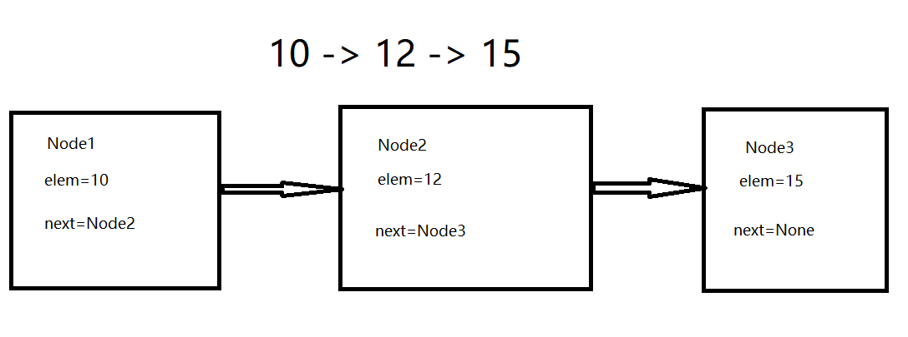

### *你不会数据结构与算法，何谈做真正的程序员？*

&nbsp;

本篇文章旨在数据结构的快速入门，需要你拥有一定的数据结构基础。

例如，你最起码应该知道什么是大O表示法，知道数组与链表的区别等等。

&nbsp;

Author： Masterpaopao

本博客Github地址：https://github.com/Masterpaopao/Master-Blog

参考文献：已将HTML文件包放入python目录。

转载请注明原Github出处，谢谢

* [一\.算法引入](#%E4%B8%80%E7%AE%97%E6%B3%95%E5%BC%95%E5%85%A5)
    * [1\.学习用处](#1%E5%AD%A6%E4%B9%A0%E7%94%A8%E5%A4%84)
    * [2\.例题尝试](#2%E4%BE%8B%E9%A2%98%E5%B0%9D%E8%AF%95)
    * [3\.内置性能分析](#3%E5%86%85%E7%BD%AE%E6%80%A7%E8%83%BD%E5%88%86%E6%9E%90)
* [二\.顺序表](#%E4%BA%8C%E9%A1%BA%E5%BA%8F%E8%A1%A8)
    * [1\.基本概念](#1%E5%9F%BA%E6%9C%AC%E6%A6%82%E5%BF%B5)
    * [2\.深入理解](#2%E6%B7%B1%E5%85%A5%E7%90%86%E8%A7%A3)
    * [3\.剖析List](#3%E5%89%96%E6%9E%90list)
* [三\.链表](#%E4%B8%89%E9%93%BE%E8%A1%A8)
    * [1\.基本介绍](#1%E5%9F%BA%E6%9C%AC%E4%BB%8B%E7%BB%8D)
    * [2\.实现结点](#2%E5%AE%9E%E7%8E%B0%E7%BB%93%E7%82%B9)
    * [3\.实现单链表](#3%E5%AE%9E%E7%8E%B0%E5%8D%95%E9%93%BE%E8%A1%A8)
      * [1）is\_empty()](#1is_empty)
      * [2）length()](#2length)
      * [3）travel()](#3travel)
      * [4）append()](#4append)
      * [5）add()](#5add)
      * [6）insert()](#6insert)
      * [7）search()](#7search)
      * [8）remove()](#8remove)
      * [9）单链表总结](#9%E5%8D%95%E9%93%BE%E8%A1%A8%E6%80%BB%E7%BB%93)
      * [10）单链表代码](#10%E5%8D%95%E9%93%BE%E8%A1%A8%E4%BB%A3%E7%A0%81)
    * [4\.实现循环单链表](#4%E5%AE%9E%E7%8E%B0%E5%BE%AA%E7%8E%AF%E5%8D%95%E9%93%BE%E8%A1%A8)
    * [5\.实现双向链表](#5%E5%AE%9E%E7%8E%B0%E5%8F%8C%E5%90%91%E9%93%BE%E8%A1%A8)
* [四\.栈与队列](#%E5%9B%9B%E6%A0%88%E4%B8%8E%E9%98%9F%E5%88%97)
    * [1\.快速了解](#1%E5%BF%AB%E9%80%9F%E4%BA%86%E8%A7%A3)
    * [2\.实现栈](#2%E5%AE%9E%E7%8E%B0%E6%A0%88)
    * [3\.实现单向队列](#3%E5%AE%9E%E7%8E%B0%E5%8D%95%E5%90%91%E9%98%9F%E5%88%97)
    * [4\.实现双端队列](#4%E5%AE%9E%E7%8E%B0%E5%8F%8C%E7%AB%AF%E9%98%9F%E5%88%97)
* [五\.排序算法](#%E4%BA%94%E6%8E%92%E5%BA%8F%E7%AE%97%E6%B3%95)
* [六\.树](#%E5%85%AD%E6%A0%91)

## 一.算法引入

#### 1.学习用处

数据结构就是一些有关系的数据的集合，有顺序表，链表，栈，队列，树，图等等。

使我们写出来的程序更加高效，以及解决一些很复杂的业务问题。

&nbsp;

#### 2.例题尝试

如果a+b+c=1000，且a²+b²=c²。a，b，c为自然数，求出所有可能值的组合？

第一种方法就是枚举法，暴力取a，b，c的每一个值，使用三层循环+if判断。

这个方法我就不多说了，所需要的时间非常长，属于O(n³)时间复杂度，这个绝对不是最好的方法。

第二种方法，就是当你取出a和b的时候，是不是c就已经确定了？c = 1000-a-b

这样的方法，肯定大幅度加快速度，大概会耗费3秒，时间复杂度为O(n²)，但是这个方法还是不满意。

&nbsp;

当我们取出a的时候，b的范围是不是只有1000-a，然后再取出b，这个时候就只有c = 1000 -a -b了。

然后我们去掉if的判断a+b+c == 1000的条件，这个时候程序已经优化到了0.8秒。


这个就是最好情况的O(n²)的所需要时间。

&nbsp;

但是衡量一段代码是否看，绝对不是只看时间而判断，比如A算法在数据量小的时候优于B算法，A算法在数据量大的时候又远远不如B算法。

所以我们判断一段代码的算法是否好不好，应该观察趋势，也就是大O表示法。

&nbsp;

#### 3.内置性能分析

Python中封装好的数据结构有字典和列表等，在我们学习之前，我们需要掌握一个技术，用来得出代码的运行时间，以便我们可以观察分析代码的性能。

&nbsp;

1）timeit模块

可以用来测试一小段Python代码的执行速度。

最简洁的用法就是开头一句`%%timeit`


它会自动进行测试10000次，然后求出每一次循环的所使用时间总和的平均数。

最后就给出了一个浮动的时间参考，代表运行的参考时间。

正式的用法的话，就要使用timeit模块的Timer功能，这个Timer的用法是：

`from timeit import Timer`

`t = Timer('函数调用名','引用地址')`

`t.timeit(number=1000)`

这两句代码其实也不难理解，第一个是求出函数运行的时间，第二个是转换为秒单位：


Timer测试速度的方法同样也是测试1000次，这两种方法都可以。

我推荐使用Timer的方法，因为这样做你可以同时测试几个函数的运行时间，进行对比。

&nbsp;

2）list内置操作的时间复杂度

我是默认你拥有良好的list基础的，所以我在这儿列出一个表格，对于你今后该怎么正确编写代码有很大的指导帮助，一定要选择最优解的那个方法。

| 列表内置操作   | 时间复杂度（大O表示法） |
| -------------- | ----------------------- |
| index[i]       | O(1)                    |
| append()       | O(1)                    |
| pop()          | O(1)                    |
| pop(i)         | O(n)                    |
| insert(i,item) | O(n)                    |
| del            | O(n)                    |
| contains(i)    | O(n)                    |
| reverse        | O(n)                    |
| sort           | O(nlogn)                |

你们注意到最后一项了吗，Python里面的排序sort方法，时间复杂度就是O(nlogn)！

学过数据结构的应该知道，快速排序的时间复杂度也是O(nlogn)，说明sort方法是封装好的快速排序。

&nbsp;

3）dict内置操作的时间复杂度

| 字典内置操作 | 时间复杂度（大O表示法） |
| ------------ | ----------------------- |
| copy()       | O(n)                    |
| get()        | O(1)                    |
| set()        | O(1)                    |
| delete()     | O(1)                    |
| contains()   | O(1)                    |

你应该看出来了，字典是一个非常优秀的数据结构，其增删改查都是O(1)。

&nbsp;

## 二.顺序表

#### 1.基本概念

其实顺序表是一个非常专业的说法，在不同的语言里却有不同的叫法，比如JAVA是数组，Python是列表。

顺序表实则一组连续的内存空间，并且位置是从0开始计数的，这就涉及到内存地址计算公式：


所以，由于公式中已经有明确的位置参数，所以你找顺序表的一个元素的位置，无需从头遍历。

你只需要通过位置参数进行计算就可以获取对应位置，所以**顺序表查找的时间复杂度是O(1)**。

&nbsp;

真正实际的顺序表结构，应该分为两个部分，一部分是元素集合，另一部分是所需要记录的顺序表信息。

这份信息最主要存储的是顺序表的容量和当前顺序表中已有的元素个数。

也就是表头（信息）和表体（数据区）：


在Python中，它使用列表这样的数据结构，去将顺序表给封装起来了，所以我们对顺序表的操作就很简洁。

最重要的是，本来顺序表是不可动态扩容的，也就是说你定义了多少大小的空间，你就只能用这样的空间，

在JAVA中，对于数组的增加元素和删除元素是非常麻烦的操作，于是就有ArrayList这样的容器来支持动态扩容。

在Python中，你就不需要关系定义数组的大小了，也不需要关注如何动态扩容，因为有列表List来解决这些问题。

&nbsp;

#### 2.深入理解

顺序表有两种基本实现方式，一个是一体式结构，另一个是分离式结构。

1）首先，一体式结构，就是将表头和表体是一个整体，以连续的方式安排在一块存储区里。

虽然一体式结构整体性强，易于管理。但是一体式结构由于顺序表信息区与数据区连续存储在一起，所以若想更换数据区，则只能整体搬迁，即整个顺序表对象（指存储顺序表的结构信息的区域）改变了。

所以顺序表的扩充对于一体式结构来说，是非常困难的，一旦空间不满足，就要全部迁移到一个足够容量的地方。

2）然后，分离式结构，就是表头和表体是分开的，但它们之间通过一条链来连接，这个链存储表体的地址。

所以分离式结构若想更换或者扩容数据区，只需将表信息区中的数据区链接地址更新即可，而该顺序表对象不变。

这样一来，分离式结构的优越性就出来了，并不需要担忧太多存储问题，因为可以把表体单独放在大存储的空间。

人们把采用**这种分离式结构技术实现的顺序表称为动态顺序表，因为其容量可以在使用中动态变化**。

&nbsp;

这个时候，你应该明白了，Python中的List就是动态顺序表的实现。

因为它可以不断地加入元素，还能在任意位置插入元素，还能任意删除任何位置的元素……

试问，这种对于存储空间要求高的技术，不是分离式结构技术是什么？

&nbsp;

这个时候，我们就需要关注一下List这个数据结构是怎么应对动态扩容的？

一般来说，扩容应当有两种扩容策略的：

- 每次扩充增加固定数目的存储位置，如每次扩充增加10个元素位置，这种策略可称为线性增长。

  特点：节省空间，但是扩充操作频繁，操作次数多。

- 每次扩充容量加倍，如每次扩充增加一倍存储空间。

   特点：减少了扩充操作的执行次数，但可能会浪费空间资源。以空间换时间，推荐的方式。

这儿肯定是推荐第二种方式的，试想，我们的存储技术已经飞速发展这么好了，甚至现在人人的手机基本都有64G内存容量了，未来就是人手128G存储，我们还需要担心空间存储技术吗？

所以我们重点放在时间的优化是一条正确的道路，拼命提升响应速度给用户带来良好的体验。

&nbsp;

而在Python官方实现List结构的时候，则采取了一个很巧妙的方法，类似于循序渐进：

在建立空表（或者很小的表）时，系统分配一块能容纳8个元素的存储区；

在执行插入操作（insert或append）时，如果元素存储区满就换一块4倍大的存储区。

但如果此时的表已经很大（目前的阀值为50000），则改变策略，采用加一倍的方法。

引入这种改变策略的方式，是为了避免出现过多空闲的存储位置。

所以你可以理解，为什么append()这样的方法远远快于insert()的方法了吗？

而且在上面我们也知道：

**append()是O(1)时间复杂度，insert()则是O(n)时间复杂度**。

**pop()是O(1)时间复杂度，pop(i)则是O(n)时间复杂度**。

&nbsp;

#### 3.剖析List

Python标准类型list就是一种元素个数可变的线性表，可以加入和删除元素，并在各种操作中维持已有元素的顺序，而且还具有以下行为特征：

- 基于下标的高效元素访问和更新，时间复杂度应该是O(1)；

    为满足该特征，应该采用顺序表技术，表中元素保存在一块连续的存储区中。

- 允许任意加入元素，而且在不断加入元素的过程中，表对象的标识不变。

    为满足该特征，就必须能更换元素存储区，并且为保证更换存储区时list对象的标识id不变，则是分离式结构实现List。

当然了，除了List实现了动态顺序表之外，还有一种数据结构叫做元组tuple也实现了顺序表，只是它内部不可变。

&nbsp;

那么顺序表的学习就到此结束了，因为Python已经将顺序表封装成List了，所以我们并不需要亲自去实现一个顺序表，但是我们还是值得关注List有哪些使用函数的方法。

在你使用这些函数的时候，一定要记住这些函数相应的时间复杂度，这样你写代码才能不断优化：


## 三.链表

#### 1.基本介绍

在学完顺序表之后，有一个东西我们就不得不去学习了—链表。

为什么呢？在上面学习动态顺序表的时候，我们了解到表头和表体之间是用一条链连接的，这个链存储表体地址。

事实上，根据这个特性，链表就诞生了。

我们可以将一串乱七八糟的数据给连接起来，而不需要给一块连续的存储空间，因为这些都是分散的，然后我们使用链表给连接起来，然后这个元素存储着下一个元素的地址，这样是不是也可以？

&nbsp;

当然了，链表和顺序表从本质上都是一类的东西，将这样一组元素看成一个序列，用元素在序列里的位置和顺序，表示实际应用中的某种有意义的信息，或者表示数据之间的某种关系。

这种序列，我们就抽象地成为线性表，而线性表刚好就有两个模型：

- **顺序表**：将元素顺序地存放在一块连续的存储区里，元素间的顺序关系由它们的存储顺序自然表示。
- **链表**：将元素存放在通过链接构造起来的一系列存储块中。

链表（Linked list）是一种常见的基础数据结构，是一种线性表，但是不像顺序表一样连续存储数据，而是在每一个节点（数据存储单元）里存放下一个节点的内存地址。

那么，链表的实现方式，你们也应该看明白了，就是一个结点中含有元素和下一个元素的地址，然后连接起来：


要注意，链表最后一个节点存储的实际上不应该等于0，而是null，代表空值，在Python中是None关键字。

&nbsp;

为什么就一定要链表呢，顺序表难道有缺陷吗?

1）顺序表的构建需要预先知道数据大小来申请连续的存储空间，而在进行扩充时又需要进行数据的搬迁，所以使用起来并不是很灵活。

2）链表结构可以充分利用计算机内存空间，将零散的数据给串起来，而不需要关注整块存储空间，实现灵活的内存动态管理。

&nbsp;

#### 2.实现结点

在上面，我举的例子其实就是单向链表，除了单向链表还有单向循环链表，双向链表等等。

但这次我们需要先关注一下单向链表的实现。

单向链表是链表中最简单的一个实现，它的每个结点都会包含两个域：

**一个是存储元素的域，一个是存储下一个元素链接地址的域**

当然了，最后一个结点的链接域是空值。

然后链表的插入和删除是非常方便的，属于O(1)时间复杂度，只需要修改存储的信息就能实现。

而数据的查询就很慢了，就需要O(n)的复杂度，因为它只能从头遍历，根据链表指针遍历。

那么，现在最大的问题就来了，每个结点含有两个区域，在Python中怎么样实现这样的一个结点呢？

&nbsp;

在思考如何创造结点之前，我们先来看看Python中的解构概念：

如果你要交换a变量和b变量的值，你如何用解构的方法一行代码搞定？

```python
a, b = b, a
```

可是，你有探究过它们的底层内存发生了什么事情吗？首先设置a=10，b=10:


可当执行`a, b = b, a`这段代码之后，指针全部发生变化：


所以说，两个变量交换值的过程并不是你想象中的两个存储空间变化值，而是指针指向发生了变化。

这个时候，我们可以大胆的假设一下，一个变量的指针是不是也可以指向一个函数，甚至一个类？

&nbsp;

受到这个指针用法的启发，我们对于设计结点有了个初步的思路。

元素的翻译是element，就缩写为elem，下一个结点的变量名就取名为next：



当你看懂这个图之后，我们就根据这个来写如何实现结点的Python代码了。

```python
class Node:
    """结点"""
    def __init__(self,elem):
        self.elem = elem
        self.next = None
```

为什么要设置为self.next=None，这是因为下一个结点的默认值肯定是None最好，当作最后一个结点。

当我们创造结点对象的时候，再修改self.next的值。

好了，我们再来看看单链表的实现吧，首先它需要含有以下的特性：

- is_empty() 链表是否为空  
- length() 链表长度  
- travel() 遍历整个链表
- add(item) 链表头部添加元素
- append(item)  链表尾部添加元素
- insert(pos, item) 指定位置添加元素
- remove(item) 删除节点   
- search(item) 查找节点是否存在  

```python
class SingleLinkList:
    """单链表"""
    def __init__(self):
        pass

    def is_empty(self):
        """链表是否为空"""
        pass
    
    def length(self):
        """返回链表的长度"""
        pass

    def travel(self):
        """遍历整个链表"""
        pass
    
    def add(self,item):
        """链表头部添加元素"""
        pass
    
    def append(self,item):
        """链表尾部添加元素"""
        pass

    def insert(self,pos,item):
        """在指定位置添加元素"""
        pass

    def remove(self,item):
        """删除某个节点"""
        pass

    def search(self,item):
        """查找某个节点是否存在"""
        pass
```

问题就来了，我们的单链表类该如何去初始化呢？

我们知道，在Python的变量命名中，单下划线与双下划线有不同的意义：

单下划线开头命名就说明这个变量或者方法被划入模块内部的范围，成为专属方法，不成为API的一部分。

双下划线开头命名就说明这个变量或者方法彻底成为私有，无法通过对象访问。

&nbsp;

所以，在单链表类的初始化中，我们应该**定义一个指针`self._head`完成开头的指向，也就是搞个空链表**

_head指针肯定是不用的，是为了结点链接的顺畅性就搞一个出来，不然无法让第一个元素直接做开头结点。

或者说你有一个删光链表所有元素的需求，你怎么让它凭空消失呢？

如果我这个例子还不明白，你就理解成这个相当于空列表[ ]。

这样一来的效果应当是这样的，在实际的时候，我们不用管_head这个玩意，直接开始讨论即可：


所以我们的初始化代码就是给链表类加一个初始结点，确保链接的顺畅性：


默认值肯定要设置为Node，因为我们本来就支持创造一个空链表。

现在，我们就全心全意地去关注如何实现具体的连接方法，也就是如何实现真正的单链表类。

&nbsp;

#### 3.实现单链表

首先我们实例化一个单链表对象，不传入节点参数，这个时候就应该是这样：


如果我又实例化了一个结点类，并传入单链表类进行实例化，就是这个样子：


我们真正关心的内容来了，我们该如何实现多个结点链接呢？怎么让每个结点都含有下一个结点地址呢？


##### 1）is_empty()

这个方法就非常好实现了，直接看初始化代码的self._head是不是None即可。


##### 2）length()

我们先来关注一个length()这个内部方法的实现，求出整个链表长度的操作。

我们需要一个cur指针，来记录我们遍历的过程，然后再配合count，记录链表的长度：


这个对你来说应该不难：

**主要的巧妙点是`cur = self._head`，这不就印证了前面说的变量指针可以指向变量，函数，类甚至对象的特点，基于这个特性才能设计出链表。**


如果是空链表的话，这个就无法触发循环，就直接返回0。

如果是长度只有1的话，进入第一层循环之后，count=1，此时这个结点的next等于None，就停止循环。

##### 3）travel()

当我们设计出来length()方法之后，写遍历的代码就容易多了，无非就是多一个打印的过程：


这一切设计的巧妙性都在于指针的运用，以及Node类的内部属性方法。

如果是空链表呢，那么这个travel()就不会打印任何的结果。

那么，接下来，我们最刺激的环节就来了，我们该如何成功实现Node内部代码的self.next呢？

##### 4）append()

往链表的尾部添加元素，这就要开始对我们的self.next动刀了。

我们可以思考一下，我们是往后添加一个结点，那就是最后一个结点，是不是只能添加他的元素值？

但是最后一个结点创造出来之后，是不是前面元素结点的存储的地址就能得到补充?

**append()的过程其实等同于创造一个尾结点，并把前面一个结点的地址从None改成这个尾节点。**

但是我们只有self.next这个方法，所以就要借助一下while循环将cur指针搞到上一个结点，再进行添加：


这个方法是不是很巧妙，通过循环来将cur变量指向最后一个结点，再将这个cur变量指针修改指向于新的结点。

那么问题来了，如果是空链表呢？这个代码是不是就报错了？因为cur就是None，哪来的cur.next？

所以我们利用前面的is_empty()进行判空判断：


这样一来，append()代码是不是就这样完成好了?

但是你也应该明白，**虽然链表尾部插入代码的时间复杂度是O(n)，实际上这个O(n)是遍历操作的，真正完成插入操作的代码时间复杂度才是O(1)**。就拿顺序表来说，顺序表的插入才是O(n)，因为涉及到其他数组元素的移动，而链表不需要，只需要赋值一下修改指针指向即可。


这符合我们所说的链表遍历要O(n)，插入删除要O(1)啊，没什么毛病！

所以插入源码的实现是O(n)并不与插入的时间复杂度是O(1)冲突。

为了确保我们的代码无误，我们需要写个测试用例，再来看看结合输出，多方位测试下：


咦？我的代码出了问题！明明只有1和2，为什么就多打印了一个None呢？这个时候我再去检查我的代码，发现我的测试用例写错了……因为我的travel()就自带打印，而我测试用例写的print(sl.travel())，无疑是多此一举:


现在，我的代码就正常了很多，目前来说写的几个函数应该都没有问题。

##### 5）add()

在上面写append()代码的时候，这个方法叫做尾插法。现在我们要来写写头插法，也就是把元素添加到链表的开头。我们实际想象一下，就会发现这个需求很简单：

**self._head指向于新结点，然后把新结点的next指向于原来的第一个结点**

也就是说整个过程，已经存在的结点不需要执行任何操作。


是不是非常简单？先将新结点的next指向于原来的第一个结点，再把self._head指向于新结点。

这个是不是就验证了链表插入的时间复杂度是O(1)的事实？

当然了，这个代码还没写完，因为我还要考虑到空链表的情况，但是经过思考之后，空链表也能执行这个代码。

现在，我们解决了头插法add()的代码，知道了它的思路，我们再来全力解决中途插入元素的代码。

##### 6）insert()

首先insert()有两个参数，一个是索引位置，一个是新结点的值。

这个过程中，是不是有三个结点要受到影响？前结点的next指向新结点，新结点指向于后结点。

那么在这个过程到底谁先谁后？当然是先将新结点的next指向于后结点，再将前结点的next修改。

也许你会认为，前结点和后结点需要用两个变量，实际上一个变量就可以了。

前结点的变量取名为pre，后结点自然就是pre.next，然后第一句代码肯定是要判断链表的长度是否小于或等于索引位置的变量，否则是要引起报错的，比如长度为2的链表，你却要插一个第四个位置的结点，肯定不行：


我们可以反思一下，elif条件那儿，为什么不能加上等于号呢？我们知道，`self.length()-1`其实就是最后一个索引，如果以它作为尾参数，是不是依旧满足插入的条件？也就是说新结点会放入那个位置，而原来的尾节点则是往后移一位，所以是不能加等于号的。

现在，我们已经把把两个极端情况给解决掉，接下来来编写中间插入的代码，还是那句话：**前结点的变量取名为pre，后结点自然就是pre.next**


这段代码的思路很明确，首先就要找到前结点，这个前结点是取决于pos参数的值，pos-1的位置就是前结点的位置，所以利用while循环来找到pre的正确位置，找到了之后就可以插入元素了。

然后就是写个测试用例，跑跑结果:


##### 7）search()

先不讲删除结点的操作，把这个放在最后讲，我们先来讲讲查找，查找操作时间复杂度毫无疑问是O(n)，试想，我们搞定了查找之后，删除结点的代码是不是也差不多能完成了？

我们可以想一下，链表的遍历实现是基于while实现的，那么查找就是while+if实现，对吗？


是不是很简单？就一直遍历就完事，没触发if就返回False，触发了就返回True。

##### 8）remove()

现在，来讲讲最难的删除节点操作了，实际上，我们的删除节点的确是基于while循环查找的基础下完成的，我再说一遍，删除代码的实现的时间复杂度确实是O(n)，但是那个是基于遍历查找的，只针对于删除本身的操作来说，只不过是两行代码的事情，所以删除操作的时间复杂度为O(1)是正确的！

**插入代码与删除代码实现的时间复杂度是O(n)并不与插入删除本身的时间复杂度是O(1)冲突！**

&nbsp;

我们来思考一下删除结点的过程，自然还是依靠while循环去一个个遍历，然后循环的过程判断值是否相等。

但是有一个难题就出来了，我必须同时掌握三个变量，前结点，当前结点，后结点。

所以我们需要提前弄个pre，代表当前结点，cur是当前结点，后结点是cur.next

这样一来，实现删除就是`pre.next = cur.next`，当然你也可以`pre.next = pre.next.next`

然后**写链表代码的时候永远都要考虑边界情况，删除第一个结点和最后一个结点的情况。**

删除最后一个结点的时候，其实跟删除中间的结点操作一样，因为None其实也能当作一个结点……

自然，我们需要针对的操作就是第一个结点，因为第一个结点没有前结点：


然后就是测试用例了，分别测试删除尾结点（和中间结点操作一样）和头结点：


&nbsp;

##### 9）单链表总结

这样一来，我们的单链表代码就成功写出来了，以后面试官要你手写实现单链表代码的时候，你再也不虚了！

我们在这个过程中，利用了指针移动的概念，这是一个很重要的思想。

也许你现在已经明白了所有的代码是怎么回事，但我还是要啰嗦一遍，虽然**链表的插入删除代码实现的时间复杂度是O(n)，但耗时的操作主要是遍历查找，删除和插入操作本身的复杂度是O(1)。**

对于顺序表来说，遍历查找就只需要O(1)，但插入删除却需要O(n)，耗时的操作主要体现在顺序表的拷贝和覆盖。

你也注意到了**顺序表的尾部插入只需要O(1)，因为除了目标元素在尾部的特殊情况，顺序表进行插入和删除时需要对操作点之后的所有元素进行前后移位操作，只能通过拷贝和覆盖的方法进行。**

&nbsp;

链表虽然失去了顺序表随机读取的优点，只能通过循环遍历访问，但是它由于增加了结点的指针域，空间开销比较大，但对存储空间的使用与管理要相对灵活。

我们再来提出一道面试题吧：顺序表和链表有什么区别?

**顺序表是用一组连续的内存空间，来存储一组具有相同类型的数据；链表通过每个结点存储下一个结点的地址的方式，用指针将一组零散的内存块串联起来存储一组数据。**

**顺序表适合读取查询，支持随机访问，根据下标随机访问的时间复杂度为O(1)；链表适合插入删除，时间复杂度都是O(1)。**

&nbsp;

##### 10）单链表代码

```python
class Node:
    """结点"""
    def __init__(self,elem):
        self.elem = elem
        self.next = None

class SingleLinkList:
    """单链表"""
    def __init__(self,node=None):
        self._head = node

    def is_empty(self):
        """链表是否为空"""
        return not self._head
    
    def length(self):
        """返回链表的长度"""
        # count记录数量，初始值是0，因为_head不算结点
        count = 0
        cur = self._head
        while cur != None:
            # 不是None就加上1
            count += 1
            # cur其实是结点对象，自然有next这个属性
            cur = cur.next

        return count

    def travel(self):
        """遍历整个链表"""
        cur = self._head
        while cur != None:
            print(cur.elem,end=' ')
            cur = cur.next

    def add(self,item):
        """链表头部添加元素"""
        node = Node(item)
        node.next = self._head
        self._head = node


    def append(self,item):
        """链表尾部添加元素"""
        node = Node(item)
        if self.is_empty():
            self._head = node
        else:
            cur = self._head
            while cur.next != None:
                cur = cur.next
            # 在这一步才完成尾结点的添加
            cur.next = node

    def insert(self,pos,item):
        """在指定位置添加元素"""
        # 如果索引参数参小于或等于0，就头插入
        if pos <= 0:
            self.add(item)
        # 如果索引参数大于链表的最大索引，就尾插入
        elif pos > self.length()-1:
            self.append(item)
        # 如果索引参数正常，则执行中间插入
        else:
            node = Node(item)
            # 此时不用count，要用index代表索引
            index = 0
            pre = self._head
            while index < pos-1:
                index +=1
                # 将pre指针指向于目标位置的前结点
                pre = pre.next
            # 先将新结点的next指向于pre的next
            node.next = pre.next
            # 再将前结点的next指向于新结点
            pre.next = node

    def remove(self,item):
        """删除某个节点"""
        # 设置前结点变量为None，这是预防目标是第一个结点
        pre = None
        cur = self._head
        while cur != None:
            if cur.elem == item:
                # 如果目标刚好是第一个结点
                if not pre:
                    self._head = cur.next
                # 如果目标不是第一个结点，正常删除
                else:
                    # 将前结点的next对应上后结点，就完成删除
                    pre.next = cur.next
                # 完成上面任意操作之后，没必要继续这个循环
                break
            else:
                pre = cur
                cur = cur.next

    def search(self,item):
        """查找某个节点是否存在"""
        cur = self._head
        while cur != None:
            if cur.elem == item:
                return True
            cur = cur.next
        return False
```

&nbsp;

#### 4.实现循环单链表

#### 5.实现双向链表

## 四.栈与队列

#### 1.快速了解

为什么要将栈与队列放到一起讲，是因为等一下实现它们的时候都用顺序表。

1）栈

栈是一种特殊的容器，它最大的特点就是只允许在容器的顶端加入数据和取出数据。

这样一来，它就保证了一种默认的访问顺序，由于只允许在顶端操作，故而等同于后进先出（LIFO）策略。

我们先来剖析一下栈这个结构吧，无非就是分为栈底和栈顶，操作分为出栈和入栈：


2）队列

当你明白栈的时候，队列就很好理解了，结合一下实际生活中的排队就知道了。

队列的特性就是这一端入，另一端出，保证了一种有秩序的访问顺序，并不允许在中间操作！

故而等同于先进先出（FIFO）策略，队列的结构也如下：


#### 2.实现栈

知道栈的特性之后，我们就基于顺序表的方式来实现这个栈，命名为Stack类。

这个栈应该有如下的特性：

- push(item) 添加一个新的元素item到栈顶
- pop() 弹出栈顶元素
- peek() 返回栈顶元素
- is_empty() 判断栈是否为空
- size() 返回栈的元素个数

然后我们设计栈时的那个列表变量，应该设置为私有变量，只能在Stack内部使用，起到一定的安全性。

故代码如下：

```python
class Stack:
    """栈"""
    def __init__(self):
         self.__list = []

    def is_empty(self):
        """判断是否为空"""
        return not self.__list 

    def push(self, item):
        """加入元素"""
        self.__list.append(item)

    def pop(self):
        """弹出元素"""
        return self.__list.pop()

    def peek(self):
        """返回栈顶元素"""
        if self.__list:
        	return self.__list[-1]
       	else:
            return None

    def size(self):
        """返回栈的大小"""
        return len(self.__list)
```

发现了吗，栈这个数据结构实际上非常快，因为它的添加元素和弹出元素的时间复杂度全部都是O(1)。

所以你在设计栈的时候，一定要保持这些相应操作的时间复杂度也都为O(1)。

然后我们随便编写一下测试用例即可：


&nbsp;

#### 3.实现单向队列

在理解实现栈的代码之后，队列的代码就不难写了，就命名为Queue类：

- enqueue(item) 往队列中添加一个item元素
- dequeue() 从队列头部删除一个元素
- is_empty() 判断一个队列是否为空
- size() 返回队列的大小

不用多说，私有变量肯定是要用的：

```python
class Queue:
    """队列"""
    def __init__(self):
        self.__list = []

    def is_empty(self):
        """队列判空"""
        return not self.__list

    def enqueue(self, item):
        """进队列"""
        self.__list.insert(0,item)

    def dequeue(self):
        """出队列"""
        return self.__list.pop()

    def size(self):
        """返回大小"""
        return len(self.__list)
```

其实我们可以思考一下，在进队和出队这两处地方中，我们实际上有两种写法，第一种无非就是进队O(n)出队O(1)，第二种是进队O(1)出队O(n)，那么我们到底该如何选择哪个方法呢？

在实际应用中，可以说，进队是我们服务器的事，而出队却关乎到用户体验的响应速度，为了给用户最好的服务，自然要让出队的速度尽可能地快，所以我们选择进队O(n)出队O(1)的代码编写方式。

&nbsp;

#### 4.实现双端队列

双端队列就比较高端了，在这儿是称呼为Deque类，全名是Double-ended queue。

它是一种具有队列和栈的性质的数据结构，双端队列中的元素可以从两端压入弹出，也可以入队出队。

这样一来，相比较单向队列无非是多出来两个特性，两端都能加入或删除：

- add_front(item) 从队头加入一个item元素
- add_rear(item) 从队尾加入一个item元素
- remove_front() 从队头删除一个item元素
- remove_rear() 从队尾删除一个item元素
- is_empty() 判断双端队列是否为空
- size() 返回队列的大小

代码实现也没多大区别：

```python
class Deque:
    """双端队列"""
    def __init__(self):
        self.__list = []

    def is_empty(self):
        """判断队列是否为空"""
        return self.__list == []

    def add_front(self, item):
        """在队头添加元素"""
        self.__list.insert(0,item)

    def add_rear(self, item):
        """在队尾添加元素"""
        self.__list.append(item)

    def remove_front(self):
        """从队头删除元素"""
        return self.__list.pop(0)

    def remove_rear(self):
        """从队尾删除元素"""
        return self.__list.pop()

    def size(self):
        """返回队列大小"""
        return len(self.__list)
```

&nbsp;

## 五.排序算法

## 六.树

