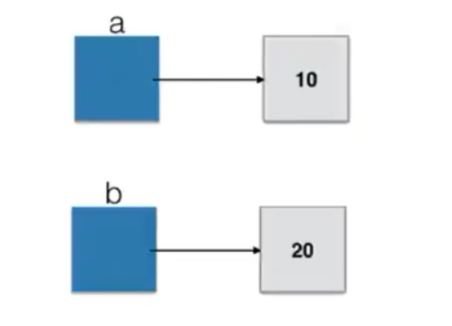
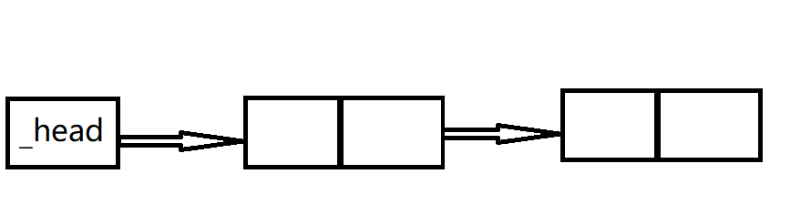
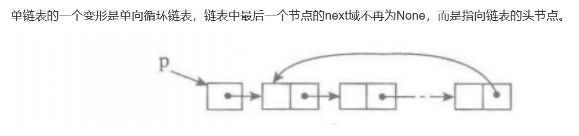
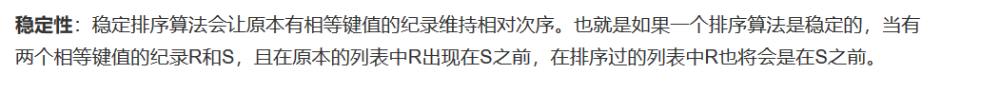
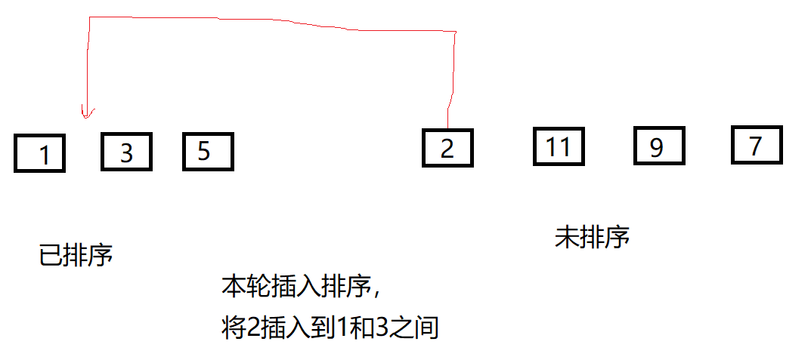
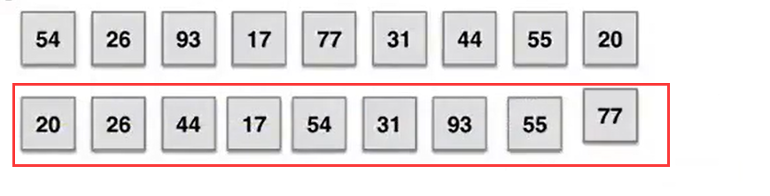
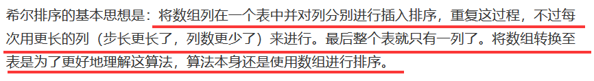
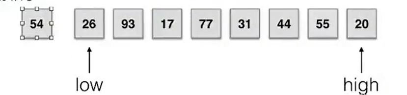
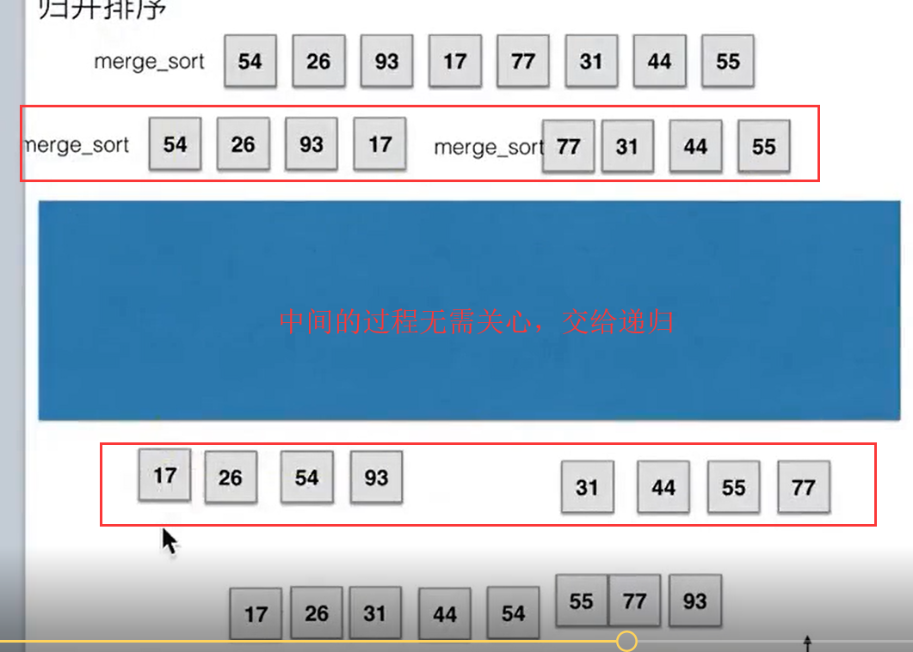

### 你不会数据结构与算法，何谈做真正的程序员？*

&nbsp;

本篇文章旨在数据结构的快速入门，需要你拥有一定的数据结构基础。

例如，你最起码应该知道什么是大O表示法，知道数组与链表的区别等等。

&nbsp;

Author： Masterpaopao

本博客Github地址：https://github.com/Masterpaopao/Master-Blog

参考文献：已将HTML文件包放入python目录。

转载请注明原Github出处，谢谢

## 一.算法引入

#### 1.学习用处

数据结构就是一些有关系的数据的集合，有顺序表，链表，栈，队列，树，图等等。

使我们写出来的程序更加高效，以及解决一些很复杂的业务问题。

&nbsp;

#### 2.例题尝试

如果a+b+c=1000，且a²+b²=c²。a，b，c为自然数，求出所有可能值的组合？

第一种方法就是枚举法，暴力取a，b，c的每一个值，使用三层循环+if判断。

这个方法我就不多说了，所需要的时间非常长，属于O(n³)时间复杂度，这个绝对不是最好的方法。

第二种方法，就是当你取出a和b的时候，是不是c就已经确定了？c = 1000-a-b

这样的方法，肯定大幅度加快速度，大概会耗费3秒，时间复杂度为O(n²)，但是这个方法还是不满意。

&nbsp;

当我们取出a的时候，b的范围是不是只有1000-a，然后再取出b，这个时候就只有c = 1000 -a -b了。

然后我们去掉if的判断a+b+c == 1000的条件，这个时候程序已经优化到了0.8秒。


这个就是最好情况的O(n²)的所需要时间。

&nbsp;

但是衡量一段代码是否看，绝对不是只看时间而判断，比如A算法在数据量小的时候优于B算法，A算法在数据量大的时候又远远不如B算法。

所以我们判断一段代码的算法是否好不好，应该观察趋势，也就是大O表示法。

&nbsp;

#### 3.内置性能分析

Python中封装好的数据结构有字典和列表等，在我们学习之前，我们需要掌握一个技术，用来得出代码的运行时间，以便我们可以观察分析代码的性能。

&nbsp;

1）timeit模块

可以用来测试一小段Python代码的执行速度。

最简洁的用法就是开头一句`%%timeit`


它会自动进行测试10000次，然后求出每一次循环的所使用时间总和的平均数。

最后就给出了一个浮动的时间参考，代表运行的参考时间。

正式的用法的话，就要使用timeit模块的Timer功能，这个Timer的用法是：

`from timeit import Timer`

`t = Timer('函数调用名','引用地址')`

`t.timeit(number=1000)`

这两句代码其实也不难理解，第一个是求出函数运行的时间，第二个是转换为秒单位：


Timer测试速度的方法同样也是测试1000次，这两种方法都可以。

我推荐使用Timer的方法，因为这样做你可以同时测试几个函数的运行时间，进行对比。

&nbsp;

2）list内置操作的时间复杂度

我是默认你拥有良好的list基础的，所以我在这儿列出一个表格，对于你今后该怎么正确编写代码有很大的指导帮助，一定要选择最优解的那个方法。

| 列表内置操作   | 时间复杂度（大O表示法） |
| -------------- | ----------------------- |
| index[i]       | O(1)                    |
| append()       | O(1)                    |
| pop()          | O(1)                    |
| pop(i)         | O(n)                    |
| insert(i,item) | O(n)                    |
| del            | O(n)                    |
| contains(i)    | O(n)                    |
| reverse        | O(n)                    |
| sort           | O(nlogn)                |

你们注意到最后一项了吗，Python里面的排序sort方法，时间复杂度就是O(nlogn)！

学过数据结构的应该知道，快速排序的时间复杂度也是O(nlogn)，说明sort方法是封装好的快速排序。

&nbsp;

3）dict内置操作的时间复杂度

| 字典内置操作 | 时间复杂度（大O表示法） |
| ------------ | ----------------------- |
| copy()       | O(n)                    |
| get()        | O(1)                    |
| set()        | O(1)                    |
| delete()     | O(1)                    |
| contains()   | O(1)                    |

你应该看出来了，字典是一个非常优秀的数据结构，其增删改查都是O(1)。

&nbsp;

## 二.顺序表

#### 1.基本概念

其实顺序表是一个非常专业的说法，在不同的语言里却有不同的叫法，比如JAVA是数组，Python是列表。

顺序表实则一组连续的内存空间，并且位置是从0开始计数的，这就涉及到内存地址计算公式：


所以，由于公式中已经有明确的位置参数，所以你找顺序表的一个元素的位置，无需从头遍历。

你只需要通过位置参数进行计算就可以获取对应位置，所以**顺序表查找的时间复杂度是O(1)**。

&nbsp;

真正实际的顺序表结构，应该分为两个部分，一部分是元素集合，另一部分是所需要记录的顺序表信息。

这份信息最主要存储的是顺序表的容量和当前顺序表中已有的元素个数。

也就是表头（信息）和表体（数据区）：


在Python中，它使用列表这样的数据结构，去将顺序表给封装起来了，所以我们对顺序表的操作就很简洁。

最重要的是，本来顺序表是不可动态扩容的，也就是说你定义了多少大小的空间，你就只能用这样的空间，

在JAVA中，对于数组的增加元素和删除元素是非常麻烦的操作，于是就有ArrayList这样的容器来支持动态扩容。

在Python中，你就不需要关系定义数组的大小了，也不需要关注如何动态扩容，因为有列表List来解决这些问题。

&nbsp;

#### 2.深入理解

顺序表有两种基本实现方式，一个是一体式结构，另一个是分离式结构。

1）首先，一体式结构，就是将表头和表体是一个整体，以连续的方式安排在一块存储区里。

虽然一体式结构整体性强，易于管理。但是一体式结构由于顺序表信息区与数据区连续存储在一起，所以若想更换数据区，则只能整体搬迁，即整个顺序表对象（指存储顺序表的结构信息的区域）改变了。

所以顺序表的扩充对于一体式结构来说，是非常困难的，一旦空间不满足，就要全部迁移到一个足够容量的地方。

2）然后，分离式结构，就是表头和表体是分开的，但它们之间通过一条链来连接，这个链存储表体的地址。

所以分离式结构若想更换或者扩容数据区，只需将表信息区中的数据区链接地址更新即可，而该顺序表对象不变。

这样一来，分离式结构的优越性就出来了，并不需要担忧太多存储问题，因为可以把表体单独放在大存储的空间。

人们把采用**这种分离式结构技术实现的顺序表称为动态顺序表，因为其容量可以在使用中动态变化**。

&nbsp;

这个时候，你应该明白了，Python中的List就是动态顺序表的实现。

因为它可以不断地加入元素，还能在任意位置插入元素，还能任意删除任何位置的元素……

试问，这种对于存储空间要求高的技术，不是分离式结构技术是什么？

&nbsp;

这个时候，我们就需要关注一下List这个数据结构是怎么应对动态扩容的？

一般来说，扩容应当有两种扩容策略的：

- 每次扩充增加固定数目的存储位置，如每次扩充增加10个元素位置，这种策略可称为线性增长。

  特点：节省空间，但是扩充操作频繁，操作次数多。

- 每次扩充容量加倍，如每次扩充增加一倍存储空间。

   特点：减少了扩充操作的执行次数，但可能会浪费空间资源。以空间换时间，推荐的方式。

这儿肯定是推荐第二种方式的，试想，我们的存储技术已经飞速发展这么好了，甚至现在人人的手机基本都有64G内存容量了，未来就是人手128G存储，我们还需要担心空间存储技术吗？

所以我们重点放在时间的优化是一条正确的道路，拼命提升响应速度给用户带来良好的体验。

&nbsp;

而在Python官方实现List结构的时候，则采取了一个很巧妙的方法，类似于循序渐进：

在建立空表（或者很小的表）时，系统分配一块能容纳8个元素的存储区；

在执行插入操作（insert或append）时，如果元素存储区满就换一块4倍大的存储区。

但如果此时的表已经很大（目前的阀值为50000），则改变策略，采用加一倍的方法。

引入这种改变策略的方式，是为了避免出现过多空闲的存储位置。

所以你可以理解，为什么append()这样的方法远远快于insert()的方法了吗？

而且在上面我们也知道：

**append()是O(1)时间复杂度，insert()则是O(n)时间复杂度**。

**pop()是O(1)时间复杂度，pop(i)则是O(n)时间复杂度**。

&nbsp;

#### 3.剖析List

Python标准类型list就是一种元素个数可变的线性表，可以加入和删除元素，并在各种操作中维持已有元素的顺序，而且还具有以下行为特征：

- 基于下标的高效元素访问和更新，时间复杂度应该是O(1)；

    为满足该特征，应该采用顺序表技术，表中元素保存在一块连续的存储区中。

- 允许任意加入元素，而且在不断加入元素的过程中，表对象的标识不变。

    为满足该特征，就必须能更换元素存储区，并且为保证更换存储区时list对象的标识id不变，则是分离式结构实现List。

当然了，除了List实现了动态顺序表之外，还有一种数据结构叫做元组tuple也实现了顺序表，只是它内部不可变。

&nbsp;

那么顺序表的学习就到此结束了，因为Python已经将顺序表封装成List了，所以我们并不需要亲自去实现一个顺序表，但是我们还是值得关注List有哪些使用函数的方法。

在你使用这些函数的时候，一定要记住这些函数相应的时间复杂度，这样你写代码才能不断优化：


## 三.链表

#### 1.基本介绍

在学完顺序表之后，有一个东西我们就不得不去学习了—链表。

为什么呢？在上面学习动态顺序表的时候，我们了解到表头和表体之间是用一条链连接的，这个链存储表体地址。

事实上，根据这个特性，链表就诞生了。

我们可以将一串乱七八糟的数据给连接起来，而不需要给一块连续的存储空间，因为这些都是分散的，然后我们使用链表给连接起来，然后这个元素存储着下一个元素的地址，这样是不是也可以？

&nbsp;

当然了，链表和顺序表从本质上都是一类的东西，将这样一组元素看成一个序列，用元素在序列里的位置和顺序，表示实际应用中的某种有意义的信息，或者表示数据之间的某种关系。

这种序列，我们就抽象地成为线性表，而线性表刚好就有两个模型：

- **顺序表**：将元素顺序地存放在一块连续的存储区里，元素间的顺序关系由它们的存储顺序自然表示。
- **链表**：将元素存放在通过链接构造起来的一系列存储块中。

链表（Linked list）是一种常见的基础数据结构，是一种线性表，但是不像顺序表一样连续存储数据，而是在每一个节点（数据存储单元）里存放下一个节点的内存地址。

那么，链表的实现方式，你们也应该看明白了，就是一个结点中含有元素和下一个元素的地址，然后连接起来：


要注意，链表最后一个节点存储的实际上不应该等于0，而是null，代表空值，在Python中是None关键字。

&nbsp;

为什么就一定要链表呢，顺序表难道有缺陷吗?

1）顺序表的构建需要预先知道数据大小来申请连续的存储空间，而在进行扩充时又需要进行数据的搬迁，所以使用起来并不是很灵活。

2）链表结构可以充分利用计算机内存空间，将零散的数据给串起来，而不需要关注整块存储空间，实现灵活的内存动态管理。

&nbsp;

#### 2.实现结点

在上面，我举的例子其实就是单向链表，除了单向链表还有单向循环链表，双向链表等等。

但这次我们需要先关注一下单向链表的实现。

单向链表是链表中最简单的一个实现，它的每个结点都会包含两个域：

**一个是存储元素的域，一个是存储下一个元素链接地址的域**

当然了，最后一个结点的链接域是空值。

然后链表的插入和删除是非常方便的，属于O(1)时间复杂度，只需要修改存储的信息就能实现。

而数据的查询就很慢了，就需要O(n)的复杂度，因为它只能从头遍历，根据链表指针遍历。

那么，现在最大的问题就来了，每个结点含有两个区域，在Python中怎么样实现这样的一个结点呢？

&nbsp;

在思考如何创造结点之前，我们先来看看Python中的解构概念：

如果你要交换a变量和b变量的值，你如何用解构的方法一行代码搞定？

```python
a, b = b, a
```

可是，你有探究过它们的底层内存发生了什么事情吗？首先设置a=10，b=10:



可当执行`a, b = b, a`这段代码之后，指针全部发生变化：


所以说，两个变量交换值的过程并不是你想象中的两个存储空间变化值，而是指针指向发生了变化。

这个时候，我们可以大胆的假设一下，一个变量的指针是不是也可以指向一个函数，甚至一个类？

&nbsp;

受到这个指针用法的启发，我们对于设计结点有了个初步的思路。

元素的翻译是element，就缩写为elem，下一个结点的变量名就取名为next：


当你看懂这个图之后，我们就根据这个来写如何实现结点的Python代码了。

```python
class Node:
    """结点"""
    def __init__(self,elem):
        self.elem = elem
        self.next = None
```

为什么要设置为self.next=None，这是因为下一个结点的默认值肯定是None最好，当作最后一个结点。

当我们创造结点对象的时候，再修改self.next的值。

好了，我们再来看看单链表的实现吧，首先它需要含有以下的特性：

- is_empty() 链表是否为空  
- length() 链表长度  
- travel() 遍历整个链表
- add(item) 链表头部添加元素
- append(item)  链表尾部添加元素
- insert(pos, item) 指定位置添加元素
- remove(item) 删除节点   
- search(item) 查找节点是否存在  

```python
class SingleLinkList:
    """单链表"""
    def __init__(self):
        pass

    def is_empty(self):
        """链表是否为空"""
        pass
    
    def length(self):
        """返回链表的长度"""
        pass

    def travel(self):
        """遍历整个链表"""
        pass
    
    def add(self,item):
        """链表头部添加元素"""
        pass
    
    def append(self,item):
        """链表尾部添加元素"""
        pass

    def insert(self,pos,item):
        """在指定位置添加元素"""
        pass

    def remove(self,item):
        """删除某个节点"""
        pass

    def search(self,item):
        """查找某个节点是否存在"""
        pass
```

问题就来了，我们的单链表类该如何去初始化呢？

我们知道，在Python的变量命名中，单下划线与双下划线有不同的意义：

单下划线开头命名就说明这个变量或者方法被划入模块内部的范围，成为专属方法，不成为API的一部分。

双下划线开头命名就说明这个变量或者方法彻底成为私有，无法通过对象访问。

&nbsp;

所以，在单链表类的初始化中，我们应该**定义一个指针`self._head`完成开头的指向，也就是搞个空链表**

_head指针肯定是不用的，是为了结点链接的顺畅性就搞一个出来，不然无法让第一个元素直接做开头结点。

或者说你有一个删光链表所有元素的需求，你怎么让它凭空消失呢？

如果我这个例子还不明白，你就理解成这个相当于空列表[ ]。

这样一来的效果应当是这样的，在实际的时候，我们不用管_head这个玩意，直接开始讨论即可：



所以我们的初始化代码就是给链表类加一个初始结点，确保链接的顺畅性：


默认值肯定要设置为Node，因为我们本来就支持创造一个空链表。

现在，我们就全心全意地去关注如何实现具体的连接方法，也就是如何实现真正的单链表类。

&nbsp;

#### 3.实现单链表

首先我们实例化一个单链表对象，不传入节点参数，这个时候就应该是这样：


如果我又实例化了一个结点类，并传入单链表类进行实例化，就是这个样子：


我们真正关心的内容来了，我们该如何实现多个结点链接呢？怎么让每个结点都含有下一个结点地址呢？


##### 1）is_empty()

这个方法就非常好实现了，直接看初始化代码的self._head是不是None即可。


##### 2）length()

我们先来关注一个length()这个内部方法的实现，求出整个链表长度的操作。

我们需要一个cur指针，来记录我们遍历的过程，然后再配合count，记录链表的长度：


这个对你来说应该不难：

**主要的巧妙点是`cur = self._head`，这不就印证了前面说的变量指针可以指向变量，函数，类甚至对象的特点，基于这个特性才能设计出链表。**


如果是空链表的话，这个就无法触发循环，就直接返回0。

如果是长度只有1的话，进入第一层循环之后，count=1，此时这个结点的next等于None，就停止循环。

##### 3）travel()

当我们设计出来length()方法之后，写遍历的代码就容易多了，无非就是多一个打印的过程：


这一切设计的巧妙性都在于指针的运用，以及Node类的内部属性方法。

如果是空链表呢，那么这个travel()就不会打印任何的结果。

那么，接下来，我们最刺激的环节就来了，我们该如何成功实现Node内部代码的self.next呢？

##### 4）append()

往链表的尾部添加元素，这就要开始对我们的self.next动刀了。

我们可以思考一下，我们是往后添加一个结点，那就是最后一个结点，是不是只能添加他的元素值？

但是最后一个结点创造出来之后，是不是前面元素结点的存储的地址就能得到补充?

**append()的过程其实等同于创造一个尾结点，并把前面一个结点的地址从None改成这个尾节点。**

但是我们只有self.next这个方法，所以就要借助一下while循环将cur指针搞到上一个结点，再进行添加：


这个方法是不是很巧妙，通过循环来将cur变量指向最后一个结点，再将这个cur变量指针修改指向于新的结点。

那么问题来了，如果是空链表呢？这个代码是不是就报错了？因为cur就是None，哪来的cur.next？

所以我们利用前面的is_empty()进行判空判断：


这样一来，append()代码是不是就这样完成好了?

但是你也应该明白，**虽然链表尾部插入代码的时间复杂度是O(n)，实际上这个O(n)是遍历操作的，真正完成插入操作的代码时间复杂度才是O(1)**。就拿顺序表来说，顺序表的插入才是O(n)，因为涉及到其他数组元素的移动，而链表不需要，只需要赋值一下修改指针指向即可。


这符合我们所说的链表遍历要O(n)，插入删除要O(1)啊，没什么毛病！

所以插入源码的实现是O(n)并不与插入的时间复杂度是O(1)冲突。

为了确保我们的代码无误，我们需要写个测试用例，再来看看结合输出，多方位测试下：


咦？我的代码出了问题！明明只有1和2，为什么就多打印了一个None呢？这个时候我再去检查我的代码，发现我的测试用例写错了……因为我的travel()就自带打印，而我测试用例写的print(sl.travel())，无疑是多此一举:


现在，我的代码就正常了很多，目前来说写的几个函数应该都没有问题。

##### 5）add()

在上面写append()代码的时候，这个方法叫做尾插法。现在我们要来写写头插法，也就是把元素添加到链表的开头。我们实际想象一下，就会发现这个需求很简单：

**self._head指向于新结点，然后把新结点的next指向于原来的第一个结点**

也就是说整个过程，已经存在的结点不需要执行任何操作。


是不是非常简单？先将新结点的next指向于原来的第一个结点，再把self._head指向于新结点。

这个是不是就验证了链表插入的时间复杂度是O(1)的事实？

当然了，这个代码还没写完，因为我还要考虑到空链表的情况，但是经过思考之后，空链表也能执行这个代码。

现在，我们解决了头插法add()的代码，知道了它的思路，我们再来全力解决中途插入元素的代码。

##### 6）insert()

首先insert()有两个参数，一个是索引位置，一个是新结点的值。

这个过程中，是不是有三个结点要受到影响？前结点的next指向新结点，新结点指向于后结点。

那么在这个过程到底谁先谁后？当然是先将新结点的next指向于后结点，再将前结点的next修改。

也许你会认为，前结点和后结点需要用两个变量，实际上一个变量就可以了。

前结点的变量取名为pre，后结点自然就是pre.next，然后第一句代码肯定是要判断链表的长度是否小于或等于索引位置的变量，否则是要引起报错的，比如长度为2的链表，你却要插一个第四个位置的结点，肯定不行：


我们可以反思一下，elif条件那儿，为什么不能加上等于号呢？我们知道，`self.length()-1`其实就是最后一个索引，如果以它作为尾参数，是不是依旧满足插入的条件？也就是说新结点会放入那个位置，而原来的尾节点则是往后移一位，所以是不能加等于号的。

现在，我们已经把把两个极端情况给解决掉，接下来来编写中间插入的代码，还是那句话：**前结点的变量取名为pre，后结点自然就是pre.next**


这段代码的思路很明确，首先就要找到前结点，这个前结点是取决于pos参数的值，pos-1的位置就是前结点的位置，所以利用while循环来找到pre的正确位置，找到了之后就可以插入元素了。

然后就是写个测试用例，跑跑结果:


##### 7）search()

先不讲删除结点的操作，把这个放在最后讲，我们先来讲讲查找，查找操作时间复杂度毫无疑问是O(n)，试想，我们搞定了查找之后，删除结点的代码是不是也差不多能完成了？

我们可以想一下，链表的遍历实现是基于while实现的，那么查找就是while+if实现，对吗？


是不是很简单？就一直遍历就完事，没触发if就返回False，触发了就返回True。

##### 8）remove()

现在，来讲讲最难的删除节点操作了，实际上，我们的删除节点的确是基于while循环查找的基础下完成的，我再说一遍，删除代码的实现的时间复杂度确实是O(n)，但是那个是基于遍历查找的，只针对于删除本身的操作来说，只不过是两行代码的事情，所以删除操作的时间复杂度为O(1)是正确的！

**插入代码与删除代码实现的时间复杂度是O(n)并不与插入删除本身的时间复杂度是O(1)冲突！**

&nbsp;

我们来思考一下删除结点的过程，自然还是依靠while循环去一个个遍历，然后循环的过程判断值是否相等。

但是有一个难题就出来了，我必须同时掌握三个变量，前结点，当前结点，后结点。

所以我们需要提前弄个pre，代表当前结点，cur是当前结点，后结点是cur.next

这样一来，实现删除就是`pre.next = cur.next`，当然你也可以`pre.next = pre.next.next`

然后**写链表代码的时候永远都要考虑边界情况，删除第一个结点和最后一个结点的情况。**

删除最后一个结点的时候，其实跟删除中间的结点操作一样，因为None其实也能当作一个结点……

自然，我们需要针对的操作就是第一个结点，因为第一个结点没有前结点：


然后就是测试用例了，分别测试删除尾结点（和中间结点操作一样）和头结点：


&nbsp;

##### 9）单链表总结

这样一来，我们的单链表代码就成功写出来了，以后面试官要你手写实现单链表代码的时候，你再也不虚了！

我们在这个过程中，利用了指针移动的概念，这是一个很重要的思想。

也许你现在已经明白了所有的代码是怎么回事，但我还是要啰嗦一遍，虽然**链表的插入删除代码实现的时间复杂度是O(n)，但耗时的操作主要是遍历查找，删除和插入操作本身的复杂度是O(1)。**

对于顺序表来说，遍历查找就只需要O(1)，但插入删除却需要O(n)，耗时的操作主要体现在顺序表的拷贝和覆盖。

你也注意到了**顺序表的尾部插入只需要O(1)，因为除了目标元素在尾部的特殊情况，顺序表进行插入和删除时需要对操作点之后的所有元素进行前后移位操作，只能通过拷贝和覆盖的方法进行。**

&nbsp;

链表虽然失去了顺序表随机读取的优点，只能通过循环遍历访问，但是它由于增加了结点的指针域，空间开销比较大，但对存储空间的使用与管理要相对灵活。

我们再来提出一道面试题吧：顺序表和链表有什么区别?

**顺序表是用一组连续的内存空间，来存储一组具有相同类型的数据；链表通过每个结点存储下一个结点的地址的方式，用指针将一组零散的内存块串联起来存储一组数据。**

**顺序表适合读取查询，支持随机访问，根据下标随机访问的时间复杂度为O(1)；链表适合插入删除，时间复杂度都是O(1)。**

&nbsp;

##### 10）单链表源码

```python
class Node:
    """结点"""
    def __init__(self,elem):
        self.elem = elem
        self.next = None

class SingleLinkList:
    """单链表"""
    def __init__(self,node=None):
        self._head = node

    def is_empty(self):
        """链表是否为空"""
        return not self._head
    
    def length(self):
        """返回链表的长度"""
        # count记录数量，初始值是0，因为_head不算结点
        count = 0
        cur = self._head
        while cur != None:
            # 不是None就加上1
            count += 1
            # cur其实是结点对象，自然有next这个属性
            cur = cur.next

        return count

    def travel(self):
        """遍历整个链表"""
        cur = self._head
        while cur != None:
            print(cur.elem,end=' ')
            cur = cur.next
        print()

    def add(self,item):
        """链表头部添加元素"""
        node = Node(item)
        node.next = self._head
        self._head = node


    def append(self,item):
        """链表尾部添加元素"""
        node = Node(item)
        if self.is_empty():
            self._head = node
        else:
            cur = self._head
            while cur.next != None:
                cur = cur.next
            # 在这一步才完成尾结点的添加
            cur.next = node

    def insert(self,pos,item):
        """在指定位置添加元素"""
        # 如果索引参数参小于或等于0，就头插入
        if pos <= 0:
            self.add(item)
        # 如果索引参数大于链表的最大索引，就尾插入
        elif pos > self.length()-1:
            self.append(item)
        # 如果索引参数正常，则执行中间插入
        else:
            node = Node(item)
            # 此时不用count，要用index代表索引
            index = 0
            pre = self._head
            while index < pos-1:
                index +=1
                # 将pre指针指向于目标位置的前结点
                pre = pre.next
            # 先将新结点的next指向于pre的next
            node.next = pre.next
            # 再将前结点的next指向于新结点
            pre.next = node

    def remove(self,item):
        """删除某个节点"""
        # 设置前结点变量为None，这是预防目标是第一个结点
        pre = None
        cur = self._head
        while cur != None:
            if cur.elem == item:
                # 如果目标刚好是第一个结点
                if not pre:
                    self._head = cur.next
                # 如果目标不是第一个结点，正常删除
                else:
                    # 将前结点的next对应上后结点，就完成删除
                    pre.next = cur.next
                # 完成上面任意操作之后，没必要继续这个循环
                break
            else:
                pre = cur
                cur = cur.next

    def search(self,item):
        """查找某个节点是否存在"""
        cur = self._head
        while cur != None:
            if cur.elem == item:
                return True
            cur = cur.next
        return False
```

&nbsp;

#### 4.实现循环单链表

什么是循环单链表，也叫单向循环链表，对比单链表多了一个特性，就是尾结点指向于头结点，形成一个闭环。

实现它，就会多了一些难点，比如插入结点的时候，如果插入的是头或者尾，必然会牵扯到三个结点的变动。

删除结点也是，删除头结点或尾结点，也会涉及到三个结点的变动，代码的实现会比较难。



当然了，单向循环链表的几个方法都是和单向链表一样的：

- is_empty() 判断链表是否为空
- length()  返回链表的长度
- travel() 遍历
- add(item) 在头部添加一个节点
- append(item) 在尾部添加一个节点
- insert(pos, item) 在指定位置pos添加节点
- remove(item)  删除一个节点
- search(item)  查找节点是否存在

主要是有几个地方需要修改，我一一讲诉：

##### 1）构造方法

既然我们这个成为了循环链表，那么我们想一想，如果我想创造一个只有结点的链表，我这个指针该怎么安排呢？


所以我们在构造方法里面需要有个变动，有些人喜欢先创建一个空链表，但有些人就喜欢直接创建含有一个结点的链表啊，比如`sl = SingleCycleLinkList(node)`，所以是需要变动的：


##### 2）length()

is_empty()判空的方法并不需要改，直接判断self._head是不是None就完事。

接下来看看length()，我们思考一下，这个方法的代码需要变动吗？


看明白了吗?cur本来就指向于自己，所以这儿的length()毫无疑问会陷入死循环，所以我们需要修改一下了。


为什么count不能从0开始，我们需要判断尾节点是否指向于头结点来记录出单向循环链表的长度。

##### 3）travel()

由于遍历不再基于尾结点是None，而是判断是否指向头结点来完成遍历，所以我们的travel()代码也是需要改动的:


##### 4）append()

append()被改是毫无疑问的，现在我们需要反思，添加尾节点的操作都会多出什么?

是不是在原有的操作代码上加上新结点的next指向于self._head？

分两步：1）将新结点的next指向于头结点；2）再将原来的尾节点的next指向于新结点


##### 5）add()

头部插入的话，比单链表的头部插入麻烦多了，因为这牵扯到三个地方的改动：

（下面的顺序是思维误区的产物，初学者容易也陷入这个错误顺序）

1）新结点的next指向于原来的头结点

2）尾结点的next指向于新结点

3）self._head指向于新结点


但是我们思考一下，我们这个代码的写法是否是对的呢？

观察最后两行的代码，我们发现cur.next和self._head两个变量的指针都指向了node，这个时候，我们是不是可以说这两个变量本质没区别？

我们再来反思一下，我们在前面的代码中，遍历是怎么做的，是不是判断`cur.next != self._head`来得到尾节点？所以这一句条件为什么不能拿来直接用呢？

所以我们需要修改一下顺序，使代码的顺序看起来更合理：

1）新结点的next指向于原来的头结点

2）self._head指向于新结点

3）尾结点的next指向于self._head


看到了吗，最后一行代码和循环的条件完成了神同步，这样才不会引起指针错乱！

但是！我们又陷入了一个思维误区，之前的单链表头插法代码能够直接对空链表进行添加，难道，这儿也能进行直接头插法吗？很明显不行。

所以这儿就出现了头插法代码实现的第二个大坑，极端情况的处理。所以最终的代码应该是这样的：


可以说，写各种链表代码能够对自己的思维逻辑严密性进行一个有效的锻炼！

请时时刻刻使用极端条件去检验代码的可行性！在这儿的循环单向链表中，极端情况分别是空链表，只有一个结点的链表！

##### 6）insert()不变

insert()的代码两个极端条件已经不需要修改了，因为这两个极端条件对应的add()和append()在上面我们已经修改了。

我们现在再来看看中间插入的else代码部分:


我们顺着这个逻辑，再走一遍，我们发现，else代码块的内容也不需要改，因为单向循环链表对比单链表只影响了头结点和尾结点，中间结点不受影响，对吗？

##### 7）search()

我在前面说过，由于循环单向链表的特性，遍历的条件判断发生了变化，所以这个search()代码肯定是要改的：


##### 8）remove()

现在，最难的地方来了，循环单向链表删除结点的操作，在你去尝试之前，一定要牢牢记住那几个极端情况，分别去验证一下，确保你代码的正确性。

代码的编写步骤在基于单链表的remove()函数上，修改的大致步骤如下:

1.添加上判空的条件，空链表不执行任何操作。

2.删除多结点链表的头结点代码，先找到尾结点进行操作。

3.break要修改成return，直接跳出整个函数，防止报错。

4.尾结点不在遍历范围，自然在下面再单独操作。

5.考虑到单结点的链表情况。


测试代码的时候，根据下面几个重要的边界情况来处理。

1.多结点链表的头结点和尾结点

2.单结点的链表

3.空链表

##### 9）循环单链表源码

```python
class Node:
    """结点"""
    def __init__(self,elem):
        self.elem = elem
        self.next = None

class SingleCycleLinkList:
    """单向循环链表"""
    def __init__(self,node=None):
        self._head = node
        # 只有一个结点的时候，是自己指向自己
        if node:
            node.next = node

    def is_empty(self):
        """单向循环链表是否为空"""
        return not self._head
    
    def length(self):
        """返回单向循环链表的长度"""
        # 先判空，判断是否为空链表
        if self.is_empty():
            return 0
        # 考虑到只有一个结点的单向循环链表，必须从1开始
        count = 1
        cur = self._head
        while cur.next != self._head:
            # 不是None就加上1
            count += 1
            # cur其实是结点对象，自然有next这个属性
            cur = cur.next
        return count

    def travel(self):
        """遍历整个单向循环链表"""
        # 下面有个打印尾结点，空链表直接运行会报错
        if self.is_empty():
            return
        cur = self._head
        while cur.next != self._head:
            print(cur.elem,end=' ')
            cur = cur.next
        # 退出循环之后，尾结点还未被打印
        print(cur.elem)
        print()

    def add(self,item):
        """单向循环链表头部添加元素"""
        node = Node(item)
        if self.is_empty():
            self._head = node
            node.next = node
        else:
            # 新结点的next指向于原来的头结点
            node.next = self._head
            cur = self._head
            while cur.next != self._head:
                cur = cur.next
            # self._head指向于新结点
            self._head = node
            # 尾结点的next指向于self._head
            cur.next = self._head

    def append(self,item):
        """单向循环链表尾部添加元素"""
        node = Node(item)
        if self.is_empty():
            self._head = node
            # 这一步可别忘了噢！
            node.next = node
        else:
            cur = self._head
            while cur.next != self._head:
                cur = cur.next
            # 在这一步才完成尾结点的添加
            node.next = self._head
            cur.next = node

    def insert(self,pos,item):
        """在指定位置添加元素"""
        # 如果索引参数参小于或等于0，就头插入
        if pos <= 0:
            self.add(item)
        # 如果索引参数大于链表的最大索引，就尾插入
        elif pos > self.length()-1:
            self.append(item)
        # 如果索引参数正常，则执行中间插入
        else:
            node = Node(item)
            # 此时不用count，要用index代表索引
            index = 0
            pre = self._head
            while index < pos-1:
                index +=1
                # 将pre指针指向于目标位置的前结点
                pre = pre.next
            # 先将新结点的next指向于pre的next
            node.next = pre.next
            # 再将前结点的next指向于新结点
            pre.next = node

    def remove(self,item):
        """删除某个结点"""
        # 先进行判空，空链表会导致下面代码报错
        if self.is_empty():
            return
        # 删除涉及到三个结点
        pre = None
        cur = self._head
        while cur.next != self._head:
            if cur.elem == item:
                # 判断是不是头结点，特殊操作
                if cur == self._head:
                    # 找到尾结点
                    rear = self._head
                    while rear.next != self._head:
                        rear = rear.next
                    # 找到尾结点之后进行删除操作
                    self._head = cur.next
                    rear.next = self._head
                # 中间结点操作跟单链表一样
                else:
                    pre.next = cur.next
                # 这儿不能填break来停止循环，因为下面还有代码，继续执行会报错
                # 应该是用reutrn直接结束整个函数
                return
            else:
                pre = cur
                cur = cur.next
        # 还剩个尾结点没进行操作
        if cur.elem == item:
            # 如果是单结点的链表，进入这个条件
            if not pre:
                self._head = None
            else:
                # 如果是多结点，与上面的中间结点操作代码一致
                pre.next = cur.next


    def search(self,item):
        """查找某个结点是否存在"""
        # 先进行判空，决定是否决定遍历
        if self.is_empty():
            return False
        cur = self._head
        while cur.next != self._head:
            if cur.elem == item:
                return True
            cur = cur.next
        # 还是那句话，尾节点还未进行判断
        if cur.elem == item:
            return True
        return False

```

#### 5.实现双向链表

在上面，我们实现了单链表，单向循环链表，实现的过程略有波折，但是结果还是很棒的，可以尝试一下传说中的反转单链表题目，可以下去亲自尝试。

现在，双向链表的需求就来了，它是怎么样的呢？


可以看的出来的是，除了头结点和尾结点，其他的结点均有指向和被指向，这个代码实现可能就会难很多。

我就画一张图，让你弄懂什么是双向链表，注意，这儿并不是循环的，循环双向链表的实现更加麻烦，但是在这儿我就不讲了。


注意！前面的_head不是结点！你要搞清楚它的作用只是方便创造一个空链表，所以头结点是没有前结点的指针！

##### 1）结点实现

可以看出来，结点的类需要重新定义了，不再只有后指针，还应当有前指针：


##### 2）is_empty()

在实现之前，肯定还是要编写一个类，初始化方法还是一样的，搞一个哨兵`self._head`来承载链表的连接，然后判空肯定还是针对于这个哨兵`self._head`：


##### 3）length()和travel()

其实，我们反思一下，这个双向链表的长度和遍历，还是和单向链表一模一样的，对不对?

因为这两个操作根本涉及不到前结点后结点，只是单纯的遍历:


##### 5）append()

尾插入对我们来说其实并没有多大的难度了，无非是考虑两种情况：

1.空链表的情况

2.多结点的双向链表的情况


##### 6）add()

既然写出来了append()，add()也没多难，还是两种情况：

1.空链表的情况

2.多结点的双向链表的情况


根据这个图，我们可以在脑海里面想象，写出头插入的过程


##### 7）insert()

由于双向链表多了个前指针，即使是add()和append()都写好了，相比较单链表的代码，这次的else代码块需要做出改动。


##### 8）search()

搜索遍历的代码，其实不需要改，跟单链表的代码一样，毕竟只涉及到遍历+if判断：


##### 9）remove()

又到了喜闻乐见的环节，删除双向链表的某一个结点，当然了，它的思路肯定还是和单向链表差不多的，在它的基础上面再去修改即可，下面是示意图提供想象空间：


正好反思一下，在单链表实现的代码中，我用了pre和cur两个变量，代表前结点和当前结点，问题就来了，在这个双向链表中，我还需要用pre变量吗？

明显不用了，pre变量直接用`cur.prev`来代替，最后代码优化如下:


##### 10）双向链表源码

这样一来，我们的双向链表代码总是给实现了，当然了，还有双向循环链表，感兴趣的人可以自己尝试去实现，跟单向循环链表一样麻烦的，我就不在这儿多言了!

（有BUG，将在后面修复，请敬请阅读！）

```python
class Node:
    """实现双向链表的结点"""
    def __init__(self,item):
        self.elem = item
        self.prev = None
        self.next = None

class DoubleLinkList:
    def __init__(self,node=None):
        self._head = node

    def is_empty(self):
        """判断双向链表是否为空"""
        return not self._head
    
    def length(self):
        """返回双向链表的长度"""
        count = 0
        cur = self._head
        while cur != None:
            # 不是None就加上1
            count += 1
            # cur其实是结点对象，自然有next这个属性
            cur = cur.next
        return count

    def travel(self):
        """遍历整个双向链表"""
        cur = self._head
        while cur != None:
            print(cur.elem,end=' ')
            cur = cur.next
        print()

    def detail(self):
        """打印每个结点的具体情况"""
        cur = self._head
        while cur != None:
            print(cur.elem,f'前结点：{cur.prev.elem if cur.prev else None}',f'后结点：{cur.next.elem if cur.next else None}')
            cur = cur.next
        print()
        

    def append(self,item):
        """实现双向链表的尾插入"""
        node = Node(item)
        # 先解决空链表的情况
        if self.is_empty():
            self._head = node
        # 后解决非空链表的尾插入
        else:
            cur = self._head
            while cur.next != None:
                cur = cur.next
            # 开始尾插入操作
            cur.next = node
            node.prev = cur


    def add(self,item):
        """实现双向链表的头插入"""
        node = Node(item)
        if self.is_empty():
            self._head = node
        else:
            node.next = self._head
            self._head.prev = node
            self._head = node

    def insert(self,pos,item):
        """中间位置插入结点"""
        if pos <= 0 :
            self.add(item)
        elif pos > self.length()-1:
            self.append(item)
        else:
            node = Node(item)
            # 还是要找到前结点
            index = 0
            pre = self._head
            while index < pos-1:
                index += 1
                pre = pre.next
            # 开始插入结点,先将后指针搞定
            node.next = pre.next
            pre.next.prev = node
            # 再将前指针搞定，完成插入
            pre.next = node
            node.prev = pre
    
    def search(self,item):
        """查找某个节点是否存在"""
        cur = self._head
        while cur != None:
            if cur.elem == item:
                return True
            cur = cur.next
        return False

    def remove(self,item):
        """删除某个节点"""
        cur = self._head
        while cur != None:
            if cur.elem == item:
                # 如果是头结点,也符合单结点的双向链表情况
                if cur == self._head:
                    self._head = cur.next
                # 如果是尾结点
                elif cur.next == None:
                    cur.prev.next = None
                else:
                    cur.prev.next = cur.next
                    cur.next.prev = cur.prev
                # 完成删除操作直接退出循环
                break
            else:
                cur = cur.next

```

#### 4.检验链表代码

你觉得我的代码就一定是对的吗，我们需要一个强大的测试用例。

光有用例还不够，我们还需要知道各个结点的实时状态，确保我们链表的指针是正确的指向，所以这儿采用了三元表达式。

##### 1）单链表


##### 2）循环单链表


##### 3）双向链表


##### 4）测试用例

我们对这三个链表代码都用上同一个测试用例，确保每个边界条件都覆盖到：

1.单结点链表的删除

2.空链表的头插入和尾插入

3.中途插入

4.删除中间结点

5.删除头结点

6.删除尾结点

并在每一个阶段都能查到实时结点的状态：


然后分别检查三段代码的测试用例结果，果不其然，在双向链表代码的测试中，我测试出问题了：


很明显是头结点的处理，并没有处理它下一个结点的prev成为None：


也就是说上面的双向链表源码是错误的，需要你自己手动修改！

再来看看最后的测试用例结果，一切都回来了：


到此为止，我们链表的学习就结束了，今后我们就带着这些链表代码去完成实际的应用场景，帮助业务设计！

记住，多写多练，多默写，多关注边界条件的处理！

&nbsp;

## 四.栈与队列

#### 1.快速了解

为什么要将栈与队列放到一起讲，是因为等一下实现它们的时候都用顺序表。

##### 1）栈

栈是一种特殊的容器，它最大的特点就是只允许在容器的顶端加入数据和取出数据。

这样一来，它就保证了一种默认的访问顺序，由于只允许在顶端操作，故而等同于后进先出（LIFO）策略。

我们先来剖析一下栈这个结构吧，无非就是分为栈底和栈顶，操作分为出栈和入栈：


##### 2）队列

当你明白栈的时候，队列就很好理解了，结合一下实际生活中的排队就知道了。

队列的特性就是这一端入，另一端出，保证了一种有秩序的访问顺序，并不允许在中间操作！

故而等同于先进先出（FIFO）策略，队列的结构也如下：


#### 2.实现栈

知道栈的特性之后，我们就基于顺序表的方式来实现这个栈，命名为Stack类。

这个栈应该有如下的特性：

- push(item) 添加一个新的元素item到栈顶
- pop() 弹出栈顶元素
- peek() 返回栈顶元素
- is_empty() 判断栈是否为空
- size() 返回栈的元素个数

然后我们设计栈时的那个列表变量，应该设置为私有变量，只能在Stack内部使用，起到一定的安全性。

故代码如下：

```python
class Stack:
    """栈"""
    def __init__(self):
         self.__list = []

    def is_empty(self):
        """判断是否为空"""
        return not self.__list 

    def push(self, item):
        """加入元素"""
        self.__list.append(item)

    def pop(self):
        """弹出元素"""
        return self.__list.pop()

    def peek(self):
        """返回栈顶元素"""
        if self.__list:
        	return self.__list[-1]
       	else:
            return None

    def size(self):
        """返回栈的大小"""
        return len(self.__list)
```

发现了吗，栈这个数据结构实际上非常快，因为它的添加元素和弹出元素的时间复杂度全部都是O(1)。

所以你在设计栈的时候，一定要保持这些相应操作的时间复杂度也都为O(1)。

然后我们随便编写一下测试用例即可：


&nbsp;

#### 3.实现单向队列

在理解实现栈的代码之后，队列的代码就不难写了，就命名为Queue类：

- enqueue(item) 往队列中添加一个item元素
- dequeue() 从队列头部删除一个元素
- is_empty() 判断一个队列是否为空
- size() 返回队列的大小

不用多说，私有变量肯定是要用的：

```python
class Queue:
    """队列"""
    def __init__(self):
        self.__list = []

    def is_empty(self):
        """队列判空"""
        return not self.__list

    def enqueue(self, item):
        """进队列"""
        self.__list.insert(0,item)

    def dequeue(self):
        """出队列"""
        return self.__list.pop()

    def size(self):
        """返回大小"""
        return len(self.__list)
```

其实我们可以思考一下，在进队和出队这两处地方中，我们实际上有两种写法，第一种无非就是进队O(n)出队O(1)，第二种是进队O(1)出队O(n)，那么我们到底该如何选择哪个方法呢？

在实际应用中，可以说，进队是我们服务器的事，而出队却关乎到用户体验的响应速度，为了给用户最好的服务，自然要让出队的速度尽可能地快，所以我们选择进队O(n)出队O(1)的代码编写方式。

&nbsp;

#### 4.实现双端队列

双端队列就比较高端了，在这儿是称呼为Deque类，全名是Double-ended queue。

它是一种具有队列和栈的性质的数据结构，双端队列中的元素可以从两端压入弹出，也可以入队出队。

这样一来，相比较单向队列无非是多出来两个特性，两端都能加入或删除：

- add_front(item) 从队头加入一个item元素
- add_rear(item) 从队尾加入一个item元素
- remove_front() 从队头删除一个item元素
- remove_rear() 从队尾删除一个item元素
- is_empty() 判断双端队列是否为空
- size() 返回队列的大小

代码实现也没多大区别：

```python
class Deque:
    """双端队列"""
    def __init__(self):
        self.__list = []

    def is_empty(self):
        """判断队列是否为空"""
        return self.__list == []

    def add_front(self, item):
        """在队头添加元素"""
        self.__list.insert(0,item)

    def add_rear(self, item):
        """在队尾添加元素"""
        self.__list.append(item)

    def remove_front(self):
        """从队头删除元素"""
        return self.__list.pop(0)

    def remove_rear(self):
        """从队尾删除元素"""
        return self.__list.pop()

    def size(self):
        """返回队列大小"""
        return len(self.__list)
```

&nbsp;

## 五.排序

#### 1.学前热身

在前面，我们学会了这样的几个数据结构:

1）顺序表：在Python中用List实现

2）链表：使用面向对象和指针的概念来实现

3）栈：使用顺序表来实现的后进先出结构

4）队列：使用顺序表来实现的先进先出结构

现在，本应该讲树这个结构的，但是，你们发现没，前面这四个都属于线性表的结构，而树属于非线性表的结构。

所以我们就讲一讲线性表才有的排序算法。


&nbsp;

排序算法有一个特别重要的概念，就是稳定性。这个词语能够解答排序算法必要性的问题。



比如说，我给出下面这样的一串数据：

```
(4, 1)  (3, 1)  (3, 7)（5, 6）
```

如果是你，你是不是就会进行排序，排序到这样的结果：

```
(3, 1)  (3, 7)  (4, 1)  (5, 6)  （维持次序）
```

这就是已经达到稳定的效果，在拿取数据的时候可以免去麻烦。

&nbsp;

#### 2.冒泡排序

冒泡排序算是很简单的一种排序了，利用循环依次排序数据。虽然它的方法看起来很笨，但是又有效又稳定。


这个图片只是第一次排序过程，就将最大的元素给排序到最后了。如果恰好最大的元素就在最后面，此时排序的过程便是第二大的元素排序归位到倒数第二个位置。

这样一来，**按最大的次数算，n个元素最多需要n-1次冒泡排序**，因为最后一次排序的过程中，前面两个元素就已经正确归位了，所以我们在代码里面的实现应该是n-1次循环。

&nbsp;

现在，就让我们开始写一个冒泡排序的函数吧！


这个代码不难理解吧，首先就是n-1次循环，这是肯定的，然后第一次循环遍历全部列表，进行全部排序。

第二次的话，就排序去掉1个尾元素的列表，第j次的话，就排序去掉j个尾元素的列表。

最后一次排序的时候，此时可排序的列表元素个数必然是2个。所以是n-1次循环。

但是！我们的代码需要优化，因为我们必须考虑最优时间复杂度的情况，如果我们的列表在某一次循环的时候，就已经完成了正确的排序，但是这个时候函数还没停止，这样是不是很浪费时间？

所以我们需要**加入哨兵处理，随时监控冒泡排序是否在中途就完成**：


这样一来，我们的冒泡排序代码就成功完成了，最优时间复杂度肯定是O(n)，当然这个情况很少见，一上来就是排序好的列表直接拿去冒泡排序，不现实。

最坏的时间复杂度是O(n²)，所以平均时间复杂度还是偏向于O(n²)的，但它是个很稳定的算法。


&nbsp;

#### 3.选择排序

选择排序是一个非常著名的排序算法，因为它简单直接，又有暴力的美感。

它是怎么做的？**选择排序也是n个元素n-1次循环**，但是它在每一次循环中，将未排序的列表元素中找到最大(小)的值，直接放入到后面(前面)。

也就是说，第一次循环找到最大的元素，放入到最后一个位置，第二次循环找到第二大的元素，放入倒数第二个位置，依次推算，在经历最大次数n-1次循环之后，一个列表就这样排序好了。

以下是选择排序第一轮的示意图：


&nbsp;

当然了，它的写法也是很灵活的，你有两种写法：

1）找最小值放在前面；2）找最大值放在后面

本次代码示例就以第一种的写法来做吧，每一次循环中找最小值，但是我们思考一下，我们的最小值怎么排到前面呢，如果是删除，再加入到前面，是不是很麻烦？

其实我们可以在第i次循环中，找到第j个元素是最小值，将array[i-1]和array[j-1]进行交换，也是一样的效果：

（比如在第2次循环中，第一次循环的最小值肯定是找到了，只需要找第二个最小值，从第二个元素开始遍历）


你可以先根据自己的想法，先写下代码，你的代码也许会比我多几行，这些都是正常的，然后再慢慢优化，优化到我这图中的最终形态。

接下来我们就要考虑到在中途就完成排序的情况，很简单，安排上count即可：


你认为这就结束了吗！恭喜你，你又陷入了思维误区！

你觉得这个选择排序存在中途就结束的说法吗？我们可以想一下，就从第三次循环来说，假如第三个元素恰好比后面的所有元素都小，这个时候，根据上面的代码，count未发生变化，我就直接退出函数了。

后面的元素就不再排序了？？这就算排序好了吗？？？所以我们的代码是有误的，只能修改如下:


再来反思一下选择排序本身，我们可以发现，它的最优时间复杂度和最坏时间复杂度都是O(n²)，因为它没有任何中途就结束选择排序的可能，所以即使是排好序的列表，也得跑两轮不触发交换数据的循环。

至于它的稳定性，肯定是不好的，因为你想一想，冒泡排序的过程，是不是每一轮的时候，都会有一个元素被排好序，而前面没排序的元素都还维持着之前的顺序，所以**冒泡排序是稳定的**。

而这个选择排序，就涉及到交换，假如我发现最后一个元素是最小的，我要把它交换到第一个来，这个时候，此时的列表就不再维持原来的顺序了，全被打乱了，所以**选择排序肯定是不稳定的**。

&nbsp;

#### 4.插入排序

在上面的选择排序学习之后，知道了它的缺点非常明显，O(n²)又不稳定，所以插入排序应运而生。

它同样也是分已排序和未排序的两个部分，在每次循环中，挑选出未排序部分的第一个元素，加入到前面的已排序部分，并当场排序，就完成了插入排序，如其名一样的操作。


如果动图还是看不懂，我自己画一个图给你们描述一下：



具体的插入过程，当然还是跟前面的冒泡排序一样，进行比较换位置，直到插入到正确的位置，无法再交换。

&nbsp;

如果你看懂了这个示意图，你的脑海应该也会浮现出这样的一句话，n个元素n-1次循环。

至少它的代码过程简洁很多，就是按照顺序，一个个执行插入排序（第一个元素不参与）。


这个时候，我们需要了解到Python的一个range技巧：


如果你看得懂这个倒序的话，如何向前比较大小的思路，你也应该有了：


这个算法并不会影响未排序区域的列表顺序，只是一个个把前面给排序好，对比于选择排序的打乱未排序区域：

**选择排序和插入排序同样都是O(n²)，后者是不是就稳定了很多？**

**插入排序是有稳定性的**。

&nbsp;

#### 5.希尔排序

我们经过插入排序的学习之后，可以知道，插入排序是对选择排序的优化，并且插入排序具有稳定性，在执行的过程中并不会对原序列造成很大变动。

这儿就要介绍希尔排序，同样是插入排序的升级版，也就是选择排序的最高优化版，但是**为了使它具有高效性，希尔排序必然是不稳定的**。

首先，希尔排序是需要定一个间隔的，我们取名为gap，我们如果有一个9个元素的序列，我们设置为gap=9/2≈4，就会有这样的效果：


这样一来，是不是就分成了四行？第一行有三个元素，剩下的行数都是两个元素。

然后应该怎么做你应该知道了，第一行直接进行插入排序，这样20就排到了第一个，根据这个规律，四行都进行插入排序的最终效果是：


然后把它们都移上去，就完成了第一次整体变化：



然后下一步该怎么操作？当然是再来一次这样的过程，但是这个时候的gap可以修改为gap=2，再来一轮类似的操作:


最后一轮就是gap=1的操作，也就是最原始的插入算法：


所以这个过程你看明白了吗，希尔排序就是采用每轮步数减半的方式来进行每轮的插入排序，在最后一轮的时候恰好插入排序完成。



这儿有一个通俗易解的图片为你直观展示：


&nbsp;

现在我们一起来实现一下希尔排序，希望大家能够重点掌握，毕竟它是插入排序的最高优化版，建议学会手写代码。

&nbsp;

总之，希尔排序跟插入排序的区别只在于多了个gap步长，因为要追求效率导致希尔排序不稳定。


#### 6.快速排序

##### 1）第一种理解

如果你有主动去了解一些大厂的面试题，你会发现，快速排序简直就是常客！

各种手写快速排序，快速排序的拓展，快速排序的业务面试题层出不穷！

&nbsp;

快速排序的关键点是两个游标,我们暂且命名为low游标和high游标，分别从低位和高位往中间移动。


然后你直接把第一个元素54安排，我们应该如何安排到哪个位置呢，这个时候两个游标双面夹击。

怎么双面夹击呢，就是确保low指针走过的元素比54小，high指针走过的元素比54大，卡壳了就交换。

low指标从第二个元素开始出发，就是这样的效果：



然后时间定格在此时的状态，这个时候low指标出发，第一个26比54还小，没问题，继续往下走，来到了93，结果发现93比54还大，这个时候low指针就停住不动。


这个时候，就来到了high指针，结果发现high指针指向的20比54还小，high指针也不能动了，这个时候，两个指针指向的元素就会进行交换。


然后交换之后，low指针就继续往前走，卡壳了再来到high指针，如此重复，最终就会得到一个这样的位置


然后我们就把这个序列成功地分为了两个部分，一部分全都比54小，另一部分全都比54大，所以两个序列再来一遍快速排序的过程，还是以每个序列的第一个元素作为标准，于是就有了这样的示意图：


这就是整个快速排序的过程，这样你们能看明白吗？

&nbsp;

##### 2）第二种理解

如果你觉得上面的文字版描述太复杂的话，我们可以换一种全新的方式再讲诉一遍快速排序。

实际上我们可以想一下，当我们拿出第一个元素的时候，给它找到的位置其实就是它最终的位置？因为左边的元素都比它小，右边的元素都比他大，所以我们继续对分出来的两个分支再来一次这样的操作，经过几次之后，是不是所有元素的位置都确定了？

实际上**这个快速排序需要用到递归，将划出来的分支不断进行前面快速排序的操作**。

先找一个中间变量，就先存储为54，然后还是一样的两个游标双面夹击：


既然这个时候已经把第一个元素存储为中间变量了，这个时候先让high指标移动，结果发现比low指标还小，这个时候肯定不能移动，这个时候直接让20代替到第一个元素的位置，当然不用担心54丢失，因为已经存储进中间变量了，所以加个条件判断，将这个20赋值到第一个元素：


当然了，还有后续的动作，当完成赋值覆盖的时候，low指标直接往后移动一位：


这个时候，如果low指标指向的元素还是比54小，则往后移动，如果不是，将这个值移动high指标，但是目前26确实比54小，low指标继续往右移动，终于发现93比54大，这个时候93位置直接放到右边去，弥补空位，别忘了，一旦赋值过去，high游标就得往左移动：


这样能明白快速排序的过程了吗，这个第二种理解比第一种理解的代码实现方法还要简洁明确，无非是利用一个中间值，然后腾出空位，两个游标互相移动，互相弥补空位，直到low指针和high指针重合，就是中间变量的位置：


这个时候，你也能发现，左边的元素都比中间值小，右边的元素都比右边小。然后又分为两个分支，重复前面已经进行过的操作，还是利用递归的方法完成快速方法。

&nbsp;

##### 3）代码实现

如果你看懂了两个理解，我们就以第二种理解的方式，开始实现代码了：


首先构造出快速排序函数的雏形，确定好循环条件，当low指针与high指针相遇时就停止一次快速排序的过程，这个跟我们后面要接触的归并排序以及二分查找思维很相似。

但是实际上这么设计太麻烦了，因为我们要用递归，所以既然打算用递归，何来搞那么多条件判断呢，直接一次性安排几个while，并行完成这个过程：


这两个大块是不是就是完成游标移动，互补空位的过程？

这个时候，我们必须要考虑到遇到相同值元素的情况，这个时候应该怎么安排呢，是安排到左边分支还是安排到右边分支呢？首先我们希望中间值成为一个分界线，把相同值全部划到右边去，左边全是小于中间值的元素，这样是不是利于下次排序的过程？


然后我们从大局上面看待这一次的循环，实际上这个循环是有BUG的，假如那个即将相遇时的元素，刚好等于这次循环的中间值，结果触发第一个循环，触发交换，并且low的指标还超过了high指标！

所以我们再次踏上改BUG的路途，如何在两个指标相遇的时候，能不再执行操作呢？这个时候肯定要修改掉游标移动的方式，将其裹进代码块里面。

实际上是两行代码多余了，没必要自行移动指针，让它自动进入循环再移动，可以避免交叉错过：


然后循环外的多出来两行代码，也就是array[low]和array[high]两次交换，实际上作用互相抵消，相当于啥也没发生，直接确保两个指针不会交叉错过移动。

这个时候，中间值的位置已经确定出来了，也就是low和high所指向的位置，因为此时low=high,然后可以把中间值安排上去了。这个时候我们分成了两个分支，这两个分支可以通过递归再来一遍快速排序：


实际上，我们还是陷入思维误区了，我们其实不能用切片的方式，想想我们经过第一次排序的时候，后分支再来一遍快速排序，回到开头的`mid_value = array[0]`，还有`high = n - 1`这个时候是不是针对于新的列表上进行操作？是不是跟原有的array列表没有任何关系？

可是我们快速排序就是要对原来的array列表进行操作啊，但是代码是传入的切片后的列表，这个时候实际上是新的列表了，再也影响不到原来的array列表了。

所以我们需要修改的地方就是，让整个快排在执行递归的时候，永远针对于原array列表进行操作：


给函数增加first和last的参数，表示自己传入首下标值和尾下标值，这样一来，这个递归才能不断地对分支进行操作快速排序，一个递归栈处理前面分支衍生出来的更多分支，另一个递归处理后面的分支。

当然了，你如果知道递归，**递归有两个重要部分：基线条件和递归条件**。基线条件就是用来当触发一定条件的时候，递归被终止，防止陷入死循环，所以开头安排进去基线条件：


这就是快速排序，实际上**快速排序就等于一个典型的递归函数，也可以叫做分而治之—一种著名的递归式问题**。

它的时间复杂度是多少呢，最快是O(nlogn)，一共最少n/2个基线，每一次可以恰好以一半的方式来拆分，只不过大O表示法要去掉常数积。

最慢是O(n²)，也就是类似于糟糕的选择排序一样，暴力排序。

所以**快速排序的时间复杂度是在于O(nlogn)到O(n²)之间**。

&nbsp;

#### 7.归并排序

##### 1）过程理解

快速排序是个面试常客，跟它一样地位的是归并排序，也叫合并排序，这两个可以说是兄弟关系。在《算法图解》里面这两种排序都被放到一个章节一起来讲的。

归并算法到底是一个怎么样的过程呢，无非就是拆分分支再次拆分，拆分到单元素分支的程度，然后进行合并：


然后第一次合并，就是针对于双元素分支的方式，拆开再合并，也就是说，倒着走一遍前面拆分元素的过程：


然后第二次合并就是以四元素分支的方式进行合并，这个时候每个分支有两个元素，怎么样合并到四元素呢？

这个时候就轮到游标登场了，分为left游标和right游标，分别对两个双元素进行排序，无非是比较两个游标：


谁小就拿出来，把那个游标后移动，再如此重复，就合并成四元素分支了：


然后右边分支再重复一下这样的过程，就得出了两个四元素的分支。


最后的合并排序的过程就简单了，再用两个游标针对于两个四元素分支进行排序，得出最终合并成功的序列：


所以，归并过程无非就是**一个不断拆分，然后拆分到单分支，然后再以排序的方式合并回去的排序算法**。

它的时间复杂度已经呼之欲出了，**每次都以对半分的方式拆开，归并排序的时间复杂度即为O(nlogn)**。

&nbsp;

##### 2）代码实现

其实你可以发现，归并排序也是一个非常典型的递归，并且非常突出分而治之的思想，这就是为啥要把快速排序和归并排序放在一起讲的原因。

首先他是一个递归过程，但是我们其实无需关心全部的递归，因为只需要针对第一次归并排序就可以了，至于什么时候停止，这就是设计递归的基线条件的问题了，来终止递归，也就是完成归并排序的时候。


当拆分后的列表只剩一个元素的时候，是不是代表已经到了不可再拆分的过程，这就是递归的基线条件。

所以我们去实现代码的时候，其实去关注第一次拆分和倒数第一次合并的过程，就能实现代码了：



根据这个思路，我们大体写出了这样的归并代码：


这是一个严重依赖递归的排序方法，在Python中可能会超出递归栈上限，具体方法请百度解决。

那么，最大的疑问来了。这段代码的执行过程到底是怎么样的呢，这个要运用到递归栈的深刻理解。

##### 3）代码理解

这段代码应该怎么理解呢，一时还看不明白归并函数代码的实现过程，没关系，慢慢捋一下。

首先安排一个九个元素的序列，根据代码的一步步来展现过程：


然后获取mid，为4，所以分成了4元素序列和5元素序列：


接下来就是重要的代码关键点了，子序列进入递归，反复递归，最终获得这样的过程：


这样能明白吗，最终的左序列就是99，右序列是41，最终经过下面的代码排序成了 49 和 99，返回到下面的result


注意，这个只是一个最里面的一层递归，当这个result = [41,99]产生的时候，跳到上一层递归的l_li序列，这个时候，另一边的result = [6,23]也来到了上一层的递归的r_li序列，再次重复一遍归并排序：


最后这两个就成了result = [6,23,41,99]，这个时候另一边刚好也完成了result = [15,39,54,77,101],分别来到了上一层的递归的l_li序列和r_li序列，再次进行最后一次归并排序。

这个就是归并排序中，递归实现排序的整个过程，主要是理解层层递归到上一层，理解成一个栈，这层递归完成了就弹出去，来到上一层递归继续解决事情，直到所有的递归过程完成。

与此同时，**排序算法就成为了具有稳定性的算法，它的时间复杂度保持O(nlogn)**。

&nbsp;

#### 8.效率对比

我们在上面实现了六种排序方法，无一不是经典的面试常客，注意，使用Python实现的时候要防止递归栈溢出的问题，有条件的可以用别的语言来实现，代码逻辑都是大同小异的。

比如说面试官可能会问你你熟悉几种排序，你可以都回答出来，如果面试官要你实现其中几种，你当然可以胸有成熟地写下代码。

在这几种中，**快速排序是最为常用的，随着n量级的越来越大，优势越来越明显，因为它不需要额外申请过多的时间资源和空间资源**，虽然归并排序具有保序稳定性和稳定时间复杂度，但是空间资源预算是不足的，权衡一下还是不如快速排序的。

&nbsp;


#### 9.二分查找

二分查找的概念，在读《算法图解》的入门章节的时候，可能我们已经会了。在上面我们使用的算法都是针对于序列的排序的，而这次的二分查找则是针对序列的查找的。

没错，对于序列的查找来说，最稳定的算法当然是二分查找，时间复杂是是O(logn)，这是什么概念？当你从100个元素的序列查找元素的时候，你的查找次数可不会超过7次！

在《算法图解》中，我们接触的是非递归方法的二分查找，在这儿我就直接实现了。

（非递归方法的二分查找代码）

想必你们也看得懂，在这儿我就不过多讲诉，我主要讲诉的是学会递归之后，我们如何使用递归来实现二分查找的代码。

（递归方法的二分查找代码）

## 六.树

