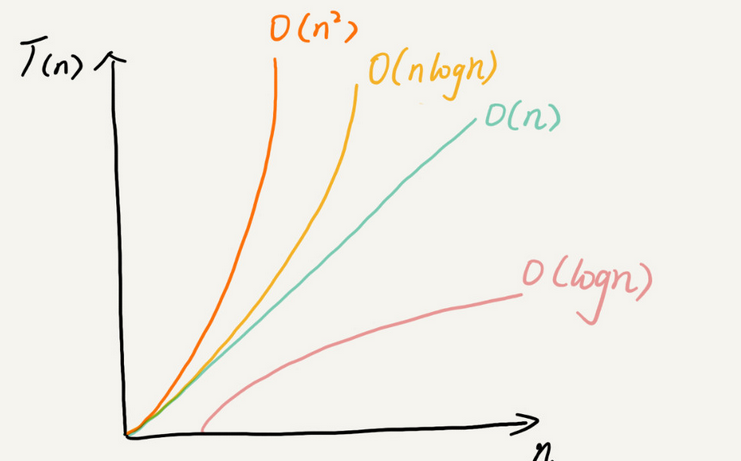
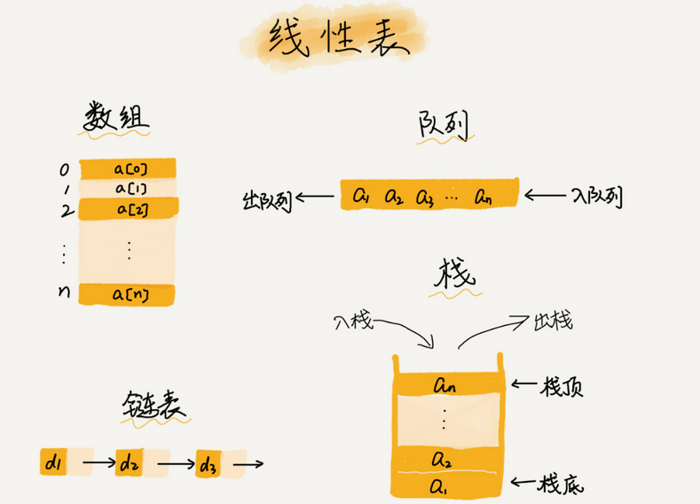
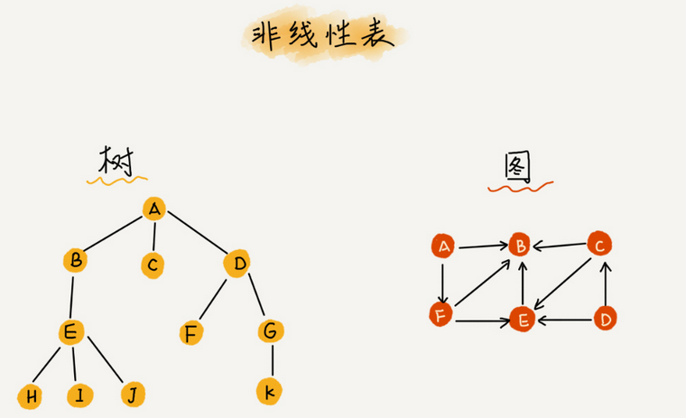
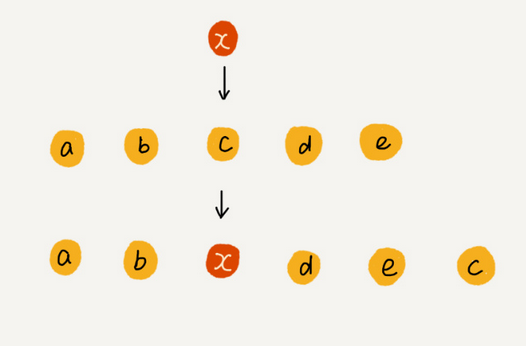
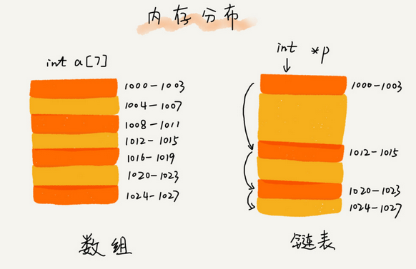
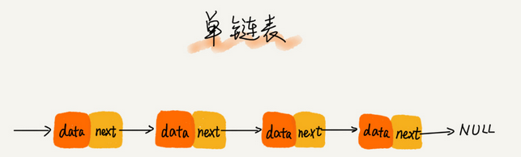
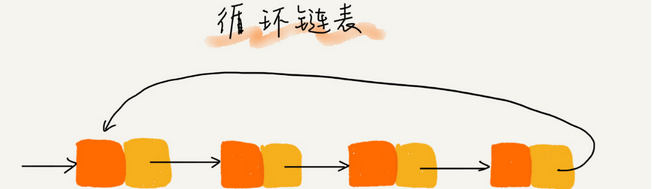
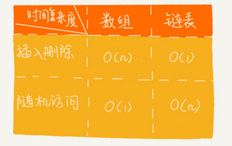

#### *你不会数据结构与算法，何谈做真正的程序员？*

&nbsp;

本篇文章旨在数据结构的专业延伸阅读，需要你拥有一定的数据结构基础。

例如，你最起码应该知道什么是大O表示法，知道数组与链表的区别等等。

&nbsp;

Author： Masterpaopao

本博客Github地址：https://github.com/Masterpaopao/Master-Blog

参考文献：来自于某付费知识平台的专栏《数据结构与算法之美》，作者王争。

转载请注明原Github出处，谢谢。

* [一\.入门知识](#%E4%B8%80%E5%85%A5%E9%97%A8%E7%9F%A5%E8%AF%86)
    * [1\.复杂度分析](#1%E5%A4%8D%E6%9D%82%E5%BA%A6%E5%88%86%E6%9E%90)
    * [2\.时间复杂度](#2%E6%97%B6%E9%97%B4%E5%A4%8D%E6%9D%82%E5%BA%A6)
    * [3\.空间复杂度](#3%E7%A9%BA%E9%97%B4%E5%A4%8D%E6%9D%82%E5%BA%A6)
* [二\.数组](#%E4%BA%8C%E6%95%B0%E7%BB%84)
    * [1）线性表](#1%E7%BA%BF%E6%80%A7%E8%A1%A8)
    * [2）非线性表](#2%E9%9D%9E%E7%BA%BF%E6%80%A7%E8%A1%A8)
    * [3）连续的内存空间和相同类型的数据](#3%E8%BF%9E%E7%BB%AD%E7%9A%84%E5%86%85%E5%AD%98%E7%A9%BA%E9%97%B4%E5%92%8C%E7%9B%B8%E5%90%8C%E7%B1%BB%E5%9E%8B%E7%9A%84%E6%95%B0%E6%8D%AE)
    * [4）低效的插入](#4%E4%BD%8E%E6%95%88%E7%9A%84%E6%8F%92%E5%85%A5)
    * [5）低效的删除](#5%E4%BD%8E%E6%95%88%E7%9A%84%E5%88%A0%E9%99%A4)
    * [6）使用容器](#6%E4%BD%BF%E7%94%A8%E5%AE%B9%E5%99%A8)
    * [7）回到开头](#7%E5%9B%9E%E5%88%B0%E5%BC%80%E5%A4%B4)
    * [8）他人总结](#8%E4%BB%96%E4%BA%BA%E6%80%BB%E7%BB%93)
* [三\.链表](#%E4%B8%89%E9%93%BE%E8%A1%A8)
    * [1\.学前热身](#1%E5%AD%A6%E5%89%8D%E7%83%AD%E8%BA%AB)
    * [2\.链表应用](#2%E9%93%BE%E8%A1%A8%E5%BA%94%E7%94%A8)
    * [3\.链表学习](#3%E9%93%BE%E8%A1%A8%E5%AD%A6%E4%B9%A0)
    * [4\.性能比拼](#4%E6%80%A7%E8%83%BD%E6%AF%94%E6%8B%BC)
    * [5\.多写多练](#5%E5%A4%9A%E5%86%99%E5%A4%9A%E7%BB%83)

## 一.入门知识

#### 1.复杂度分析

复杂度分析是整个算法学习的精髓。

它分为时间复杂度和空间复杂度分析，其中时间复杂度是学习的重点。

算法的执行效率用大O复杂度来表示。

&nbsp;

所有代码的执行时间都与每行代码的执行次数成正比。

推导出来的公式就是T(n) = O(f(n))

一般来说常见的三种时间复杂度就是O(1)、O(n)、O(n²)等等。

说白了，时间复杂度只是表示一个算法执行效率与数据规模增长的变化趋势。

所以你判断的时候，一般可以只关注循环次数执行最多的代码块即可。

&nbsp;

我们一共来看看常见的复杂度量级有哪些？

- 常量阶：O(1)
- 对数阶：O(logn)
- 线性阶：O(n)
- 线性对数阶：O(nlogn)
- 平方阶：O(n²)
- 立方阶：O(n³)
- K次方阶：O(n<sup>k</sup>)
- 指数阶：O(2<sup>k</sup>)
- 阶乘阶：O(n!)

根据上面所粗略列出来的这些，我们分为两类，多项式量级和非多项式量级。

其中非多项式量级只有两个，O(2<sup>k</sup>)、O(n!)，当数据规模n越来越大的时候，非多项式量级算法的执行时间会急剧增加，故而它们是非常低效的算法，在后文中就不讲述这些了。

&nbsp;

什么是复杂度分析？

1.数据结构和算法解决是“如何让计算机更快时间、更省空间的解决问题”。

2.因此需从执行时间和占用空间两个维度来评估数据结构和算法的性能。

3.分别用时间复杂度和空间复杂度两个概念来描述性能问题，二者统称为复杂度。

4.复杂度描述的是算法执行时间（或占用空间）与数据规模的增长关系。

&nbsp;

#### 2.时间复杂度

O(1)复杂度就是代码执行时间不随着n的增大而增长。

一般情况下，只要算法中不存在循环语句和递归语句等等，即使是成千上万的代码，时间复杂度也只是O(1)。

&nbsp;

O(logn)是对数阶，其实它是非常常见的复杂度，它的应用有二分算法、对折次数等等。

比如对折纸张，你想折出16个格子，是不是只需要对折4次？

其实就是log₂16=4，对吗，这个就是对数阶算法模型。

至于线性对数阶O(nlogn)，其实也很好说，如果一段代码的时间复杂度是 O(logn)，我们循环执行 n 遍，时间复杂度就是 O(nlogn) 了。

但是，也不能小瞧这个线性对数阶O(nlogn)，因为它同样也有一个重要的应用：归并排序或快速排序。

&nbsp;

O(m+n)、O(m*n)就不详细介绍了，这些都是涉及到两个数据规模的玩意，因为你无法评估出来m和n谁的量级大，就不能简单地归并起来进行计算，所以这两个量级都加入进去分析。

&nbsp;

现在，一起假设一段代码，可以有四种代码方法解决，这四种方法的时间复杂度恰好分别为O(logn)、O(n)、O(nlogn)、O(n2 )，聪明的你，应该选择哪一种时间复杂度呢？

我们检验一个算法的执行效率，肯定是设想在无限次数下进行计算，所以先来看看一张图：



看到了吗，在数据量规模很小的时候，也许O(n)是最优解。但是再来看看n趋近于无限的时候，O(logn)所需要的时间竟然远远小于O(n)！所以我们应当选择O(logn)算法的代码。

看到了吗，这就是算法的魅力，也是学好数据结构与算法的必要理由。

&nbsp;

#### 3.空间复杂度

在前面，对于时间复杂度有了个清晰的认知之后，空间复杂度就简单了。

它就是表示算法的执行时间与数据规模的增长关系，也就是渐进空间复杂度。

为什么它不是学习的重点呢，因为在实际应用中，存储是靠硬件完成的，这并不是很难解决的事情，现在的存储技术发展非常好，连手机动不动就128G内存了。

所以就不如全力分析时间复杂度，尽可能地提升代码运行速度，增加用户的响应体验。

&nbsp;

## 二.数组

大部分编程语言中，数组都是从0开始编号的。

但是你是否仔细想过，为什么数组要从0开始编号，而不是从1开始呢？

带着这份疑惑，来看看下面的数组内容吧。

&nbsp;

什么是数组?

**数组（Array，在Python中是List）是一种线性表数据结构。它用一组连续的内存空间，来存储一组具有相同类型的数据。**我们可以拆开这句话的每个关键词来进行学习。

&nbsp;

#### 1）线性表

顾名思义，就是数据排成像线一样的结构，只有前后两个方向。

除了数组之外，还有链表、队列、栈等也是线性表结构。



可以看得出啦，队列是先进后出，栈是后进后出，链表是一个具有方向特性的结构。

&nbsp;

#### 2）非线性表

与线性表对立的肯定是非线性表，比如二叉树，堆，图等，辨别它们不是线性表的方法其实很简单，它们的数据之间并不是简单的前后关系。



&nbsp;

#### 3）连续的内存空间和相同类型的数据

这两个特性，可以说，是这两个限制，给数组带来了杀手锏，就是随机访问的功能。

也就是说数组可以通过索引来访问，时间复杂度是O(1)。

但是这个功能也让数组在某些操作很困难，比如元素的删除和插入，就需要大量的迁移数据操作。

（在Python中简化了这个过程，我这儿以编译语言JAVA位基础）

这儿引出一个面试题：数组和链表的区别?

一般是这样回答：**链表适合插入、删除，时间复杂度都是O(1)；数组支持随机访问，根据下标随机访问的时间复杂度为O(1)。**

千万不能直接回答数组查找时间复杂度为O(1)，因为你需要设想不知道下标的查找情况，即使是最快的二分查找，时间复杂度也得O(logn)。

&nbsp;

#### 4）低效的插入

如果一个数组的长度为n，如果我们需要将一个数据插入到第K个位置，为了完成这个过程，我们需要将原来的k~n这部分的元素都顺序地往后挪一位，这个过程的时间复杂度是多少呢？

如果在数组的末尾插入元素，那就不需要移动数据了，这时的最好时间复杂度为O(1)。

如果是在数组的开头插入元素，那么所有数据都需要依次往后挪一位，这时最坏时间复杂度为O(n)。

所以这两个情况综合起来，平均时间复杂度就为O(n)。

还有一个最简单暴力的方法，如果一个数组a[6]存储了5个元素，分别为a，b，c，d，e

我想将x插入到第三个位置，这个时候我只需要将第六个位置的元素赋值为c，然后将第三个赋值为x

这样的过程就只需要O(1)的时间复杂度。

&nbsp;

利用这种技巧，，在特定场景下，在第 k 个位置插入一个元素的时间复杂度就会降为 O(1)。这个处理思想会在后面的快速排序中用到，到时候会进行讲解。

&nbsp;

#### 5）低效的删除

其实删除和插入的操作是类似的，平均时间复杂度也是O(n)。

删除数据也是一样的操作，先记录下需要删除的数据，进行操作。

如果数组一旦没有更多空间的时候，再触发真正的删除操作，将后面的数组进行迁移拷贝往前一位。

它的思想其实类似于JVM标记清除垃圾回收算法的核心思想。

&nbsp;

#### 6）使用容器

针对数组类型，很多语言都提供了容器类，比如Java 中的 ArrayList、C++ STL 中的 vector。

容器最大的优势就是将很多数组操作的细节封装起来，并且也支持动态扩容。

因为我们在使用数组的时候，就需要预先指定大小，这个操作是很么麻烦的，如果我搞了大小为6的数组，现在我后悔了，还想再放一些数据进去，这个时候就要进行一系列巨麻烦的操作。

当然了，使用容器的时候，最好也指定数据大小，这也是有利于内存空间的优化。

对于业务开发层来说，直接使用容器就够了，省时省力，也不会损耗很多系统的整体性能。

但是你如果是想去做一些非常底层的东西，性能的优化需要做到极致，那还得数组登场。

&nbsp;

#### 7）回到开头

我们再来回到开头，为什么大多数编程语言中，数组都要从0开始编号，而不是从1开始呢？

从底层的角度来想，数组存储的内存模型上来看，下标其实是偏移量。

第一个位置肯定是偏移量为0的元素啊，所以自然定义为a[0]，公式自然也这样：

`a[k]_address = base_address + k * type_size`

如果你想让数组从1开始计数，那么我们的计算公式就会变成：

`a[k]_address = base_address + (k-1)*type_size`

第二条公式多了一次减法运算，对于CPU来说，就是多了一次减法指令，这肯定不利于性能的极限优化，所以为了减少一次减法操作，数组选择从0编号。

当然了，历史的因素也很重要，C语言设计者也是用0开始计数的，之后的高级语言都效仿了C语言。

甚至Python这个语言都支持负数下标，比如a[-1]，但它是个脚本语言，并非编译语言。

&nbsp;

#### 8）他人总结

```
 ————总结一下————

什么是数组

数组（Array）是一种线性表数据结构。它用一组连续的内存空间，来存储一组具有相同类型的数据。

1.线性表
线性表就是数据排成像一条线一样的结构。
常见的线性表结构：数组，链表、队列、栈等。

连续的内存空间和相同类型的数据

2.优点：两限制使得具有随机访问的特性
缺点：删除，插入数据效率低

数组怎么根据下标随机访问的？

通过寻址公式，计算出该元素存储的内存地址：
a[k]_address = base_address + k * data_type_size

为何数组插入和删除低效

插入：
若有一元素想往int[n]的第k个位置插入数据，需要在k-n的位置往后移。
最好情况时间复杂度 O(1)
最坏情况复杂度为O(n)
平均负责度为O(n)

如果数组中的数据不是有序的，也就是无规律的情况下，可以直接把第k个位置上的数据移到最后，然后将插入的数据直接放在第k个位置上。

这样时间复杂度就将为 O（1）了。

删除：
与插入类似，为了保持内存的连续性。
最好情况时间复杂度 O(1)
最坏情况复杂度为O(n)
平均负责度为O(n)

提高效率：将多次删除操作中集中在一起执行，可以先记录已经删除的数据，但是不进行数据迁移，而仅仅是记录，当发现没有更多空间存储时，再执行真正的删除操作。这也是 JVM 标记清除垃圾回收算法的核心思想。

数组访问越界问题
C语言中的数据越界是一种未决行为，一般比较难发现的逻辑错误。相比之下，Java会有越界检查。

用数组还是容器？
数组先指定了空间大小
容器如ArrayList可以动态扩容。
1.希望存储基本类型数据，可以用数组
2.事先知道数据大小，并且操作简单，可以用数组
3.直观表示多维，可以用数组
4.业务开发，使用容器足够，开发框架，追求性能，首先数组。

为什么数组要从 0 开始编号？
由于数组是通过寻址公式，计算出该元素存储的内存地址：
a[i]_address = base_address + i * data_type_size
如果数组是从 1 开始计数，那么就会变成：
a[i]_address = base_address + （i-1）* data_type_size

对于CPU来说，多了一次减法的指令。
当然，还有一定的历史原因。  
```

&nbsp;

## 三.链表

#### 1.学前热身

由于链表很多特性与数组相反，在这一小节中，我们将链表和数组进行对比学习。

数组是一段连续的内存地址，故它有随机访问的特性。

链表就不同了，它的每个元素可以存储在内存的任何地方。因为每个元素都存储了下一个元素的地址，将一系列随机的内存地址串在一起。

所以你应该看得出来链表的插入或删除的时间复杂度为O(1)，插入只需要在修改的位置改下下一个元素的内存地址就可以，删除也是修改成下下一个元素的内存地址完成删除。

| 数组           | 链表           |
| -------------- | -------------- |
| 读取查询：O(1) | 读取查询：O(n) |
| 插入删除：O(n) | 插入删除：O(1) |

为什么链表的读取查询是O(n)呢，因为链表只能顺序查询，因为元素的地址是存储在上一个元素的结点里面，所以你必须从第一个结点顺序访问，直到找到你的目标元素为止。

而数组的读取查询就很快，只需要O(1)，因为它能随机访问，可以根据下标的值快速查询。

- 数组的读取查询的速度很快
- 链表的插入删除的速度很快

&nbsp;

#### 2.链表应用

学习链表有什么用呢？它有一个最经典的应用场景：LRU缓存淘汰法。

缓存是一种提高数据读取性能的技术，在硬件设计、软件开发中都有着非常广泛的应用，比如常见的 CPU 缓存、数据库缓存、浏览器缓存等等。

缓存的大小有限，当缓存被用满时，哪些数据应该被清理出去，哪些数据应该被保留？这就需要缓存淘汰策略来决定。常见的策略有三种：

- 先进先出策略 FIFO（First In，First Out）
- 最少使用策略 LFU（Least Frequently Used）
- 最近最少使用策略 LRU（Least Recently Used）

所以，学习链表，要带着一个重要的问题：

如何用链表来实现LRU缓存淘汰策略？

&nbsp;

#### 3.链表学习

从底层的存储结构来看，数组需要一块连续的内存空间来存储，对内存要求比较高。

链表不需要一块连续的内存空间，它通过指针将一组零散的内存块串联起来使用，不存在内存申请的问题。



链表有三种常见的链表结构：单链表、双向链表和循环链表。

单链表，你也知道了，就是每个节点存储下一个节点的地址，将一组数据给串联起来：



```
  链表通过指针将一组零散的内存块串联在一起。其中，我们把内存块称为链表的“结点”。为了将所有的结点串起来，每个链表的结点除了存储数据之外，还需要记录链上的下一个结点的地址。
  我们习惯性地把第一个结点叫作头结点，把最后一个结点叫作尾结点。其中，头结点用来记录链表的基地址。有了它，我们就可以遍历得到整条链表。而尾结点特殊的地方是：指针不是指向下一个结点，而是指向一个空地址 NULL，表示这是链表上最后一个结点。
```

再来看看这个循环链表，无非就是将循环链表的尾节点指针指向链表的头节点。



和单链表相比，循环链表的优点是从链尾到链头比较方便。

当要处理的数据具有环型结构特点时，就特别适合采用循环链表。比如著名的约瑟夫问题。尽管用单链表也可以实现，但是用循环链表实现的话，代码就会简洁很多。

&nbsp;

#### 4.性能比拼

通过前面内容的学习，你应该已经知道，数组和链表是两种截然不同的内存组织方式。



不过，数组和链表的对比，并不能局限于时间复杂度。而且，在实际的软件开发中，不能仅仅利用复杂度分析就决定使用哪个数据结构来存储数据。

先来说说它两的优缺点吧：

1）缓存：

简单应用，在实现上使用的是连续的内存空间，可以借助CPU的缓存机制。

预读数组中的数据，所以访问效率更高。

而链表并不是连续存储，对CPU缓存不友好。

2）空间：

定义数组的大小固定，一旦声明就要占用整块连续内存空间。

一般只能借助基于数组封装好的容器类，进行动态扩容。

而链表本身没有大小的限制，支持动态扩容。

&nbsp;

#### 5.多写多练

先学会自己在网上寻找一些实现链表的代码，或者跟着视频多敲多练，这儿有五道经典的链表题：

- 单链表反转
- 链表中环的检测
- 两个有序的链表合并
- 删除链表倒数第n个节点
- 求链表的中间结点

在写链表代码的时候，一定要知道指针到底是什么?

指针这个概念在C语言中很重要，在别的语言中，可能就叫引用，但它们都殊途同归。

那么，你到底该如何正确理解指针或引用呢？

**将某个变量赋值给指针，实际上就是将这个变量的地址赋值给指针，换句话说，指针中存储了这个变量的内存地址，指向了这儿变量，通过指针就能找到这个变量。**

粗暴理解就是，一个变量的指针是可以指向一个变量，一个函数，一个类设置一个对象。

实现链表就是将结点变量的指针指向于下一个结点变量，完成串联。

&nbsp;

写链表代码的时候，一定要重视指针指向顺序的代码编写，比如我要插入中间的新结点，是不是就涉及到前结点，新结点，后结点？那么我该如何插入新结点呢？

错误的操作就是先将前结点的next指向于新结点，再将新结点的next指向于后结点。你在执行第二步的时候，你的前结点的next已经变成了新结点，而原来的那个后结点就被你丢失了，代码自然出BUG。

正确的操作应该是先将新结点的next指向于后结点，再让前结点的next指向于新结点，这才是正确操作。

&nbsp;

还有就是，一定要重视边界条件的处理：

- 如果链表为空时，代码是否能正常工作？
- 如果链表只包含一个结点时，代码是否能正常工作？
- 如果链表只包含两个结点时，代码是否能正常工作？
- 代码逻辑在处理头结点和尾结点的时候，是否能正常工作？

也就是说，你要尽可能地考虑到因为边界而带来的BUG！

（想要学会如何通过Python来实现链表，请跳转到隔壁的Python实现文件夹进行学习！）

