## *数组、链表、跳表的黄金铁三角*

本节内容涉及数组，链表和跳表三个数据结构的讲解。

并伴有Leetcode实战题目的解析详情。

&nbsp;

## 一.概念速讲

#### 1.数组

JAVA/C++： int a[100];

Python： list = [ ]

Javascript： let a = [1,2,3]

&nbsp;

计算机底层有内存管理器，每当你申请数组的时候，计算机会在内存给你开辟一段连续的地址。

这些地址可以用内存管理器去访问，支持随机访问任何一个元素，时间复杂度是O(1)。

但是访问的时候，却比较麻烦，比如D插入到中间：

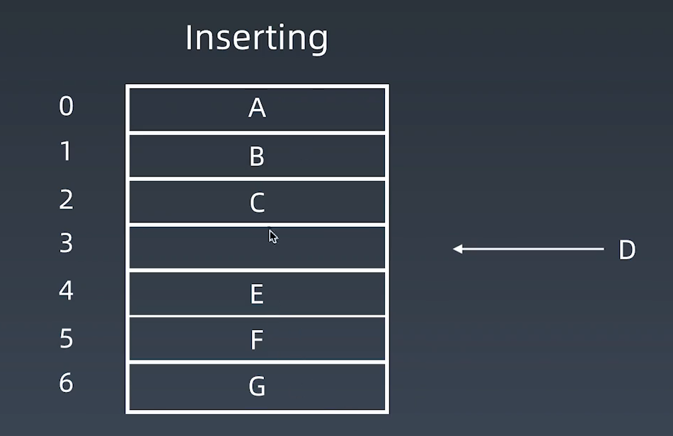

这样的话，就意味着后面的E、F、G都要往后复制挪移一位，这个时候时间复杂度就为O(n)了。不过，如果你是向尾部插入一个元素，时间复杂度只要O(1)，这是特殊情况。

&nbsp;

#### 2.链表

我们再来看看链表，就是Linked List，专门用来弥补数组的缺点，可以怎么解决呢？

链表在一些很频繁进行修改和删除的操作的前提下，优越性就要高于数组，因为它们只需要O(1)。

但是链表的循环需要O(n)的时间复杂度，链表究竟怎么定义呢？

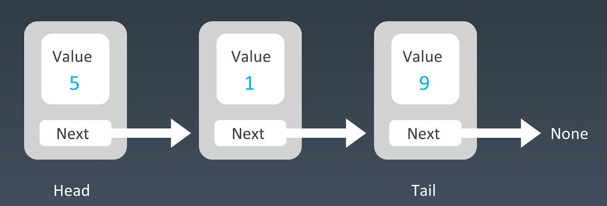

我们可以把链表的结点，定义为Node类的实例，每个实例都有value属性和next属性。

value属性用来存储当前结点的值，next属性用来指向下一个结点的内存地址。

（如果是双向链表，还会多一个pre属性，指向于前一个结点的内存地址）

（如果是循环链表，尾结点的next是指向于头结点的）

&nbsp;

我们来看看，链表的标准实现回事怎么样的，例子就用JAVA来做：

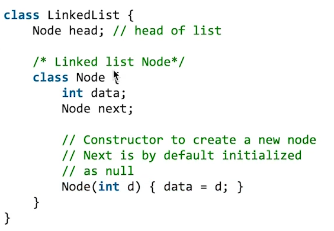

比较暴力，直接定义一个LinkedList类，然后再内嵌一个Node类，并配上一个构造方法。

为了能够让笔记通俗易懂，这儿使用Python实现单链表，比较通俗易懂：

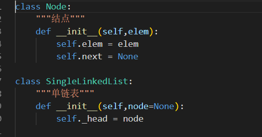

也是用两个类，分别一个构造方法解决的事情，单链表这儿的构造方法给出的是一个哨兵。

哨兵的作用不可言喻，用来承载一个链表，即使是链表为空，也是self.__head -> None

这样的空链表还是可以进一步操作，而不是元素没了，这个链表也直接没了。

&nbsp;

链表的精华还是在于怎么实现插入或者删除的操作，毕竟它们只需要O(1)的时间复杂度。

初始状态是这样的，有个链表结点，等到插入：

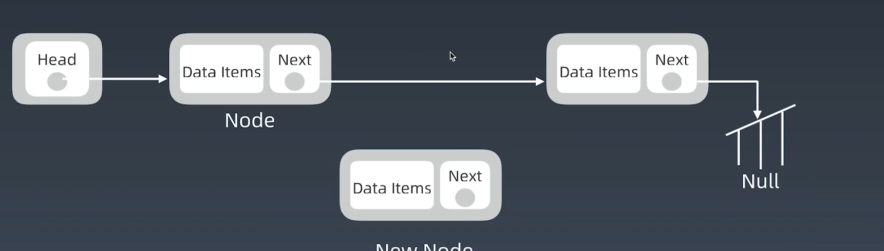

然后我想插入到中间，效果是怎么样的呢？

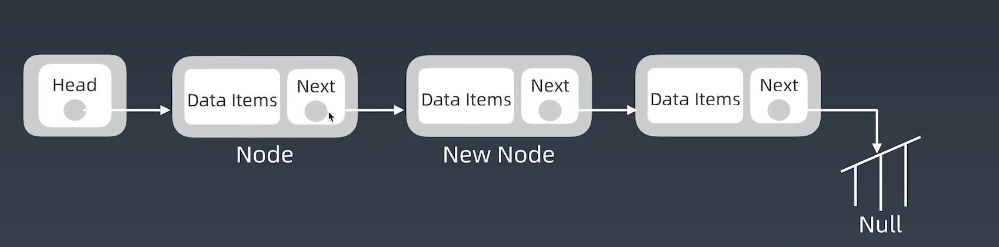

这样的代码编写不难吧？就是先把新结点的next指向于后结点，然后再把前结点的next指向于新结点。

注意，这个顺序不能乱，必须要先后再前，防止指针引用混乱。

&nbsp;

这样一来，你访问链表的中间元素，就复杂了，因为必须要经过指针遍历，也就是O(n)时间复杂度。

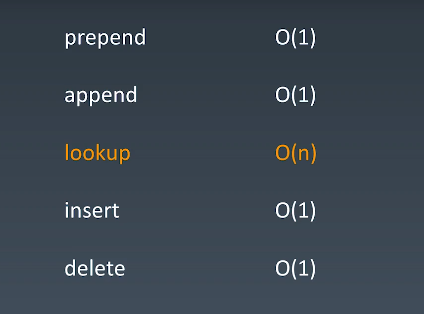

从这里可以知道，并没有完美的数据结构，我们都是根据使用场景来选择使用哪个数据结构。

查询访问使用多，就用数组；插入删除频率高，就用链表。

&nbsp;

#### 3.跳表

当然了，数组有缺陷，用链表弥补，那链表有缺陷怎么办，那就用跳表弥补。

先来说一下链表的缺陷在哪呢，就是遍历访问时间复杂度为O(n)，这个应该怎么加速呢？

加速的中心思想是什么，这个要记住，这是要贯穿整个数据结构和算法的世界的。

**中心思想就是：升维或者空间换时间。**

&nbsp;

这儿通过图解+文字的方式，来讲解一个跳表是如何实现的。

核心思想就是从一维变为多维，增加一些索引来加速遍历的过程。

索引可以起到怎么样的作用呢？我们可以基于步数为2在原始链表上设计出第一级索引：

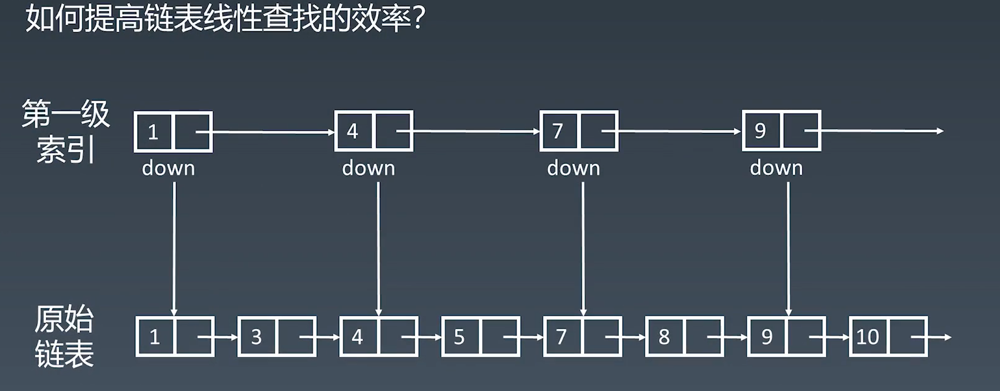

如果你要访问第8个元素，你需要在原始链表走8次才能取到，但是你如果使用第一级索引，你可以只需要走两步到达7索引，然后再7的next来访问到8，访问速度是不是大大加快？

如果链表元素越来越多怎么办？那就多搞几层，索引都是翻倍设置的：

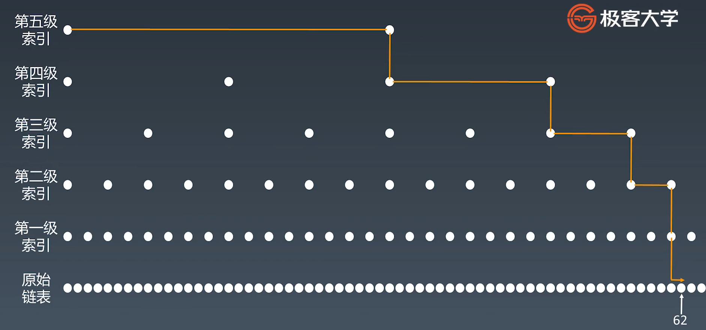

如果我要访问第62个元素，可以从第五级索引出发，一步步的下来，最后只需要6步就访问到了62。

我们可以观察到，索引都是基于前一层的1/2来进行设计的，所以我们第一时间可以分析出的结论是：

跳表的访问时间复杂度是O(logn)。

当然了，它的空间复杂度肯定比原来更多了，只不过每多一层索引，增加的空间数量收敛2倍，所以还是O(n)。

&nbsp;

但是跳表的缺陷也比较明显，现实中的跳表是这样的：

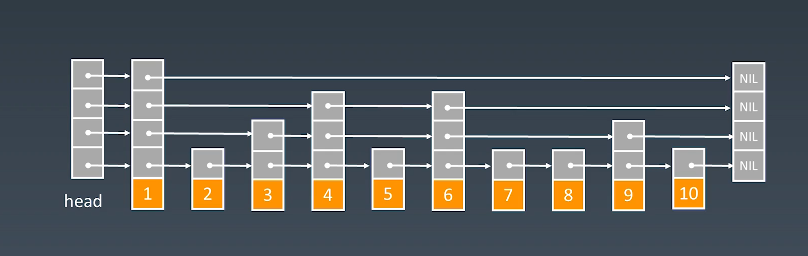

这是因为链表本身会发生增加和删除的操作，导致索引会变动，步数不再整齐，所以它的维护成本较高，需要每一次变动链表的时候，你都要更新一下索引。

但是跳表是有实际的应用的，比如Redis。

&nbsp;

#### 4.应用

一个最著名的应用就是LRU缓存淘汰策略，后面会进行一个详细的学习。

这是Leetcode原题：https://leetcode-cn.com/problems/lru-cache/

网上有太多关于LRU Cache的文章，简书和知乎都可以自行搜索。

&nbsp;

还有一个著名的应用就是Redis使用跳表，而不是使用红黑二叉树：

这儿有知乎的回答：https://www.zhihu.com/question/20202931/

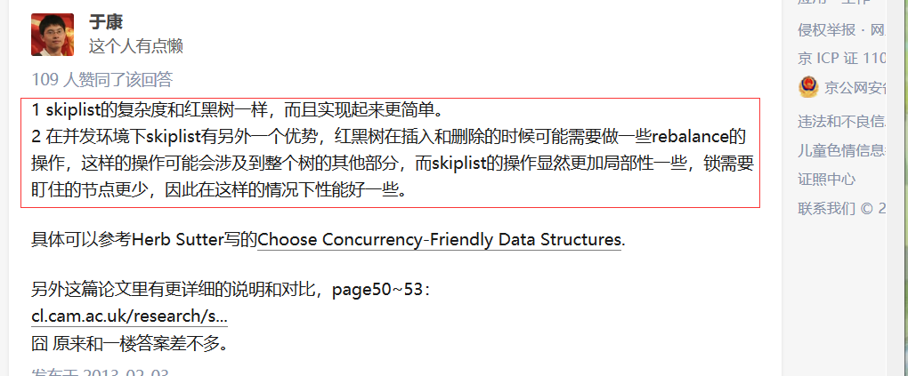

&nbsp;

## 二.实战练习

在上面中，我们讲诉了数组、链表和跳表的概念，光有概念肯定是不行的，我们需要进入实战！

&nbsp;

#### 1.实战零

这是一道关于数组的简单题目：

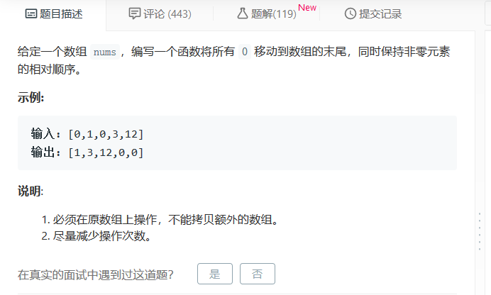

明确指出来两个要求，①其他元素保持秩序的情况下把0放到后边，②不许拷贝数组，在原数组操作。

我们先在vscode打开Leetcode插件，开始编程：

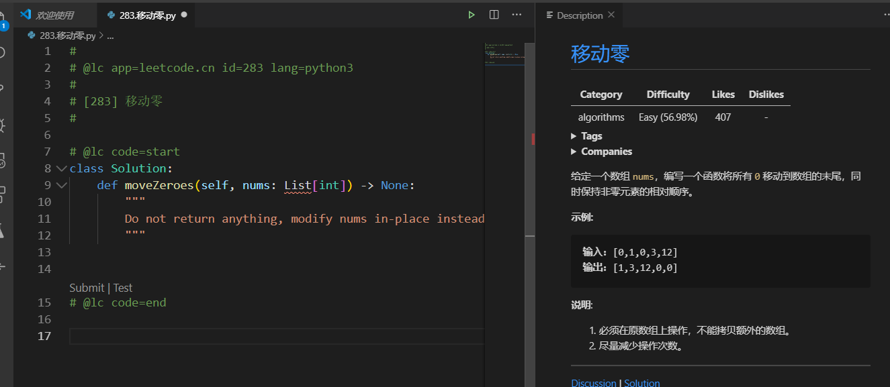

&nbsp;

##### 1）常规思路

思路比较清晰，既然它说不允许拷贝数组，首先最暴力的方法就是弹出去，再尾添0。

我们先来写一个最为常规的思路，进行交换，应该是需要一层循环的：

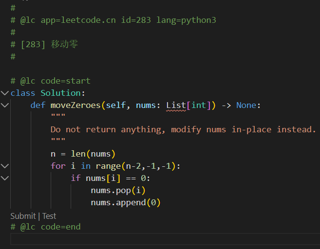

但是这个方法并不是最好的，因为我使用了pop(i)，再加上外面的for循环，这段代码的时间复杂度就是O(N²)。

##### 2）最优思路

说明还有可以进步的空间，应当优化到O(N)了，这个时候我在Leetcode国际站，看到了一个令我难忘的解法：

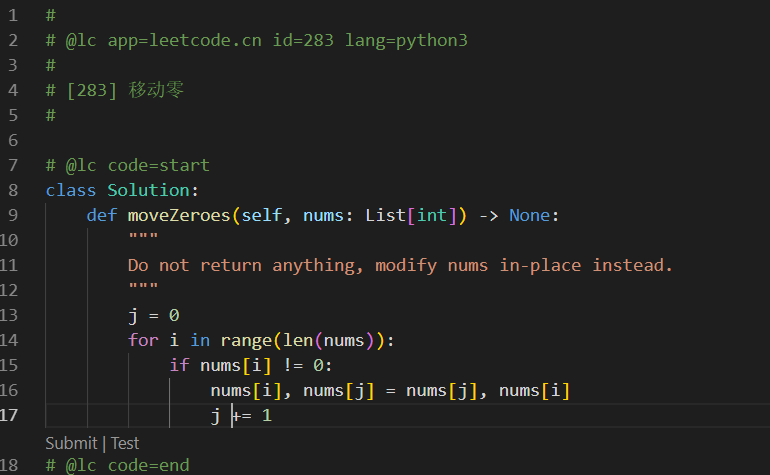

我第一时间看到这个的时候，我真的没反应过来这是什么意思，不由得赞叹这位作者的解法：

后来仔细一想，如果第一个元素就是0，这个j值肯定不变，这个时候已经锁定了`nums[0] = 0`的情况

所以当你遇到非0元素的时候，直接将前面锁定的nums[j]直接进行交换，然后j值立马加上1，继续跟踪0的位置。

也就是说，这套代码的核心思想就是，j变量永远在跟踪值为0的元素。

&nbsp;

当然了，这套解法毕竟是偷学过来的，不能说现在我已经在掌握了这套方法，起码还得刷四遍，才能说是自己学会了，我们先在Leetcode上加个注释，写上第一遍，提醒自己需要过遍数。

&nbsp;

#### 2.盛水最多的容器

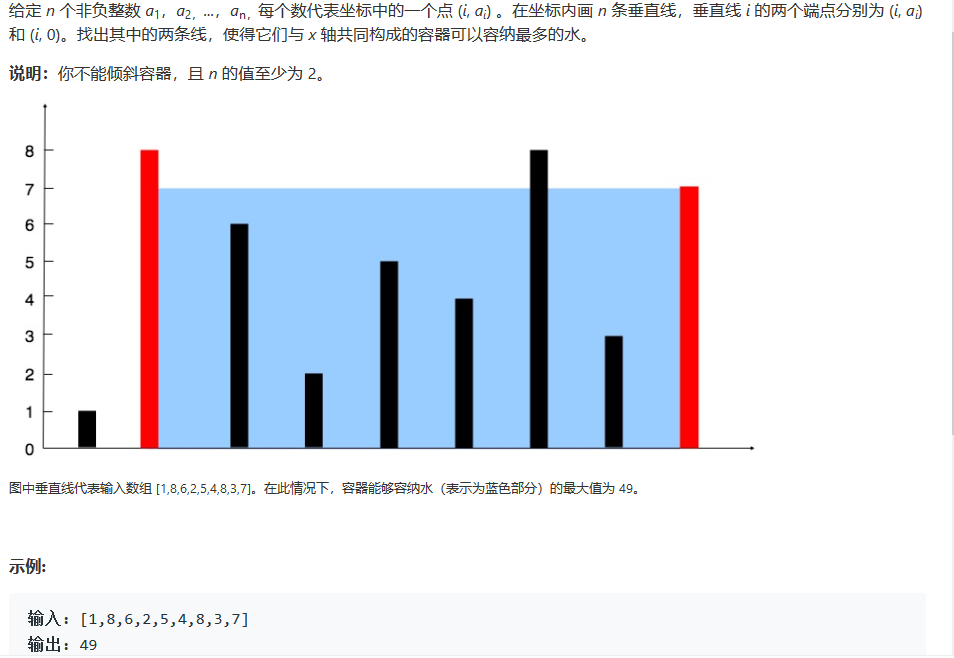

表面上题目很复杂，但你可以直接听我的解释，这道题是什么意思呢？

意思就是说，第二个柱子到最后一个柱子有7个距离，然后再乘以两个柱子中最矮的7，7x7=49

最大的盛水面积就求出来了。

&nbsp;

##### 1）常规思路

这道题给了一个信号，正确的答案并不一定是两个最高的柱子来组成，你还需要考虑到距离，标准答案可能是第二高和第三高的柱子，所以我们需要一定的计算步骤。

还是一样的，我们先用常规的办法去做题目，第一时间想到的就是枚举法，设第一个柱子索引为x，第二个柱子的索引为y，较矮的那个柱子身高为high，那么能盛水的面积不就等于(y-x)*high，然后再进行枚举比较即可。

两层暴力循环，然后每次记录最大值，return返回即可：

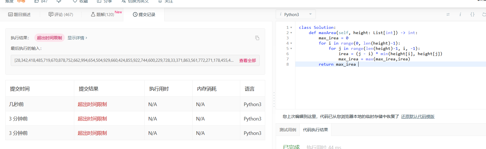

但是我们发现，Python提交会超出时间限制，这可能是语言的问题，也可能是代码的问题，为了检测出到底是谁的问题，把这段代码直接转换为JAVA代码试一试：

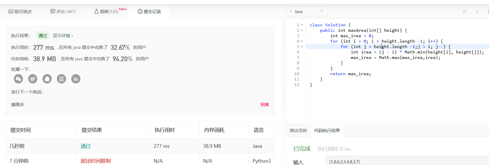

看来，真的是语言的问题……不过这没关系，只要自己知道正确的解法就饿可以了。

&nbsp;

##### 2）最优思路

优化肯定是必然的，我们通过暴力枚举法，发现性能如此之差，虽然在Java的提交中，我的内存使用击败了94.20%的用户，但这个是远远不够的，这道题应该怎么优化呢？

还记得快速排序吗？

没错，我们这次的解题思路所用到的就是双指针法，一端用low指针，另一端用high指针，每次往里面收敛，直到两个指针相遇，求其中最大的面积值即可！

那么，指针应该怎么移动呢，每次求出一个面积之后，自动比较两个柱子高度，较矮的柱子那边的指针向内移动：

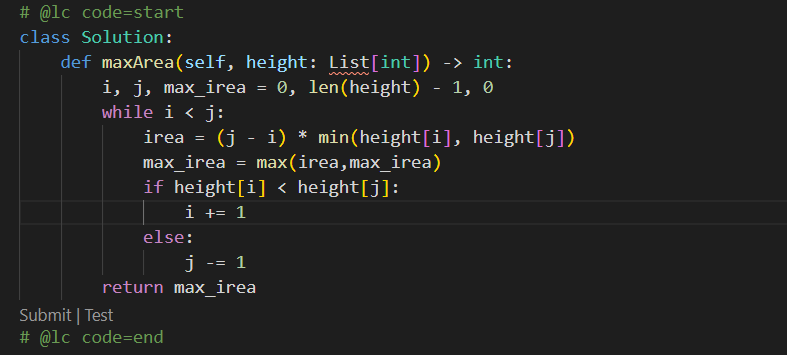

如果你还看不懂这个解法，我推荐你一个链接：

https://leetcode-cn.com/problems/container-with-most-water/solution/container-with-most-water-shuang-zhi-zhen-fa-yi-do/

进去直接看人家给出的动态图，对这个双指针法的过程有个更加直观的了解。

那么，你可以试试用JAVA的解法，可以优化到5ms，这便是编译语言的优越性，这儿不再解释。

只需要你时刻记住，这个双指针法的核心思想就是左右夹逼，我们会在后面应用到很多很多。

&nbsp;

#### 3.爬楼梯

##### 1）题目分析

爬楼梯是一个非常经典的题目，很多高阶算法题都是基于爬楼梯而进化的，这儿要用到分配的思想。

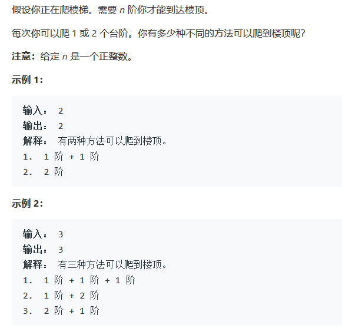

这个就是关于1阶和2阶，能组成多少个排列组合，一个非常经典的算法题。

这个时候，我们如果去想一些暴力的方法，肯定是弄不出来的，给你一个n级阶层你就傻了，所以我们需要一步步分析，把这个复杂的问题分割成简单的问题，找到那个子重复的部分。

走1级台阶：1步  -- > f(1)

走2级台阶：1步 + 1步  --> f(2) = 两个f(1)

走3级台阶：1步 + 1步 + 1步/1步 + 2步/2步 + 1步  --> f(3)  =f(1) + f(2)

……

走n级台阶：f(n) = f(n-1) + f(n-2)

根据这个规律我们可以知道，每个方法都是前两层方法的总和，所以我们这是在干嘛？

递归！斐波拉契数列！

所以，爬楼梯这道题目，其实等同于求斐波拉契数列，你看Leetcode标出来的难度，就说明了一切：

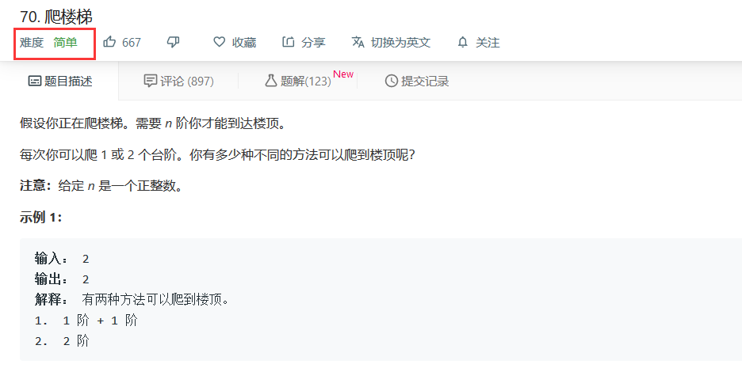

&nbsp;

##### 2）解题思路

所以我们到底要干啥？找重复单元，OK，有哪些是重复单元，不可分割的部分呢？

首先，f(1)就是一个重复单元，固定的一步步走上去的方法，f(2)呢？

f(2)就是走1步两次和走2步一次的两种走路方法，你分割的开吗？

最后的问题，就是f(3)到底算不算最小重复单元，我们把所有的走路方法都考虑到，发现f(3)也是可分割的：

f(3)：走1步三次（f(1)+f(1)+f(1)），先走1步后走2步（f(1)+f(2)），先走2步后走1步（f(2)+f(1)）

现在已经有了一个结论，爬楼梯的最小重复单元就是f(1)和f(2)，后面的都是由无数个f(1)和f(2)组成。

所以在设计代码的时候，f(1)和f(2)先安排一个固定值，再往后进行安排f(n) = f(n-1) + f(n-2)即可！

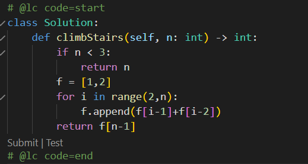

有人反馈说，看不懂爬楼梯到底是一个怎么样的模型，我在这儿讲解一下:

以5层阶梯为例，我们到底怎么计算它需要多少个方法呢？

首先，我们知道，上5层解题，要么是1步上去，要么是2步上去，这就造成了有两种方法可以上去第5层阶梯，分别是到第四层的方法和到第三层的方法。

所以答案就出来了，f(5) = f(4) + f(3)。

爬楼梯可以拆解为上n层阶层有两种方法，我们只需要求这两种方法的数量分别是多少，然后进行求和，所以最终的公式就是斐波那契数列，f(n) = f(n - 1) + f(n - 2)。

&nbsp;

#### 4.三数之和

三数之和，跟两数之和一样的江湖地位，面试常客，不过最近以来面试套路升级，已经开始转向排序、链表和动态规划了，但是并不影响我们对这道题的学习。

##### 1）两数之和

在解决这个问题之前，我们先来看看第一道Leetcode题目：两数之和：

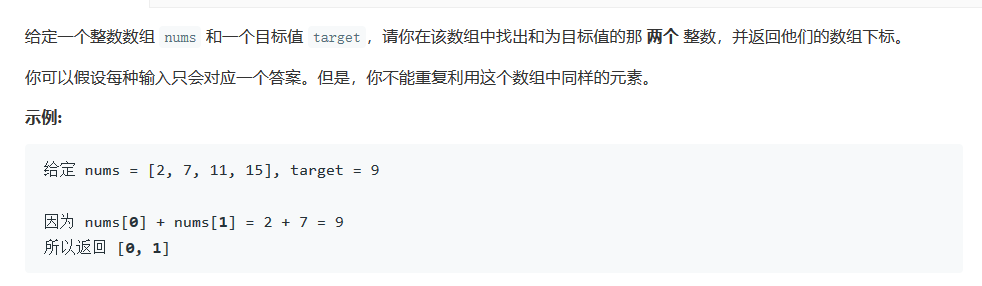

我们现在毕竟是初学者，并没有接触到后面哈希表的内容，所以我们目前还是去用两重循环的方法去解答题目：

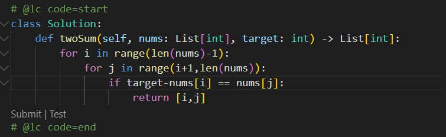

不过这个解法，因为太过于暴力，在Python中存在超出时间限制的可能性，好在这个地方还可以进一步优化。

先来看看Python中index的用法：

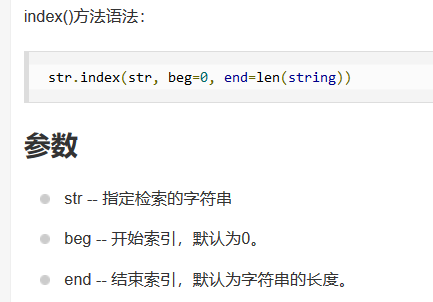

所以我们其实可以借助一个减法思想，然后index找出剩余值的索引：

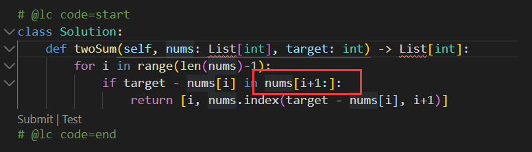

注意，我红框标出来的地方，为什么是nums[i+1：]，如果是[1,5,2,5,3]，target=10，那岂不是会返回[1,1]？

这个答案其实是错的，所以当你的i遍历到哪个位置，前面都不应当加入可以搜索的范围，以免结果出错。

那么这个解法提交到Leetcode，所需要的时间就比刚才的暴力两层循环优化了5倍不止：

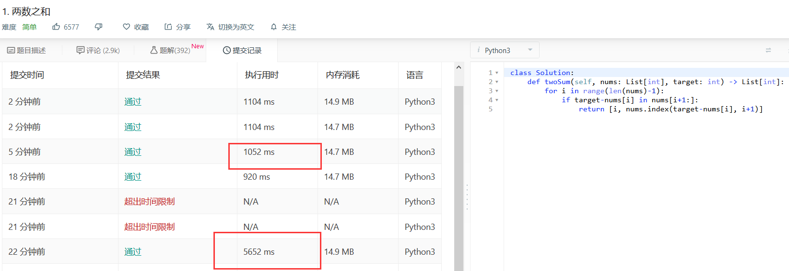

那么后续其实有个优化到100ms以内的方法，那就是哈希表，我们会在不久后进行学习。

##### 2）三数之和

搞定了这个两数之和，我们再回到三数之和本身这道题，难度肯定提升了不少档次

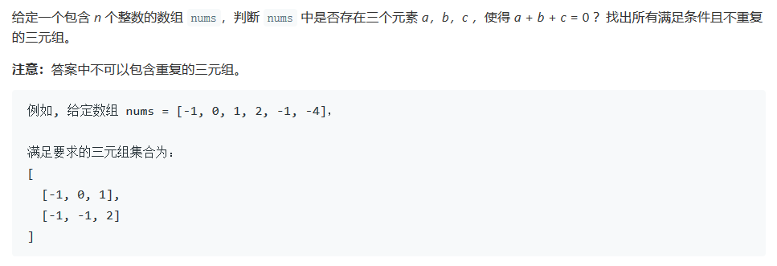

这道题，说白了就是从一个数组中找出三个不重复元素的和为0，把所有的可能性写下来。

题目说了，是否存在三个不同索引的元素，使得a + b + c = 0，所以就是转化为二维的方式：a + b = -c

根据上面两数之和的经验，-c可以转换为target，只不过这个target需要通过遍历来找到。

首先我们先用常规的暴力求解，只不过这个就要多一层循环来寻找这个target，也就是三重循环，具体的代码我就不写了(萌新先写一遍暴力循环熟悉下题目)，放到Leetcode上面也是疯狂超出时间限制，我们现在寻求的是一种高效率的算法。

首先，第一种高效率的方法就是哈希表，我们目前还没接触到，先跳过。直接来讲讲第二种方法，猜猜是什么？

当然是上面的老熟人，双指针法，也就是左右夹逼的核心思想！

https://leetcode-cn.com/problems/3sum/solution/3sumpai-xu-shuang-zhi-zhen-yi-dong-by-jyd/

可以先看看这个链接里面的动画，核心思想就是这样：

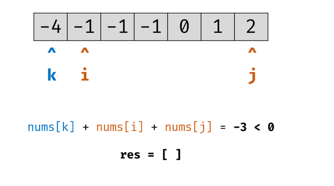

首先，开局先对目标序列进行排序，然后弄三个指针，分别为k指针，i指针和j指针，k指针指定第一个位置为-target，序列剩余的部分就由i指针和j指针进行左右夹逼。

因为是已经排好序的缘故，如果nums[i] + nums[j] > -target，说明j指针大了，j左移，反之i指针右移。

除此之外，我们还需要注意一个怎么样的情况呢？因为nums是已经排序好的序列，所以如果当nums[k]>0的时候，说明后面都是正数，不可能再发生a+b+c=0的情况了，所以直接break退出循环即可。

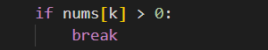

当然了，还有一个情况，也是值得注意的，为了减少双指针法的工作量，如果存在连续相同的k指针的元素值，这个过程是需要跳过的，因为k还是原来的值，你得出的答案都是重复答案，需要continue跳过：

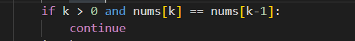

接下来就是双指针法移动的过程，简单明了，但是要注意一个细节，当你得出答案之后，如果i指针和j指针还没相遇，是要继续进行的噢，不是得到一个正确的答案就进入下一轮循环，存在一次循环找出两种答案的可能性：

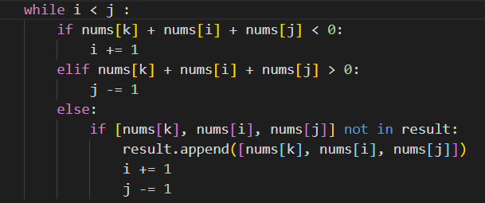

但是，我这样直接提交，毫无疑问是超出时间限制的：

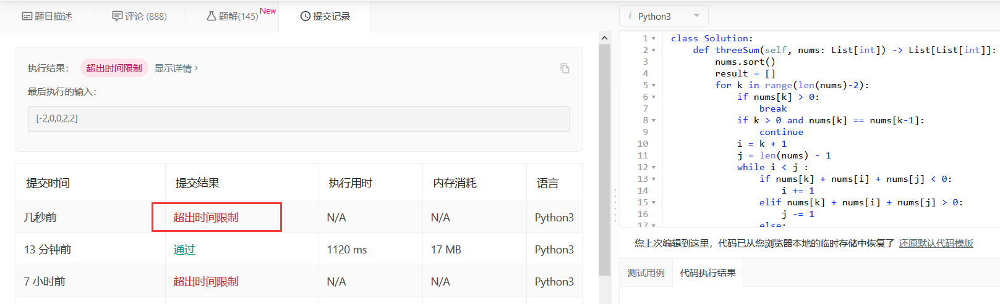

因为你还没有替程序省略掉更多的重复步骤，还是等待进一步的优化，那么应当怎么优化呢？

还记得前面k指针遇到重复元素的情况吗，我们就直接选择跳过，可是，难道i指针和j指针就不会遇到重复的情况了吗？没错，如果在左右夹逼的过程中，i指针或者j指针如果移动到重复元素的位置，是不是还是要继续移动啊？所以我们应该再加几层逻辑，来判断这几种情况，让i指针和j指针更加高效率移动：

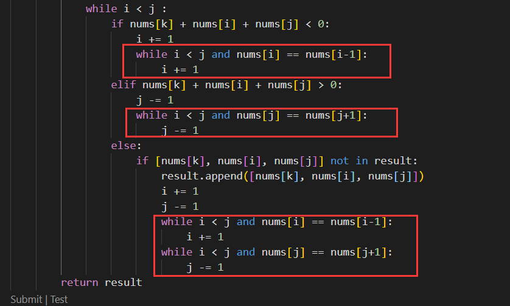

过程极其暴力，只要发生指针的移动，就立马套个while循环判断是否是重复元素来决定是否继续移动指针。

可是为啥提交的时候，还是会超出时间限制呢？我又观察了一下代码，发现有个地方已经冗余了：

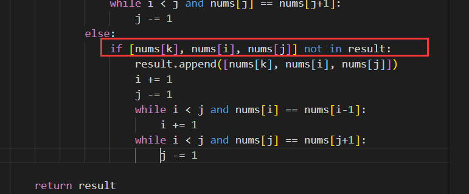

我们在下面已经采取了去重的措施，所以这条if的去重判断就多余了，相当于乘了一个O(N)时间复杂度。

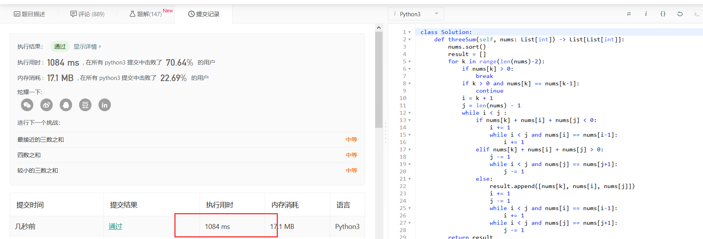

&nbsp;

#### 5.最终总结

##### 1）五道链表

由于老师只讲诉了链表题解题的套路，无非是玩转next指针和pre指针，就没有多讲。

只布置了5道最为经典的链表作业如下：

- [ https://leetcode.com/problems/reverse-linked-list/ ](https://leetcode.com/problems/reverse-linked-list/)
- [ https://leetcode.com/problems/swap-nodes-in-pairs ](https://leetcode.com/problems/swap-nodes-in-pairs)
- [ https://leetcode.com/problems/linked-list-cycle ](https://leetcode.com/problems/linked-list-cycle)
- [ https://leetcode.com/problems/linked-list-cycle-ii ](https://leetcode.com/problems/linked-list-cycle-ii)
- [ https://leetcode.com/problems/reverse-nodes-in-k-group/ ](https://leetcode.com/problems/reverse-nodes-in-k-group/)

所以等我有空的时候，我会再回头过来做做这5道经典的链表题，毕竟现阶段最重要的还是提交本周的作业，先以本周作业为主。

##### 2）本周作业

相对来说，第3课的收获非常大，主要围绕着数组，讲解了左右夹逼思想的双指针法，讲解了类似于动态规划思想的斐波那契数列解决爬楼梯。总之收获最大的毫无疑问是左右夹逼的思想，非常地经典，让我一个初学者眼前一亮！

来看看这次的课后作业，一共布置了7道数组的题目：

- [ https://leetcode-cn.com/problems/remove-duplicates-from-sorted-array/ ](https://leetcode-cn.com/problems/remove-duplicates-from-sorted-array/)
- [ https://leetcode-cn.com/problems/rotate-array/ ](https://leetcode-cn.com/problems/rotate-array/)
- [ https://leetcode-cn.com/problems/merge-two-sorted-lists/ ](https://leetcode-cn.com/problems/merge-two-sorted-lists/)
- [ https://leetcode-cn.com/problems/merge-sorted-array/ ](https://leetcode-cn.com/problems/merge-sorted-array/)
- [ https://leetcode-cn.com/problems/two-sum/ ](https://leetcode-cn.com/problems/two-sum/)
- [ https://leetcode-cn.com/problems/move-zeroes/ ](https://leetcode-cn.com/problems/move-zeroes/)
- [ https://leetcode-cn.com/problems/plus-one/ ](https://leetcode-cn.com/problems/plus-one/)

什么都别说了，一个个的，全干，就完事了！

别忘了，有时间的话，把经典的题目进行五遍刷题法即可！

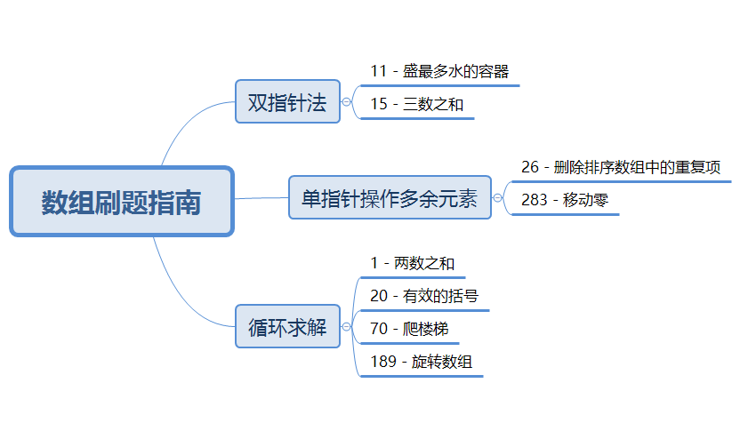

&nbsp;

## 三.栈与队列

#### 1.概念速讲

这里的话，讲解栈、队列，双端队列以及优先队列。

栈与队列已经是老生常谈了，大学里的教师也会讲，这儿就不讲太多细。

栈：Stack，先入后出，进栈出栈为O(1)，查询为O(n)

队列：Queue，先入先出，入队出队为O(1)，查询为O(n)

但是实战中，我们其实不怎么用栈与队列，一般都是双端队列用的多。

双端队列：Deque，两端都可以进出，入队出队为O(1)，且只有两端才能操作

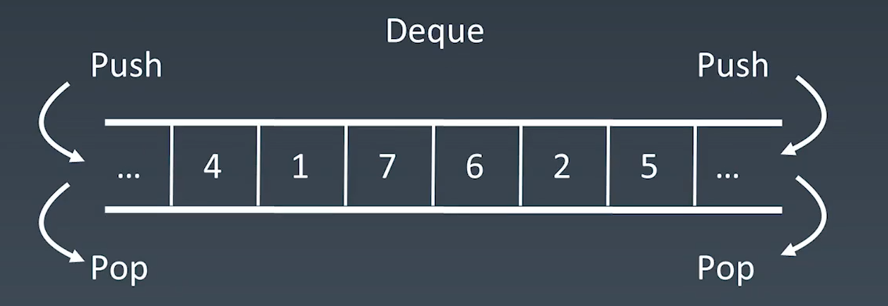

&nbsp;

##### 1）栈实现

这儿先来看看，Java实际上有已经封装好的API，上Google进行搜索即可，我们可以发现这样的信息：

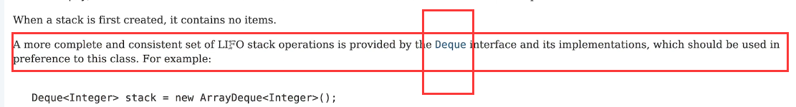

在实际工程应用中，他不推荐你使用Stack，而是使用一个更加强大的栈，也就是双端队列Duque，具有很强的灵活性，以免受到栈本身带来的限制。

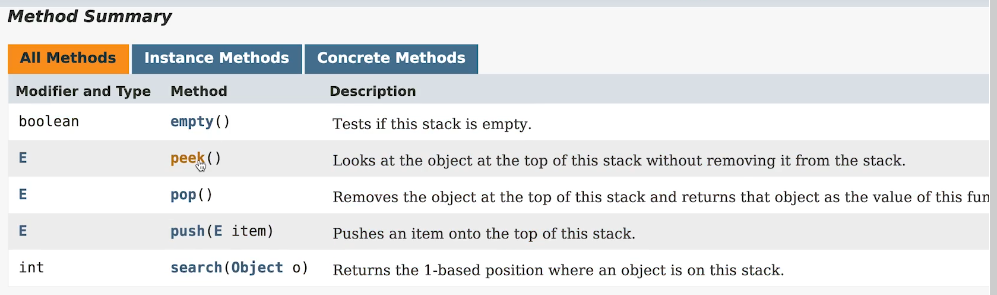

也就是5个常见的API方法，empty()是用来判空的，peek()是查询顶端元素是什么，pop()是弹出顶端元素并返回，push()是将元素入栈操作，而search()就是遍历查询操作，

如果你想用Python实现栈，百度搜索Python Stack即可。

##### 2）队列实现

如法炮制，搜索Java Queue，来看看队列如何在Java实现，我们可以看到，Queue有interface接口定义。

说明queue在Java里面只是一个接口：

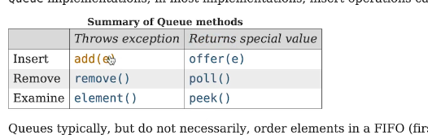

可以搜出来的是6个API，左边的API方法调用错误会跳出异常，右边的API是直接return返回null，各有各的好处。

在现实中，我们都是用offer()和poll()这两种不抛异常的方法，下面的双端队列也是这样的。

##### 3）双端队列实现

双端队列当然是我们学习的重点，毕竟工程应用的时候应用很多，在Java也是一个interface接口。

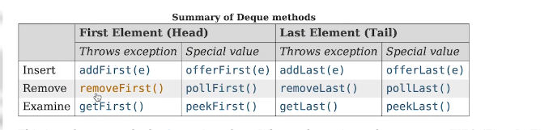

和Queue一样的是，一个端口有6个API，并分为两组，抛异常和return null。

只不过这儿比较灵活，比如removeFirst()和removeLast()的区分两端的方法细节。

这儿先来试试写一套关于Deque的测试用例：

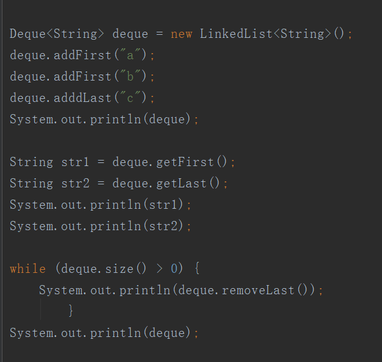

##### 4）优先队列

PriorityQueue，优先队列是面试的常客，它的特殊点在哪儿？

它的插入操作是O(1)，但是取出操作却成了O(logn)，这意味着元素存在优先级。

所以优先队列不再是单纯的先进先出结构，而是基于元素优先级程度的一种数据结构。

这个可以应用到现实中的VIP特权通道，取出最大值或最小值等等。

https://docs.oracle.com/javase/6/docs/api/java/util/PriorityQueue.html

&nbsp;

#### 2.实战训练

##### 1）有效的括号

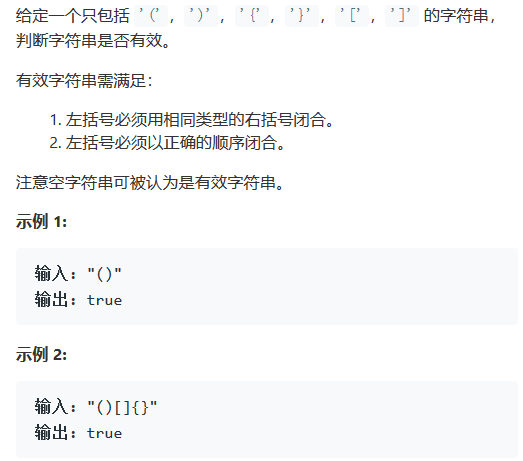

给你这么一个题目，你肯定第一时间就在想，这道题需要用栈来解决，问题是，为什么要用栈来解决呢？

因为我看这个题目跟栈的特性是最近相关性，或者是像洋葱一样，对称结构式剥开。

首先用的暴力法，不断用replace匹配括号，直到匹配出来最后的结果替换成空，你可能就会有疑问：

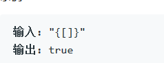

这个答案怎么办呢，其实也很简单，先把里面的[ ]给替换成空，外面的{ }不就刚好凑齐了吗，再替换成空。

那么我在这儿肯定不讲解暴力法，我们就来讲讲到底怎么用栈来解决呢？

&nbsp;

https://leetcode-cn.com/problems/valid-parentheses/solution/you-xiao-de-gua-hao-by-leetcode/

点击打开这个链接，直接看最后一个动画，这是一种最为直观的解题方式，相信你能理解：

就是从左到右依次遍历字符串，然后入栈，遇到一对就一起清除掉，非一对就入栈，如果提前遇到不匹配的，立马退出循环。我们这儿就用Python来解题，将stack设置为列表：

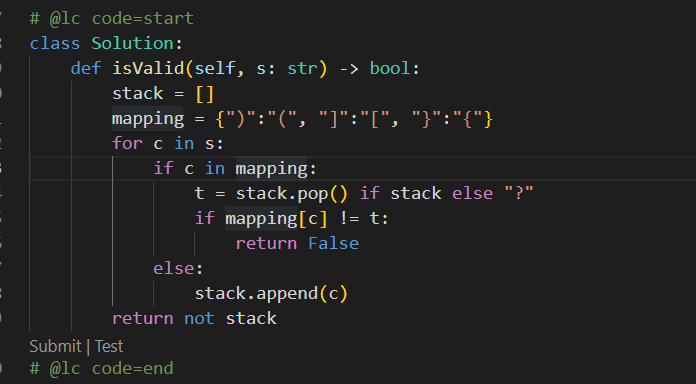

这儿巧妙地利用了三元表达式，来避免第一个字符就是右括号的情况，直接返回False，核心思想是什么，我的栈是空的，如果你的字符串符合条件，到最后我的栈还是空的，不符合条件我这儿直接返回False。

##### 2）最小栈

这道题其实很简单明了，也很简单，就是要你实现一个最小栈，只不过要注意getMin()方法：

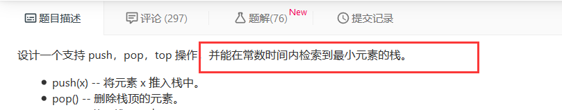

这个应该怎么设计才好呢？

&nbsp;

我们知道，栈遍历元素肯定是O(n)的，但是这个题目却要求我们使用O(1)时间查到最小元素，暗示我们将最小元素就放在顶栈，直接peek()求出来。

所以，解法就比较清晰了，这道题常规的解法就直接用两个栈去解决，其中最小栈是辅助栈，记录最小值。

https://leetcode-cn.com/problems/min-stack/solution/min-stack-fu-zhu-stackfa-by-jin407891080/

所以在每次操作的时候，我们可以使用两个栈，来满足各类需求：

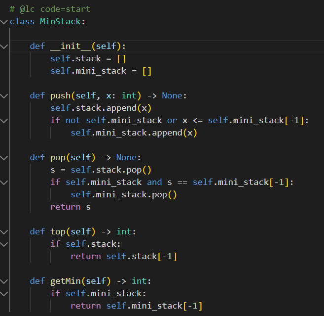

这道题目其实很简单，主要考察你的思维，能不能想到使用两个栈配合来做题。记住，以后一旦要求O(1)时间访问的，说明用非遍历的方法去解题，你也没办法整一个O(1)时间复杂度的遍历方法，哈希表现在还没学，可以想到用空间换时间的方式去解题。

&nbsp;

##### 3）柱状图中最大的矩形

接下来就来一道真正的难题，到底有多难呢，来看看以下图片：

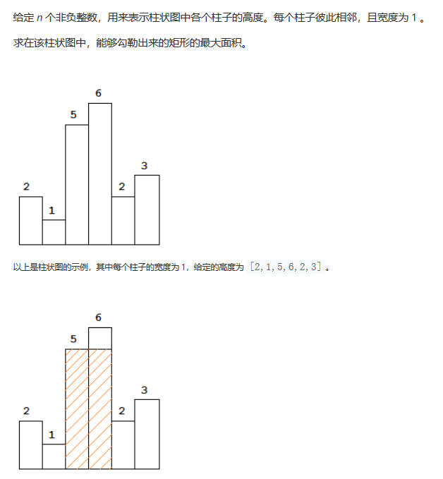

看到这个题目，你的条件反射是不是会让你想到前面做过的《盛水最多的容器》，使用双指针法来解答题目？

为什么这道题不能用双指针法呢，不能参考《盛水最多的容器》的方法来写呢？

注意审题，《盛水最多的容器》是两根相对很高的柱子之间的面积，中间是允许存在很矮的柱子的，水高度可以超过它们；而这道《柱状图中最大的矩形》就不是了，他是找能够勾勒出来矩形的最大面积，还能是两根相对很高柱子就能解决的事情吗？

所以，这个小节讲解栈的内容，那么解题肯定是用栈，在你问出为什么之前，我们先来想想暴力法是怎么解决的：

暴力法肯定是枚举法，左边界是i，范围取为(0,n-2)，右边界是j，范围取为(i+1,n-1)，然后就计算出每种(i,j)的面积，更新到max_area，最后的结果直接返回max_area即可。

&nbsp;

暴力法我就不解释了，在上面已经写过类似的程序，主要来讲解一下为什么要用栈来得到最优化的解法。

https://leetcode-cn.com/problems/largest-rectangle-in-histogram/solution/zhu-zhuang-tu-zhong-zui-da-de-ju-xing-by-leetcode/

我怕文字版你看不懂，直接打开这个链接，直接翻，看最后的O(n)时间复杂度的栈解法，先把动画给搞懂。

&nbsp;

##### 4）滑动窗口最大值

经过了上面的大脑风暴之后，我们终于搞定了柱状图中最大的矩形，用栈来解决其实是个非常巧妙的方法，多多回顾几次也许你就突然懂了其中的奥妙之处。

现在先来看看专门用队列解决的题目，就是滑动窗口的最大值。

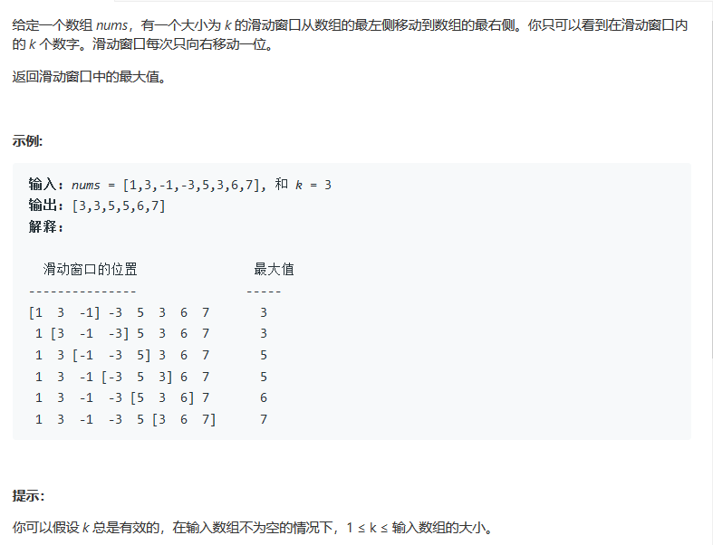

其实这个示例，就已经很通俗易懂的告诉你了整个代码的思路，每一轮循环返回一个最大值加入到数组。

首先我们不着急使用双端队列，先来使用暴力法尝试一下:

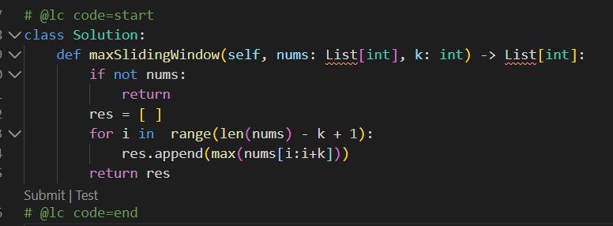

没错，就是传说的切片操作暴力法，代码通俗易懂，童叟无欺，再来看看提交后的时间复杂度：

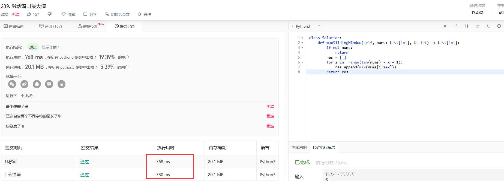

行吧，时间复杂度还是菜里菜气的，这也是双端队列出场的必要性。

&nbsp;

Python做双端队列的思路可以参考这个：

https://leetcode-cn.com/problems/sliding-window-maximum/solution/shuang-duan-dui-lie-by-shiyymoonzhu-i7c4kquwyz/

#### 3.课后作业

 [https://leetcode.com/problems/design-circular-deque ](https://leetcode.com/problems/design-circular-deque) 

 [https://leetcode.com/problems/trapping-rain-water/ ](https://leetcode.com/problems/trapping-rain-water/) 

