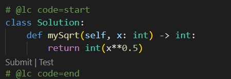
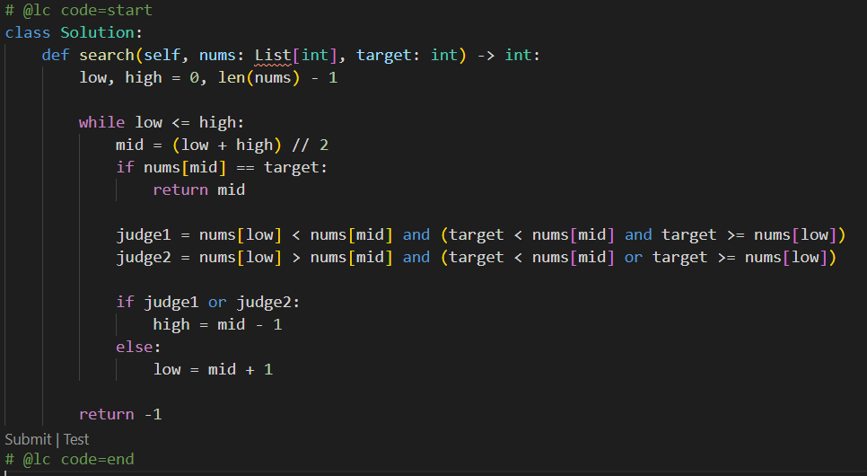

## 一.二分查找

#### 1.前提条件

- 目标函数单调性
- 存在上下界
- 能够通过索引访问

这三个前提条件到底是指什么呢？首先一定要记住这些，形成肌肉记忆：

单调性：二分查找是要建立在有序(单调递增或单调递减)的序列里面进行查找，如果是无序的就需要遍历。

上下界：二分查找肯定要数量有限的序列才适用，无限数量的序列无法进行二分查找。

索引访问：这是针对于链表、跳表这样的数据结构，无法进行二分查找。

&nbsp;

#### 2.代码模板

我们这儿使用Python来实现二分查找，这是有模板的，运用了双指针：

```python
def binarysearch(nums, target):
    """二分查找"""
    low, high = 0, len(nums) - 1

    while low <= high:
        mid = (low + high) // 2
        
        if nums[mid] > target:
            high = mid - 1
        elif nums[mid] < target:
            low = mid + 1
        else:
            return mid
    
    return None
```

这个二分查找的过程应该怎么解释呢，首先nums是有序的，大家要牢牢记住这个前提，然后我们开局先定位nums的中间元素，比目标大还是目标小，来决定摒弃前半部分或者后半部分，这样算下去，每次都会摒弃一半数组的部分，也就是对半砍的效率，时间复杂度为O(logn)。

&nbsp;

#### 3.实战讲解

##### 1）x的平方根

https://leetcode-cn.com/problems/sqrtx/


先来一道很经典的二分查找的题目，不，其实是考察和二分查找一样的思维，这儿大家要注意，这个肯定不能调用库函数了，因为你这是在实现一个函数。

首先不用二分查找法，一行代码就直接搞定了，效率自然是超越百分之99：



现在的问题是我们该如何使用二分查找去解决呢？

我们知道，8的平方是2.8左右，也就是介于2和3之间，题目要求取整，所以直接选择3，所以我们可以直接遍历去试，当试出来一个x介于y和y+1之间的时候，答案就是y：

```python
class Solution:
    def mySqrt(self, x: int) -> int:
        if x == 0 or x == 1:
            return x
        
        low, high = 0, x//2   

        while low <= high:
            mid = (low + high) // 2   
            if mid**2 > x:
                high = mid - 1
            elif mid**2 < x: 
                low = mid + 1
            else:
                return mid
        return high
```

好好思考一下，为什么这段代码返回的是high呢？我们知道，在取最终答案的时候，我们肯定会逼出这样的一个区间，但是这个区间的左边界是可以骗人的：

比如6就在于1²与3²的区间，也可以在与2²与3²的区间，所以依靠左边界的判断是很难的，不如我们就把中心转向于右边界，因为有边界永远比答案高1，所以我们循环条件可以用上low = high，就是等到右边界减去1，就是我们最终要的值。


##### 2）有效的完全平方数

https://leetcode-cn.com/problems/valid-perfect-square/

这道题同样也是精妙的二分查找的思维，这道题就非常简单了


效率也非常的惊人：


&nbsp;

##### 3）搜索旋转排序数组

是时候给二分查找加一点难度了，不然做着题目也没意思：

https://leetcode-cn.com/problems/search-in-rotated-sorted-array/


这道题你刚看上去，可能就会觉得我先排序再进行常规的二分查找不就好了吗?

首先，这个是一个半有序的数组，在中间肯定有一个分界线，使两边都有序，这个分界点其实非常好找：

下一个元素只要比上一个元素小，这两个元素中间就是分界线

这个就是O(n)来进行正确求解的方法。

&nbsp;

但是请注意，题目给了条件，时间复杂度必须是O(logn)，也就是说你只能进行二分查找的操作，不能有多余的排序动作，所以我们只能从题目的角度出发去寻找反转前的数组或者就根据已经反转好的数组来进行求解。

所以，在原来的二分查找模板代码上，条件判断肯定要变化，以前是比较mid，现在肯定要把mid和左边界同时判断，硬上二分查找的方法即可。



这到底是什么情况呢，就是只考虑目标target能出现在左边界的情况，然后用if进行判断，进行二分查找，那么else的情况不就是右边界的情况了吗？

说白了，就是if负责出现在左边界的情况，else负责出现在右边界的情况，直接进行二分查找即可。

&nbsp;

## 二.贪心算法

#### 1.概念速讲

贪心算法是一种在每一步选择中都采取在当前状态下最好或最优的选择，从而导致结果是最优的选择。

但是它与动态规划不同点就在于它会对每个子问题的解决方案都做出选择，不能回退，就相当于只考虑眼前不考虑未来的一种暴力选择方法，所以有时候并不一定能得到全局最优的选择。

而动态规划则会保存以前的运算结果，并根据以前的结果对当前进行选择，有回退功能。

---

- 贪心
  - 当下做局部的最优判断，不会回退
- 动态规划
  - 保存以前结果，能够回退，做出最有判断

---

既然，动态规划那么厉害，我们为什么要先学习贪心算法呢，贪心算法在某些应用场合是最实用的：

求图中的最小生成树，求哈夫曼编码等等，但是对于工程实际场合的话，贪心法得不到最好的期望结果。

对于一些不要求最精确结果的问题时，贪心法便是最好的选择，因为它最具有高效性，且接近于最优解。

&nbsp;

#### 2.优缺点分析

先来看看一道题目：

https://leetcode-cn.com/problems/coin-change/


我们先把题目改一下，改成coins = [20,10,5,1]，求出总和36的解，我们使用贪心算法肯定是：

36 - 20 = 16，16 - 10 = 6，6 - 5 = 1，1 - 1 = 0，看，我们刚好使用20，10，5，1找出最优解：


为什么这样做可以用贪心算法呢，因为这些硬币的面额刚好是依次成倍数，所以用贪心法能够快速求解。

所以我们发现特殊情况下，使用贪心法是成立的，但是大部分情况下却行不通了：


这道题如果用贪心法来解决的话，就会变成10，1，1，1，1，1，1，1，1的组合方法来求得：


所以这道题应该使用动态规划的方法来做，可以得到的组合就是9，9，即为最优解法。

&nbsp;

那么什么时候才使用上贪心算法呢？

①一些整数倍的特殊选择问题

②总问题能够分解成子问题来解决，子问题的最优解能递归到最终问题的最优解，也就是最优子结构

总之，记住，一些特殊情况下，直接选择贪心算法，效率是最高的。

&nbsp;

#### 3.实战题目

##### 1）分发饼干

https://leetcode-cn.com/problems/assign-cookies/


这道题一眼看过去，就是很明显的贪心算法来求解。

首先给第一个数组，代表几个小孩的胃口值，然后再给第二个数组，问你尽可能满足多少个小孩？

根据图中的示例1，两个饼干都是1，但只有1个小孩的胃口为1，所以只能满足1个小孩。

所以我们可以将两个数组进行升序排列，然后依次进行匹配，然后返回个数就行了：


&nbsp;

##### 2）最佳买卖股票的时机 ii

https://leetcode-cn.com/problems/best-time-to-buy-and-sell-stock-ii/


这道题非常容易，一看就是贪心算法，只需要针对于连续两天的差值是否小于0，从而开始买卖时机：


逆向思维解决即可，反向差值大于0就代表能卖钱，累加进去即可。

&nbsp;

##### 3）跳跃游戏

https://leetcode-cn.com/problems/jump-game/


这个的难度就直接上来了噢。示例一已经说了，第一步可以最多跳两次，但是我们只选择跳1次，然后走到3的位置，直接跳到终点，其实用暴力法就是2，1，1，1也能到终点。

再来看看示例2，第一个就是最多能跳三步，但是你发现你无论怎么跳，都会跳到0，所以无法到终点。

这个就有点意思了，我们将会使用真正的贪心算法来求解这道题目。

&nbsp;

我们知道，可以设置一个图腾，然后记录每一个节点能到达的最远距离。一旦我们索引的值大于节点能到达的最远距离，直接返回False，如果能到达的最远节点的值已经超过了列表长度，直接返回True。

这就是贪心算法的解题方法，一步一步记录，一步一步计较，直到得出最终目标值：


这是我初步写出来的代码，你也看出来了，其实代码很难看，或许我们应该优化成while循环的方式：


最后为啥是return False or i == res呢，要注意，这是针对于只有1个元素的数组，是无法执行代码的，但是这1个元素就是终点，所以算有效。


