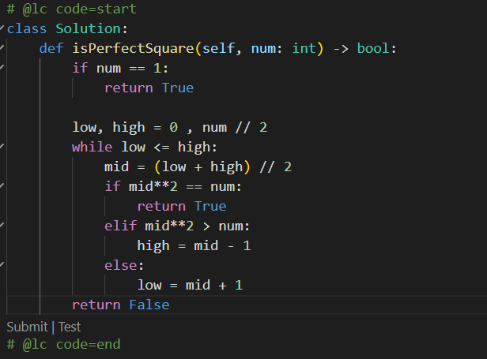
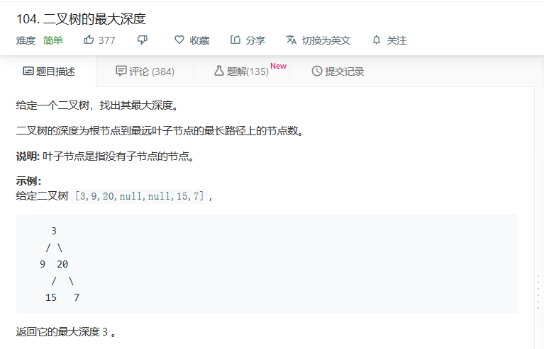

## 一.二分查找

#### 1.前提条件

- 目标函数单调性
- 存在上下界
- 能够通过索引访问

这三个前提条件到底是指什么呢？首先一定要记住这些，形成肌肉记忆：

单调性：二分查找是要建立在有序(单调递增或单调递减)的序列里面进行查找，如果是无序的就需要遍历。

上下界：二分查找肯定要数量有限的序列才适用，无限数量的序列无法进行二分查找。

索引访问：这是针对于链表、跳表这样的数据结构，无法进行二分查找。

&nbsp;

#### 2.代码模板

我们这儿使用Python来实现二分查找，这是有模板的，运用了双指针：

```python
def binarysearch(nums, target):
    """二分查找"""
    low, high = 0, len(nums) - 1

    while low <= high:
        mid = (low + high) // 2
        
        if nums[mid] > target:
            high = mid - 1
        elif nums[mid] < target:
            low = mid + 1
        else:
            return mid
    
    return None
```

这个二分查找的过程应该怎么解释呢，首先nums是有序的，大家要牢牢记住这个前提，然后我们开局先定位nums的中间元素，比目标大还是目标小，来决定摒弃前半部分或者后半部分，这样算下去，每次都会摒弃一半数组的部分，也就是对半砍的效率，时间复杂度为O(logn)。

&nbsp;

#### 3.实战讲解

##### 1）x的平方根

https://leetcode-cn.com/problems/sqrtx/


先来一道很经典的二分查找的题目，不，其实是考察和二分查找一样的思维，这儿大家要注意，这个肯定不能调用库函数了，因为你这是在实现一个函数。

首先不用二分查找法，一行代码就直接搞定了，效率自然是超越百分之99：


现在的问题是我们该如何使用二分查找去解决呢？

我们知道，8的平方是2.8左右，也就是介于2和3之间，题目要求取整，所以直接选择3，所以我们可以直接遍历去试，当试出来一个x介于y和y+1之间的时候，答案就是y：

```python
class Solution:
    def mySqrt(self, x: int) -> int:
        if x == 0 or x == 1:
            return x
        
        low, high = 0, x//2   

        while low <= high:
            mid = (low + high) // 2   
            if mid**2 > x:
                high = mid - 1
            elif mid**2 < x: 
                low = mid + 1
            else:
                return mid
        return high
```

好好思考一下，为什么这段代码返回的是high呢？我们知道，在取最终答案的时候，我们肯定会逼出这样的一个区间，但是这个区间的左边界是可以骗人的：

比如6就在于1²与3²的区间，也可以在与2²与3²的区间，所以依靠左边界的判断是很难的，不如我们就把中心转向于右边界，因为有边界永远比答案高1，所以我们循环条件可以用上low = high，就是等到右边界减去1，就是我们最终要的值。


##### 2）有效的完全平方数

https://leetcode-cn.com/problems/valid-perfect-square/

这道题同样也是精妙的二分查找的思维，这道题就非常简单了



效率也非常的惊人：


&nbsp;

##### 3）搜索旋转排序数组

是时候给二分查找加一点难度了，不然做着题目也没意思：

https://leetcode-cn.com/problems/search-in-rotated-sorted-array/


这道题你刚看上去，可能就会觉得我先排序再进行常规的二分查找不就好了吗?

首先，这个是一个半有序的数组，在中间肯定有一个分界线，使两边都有序，这个分界点其实非常好找：

下一个元素只要比上一个元素小，这两个元素中间就是分界线

这个就是O(n)来进行正确求解的方法。

&nbsp;

但是请注意，题目给了条件，时间复杂度必须是O(logn)，也就是说你只能进行二分查找的操作，不能有多余的排序动作，所以我们只能从题目的角度出发去寻找反转前的数组或者就根据已经反转好的数组来进行求解。

所以，在原来的二分查找模板代码上，条件判断肯定要变化，以前是比较mid，现在肯定要把mid和左边界同时判断，硬上二分查找的方法即可。


这到底是什么情况呢，就是只考虑目标target能出现在左边界的情况，然后用if进行判断，进行二分查找，那么else的情况不就是右边界的情况了吗？

说白了，就是if负责出现在左边界的情况，else负责出现在右边界的情况，直接进行二分查找即可。

&nbsp;

## 二.贪心算法

#### 1.概念速讲

贪心算法是一种在每一步选择中都采取在当前状态下最好或最优的选择，从而导致结果是最优的选择。

但是它与动态规划不同点就在于它会对每个子问题的解决方案都做出选择，不能回退，就相当于只考虑眼前不考虑未来的一种暴力选择方法，所以有时候并不一定能得到全局最优的选择。

而动态规划则会保存以前的运算结果，并根据以前的结果对当前进行选择，有回退功能。

---

- 贪心
  - 当下做局部的最优判断，不会回退
- 动态规划
  - 保存以前结果，能够回退，做出最有判断

---

既然，动态规划那么厉害，我们为什么要先学习贪心算法呢，贪心算法在某些应用场合是最实用的：

求图中的最小生成树，求哈夫曼编码等等，但是对于工程实际场合的话，贪心法得不到最好的期望结果。

对于一些不要求最精确结果的问题时，贪心法便是最好的选择，因为它最具有高效性，且接近于最优解。

&nbsp;

#### 2.优缺点分析

先来看看一道题目：

https://leetcode-cn.com/problems/coin-change/


我们先把题目改一下，改成coins = [20,10,5,1]，求出总和36的解，我们使用贪心算法肯定是：

36 - 20 = 16，16 - 10 = 6，6 - 5 = 1，1 - 1 = 0，看，我们刚好使用20，10，5，1找出最优解：


为什么这样做可以用贪心算法呢，因为这些硬币的面额刚好是依次成倍数，所以用贪心法能够快速求解。

所以我们发现特殊情况下，使用贪心法是成立的，但是大部分情况下却行不通了：


这道题如果用贪心法来解决的话，就会变成10，1，1，1，1，1，1，1，1的组合方法来求得：


所以这道题应该使用动态规划的方法来做，可以得到的组合就是9，9，即为最优解法。

&nbsp;

那么什么时候才使用上贪心算法呢？

①一些整数倍的特殊选择问题

②总问题能够分解成子问题来解决，子问题的最优解能递归到最终问题的最优解，也就是最优子结构

总之，记住，一些特殊情况下，直接选择贪心算法，效率是最高的。

&nbsp;

#### 3.实战题目

##### 1）分发饼干

https://leetcode-cn.com/problems/assign-cookies/


这道题一眼看过去，就是很明显的贪心算法来求解。

首先给第一个数组，代表几个小孩的胃口值，然后再给第二个数组，问你尽可能满足多少个小孩？

根据图中的示例1，两个饼干都是1，但只有1个小孩的胃口为1，所以只能满足1个小孩。

所以我们可以将两个数组进行升序排列，然后依次进行匹配，然后返回个数就行了：


&nbsp;

##### 2）最佳买卖股票的时机 ii

https://leetcode-cn.com/problems/best-time-to-buy-and-sell-stock-ii/


这道题非常容易，一看就是贪心算法，只需要针对于连续两天的差值是否小于0，从而开始买卖时机：


逆向思维解决即可，反向差值大于0就代表能卖钱，累加进去即可。

&nbsp;

##### 3）跳跃游戏

https://leetcode-cn.com/problems/jump-game/


这个的难度就直接上来了噢。示例一已经说了，第一步可以最多跳两次，但是我们只选择跳1次，然后走到3的位置，直接跳到终点，其实用暴力法就是2，1，1，1也能到终点。

再来看看示例2，第一个就是最多能跳三步，但是你发现你无论怎么跳，都会跳到0，所以无法到终点。

这个就有点意思了，我们将会使用真正的贪心算法来求解这道题目。

&nbsp;

我们知道，可以设置一个图腾，然后记录每一个节点能到达的最远距离。一旦我们索引的值大于节点能到达的最远距离，直接返回False，如果能到达的最远节点的值已经超过了列表长度，直接返回True。

这就是贪心算法的解题方法，一步一步记录，一步一步计较，直到得出最终目标值：


这是我初步写出来的代码，你也看出来了，其实代码很难看，或许我们应该优化成while循环的方式：


最后为啥是return False or i == res呢，要注意，这是针对于只有1个元素的数组，是无法执行代码的，但是这1个元素就是终点，所以算有效。

&nbsp;

## 三.树的学习

#### 1.树的概念

这些树状的东西都是树，这个怎么实现呢，就是基于链表完成的。


从图来看，我们有以下的结论：

- 每个节点有零个或者多个子节点
- 没有父节点的节点称为根节点
- 每一个非根节点有且只有一个父节点
- 除了根节点，每个子节点可以分为多个不相交的子树

&nbsp;

由此看来，树的概念是不难理解的，还有叫做兄弟节点的概念，就是图中的B和C。

来自于同一个双亲节点的两个节点互称为兄弟节点。

还有儿子节点，B和C是A的儿子节点，这些概念都好理解。

#### 2.树的术语


1）先来讲讲什么是节点的度：一个节点含有的子树的个数。

比如B节点的度就是3，因为有D,E,F三个子树。

2）再来看看树的度：最大的节点度，就是树的度。

所以这颗树的度，很明显B为最大节点度3，所以树的度为3。

3）叶子节点或者终端节点，很明显，就是没有节点的节点。

这棵树的K,J,L,O,P都是叶子节点。

4）树的深度(高度)：顾名思义，就是节点的最大层数

这棵树的深度为5，最长的一条节点路线

5）堂兄弟节点，说白了就是同一个爷爷，不同的双亲

这棵树的D和G就是堂兄弟节点，但是D和E是兄弟结点

6）节点的祖先，这儿存在误区，祖先并不是1个，而是所有的上层节点

比如J的祖先就有E,B,A三个。


&nbsp;

#### 3.树的种类

种类是个非常重要的概念，我们需要记忆下来。

首先你要知道的是，树直接分为无序树和有序树，我们知道，最原始的树肯定是无序树，节点的顺序随便放，并没有先后关系，这样的树我们无需过多关注。

我们只需要全力学习有序树：

 树中任意节点的子节点之间有顺序关系，这种树称为有序树； 

- 二叉树
- 霍夫曼树
- B树

我们只需要研究一下二叉树：

##### 1）二叉树

二叉树，顾名思义，就是每个节点只能最多2个节点，所以上面给出的样例都不是二叉树。

先来讲一讲什么是完全二叉树，除开最后一个节点层，上面的节点都是满的状态：


这个就是完全二叉树，不看最后一个节点层。

再来看看满二叉树，这个更好理解，就是所有节点层都是满的：


&nbsp;

平衡二叉树就比较复杂了，我先给出一个概念：

 当且仅当任何节点的两棵子树的高度差不大于1的二叉树；   

初始一看，这个概念好复杂，其实就从一个局部来看，就从B来说：


如果把这部分给去掉，那么B的左儿子树高度为2，右儿子树高度为0，这下就直接相差2了，不再平衡。

如果是只去掉J节点呢？这个就直接变成了平衡二叉树了：


如果是哪个节点的高度，比如A的两颗子树，B和C都只相差1，毫无疑问是平衡的。

&nbsp;

再往后走，就是排序二叉树的概念，这个就是一个抽象的概念了。

凡是比根节点小的都在左边子树，凡是比根节点大的都在右边子树，同理可得，对于所有的节点来说，根节点的规律都适用。


注意，这个规律对于每个节点都适用，单独拿出来一个节点都可以当作根节点，左边放小的，右边放大的。

在后面的学习当中，我们将会以高频率来接触这个排序二叉树的学习。

##### 2）二叉树总结

- 完全二叉树
  - 除了最后一个节点层，上面节点层数量是满的
- 满二叉树
  - 所有节点层数量是满的
- 平衡二叉树
  - 任意节点的两个子树深度差不超过1
- 排序二叉树
  - 对于任意个节点(包括根节点)，都是小的放左边子树，大的放右边子树

&nbsp;

#### 4.树的存储

可以用数组来存储树:


像这种满二叉树，数组存储就是[A,B,C,D,E,F,G]，以横排的方式来存储。

但是在现实应用中，我们都是用链表存储的方式来表示树，这样树就方便多了。一个节点设置两个next对象就可以了，在Python中通过引用来表现。


#### 5.树的应用

你们弄过前端吗，弄过爬虫吗，不可避免地接触到xml的解析器，就是用树来完成。

试想，把前端的那些标签，从html根节点到head节点与body节点，就是以树的形式展开，所以我们爬虫定位元素的时候，速度会非常快。

还有路由协议，各种拔号上网，mysql数据库的索引，能够应对百万级数据量等等。

更典型的就是经典的AI算法，都是树搜索，非常非常多：


&nbsp;

## 四.冲击二叉树

#### 1.基本概念

 二叉树是每个节点最多有两个子树的树结构。通常子树被称作左子树或者右子树。

二叉树本身是具备很多性质的，大家只需要稍微了解一下即可:


自己画一个二叉树，然后自己一个个对照性质，即可。

&nbsp;

#### 2.如何添加

首先树的结点，非常简单，写过链表的应该都轻轻松松搞定：


接下来，我们就要自己去尝试实现二叉树了。

&nbsp;

在实现二叉树之前，我们要考虑清楚，添加结点的时候我们该如何添加，也就是说，我们要考虑清楚二叉树的遍历顺序：


比如这图，我该怎么添加K结点到E的右孩子处呢？跟链表一样的是，我们必须遍历到要添加的位置，这就是我们要说的广度优先遍历，也就是我们说的层次遍历方式，一层层的遍历到最后，然后进行添加。

先从A根节点出发，依次检查左孩子和右孩子B和C，检查到之后再检查B的两个儿子结点，按此规律进行下去：

A -> B -> C ->D -> E……

这样看来，队列是不是就特别适合用来存储树的结点？

&nbsp;

首先检查A结点，queue = [A]，OK，检查完毕，开始检查A的左孩子，直接弹出去变成[ ]

然后加入左孩子，右孩子，变成[B, C]，这个时候第二层也满了，开始检查第一个元素B的左孩子，弹出去变成[C]

再加入B的左右孩子D,E，变成[C,D,E]，然后第三层也满了，再检查第一个元素C的左孩子，并把C弹出去变成[D,E]

以此类推，就是通过队列的特性，检查首元素的左孩子右孩子，并把首元素弹出去的特性，来完成广度优先遍历。

&nbsp;

#### 3.实现添加

如果你能够理解上面使用队列实现树的广度优先遍历过程：


我这个代码实现过程能够理解吧？

首先从queue = [ self.root ]的根节点出发，然后弹出去根节点，开始判断左孩子，存在就加入队列，继续判断右孩子，存在就继续加入队列，回到循环的开头，再弹出根节点的左孩子，进行判断。

整个过程就是我在上面所说的广度优先遍历的过程。

&nbsp;

当然了，必须考虑根节点为空的情况，所以继续润色一下函数：

```python
def add(self, elem):
    node = Node(elem)

    # 如果根节点为空，直接成为根节点
    if self.root is None:
        self.root = node
        return

    # 实现广度优先遍历
    queue = [self.root]
    while queue:
        cur = queue.pop(0)

        # 判断节点的左孩子
        if cur.lchild is None:
            cur.lchild = node
            return
        else:
            queue.append(cur.lchild)

        # 判断节点的右孩子
        if cur.rchild is None:
            cur.rchild = node
            return
        else:
            queue.append(cur.rchild)
```

&nbsp;

#### 4.广度遍历

在上面，我们成功完成了节点的添加，通过广度优先遍历的方法完成。

所以，已经实现了一个add方法，为什么不实现一个travel方法，纯正的遍历方法？

但是，我们知道，树会有好几种遍历方式，所以我们需要对遍历方法进行标明：


遍历是不是很简单，就是顺序打印就完事了，这就是最为简单的广度优先遍历。

&nbsp;

#### 5.深度遍历(重点)

广度优先遍历只是开胃菜，这儿的深度遍历才是真正的重点嗷~

深度遍历有三种方式，分为前序，中序和后序。

```
前序遍历：根 -> 左 -> 右
中序遍历：左 -> 根 -> 右
后序遍历：左 -> 右 -> 根
```

什么，你跟我说记不住这三条遍历的规律？

很简单，什么样的顺序，就决定根在那个顺序，左右的相对顺序不变。

比如说中序，说明根在中间，自然是左 -> 根 -> 右这样的顺序。

&nbsp;

##### （1）前序遍历


以这个示例图为例子，前序遍历应该是怎么样的顺序呢，我们知道，前序遍历是根 -> 左 -> 右。

乍眼一看，这不是跟广度遍历没区别吗，其实有很大的区别，这个遍历是相对于子树单位来说的：


也就是说，这棵树的前序遍历是0，1，3，7，8，4，9，2，5，8

**前序遍历可以视为从根出发到最左边的子树不断往右扩散的过程**：


也就是说，对于每一个子树来说，都保持着根->左->右的遍历顺序往下往右发展。


&nbsp;

##### （2）中序遍历

中序遍历是左 -> 根 - > 右，也就是说，所有的子树都要保持这样的顺序向上发展。

所以起始的节点很明显是最左下的节点开始，开始往上往右发展：


这个箭头你可能会一头雾水，那我画个圆圈，以往上往右的方式扩散:


注意观察圆圈的扩散方式，依旧保持着左 -> 根 -> 右的规律进行扩散。

所以，中序遍历的顺序应该是：7，3，8，1，9，4，0，5，2，6

不要着急，遍历你可以理解为先搞定子树的遍历顺序，再对于每个子树安排同样的遍历顺序。

&nbsp;

##### （3）后序遍历

如果你已经搞懂了前序遍历和中序遍历，那么后序遍历应该就难不倒你了。

先从子树的单位，进行后序遍历，可以得出这样的结论：


先左右进行遍历，然后再依次往上继续左右遍历，最后才到达根节点。

所以，从节点和子树的两个基本单位，都保持着相同的遍历方式，这就是我们重点学习的深度遍历。

后序遍历的顺序为：7，8，3，9，4，1，5，6，2，0

&nbsp;

##### （5）前序实现

你的第一反应肯定是懵逼的，深度的三种遍历怎么用代码实现呢？

就说中序遍历，它的起点可是最左下的那个点，这怎么开始写呢？

我们知道，深度遍历最重要的特点是什么呢？

**深度遍历方式是从子树单位到节点单位，都保持着相同的遍历顺序的一种方式。**

这种重复性的方式，我们第一时间是不是会想到递归？

&nbsp;

没错，我们就直接使用递归的方式来实现深度遍历方式。

先来看看前序遍历的实现，因为是从根节点开始的，所以非常容易：


是不是觉得很奇妙？这到底是怎么回事呢？我就在这儿给你讲一下。

首先为什么先打印node的值，这恰好符合了先走根的特点，最开始直接给你打印了，然后我们再陷入每一层递归的时候，都先给你打印左节点，直到一路打印到最左下节点的时候。

这个过程是不是就巧妙地利用打印走完了前序遍历？

然后我们传入测试用例，并拿树的根节点作为参数：


这是一颗怎么样的树呢？


很显然，如果我们使用前序遍历的代码，得出的结果是3，4，2，6，1，0：


是不是很奇妙？为什么一个递归就完成了这个过程？

很显然，不用奇怪，当我们的node进入到`self.pre_order(node.lchild)`时，会一直跌落下去，直到跌落到最左下的节点时，就会停止，然后开始打印`self.pre_order(node.rchild)`，打印完了之后没有左右孩子，会跳回到上一层，来到根节点的`self.pre_order(node.rchild)`这样的代码，继续下去。

所以，整个过程就巧妙的使用递归完成了，只不过起点的node就需要我们手动输入了。

&nbsp;

##### （7）中序实现

在上面的实现中，我们不再担心中序的起始节点是最左下角的节点问题，因为我们可以手动控制输入。

因为中序遍历是左->根->右的特性，所以打印的顺序就要进行巧妙的移动：


放到第二个打印，就很巧妙的先从根节点一路走到最左下角，然后开始打印，之后发现不能继续了，就跳到上一层的节点，打印出来，再进入这个节点的右孩子进行操作。

这个过程不就巧妙完成了左 -> 根 -> 右的特点吗？

所以，上面的那个测试用例结果自然是2，4，6，3，0，1


&nbsp;

##### （8）后序遍历

如果你已经看懂了前序遍历和中序遍历的代码，想必我们已经知道怎么进行代码实现了：


首先直接拉到最下面，左节点搞不动了就先打印，再轮到右节点，搞不动了就再打印，然后才会跳回到上一层的根节点进行打印，这个过程就巧妙还原了后序遍历的左 -> 右 -> 根的顺序。

测试用例的结果就是：2，6，4，0，1，3


&nbsp;

#### 6.练习强化

这个时候，我们需要一道练习题，来巩固深度遍历的知识：


建议立即拿出草稿纸进行运算， 我自己就先来了哈：

前序：A，B，C，D，E，F，G，H

中序：B，D，C，E，A，F，H，G

后序：D，E，C，B，H，G，F，A

快来看看是不是跟你的答案一模一样呢？

&nbsp;

问题的关键点来了，我们可以根据这些序列反向推出一棵树吗？

首先1个序列肯定反推不出来，3个序列肯定百分百反推出来。

那么最大的问题就来了，任意两个序列可以反退出来一颗树吗？

实际上，不全是，**前序和中序、中序和后序这两种组合能确定一棵二叉树**。

前序和后序并不能反推出来一棵树。

为什么不能反推，很简单，前序AB，后序BA，这样的组合有两种可能：


&nbsp;

## 五.实战题目

#### 1.二叉树的中序遍历


这个题目就非常简单了，我们在上面已经手把手实现呢。

但是，请注意，我们在上面实现的是打印节点，也就是print()完成，然而这儿需要返回列表，这说明什么？

说明我们需要把打印机制转换为追加列表机制：


我们在上面写了这样的一段代码：

```python
if root is None:
    return
```

这个可以直接转换为```if root:```就可以了，因为是追加列表机制，所以我们采取加法运算符进行。

这是一个很简单的中序遍历模板，只要背下来即可。

&nbsp;

#### 2.N叉树的前序遍历

我们从二叉树转换为N叉树，是不是一下子懵了?


我们再来看看N叉树给出的节点定义是怎么样的：


所以，不要惊慌，这儿的```self.children```应该就是节点的子节点列表，直接套上for循环就行了：


从这个代码实现，你应该明白，N叉树是没有中序遍历的，只有前序遍历和后序遍历。

&nbsp;

#### 3.二叉树的层次遍历


已经是非常基础的概念了，只不过要从上面的print()转换为append()，返回一个列表出来。

但是这儿有个很重要的难点，我该怎么分层次的加入对应的列表呢，比如[3]，[9,20]分别是两个不同层的列表，这个过程是怎么归类的呢？

我们可以巧妙利用元组的特性，每个节点和节点的层数作为一个元组用来存储：


 主要利用元组来存储当前的层数，然后判断到下一层的时候就生成新列表，还在当前层数就停留原列表。

&nbsp;

#### 4.N叉树的层次遍历

你肯定会想，天哪，二叉树的层次遍历都这么难了，N叉树更别说了吧？


其实，N叉树的难度直接下降了一个档次，因为N叉树的节点是`self.children`，所有儿子节点直接形成了一个列表，所以我们就暴力对列表for循环安排就完事了：


&nbsp;

#### 5.二叉树的最大深度

我们已经把广度优先遍历和深度优先遍历玩的团团转，不管是二叉树还是N叉树，应该都没有什么问题了。

所以现在来看看关于最大深度的问题，应该也不会很难。

要你算最大深度，一看就和遍历脱不了干系：



&nbsp;

我们知道，求最大深度肯定要建立在遍历上面，那么二叉树的遍历最快的应该是深度遍历，要用到递归。

我们并不需要再生成什么列表，也不需要打印，可以考虑为每进行一次递归就深度+1？


当遇到空结点的时候，直接返回0，避免将空结点也计算进去，然后就看谁深入的多，求出最大值即可。

&nbsp;

#### 6.N叉树的最大深度


跟上面一样规律的是，N叉树肯定要比二叉树简单很多，直接判断下一层列表是不是空列表即可：


