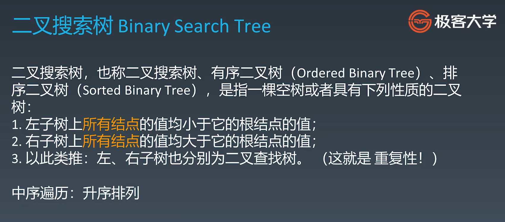
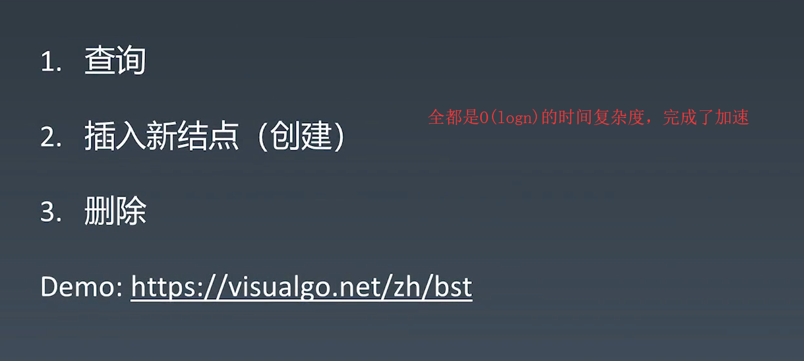

#### *哈希表你会吗？数你会吗？图你会吗？*

本篇文章分三个阶段：

①哈希表、映射、集合

②树、图、二叉树、二叉搜索树

③泛型递归、树的递归

④分治、回溯

本篇文章干货最多，耗时最长，质量最强，所以我会花大量笔墨来记录。

&nbsp;

## 一.哈希表、映射、集合

#### 1.概念速解

哈希表（Hash table），也叫散列表，是根据关键码值(key-value键值对)而直接进行访问的数据结构。

它通过K-V键值对映射到表中的一个位置来访问记录，以加快查找的速度。

这个映射函数叫做散列函数，存放记录的数组叫做散列表(哈希表)。

说了这么多，你应该条件反射地想到Python中的字典结构？

&nbsp;

如何将'lies'这个字符串存到哈希表呢？


根据图示来说，它把'lies'的每一个字符的ASCII码进行计算处理之后，再放入哈希表中，达到存储易访问的效果。

再来看看一个例子，'foes'的ASCII码计算结果与‘lies’相同，这个冲突应该怎么解决？


这个时候，可以拉出来一个链表来存储这个冲突的元素，这个时候遍历就会变成O(n)，但是哈希碰撞的概率小，所以查询的平均时间复杂度还是O(1)。

&nbsp;

但是像哈希表这样的结构，以及常见的哈希函数，都是在工程里面非常实用，所以在各种高级语言JAVA、Python中已经内在封装好了，我们可以直接访问API来进行使用。

比如Python使用哈希表的话，就是百度搜索一下，然后可以查出来的结果如下：

字典(Dict)、集合(set)、计数器(counter)、默认字典(Defaultdict)、有序字典(Order dict) 都是基于哈希实现的。

hash()就是Python内置的哈希函数，能够返回对象的哈希值。

&nbsp;

#### 2.实战题目

##### 1）有效的字母异位词

先来一道哈希表的简单实战题目：


这是什么意思呢，说白了就是所有字母出现的次数一样，不考虑位置顺序。

所以我基于Python的Dict字典暴力方法，解题如下：


非常常规暴力的方法，就是代码的重复部分太多，应该优化一下：


利用闭包内置一个函数，就好了，减少代码重复的概率！

&nbsp;

当然了，如果这道题不用哈希表，你会怎么解决？第一时间是不是想到排序，然后判断是否相等？


直接排序完全可行，但是却消耗了80ms，所以效率肯定还是比不上哈希表的方法解题。

那么到底有没有非哈希表的方法，时间效率又很快的呢，不好意思，还真有。

这是基于Python的set集合运算，提升效率特性而得出来的解法：

```python
class Solution:
    def isAnagram(self, s: str, t: str) -> bool:
        if set(s) == set(t):
            for c in s:
                return s.count(c) == t.count(c)
        else:
            return False
        return True
```


这道题其实很特殊，虽然官方题解是使用哈希表，但是由于Python的set特性，导致最优解并不是哈希表。

&nbsp;

##### 2）字母异位词分组

在上面一个比较简单的题目中，我给出了三种解法，现在我们需要继续做这道题的升级版:


我们在上面已经有了先入为主的印象，自然认为这道题还可以继续用set()方法做，事实上这样的方法再也行不通了，因为这是一个N个字符串的列表，你如果想要一个个转换成set，再互相比较，已经不再是最优解了，所以我们只能从排序和哈希表从中斡旋，寻找最佳解法。

首先我们可以采用最常规的哈希表解法：


这个方法已经非常的经典了，不调用任何库，效率还是达到了120ms。


&nbsp;

但是，我提交的方法却并不是最快的，我看到官方题解给出了一个需要调用第三方库的答案，使用了Python内置的工厂函数defaultdict，能够进一步加快效率：


所以说，Python内置的工厂函数defaultdict还是非常强大的，能够自动给键设置一个默认值为空列表，这样可以替我们省去很多条件判断从而直接进行操作。

&nbsp;

##### 3）两数之和

可能有人就会疑惑了，两数之和我们不是已经写过了吗？

我们知道，**在学习算法的路上，最大的误区是刷题只刷一遍。**

所以我们先重新做一遍两数之和，利用一层for循环+index()解决：


要知道，这个算法的效率是不行的，总共耗时1048ms，所以第一道Leetcode的最终归宿就是使用哈希表来解决，将这个出现过的元素依次加入到哈希表访问，来减少查询的频率：


我这段代码的思路非常简单，就是每遍历一个元素就加入哈希表，然后遍历下一个元素的时候，先从原有哈希表寻找是否有满足条件的即可，因为哈希表的寻找时间复杂度只有O(1)。


可以看到，使用哈希表之后，算法效率直接优化了十几倍，这就是哈希表查找O(1)的优越性。

&nbsp;

#### 3.栈的复习

在上一期的视频中，老师给出了三个栈的题目，我们有必要进行逐一的复习，并把最后一道的栈给弄明白：

- https://leetcode-cn.com/problems/min-stack/
- https://leetcode-cn.com/problems/valid-parentheses/
- https://leetcode-cn.com/problems/largest-rectangle-in-histogram/

&nbsp;

## 二.树、图、二叉树

树和图一直都很难，所以不要逃避，一定要硬着头皮上！

#### 1.树和图的概念

开始我们学习的时候数据结构分为一维和二维的结构，现在我们已经踏入了二维数据结构的学习阶段。

树应该怎么理解呢？还记得前面的链表吗？


链表就是通过指针将一连串数据串联起来，通过next存储，那么道理是一样的，如果一个结点不再只有一个next，而是有多个next，这个时候就变成一棵树了。


这个时候很多概念都出来了，基于这个树的标号，我们有如下：

A是根结点，B和C就分别为左子树和右子树，也就是说，B和C是A根结点的儿子结点。

那么换个例子来说，这个D是H和I的父亲结点，同时还是B的儿子结点。

还有兄弟结点的概念，B和C、D和E，H和I都是互为兄弟结点。

&nbsp;

树的概念很好讲通，花时间把这些概念给记录下来即可，那么现实应用中，用的最多的就是二叉树：


二叉树最显著的特点就是，每个结点只有两个儿子结点。

&nbsp;

那么，你们发现树有什么特点了吗，就是它并不会形成一个环，也就是说每个结点只连接到自己的儿子结点，要么就不连，这个就是树。

如果一个树里面出现了环形，那么这个就不再叫树，而是叫做图。


图其实就是没有环的树。树其实就是有每个节点有多个next的链表。

所以可以将链表、树和图这三个概念一起分析，他们互相都有联系。

&nbsp;

#### 2.树的遍历

一颗非常基本的树，我们应该如何选择哪种方式遍历呢，可以分为前序，中序，后序：


所以我们设置一棵树的时候，还要去设置遍历的方式，三选一，无非是基于递归去完成所有遍历。

先来一段三个遍历的示例代码，你会发现，除了固定的根结点遍历方式traverse_path()函数，其他都是递归的方式完成遍历。


所以一定不要怕递归，反而拥抱递归，善于使用它。

&nbsp;

#### 3.二叉搜索树

这儿的二叉搜索树就隆重出场了，这是一种特殊的二叉树，也是现实中应用最多的。



这个二叉搜索树能够提高了现实生活中应用便利性，查找的效率远远提升，因为我们在使用一般链表的时候，查找的时间复杂度往往是O(n)，所以二叉搜索树的优越性就出来了：

它将小于根结点的全部归于左子树，将大于根结点的全部归于右子树，这样特殊的数据结构大大提升了查找效率。所以二叉搜索树也叫有序二叉树，注意了，空树也算二叉搜索树。

&nbsp;

这个时候，我们来讲一讲二叉搜索树的各种操作的时间复杂度：



没错，在一定量的数据集之下，O(logn)不知道要比O(n)快了多少。

这儿有个demo，打开网页进行操作：https://visualgo.net/zh/bst

###### 1）查询


我如果要找到32结点的时候，这是不是意味着右子树完全无关了？所以直接砍一半，来到20这个左子树：


这个时候，你又会发现，32比20大，是不是意味着20的左儿子完全无关了？再砍一半，直接来到32：


所以这个查找过程，每次都是对半砍的查找效率，这不就是和二分查找一样的时间效率吗？

**结论：二叉搜索树的查找时间复杂是O(logn)**

&nbsp;

###### 2）插入

那么插入一个26结点怎么办呢？其实还是基于查找的过程，因为你可以将插入这个结点理解为找不到这个结点的查找过程，这个时候，查找的指针已经来到了这个32，发现没有后续操作了，直接插入到29的左儿子位置：


如果看明白了这个过程，再思考一下插入55的过程会是怎么样的?


注意，为什么55插入在50的右儿子位置，在上面的图中已经给出了概念性的答案，在二叉搜索树中，任意一个结点都是二叉搜索树，具有重复性！

如果是插入56呢？也是同样的道理：


&nbsp;

###### 3）删除

现在最关键的地方来了，如果我要删除一个结点呢？这儿分为两种情况：

①删除叶子

这个是最简单的，就直接先进行查询操作，找到这个叶子，比如32的这个叶子，直接赋值为空就完成删除


这种删除操作并不会影响整个树形的结构。

②删除结点

最关键的问题来了，假如我要删除65这个结点，删除了必然会改动这个树形的结构，我们应该怎么办呢？

首先当然是要找到65的接盘侠，呸，新的结点，才能进行删除操作。

这个找新的结点，一般都是从右子树里面挑最接近65的叶子，然后叶子原地删除并赋值到新的位置。


这个时候，72已经找到了，成为了最合适的接盘侠，接下来就是72来到65的位置，接任新的结点：


看懂这个删除操作了吗，就是说：

**当你删除结点的时候，从这个结点的右子树里面找到最接近它的，来接替它成为新的结点。**

如果你看懂了这个结论，那么我问你，删除根结点41，最终会怎么样？

当然是从72的右子树出发，然后往左走，找到了50，是最接近41的结点：


下一步应该怎么办？就是先将50的儿子结点交给72，成为72的左子树，50本身成为新的根节点：


如果你觉得删除过程，很绕，没关系，收藏好这个网站，可以成为你的辅助做题工具~~

再次强调网站地址：https://visualgo.net/zh/bst

&nbsp;

#### 4.实战题目

##### 1）代码实现

首先，我们还不能着急进入实战的题目，我们需要沉下心了，先尝试一下实现二叉搜索树的代码本身，并将它的查询，插入，删除等方法都亲自写出来，这才是正确的学习方法。

##### 2）三种遍历

当我们能够写出代码，实现二叉搜索树这样的结构时，我想再次强调一下，一定要能够区分出前序遍历，中序遍历和后序遍历的操作顺序。

##### 2）五道题目

- [ https://leetcode-cn.com/problems/binary-tree-inorder-traversal/ ](https://leetcode-cn.com/problems/binary-tree-inorder-traversal/)
- [ https://leetcode-cn.com/problems/binary-tree-preorder-traversal/ ](https://leetcode-cn.com/problems/binary-tree-preorder-traversal/)
- [ https://leetcode-cn.com/problems/n-ary-tree-postorder-traversal/ ](https://leetcode-cn.com/problems/n-ary-tree-postorder-traversal/)
- [ https://leetcode-cn.com/problems/n-ary-tree-preorder-traversal/ ](https://leetcode-cn.com/problems/n-ary-tree-preorder-traversal/description)
- [ https://leetcode-cn.com/problems/n-ary-tree-level-order-traversal/ ](https://leetcode-cn.com/problems/n-ary-tree-level-order-traversal/)

