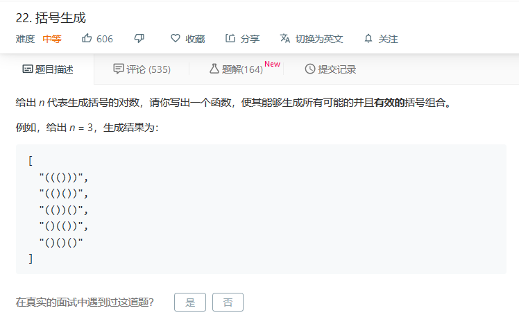

## 一.泛型递归

#### 1.概念

树的面试题解法一般都是递归。

比如排序二叉树（二叉搜索树）的特点就是左子树的值都小于根，右子树的值都大于根，且这个规律适用于所有的节点。

递归其实就是一种循环，只不过它是通过函数体来进行调用自己的循环。

#### 2.特点

- 向下进入到不同的递归层，向上回到原来的递归层；（不能跳跃）
- 通过特定的条件，返回到上一层递归层
- 每一个递归层的变量都是一份拷贝，互不干扰

#### 3.示例

这儿有一个最简单的递归示例，就是求阶乘n！

用程序来写的话就这样实现:

&nbsp;

这儿有一份递归的代码编写模板：

递归是分成三个部分的：递归终结条件 + 处理层 + 进入下一层

最重要的肯定是递归终结条件部分，不然就会造成程序的死循环，只能强行执行终端。

&nbsp;

#### 4.习惯

这儿有三个优秀的习惯，希望大家能够严格遵守：

1   -   不要人肉递归，这样不利于代码的简洁性，比如使用while制造递归。

2   -   找到最近最简的方法，将其拆解成可重复解决的问题，使用递归。

3   -   数学归纳法思维

&nbsp;

#### 5.实战

这儿就直接放两个经典的递归题目。

##### 1）爬楼梯

这道题不是写过吗？是的，你能用以前的解法再做一次吗？

还是一样的，用简单的for循环 + 列表就解决出来了：

那么，这道题应该用递归了，这是算法优化的必然途径。

&nbsp;

使用递归就很明显要转换为f(n) = f(n-1) + f(n-2)，转换为斐波那契数列来解决：

这样的解法肯定是没有问题的，但是换来的代价就是超出时间限制。

所以这儿使用了Python的lru缓存库来辅助解题，轻松过关……

&nbsp;

##### 2）括号生成

这道题好玩了，终于有了点难度。说白了，就是给你n对括号，自己排列处好几种合法的组合。

我们该怎么把这题目与递归联系在一起呢？

我们知道，n=3，就说明有6个括号单位，也就是6层递归，我们在每一层递归进行合法性操作。

&nbsp;

我们先来探讨下添加括号的规则：

- 添加左括号，随时进行，只要不超过3个
- 添加右括号时，判断左括号的个数要大于当前右括号的个数
- 添加全部完成之后，两种括号总数相等

那么代码的作用就是什么啊，把这些规则转换为代码的逻辑，进行实现：

这就是递归的巧妙之处，就让一切交给递归来解决，就是反复的进去，出来，进去，出来，符合条件的加入列表再出来，直到所有的递归层全部完成任务，这个时候所有的结果也都出来了。

&nbsp;

#### 3.验证二叉搜索树

这道题是一个难度很大的题目，不仅涉及到中序遍历，递归，二叉搜索树的特点。

首先为什么说会涉及到中序遍历，你想啊，二叉搜索树的特点是什么？

比根节点小的都在左边，比根节点大的都在右边，那么如果我按照中序遍历出来的值，是不是整个二叉搜索树所有节点的升序排列？

&nbsp;

太简单了，首先以中序遍历的方式收集所有的节点生成列表，这是第一步。

第二步就是分析这个列表，是否符合二叉搜索树的规律。

这样就很简单的搞定了，这就是递归的妙用。

&nbsp;

## 二.分治回溯

## 三.优先搜索

## 四.习题复习

## 五.动态规划

