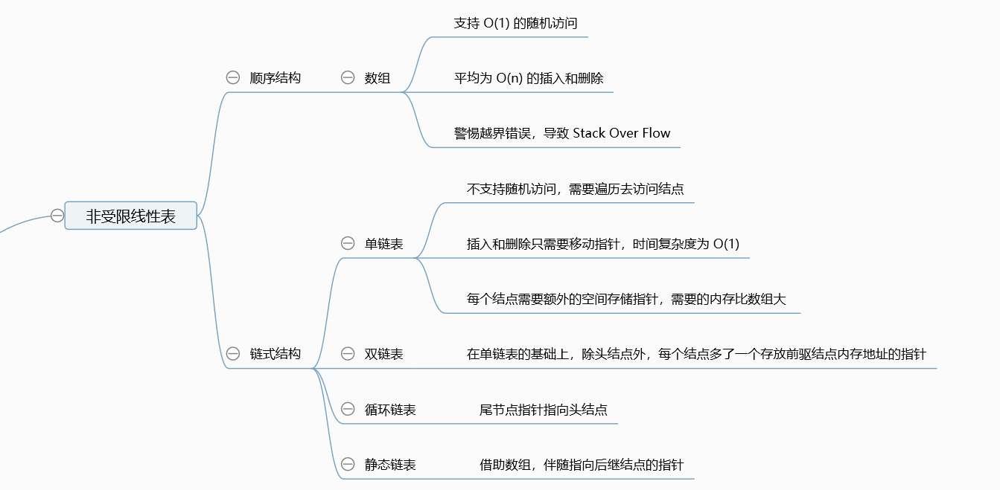
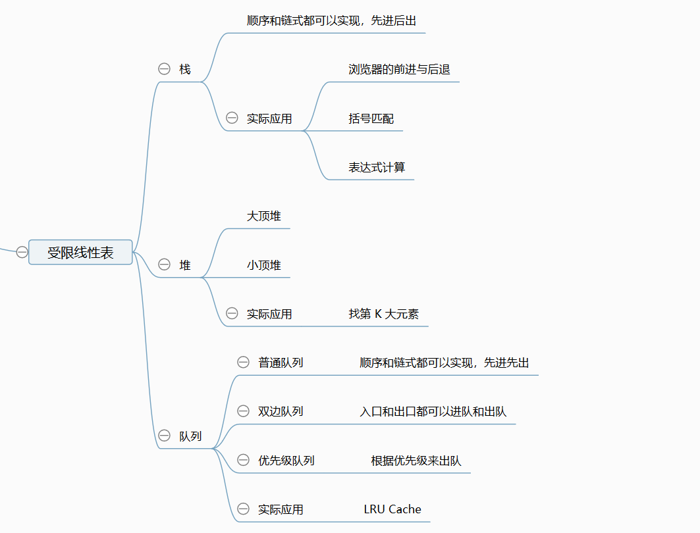
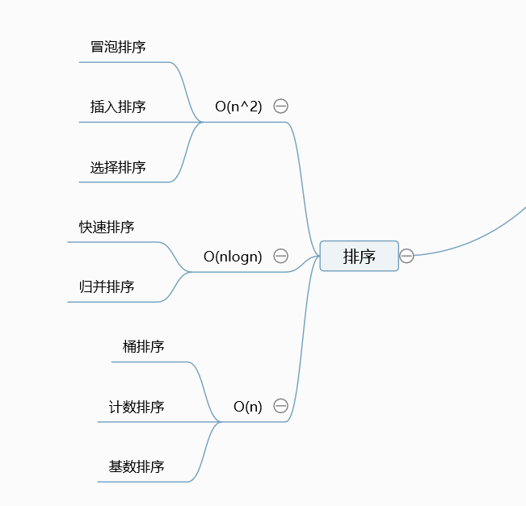
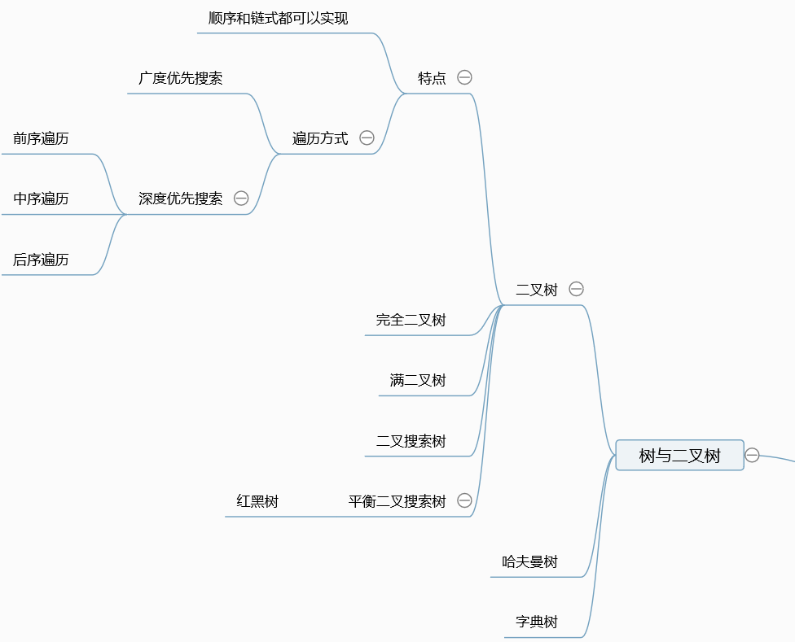
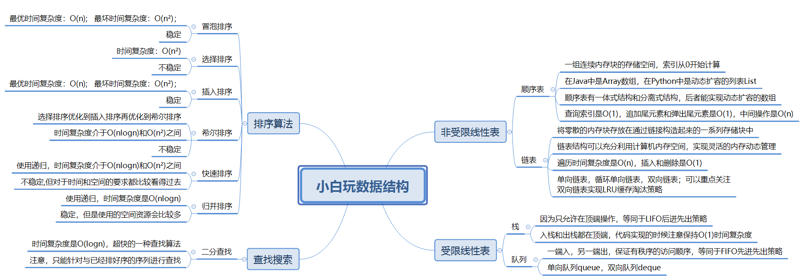

# 年少不知算法重

如果想要精通一个领域，应该怎么做？

- 切碎知识点
- 刻意练习
- 反馈

&nbsp;

切碎知识点并不代表零散，反而是形成脉络化的知识树，像一张大网联络起来。

想要变强，刻意练习就是必不可少的，比如电竞的职业水平，每天要定点训练10小时以上。

反馈呢，每个人都不是天才，都会遇到困难，强者都是无数次醍醐灌顶进行升级的。

&nbsp;

## 一.初探数据结构

#### 1.分类方式

数据结构可以有十几种的分类，每一种都不同的特点，这儿讲解一个最为简单易懂的分类。

数据结构可以分为一维数据结构，二维数据结构，特殊数据结构：

- 一维数据结构
  - 基础：array(数组)，linked list(链表)
  - 高级：stack(栈)，queue(队列)，deque(双端队列)，set(集合)，map(映射)
- 二维数据结构
  - 基础：tree(树)，graph(图)
  - 高级：binary search tree(二叉搜索树)，heap(堆)，disjoint set(并查集)
- 特殊数据结构
  - 基础：Bitwise(位运算)，BloomFilter(布隆过滤器)
  - 高级：LRU Cache(缓存淘汰策略)

&nbsp;

同样算法也可以被分成8大块，前三点直接组成了所有算法和数据结构的基石。

```
1 - if和else的条件判断

2 - for loop的循环操作

3 - 函数调用自己的递归
```

学到后面的高级数据结构，无非就是找他们的重复单元，再进行化繁为简，因为上面三点是纯碎的运算。

根据这三点基石打下来的江山，衍生出下面的五点：

```
1 - 基于Search的相关搜索算法
2 - 动态规划
3 - 二分查找
4 - 贪心算法
5 - 数学、几何
```

其中，前三种算法自然是我们必须要掌握的高阶算法，打下一个优秀程序员的基础。

&nbsp;

#### 2.刻意练习

这儿存在一个误区，比如我要去做一道题，我只做一遍，刚好没出BUG，时间和空间的使用都还可以。

然后我就不管它了，我就认为我掌握了，这其实是错误的，关键的方法还是过遍数，反复练习，不断优化。

比如我对递归和动态规划有一些避开的意思，那我就要逼自己去刷这些题目。

&nbsp;

基本功到底是怎么样形成的，大家上高中的时候，是不是就疯狂刷题，结果老是遇到重复考点的题目，我们有些人可能就会跳过，不想做重复的题目，结果上考场，不小心忘了，人就傻了。

所以真正的基本功就是通过不断的重复化训练而形成的，我们后面在Leetcode会遇到很多重复的题目，不要怕这些题目，反而我们要主动出击，这样我们会在真实的开发环境形成了习惯良好的条件反射。

&nbsp;

#### 3.绘制脑图

现在，我肯定是具有一定的基础的，这意味着我需要绘制出一份我所掌握的数据结构脑图。

先来看看老师给出的课件，是如何总计数组和链表的：



然后就是进阶的知识，队列、栈和堆：



接下来就是重头戏了，我们面试必须要掌握的排序算法，每一种都要会：



最后的树与二叉树，乃进阶工程师必备，可以解决实际的应用场景：



接下来，我也要自己做一个属于自己的数据结构脑图，把我已经掌握的知识都放进去：



&nbsp;

## 二.训练环境搭配

#### 1.编辑器

浏览器：Chrome

Mac编辑器：iTerm2 + zsh（oh my zsh）

Windows编辑器：vscode，装上Leetcode插件

网站：力扣(中文版Leetcode)，里面可以专项练习或者混合训练

Vscode我该怎么找到技巧去学会呢？

https://segmentfault.com/a/1190000017949680?utm_source=tag-newest

&nbsp;

#### 2.小操作

写代码的时候，你学会如何尝试摆脱鼠标吗？

切换上下行：方向键

行头，行尾：Home、End

切换到下一个单词：Ctrl + 方向键

删除整个单词：Ctrl + Backspace

删除整个行：Ctrl + Shift + K


