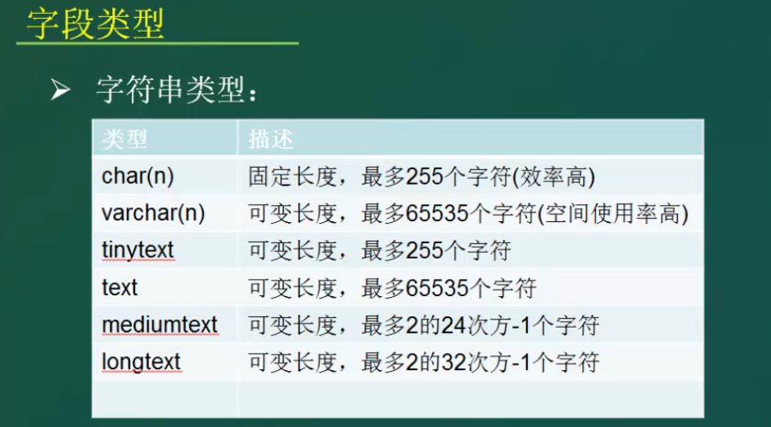
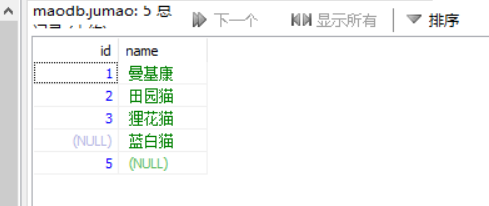
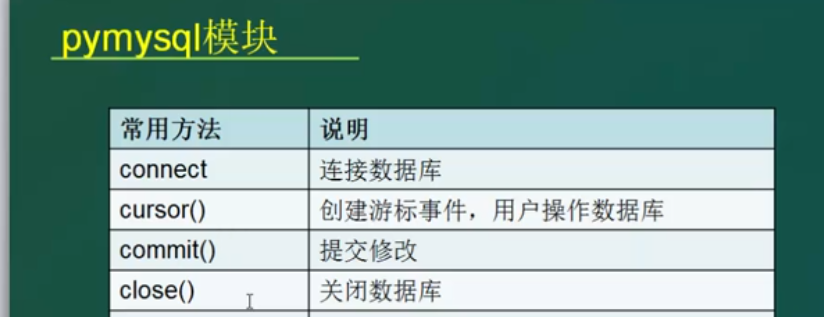
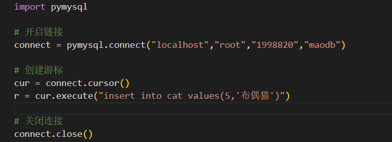

# MySQL与Pymysql

MySQL是每个后端技术工程师必备的第一能力。

&nbsp;

## 一.MySQL

#### 1.基础概念

数据库分为关系型和非关系型两种。

##### 1）关系型

建立在关系模型上，以行和列的形式存储数据的模式

有MySQL，SQLServer，Oracle等等

优点是：数据一致性，使用方便易于维护，全世界广泛使用

目前遇到的瓶颈是高并发海量数据读写，还有扩展性。

##### 2）非关系型

没有固定的表结构，数据结构化存储方法的集合

有Redis，MongoDB，HBase等等

优点是：简洁，扩展性好，多格式存储

缺点是：不提供sql支持，不支持事务

#### 2.基本使用

MySQL如何安装，我们这儿就略过e不谈。我们使用HeidiSQL软件来对MySQL进行管理。

数据库的主要概念有数据库，数据表，行，列，主键等等。

##### 1）数据库操作

查看所有数据库：`show databases;`

创建数据库：`create database maodb;`

进入数据库：`use maodb;`

删除数据库：`drop database maodb;`

##### 2）数据表操作

创建数据表：`create table jumao (id int(3),name char(32));`

查看当前数据库下的所有数据表：`show tables;`

查看表结构：`describe jumao;`

删除数据表：`drop table jumao;`

##### 3）插入数据

插入一串数据：`insert into jumao values(1,'曼基康');`

插入多串数据：`insert into jumao values(2,'田园猫'),(3,'狸花猫');`

插入一个数据(第一种方法)：`insert into jumao (name) values('蓝白猫');`

插入一个数据(第二种方法)：`insert into jumao set id=5;`

##### 4）查询数据

查找数据表的所有内容：`select * from jumao;`

单一查找：`select * from jumao where id < 3;`

组合查找：`select * from jumao where name='曼基康' and id < 2;'`

结果排序：`select * from jumao order by name;`

结果分组：`select * from jumao group by name;`

#### 3.字段类型

##### 1）整数

整数有5个字段类型：

一般来说，我们使用int字段，足够应付所有情况。

这儿有一个int使用的小技巧，我们先创建一个关于int的数据表，然后插入几条数据：

有没有发现，这样看起来是不是很难看，极度不美观?

所以我们可以先删除掉这个表，然后再创建关于int表的时候，加入填充0的功能：

`create table newint (id int(2) zerofill);`

然后再加入几条数据，我们可以发现变成了这样：

这样就格式对齐，美观了很多，这便是int字段的一个使用技巧。

##### 2）字符串

最常用的两个字符串类型自然是char(n)和varchar(n)，这两个都有不同的应用。

char(n)：固定长度，最多255个字符(时间效率高)

varchar(n)：可变长度，最多65535个字符(空间效率高)

##### 3）浮点

平时都是用float字段比较多一些。float(4,2)代表着总共最多4位数，小数点最多2位数的意思。

##### 4）时间

在真实案例实战中，必然是datetime字段优先，时间越详细越好。

注意，时间字段其实是一种字符串类型的数据，记得加上单引号。

&nbsp;

经过对于字段的学习，我们可以到豆瓣上面看看一个电影的属性有哪些：

电影id，电影名字，评分，上映时间

`create table movieinfo (id int, name char(64), score float(3,1), showtime date);`

然后我们插入《肖申克的救赎》的数据进去：

`insert into movieinfo values(11111,'肖申克的救赎', 9.6, '1994-10-14');`

#### 4.主键设置(重点)

我们知道，数据库索引查询的一切基础都是建立在主键上面。

所以如何合理设置主键，是我们学习的重中之重。

- primary key：设置主键
- auto_increment：自增属性，自动值+1
- binary/varbinary：用于char和carchar，二进制保存字符串，区分大小写
- default：设置字段的默认值
- zerofill：给数据剩余空间填充0
- unique：常用重点，列属性值都唯一
- null/not null：是否允许为空

接下来我们实战一个数据表，里面设置各种字段。

##### 1）primary key

`create table example1 (id int primary key, name char(32),age int);`

我们可以观察到 ，我们插入了两个int字段，分别作用于id和age，我们用describe观察一下：

你可以感悟到，主键的数据是不允许为空的，id的Null是NO，与此同时，也是不允许重复的。

`insert into example1 values(1,'master',22);`

`insert into example1 values(1,'paopao',20);`

但是你输入第二条SQL语句的时候，你会发现报错了：

所以你知道主键primary key的数据是不允许为空且不允许重复的。

##### 2）auto_increment

这是一个自增属性，也是用的非常多的，具体怎么来使用，我们具体来看看：

`create table example2 (id int primary key auto_increment, name char(32),age int);`

然后我们插入数据可以不用刻意管理id了，因为它自己会自动增加：

`insert into example2 (name,age) values('paopao',20);`

`insert into example2 (name,age) values('npzaon',18);`

再从数据库看看效果是不是真的达到了，看，这两条数据的id被自动安排为1和2：

##### 3）binary/varbinary

这个字段用于字符串，二进制保存字符串，具体怎么来使用呢，我们来看看例子；

`create table example3 (name1 char(32), name2 char(32) binary);`

然后我们插入一对大小写的AB进去，显示如下：

问题就来了，我们插入的name2的那个binary的属性，到底发挥了一个怎么样的作用呢？

我们可以通过查找来发现它的作用：`select name1, count(name1) from example3 group by name1;`

这说明了什么，没有binary属性的name1字段，居然也把大小写A都统计进去了。

&nbsp;

我们再来看看拥有binary属性的name2字段，统计出来的结果会不会区分B和b：

`select name2, count(name2) from example3 group by name2;`

这便是binary的作用，同理可得，varchar字段的varbinary的作用也是一样的，都是区分大小写。

##### 4）unique

这是一个必须值唯一的属性，这个会在哪个场景使用呢，实际上，这个字段非常广泛，

当你想让一个字段不成为主键，又想让它的值唯一的时候，就是unique出马的时候。

`create table example4 (id int primary key, name char(32) binary, tel bigint unique);`

这是什么意思呢，我们建立了一张信息表，给电话套上了unique属性，因为不同的人的的电话不可能重复：

`insert into example4 values(1,'master',12345678999);`

`insert into example4 values(2,'paopao',12345678999);`

然后你输入第二条命令，你会发现报错：

这就是验证unique唯一性的过程。

&nbsp;

#### 5.高级查询

从全世界的地区中筛选出中国河北的所有城市：

`select * from city where CountryCode="CHN" and District="Hebei";`

筛选出中国所有省份的城市数量：

`select District,count(*) from city where CountryCode="CHN" group by District;`

一张数据表的前20条消息：

`select * from city where CountryCode="CHN" limit 20;`

一张数据表的第20条消息到第40条消息：

`select * from city where CountryCode="CHN" limit 20,40;`

将查询结果进行拼接：

`select concat(name, '(', country, ')') from city where CountryCode="CHN";`

使用分隔符将查询结果进行拼接：

`select concat_ws("/",name,country) from city where CountryCode="CHN";`

使用统计函数来筛选出数据：

AVG()：返回某列的平均值  /   COUNT()：返回某列的行数   /  SUM()：返回某列值之和

MAX()：返回某列的最大值  /  MIN()：返回某列的最小值                                                                                                                                                                                                                                       

`select sum(age) from example1;`

&nbsp;

#### 6.更新数据

##### 1）update

我们将对这个表进行更新数据，我们该怎么补充这两个空缺的数据呢？

给蓝白猫补上id值：`update jumao set id=4 where name='蓝白猫';`

给id=5补上布偶猫：`update jumao set name="布偶猫" where id=5;`

##### 2）alter

alter是针对于数据表的修改行为，可以详情了解如下：

增加一个age字段：`alter table jumao add age int;`

删除一个age字段：`alter table jumao drop age;`

给age字段增加主键：`alter table jumao add primary key(age); `

删除age字段的主键：`alter table jumao drop primary key;`

给age字段增加索引：`alter table jumao add index iname(age); `

删除age字段的索引：`alter table jumao drop index iname;`

##### 3）delete

这是针对于数据的删除行为。

删除最后一组id和猫名字的数据：`delete from jumao where id=5;`

##### 4）rename

这是针对于数据表的一个重命名行为。

将jumao表修改成cat表：`rename table jumao to cat;`

&nbsp;

#### 7.补充学习

##### 1）索引

索引到底是什么：

- 索引是允许更快地检索记录的一种优化方法，使用B+ tree或者hash算法，建立了数据与地址的对应关系。

索引发挥了什么作用：

- 索引为出现在索引列中的每个值创建一个记录，包含了排序的数据和一个指向原始数据的链接，避免了一行行的进行查找而加快速度。

索引可以有哪些形式：

- primary key：主键

- unique：数据唯一性，但可以为NULL

- index：索引键

##### 2）外键

外键到底是什么：

- 在一个表中存在的另一个表的主键，就是此表的外键（也叫公共主键）。

外键发挥了什么作用：

- 最大的作用就是保持数据一致性和完整性，使两张表（分为主表和从表）形成关联。
- 其次就是可以让多表配合，定位数据更为准确。

- 它可以完成一些行为：①从表插入新行但外键值不是主表的主键值、②主表想删除行必须先删除从表的相关值、③主表修改主键值必须先在从表里面修改删除等等。

外键的使用原则是什么：

- 所有的键必须唯一
- 外键总是关联唯一的键字段
- 为关联的字段创建外键

外键的使用例子：

- 一张信息表中有学生的各样信息，包括学号id
- 这时，期末考试成绩出炉了，需要创建一张数据表进行关联，便引入学号id作为外键
- 然后剩下存储的就是每个学生的各科成绩
- 这样一来，我们可以通过排名第一的学生id反推出这个人的名字，年龄，性别等等。

##### 3）事务

什么是事务：

- 操作数据库从读取到写入的整个流程

事务有什么特性：

- 原子性 Atomic
  - 由提交或回滚结束一个事物操作
  - 一个事物必须被视为一个不可分割的最小工作单位
  - 要么全部提交成功，要么失败回滚

------

- 一致性 Consistency

  - 多次操作，不能存在矛盾
  - 数据库总是从一个一致性状态切换到另一个一致性状态
  - 控制一致性的方法是锁
    - 共享锁：多个事务共享，读取数据
    - 独占锁：单个事务写入数据时，加锁不让其他事务写入

  ------

- 隔离性 Isolation

  - 多个事务相互隔离
  - 也就是说，一个事务正在工作时，直到最终提交之前其他事务看不见其中的数据
  - 如果没有隔离性，可能会出现以下的情况
    - 脏读：事务1提交前被事务2读取某一行，导致事务2读了不该读的数据
    - 非重复读：事务1读取某一行，刚好被事务2修改，出现混乱
    - 虚读/幻读：事务1检索多行数据，被事务2拿去结果增加记录

  ------

- 持久性 Durable

  - commit确定状态
  - 提交之后，数据持久化保存到磁盘，不能被回滚

---

&nbsp;

## 二.Pymysql

#### 1.基本使用

这是一个Python的控制mysql数据库的第三方模块，我们可以在cmd安装：`pip install pymysql`

然后在自己的编辑器vscode中`import pymysql`

我们就创建一个mysql会话对象，参数填上本地ip，数据库帐号，数据库密码，数据库名称：

这样就代表连接成功啦！有人就会疑问了，为什么没填上端口号？

在pymysql实现底层里面，post就默认设置为3306，恰好我的数据库也是3306端口，就不需要特意定义。

#### 2.常规方法

pymysql提供了最为4种常规的方法，开启链接，事务操作，事务提交，关闭连接。

我们只需要重点关注第二种方法，创建游标事件，里面可以快速填入sql语句进行控制：

从图片中进行的反馈可得，execute()返回的只是查询结果的数量，所以我们应该配合fetchall()：

现在我们可以总结如下的是：

- connect()：pymysql连接到MySQL数据库
  - 使用方法：con = pymysql.connect()
  - 参数是本机ip，数据库帐号，数据库密码，数据库名称
- cursor()：创建游标事件，使用户能操作数据库
  - 使用方法：cur = con.cursor()
  - 使用sql语句：cur.execute("select * from tablename")，返回数据的个数
  - 打印结果：cur.fetchall()
- close()：关闭对mysql数据库的链接

&nbsp;

现在只剩下commit()没有讲，把这个放在最后讲，为什么，这个就涉及到事务的概念了。

也就是说我们需要通过pymysql修改mysql数据库，才有机会用上commit()。

当我们运行代码的时候，再回去看数据库，却没有新的数据产生，为什么？

因为我们少了一个事务提交的过程，数据库并不会将更改给生效。所以我们需要补上去一段代码：

这样才能在我们的mysql数据库中，看到新添加进去的数据：

注意，这个方法是完完全全针对于具有sql基础的人而使用的四大方法，是不是非常便捷很多？

如果你想让没有sql语句基础的人进行使用pymsql模块，我们该怎么办呢？请往下翻阅非常规办法的一节。

#### 3.非常规办法

非常规方法是什么，其实就是ORM，使用第三方模块SQLAlchemy进行链接MySQL数据库。

第三方模块SQLAlchemy利用对象关系映射的方式，进行模拟SQL语句， 通过实例对象的语法，完成关系型数据库的操作的技术。

你可以理解为，pymysql模块用来链接数据库，提交sql语句，提交事务，关闭数据库；而SQLAlchemy模块则是用于模拟SQL语句对MySQL进行增删改查，也能创建会话链接数据库。

废话不多说，安装走起：`pip install sqlalchemy`

