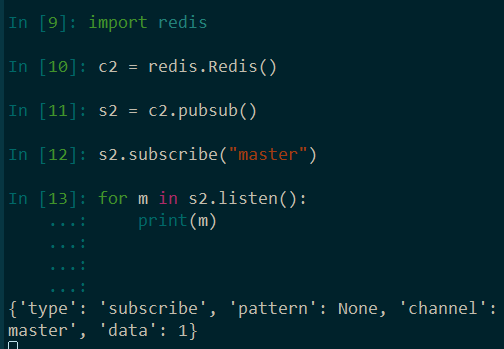

# 网络服务中间件

这次我们来学习下如何使用Memcached，Redis，Celery等网络中间件的技术。

## 一.Memcached

#### 1.概念与特点

Memcached其实就是一个优秀的缓存系统，能够让访问过的数据读取更快，提升效率。

缓存的由来是什么，其实就是web应用程序和数据库交互的过程中，如何让数据的流通速度更快，于是就提出了缓存的概念，这样一来已经访问过且频率高的数据能够通过访问提取，而不需要通过数据库。

如果不弄缓存，就会访问量增加，每秒处理请求增多，数据库服务器压力过大……等等一些列问题。

&nbsp;

所以加上缓存的概念之后，web应用程序、数据库和缓存的三方交互效果如下:


我们现在要学习的Memcached就是这样的一个缓存系统，其实Redis也可以做缓存系统。

那么它的特点有哪些呢？

- 开源，协议简单，高效
- 速度快，内存存储，断电后会消失，不是数据持久性存硬盘
- 数据满了之后会通过LRU缓存淘汰的机制来删除

&nbsp;

#### 2.安装与使用

如果要使用Memcached缓存系统，我们需要一个虚拟机作为它的服务器。

我打开了CentOS 7的linux系统，并输入`yum install memcached`进行安装

然后我输入`which memcached`来确定它的位置，得出它在这儿：


`/bin/memcached -p 11211 -m 128m -u root -vv`

启动memcached，设置端口为11211，内存最大为128M ,root用户登录，并用-vv打印帮助说明


这样一来，memcached缓存系统已经成功地启动了。

&nbsp;

接下来我们学习下如何使用这个缓存系统来完成添加缓存和查找缓存的方法。

我们可以克隆下这个会话，然后开启memcached缓存系统的虚拟机ip为192.168.111.140

输入`telnet 192.168.111.140 11211`进行交互。

https://www.runoob.com/memcached/memcached-set-data.html


格式已经很清楚了，输入`set keyname 0 60 10`

这是什么意思呢，我要输入一个kv键值对中的k，叫做keyname，然后我设置60秒过期，值为10个字节。

下一行我再输入`abcde12345`，你会收到一个STORED，这是命中成功的意思。


然后你想要读取缓存中键对应的值，输入`get keyname`即可取出值。


set与get便是memcached最简单实际的两个方法，代表添加和读取。

&nbsp;

#### 3.Python控制

我们来讲一讲如何用Python控制memcached，这才是重头戏。

https://pymemcache.readthedocs.io/en/master/


这个是最简单暴力的教学，就是基础于上面的set与get的交互。


毫无疑问的是，我们的python成功连上了缓存系统，并返回了`b'master'`的结果，整个过程不就是最简单的kv键值对的添加与查询吗？

那么我们就弄一个难一点的缓存数据，为了大大提高数据索引的速度，我们可以设置一个字典：


为什么我们读取的时候又是decode()又是eval()呢？

因为我们读取缓存的时候，获得的是bytes类型的数据，我们需要decode()转换为正常的str，再通过eval()转换为它原本的数据类型，也就是字典。然后再访问键master的值就OK了。

&nbsp;

## 二.Redis

为什么不细讲memcached，只是带大家了解一下，就转到Redis呢？

我们知道，Redis也能用来做缓存系统，而且还是全世界都在用。

#### 1.缓存系统

相比较memcached来说，redis的可靠性明显大大提升。

Redis最大的特点就是使用单线程，具有优化的能力，所以性能只比memcached稍微落后点。

但它能做的事情却很强大，适合更多数据操作，方便网络传输，更重要的是能在硬盘持久化。


所以我们写代码的方法还是差不多的，还是set与get：


&nbsp;

#### 2.订阅系统

redis也能用来做订阅系统吗，是的，在软件架构中，发布-订阅是一种消息范式。


现在我们来试试这个redis的订阅系统，我们先打开两个cmd，一起尝试：


一边先填上订阅者的名字：`SUBSCRIBE master`

另一边则给master客户发布消息：`PUBLISH master 'python is good'`


如果右侧再发一条呢？`PUBLISH master "java is good,too"`


这个就是一个简单的订阅-发布的交互过程。

现在，我们来创建两个Shell，确保这两者之间能互相交互：


c1，你可以理解为发布者对象，或者一个电台。而c2，就是订阅者，或者收听电台的人。

这跟上面的PUBLISH发布和SUBSCRIBE订阅的效果是一样的。

首先，c1先发布一两条消息：


然后订阅者c2选择订阅c1：


订阅成功以后，遍历订阅后的消息成果：



很显然是没有收到过往的订阅邮件，因为你必须要订阅后才能收到最新的邮件，过去的邮件是收不到的，所以这个时候，电台再发布一条新的消息，右边就自然而然的收到了：


这是因为`s2.listen()`属于生成器类型，并不会遍历后结束，反而在原地等待新的消息并遍历出来。

&nbsp;

#### 3.订阅程序

现在，我们通过shell摸清楚了redis的发布-订阅的基本使用方法，我们可以开始写程序了。

```
发布：PUBLISH
c = redis.StrictRedis()
c.publish("name","message")
------
订阅：SUBSCRIBE
c = redis.Redis()
s = c.pubsub()
s.subscribe("name")
s.listen()
```

首先我们先来开发一下发布者的py文件，创建redis_pub.py，根据上面的指引，进行开发：


是不是很简单，while True弄一个无限循环就可以了。

现在再来看看订阅者的py文件，创建redis_sub.py，接收消息如下：


也是很简单的编写方法，基于上面的方法总结里面。

现在我要分别运行这两个程序，发布者在vscode，订阅者在shell：


很明显，做得非常成功！但是问题来了，这样的消息明显效果不好，为什么不优化成更通俗的呢？


现在订阅者收到的消息是这个样子的：


当然了，一个用户也不可能只订阅一个频道，也是可以的，你可以全部进行订阅，只需要略改代码：


&nbsp;

## 三.RabbitMQ

RabbitMQ是一款企业级消息系统的软件，被广泛使用。

